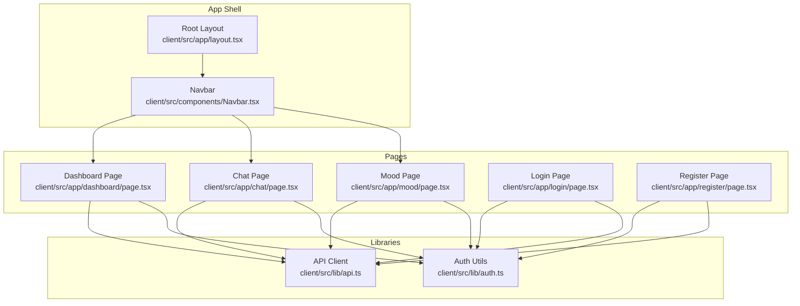
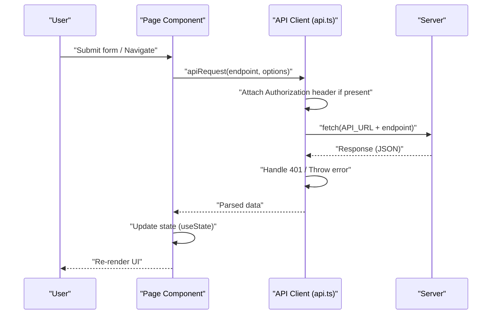
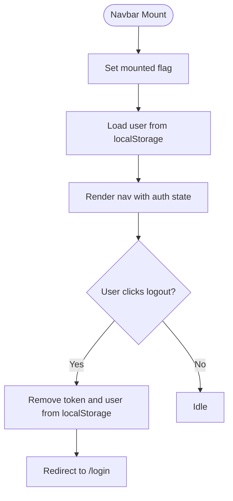
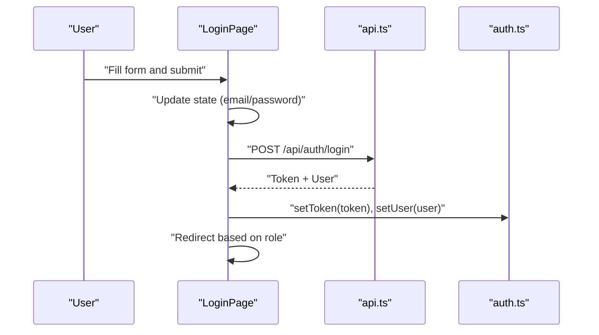
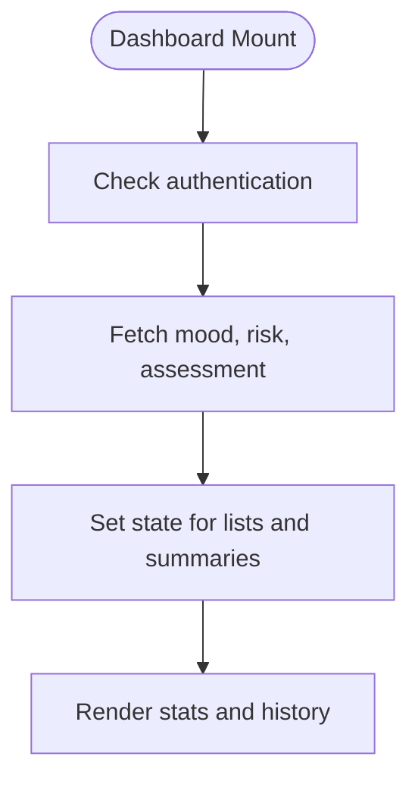
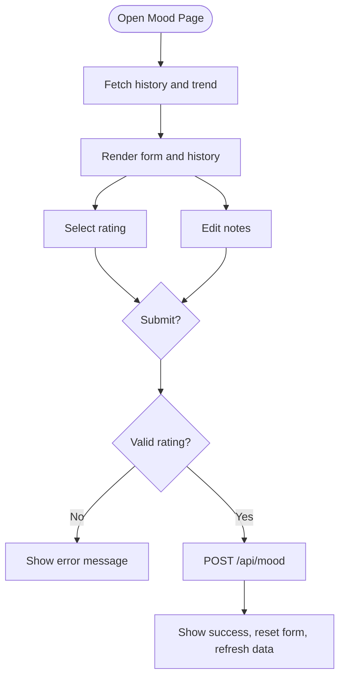
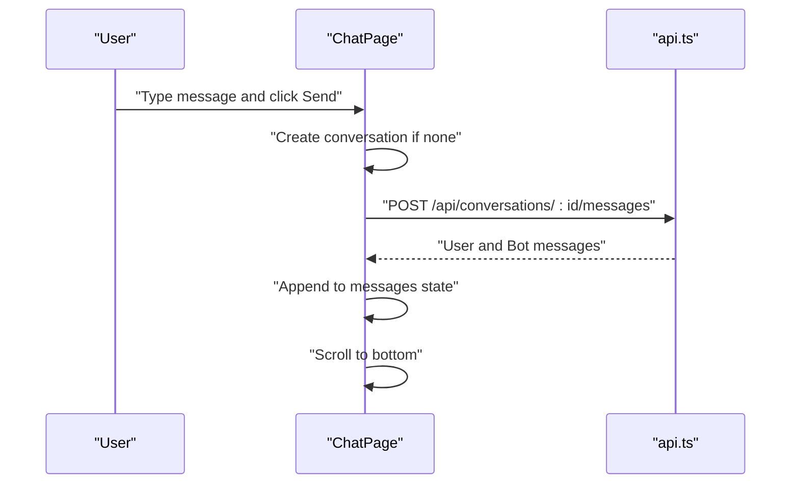
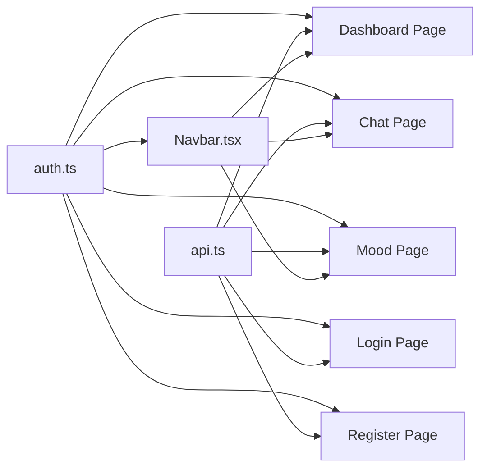

# State Management

<cite>
**Referenced Files in This Document**
- [layout.tsx](file://client/src/app/layout.tsx)
- [Navbar.tsx](file://client/src/components/Navbar.tsx)
- [auth.ts](file://client/src/lib/auth.ts)
- [api.ts](file://client/src/lib/api.ts)
- [page.tsx (Chat)](file://client/src/app/chat/page.tsx)
- [page.tsx (Dashboard)](file://client/src/app/dashboard/page.tsx)
- [page.tsx (Mood)](file://client/src/app/mood/page.tsx)
- [page.tsx (Login)](file://client/src/app/login/page.tsx)
- [page.tsx (Register)](file://client/src/app/register/page.tsx)
</cite>

## Table of Contents
1. [Introduction](#introduction)
2. [Project Structure](#project-structure)
3. [Core Components](#core-components)
4. [Architecture Overview](#architecture-overview)
5. [Detailed Component Analysis](#detailed-component-analysis)
6. [Dependency Analysis](#dependency-analysis)
7. [Performance Considerations](#performance-considerations)
8. [Troubleshooting Guide](#troubleshooting-guide)
9. [Conclusion](#conclusion)
10. [Appendices](#appendices)

## Introduction
This document explains state management patterns and data flow in the Next.js client application. It focuses on:
- Local component state with useState and useEffect
- Authentication state persisted via localStorage
- Form state, validation state, and controlled components
- Real-time-like state updates for chat and dashboard
- State persistence and cleanup
- Performance optimization strategies and guidance for choosing state management approaches

## Project Structure
The client application follows a conventional Next.js App Router layout with route-based pages and shared UI components. Authentication state is centralized in a small utility module and consumed by pages and the navigation bar. API requests are abstracted behind a single helper that injects tokens and handles errors.

**Diagram sources**
- [layout.tsx:1-38](file://client/src/app/layout.tsx#L1-L38)
- [Navbar.tsx:1-96](file://client/src/components/Navbar.tsx#L1-L96)
- [page.tsx (Dashboard):1-206](file://client/src/app/dashboard/page.tsx#L1-L206)
- [page.tsx (Chat):1-196](file://client/src/app/chat/page.tsx#L1-L196)
- [page.tsx (Mood):1-245](file://client/src/app/mood/page.tsx#L1-L245)
- [page.tsx (Login):1-108](file://client/src/app/login/page.tsx#L1-L108)
- [page.tsx (Register):1-120](file://client/src/app/register/page.tsx#L1-L120)
- [auth.ts:1-27](file://client/src/lib/auth.ts#L1-L27)
- [api.ts:1-36](file://client/src/lib/api.ts#L1-L36)

**Section sources**
- [layout.tsx:1-38](file://client/src/app/layout.tsx#L1-L38)
- [Navbar.tsx:1-96](file://client/src/components/Navbar.tsx#L1-L96)
- [auth.ts:1-27](file://client/src/lib/auth.ts#L1-L27)
- [api.ts:1-36](file://client/src/lib/api.ts#L1-L36)

## Core Components
- Authentication state: stored in localStorage and exposed via helper functions for token and user retrieval, presence checks, and removal.
- API client: centralizes HTTP requests, injects Authorization header when available, normalizes 401 responses, and parses JSON.
- Pages: each page manages its own local state with useState and useEffect, orchestrates data fetching, and renders UI.

Key responsibilities:
- Navbar: reads user from localStorage, conditionally renders links and logout action.
- Login/Register: manage form state, submit to backend, persist token and user, redirect on success.
- Dashboard/Mood/Chat: manage lists, forms, loading/error states, and UI rendering.

**Section sources**
- [auth.ts:1-27](file://client/src/lib/auth.ts#L1-L27)
- [api.ts:1-36](file://client/src/lib/api.ts#L1-L36)
- [Navbar.tsx:1-96](file://client/src/components/Navbar.tsx#L1-L96)
- [page.tsx (Login):1-108](file://client/src/app/login/page.tsx#L1-L108)
- [page.tsx (Register):1-120](file://client/src/app/register/page.tsx#L1-L120)
- [page.tsx (Dashboard):1-206](file://client/src/app/dashboard/page.tsx#L1-L206)
- [page.tsx (Mood):1-245](file://client/src/app/mood/page.tsx#L1-L245)
- [page.tsx (Chat):1-196](file://client/src/app/chat/page.tsx#L1-L196)

## Architecture Overview
The state lifecycle across the app follows predictable patterns:
- Authentication: token and user are persisted in localStorage; pages check authentication and redirect unauthenticated users.
- Data fetching: pages call the API client, which attaches the token and handles errors; successful responses update component state.
- UI updates: state changes trigger re-renders; pages render lists, forms, and loading indicators.

**Diagram sources**
- [api.ts:1-36](file://client/src/lib/api.ts#L1-L36)
- [page.tsx (Login):16-40](file://client/src/app/login/page.tsx#L16-L40)
- [page.tsx (Register):17-36](file://client/src/app/register/page.tsx#L17-L36)
- [page.tsx (Dashboard):51-69](file://client/src/app/dashboard/page.tsx#L51-L69)
- [page.tsx (Mood):63-91](file://client/src/app/mood/page.tsx#L63-L91)
- [page.tsx (Chat):38-53](file://client/src/app/chat/page.tsx#L38-L53)

## Detailed Component Analysis

### Authentication State and Navigation
- Token and user are persisted in localStorage and retrieved via helper functions.
- Navbar reads user and role to conditionally render menu items and show user info.
- On logout, token and user are removed and the user is redirected to login.

**Diagram sources**
- [Navbar.tsx:13-22](file://client/src/components/Navbar.tsx#L13-L22)
- [auth.ts:1-27](file://client/src/lib/auth.ts#L1-L27)

**Section sources**
- [Navbar.tsx:1-96](file://client/src/components/Navbar.tsx#L1-L96)
- [auth.ts:1-27](file://client/src/lib/auth.ts#L1-L27)

### Login and Registration Forms
- Controlled components: form fields bind to state via onChange handlers.
- Validation state: error and loading flags guide UX and button states.
- Submission: posts credentials, persists token and user, redirects based on role.

**Diagram sources**
- [page.tsx (Login):16-40](file://client/src/app/login/page.tsx#L16-L40)
- [auth.ts:6-22](file://client/src/lib/auth.ts#L6-L22)
- [api.ts:3-35](file://client/src/lib/api.ts#L3-L35)

**Section sources**
- [page.tsx (Login):1-108](file://client/src/app/login/page.tsx#L1-L108)
- [page.tsx (Register):1-120](file://client/src/app/register/page.tsx#L1-L120)
- [auth.ts:1-27](file://client/src/lib/auth.ts#L1-L27)
- [api.ts:1-36](file://client/src/lib/api.ts#L1-L36)

### Dashboard: Lists, Loading, and Conditional Rendering
- Uses Promise.allSettled to fetch multiple resources concurrently.
- Manages loading and displays placeholders while data arrives.
- Renders summary cards and recent entries with color-coded severity/risk.

**Diagram sources**
- [page.tsx (Dashboard):37-69](file://client/src/app/dashboard/page.tsx#L37-L69)

**Section sources**
- [page.tsx (Dashboard):1-206](file://client/src/app/dashboard/page.tsx#L1-L206)

### Mood Tracking: Controlled Inputs, Validation, and Submission
- Controlled radio-style selection and textarea bound to state.
- Validation occurs before submission; error/success messages are shown.
- After successful submission, form resets and data is refreshed.

**Diagram sources**
- [page.tsx (Mood):40-91](file://client/src/app/mood/page.tsx#L40-L91)

**Section sources**
- [page.tsx (Mood):1-245](file://client/src/app/mood/page.tsx#L1-L245)

### Chat: Real-time-like Updates and Controlled Inputs
- Maintains conversationId, messages array, input, and loading flags.
- On mount, loads existing conversations and scrolls to bottom when messages change.
- Controlled input sends messages, creates a conversation if needed, and appends user/bot messages to the list.

**Diagram sources**
- [page.tsx (Chat):26-107](file://client/src/app/chat/page.tsx#L26-L107)

**Section sources**
- [page.tsx (Chat):1-196](file://client/src/app/chat/page.tsx#L1-L196)

## Dependency Analysis
- Pages depend on the API client for network operations and on auth helpers for token/user state.
- Navbar depends on auth helpers to render menus and user info.
- There are no explicit context providers in the analyzed files; state is local to components and persisted in localStorage.

**Diagram sources**
- [auth.ts:1-27](file://client/src/lib/auth.ts#L1-L27)
- [api.ts:1-36](file://client/src/lib/api.ts#L1-L36)
- [Navbar.tsx:1-96](file://client/src/components/Navbar.tsx#L1-L96)
- [page.tsx (Login):1-108](file://client/src/app/login/page.tsx#L1-L108)
- [page.tsx (Register):1-120](file://client/src/app/register/page.tsx#L1-L120)
- [page.tsx (Dashboard):1-206](file://client/src/app/dashboard/page.tsx#L1-L206)
- [page.tsx (Mood):1-245](file://client/src/app/mood/page.tsx#L1-L245)
- [page.tsx (Chat):1-196](file://client/src/app/chat/page.tsx#L1-L196)

**Section sources**
- [auth.ts:1-27](file://client/src/lib/auth.ts#L1-L27)
- [api.ts:1-36](file://client/src/lib/api.ts#L1-L36)
- [Navbar.tsx:1-96](file://client/src/components/Navbar.tsx#L1-L96)
- [page.tsx (Login):1-108](file://client/src/app/login/page.tsx#L1-L108)
- [page.tsx (Register):1-120](file://client/src/app/register/page.tsx#L1-L120)
- [page.tsx (Dashboard):1-206](file://client/src/app/dashboard/page.tsx#L1-L206)
- [page.tsx (Mood):1-245](file://client/src/app/mood/page.tsx#L1-L245)
- [page.tsx (Chat):1-196](file://client/src/app/chat/page.tsx#L1-L196)

## Performance Considerations
- Prefer local state for UI flags (loading, submitting, sending) to avoid unnecessary global state overhead.
- Batch related state updates after API responses to minimize re-renders.
- Memoize derived values (e.g., computed styles or labels) outside of render-heavy loops when lists grow large.
- Normalize data by storing arrays of primitives or simple objects keyed by id to enable efficient updates and avoid deep equality checks.
- Use controlled components to keep input state synchronized and reduce redundant DOM attributes.
- Avoid heavy computations inside render; compute off-main-thread if needed.
- For real-time features, consider WebSocket subscriptions and update state via lightweight event handlers; keep UI updates minimal and localized.

[No sources needed since this section provides general guidance]

## Troubleshooting Guide
Common issues and remedies:
- Unauthorized requests: The API client removes token and redirects to login on 401 responses. Ensure token is present in localStorage and that the Authorization header is attached.
- Authentication redirects: Pages check authentication on mount and redirect accordingly. Verify that token and user are persisted after login/register.
- Form submission failures: Errors are surfaced to the UI; confirm that error and success states are cleared before retrying.
- Chat not updating: Ensure messages are appended to state after receiving responses and that scroll logic runs after state updates.

**Section sources**
- [api.ts:20-26](file://client/src/lib/api.ts#L20-L26)
- [page.tsx (Login):21-39](file://client/src/app/login/page.tsx#L21-L39)
- [page.tsx (Register):22-35](file://client/src/app/register/page.tsx#L22-L35)
- [page.tsx (Mood):63-91](file://client/src/app/mood/page.tsx#L63-L91)
- [page.tsx (Chat):55-107](file://client/src/app/chat/page.tsx#L55-L107)

## Conclusion
The application relies on local component state and localStorage for authentication, with centralized API and auth utilities. Pages orchestrate data fetching, manage forms, and render lists with clear loading and error states. For current scale, this approach is sufficient. As features grow, consider:
- Introducing lightweight context providers for shared UI preferences or small cross-cutting concerns.
- Adopting a state library only when global state becomes unwieldy or cross-page coordination increases.
- Implementing normalization and memoization for large datasets and frequent updates.

[No sources needed since this section summarizes without analyzing specific files]

## Appendices

### Guidelines for Choosing State Management Approaches
- Use local state (useState/useEffect) for UI flags, small component-local data, and ephemeral inputs.
- Persist critical user/session data in localStorage and expose via small helpers; consume in pages and shared components.
- Use controlled components for forms to keep state predictable and validated.
- For real-time features, implement subscription patterns and update local state efficiently; keep UI updates minimal.
- Normalize data structures to simplify updates and improve performance.
- Avoid premature abstraction; start with local state and move to context or a library only when justified by complexity.

[No sources needed since this section provides general guidance]