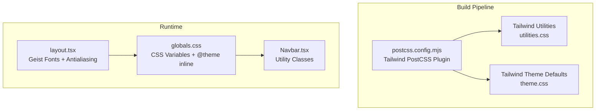
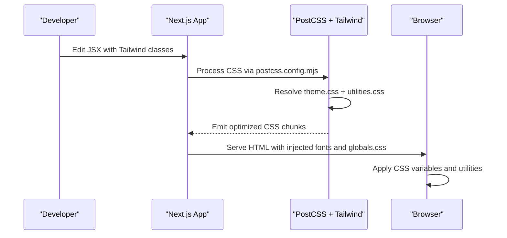
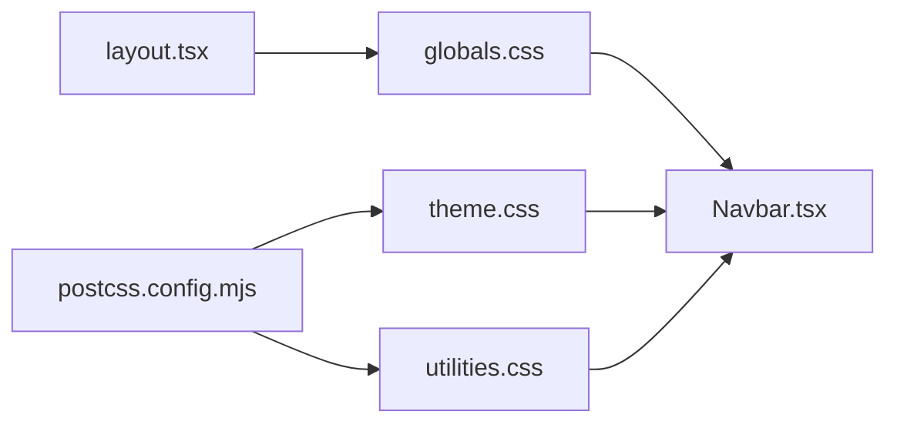

# Styling and Theming

<cite>
**Referenced Files in This Document**
- [globals.css](file://client/src/app/globals.css)
- [layout.tsx](file://client/src/app/layout.tsx)
- [postcss.config.mjs](file://client/postcss.config.mjs)
- [package.json](file://client/package.json)
- [Navbar.tsx](file://client/src/components/Navbar.tsx)
- [theme.css](file://client/node_modules/tailwindcss/theme.css)
- [utilities.css](file://client/node_modules/tailwindcss/utilities.css)
- [page.tsx (assessment)](file://client/src/app/assessment/page.tsx)
- [page.tsx (chat)](file://client/src/app/chat/page.tsx)
- [page.tsx (dashboard)](file://client/src/app/dashboard/page.tsx)
</cite>

## Table of Contents
1. [Introduction](#introduction)
2. [Project Structure](#project-structure)
3. [Core Components](#core-components)
4. [Architecture Overview](#architecture-overview)
5. [Detailed Component Analysis](#detailed-component-analysis)
6. [Dependency Analysis](#dependency-analysis)
7. [Performance Considerations](#performance-considerations)
8. [Troubleshooting Guide](#troubleshooting-guide)
9. [Conclusion](#conclusion)

## Introduction
This document explains the styling and theming system built with Tailwind CSS v4 in the Next.js client application. It covers global CSS configuration, font loading via next/font/google with Geist fonts, the utility-first approach, color schemes, typography scales, spacing systems, responsive breakpoints, component-specific styling patterns, dark mode behavior, accessibility considerations, cross-browser compatibility, and performance optimization techniques for CSS delivery.

## Project Structure
The styling pipeline integrates Tailwind’s PostCSS plugin, Next.js font optimization, and global CSS variables to deliver a consistent, theme-aware design system across pages and components.

**Diagram sources**
- [postcss.config.mjs:1-8](file://client/postcss.config.mjs#L1-L8)
- [utilities.css:1-2](file://client/node_modules/tailwindcss/utilities.css#L1-L2)
- [theme.css:1-511](file://client/node_modules/tailwindcss/theme.css#L1-L511)
- [layout.tsx:1-38](file://client/src/app/layout.tsx#L1-L38)
- [globals.css:1-20](file://client/src/app/globals.css#L1-L20)
- [Navbar.tsx:1-96](file://client/src/components/Navbar.tsx#L1-L96)

**Section sources**
- [postcss.config.mjs:1-8](file://client/postcss.config.mjs#L1-L8)
- [package.json:1-27](file://client/package.json#L1-L27)
- [layout.tsx:1-38](file://client/src/app/layout.tsx#L1-L38)
- [globals.css:1-20](file://client/src/app/globals.css#L1-L20)

## Core Components
- Global CSS and theme variables: Establishes CSS custom properties for background/foreground and font families, and binds Tailwind’s theme tokens to CSS variables.
- Tailwind PostCSS plugin: Enables Tailwind directives and utilities during build.
- Font loading: next/font/google loads Geist Sans and Geist Mono with CSS variable injection for runtime substitution.
- Utility-first components: Components apply Tailwind utilities directly in JSX for rapid iteration and consistency.

Key implementation references:
- Global variables and theme binding: [globals.css:1-20](file://client/src/app/globals.css#L1-L20)
- Tailwind PostCSS plugin: [postcss.config.mjs:1-8](file://client/postcss.config.mjs#L1-L8)
- Font variables and antialiasing: [layout.tsx:6-31](file://client/src/app/layout.tsx#L6-L31)

**Section sources**
- [globals.css:1-20](file://client/src/app/globals.css#L1-L20)
- [postcss.config.mjs:1-8](file://client/postcss.config.mjs#L1-L8)
- [layout.tsx:6-31](file://client/src/app/layout.tsx#L6-L31)

## Architecture Overview
The styling architecture combines:
- Build-time: Tailwind generates utilities and theme tokens from theme.css and utilities.css.
- Runtime: layout.tsx injects font variables and antialiasing; globals.css applies CSS variables and base styles.
- Component layer: UI components use Tailwind utilities for layout, color, typography, spacing, and motion.

**Diagram sources**
- [postcss.config.mjs:1-8](file://client/postcss.config.mjs#L1-L8)
- [theme.css:1-511](file://client/node_modules/tailwindcss/theme.css#L1-L511)
- [utilities.css:1-2](file://client/node_modules/tailwindcss/utilities.css#L1-L2)
- [layout.tsx:27-35](file://client/src/app/layout.tsx#L27-L35)
- [globals.css:15-19](file://client/src/app/globals.css#L15-L19)

## Detailed Component Analysis

### Global CSS and Theme Variables
- CSS variables define background and foreground tokens and bind them to Tailwind’s theme variables.
- Body styles inherit font family from CSS variables and fallback stack.
- @theme inline bridges Tailwind’s theme tokens to CSS variables for dynamic theming.

Implementation highlights:
- Variable declarations and @theme inline: [globals.css:3-13](file://client/src/app/globals.css#L3-L13)
- Body font and color application: [globals.css:15-19](file://client/src/app/globals.css#L15-L19)

**Section sources**
- [globals.css:3-19](file://client/src/app/globals.css#L3-L19)

### Font Loading Strategy (Geist)
- Geist Sans and Geist Mono are loaded via next/font/google with variable injection.
- The html element receives font variable classes and antialiasing for crisp rendering.

Implementation highlights:
- Font instantiation and variable assignment: [layout.tsx:6-14](file://client/src/app/layout.tsx#L6-L14)
- Applying variables and antialiasing: [layout.tsx:27-31](file://client/src/app/layout.tsx#L27-L31)

**Section sources**
- [layout.tsx:6-14](file://client/src/app/layout.tsx#L6-L14)
- [layout.tsx:27-31](file://client/src/app/layout.tsx#L27-L31)

### Tailwind PostCSS Integration
- The PostCSS configuration enables Tailwind’s directives and utilities.
- Tailwind’s theme defaults and utilities are resolved from node_modules.

Implementation highlights:
- Plugin configuration: [postcss.config.mjs:1-8](file://client/postcss.config.mjs#L1-L8)
- Theme defaults and utilities: [theme.css:1-511](file://client/node_modules/tailwindcss/theme.css#L1-L511), [utilities.css:1-2](file://client/node_modules/tailwindcss/utilities.css#L1-L2)

**Section sources**
- [postcss.config.mjs:1-8](file://client/postcss.config.mjs#L1-L8)
- [theme.css:1-511](file://client/node_modules/tailwindcss/theme.css#L1-L511)
- [utilities.css:1-2](file://client/node_modules/tailwindcss/utilities.css#L1-L2)

### Color Schemes and Dark Mode
- Tailwind’s default theme defines a broad palette (e.g., blue, indigo, purple, gray) and semantic tokens.
- Dark mode is supported via Tailwind’s dark: variants and CSS variables; the dark variant toggles tokens for backgrounds, text, and borders.

Implementation highlights:
- Default color tokens and palettes: [theme.css:130-176](file://client/node_modules/tailwindcss/theme.css#L130-L176)
- Dark mode selectors and overrides: [theme.css:500-511](file://client/node_modules/tailwindcss/theme.css#L500-L511)
- Example usage in components: [Navbar.tsx:30](file://client/src/components/Navbar.tsx#L30), [page.tsx (assessment):108](file://client/src/app/assessment/page.tsx#L108)

**Section sources**
- [theme.css:130-176](file://client/node_modules/tailwindcss/theme.css#L130-L176)
- [theme.css:500-511](file://client/node_modules/tailwindcss/theme.css#L500-L511)
- [Navbar.tsx:30](file://client/src/components/Navbar.tsx#L30)
- [page.tsx (assessment):108](file://client/src/app/assessment/page.tsx#L108)

### Typography Scale and Leading
- Tailwind defines a comprehensive text scale with sizes and line-heights derived from base units.
- Semantic font weights and letter-spacing tokens are available for consistent typographic rhythm.

Implementation highlights:
- Text scale and line-heights: [theme.css:347-372](file://client/node_modules/tailwindcss/theme.css#L347-L372)
- Font weights: [theme.css:374-382](file://client/node_modules/tailwindcss/theme.css#L374-L382)
- Letter-spacing tokens: [theme.css:384-389](file://client/node_modules/tailwindcss/theme.css#L384-L389)

**Section sources**
- [theme.css:347-389](file://client/node_modules/tailwindcss/theme.css#L347-L389)

### Spacing System and Containers
- A base spacing unit drives padding, margin, width, height, gap, and max-width utilities.
- Container widths are defined for responsive breakpoints.

Implementation highlights:
- Base spacing unit: [theme.css:325](file://client/node_modules/tailwindcss/theme.css#L325)
- Container widths: [theme.css:333-345](file://client/node_modules/tailwindcss/theme.css#L333-L345)
- Breakpoints: [theme.css:327-331](file://client/node_modules/tailwindcss/theme.css#L327-L331)

**Section sources**
- [theme.css:325](file://client/node_modules/tailwindcss/theme.css#L325)
- [theme.css:333-345](file://client/node_modules/tailwindcss/theme.css#L333-L345)
- [theme.css:327-331](file://client/node_modules/tailwindcss/theme.css#L327-L331)

### Responsive Breakpoints
- Breakpoints align with Tailwind’s default theme and are used to scope responsive utilities.
- Examples include sm, md, lg, xl, 2xl.

Implementation highlights:
- Breakpoint tokens: [theme.css:327-331](file://client/node_modules/tailwindcss/theme.css#L327-L331)
- Usage in components: [layout.tsx:29](file://client/src/app/layout.tsx#L29), [page.tsx (assessment):132](file://client/src/app/assessment/page.tsx#L132)

**Section sources**
- [theme.css:327-331](file://client/node_modules/tailwindcss/theme.css#L327-L331)
- [layout.tsx:29](file://client/src/app/layout.tsx#L29)
- [page.tsx (assessment):132](file://client/src/app/assessment/page.tsx#L132)

### Component-Specific Styling Patterns
- Navbar: Uses indigo palette, transitions, shadows, and responsive paddings.
- Assessment Results: Severity-based color cards with contextual messaging.
- Chat: Message bubbles with sender-specific color roles and rounded variants.
- Dashboard: Stat cards and action tiles with semantic color classes.

Implementation highlights:
- Navbar utilities: [Navbar.tsx:30-93](file://client/src/components/Navbar.tsx#L30-L93)
- Assessment severity cards: [page.tsx (assessment):108](file://client/src/app/assessment/page.tsx#L108)
- Chat message bubbles: [page.tsx (chat):144-156](file://client/src/app/chat/page.tsx#L144-L156)
- Dashboard stats and actions: [page.tsx (dashboard):115-174](file://client/src/app/dashboard/page.tsx#L115-L174)

**Section sources**
- [Navbar.tsx:30-93](file://client/src/components/Navbar.tsx#L30-L93)
- [page.tsx (assessment):108](file://client/src/app/assessment/page.tsx#L108)
- [page.tsx (chat):144-156](file://client/src/app/chat/page.tsx#L144-L156)
- [page.tsx (dashboard):115-174](file://client/src/app/dashboard/page.tsx#L115-L174)

### Animations and Motion
- Tailwind provides built-in animations (spin, pulse, ping, bounce) and timing functions.
- Components can leverage these utilities for subtle feedback.

Implementation highlights:
- Animation tokens and keyframes: [theme.css:438-474](file://client/node_modules/tailwindcss/theme.css#L438-L474)
- Example usage in components: [page.tsx (assessment):122](file://client/src/app/assessment/page.tsx#L122)

**Section sources**
- [theme.css:438-474](file://client/node_modules/tailwindcss/theme.css#L438-L474)
- [page.tsx (assessment):122](file://client/src/app/assessment/page.tsx#L122)

### Accessibility Considerations
- Antialiasing is enabled at the html level for smoother text rendering.
- Semantic color tokens and dark mode support improve contrast and readability.
- Focus states and ring utilities help indicate interactive focus.

Implementation highlights:
- Antialiasing class on html: [layout.tsx:29](file://client/src/app/layout.tsx#L29)
- Focus and ring utilities: [theme.css:406-423](file://client/node_modules/tailwindcss/theme.css#L406-L423)

**Section sources**
- [layout.tsx:29](file://client/src/app/layout.tsx#L29)
- [theme.css:406-423](file://client/node_modules/tailwindcss/theme.css#L406-L423)

### Cross-Browser Compatibility
- Tailwind’s theme defaults include vendor-prefixed properties and fallbacks for motion and shadow utilities.
- CSS variables bridge theme tokens across browsers.

Implementation highlights:
- Vendor property definitions and fallbacks: [theme.css:492-500](file://client/node_modules/tailwindcss/theme.css#L492-L500)
- CSS variables bridging: [globals.css:8-13](file://client/src/app/globals.css#L8-L13)

**Section sources**
- [theme.css:492-500](file://client/node_modules/tailwindcss/theme.css#L492-L500)
- [globals.css:8-13](file://client/src/app/globals.css#L8-L13)

## Dependency Analysis
The styling system depends on Tailwind’s theme and utilities, Next.js font optimization, and CSS variables for runtime theming.

**Diagram sources**
- [postcss.config.mjs:1-8](file://client/postcss.config.mjs#L1-L8)
- [utilities.css:1-2](file://client/node_modules/tailwindcss/utilities.css#L1-L2)
- [theme.css:1-511](file://client/node_modules/tailwindcss/theme.css#L1-L511)
- [layout.tsx:27-35](file://client/src/app/layout.tsx#L27-L35)
- [globals.css:15-19](file://client/src/app/globals.css#L15-L19)
- [Navbar.tsx:30](file://client/src/components/Navbar.tsx#L30)

**Section sources**
- [postcss.config.mjs:1-8](file://client/postcss.config.mjs#L1-L8)
- [utilities.css:1-2](file://client/node_modules/tailwindcss/utilities.css#L1-L2)
- [theme.css:1-511](file://client/node_modules/tailwindcss/theme.css#L1-L511)
- [layout.tsx:27-35](file://client/src/app/layout.tsx#L27-L35)
- [globals.css:15-19](file://client/src/app/globals.css#L15-L19)
- [Navbar.tsx:30](file://client/src/components/Navbar.tsx#L30)

## Performance Considerations
- Font optimization: next/font/google self-hosts and optimizes font assets with variable injection to avoid layout shifts.
- CSS delivery: Tailwind’s PostCSS plugin emits only used utilities, minimizing CSS payload.
- CSS variables: Centralized theme tokens reduce duplication and enable efficient runtime switching.
- Minimize custom CSS: Prefer Tailwind utilities to keep styles scoped and tree-shakeable.

[No sources needed since this section provides general guidance]

## Troubleshooting Guide
- Fonts not applying: Verify font variable classes are attached to html and that the font subsets match content.
  - Reference: [layout.tsx:27-31](file://client/src/app/layout.tsx#L27-L31)
- Unexpected colors or missing dark mode: Ensure dark: variants are used and CSS variables are present.
  - Reference: [theme.css:500-511](file://client/node_modules/tailwindcss/theme.css#L500-L511)
- Utility not found: Confirm Tailwind PostCSS plugin is configured and utilities.css is included.
  - Reference: [postcss.config.mjs:1-8](file://client/postcss.config.mjs#L1-L8), [utilities.css:1-2](file://client/node_modules/tailwindcss/utilities.css#L1-L2)
- Layout shift or font flicker: Ensure fonts are preloaded via next/font/google and antialiasing is applied.
  - Reference: [layout.tsx:27-31](file://client/src/app/layout.tsx#L27-L31)

**Section sources**
- [layout.tsx:27-31](file://client/src/app/layout.tsx#L27-L31)
- [theme.css:500-511](file://client/node_modules/tailwindcss/theme.css#L500-L511)
- [postcss.config.mjs:1-8](file://client/postcss.config.mjs#L1-L8)
- [utilities.css:1-2](file://client/node_modules/tailwindcss/utilities.css#L1-L2)

## Conclusion
The styling and theming system leverages Tailwind CSS v4 with a utility-first approach, optimized font loading via next/font/google, and CSS variables for dynamic theming. The combination of theme defaults, responsive breakpoints, and dark mode support ensures a consistent, accessible, and performant design system across components and pages.