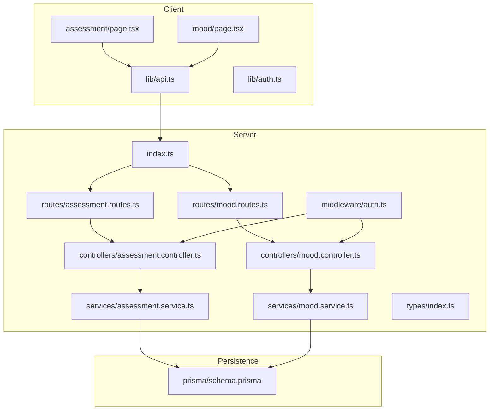
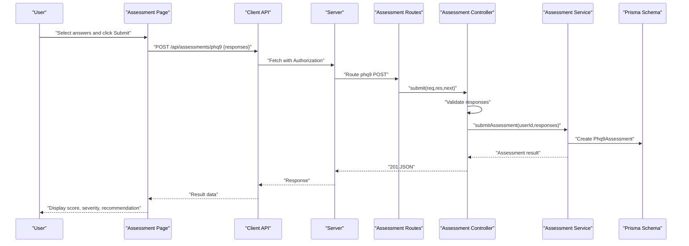
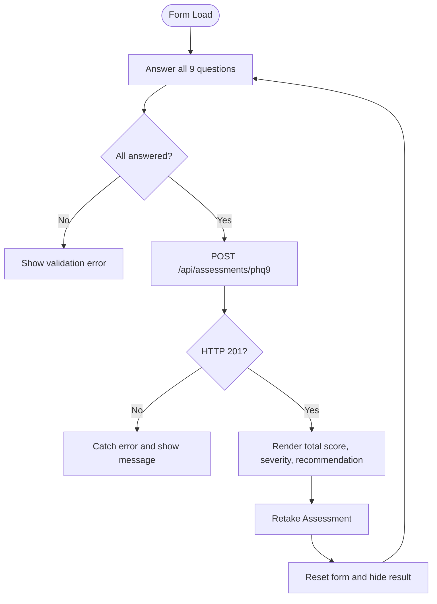
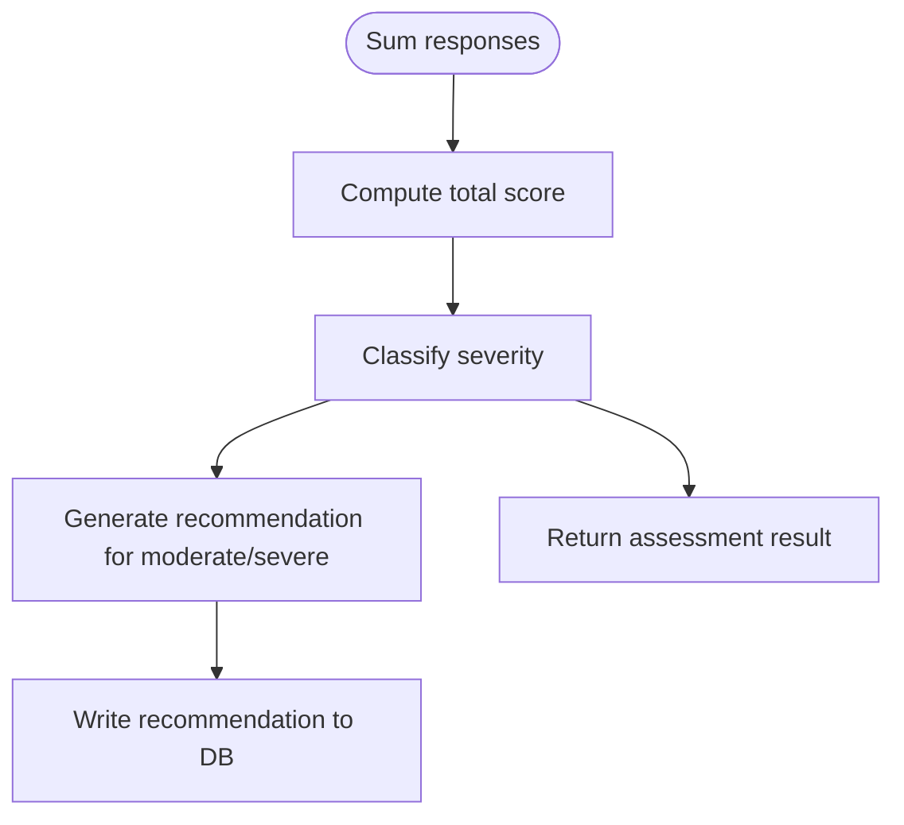
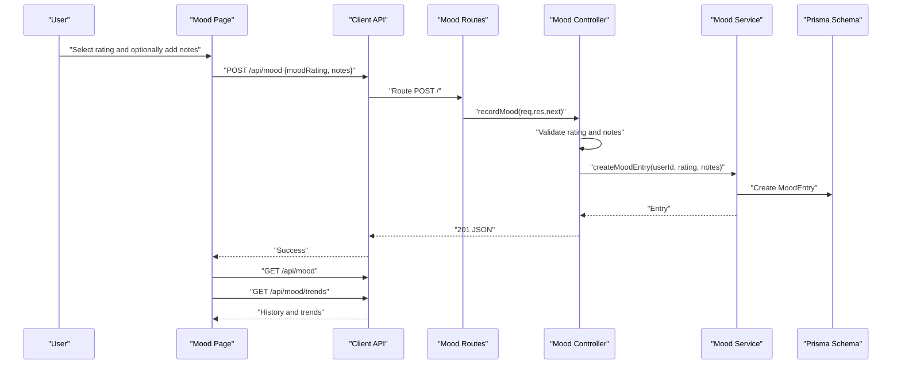
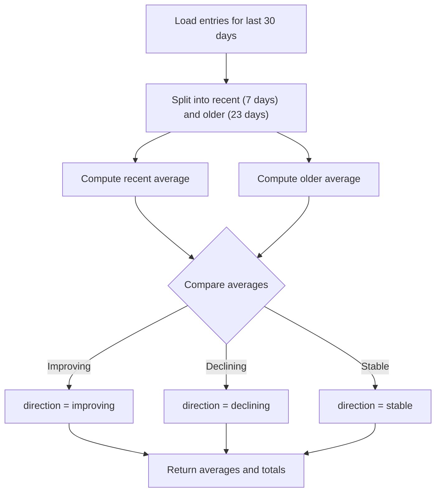
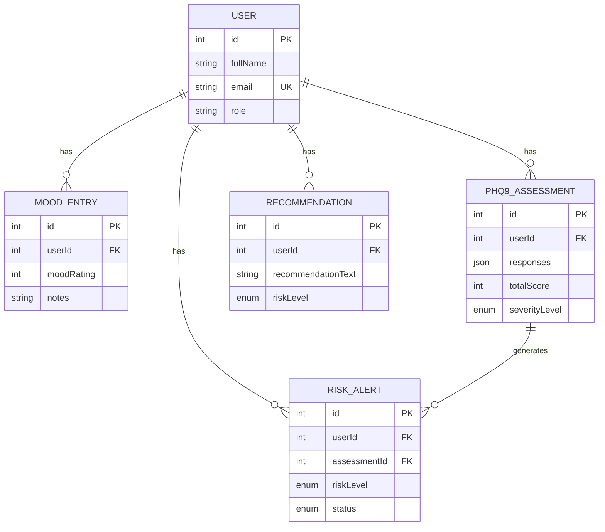
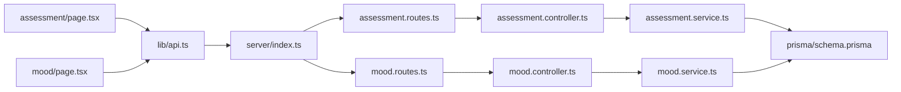

# Assessment and Mood Components

<cite>
**Referenced Files in This Document**
- [assessment/page.tsx](file://client/src/app/assessment/page.tsx)
- [mood/page.tsx](file://client/src/app/mood/page.tsx)
- [api.ts](file://client/src/lib/api.ts)
- [auth.ts](file://client/src/lib/auth.ts)
- [assessment.controller.ts](file://server/src/controllers/assessment.controller.ts)
- [mood.controller.ts](file://server/src/controllers/mood.controller.ts)
- [assessment.service.ts](file://server/src/services/assessment.service.ts)
- [mood.service.ts](file://server/src/services/mood.service.ts)
- [assessment.routes.ts](file://server/src/routes/assessment.routes.ts)
- [mood.routes.ts](file://server/src/routes/mood.routes.ts)
- [auth.middleware.ts](file://server/src/middleware/auth.ts)
- [types/index.ts](file://server/src/types/index.ts)
- [server/index.ts](file://server/src/index.ts)
- [prisma/schema.prisma](file://prisma/schema.prisma)
</cite>

## Table of Contents
1. [Introduction](#introduction)
2. [Project Structure](#project-structure)
3. [Core Components](#core-components)
4. [Architecture Overview](#architecture-overview)
5. [Detailed Component Analysis](#detailed-component-analysis)
6. [Dependency Analysis](#dependency-analysis)
7. [Performance Considerations](#performance-considerations)
8. [Troubleshooting Guide](#troubleshooting-guide)
9. [Conclusion](#conclusion)
10. [Appendices](#appendices)

## Introduction
This document provides comprehensive documentation for the assessment and mood tracking components in the BuddyAI platform. It covers the PHQ-9 questionnaire interface, scoring and severity classification, result interpretation, daily mood logging, trend analytics, and backend integration. It also documents validation patterns, data persistence, and recommendations for customization, accessibility, and integration with backend services.

## Project Structure
The application follows a clear separation of concerns:
- Client-side pages implement user-facing forms and displays for assessments and mood tracking.
- Client-side libraries encapsulate API communication and authentication helpers.
- Server-side Express routes expose REST endpoints for assessments and mood.
- Controllers enforce authentication and validate request payloads.
- Services implement domain logic and interact with Prisma ORM.
- Prisma schema defines the data model for users, assessments, mood entries, recommendations, and risk alerts.

**Diagram sources**
- [assessment/page.tsx:1-192](file://client/src/app/assessment/page.tsx#L1-L192)
- [mood/page.tsx:1-245](file://client/src/app/mood/page.tsx#L1-L245)
- [api.ts:1-36](file://client/src/lib/api.ts#L1-L36)
- [auth.ts:1-27](file://client/src/lib/auth.ts#L1-L27)
- [assessment.routes.ts:1-12](file://server/src/routes/assessment.routes.ts#L1-L12)
- [mood.routes.ts:1-12](file://server/src/routes/mood.routes.ts#L1-L12)
- [assessment.controller.ts:1-74](file://server/src/controllers/assessment.controller.ts#L1-L74)
- [mood.controller.ts:1-67](file://server/src/controllers/mood.controller.ts#L1-L67)
- [assessment.service.ts:1-89](file://server/src/services/assessment.service.ts#L1-L89)
- [mood.service.ts:1-58](file://server/src/services/mood.service.ts#L1-L58)
- [auth.middleware.ts:1-39](file://server/src/middleware/auth.ts#L1-L39)
- [types/index.ts:1-12](file://server/src/types/index.ts#L1-L12)
- [server/index.ts:1-35](file://server/src/index.ts#L1-L35)
- [prisma/schema.prisma:1-134](file://prisma/schema.prisma#L1-L134)

**Section sources**
- [assessment/page.tsx:1-192](file://client/src/app/assessment/page.tsx#L1-L192)
- [mood/page.tsx:1-245](file://client/src/app/mood/page.tsx#L1-L245)
- [api.ts:1-36](file://client/src/lib/api.ts#L1-L36)
- [auth.ts:1-27](file://client/src/lib/auth.ts#L1-L27)
- [assessment.routes.ts:1-12](file://server/src/routes/assessment.routes.ts#L1-L12)
- [mood.routes.ts:1-12](file://server/src/routes/mood.routes.ts#L1-L12)
- [assessment.controller.ts:1-74](file://server/src/controllers/assessment.controller.ts#L1-L74)
- [mood.controller.ts:1-67](file://server/src/controllers/mood.controller.ts#L1-L67)
- [assessment.service.ts:1-89](file://server/src/services/assessment.service.ts#L1-L89)
- [mood.service.ts:1-58](file://server/src/services/mood.service.ts#L1-L58)
- [auth.middleware.ts:1-39](file://server/src/middleware/auth.ts#L1-L39)
- [types/index.ts:1-12](file://server/src/types/index.ts#L1-L12)
- [server/index.ts:1-35](file://server/src/index.ts#L1-L35)
- [prisma/schema.prisma:1-134](file://prisma/schema.prisma#L1-L134)

## Core Components
- PHQ-9 Assessment Page
  - Renders nine Likert-scale questions with four response options per item.
  - Validates completeness before submission.
  - Submits responses to the backend and displays total score, severity level, and recommendation messaging.
- Mood Tracking Page
  - Provides a five-point mood rating with emoji indicators and optional notes.
  - Fetches historical entries and computed trends (average mood, total entries, trend direction).
  - Displays loading state while fetching data.
- API Layer
  - Centralized fetch wrapper adds Authorization header and handles 401 redirects.
- Authentication Helpers
  - Token and user storage helpers for client-side state.
- Backend Routes and Controllers
  - Enforce authentication, validate payloads, and delegate to services.
- Services and Persistence
  - Assessment scoring and severity classification.
  - Mood trend computation over recent and prior windows.
  - Prisma-backed data model for assessments, mood entries, recommendations, and risk alerts.

**Section sources**
- [assessment/page.tsx:8-25](file://client/src/app/assessment/page.tsx#L8-L25)
- [assessment/page.tsx:52-73](file://client/src/app/assessment/page.tsx#L52-L73)
- [assessment/page.tsx:98-130](file://client/src/app/assessment/page.tsx#L98-L130)
- [mood/page.tsx:21-27](file://client/src/app/mood/page.tsx#L21-L27)
- [mood/page.tsx:63-91](file://client/src/app/mood/page.tsx#L63-L91)
- [mood/page.tsx:182-207](file://client/src/app/mood/page.tsx#L182-L207)
- [api.ts:3-35](file://client/src/lib/api.ts#L3-L35)
- [auth.ts:1-27](file://client/src/lib/auth.ts#L1-L27)
- [assessment.controller.ts:5-34](file://server/src/controllers/assessment.controller.ts#L5-L34)
- [mood.controller.ts:5-34](file://server/src/controllers/mood.controller.ts#L5-L34)
- [assessment.service.ts:20-33](file://server/src/services/assessment.service.ts#L20-L33)
- [mood.service.ts:22-57](file://server/src/services/mood.service.ts#L22-L57)
- [prisma/schema.prisma:86-133](file://prisma/schema.prisma#L86-L133)

## Architecture Overview
The system uses a client-server architecture:
- Client pages render forms and dashboards, manage local state, and call the API.
- API routes are protected by middleware that validates JWT tokens.
- Controllers validate request bodies and call services.
- Services compute results and persist data via Prisma.
- Prisma schema defines relations among entities.

**Diagram sources**
- [assessment/page.tsx:63-67](file://client/src/app/assessment/page.tsx#L63-L67)
- [api.ts:15-35](file://client/src/lib/api.ts#L15-L35)
- [assessment.routes.ts:7-9](file://server/src/routes/assessment.routes.ts#L7-L9)
- [assessment.controller.ts:5-34](file://server/src/controllers/assessment.controller.ts#L5-L34)
- [assessment.service.ts:20-33](file://server/src/services/assessment.service.ts#L20-L33)
- [prisma/schema.prisma:97-108](file://prisma/schema.prisma#L97-L108)

## Detailed Component Analysis

### PHQ-9 Assessment Component
- Form rendering
  - Nine questions with four radio button options per question.
  - Grid layout for responsive selection.
- Validation
  - Prevents submission until all nine items are answered.
- Submission
  - Sends responses to the backend endpoint.
  - Handles errors and disables the submit button during submission.
- Result display
  - Shows total score out of 27.
  - Severity classification mapped to color-coded badges.
  - Recommendation messaging for moderate or higher severity.
  - Option to retake the assessment.

**Diagram sources**
- [assessment/page.tsx:52-73](file://client/src/app/assessment/page.tsx#L52-L73)
- [assessment/page.tsx:98-130](file://client/src/app/assessment/page.tsx#L98-L130)

**Section sources**
- [assessment/page.tsx:8-25](file://client/src/app/assessment/page.tsx#L8-L25)
- [assessment/page.tsx:46-50](file://client/src/app/assessment/page.tsx#L46-L50)
- [assessment/page.tsx:52-73](file://client/src/app/assessment/page.tsx#L52-L73)
- [assessment/page.tsx:75-90](file://client/src/app/assessment/page.tsx#L75-L90)
- [assessment/page.tsx:92-96](file://client/src/app/assessment/page.tsx#L92-L96)
- [assessment/controller.ts:14-21](file://server/src/controllers/assessment.controller.ts#L14-L21)
- [assessment/service.ts:20-33](file://server/src/services/assessment.service.ts#L20-L33)
- [assessment/service.ts:12-18](file://server/src/services/assessment.service.ts#L12-L18)

### Assessment Scoring and Severity Classification
- Scoring
  - Sum of item scores yields total score.
- Severity classification
  - Uses predefined thresholds to map total score to severity level.
- Risk and recommendation generation
  - For moderate/severe levels, generates a recommendation with risk level and text.

**Diagram sources**
- [assessment/service.ts:20-33](file://server/src/services/assessment.service.ts#L20-L33)
- [assessment/service.ts:12-18](file://server/src/services/assessment.service.ts#L12-L18)
- [assessment/service.ts:48-61](file://server/src/services/assessment.service.ts#L48-L61)
- [assessment/service.ts:63-74](file://server/src/services/assessment.service.ts#L63-L74)
- [assessment/service.ts:76-88](file://server/src/services/assessment.service.ts#L76-L88)
- [prisma/schema.prisma:110-119](file://prisma/schema.prisma#L110-L119)

**Section sources**
- [assessment/service.ts:12-18](file://server/src/services/assessment.service.ts#L12-L18)
- [assessment/service.ts:48-61](file://server/src/services/assessment.service.ts#L48-L61)
- [assessment/service.ts:63-74](file://server/src/services/assessment.service.ts#L63-L74)
- [assessment/controller.ts:25-28](file://server/src/controllers/assessment.controller.ts#L25-L28)
- [prisma/schema.prisma:26-39](file://prisma/schema.prisma#L26-L39)
- [prisma/schema.prisma:110-119](file://prisma/schema.prisma#L110-L119)

### Daily Mood Logging Component
- Mood entry form
  - Five emoji-based rating options.
  - Optional free-text notes.
  - Validation ensures a rating is selected.
- History and trends
  - Loads mood history and trend metrics concurrently.
  - Displays average mood, total entries, and trend direction indicator.
- Persistence
  - Posts mood entries with optional notes.
  - Refreshes data after successful submission.

**Diagram sources**
- [mood/page.tsx:63-91](file://client/src/app/mood/page.tsx#L63-L91)
- [mood/page.tsx:48-61](file://client/src/app/mood/page.tsx#L48-L61)
- [mood/page.tsx:98-104](file://client/src/app/mood/page.tsx#L98-L104)
- [mood/routes.ts:7-9](file://server/src/routes/mood.routes.ts#L7-L9)
- [mood/controller.ts:5-34](file://server/src/controllers/mood.controller.ts#L5-L34)
- [mood/service.ts:3-7](file://server/src/services/mood.service.ts#L3-L7)
- [mood/service.ts:22-57](file://server/src/services/mood.service.ts#L22-L57)
- [prisma/schema.prisma:86-95](file://prisma/schema.prisma#L86-L95)

**Section sources**
- [mood/page.tsx:21-27](file://client/src/app/mood/page.tsx#L21-L27)
- [mood/page.tsx:63-91](file://client/src/app/mood/page.tsx#L63-L91)
- [mood/page.tsx:48-61](file://client/src/app/mood/page.tsx#L48-L61)
- [mood/page.tsx:98-104](file://client/src/app/mood/page.tsx#L98-L104)
- [mood/controller.ts:14-27](file://server/src/controllers/mood.controller.ts#L14-L27)
- [mood/service.ts:22-57](file://server/src/services/mood.service.ts#L22-L57)
- [prisma/schema.prisma:86-95](file://prisma/schema.prisma#L86-L95)

### Mood Trend Analytics
- Windows
  - Recent: last seven days.
  - Older: previous thirty days excluding recent period.
- Averages
  - Computes average ratings for each window.
- Direction
  - Compares averages to determine trend direction:
    - Improving if recent average exceeds older by more than a threshold.
    - Declining if older average exceeds recent by more than a threshold.
    - Stable otherwise.
- Totals
  - Aggregates total entries across both windows.

**Diagram sources**
- [mood/service.ts:22-57](file://server/src/services/mood.service.ts#L22-L57)

**Section sources**
- [mood/service.ts:22-57](file://server/src/services/mood.service.ts#L22-L57)

### Data Models and Relationships
The Prisma schema defines the core entities and their relationships:
- User
  - Has many MoodEntry, Phq9Assessment, Recommendation, RiskAlert.
- MoodEntry
  - Belongs to User; stores moodRating and optional notes.
- Phq9Assessment
  - Belongs to User; stores responses JSON, totalScore, and severityLevel.
- Recommendation
  - Belongs to User; stores recommendationText and riskLevel.
- RiskAlert
  - Belongs to User and Phq9Assessment; tracks risk alert status.

**Diagram sources**
- [prisma/schema.prisma:47-61](file://prisma/schema.prisma#L47-L61)
- [prisma/schema.prisma:86-95](file://prisma/schema.prisma#L86-L95)
- [prisma/schema.prisma:97-108](file://prisma/schema.prisma#L97-L108)
- [prisma/schema.prisma:110-119](file://prisma/schema.prisma#L110-L119)
- [prisma/schema.prisma:121-133](file://prisma/schema.prisma#L121-L133)

**Section sources**
- [prisma/schema.prisma:47-61](file://prisma/schema.prisma#L47-L61)
- [prisma/schema.prisma:86-95](file://prisma/schema.prisma#L86-L95)
- [prisma/schema.prisma:97-108](file://prisma/schema.prisma#L97-L108)
- [prisma/schema.prisma:110-119](file://prisma/schema.prisma#L110-L119)
- [prisma/schema.prisma:121-133](file://prisma/schema.prisma#L121-L133)

## Dependency Analysis
- Client-to-Server
  - Pages depend on API library for network requests.
  - API library depends on auth helpers for tokens.
- Server Routing
  - Routes depend on controllers.
  - Controllers depend on services and middleware.
- Services and Persistence
  - Services depend on Prisma client.
  - Prisma schema defines entity relations and indexes.

**Diagram sources**
- [assessment/page.tsx:1-10](file://client/src/app/assessment/page.tsx#L1-L10)
- [mood/page.tsx:1-10](file://client/src/app/mood/page.tsx#L1-L10)
- [api.ts:1-36](file://client/src/lib/api.ts#L1-L36)
- [server/index.ts:1-35](file://server/src/index.ts#L1-L35)
- [assessment.routes.ts:1-12](file://server/src/routes/assessment.routes.ts#L1-L12)
- [mood.routes.ts:1-12](file://server/src/routes/mood.routes.ts#L1-L12)
- [assessment.controller.ts:1-74](file://server/src/controllers/assessment.controller.ts#L1-L74)
- [mood.controller.ts:1-67](file://server/src/controllers/mood.controller.ts#L1-L67)
- [assessment.service.ts:1-89](file://server/src/services/assessment.service.ts#L1-L89)
- [mood.service.ts:1-58](file://server/src/services/mood.service.ts#L1-L58)
- [prisma/schema.prisma:1-134](file://prisma/schema.prisma#L1-L134)

**Section sources**
- [assessment/page.tsx:1-10](file://client/src/app/assessment/page.tsx#L1-L10)
- [mood/page.tsx:1-10](file://client/src/app/mood/page.tsx#L1-L10)
- [api.ts:1-36](file://client/src/lib/api.ts#L1-L36)
- [server/index.ts:1-35](file://server/src/index.ts#L1-L35)
- [assessment.routes.ts:1-12](file://server/src/routes/assessment.routes.ts#L1-L12)
- [mood.routes.ts:1-12](file://server/src/routes/mood.routes.ts#L1-L12)
- [assessment.controller.ts:1-74](file://server/src/controllers/assessment.controller.ts#L1-L74)
- [mood.controller.ts:1-67](file://server/src/controllers/mood.controller.ts#L1-L67)
- [assessment.service.ts:1-89](file://server/src/services/assessment.service.ts#L1-L89)
- [mood.service.ts:1-58](file://server/src/services/mood.service.ts#L1-L58)
- [prisma/schema.prisma:1-134](file://prisma/schema.prisma#L1-L134)

## Performance Considerations
- Concurrent Data Fetching
  - The mood page fetches history and trends concurrently to reduce perceived latency.
- Local State Management
  - Client pages maintain minimal state locally to avoid unnecessary re-renders.
- Payload Validation
  - Controllers validate request shapes early to prevent heavy processing on invalid inputs.
- Pagination and Filtering
  - History retrieval supports date range filtering for future scalability.

[No sources needed since this section provides general guidance]

## Troubleshooting Guide
- Authentication Failures
  - Unauthorized responses trigger client-side logout and redirect to login.
  - Verify token presence and validity in local storage.
- Submission Errors
  - Assessment: ensure all nine responses are selected before submit.
  - Mood: ensure a rating is selected; notes must be a string if provided.
- Network Issues
  - The API wrapper throws descriptive errors; surface user-friendly messages.
- Data Loading
  - The mood page shows a loading state while fetching data; confirm endpoints are mounted.

**Section sources**
- [api.ts:20-26](file://client/src/lib/api.ts#L20-L26)
- [assessment/page.tsx:56-59](file://client/src/app/assessment/page.tsx#L56-L59)
- [mood/page.tsx:68-71](file://client/src/app/mood/page.tsx#L68-L71)
- [assessment/controller.ts:14-21](file://server/src/controllers/assessment.controller.ts#L14-L21)
- [mood/controller.ts:14-27](file://server/src/controllers/mood.controller.ts#L14-L27)
- [server/index.ts:22-28](file://server/src/index.ts#L22-L28)

## Conclusion
The assessment and mood components provide a robust foundation for mental health monitoring:
- The PHQ-9 interface enforces completion and communicates severity with actionable recommendations.
- The mood tracker enables daily logging, trend analysis, and historical review.
- Strong validation, authentication, and persistence ensure reliability and security.
Future enhancements can include visualization charts, export/share capabilities, and expanded accessibility features.

[No sources needed since this section summarizes without analyzing specific files]

## Appendices

### API Endpoints Summary
- Assessment
  - POST /api/assessments/phq9: Submit PHQ-9 responses; returns assessment result.
  - GET /api/assessments/phq9: Retrieve assessment history.
  - GET /api/assessments/phq9/:id: Retrieve a specific assessment by ID.
- Mood
  - POST /api/mood: Record a mood entry.
  - GET /api/mood: Retrieve mood history (supports date filters via query params).
  - GET /api/mood/trends: Compute recent and older averages and trend direction.

**Section sources**
- [assessment/routes.ts:7-9](file://server/src/routes/assessment.routes.ts#L7-L9)
- [mood/routes.ts:7-9](file://server/src/routes/mood.routes.ts#L7-L9)
- [assessment/controller.ts:5-48](file://server/src/controllers/assessment.controller.ts#L5-L48)
- [mood/controller.ts:5-66](file://server/src/controllers/mood.controller.ts#L5-L66)

### Accessibility and UX Enhancements
- Keyboard Navigation
  - Radio buttons and emoji buttons are focusable; ensure visible focus styles.
- Screen Reader Support
  - Associate labels with inputs; announce selected values upon change.
- Color Contrast
  - Severity badges use sufficient contrast; verify readability across devices.
- Disabled States
  - Buttons reflect disabled states during submission or pending selections.
- Error Announcements
  - Display inline errors near controls; consider ARIA live regions for dynamic updates.

[No sources needed since this section provides general guidance]

### Integration Patterns
- Backend Integration
  - Use the centralized API client for all requests; propagate errors to UI.
  - Apply authentication middleware on server routes; validate payload shapes.
- Data Persistence
  - Leverage Prisma relations to maintain referential integrity.
  - Index frequently queried fields (user ID, timestamps) for performance.

[No sources needed since this section provides general guidance]