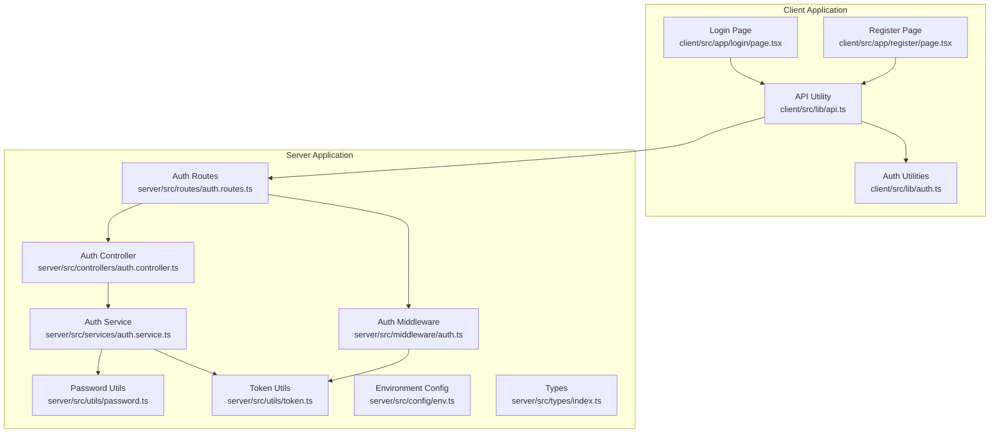
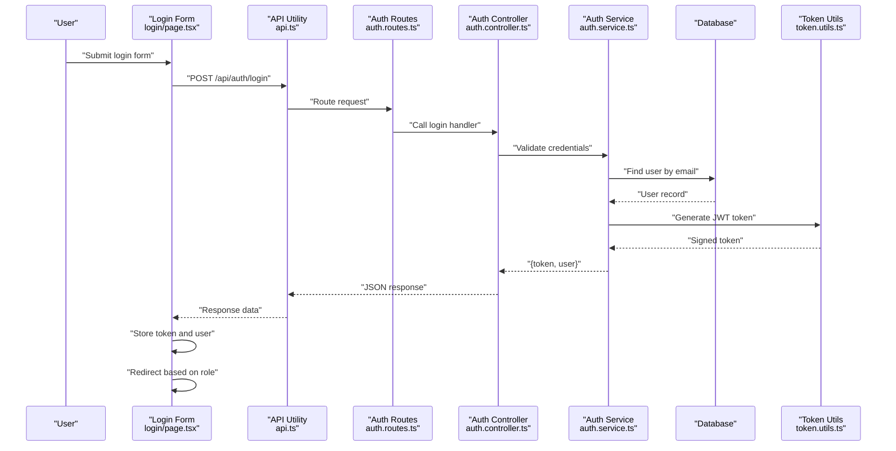
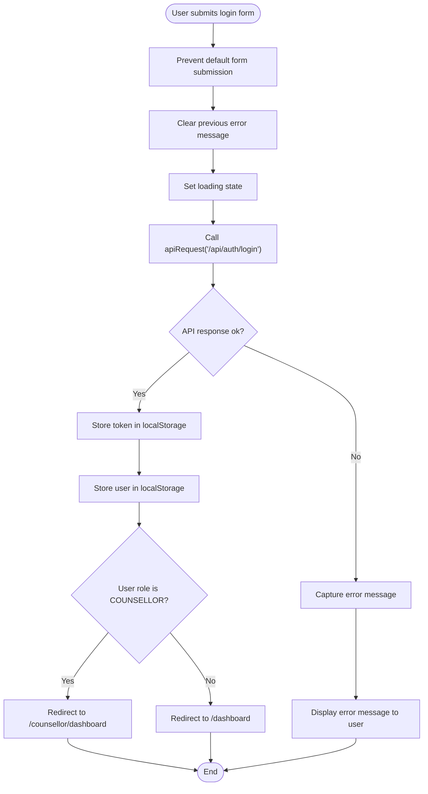
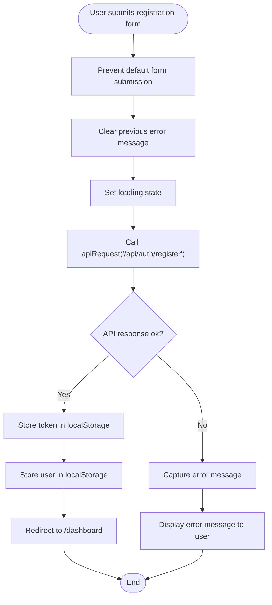
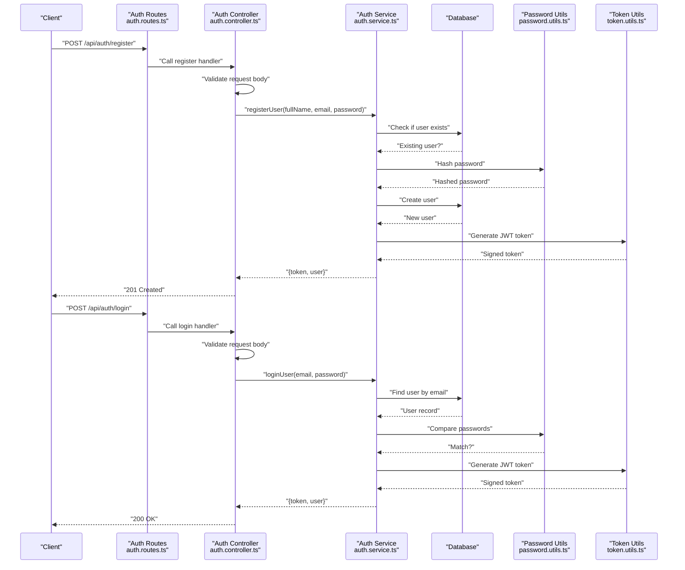
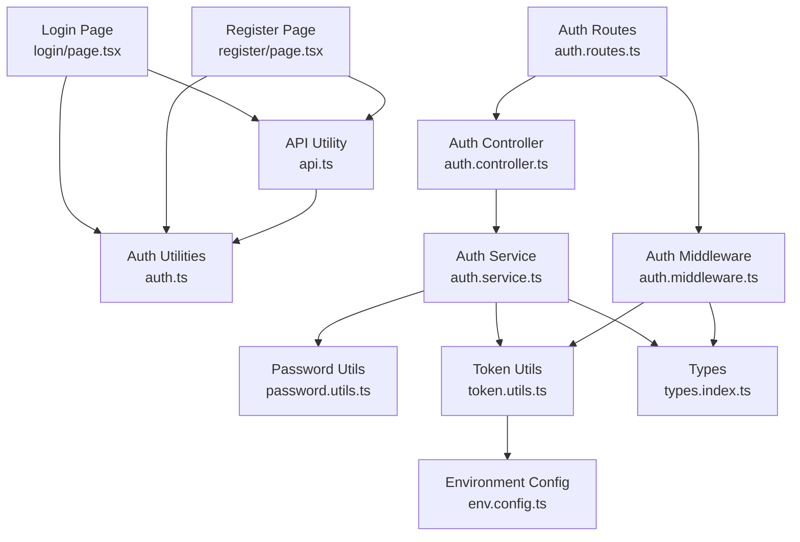

# Authentication Forms

<cite>
**Referenced Files in This Document**
- [login/page.tsx](file://client/src/app/login/page.tsx)
- [register/page.tsx](file://client/src/app/register/page.tsx)
- [api.ts](file://client/src/lib/api.ts)
- [auth.ts](file://client/src/lib/auth.ts)
- [auth.controller.ts](file://server/src/controllers/auth.controller.ts)
- [auth.service.ts](file://server/src/services/auth.service.ts)
- [auth.routes.ts](file://server/src/routes/auth.routes.ts)
- [auth.middleware.ts](file://server/src/middleware/auth.ts)
- [password.utils.ts](file://server/src/utils/password.ts)
- [token.utils.ts](file://server/src/utils/token.ts)
- [env.config.ts](file://server/src/config/env.ts)
- [types.index.ts](file://server/src/types/index.ts)
- [auth.test.ts](file://server/src/__tests__/auth.test.ts)
</cite>

## Table of Contents
1. [Introduction](#introduction)
2. [Project Structure](#project-structure)
3. [Core Components](#core-components)
4. [Architecture Overview](#architecture-overview)
5. [Detailed Component Analysis](#detailed-component-analysis)
6. [Dependency Analysis](#dependency-analysis)
7. [Performance Considerations](#performance-considerations)
8. [Troubleshooting Guide](#troubleshooting-guide)
9. [Conclusion](#conclusion)

## Introduction
This document provides comprehensive documentation for the authentication form components in the BuddyAI application. It covers both login and registration pages, detailing form validation patterns, error handling mechanisms, and submission workflows. The document explains the integration with authentication APIs, token management, and user state updates. It also includes form field configurations, validation rules, success/error feedback mechanisms, redirect behaviors, customization examples, accessibility features, and integration with the overall authentication flow. Common authentication issues and their solutions are addressed to help developers troubleshoot effectively.

## Project Structure
The authentication forms are implemented in the client application under the Next.js app directory, while the backend authentication logic resides in the server module. The client-side forms communicate with server endpoints via a shared API utility that manages tokens and handles errors. The server exposes authentication routes protected by middleware that validates JWT tokens and enforces role-based access control.

**Diagram sources**
- [login/page.tsx:1-108](file://client/src/app/login/page.tsx#L1-L108)
- [register/page.tsx:1-120](file://client/src/app/register/page.tsx#L1-L120)
- [api.ts:1-36](file://client/src/lib/api.ts#L1-L36)
- [auth.ts:1-27](file://client/src/lib/auth.ts#L1-L27)
- [auth.routes.ts:1-12](file://server/src/routes/auth.routes.ts#L1-L12)
- [auth.controller.ts:1-50](file://server/src/controllers/auth.controller.ts#L1-L50)
- [auth.service.ts:1-72](file://server/src/services/auth.service.ts#L1-L72)
- [auth.middleware.ts:1-39](file://server/src/middleware/auth.ts#L1-L39)
- [password.utils.ts:1-12](file://server/src/utils/password.ts#L1-L12)
- [token.utils.ts:1-17](file://server/src/utils/token.ts#L1-L17)
- [env.config.ts:1-12](file://server/src/config/env.ts#L1-L12)
- [types.index.ts:1-12](file://server/src/types/index.ts#L1-L12)

**Section sources**
- [login/page.tsx:1-108](file://client/src/app/login/page.tsx#L1-L108)
- [register/page.tsx:1-120](file://client/src/app/register/page.tsx#L1-L120)
- [api.ts:1-36](file://client/src/lib/api.ts#L1-L36)
- [auth.ts:1-27](file://client/src/lib/auth.ts#L1-L27)
- [auth.routes.ts:1-12](file://server/src/routes/auth.routes.ts#L1-L12)
- [auth.controller.ts:1-50](file://server/src/controllers/auth.controller.ts#L1-L50)
- [auth.service.ts:1-72](file://server/src/services/auth.service.ts#L1-L72)
- [auth.middleware.ts:1-39](file://server/src/middleware/auth.ts#L1-L39)
- [password.utils.ts:1-12](file://server/src/utils/password.ts#L1-L12)
- [token.utils.ts:1-17](file://server/src/utils/token.ts#L1-L17)
- [env.config.ts:1-12](file://server/src/config/env.ts#L1-L12)
- [types.index.ts:1-12](file://server/src/types/index.ts#L1-L12)

## Core Components
This section outlines the primary components involved in authentication form handling, including form pages, API utilities, and server-side authentication logic.

- Login Form Page: Implements email and password fields with client-side state management and submission handling.
- Registration Form Page: Implements full name, email, and password fields with client-side state management and submission handling.
- API Utility: Centralized HTTP client that adds Authorization headers, handles 401 responses, and parses JSON responses.
- Auth Utilities: Local storage helpers for managing tokens and user data.
- Server Routes: Expose authentication endpoints for registration, login, and user retrieval.
- Auth Controller: Validates request bodies and delegates to service layer.
- Auth Service: Handles user creation, login verification, and token generation.
- Auth Middleware: Validates JWT tokens and enforces role-based access control.
- Password Utilities: Provides hashing and comparison functions using bcrypt.
- Token Utilities: Generates and verifies JWT tokens with secret configuration.
- Environment Configuration: Loads environment variables including JWT secret.
- Types: Defines authentication user and request types.

**Section sources**
- [login/page.tsx:1-108](file://client/src/app/login/page.tsx#L1-L108)
- [register/page.tsx:1-120](file://client/src/app/register/page.tsx#L1-L120)
- [api.ts:1-36](file://client/src/lib/api.ts#L1-L36)
- [auth.ts:1-27](file://client/src/lib/auth.ts#L1-L27)
- [auth.routes.ts:1-12](file://server/src/routes/auth.routes.ts#L1-L12)
- [auth.controller.ts:1-50](file://server/src/controllers/auth.controller.ts#L1-L50)
- [auth.service.ts:1-72](file://server/src/services/auth.service.ts#L1-L72)
- [auth.middleware.ts:1-39](file://server/src/middleware/auth.ts#L1-L39)
- [password.utils.ts:1-12](file://server/src/utils/password.ts#L1-L12)
- [token.utils.ts:1-17](file://server/src/utils/token.ts#L1-L17)
- [env.config.ts:1-12](file://server/src/config/env.ts#L1-L12)
- [types.index.ts:1-12](file://server/src/types/index.ts#L1-L12)

## Architecture Overview
The authentication architecture follows a client-server model with clear separation of concerns. The client-side forms submit data to server endpoints, which validate inputs, interact with the database, and return tokens and user data. The client stores tokens and user information locally and uses them for subsequent authenticated requests.

**Diagram sources**
- [login/page.tsx:16-40](file://client/src/app/login/page.tsx#L16-L40)
- [api.ts:3-35](file://client/src/lib/api.ts#L3-L35)
- [auth.routes.ts:7-9](file://server/src/routes/auth.routes.ts#L7-L9)
- [auth.controller.ts:21-35](file://server/src/controllers/auth.controller.ts#L21-L35)
- [auth.service.ts:35-59](file://server/src/services/auth.service.ts#L35-L59)
- [token.utils.ts:10-16](file://server/src/utils/token.ts#L10-L16)

**Section sources**
- [login/page.tsx:16-40](file://client/src/app/login/page.tsx#L16-L40)
- [api.ts:3-35](file://client/src/lib/api.ts#L3-L35)
- [auth.routes.ts:7-9](file://server/src/routes/auth.routes.ts#L7-L9)
- [auth.controller.ts:21-35](file://server/src/controllers/auth.controller.ts#L21-L35)
- [auth.service.ts:35-59](file://server/src/services/auth.service.ts#L35-L59)
- [token.utils.ts:10-16](file://server/src/utils/token.ts#L10-L16)

## Detailed Component Analysis

### Login Form Component
The login form component manages state for email and password, handles submission, displays errors, and redirects users upon successful authentication. It integrates with the API utility and auth utilities for token and user persistence.

Key behaviors:
- State management for email, password, error message, and loading state.
- Submission handler prevents default form submission, clears previous errors, sets loading state, and calls the API endpoint.
- On success, stores the token and user data, determines redirect destination based on user role, and navigates accordingly.
- On failure, captures error messages and displays them to the user.
- Loading state disables the submit button to prevent duplicate submissions.

Form fields and validation:
- Email field: required, email type, placeholder text.
- Password field: required, minimum length enforced by client-side attribute, placeholder text.
- Submit button: disabled during loading, with dynamic label text.

Accessibility features:
- Proper labeling with htmlFor attributes.
- Focus styles for keyboard navigation.
- Disabled state indication for submit button.

**Diagram sources**
- [login/page.tsx:16-40](file://client/src/app/login/page.tsx#L16-L40)

**Section sources**
- [login/page.tsx:9-108](file://client/src/app/login/page.tsx#L9-L108)

### Registration Form Component
The registration form component manages state for full name, email, and password, handles submission, displays errors, and redirects users upon successful registration. It integrates with the API utility and auth utilities for token and user persistence.

Key behaviors:
- State management for full name, email, password, error message, and loading state.
- Submission handler prevents default form submission, clears previous errors, sets loading state, and calls the API endpoint.
- On success, stores the token and user data, then redirects to the dashboard.
- On failure, captures error messages and displays them to the user.
- Loading state disables the submit button to prevent duplicate submissions.

Form fields and validation:
- Full name field: required, text type, placeholder text.
- Email field: required, email type, placeholder text.
- Password field: required, minimum length enforced by client-side attribute, placeholder text.

Accessibility features:
- Proper labeling with htmlFor attributes.
- Focus styles for keyboard navigation.
- Disabled state indication for submit button.

**Diagram sources**
- [register/page.tsx:17-36](file://client/src/app/register/page.tsx#L17-L36)

**Section sources**
- [register/page.tsx:9-120](file://client/src/app/register/page.tsx#L9-L120)

### API Utility
The API utility centralizes HTTP communication, adding Authorization headers when a token exists, handling 401 responses by removing the token and redirecting to the login page, parsing JSON responses, and throwing errors for non-OK responses.

Key behaviors:
- Reads token from localStorage and attaches Authorization header.
- Handles 401 responses by removing token and redirecting to login.
- Parses JSON responses and throws errors with error messages from the server.
- Supports custom headers and merges them with defaults.

Integration points:
- Used by both login and registration pages for API calls.
- Consumed by other parts of the application requiring authenticated requests.

**Section sources**
- [api.ts:1-36](file://client/src/lib/api.ts#L1-L36)

### Auth Utilities
The auth utilities provide functions to manage tokens and user data in localStorage, including retrieving, setting, and removing tokens, as well as retrieving and setting user information. They also provide an isAuthenticated helper.

Key behaviors:
- getToken/setToken/removeToken manage JWT tokens.
- getUser/setUser manage serialized user data.
- isAuthenticated checks for token presence.

Integration points:
- Used by login and registration pages to persist authentication state.
- Consumed by the API utility to attach Authorization headers.

**Section sources**
- [auth.ts:1-27](file://client/src/lib/auth.ts#L1-L27)

### Server-Side Authentication Flow
The server-side authentication flow consists of routes, controller, service, and middleware layers. Routes define endpoints for registration, login, and user retrieval. Controllers validate request bodies and delegate to services. Services handle user creation, login verification, and token generation. Middleware validates JWT tokens and enforces role-based access control.

**Diagram sources**
- [auth.routes.ts:7-9](file://server/src/routes/auth.routes.ts#L7-L9)
- [auth.controller.ts:5-35](file://server/src/controllers/auth.controller.ts#L5-L35)
- [auth.service.ts:5-59](file://server/src/services/auth.service.ts#L5-L59)
- [password.utils.ts:5-11](file://server/src/utils/password.ts#L5-L11)
- [token.utils.ts:10-16](file://server/src/utils/token.ts#L10-L16)

**Section sources**
- [auth.routes.ts:1-12](file://server/src/routes/auth.routes.ts#L1-L12)
- [auth.controller.ts:1-50](file://server/src/controllers/auth.controller.ts#L1-L50)
- [auth.service.ts:1-72](file://server/src/services/auth.service.ts#L1-L72)
- [password.utils.ts:1-12](file://server/src/utils/password.ts#L1-L12)
- [token.utils.ts:1-17](file://server/src/utils/token.ts#L1-L17)

### Validation Patterns and Error Handling
Both client and server implement validation and error handling patterns to ensure robust authentication flows.

Client-side validation patterns:
- Required fields enforced via HTML attributes.
- Minimum password length enforced via HTML attribute.
- Controlled components for form state management.
- Error state display with user-friendly messages.

Server-side validation patterns:
- Request body validation in controllers.
- Unique email constraint enforcement in services.
- Password hashing and comparison using bcrypt.
- Error throwing with appropriate status codes.

Error handling mechanisms:
- Client-side: Catch-all try-catch around API calls, display error messages, and reset loading state.
- Server-side: Centralized error handling via middleware and controller try-catch blocks.

**Section sources**
- [login/page.tsx:57-95](file://client/src/app/login/page.tsx#L57-L95)
- [register/page.tsx:53-107](file://client/src/app/register/page.tsx#L53-L107)
- [auth.controller.ts:9-12](file://server/src/controllers/auth.controller.ts#L9-L12)
- [auth.service.ts:7-11](file://server/src/services/auth.service.ts#L7-L11)
- [auth.test.ts:78-84](file://server/src/__tests__/auth.test.ts#L78-L84)

### Token Management and User State Updates
Token management and user state updates occur on both client and server sides.

Client-side token management:
- API utility reads token from localStorage and attaches Authorization header.
- Login and registration handlers store tokens and user data upon successful responses.
- 401 responses trigger token removal and automatic redirection to login.

Server-side token management:
- Services generate JWT tokens with payload containing user ID, email, and role.
- Middleware validates tokens and attaches user information to requests.
- Environment configuration loads JWT secret for signing and verification.

User state updates:
- Client stores user data in localStorage for session persistence.
- Redirect logic considers user roles for appropriate dashboard routing.

**Section sources**
- [api.ts:3-35](file://client/src/lib/api.ts#L3-L35)
- [auth.ts:6-22](file://client/src/lib/auth.ts#L6-L22)
- [login/page.tsx:27-34](file://client/src/app/login/page.tsx#L27-L34)
- [register/page.tsx:28-30](file://client/src/app/register/page.tsx#L28-L30)
- [token.utils.ts:10-16](file://server/src/utils/token.ts#L10-L16)
- [auth.middleware.ts:15-21](file://server/src/middleware/auth.ts#L15-L21)
- [env.config.ts:9-9](file://server/src/config/env.ts#L9-L9)

### Redirect Behaviors
Redirect behaviors differ based on user roles and successful authentication outcomes.

Login redirect logic:
- Counselors are redirected to the counselor dashboard.
- Students are redirected to the standard dashboard.

Registration redirect logic:
- All registered users are redirected to the standard dashboard.

These behaviors are implemented in the respective form handlers after successful authentication.

**Section sources**
- [login/page.tsx:30-34](file://client/src/app/login/page.tsx#L30-L34)
- [register/page.tsx:30-30](file://client/src/app/register/page.tsx#L30-L30)

### Form Customization Examples
Common customization scenarios and their implementation approaches:

- Adding new fields: Extend form state, update submission handler to include new fields, and adjust server-side validation and service logic accordingly.
- Custom validation rules: Implement client-side validation with controlled components and server-side validation in controllers and services.
- Accessibility enhancements: Add aria-labels, proper focus management, and screen reader support for form controls.
- Styling modifications: Adjust Tailwind CSS classes for form appearance while maintaining accessibility standards.
- Internationalization: Extract static text into translation keys and provide localized versions for labels and error messages.

Implementation references:
- Form state management patterns in login and registration pages.
- Controlled component patterns for form inputs.
- Error message display and user feedback mechanisms.

**Section sources**
- [login/page.tsx:11-14](file://client/src/app/login/page.tsx#L11-L14)
- [register/page.tsx:11-15](file://client/src/app/register/page.tsx#L11-L15)
- [login/page.tsx:62-85](file://client/src/app/login/page.tsx#L62-L85)
- [register/page.tsx:58-97](file://client/src/app/register/page.tsx#L58-L97)

## Dependency Analysis
This section analyzes dependencies between components to understand coupling and potential circular dependencies.

**Diagram sources**
- [login/page.tsx:6-7](file://client/src/app/login/page.tsx#L6-L7)
- [register/page.tsx:6-7](file://client/src/app/register/page.tsx#L6-L7)
- [api.ts:1-36](file://client/src/lib/api.ts#L1-L36)
- [auth.ts:1-27](file://client/src/lib/auth.ts#L1-L27)
- [auth.routes.ts:1-12](file://server/src/routes/auth.routes.ts#L1-L12)
- [auth.controller.ts:1-50](file://server/src/controllers/auth.controller.ts#L1-L50)
- [auth.service.ts:1-72](file://server/src/services/auth.service.ts#L1-L72)
- [auth.middleware.ts:1-39](file://server/src/middleware/auth.ts#L1-L39)
- [password.utils.ts:1-12](file://server/src/utils/password.ts#L1-L12)
- [token.utils.ts:1-17](file://server/src/utils/token.ts#L1-L17)
- [env.config.ts:1-12](file://server/src/config/env.ts#L1-L12)
- [types.index.ts:1-12](file://server/src/types/index.ts#L1-L12)

**Section sources**
- [login/page.tsx:1-108](file://client/src/app/login/page.tsx#L1-L108)
- [register/page.tsx:1-120](file://client/src/app/register/page.tsx#L1-L120)
- [api.ts:1-36](file://client/src/lib/api.ts#L1-L36)
- [auth.ts:1-27](file://client/src/lib/auth.ts#L1-L27)
- [auth.routes.ts:1-12](file://server/src/routes/auth.routes.ts#L1-L12)
- [auth.controller.ts:1-50](file://server/src/controllers/auth.controller.ts#L1-L50)
- [auth.service.ts:1-72](file://server/src/services/auth.service.ts#L1-L72)
- [auth.middleware.ts:1-39](file://server/src/middleware/auth.ts#L1-L39)
- [password.utils.ts:1-12](file://server/src/utils/password.ts#L1-L12)
- [token.utils.ts:1-17](file://server/src/utils/token.ts#L1-L17)
- [env.config.ts:1-12](file://server/src/config/env.ts#L1-L12)
- [types.index.ts:1-12](file://server/src/types/index.ts#L1-L12)

## Performance Considerations
- Minimize unnecessary re-renders by using controlled components and avoiding excessive state updates.
- Debounce or throttle rapid input changes if needed, though not required for typical form inputs.
- Cache frequently accessed data in localStorage judiciously to reduce network requests.
- Optimize API calls by batching requests when possible and using efficient serialization.
- Consider lazy loading heavy dependencies only when necessary.
- Monitor token expiration and refresh strategies to avoid frequent re-authentication.

## Troubleshooting Guide
Common authentication issues and their solutions:

- Unauthorized Access (401):
  - Symptom: Automatic logout and redirect to login page.
  - Cause: Invalid or missing Authorization header.
  - Solution: Ensure token is present in localStorage and properly attached to requests.

- Invalid Credentials:
  - Symptom: Error message indicating invalid email or password.
  - Cause: Incorrect email or password during login.
  - Solution: Verify credentials and ensure password meets minimum length requirements.

- Email Already Registered:
  - Symptom: Error indicating email already registered.
  - Cause: Attempting to register with an existing email.
  - Solution: Prompt user to use a different email or log in instead.

- Network Errors:
  - Symptom: Generic request failed error.
  - Cause: Server unreachable or unexpected response.
  - Solution: Check server availability, network connectivity, and API endpoint correctness.

- Role-Based Redirect Issues:
  - Symptom: Incorrect dashboard redirect for counselors.
  - Cause: Role mismatch or missing role in token payload.
  - Solution: Verify user role in database and ensure token payload includes correct role.

Diagnostic steps:
- Check browser console for JavaScript errors.
- Verify localStorage contains token and user data.
- Confirm server logs for authentication attempts.
- Test individual endpoints using tools like curl or Postman.
- Review environment variables for JWT secret and API URL.

**Section sources**
- [api.ts:20-26](file://client/src/lib/api.ts#L20-L26)
- [auth.service.ts:7-11](file://server/src/services/auth.service.ts#L7-L11)
- [auth.service.ts:37-48](file://server/src/services/auth.service.ts#L37-L48)
- [auth.middleware.ts:8-21](file://server/src/middleware/auth.ts#L8-L21)
- [auth.test.ts:78-84](file://server/src/__tests__/auth.test.ts#L78-L84)

## Conclusion
The authentication form components in BuddyAI provide a robust foundation for user registration and login. The implementation follows modern React patterns with controlled components, centralized API utilities, and secure server-side authentication with JWT tokens. The system includes comprehensive error handling, role-based routing, and localStorage-based state management. By understanding the client-server architecture, validation patterns, and error handling mechanisms, developers can effectively customize and extend the authentication flow while maintaining security and usability standards.