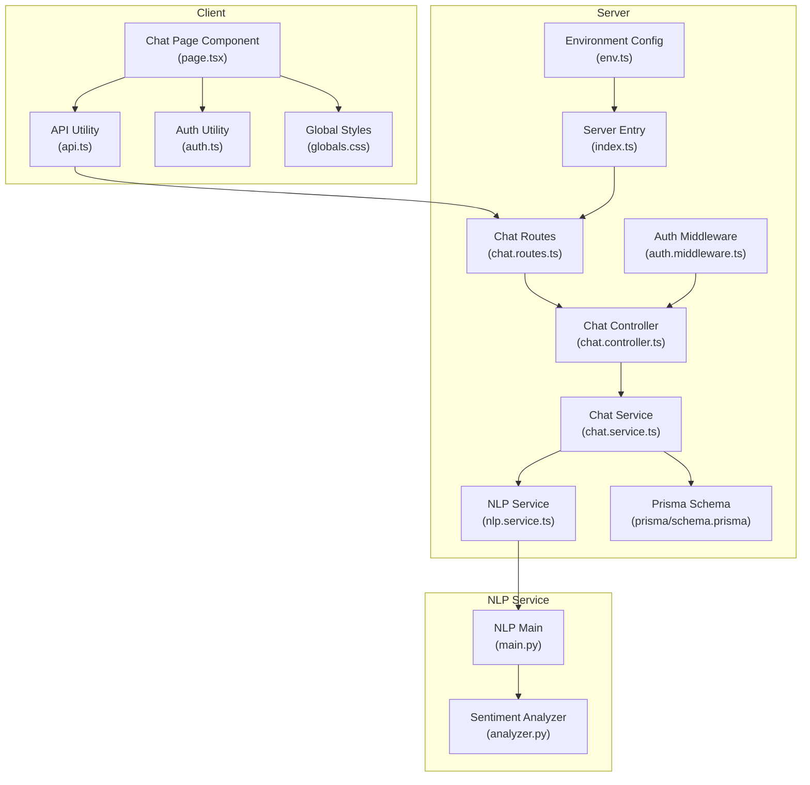
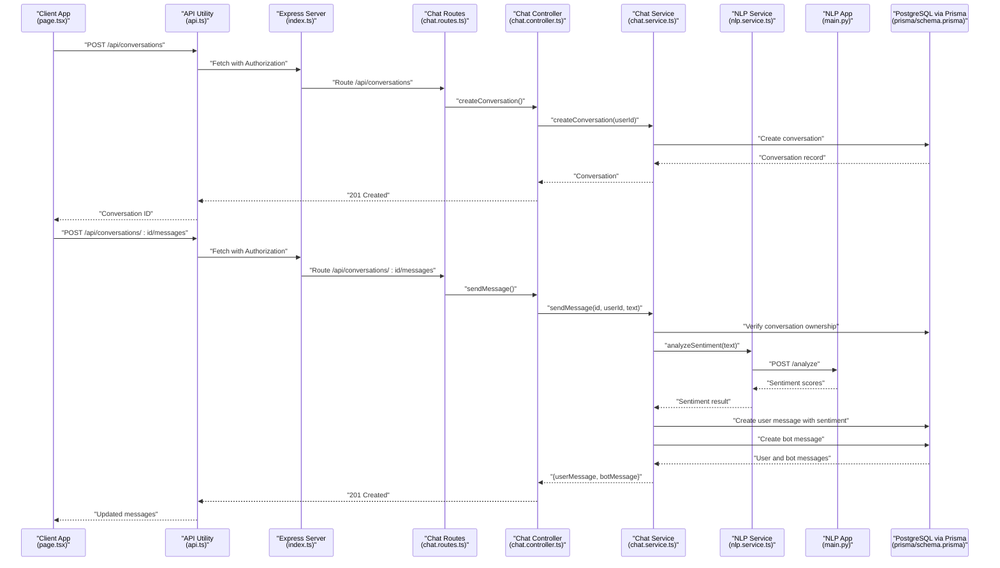
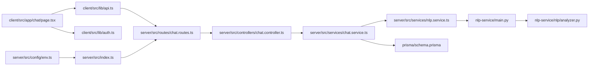

# Chat Interface

<cite>
**Referenced Files in This Document**
- [page.tsx](file://client/src/app/chat/page.tsx)
- [api.ts](file://client/src/lib/api.ts)
- [auth.ts](file://client/src/lib/auth.ts)
- [chat.controller.ts](file://server/src/controllers/chat.controller.ts)
- [chat.service.ts](file://server/src/services/chat.service.ts)
- [nlp.service.ts](file://server/src/services/nlp.service.ts)
- [analyzer.py](file://nlp-service/nlp/analyzer.py)
- [main.py](file://nlp-service/main.py)
- [chat.routes.ts](file://server/src/routes/chat.routes.ts)
- [auth.middleware.ts](file://server/src/middleware/auth.ts)
- [env.ts](file://server/src/config/env.ts)
- [index.ts](file://server/src/index.ts)
- [prisma.schema](file://prisma/schema.prisma)
- [globals.css](file://client/src/app/globals.css)
</cite>

## Table of Contents
1. [Introduction](#introduction)
2. [Project Structure](#project-structure)
3. [Core Components](#core-components)
4. [Architecture Overview](#architecture-overview)
5. [Detailed Component Analysis](#detailed-component-analysis)
6. [Dependency Analysis](#dependency-analysis)
7. [Performance Considerations](#performance-considerations)
8. [Troubleshooting Guide](#troubleshooting-guide)
9. [Conclusion](#conclusion)

## Introduction
This document provides comprehensive documentation for the chat interface component in the BuddyAI project. It covers conversation display, message input, real-time interaction patterns, chat history rendering, message formatting, user typing indicators, AI response handling, backend integration with the chat API, sentiment analysis display, component state management for message composition, attachment handling, and conversation persistence. It also includes examples of chat customization, responsive design considerations, and troubleshooting connectivity issues.

## Project Structure
The chat interface spans three primary areas:
- Client-side React component for rendering and user interaction
- Server-side Express routes and controllers for chat operations
- NLP service for sentiment analysis

**Diagram sources**
- [page.tsx:1-196](file://client/src/app/chat/page.tsx#L1-L196)
- [api.ts:1-36](file://client/src/lib/api.ts#L1-L36)
- [auth.ts:1-27](file://client/src/lib/auth.ts#L1-L27)
- [chat.routes.ts:1-13](file://server/src/routes/chat.routes.ts#L1-L13)
- [chat.controller.ts:1-69](file://server/src/controllers/chat.controller.ts#L1-L69)
- [chat.service.ts:1-105](file://server/src/services/chat.service.ts#L1-L105)
- [nlp.service.ts:1-24](file://server/src/services/nlp.service.ts#L1-L24)
- [prisma.schema:1-134](file://prisma/schema.prisma#L1-L134)
- [env.ts:1-12](file://server/src/config/env.ts#L1-L12)
- [index.ts:1-35](file://server/src/index.ts#L1-L35)
- [auth.middleware.ts:1-39](file://server/src/middleware/auth.ts#L1-L39)
- [main.py:1-71](file://nlp-service/main.py#L1-L71)
- [analyzer.py:1-27](file://nlp-service/nlp/analyzer.py#L1-L27)
- [globals.css:1-20](file://client/src/app/globals.css#L1-L20)

**Section sources**
- [page.tsx:1-196](file://client/src/app/chat/page.tsx#L1-L196)
- [chat.routes.ts:1-13](file://server/src/routes/chat.routes.ts#L1-L13)
- [chat.controller.ts:1-69](file://server/src/controllers/chat.controller.ts#L1-L69)
- [chat.service.ts:1-105](file://server/src/services/chat.service.ts#L1-L105)
- [nlp.service.ts:1-24](file://server/src/services/nlp.service.ts#L1-L24)
- [prisma.schema:1-134](file://prisma/schema.prisma#L1-L134)
- [env.ts:1-12](file://server/src/config/env.ts#L1-L12)
- [index.ts:1-35](file://server/src/index.ts#L1-L35)
- [auth.middleware.ts:1-39](file://server/src/middleware/auth.ts#L1-L39)
- [main.py:1-71](file://nlp-service/main.py#L1-L71)
- [analyzer.py:1-27](file://nlp-service/nlp/analyzer.py#L1-L27)
- [globals.css:1-20](file://client/src/app/globals.css#L1-L20)

## Core Components
- Chat Page Component: Manages conversation loading, message composition, sending, and rendering with Tailwind CSS styling. Implements user typing indicator during AI response generation and sentiment display for user messages.
- API Utility: Centralized fetch wrapper handling authentication tokens, redirects on unauthorized responses, and error propagation.
- Authentication Utilities: Token and user session management for protected routes.
- Chat Routes and Controller: Expose REST endpoints for creating conversations, retrieving conversations, sending messages, and fetching messages.
- Chat Service: Orchestrates conversation persistence, message creation, sentiment analysis via NLP service, and bot response generation.
- NLP Service: Integrates with a dedicated sentiment analysis microservice using VADER sentiment scoring.
- Prisma Schema: Defines relational models for User, Conversation, and Message with enums for roles, sender types, and sentiments.
- Environment Configuration: Provides runtime configuration for ports, JWT secrets, and NLP service URLs.
- Server Entry: Registers routes, middleware, and CORS, exposing health checks and API endpoints.

**Section sources**
- [page.tsx:1-196](file://client/src/app/chat/page.tsx#L1-L196)
- [api.ts:1-36](file://client/src/lib/api.ts#L1-L36)
- [auth.ts:1-27](file://client/src/lib/auth.ts#L1-L27)
- [chat.routes.ts:1-13](file://server/src/routes/chat.routes.ts#L1-L13)
- [chat.controller.ts:1-69](file://server/src/controllers/chat.controller.ts#L1-L69)
- [chat.service.ts:1-105](file://server/src/services/chat.service.ts#L1-L105)
- [nlp.service.ts:1-24](file://server/src/services/nlp.service.ts#L1-L24)
- [prisma.schema:1-134](file://prisma/schema.prisma#L1-L134)
- [env.ts:1-12](file://server/src/config/env.ts#L1-L12)
- [index.ts:1-35](file://server/src/index.ts#L1-L35)

## Architecture Overview
The chat interface follows a client-server architecture with a dedicated NLP microservice. The client interacts with server endpoints secured by JWT middleware. The server persists data using Prisma ORM against a PostgreSQL database. Sentiment analysis is delegated to a separate NLP service.

**Diagram sources**
- [page.tsx:55-107](file://client/src/app/chat/page.tsx#L55-L107)
- [api.ts:3-35](file://client/src/lib/api.ts#L3-L35)
- [index.ts:22-28](file://server/src/index.ts#L22-L28)
- [chat.routes.ts:1-13](file://server/src/routes/chat.routes.ts#L1-L13)
- [chat.controller.ts:33-53](file://server/src/controllers/chat.controller.ts#L33-L53)
- [chat.service.ts:45-88](file://server/src/services/chat.service.ts#L45-L88)
- [nlp.service.ts:11-23](file://server/src/services/nlp.service.ts#L11-L23)
- [main.py:43-58](file://nlp-service/main.py#L43-L58)
- [prisma.schema:63-84](file://prisma/schema.prisma#L63-L84)

## Detailed Component Analysis

### Chat Page Component
Responsibilities:
- Authentication guard: Redirects unauthenticated users to login.
- Conversation lifecycle: Loads existing conversations and initializes a new one if none exists.
- Message submission: Handles form submission, disables input during send, and updates local state with user and bot messages.
- Rendering: Displays messages with distinct styling per sender, timestamps, sentiment badges for user messages, and a typing indicator for bot responses.
- Scrolling: Auto-scrolls to the latest message after updates.

State Management:
- conversationId: Tracks current conversation identifier.
- messages: Array of rendered messages with sender type, text, optional sentiment, and timestamps.
- input: Controlled input field for composing messages.
- loading/sending: Flags to manage UI state during network operations.

Rendering Details:
- Empty state: Prompts the user to start a conversation.
- Message alignment: Right-aligned for user messages, left-aligned for bot messages.
- Sentiment display: Renders a small badge with color-coded sentiment for user messages.
- Typing indicator: Shows a pulsing "BuddyAI is typing..." message when sending is active.

Integration Points:
- Uses apiRequest for all HTTP calls.
- Relies on isAuthenticated for route protection.

**Section sources**
- [page.tsx:17-196](file://client/src/app/chat/page.tsx#L17-L196)

### API Utility
Responsibilities:
- Centralizes fetch requests with automatic Authorization header injection.
- Handles 401 Unauthorized by removing token and redirecting to login.
- Parses JSON responses and throws errors for non-OK statuses.

Usage:
- Called by the chat component for all API interactions.
- Ensures consistent error handling and authentication behavior across the app.

**Section sources**
- [api.ts:1-36](file://client/src/lib/api.ts#L1-L36)

### Authentication Utilities
Responsibilities:
- Token and user session management using localStorage.
- isAuthenticated helper for route guards.

Usage:
- Used in the chat page to enforce authentication.
- Integrated with server middleware for request validation.

**Section sources**
- [auth.ts:1-27](file://client/src/lib/auth.ts#L1-L27)

### Chat Routes and Controller
Responsibilities:
- Route registration for chat endpoints under /api/conversations.
- Controller actions for creating conversations, retrieving conversations, sending messages, and fetching messages.
- Authentication middleware enforcement.

Endpoints:
- POST /api/conversations: Creates a new conversation for the authenticated user.
- GET /api/conversations: Lists user's conversations with latest message preview.
- POST /api/conversations/:id/messages: Sends a message to a specific conversation.
- GET /api/conversations/:id/messages: Retrieves all messages in a conversation.

**Section sources**
- [chat.routes.ts:1-13](file://server/src/routes/chat.routes.ts#L1-L13)
- [chat.controller.ts:5-68](file://server/src/controllers/chat.controller.ts#L5-L68)

### Chat Service
Responsibilities:
- Conversation creation and retrieval.
- Message sending with sentiment analysis and bot response generation.
- Conversation ownership verification.
- Message persistence with sender type and optional sentiment metadata.

Sentiment Analysis:
- Calls NLP service to analyze message text.
- Maps sentiment labels to internal enum values.
- Stores sentiment and compound score with user messages.

Bot Response Generation:
- Generates contextual responses based on sentiment and score thresholds.

Persistence:
- Uses Prisma to create conversation, user message, and bot message records.
- Enforces conversation ownership before operations.

**Section sources**
- [chat.service.ts:26-104](file://server/src/services/chat.service.ts#L26-L104)
- [nlp.service.ts:11-23](file://server/src/services/nlp.service.ts#L11-L23)

### NLP Service Integration
Responsibilities:
- Delegates sentiment analysis to the external NLP service.
- Handles HTTP errors and propagates meaningful errors to the chat service.

NLP Microservice:
- FastAPI application with CORS enabled.
- VADER-based sentiment analysis with preprocessing pipeline.
- Health check endpoint for readiness probes.

**Section sources**
- [nlp.service.ts:1-24](file://server/src/services/nlp.service.ts#L1-L24)
- [main.py:28-71](file://nlp-service/main.py#L28-L71)
- [analyzer.py:4-27](file://nlp-service/nlp/analyzer.py#L4-L27)

### Database Schema
Models:
- User: Contains user metadata and relationships to conversations, messages, assessments, and alerts.
- Conversation: Links to User and contains Messages.
- Message: Stores message text, sender type, optional sentiment and score, and timestamps.

Enums:
- Role: STUDENT or COUNSELLOR.
- Sender: USER or BOT.
- Sentiment: POSITIVE, NEUTRAL, NEGATIVE.

Indexes:
- Optimized lookups for user, conversation, and assessment relationships.

**Section sources**
- [prisma.schema:47-84](file://prisma/schema.prisma#L47-L84)

### Authentication Middleware
Responsibilities:
- Validates Authorization header bearer tokens.
- Decodes JWT and attaches user info to request.
- Supports role-based access control for privileged routes.

**Section sources**
- [auth.middleware.ts:5-38](file://server/src/middleware/auth.ts#L5-L38)

### Server Entry and Configuration
Responsibilities:
- Initializes Express app with CORS and JSON parsing.
- Mounts API routes for auth, mood, assessments, chat, risk, alerts, and dashboard.
- Registers centralized error handler.
- Exposes health check endpoint.
- Reads configuration from environment variables.

**Section sources**
- [index.ts:13-35](file://server/src/index.ts#L13-L35)
- [env.ts:6-12](file://server/src/config/env.ts#L6-L12)

### Styling and Responsive Design
Approach:
- Global Tailwind CSS configuration defines theme variables and base styles.
- Chat container uses flexbox for responsive layout with max-width constraints.
- Message bubbles use rounded corners and color accents for differentiation.
- Input area remains fixed at the bottom with flexible composition field.

Customization Examples:
- Adjust colors via theme variables in globals.css.
- Modify message bubble paddings and typography using Tailwind utilities.
- Control responsiveness by adjusting container widths and padding classes.

**Section sources**
- [globals.css:1-20](file://client/src/app/globals.css#L1-L20)
- [page.tsx:131-194](file://client/src/app/chat/page.tsx#L131-L194)

## Dependency Analysis
Key Dependencies:
- Client depends on api.ts for HTTP communication and auth.ts for session management.
- Server routes depend on controller actions, which in turn depend on chat.service.ts.
- Chat service depends on nlp.service.ts and prisma schema for persistence.
- NLP service depends on analyzer.py for sentiment computation.
- Environment configuration drives server port and NLP service URL.

**Diagram sources**
- [page.tsx:1-196](file://client/src/app/chat/page.tsx#L1-L196)
- [api.ts:1-36](file://client/src/lib/api.ts#L1-L36)
- [auth.ts:1-27](file://client/src/lib/auth.ts#L1-L27)
- [chat.routes.ts:1-13](file://server/src/routes/chat.routes.ts#L1-L13)
- [chat.controller.ts:1-69](file://server/src/controllers/chat.controller.ts#L1-L69)
- [chat.service.ts:1-105](file://server/src/services/chat.service.ts#L1-L105)
- [nlp.service.ts:1-24](file://server/src/services/nlp.service.ts#L1-L24)
- [analyzer.py:1-27](file://nlp-service/nlp/analyzer.py#L1-L27)
- [main.py:1-71](file://nlp-service/main.py#L1-L71)
- [prisma.schema:1-134](file://prisma/schema.prisma#L1-L134)
- [env.ts:1-12](file://server/src/config/env.ts#L1-L12)
- [index.ts:1-35](file://server/src/index.ts#L1-L35)

**Section sources**
- [page.tsx:1-196](file://client/src/app/chat/page.tsx#L1-L196)
- [api.ts:1-36](file://client/src/lib/api.ts#L1-L36)
- [auth.ts:1-27](file://client/src/lib/auth.ts#L1-L27)
- [chat.routes.ts:1-13](file://server/src/routes/chat.routes.ts#L1-L13)
- [chat.controller.ts:1-69](file://server/src/controllers/chat.controller.ts#L1-L69)
- [chat.service.ts:1-105](file://server/src/services/chat.service.ts#L1-L105)
- [nlp.service.ts:1-24](file://server/src/services/nlp.service.ts#L1-L24)
- [analyzer.py:1-27](file://nlp-service/nlp/analyzer.py#L1-L27)
- [main.py:1-71](file://nlp-service/main.py#L1-L71)
- [prisma.schema:1-134](file://prisma/schema.prisma#L1-L134)
- [env.ts:1-12](file://server/src/config/env.ts#L1-L12)
- [index.ts:1-35](file://server/src/index.ts#L1-L35)

## Performance Considerations
- Network Efficiency: Batch message updates locally before server sync to reduce render thrash.
- Debouncing: Consider debouncing rapid message submissions to avoid excessive API calls.
- Lazy Loading: Load older messages on scroll to minimize initial payload.
- Caching: Cache recent conversations and messages in memory to improve perceived performance.
- Image/Attachment Handling: If attachments are introduced, defer heavy processing until after upload completion.
- Database Indexes: Ensure proper indexing on conversationId and createdAt for efficient message retrieval.

## Troubleshooting Guide
Common Issues and Resolutions:
- Authentication Failures:
  - Symptom: Immediate redirect to login after visiting chat.
  - Cause: Missing or invalid token.
  - Resolution: Clear browser storage, re-authenticate, and ensure Authorization header is present in requests.
  - Section sources
    - [api.ts:20-26](file://client/src/lib/api.ts#L20-L26)
    - [auth.ts:24-26](file://client/src/lib/auth.ts#L24-L26)

- Unauthorized Access on Server:
  - Symptom: 401 responses from chat endpoints.
  - Cause: Missing or invalid Bearer token.
  - Resolution: Verify JWT middleware and token validity; ensure frontend sends Authorization header.
  - Section sources
    - [auth.middleware.ts:5-22](file://server/src/middleware/auth.ts#L5-L22)

- NLP Service Unavailable:
  - Symptom: Sentiment not applied to user messages; server logs indicate NLP error.
  - Cause: NLP service down or unreachable.
  - Resolution: Check NLP service health endpoint, verify environment configuration, and confirm CORS settings.
  - Section sources
    - [nlp.service.ts:18-20](file://server/src/services/nlp.service.ts#L18-L20)
    - [main.py:61-64](file://nlp-service/main.py#L61-L64)
    - [env.ts:10-10](file://server/src/config/env.ts#L10-L10)

- Conversation Not Found:
  - Symptom: 404 error when sending messages to a conversation.
  - Cause: Attempting to access conversation not owned by the authenticated user.
  - Resolution: Ensure conversation belongs to the current user before sending messages.
  - Section sources
    - [chat.service.ts:46-52](file://server/src/services/chat.service.ts#L46-L52)

- CORS Errors:
  - Symptom: Browser blocks requests to chat or NLP endpoints.
  - Cause: Misconfigured CORS policies.
  - Resolution: Confirm server CORS middleware allows client origin and credentials.
  - Section sources
    - [index.ts:15-15](file://server/src/index.ts#L15-L15)
    - [main.py:30-36](file://nlp-service/main.py#L30-L36)

- Database Connectivity:
  - Symptom: Prisma-related errors or timeouts.
  - Cause: Incorrect DATABASE_URL or database downtime.
  - Resolution: Verify environment variables and database availability.
  - Section sources
    - [env.ts:9-9](file://server/src/config/env.ts#L9-L9)
    - [prisma.schema:5-8](file://prisma/schema.prisma#L5-L8)

- Frontend Build/Runtime Errors:
  - Symptom: Chat component fails to render or crashes.
  - Cause: Missing environment variables or misconfigured API URL.
  - Resolution: Ensure NEXT_PUBLIC_API_URL is set and accessible from the client.
  - Section sources
    - [api.ts:1-1](file://client/src/lib/api.ts#L1-L1)
    - [page.tsx:1-3](file://client/src/app/chat/page.tsx#L1-L3)

## Conclusion
The chat interface integrates a robust client-server architecture with a dedicated NLP microservice to deliver real-time messaging, sentiment-aware responses, and persistent conversation storage. The component manages state efficiently, enforces authentication, and provides a responsive, accessible UI. By following the troubleshooting steps and performance recommendations, teams can maintain reliability and scalability as the system evolves.