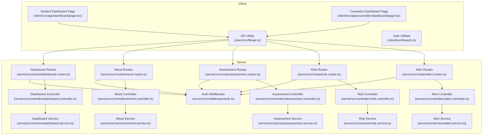
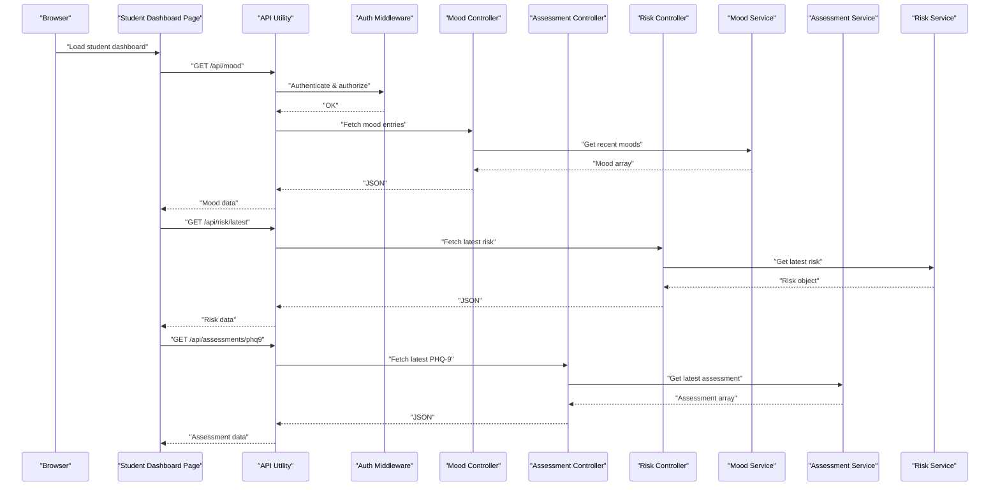
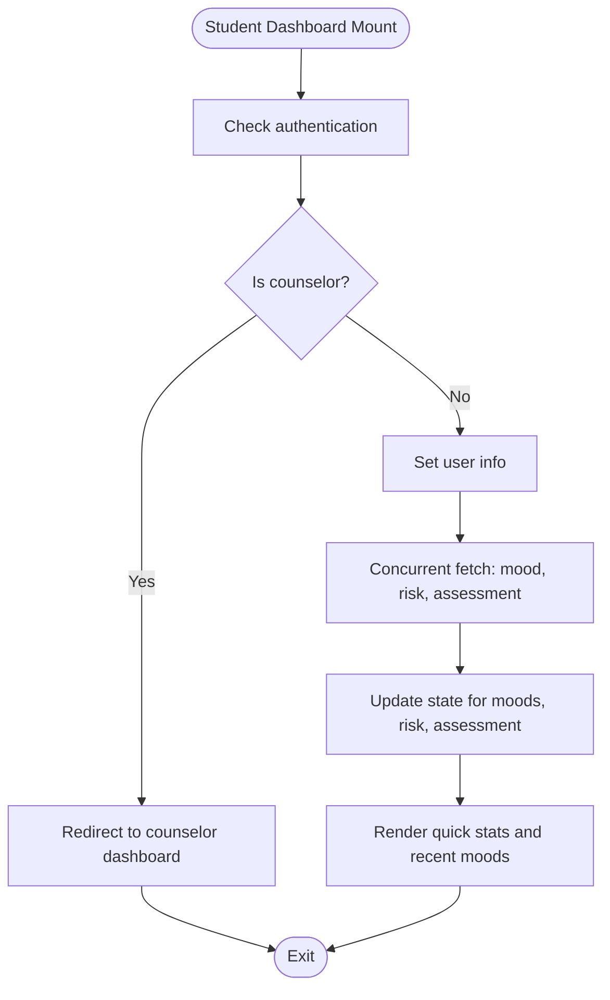
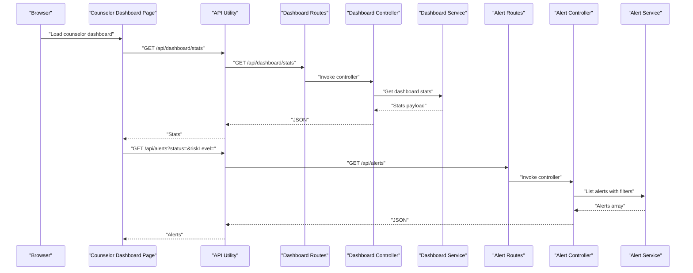
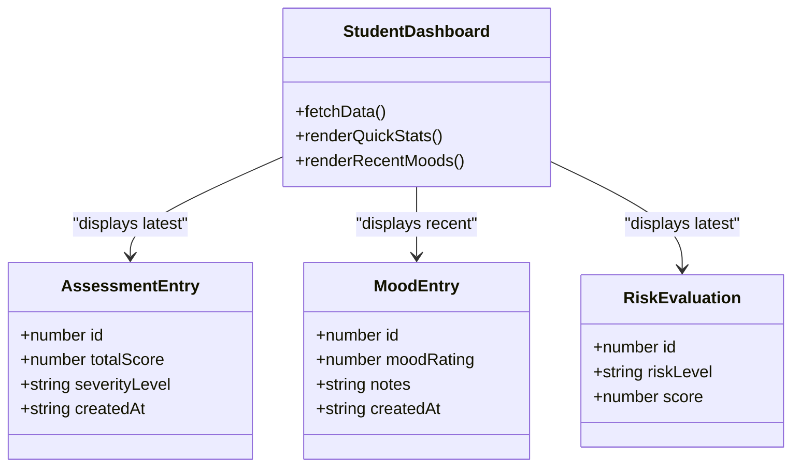
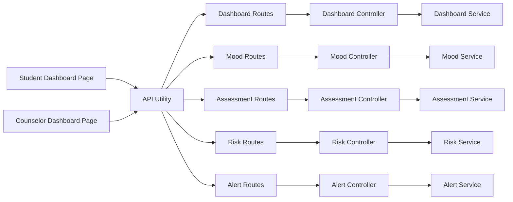

# Dashboard Components

<cite>
**Referenced Files in This Document**
- [client/src/app/dashboard/page.tsx](file://client/src/app/dashboard/page.tsx)
- [client/src/app/counsellor/dashboard/page.tsx](file://client/src/app/counsellor/dashboard/page.tsx)
- [client/src/lib/api.ts](file://client/src/lib/api.ts)
- [client/src/lib/auth.ts](file://client/src/lib/auth.ts)
- [server/src/controllers/dashboard.controller.ts](file://server/src/controllers/dashboard.controller.ts)
- [server/src/services/dashboard.service.ts](file://server/src/services/dashboard.service.ts)
- [server/src/routes/dashboard.routes.ts](file://server/src/routes/dashboard.routes.ts)
- [server/src/controllers/mood.controller.ts](file://server/src/controllers/mood.controller.ts)
- [server/src/controllers/assessment.controller.ts](file://server/src/controllers/assessment.controller.ts)
- [server/src/controllers/risk.controller.ts](file://server/src/controllers/risk.controller.ts)
- [server/src/services/mood.service.ts](file://server/src/services/mood.service.ts)
- [server/src/services/assessment.service.ts](file://server/src/services/assessment.service.ts)
- [server/src/services/risk.service.ts](file://server/src/services/risk.service.ts)
- [server/src/controllers/alert.controller.ts](file://server/src/controllers/alert.controller.ts)
- [server/src/services/alert.service.ts](file://server/src/services/alert.service.ts)
- [server/src/middleware/auth.ts](file://server/src/middleware/auth.ts)
- [server/src/types/index.ts](file://server/src/types/index.ts)
</cite>

## Table of Contents
1. [Introduction](#introduction)
2. [Project Structure](#project-structure)
3. [Core Components](#core-components)
4. [Architecture Overview](#architecture-overview)
5. [Detailed Component Analysis](#detailed-component-analysis)
6. [Dependency Analysis](#dependency-analysis)
7. [Performance Considerations](#performance-considerations)
8. [Troubleshooting Guide](#troubleshooting-guide)
9. [Conclusion](#conclusion)

## Introduction
This document provides comprehensive documentation for the dashboard components in the application, focusing on the student and counselor dashboards. It explains role-based differences in dashboard content, data visualization components, interactive filters, and analytics displays. It also covers component composition patterns, data fetching strategies, real-time update considerations, customization examples, integration with assessment and mood tracking data, and performance and responsive design considerations.

## Project Structure
The dashboard functionality spans the client Next.js application and the server Express backend:
- Student dashboard: renders quick stats, recent mood entries, and quick actions.
- Counselor dashboard: displays aggregated statistics, risk distribution, and an interactive alert list with status and risk filters.
- Shared data access: client-side API utility handles authenticated requests; server routes enforce authentication and role checks; services encapsulate database queries.

**Diagram sources**
- [client/src/app/dashboard/page.tsx:1-206](file://client/src/app/dashboard/page.tsx#L1-L206)
- [client/src/app/counsellor/dashboard/page.tsx:1-213](file://client/src/app/counsellor/dashboard/page.tsx#L1-L213)
- [client/src/lib/api.ts:1-36](file://client/src/lib/api.ts#L1-L36)
- [client/src/lib/auth.ts:1-27](file://client/src/lib/auth.ts#L1-L27)
- [server/src/routes/dashboard.routes.ts:1-11](file://server/src/routes/dashboard.routes.ts#L1-L11)
- [server/src/controllers/dashboard.controller.ts:1-13](file://server/src/controllers/dashboard.controller.ts#L1-L13)
- [server/src/services/dashboard.service.ts:1-19](file://server/src/services/dashboard.service.ts#L1-L19)
- [server/src/controllers/mood.controller.ts](file://server/src/controllers/mood.controller.ts)
- [server/src/controllers/assessment.controller.ts](file://server/src/controllers/assessment.controller.ts)
- [server/src/controllers/risk.controller.ts](file://server/src/controllers/risk.controller.ts)
- [server/src/services/mood.service.ts](file://server/src/services/mood.service.ts)
- [server/src/services/assessment.service.ts](file://server/src/services/assessment.service.ts)
- [server/src/services/risk.service.ts](file://server/src/services/risk.service.ts)
- [server/src/controllers/alert.controller.ts](file://server/src/controllers/alert.controller.ts)
- [server/src/services/alert.service.ts](file://server/src/services/alert.service.ts)
- [server/src/middleware/auth.ts](file://server/src/middleware/auth.ts)

**Section sources**
- [client/src/app/dashboard/page.tsx:1-206](file://client/src/app/dashboard/page.tsx#L1-L206)
- [client/src/app/counsellor/dashboard/page.tsx:1-213](file://client/src/app/counsellor/dashboard/page.tsx#L1-L213)
- [client/src/lib/api.ts:1-36](file://client/src/lib/api.ts#L1-L36)
- [client/src/lib/auth.ts:1-27](file://client/src/lib/auth.ts#L1-L27)
- [server/src/routes/dashboard.routes.ts:1-11](file://server/src/routes/dashboard.routes.ts#L1-L11)
- [server/src/controllers/dashboard.controller.ts:1-13](file://server/src/controllers/dashboard.controller.ts#L1-L13)
- [server/src/services/dashboard.service.ts:1-19](file://server/src/services/dashboard.service.ts#L1-L19)

## Core Components
- Student Dashboard Page
  - Fetches recent mood entries, latest PHQ-9 assessment, and latest risk evaluation via concurrent requests.
  - Renders quick stats cards for latest mood rating, PHQ-9 severity, and risk level.
  - Provides quick action links to chat, assessment, and mood logging.
  - Displays a scrollable list of recent mood entries with emoji ratings and timestamps.
  - Uses color-coded badges for risk and severity levels and responsive grid layouts.

- Counselor Dashboard Page
  - Fetches dashboard statistics and paginated alert list with optional status and risk filters.
  - Renders summary cards for total alerts, pending, reviewed, and resolved counts.
  - Provides filter controls for status and risk level; filters are applied via query parameters.
  - Displays a list of alerts with associated student identity, risk badge, status badge, and creation date.
  - Enforces counselor role access and redirects unauthorized users.

- API Utility and Authentication
  - Centralized API client adds Authorization header when present and handles 401 responses by clearing session and redirecting to login.
  - Authentication utilities manage token and user data in localStorage and expose isAuthenticated checks.

**Section sources**
- [client/src/app/dashboard/page.tsx:29-205](file://client/src/app/dashboard/page.tsx#L29-L205)
- [client/src/app/counsellor/dashboard/page.tsx:28-212](file://client/src/app/counsellor/dashboard/page.tsx#L28-L212)
- [client/src/lib/api.ts:3-35](file://client/src/lib/api.ts#L3-L35)
- [client/src/lib/auth.ts:1-27](file://client/src/lib/auth.ts#L1-L27)

## Architecture Overview
The dashboards follow a layered architecture:
- Client pages orchestrate data fetching and rendering.
- API utility abstracts HTTP requests and authentication.
- Server routes apply authentication and role middleware.
- Controllers delegate to services for data retrieval.
- Services query Prisma for aggregated metrics and lists.

**Diagram sources**
- [client/src/app/dashboard/page.tsx:51-69](file://client/src/app/dashboard/page.tsx#L51-L69)
- [client/src/lib/api.ts:3-35](file://client/src/lib/api.ts#L3-L35)
- [server/src/middleware/auth.ts](file://server/src/middleware/auth.ts)
- [server/src/controllers/mood.controller.ts](file://server/src/controllers/mood.controller.ts)
- [server/src/controllers/assessment.controller.ts](file://server/src/controllers/assessment.controller.ts)
- [server/src/controllers/risk.controller.ts](file://server/src/controllers/risk.controller.ts)
- [server/src/services/mood.service.ts](file://server/src/services/mood.service.ts)
- [server/src/services/assessment.service.ts](file://server/src/services/assessment.service.ts)
- [server/src/services/risk.service.ts](file://server/src/services/risk.service.ts)

## Detailed Component Analysis

### Student Dashboard Page
- Responsibilities
  - Redirect unauthenticated users to login.
  - Redirect counselors to their dashboard.
  - Concurrently fetch mood entries, latest risk evaluation, and latest PHQ-9 assessment.
  - Render quick stats cards with color-coded severity and risk indicators.
  - Provide quick action navigation to chat, assessment, and mood logging.
  - Display recent mood entries with emoji ratings and optional notes.

- Data Visualization and Interactions
  - Quick stats cards show latest mood rating, PHQ-9 severity level, and risk level.
  - Color-coded badges indicate severity and risk categories.
  - Responsive grid layout adapts to small and medium screens.

- Data Fetching Strategy
  - Uses Promise.allSettled to avoid blocking on individual endpoint failures.
  - Limits recent mood entries to the five most recent.

- Real-time Updates
  - No polling or subscriptions are implemented in the current code.
  - Refresh occurs on initial load and when navigating back to the page.

- Customization Examples
  - Add new metrics by extending the state and adding new API calls.
  - Introduce chart components by integrating a charting library and rendering aggregated data.

**Diagram sources**
- [client/src/app/dashboard/page.tsx:37-69](file://client/src/app/dashboard/page.tsx#L37-L69)

**Section sources**
- [client/src/app/dashboard/page.tsx:29-205](file://client/src/app/dashboard/page.tsx#L29-L205)

### Counselor Dashboard Page
- Responsibilities
  - Redirect unauthenticated users to login.
  - Redirect non-counselors to the student dashboard.
  - Fetch dashboard statistics and alerts list.
  - Apply filters for status and risk level via query parameters.
  - Render summary cards and an interactive alert list with badges and dates.

- Data Visualization and Interactions
  - Summary cards display total alerts, pending, reviewed, and resolved counts.
  - Filter dropdowns enable dynamic filtering of alerts.
  - Clicking an alert navigates to the alert detail page.

- Data Fetching Strategy
  - Uses Promise.allSettled to fetch stats and alerts concurrently.
  - Builds query string from selected filters and refetches on filter change.

- Real-time Updates
  - No polling or subscriptions are implemented in the current code.
  - Filtering triggers a refetch of the alerts list.

- Customization Examples
  - Add new summary metrics by extending the stats interface and service aggregation.
  - Integrate charts for risk distribution using the risk distribution data returned by the dashboard service.

**Diagram sources**
- [client/src/app/counsellor/dashboard/page.tsx:49-80](file://client/src/app/counsellor/dashboard/page.tsx#L49-L80)
- [client/src/lib/api.ts:3-35](file://client/src/lib/api.ts#L3-L35)
- [server/src/routes/dashboard.routes.ts:1-11](file://server/src/routes/dashboard.routes.ts#L1-L11)
- [server/src/controllers/dashboard.controller.ts:1-13](file://server/src/controllers/dashboard.controller.ts#L1-L13)
- [server/src/services/dashboard.service.ts:1-19](file://server/src/services/dashboard.service.ts#L1-L19)
- [server/src/controllers/alert.controller.ts](file://server/src/controllers/alert.controller.ts)
- [server/src/services/alert.service.ts](file://server/src/services/alert.service.ts)

**Section sources**
- [client/src/app/counsellor/dashboard/page.tsx:28-212](file://client/src/app/counsellor/dashboard/page.tsx#L28-L212)
- [server/src/controllers/dashboard.controller.ts:1-13](file://server/src/controllers/dashboard.controller.ts#L1-L13)
- [server/src/services/dashboard.service.ts:1-19](file://server/src/services/dashboard.service.ts#L1-L19)
- [server/src/routes/dashboard.routes.ts:1-11](file://server/src/routes/dashboard.routes.ts#L1-L11)

### Data Integration with Assessment and Mood Tracking
- Assessment Integration
  - Student dashboard retrieves the latest PHQ-9 assessment and severity level to display in a quick stat card.
  - Severity levels are mapped to color-coded badges for immediate visual interpretation.

- Mood Tracking Integration
  - Student dashboard retrieves recent mood entries and displays them with emoji ratings and optional notes.
  - The most recent entry is used for the “Latest Mood” quick stat.

- Risk Evaluation Integration
  - Student dashboard fetches the latest risk evaluation and displays the risk level with a color-coded indicator.
  - Counselor dashboard aggregates risk distribution for monitoring trends.

**Diagram sources**
- [client/src/app/dashboard/page.tsx:9-27](file://client/src/app/dashboard/page.tsx#L9-L27)
- [client/src/app/dashboard/page.tsx:51-69](file://client/src/app/dashboard/page.tsx#L51-L69)

**Section sources**
- [client/src/app/dashboard/page.tsx:9-27](file://client/src/app/dashboard/page.tsx#L9-L27)
- [client/src/app/dashboard/page.tsx:51-69](file://client/src/app/dashboard/page.tsx#L51-L69)

## Dependency Analysis
- Client-side dependencies
  - Dashboard pages depend on the API utility for HTTP requests and on authentication utilities for user roles.
  - Counselor dashboard depends on route-level filters and query building to refine alert listings.

- Server-side dependencies
  - Dashboard routes require authentication and counselor role.
  - Controllers call services that use Prisma to compute aggregated metrics and groupings.

**Diagram sources**
- [client/src/app/dashboard/page.tsx:1-8](file://client/src/app/dashboard/page.tsx#L1-L8)
- [client/src/app/counsellor/dashboard/page.tsx:1-7](file://client/src/app/counsellor/dashboard/page.tsx#L1-L7)
- [client/src/lib/api.ts:1-36](file://client/src/lib/api.ts#L1-L36)
- [server/src/routes/dashboard.routes.ts:1-11](file://server/src/routes/dashboard.routes.ts#L1-L11)
- [server/src/controllers/dashboard.controller.ts:1-13](file://server/src/controllers/dashboard.controller.ts#L1-L13)
- [server/src/services/dashboard.service.ts:1-19](file://server/src/services/dashboard.service.ts#L1-L19)
- [server/src/controllers/mood.controller.ts](file://server/src/controllers/mood.controller.ts)
- [server/src/controllers/assessment.controller.ts](file://server/src/controllers/assessment.controller.ts)
- [server/src/controllers/risk.controller.ts](file://server/src/controllers/risk.controller.ts)
- [server/src/controllers/alert.controller.ts](file://server/src/controllers/alert.controller.ts)

**Section sources**
- [client/src/lib/api.ts:1-36](file://client/src/lib/api.ts#L1-L36)
- [client/src/lib/auth.ts:1-27](file://client/src/lib/auth.ts#L1-L27)
- [server/src/middleware/auth.ts](file://server/src/middleware/auth.ts)
- [server/src/routes/dashboard.routes.ts:1-11](file://server/src/routes/dashboard.routes.ts#L1-L11)
- [server/src/controllers/dashboard.controller.ts:1-13](file://server/src/controllers/dashboard.controller.ts#L1-L13)
- [server/src/services/dashboard.service.ts:1-19](file://server/src/services/dashboard.service.ts#L1-L19)

## Performance Considerations
- Concurrent Data Fetching
  - Both dashboards use Promise.allSettled to fetch multiple resources concurrently, reducing total loading time and avoiding waterfall requests.

- Minimal Rendering
  - Student dashboard limits recent mood entries to a small subset to keep the list lightweight.
  - Counselor dashboard renders summary cards and paginates alerts to reduce DOM size.

- Responsive Design
  - Grid layouts and flexible containers adapt to small and medium screens, improving usability across devices.

- Caching and Memoization
  - Consider adding client-side caching for repeated queries and memoizing derived values (e.g., severity/risk colors) to minimize re-renders.

- Network Efficiency
  - The API utility centralizes headers and error handling, reducing duplication and ensuring consistent behavior.

[No sources needed since this section provides general guidance]

## Troubleshooting Guide
- Unauthorized Access
  - If a user’s token becomes invalid, the API utility clears local storage and redirects to the login page. Verify token presence and expiration.

- Role-Based Redirects
  - Student dashboard redirects counselors to their dashboard; counselor dashboard redirects non-counselors to the student dashboard. Confirm user role stored locally.

- Endpoint Failures
  - The API utility throws descriptive errors on non-2xx responses. Inspect thrown errors and surface user-friendly messages.

- Counselor Filters
  - If filters do not apply, ensure query parameters are appended correctly and the backend supports filtering by status and risk level.

**Section sources**
- [client/src/lib/api.ts:20-35](file://client/src/lib/api.ts#L20-L35)
- [client/src/lib/auth.ts:14-26](file://client/src/lib/auth.ts#L14-L26)
- [client/src/app/dashboard/page.tsx:37-48](file://client/src/app/dashboard/page.tsx#L37-L48)
- [client/src/app/counsellor/dashboard/page.tsx:36-47](file://client/src/app/counsellor/dashboard/page.tsx#L36-L47)

## Conclusion
The dashboard components implement a clean separation of concerns: client pages orchestrate data fetching and rendering, while server routes and controllers enforce authentication and deliver curated datasets. The student dashboard focuses on personal insights and quick actions, while the counselor dashboard emphasizes monitoring and triage through filters and summaries. Extending the dashboards involves adding new metrics, integrating charts, and implementing real-time updates or caching strategies as needed.