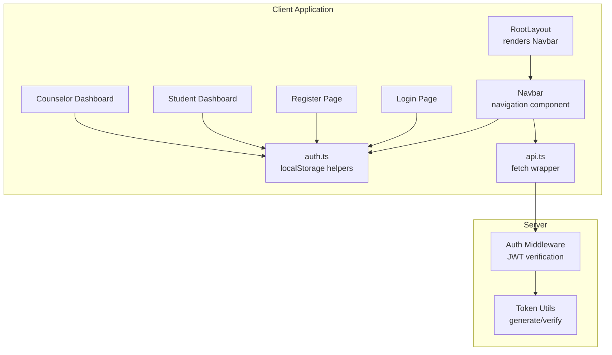
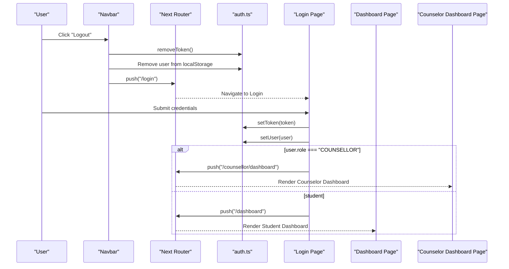
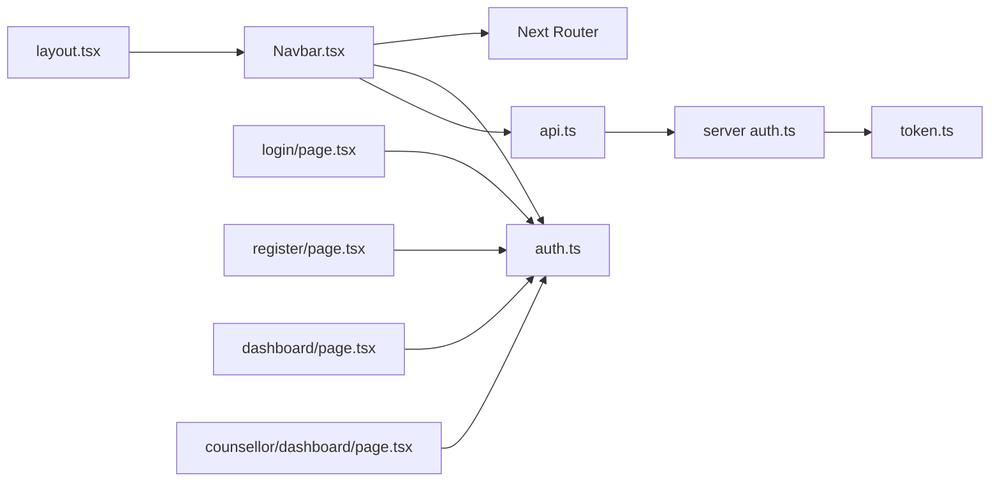

# Navigation Components

<cite>
**Referenced Files in This Document**
- [Navbar.tsx](file://client/src/components/Navbar.tsx)
- [auth.ts](file://client/src/lib/auth.ts)
- [api.ts](file://client/src/lib/api.ts)
- [layout.tsx](file://client/src/app/layout.tsx)
- [login/page.tsx](file://client/src/app/login/page.tsx)
- [register/page.tsx](file://client/src/app/register/page.tsx)
- [dashboard/page.tsx](file://client/src/app/dashboard/page.tsx)
- [counsellor/dashboard/page.tsx](file://client/src/app/counsellor/dashboard/page.tsx)
- [globals.css](file://client/src/app/globals.css)
- [auth.ts (server)](file://server/src/middleware/auth.ts)
- [token.ts](file://server/src/utils/token.ts)
</cite>

## Table of Contents
1. [Introduction](#introduction)
2. [Project Structure](#project-structure)
3. [Core Components](#core-components)
4. [Architecture Overview](#architecture-overview)
5. [Detailed Component Analysis](#detailed-component-analysis)
6. [Dependency Analysis](#dependency-analysis)
7. [Performance Considerations](#performance-considerations)
8. [Troubleshooting Guide](#troubleshooting-guide)
9. [Conclusion](#conclusion)

## Introduction
This document provides comprehensive documentation for the navigation components, with primary focus on the Navbar component. It explains authentication state detection, conditional rendering based on user roles (student vs counselor), responsive design patterns, routing logic, logout functionality, and state management using React hooks. It also covers styling classes, integration with the authentication system, usage examples, customization options, and troubleshooting common navigation issues.

## Project Structure
The navigation system spans client-side components and authentication utilities, integrated into the application layout. The Navbar component is rendered at the top of every page via the RootLayout, and integrates with authentication utilities to conditionally render navigation links and actions.

**Diagram sources**
- [layout.tsx:21-37](file://client/src/app/layout.tsx#L21-L37)
- [Navbar.tsx:8-95](file://client/src/components/Navbar.tsx#L8-L95)
- [auth.ts:1-27](file://client/src/lib/auth.ts#L1-L27)
- [api.ts:1-36](file://client/src/lib/api.ts#L1-L36)
- [login/page.tsx:9-40](file://client/src/app/login/page.tsx#L9-L40)
- [register/page.tsx:9-36](file://client/src/app/register/page.tsx#L9-L36)
- [dashboard/page.tsx:29-49](file://client/src/app/dashboard/page.tsx#L29-L49)
- [counsellor/dashboard/page.tsx:28-47](file://client/src/app/counsellor/dashboard/page.tsx#L28-L47)
- [auth.ts (server):5-22](file://server/src/middleware/auth.ts#L5-L22)
- [token.ts:4-16](file://server/src/utils/token.ts#L4-L16)

**Section sources**
- [layout.tsx:21-37](file://client/src/app/layout.tsx#L21-L37)
- [globals.css:1-20](file://client/src/app/globals.css#L1-L20)

## Core Components
This section focuses on the Navbar component and its integration with authentication utilities and routing.

- Navbar component
  - Purpose: Provides top-level navigation, conditional rendering based on authentication and user role, and logout functionality.
  - Authentication state detection: Uses local storage tokens and user data to determine authentication and role.
  - Conditional rendering: Renders different navigation items for counselors versus students.
  - Routing logic: Links to dashboard, chat, assessment, mood, and counselor dashboard depending on role.
  - Logout functionality: Clears tokens and user data, then navigates to the login page.
  - State management: Uses React hooks for mounted state and user state initialization.

- Authentication utilities
  - Token management: Functions to get, set, and remove tokens from localStorage.
  - User data management: Functions to get, set, and parse user data stored in localStorage.
  - Authentication check: Determines if a user is authenticated based on presence of a token.

- API wrapper
  - Centralized request handling with Authorization header injection.
  - Automatic 401 handling to redirect unauthenticated requests to login.

- Layout integration
  - RootLayout renders Navbar at the top of every page and manages the overall page structure.

**Section sources**
- [Navbar.tsx:8-95](file://client/src/components/Navbar.tsx#L8-L95)
- [auth.ts:1-27](file://client/src/lib/auth.ts#L1-L27)
- [api.ts:1-36](file://client/src/lib/api.ts#L1-L36)
- [layout.tsx:21-37](file://client/src/app/layout.tsx#L21-L37)

## Architecture Overview
The Navbar participates in a layered architecture:
- Presentation layer: Navbar renders UI and handles user interactions.
- State layer: React hooks manage component state and hydration.
- Authentication layer: Local storage-based authentication state and utilities.
- Routing layer: Next.js navigation for internal links and programmatic navigation.
- API layer: Fetch wrapper injects tokens and handles errors.
- Security layer: Server middleware validates JWTs and enforces role-based access.

**Diagram sources**
- [Navbar.tsx:18-22](file://client/src/components/Navbar.tsx#L18-L22)
- [auth.ts:10-22](file://client/src/lib/auth.ts#L10-L22)
- [login/page.tsx:22-34](file://client/src/app/login/page.tsx#L22-L34)
- [counsellor/dashboard/page.tsx:36-46](file://client/src/app/counsellor/dashboard/page.tsx#L36-L46)
- [dashboard/page.tsx:37-49](file://client/src/app/dashboard/page.tsx#L37-L49)

## Detailed Component Analysis

### Navbar Component Analysis
The Navbar component encapsulates the application's top navigation bar. It performs the following key tasks:
- Hydration safety: Uses a mounted flag to prevent SSR mismatches.
- Authentication detection: Reads token and user data from localStorage.
- Role-based rendering: Shows counselor-only links when the user role is "COUNSELLOR".
- Conditional navigation: Routes authenticated users to either student or counselor dashboards.
- Responsive design: Uses Tailwind utility classes for responsive spacing and alignment.
- Styling classes: Applies indigo-based theme with hover effects and transitions.

Key implementation patterns:
- React hooks: useRouter for navigation, useState for user state, useEffect for hydration.
- Conditional JSX: Renders different sets of links based on authentication and role.
- Event handler: handleLogout clears tokens and user data, then redirects to login.
- Styling: Tailwind classes define layout, colors, spacing, and hover states.

Props interface:
- None: The Navbar does not accept external props.

Event handlers:
- handleLogout: Clears authentication state and navigates to the login page.

Styling classes:
- Background: indigo-600
- Text: white
- Hover states: indigo-200 for links, indigo-400 for button hover
- Spacing: gap-4, gap-6
- Responsive padding: sm:px-6, lg:px-8
- Height: h-16

Integration with authentication system:
- Uses isAuthenticated() to determine visibility of authenticated sections.
- Uses getUser() to determine role and display user info.

Routing logic:
- Student dashboard: "/dashboard"
- Counselor dashboard: "/counsellor/dashboard"
- Chat: "/chat"
- Assessment: "/assessment"
- Mood: "/mood"
- Login: "/login"
- Register: "/register"

Logout functionality:
- Removes token and user from localStorage.
- Redirects to "/login".

Responsive design patterns:
- Flexbox layout with items-center and justify-between.
- Responsive padding and gap utilities.
- Mobile-first spacing with sm and lg breakpoints.

Customization options:
- Theme colors: Modify indigo palette classes to change branding.
- Navigation items: Extend conditional blocks to add/remove links.
- User info display: Adjust the span element to show additional user attributes.
- Styling: Tailwind utilities can be adapted to match design requirements.

Examples of component usage:
- The Navbar is included in RootLayout and automatically rendered on every page.
- It adapts its content based on the current authentication state and user role.

**Section sources**
- [Navbar.tsx:8-95](file://client/src/components/Navbar.tsx#L8-L95)
- [auth.ts:14-26](file://client/src/lib/auth.ts#L14-L26)
- [layout.tsx:31-33](file://client/src/app/layout.tsx#L31-L33)

### Authentication Utilities
The auth module provides localStorage-based authentication helpers:
- Token management: getToken, setToken, removeToken
- User data management: getUser, setUser
- Authentication check: isAuthenticated

These utilities are consumed by Navbar and pages to determine navigation state and protect routes.

**Section sources**
- [auth.ts:1-27](file://client/src/lib/auth.ts#L1-L27)

### API Wrapper
The api module centralizes HTTP requests:
- Injects Authorization header when a token exists.
- Handles 401 responses by clearing the token and redirecting to login.
- Returns parsed JSON data or throws errors for non-OK responses.

This ensures consistent authentication handling across the application.

**Section sources**
- [api.ts:1-36](file://client/src/lib/api.ts#L1-L36)

### Route Guards and Role-Based Access
Pages implement client-side route guards:
- Student Dashboard: Redirects unauthenticated users to login and counselors to counselor dashboard.
- Counselor Dashboard: Redirects unauthenticated users to login and students to student dashboard.

Server middleware enforces JWT verification and role-based access for protected endpoints.

**Section sources**
- [dashboard/page.tsx:37-49](file://client/src/app/dashboard/page.tsx#L37-L49)
- [counsellor/dashboard/page.tsx:36-46](file://client/src/app/counsellor/dashboard/page.tsx#L36-L46)
- [auth.ts (server):5-22](file://server/src/middleware/auth.ts#L5-L22)
- [token.ts:4-16](file://server/src/utils/token.ts#L4-L16)

### Login and Registration Pages
The Login and Register pages demonstrate authentication flow:
- Submit credentials to backend APIs.
- Store token and user data in localStorage.
- Redirect based on user role to appropriate dashboard.

**Section sources**
- [login/page.tsx:9-40](file://client/src/app/login/page.tsx#L9-L40)
- [register/page.tsx:9-36](file://client/src/app/register/page.tsx#L9-L36)

## Dependency Analysis
The Navbar depends on several modules and follows a clear dependency chain:
- Depends on Next.js router for navigation.
- Uses auth utilities for authentication state and user data.
- Integrates with API wrapper for centralized request handling.
- Is rendered by RootLayout, which manages global styles and page structure.

**Diagram sources**
- [Navbar.tsx:4-6](file://client/src/components/Navbar.tsx#L4-L6)
- [auth.ts:1-27](file://client/src/lib/auth.ts#L1-L27)
- [api.ts:1-36](file://client/src/lib/api.ts#L1-L36)
- [layout.tsx:4](file://client/src/app/layout.tsx#L4)
- [login/page.tsx:7](file://client/src/app/login/page.tsx#L7)
- [register/page.tsx:7](file://client/src/app/register/page.tsx#L7)
- [dashboard/page.tsx:7](file://client/src/app/dashboard/page.tsx#L7)
- [counsellor/dashboard/page.tsx:7](file://client/src/app/counsellor/dashboard/page.tsx#L7)
- [auth.ts (server):5-22](file://server/src/middleware/auth.ts#L5-L22)
- [token.ts:4-16](file://server/src/utils/token.ts#L4-L16)

**Section sources**
- [Navbar.tsx:4-6](file://client/src/components/Navbar.tsx#L4-L6)
- [layout.tsx:4](file://client/src/app/layout.tsx#L4)

## Performance Considerations
- Hydration safety: The mounted flag prevents SSR mismatches and unnecessary re-renders during initial load.
- Minimal state updates: User state is initialized once on mount and updated when authentication changes.
- Efficient routing: Next.js dynamic imports and client-side navigation minimize bundle overhead.
- Local storage usage: Lightweight token and user data storage avoids network round trips for basic auth checks.
- Tailwind utilities: Utility classes keep styles declarative and reduce CSS complexity.

## Troubleshooting Guide
Common navigation issues and resolutions:
- Navbar not rendering on all pages
  - Ensure Navbar is included in RootLayout and that the layout exports the default function correctly.
  - Verify Tailwind is configured and global styles are loaded.

- Authentication state not updating after login/logout
  - Confirm that setToken, removeToken, setUser, and getUser are used consistently.
  - Check that handleLogout clears both token and user data and redirects to login.

- Role-based navigation incorrect
  - Verify that user role is correctly stored in localStorage after login.
  - Ensure that counselor-only links are only shown when role equals "COUNSELLOR".

- 401 Unauthorized errors
  - The API wrapper automatically handles 401 responses by removing the token and redirecting to login.
  - On the server, ensure the auth middleware verifies tokens and rejects invalid/expired ones.

- Styling inconsistencies
  - Review Tailwind utility classes applied to Navbar and ensure global CSS is loaded.
  - Confirm that responsive utilities (sm:, lg:) are used appropriately for screen sizes.

- Route guard failures
  - Student Dashboard and Counselor Dashboard pages redirect unauthorized users to login.
  - Ensure that getUser and isAuthenticated are used consistently in route guards.

**Section sources**
- [Navbar.tsx:18-22](file://client/src/components/Navbar.tsx#L18-L22)
- [auth.ts:10-22](file://client/src/lib/auth.ts#L10-L22)
- [api.ts:20-26](file://client/src/lib/api.ts#L20-L26)
- [dashboard/page.tsx:37-49](file://client/src/app/dashboard/page.tsx#L37-L49)
- [counsellor/dashboard/page.tsx:36-46](file://client/src/app/counsellor/dashboard/page.tsx#L36-L46)
- [auth.ts (server):5-22](file://server/src/middleware/auth.ts#L5-L22)

## Conclusion
The Navbar component provides a robust, role-aware navigation foundation for the application. It integrates seamlessly with authentication utilities, routing, and styling to deliver a responsive and secure user experience. By leveraging React hooks, localStorage-based auth, and Next.js navigation, it offers a clean separation of concerns and easy extensibility for future enhancements.