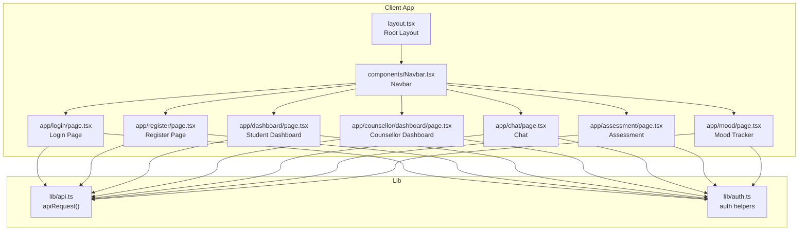
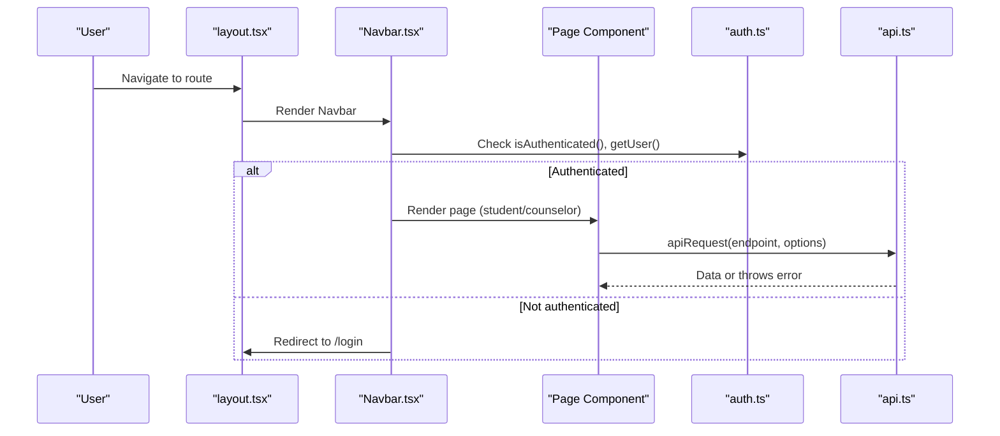
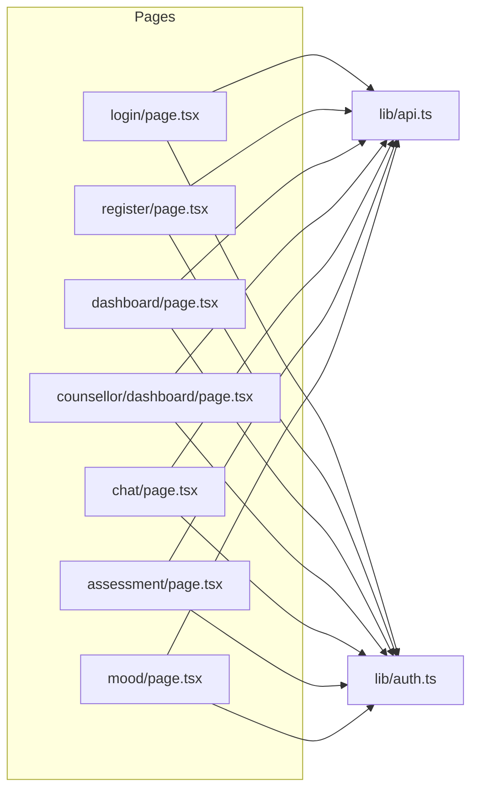

# UI Components

<cite>
**Referenced Files in This Document**
- [Navbar.tsx](file://client/src/components/Navbar.tsx)
- [layout.tsx](file://client/src/app/layout.tsx)
- [api.ts](file://client/src/lib/api.ts)
- [auth.ts](file://client/src/lib/auth.ts)
- [login/page.tsx](file://client/src/app/login/page.tsx)
- [register/page.tsx](file://client/src/app/register/page.tsx)
- [chat/page.tsx](file://client/src/app/chat/page.tsx)
- [dashboard/page.tsx](file://client/src/app/dashboard/page.tsx)
- [counsellor/dashboard/page.tsx](file://client/src/app/counsellor/dashboard/page.tsx)
- [assessment/page.tsx](file://client/src/app/assessment/page.tsx)
- [mood/page.tsx](file://client/src/app/mood/page.tsx)
- [globals.css](file://client/src/app/globals.css)
</cite>

## Table of Contents
1. [Introduction](#introduction)
2. [Project Structure](#project-structure)
3. [Core Components](#core-components)
4. [Architecture Overview](#architecture-overview)
5. [Detailed Component Analysis](#detailed-component-analysis)
6. [Dependency Analysis](#dependency-analysis)
7. [Performance Considerations](#performance-considerations)
8. [Troubleshooting Guide](#troubleshooting-guide)
9. [Conclusion](#conclusion)
10. [Appendices](#appendices)

## Introduction
This document describes the UI components and page implementations in the client application. It focuses on:
- Reusable Navbar component with authentication-aware navigation and responsive behavior
- Form components for login and registration with validation, error handling, and submission workflows
- Chat interface for conversation display, message input, and real-time-like updates
- Dashboard components for student and counselor views, including data visualization and interactive elements
It also covers component props, state management, event handlers, styling patterns, usage examples, customization options, and integration guidelines.

## Project Structure
The UI is built with Next.js App Router pages under client/src/app, a global layout that renders the Navbar, and a small set of shared utilities for authentication and API requests. The Navbar is included globally via the root layout.

**Diagram sources**
- [layout.tsx:21-37](file://client/src/app/layout.tsx#L21-L37)
- [Navbar.tsx:8-95](file://client/src/components/Navbar.tsx#L8-L95)
- [login/page.tsx:9-107](file://client/src/app/login/page.tsx#L9-L107)
- [register/page.tsx:9-119](file://client/src/app/register/page.tsx#L9-L119)
- [dashboard/page.tsx:29-205](file://client/src/app/dashboard/page.tsx#L29-L205)
- [counsellor/dashboard/page.tsx:28-212](file://client/src/app/counsellor/dashboard/page.tsx#L28-L212)
- [chat/page.tsx:17-195](file://client/src/app/chat/page.tsx#L17-L195)
- [assessment/page.tsx:33-191](file://client/src/app/assessment/page.tsx#L33-L191)
- [mood/page.tsx:29-244](file://client/src/app/mood/page.tsx#L29-L244)
- [api.ts:3-35](file://client/src/lib/api.ts#L3-L35)
- [auth.ts:1-27](file://client/src/lib/auth.ts#L1-L27)

**Section sources**
- [layout.tsx:21-37](file://client/src/app/layout.tsx#L21-L37)
- [globals.css:1-20](file://client/src/app/globals.css#L1-L20)

## Core Components
- Navbar: Renders top navigation with brand, role-aware links, authentication state display, and logout action. Uses client-side state and routing guards.
- Login Page: Controlled form with email/password, loading/error states, and redirect after successful login.
- Register Page: Controlled form with name/email/password, validation, and redirect after registration.
- Chat Page: Conversation list with auto-scroll, message input, and simulated bot typing indicator.
- Student Dashboard: Overview cards, quick actions, recent mood entries, and role guard.
- Counsellor Dashboard: Stats, filters, and alert list with status/risk badges.
- Assessment Page: PHQ-9 questionnaire with radio selections and results display.
- Mood Page: Mood rating selection, optional notes, history, and trend summary.

**Section sources**
- [Navbar.tsx:8-95](file://client/src/components/Navbar.tsx#L8-L95)
- [login/page.tsx:9-107](file://client/src/app/login/page.tsx#L9-L107)
- [register/page.tsx:9-119](file://client/src/app/register/page.tsx#L9-L119)
- [chat/page.tsx:17-195](file://client/src/app/chat/page.tsx#L17-L195)
- [dashboard/page.tsx:29-205](file://client/src/app/dashboard/page.tsx#L29-L205)
- [counsellor/dashboard/page.tsx:28-212](file://client/src/app/counsellor/dashboard/page.tsx#L28-L212)
- [assessment/page.tsx:33-191](file://client/src/app/assessment/page.tsx#L33-L191)
- [mood/page.tsx:29-244](file://client/src/app/mood/page.tsx#L29-L244)

## Architecture Overview
The UI relies on:
- Global layout rendering the Navbar and page content
- Shared authentication utilities for tokens and user info
- Shared API utility for authenticated requests and centralized error handling
- Role-based routing and guards to protect routes

**Diagram sources**
- [layout.tsx:21-37](file://client/src/app/layout.tsx#L21-L37)
- [Navbar.tsx:26-27](file://client/src/components/Navbar.tsx#L26-L27)
- [auth.ts:24-26](file://client/src/lib/auth.ts#L24-L26)
- [api.ts:3-35](file://client/src/lib/api.ts#L3-L35)

## Detailed Component Analysis

### Navbar Component
Responsibilities:
- Display brand and navigation links depending on authentication and role
- Show current user’s full name and role
- Handle logout and redirect to login

Key behaviors:
- Client-side mount guard to avoid SSR mismatches
- Authentication detection and role-aware menu
- Logout clears token and user from storage and navigates to login

Props and state:
- No incoming props
- Internal state: mounted flag, user object
- Event handlers: handleLogout()

Integration:
- Included in root layout
- Uses Next.js Link for navigation and useRouter for programmatic navigation

Customization:
- Modify links and roles by editing conditional blocks
- Adjust styling classes for theme alignment

**Section sources**
- [Navbar.tsx:8-95](file://client/src/components/Navbar.tsx#L8-L95)
- [layout.tsx:32-33](file://client/src/app/layout.tsx#L32-L33)
- [auth.ts:14-22](file://client/src/lib/auth.ts#L14-L22)

### Login Page
Responsibilities:
- Present email/password form
- Validate inputs and show errors
- Submit credentials to backend and persist token/user
- Redirect based on role

State and events:
- Local state: email, password, error, loading
- Event handler: handleSubmit()

Workflow:
- Prevent default form submit, set loading, call apiRequest
- On success, set token and user, navigate to appropriate dashboard
- On error, display error message

Validation and UX:
- Required fields enforced by HTML attributes
- Loading state disables submit button

**Section sources**
- [login/page.tsx:9-107](file://client/src/app/login/page.tsx#L9-L107)
- [api.ts:3-35](file://client/src/lib/api.ts#L3-L35)
- [auth.ts:6-22](file://client/src/lib/auth.ts#L6-L22)

### Registration Page
Responsibilities:
- Collect full name, email, password
- Validate inputs and show errors
- Submit registration and persist token/user
- Redirect to student dashboard

State and events:
- Local state: fullName, email, password, error, loading
- Event handler: handleSubmit()

Workflow:
- Prevent default, set loading, call apiRequest
- On success, set token and user, navigate to dashboard
- On error, display error message

Validation and UX:
- Required fields and minimum password length enforced
- Loading state disables submit button

**Section sources**
- [register/page.tsx:9-119](file://client/src/app/register/page.tsx#L9-L119)
- [api.ts:3-35](file://client/src/lib/api.ts#L3-L35)
- [auth.ts:6-22](file://client/src/lib/auth.ts#L6-L22)

### Chat Interface
Responsibilities:
- Load conversations and messages
- Display messages with alignment and timestamps
- Allow sending new messages and simulate bot typing
- Auto-scroll to latest message

State and events:
- Local state: conversationId, messages array, input text, loading, sending
- Ref: messagesEndRef for scrolling
- Event handlers: loadConversations(), handleSend()

Workflow:
- On mount, check authentication and load latest conversation
- On send: create conversation if needed, post message, append user/bot messages
- Scroll to bottom after messages update

Real-time behavior:
- Simulated typing indicator during send
- Updates reflect immediately after successful POST

**Section sources**
- [chat/page.tsx:17-195](file://client/src/app/chat/page.tsx#L17-L195)

### Student Dashboard
Responsibilities:
- Show quick stats: latest mood, PHQ-9 severity, risk level
- Provide quick action links
- Display recent mood entries with dates

State and events:
- Local state: user, moods[], risk, latestAssessment, loading
- Event handler: fetchData() using Promise.allSettled

Workflow:
- Guard against unauthenticated or counselor access
- Fetch mood, risk, and assessment data concurrently
- Render stats and entries with color-coded labels

**Section sources**
- [dashboard/page.tsx:29-205](file://client/src/app/dashboard/page.tsx#L29-L205)

### Counsellor Dashboard
Responsibilities:
- Show dashboard stats: total alerts and counts per status
- Filter alerts by status and risk level
- List alerts with user info, risk badge, status badge, and date

State and events:
- Local state: stats, alerts, statusFilter, riskFilter, loading
- Event handlers: buildQuery(), handleFilterChange(), fetchData()

Workflow:
- Guard against unauthenticated or non-counsellor access
- Fetch stats and filtered alerts concurrently
- Apply filters via URL query string and reload on change

**Section sources**
- [counsellor/dashboard/page.tsx:28-212](file://client/src/app/counsellor/dashboard/page.tsx#L28-L212)

### Assessment Page
Responsibilities:
- Present PHQ-9 questions as radio groups
- Compute and display severity level and score
- Allow retaking the assessment

State and events:
- Local state: responses array, result, error, submitting
- Event handlers: handleOptionChange(), handleSubmit(), handleRetake()

Workflow:
- Validate completeness before submit
- POST responses and render results with severity info
- Reset state to retake

**Section sources**
- [assessment/page.tsx:33-191](file://client/src/app/assessment/page.tsx#L33-L191)

### Mood Page
Responsibilities:
- Capture mood rating with emoji-based selection
- Optional notes
- Show history and trend summary

State and events:
- Local state: rating, notes, history[], trend, error, success, submitting, loading
- Event handlers: handleSubmit(), fetchData()

Workflow:
- Validate rating range before submit
- POST mood entry, reset form, refresh data
- Render history and trend indicators

**Section sources**
- [mood/page.tsx:29-244](file://client/src/app/mood/page.tsx#L29-L244)

## Dependency Analysis
Shared utilities:
- api.ts centralizes fetch logic, token injection, 401 handling, and error extraction
- auth.ts centralizes token and user persistence and authentication checks

**Diagram sources**
- [login/page.tsx:9-107](file://client/src/app/login/page.tsx#L9-L107)
- [register/page.tsx:9-119](file://client/src/app/register/page.tsx#L9-L119)
- [dashboard/page.tsx:29-205](file://client/src/app/dashboard/page.tsx#L29-L205)
- [counsellor/dashboard/page.tsx:28-212](file://client/src/app/counsellor/dashboard/page.tsx#L28-L212)
- [chat/page.tsx:17-195](file://client/src/app/chat/page.tsx#L17-L195)
- [assessment/page.tsx:33-191](file://client/src/app/assessment/page.tsx#L33-L191)
- [mood/page.tsx:29-244](file://client/src/app/mood/page.tsx#L29-L244)
- [api.ts:3-35](file://client/src/lib/api.ts#L3-L35)
- [auth.ts:1-27](file://client/src/lib/auth.ts#L1-L27)

**Section sources**
- [api.ts:3-35](file://client/src/lib/api.ts#L3-L35)
- [auth.ts:1-27](file://client/src/lib/auth.ts#L1-L27)

## Performance Considerations
- Concurrent data fetching: Student and counselor dashboards use concurrent requests to reduce load time.
- Minimal re-renders: Pages rely on controlled components and local state to avoid unnecessary updates.
- Client-side guards prevent wasted work on protected routes.
- Typing indicator and immediate UI updates improve perceived responsiveness in chat.

## Troubleshooting Guide
Common issues and resolutions:
- Unauthorized access: api.ts automatically handles 401 by clearing token and redirecting to login.
- Authentication mismatch: Navbar and pages check authentication and redirect accordingly.
- Form submission failures: Login/register/assessment/mood pages surface errors returned by the API.
- Chat state: If messages do not appear, ensure the conversation exists or allow creation on first send.

**Section sources**
- [api.ts:20-26](file://client/src/lib/api.ts#L20-L26)
- [Navbar.tsx:26-27](file://client/src/components/Navbar.tsx#L26-L27)
- [login/page.tsx:35-39](file://client/src/app/login/page.tsx#L35-L39)
- [register/page.tsx:31-35](file://client/src/app/register/page.tsx#L31-L35)
- [assessment/page.tsx:68-72](file://client/src/app/assessment/page.tsx#L68-L72)
- [mood/page.tsx:86-90](file://client/src/app/mood/page.tsx#L86-L90)

## Conclusion
The UI components are cohesive, role-aware, and leverage shared utilities for authentication and API communication. They emphasize clear state management, guarded routing, and responsive design patterns. The provided components offer a solid foundation for extending functionality while maintaining consistency.

## Appendices

### Props, State, Events Reference

- Navbar
  - Props: none
  - State: mounted, user
  - Events: handleLogout()
  - Integration: rendered in layout

- Login Page
  - Props: none
  - State: email, password, error, loading
  - Events: handleSubmit()

- Register Page
  - Props: none
  - State: fullName, email, password, error, loading
  - Events: handleSubmit()

- Chat Page
  - Props: none
  - State: conversationId, messages, input, loading, sending
  - Events: loadConversations(), handleSend()
  - Ref: messagesEndRef

- Student Dashboard
  - Props: none
  - State: user, moods, risk, latestAssessment, loading
  - Events: fetchData()

- Counsellor Dashboard
  - Props: none
  - State: stats, alerts, statusFilter, riskFilter, loading
  - Events: buildQuery(), handleFilterChange(), fetchData()

- Assessment Page
  - Props: none
  - State: responses, result, error, submitting
  - Events: handleOptionChange(), handleSubmit(), handleRetake()

- Mood Page
  - Props: none
  - State: rating, notes, history, trend, error, success, submitting, loading
  - Events: handleSubmit(), fetchData()

**Section sources**
- [Navbar.tsx:8-95](file://client/src/components/Navbar.tsx#L8-L95)
- [login/page.tsx:9-107](file://client/src/app/login/page.tsx#L9-L107)
- [register/page.tsx:9-119](file://client/src/app/register/page.tsx#L9-L119)
- [chat/page.tsx:17-195](file://client/src/app/chat/page.tsx#L17-L195)
- [dashboard/page.tsx:29-205](file://client/src/app/dashboard/page.tsx#L29-L205)
- [counsellor/dashboard/page.tsx:28-212](file://client/src/app/counsellor/dashboard/page.tsx#L28-L212)
- [assessment/page.tsx:33-191](file://client/src/app/assessment/page.tsx#L33-L191)
- [mood/page.tsx:29-244](file://client/src/app/mood/page.tsx#L29-L244)

### Styling Patterns
- Tailwind-based utility classes for spacing, colors, shadows, and responsive grids
- Consistent indigo palette for primary actions and accents
- Role-specific navigation and redirects
- Responsive breakpoints using sm/md/lg classes

**Section sources**
- [Navbar.tsx:30-93](file://client/src/components/Navbar.tsx#L30-L93)
- [login/page.tsx:43-105](file://client/src/app/login/page.tsx#L43-L105)
- [register/page.tsx:39-117](file://client/src/app/register/page.tsx#L39-L117)
- [chat/page.tsx:132-194](file://client/src/app/chat/page.tsx#L132-L194)
- [dashboard/page.tsx:106-203](file://client/src/app/dashboard/page.tsx#L106-L203)
- [counsellor/dashboard/page.tsx:109-211](file://client/src/app/counsellor/dashboard/page.tsx#L109-L211)
- [assessment/page.tsx:133-190](file://client/src/app/assessment/page.tsx#L133-L190)
- [mood/page.tsx:115-243](file://client/src/app/mood/page.tsx#L115-L243)
- [globals.css:1-20](file://client/src/app/globals.css#L1-L20)