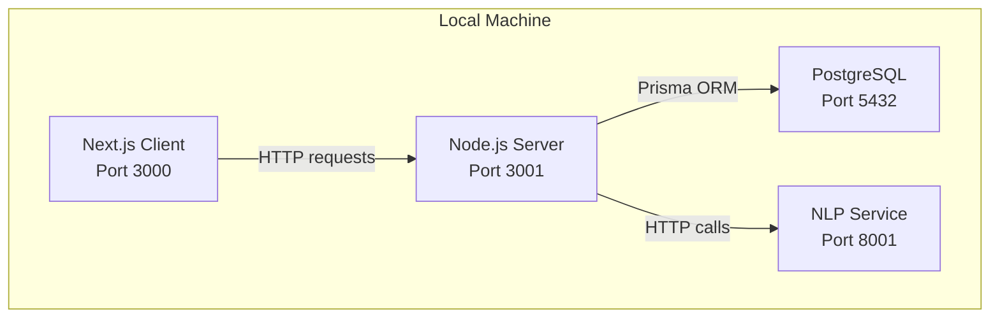
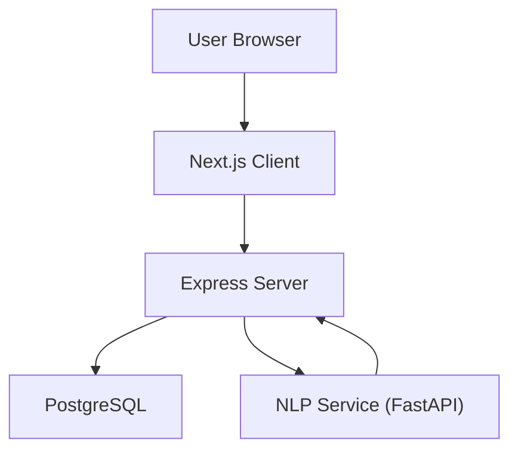
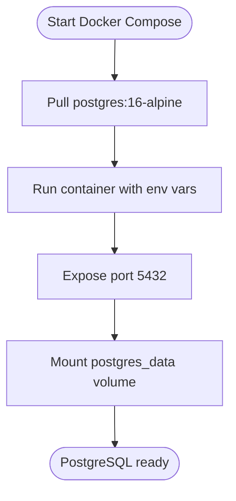
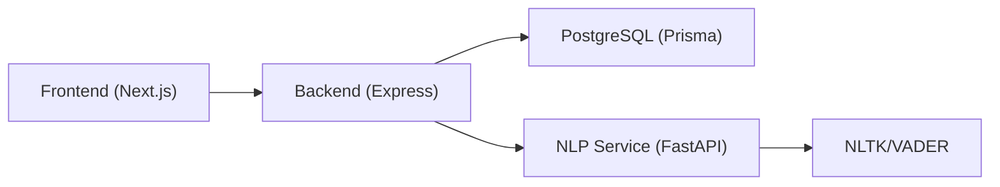

# Getting Started

<cite>
**Referenced Files in This Document**
- [README.md](file://README.md)
- [docker-compose.yml](file://docker-compose.yml)
- [package.json](file://package.json)
- [server/package.json](file://server/package.json)
- [client/package.json](file://client/package.json)
- [prisma/schema.prisma](file://prisma/schema.prisma)
- [server/src/config/env.ts](file://server/src/config/env.ts)
- [server/src/services/nlp.service.ts](file://server/src/services/nlp.service.ts)
- [client/src/lib/api.ts](file://client/src/lib/api.ts)
- [nlp-service/main.py](file://nlp-service/main.py)
- [nlp-service/models.py](file://nlp-service/models.py)
- [nlp-service/nlp/analyzer.py](file://nlp-service/nlp/analyzer.py)
- [nlp-service/nlp/processor.py](file://nlp-service/nlp/processor.py)
- [requirements.txt](file://requirements.txt)
</cite>

## Table of Contents
1. [Introduction](#introduction)
2. [Project Structure](#project-structure)
3. [Core Components](#core-components)
4. [Architecture Overview](#architecture-overview)
5. [Detailed Component Analysis](#detailed-component-analysis)
6. [Dependency Analysis](#dependency-analysis)
7. [Performance Considerations](#performance-considerations)
8. [Troubleshooting Guide](#troubleshooting-guide)
9. [Conclusion](#conclusion)
10. [Appendices](#appendices)

## Introduction
This guide helps you set up the BuddyAI development environment from scratch. You will install prerequisites, configure environment variables for the frontend and backend, prepare PostgreSQL via Docker Compose, run the NLP service, and launch the full application locally. You will also learn how to verify functionality, troubleshoot common issues, and follow development best practices.

## Project Structure
BuddyAI is a multi-module project with:
- Frontend: Next.js application
- Backend: Node.js/Express server with TypeScript
- NLP Service: Python/FastAPI microservice
- Database: PostgreSQL managed by Prisma ORM
- Orchestration: Docker Compose for database provisioning

**Diagram sources**
- [docker-compose.yml:1-19](file://docker-compose.yml#L1-L19)
- [server/src/config/env.ts:6-11](file://server/src/config/env.ts#L6-L11)
- [nlp-service/main.py:67-71](file://nlp-service/main.py#L67-L71)
- [client/src/lib/api.ts:1-36](file://client/src/lib/api.ts#L1-L36)

**Section sources**
- [README.md:86-124](file://README.md#L86-L124)
- [docker-compose.yml:1-19](file://docker-compose.yml#L1-L19)

## Core Components
- Frontend (Next.js): Runs on port 3000 by default; communicates with the backend API.
- Backend (Node.js/Express): Runs on port 3001 by default; connects to PostgreSQL via Prisma.
- NLP Service (Python/FastAPI): Runs on port 8001 by default; provides sentiment analysis.
- Database (PostgreSQL): Provisioned via Docker Compose; data persisted to a named volume.

Key ports:
- Frontend: 3000
- Backend: 3001
- NLP Service: 8001
- Database: 5432

**Section sources**
- [client/package.json:5-10](file://client/package.json#L5-L10)
- [server/package.json:6-12](file://server/package.json#L6-L12)
- [nlp-service/main.py:67-71](file://nlp-service/main.py#L67-L71)
- [docker-compose.yml:12-13](file://docker-compose.yml#L12-L13)

## Architecture Overview
The system follows a layered architecture with clear separation of concerns:
- Presentation Layer: Next.js web UI
- Application Layer: Express server handling routes, services, and database operations
- NLP Layer: Standalone FastAPI service for sentiment analysis
- Data Layer: PostgreSQL with Prisma ORM

**Diagram sources**
- [README.md:125-210](file://README.md#L125-L210)
- [server/src/services/nlp.service.ts:11-23](file://server/src/services/nlp.service.ts#L11-L23)
- [prisma/schema.prisma:5-8](file://prisma/schema.prisma#L5-L8)

## Detailed Component Analysis

### Prerequisites and Installation
Install the following tools globally:
- Node.js (LTS recommended)
- Python 3.x
- Docker Desktop

Then install project dependencies:
- Root: installs monorepo scripts and Prisma CLI
- Server: installs backend dependencies
- Client: installs frontend dependencies
- NLP Service: installs Python packages from requirements

Run the setup script to install all dependencies at once.

**Section sources**
- [package.json:18-18](file://package.json#L18-L18)
- [server/package.json:13-34](file://server/package.json#L13-L34)
- [client/package.json:5-10](file://client/package.json#L5-L10)
- [requirements.txt:1-68](file://requirements.txt#L1-L68)

### Environment Variables

Configure backend environment variables:
- PORT: server port (default 3001)
- DATABASE_URL: PostgreSQL connection string (Prisma datasource)
- JWT_SECRET: secret for signing tokens (default provided for development)
- NLP_SERVICE_URL: URL to the NLP service (default http://localhost:8001)

Configure frontend environment variables:
- NEXT_PUBLIC_API_URL: base URL for the backend API (default http://localhost:3001)

These defaults align with local development ports and Docker Compose configuration.

**Section sources**
- [server/src/config/env.ts:6-11](file://server/src/config/env.ts#L6-L11)
- [client/src/lib/api.ts:1-1](file://client/src/lib/api.ts#L1-L1)
- [prisma/schema.prisma:5-8](file://prisma/schema.prisma#L5-L8)

### Database Setup with PostgreSQL
Use Docker Compose to provision PostgreSQL:
- Image: postgres:16-alpine
- Exposed port: 5432
- Persisted volume: postgres_data
- Default credentials: user, password, database all set to buddyai

Initialize the database:
- Run migrations to create tables
- Optionally open Prisma Studio to inspect data

**Diagram sources**
- [docker-compose.yml:1-19](file://docker-compose.yml#L1-L19)

**Section sources**
- [docker-compose.yml:3-19](file://docker-compose.yml#L3-L19)
- [prisma/schema.prisma:5-8](file://prisma/schema.prisma#L5-L8)
- [package.json:15-17](file://package.json#L15-L17)

### Running the NLP Service
The NLP service is a Python/FastAPI application:
- Starts a Uvicorn server on port 8001 by default
- Provides endpoints:
  - POST /analyze: sentiment analysis
  - GET /health: service health check
- Downloads required NLTK resources on startup

Ensure NLTK data is available and CORS is enabled for cross-origin requests from the backend.

**Section sources**
- [nlp-service/main.py:28-71](file://nlp-service/main.py#L28-L71)
- [nlp-service/models.py:4-26](file://nlp-service/models.py#L4-L26)
- [nlp-service/nlp/analyzer.py:8-27](file://nlp-service/nlp/analyzer.py#L8-L27)
- [nlp-service/nlp/processor.py:10-19](file://nlp-service/nlp/processor.py#L10-L19)

### Running the Application Locally
Use the root npm scripts to start all services concurrently:
- dev: starts server, client, and NLP service
- start: production-like concurrent start
- db:migrate, db:generate, db:studio: Prisma commands

Ports:
- Frontend: 3000
- Backend: 3001
- NLP Service: 8001
- Database: 5432

Verify connectivity:
- Backend health: curl http://localhost:3001/health
- NLP health: curl http://localhost:8001/health
- Database reachable via Prisma after migrations

**Section sources**
- [package.json:5-18](file://package.json#L5-L18)
- [server/package.json:6-12](file://server/package.json#L6-L12)
- [nlp-service/main.py:61-64](file://nlp-service/main.py#L61-L64)

### Accessing the Web Interface
Open http://localhost:3000 in your browser. The Next.js app will communicate with the backend at http://localhost:3001 by default. Log in or register to access features like chat, mood tracking, and assessments.

**Section sources**
- [client/src/lib/api.ts:1-1](file://client/src/lib/api.ts#L1-L1)
- [client/package.json:5-10](file://client/package.json#L5-L10)

### Development Workflow
- Hot reload:
  - Frontend: next dev on port 3000
  - Backend: nodemon with ts-node on port 3001
  - NLP: Uvicorn reloader on port 8001
- Testing:
  - Backend tests with Vitest
  - NLP tests with pytest
- Build:
  - Frontend: next build
  - Backend: tsc build
- Prisma:
  - Migrations and client generation via npm scripts

**Section sources**
- [client/package.json:5-10](file://client/package.json#L5-L10)
- [server/package.json:6-12](file://server/package.json#L6-L12)
- [package.json:15-17](file://package.json#L15-L17)
- [requirements.txt:60-62](file://requirements.txt#L60-L62)

### Security Considerations for Development
- JWT_SECRET: change the default development secret before enabling production features.
- HTTPS: enable in development if needed for local testing of secure cookies.
- CORS: ensure origins are restricted appropriately in non-development environments.
- Database credentials: avoid committing secrets; use environment variables.
- Token handling: the frontend stores a bearer token in localStorage; consider HttpOnly cookies for production.

**Section sources**
- [server/src/config/env.ts:9-11](file://server/src/config/env.ts#L9-L11)
- [client/src/lib/api.ts:11-13](file://client/src/lib/api.ts#L11-L13)

### Authentication and Database Connections
- Authentication:
  - JWT-based login/logout
  - Protected routes enforced by middleware
- Database:
  - Prisma connects via DATABASE_URL
  - Migrations create tables and seed data as needed

**Section sources**
- [server/src/config/env.ts:8-8](file://server/src/config/env.ts#L8-L8)
- [prisma/schema.prisma:5-8](file://prisma/schema.prisma#L5-L8)
- [server/src/services/nlp.service.ts:11-23](file://server/src/services/nlp.service.ts#L11-L23)

## Dependency Analysis
High-level dependencies:
- Frontend depends on backend API and environment configuration
- Backend depends on PostgreSQL and NLP service
- NLP service depends on NLTK and VADER lexicon
- Database depends on Docker Compose for orchestration

**Diagram sources**
- [client/src/lib/api.ts:1-36](file://client/src/lib/api.ts#L1-L36)
- [server/src/services/nlp.service.ts:11-23](file://server/src/services/nlp.service.ts#L11-L23)
- [prisma/schema.prisma:5-8](file://prisma/schema.prisma#L5-L8)
- [nlp-service/main.py:28-71](file://nlp-service/main.py#L28-L71)

**Section sources**
- [README.md:86-124](file://README.md#L86-L124)
- [docker-compose.yml:1-19](file://docker-compose.yml#L1-L19)

## Performance Considerations
- Keep services on localhost to minimize network latency.
- Use hot reload during development; avoid unnecessary rebuilds.
- For NLP, batch or debounce requests to reduce load.
- Monitor Prisma query performance and add indexes as needed.

[No sources needed since this section provides general guidance]

## Troubleshooting Guide
Common issues and resolutions:
- Port conflicts:
  - Change NEXT_PUBLIC_API_URL to match a free port if 3001 is in use.
  - Adjust PORT in backend env if 3001 is occupied.
  - Verify NLP_PORT environment variable if the NLP service fails to start on 8001.
- Database not reachable:
  - Confirm Docker Compose is running and the container is healthy.
  - Ensure DATABASE_URL matches the exposed port and credentials.
  - Run migrations again if schema is missing.
- NLP service errors:
  - Confirm the NLP service is running and responds to /health.
  - Check that NLTK data was downloaded successfully on startup.
- Frontend authentication loops:
  - Clear localStorage token if stale.
  - Verify JWT_SECRET consistency between frontend and backend.
- CORS errors:
  - Ensure the NLP service allows the frontend origin in CORS configuration.

**Section sources**
- [docker-compose.yml:12-13](file://docker-compose.yml#L12-L13)
- [server/src/config/env.ts:6-11](file://server/src/config/env.ts#L6-L11)
- [nlp-service/main.py:30-36](file://nlp-service/main.py#L30-L36)
- [client/src/lib/api.ts:20-26](file://client/src/lib/api.ts#L20-L26)

## Conclusion
You now have a complete local development environment for BuddyAI. With PostgreSQL provisioned via Docker Compose, the backend and frontend running on standard ports, and the NLP service available for sentiment analysis, you can start building and testing features. Follow the security recommendations, keep ports aligned, and leverage the provided scripts for efficient development.

[No sources needed since this section summarizes without analyzing specific files]

## Appendices

### Quick Start Checklist
- Install Node.js, Python, Docker
- Run setup script to install dependencies
- Start Docker Compose for PostgreSQL
- Run Prisma migrations
- Start all services with npm run dev
- Open http://localhost:3000

**Section sources**
- [package.json:18-18](file://package.json#L18-L18)
- [docker-compose.yml:1-19](file://docker-compose.yml#L1-L19)
- [package.json:15-17](file://package.json#L15-L17)
- [client/package.json:5-10](file://client/package.json#L5-L10)