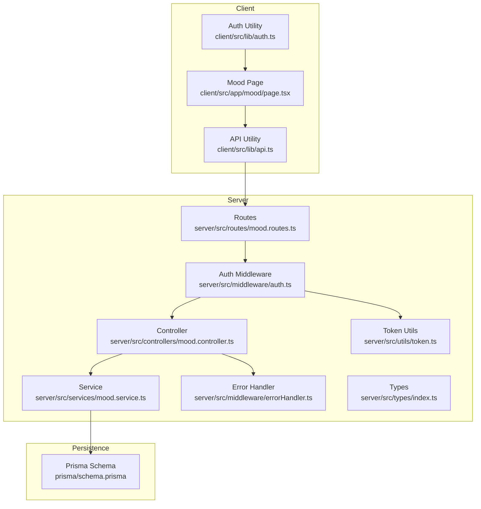
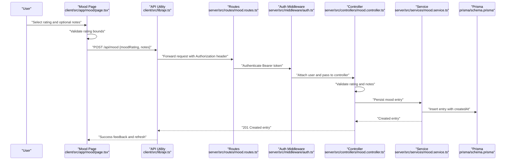
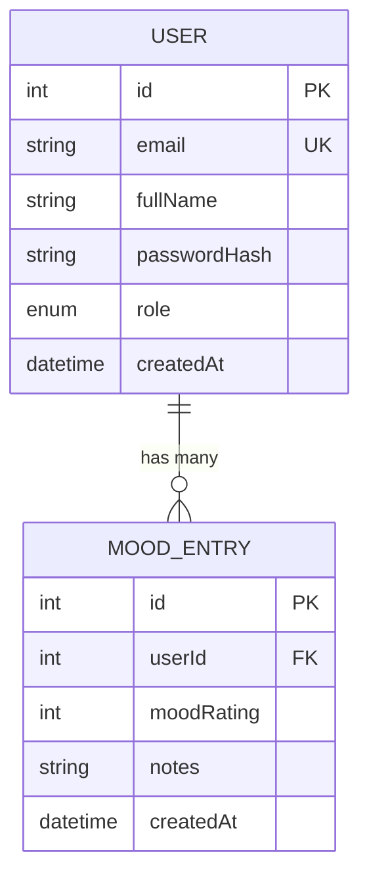
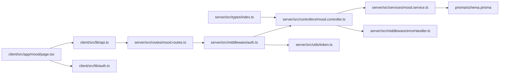

# Mood Entry Management

<cite>
**Referenced Files in This Document**
- [client/src/app/mood/page.tsx](file://client/src/app/mood/page.tsx)
- [client/src/lib/api.ts](file://client/src/lib/api.ts)
- [client/src/lib/auth.ts](file://client/src/lib/auth.ts)
- [server/src/controllers/mood.controller.ts](file://server/src/controllers/mood.controller.ts)
- [server/src/services/mood.service.ts](file://server/src/services/mood.service.ts)
- [server/src/routes/mood.routes.ts](file://server/src/routes/mood.routes.ts)
- [server/src/middleware/auth.ts](file://server/src/middleware/auth.ts)
- [server/src/middleware/errorHandler.ts](file://server/src/middleware/errorHandler.ts)
- [server/src/utils/token.ts](file://server/src/utils/token.ts)
- [server/src/types/index.ts](file://server/src/types/index.ts)
- [prisma/schema.prisma](file://prisma/schema.prisma)
- [server/src/__tests__/mood.test.ts](file://server/src/__tests__/mood.test.ts)
</cite>

## Table of Contents
1. [Introduction](#introduction)
2. [Project Structure](#project-structure)
3. [Core Components](#core-components)
4. [Architecture Overview](#architecture-overview)
5. [Detailed Component Analysis](#detailed-component-analysis)
6. [Dependency Analysis](#dependency-analysis)
7. [Performance Considerations](#performance-considerations)
8. [Troubleshooting Guide](#troubleshooting-guide)
9. [Conclusion](#conclusion)

## Introduction
This document describes the mood entry management system, focusing on the 1–5 mood rating scale, validation rules, and data entry workflows. It explains how mood entries are created, validated, stored, and displayed, including automatic timestamping, user authentication requirements, and note-taking capabilities. The frontend implementation covers the mood logging interface, rating selection components, and form validation. Practical examples demonstrate successful creation, error handling for invalid ratings, and integration with the authentication middleware. Edge cases such as duplicate entries, rating boundary conditions, and note length limitations are addressed.

## Project Structure
The mood entry management system spans the client-side Next.js application and the server-side Express API with Prisma ORM. The client handles user interactions and displays mood history and trends. The server enforces authentication, validates inputs, and persists entries to the database.

**Diagram sources**
- [client/src/app/mood/page.tsx:1-245](file://client/src/app/mood/page.tsx#L1-L245)
- [client/src/lib/api.ts:1-36](file://client/src/lib/api.ts#L1-L36)
- [client/src/lib/auth.ts:1-27](file://client/src/lib/auth.ts#L1-L27)
- [server/src/routes/mood.routes.ts:1-12](file://server/src/routes/mood.routes.ts#L1-L12)
- [server/src/controllers/mood.controller.ts:1-67](file://server/src/controllers/mood.controller.ts#L1-L67)
- [server/src/services/mood.service.ts:1-58](file://server/src/services/mood.service.ts#L1-L58)
- [server/src/middleware/auth.ts:1-39](file://server/src/middleware/auth.ts#L1-L39)
- [server/src/middleware/errorHandler.ts:1-13](file://server/src/middleware/errorHandler.ts#L1-L13)
- [server/src/utils/token.ts:1-17](file://server/src/utils/token.ts#L1-L17)
- [server/src/types/index.ts:1-12](file://server/src/types/index.ts#L1-L12)
- [prisma/schema.prisma:1-134](file://prisma/schema.prisma#L1-L134)

**Section sources**
- [client/src/app/mood/page.tsx:1-245](file://client/src/app/mood/page.tsx#L1-L245)
- [server/src/routes/mood.routes.ts:1-12](file://server/src/routes/mood.routes.ts#L1-L12)
- [prisma/schema.prisma:86-95](file://prisma/schema.prisma#L86-L95)

## Core Components
- Mood logging interface: Provides a 1–5 rating scale with emoji labels, optional notes, and submission feedback.
- Authentication integration: Ensures only logged-in users can submit mood entries and access history/trends.
- Validation pipeline: Validates rating boundaries, note type, and presence of required fields.
- Persistence layer: Stores entries with automatic timestamps and links to the user.
- Trend computation: Computes averages over recent and older windows and classifies trend direction.

Key implementation references:
- Frontend rating selection and form validation: [client/src/app/mood/page.tsx:63-91](file://client/src/app/mood/page.tsx#L63-L91)
- Backend controller validation and creation: [server/src/controllers/mood.controller.ts:5-34](file://server/src/controllers/mood.controller.ts#L5-L34)
- Service persistence and history/trends: [server/src/services/mood.service.ts:3-57](file://server/src/services/mood.service.ts#L3-L57)
- Prisma model definition: [prisma/schema.prisma:86-95](file://prisma/schema.prisma#L86-L95)

**Section sources**
- [client/src/app/mood/page.tsx:21-27](file://client/src/app/mood/page.tsx#L21-L27)
- [client/src/app/mood/page.tsx:63-91](file://client/src/app/mood/page.tsx#L63-L91)
- [server/src/controllers/mood.controller.ts:14-27](file://server/src/controllers/mood.controller.ts#L14-L27)
- [server/src/services/mood.service.ts:3-20](file://server/src/services/mood.service.ts#L3-L20)
- [prisma/schema.prisma:86-95](file://prisma/schema.prisma#L86-L95)

## Architecture Overview
The system follows a layered architecture:
- Client renders the mood logging UI and manages local state.
- API requests are sent via a wrapper that injects authentication tokens.
- Routes are protected by middleware that verifies JWT tokens and attaches user identity.
- Controllers validate inputs and delegate to services.
- Services persist and query data using Prisma.
- Trends are computed server-side based on recent and older entries.

**Diagram sources**
- [client/src/app/mood/page.tsx:63-91](file://client/src/app/mood/page.tsx#L63-L91)
- [client/src/lib/api.ts:3-35](file://client/src/lib/api.ts#L3-L35)
- [server/src/routes/mood.routes.ts:7-9](file://server/src/routes/mood.routes.ts#L7-L9)
- [server/src/middleware/auth.ts:5-22](file://server/src/middleware/auth.ts#L5-L22)
- [server/src/controllers/mood.controller.ts:5-34](file://server/src/controllers/mood.controller.ts#L5-L34)
- [server/src/services/mood.service.ts:3-7](file://server/src/services/mood.service.ts#L3-L7)
- [prisma/schema.prisma:86-95](file://prisma/schema.prisma#L86-L95)

## Detailed Component Analysis

### Mood Rating Scale Implementation (1–5)
- The frontend defines five rating options with emoji and labels for quick selection.
- Selection updates local state; submission triggers validation and API call.
- The backend strictly enforces integer values within the 1–5 range.

Implementation references:
- Rating options and selection: [client/src/app/mood/page.tsx:21-27](file://client/src/app/mood/page.tsx#L21-L27), [client/src/app/mood/page.tsx:138-154](file://client/src/app/mood/page.tsx#L138-L154)
- Local validation before submission: [client/src/app/mood/page.tsx:68-71](file://client/src/app/mood/page.tsx#L68-L71)
- Backend validation: [server/src/controllers/mood.controller.ts:19-22](file://server/src/controllers/mood.controller.ts#L19-L22)

Edge cases covered:
- Rating below 1 or above 5 is rejected by both frontend and backend.
- Non-integer values are rejected by backend.

**Section sources**
- [client/src/app/mood/page.tsx:21-27](file://client/src/app/mood/page.tsx#L21-L27)
- [client/src/app/mood/page.tsx:68-71](file://client/src/app/mood/page.tsx#L68-L71)
- [server/src/controllers/mood.controller.ts:19-22](file://server/src/controllers/mood.controller.ts#L19-L22)

### Validation Rules and Data Entry Workflows
Validation occurs on two layers:
- Client-side: Prevents submission if rating is out of bounds or empty.
- Server-side: Enforces required fields, type checks, and range constraints.

Workflow steps:
1. User selects rating and optional notes.
2. Client validates rating and submits payload.
3. Server validates presence and type of rating and notes.
4. Service persists the entry with automatic timestamp.
5. Controller responds with created entry.

References:
- Client validation and submission: [client/src/app/mood/page.tsx:63-91](file://client/src/app/mood/page.tsx#L63-L91)
- Server validation: [server/src/controllers/mood.controller.ts:12-27](file://server/src/controllers/mood.controller.ts#L12-L27)
- Persistence: [server/src/services/mood.service.ts:3-7](file://server/src/services/mood.service.ts#L3-L7)

**Section sources**
- [client/src/app/mood/page.tsx:63-91](file://client/src/app/mood/page.tsx#L63-L91)
- [server/src/controllers/mood.controller.ts:12-27](file://server/src/controllers/mood.controller.ts#L12-L27)
- [server/src/services/mood.service.ts:3-7](file://server/src/services/mood.service.ts#L3-L7)

### Automatic Timestamping and Storage
- Timestamps are automatically set by the database upon insertion.
- The service creates entries with the current time via Prisma’s default.

References:
- Prisma model default timestamp: [prisma/schema.prisma:91](file://prisma/schema.prisma#L91)
- Service creation: [server/src/services/mood.service.ts:3-7](file://server/src/services/mood.service.ts#L3-L7)

**Section sources**
- [prisma/schema.prisma:91](file://prisma/schema.prisma#L91)
- [server/src/services/mood.service.ts:3-7](file://server/src/services/mood.service.ts#L3-L7)

### User Authentication Requirements
- Client checks local authentication state and redirects unauthenticated users to login.
- API requests include a Bearer token header.
- Server middleware verifies tokens and attaches user identity to requests.
- Routes are protected and controllers enforce presence of authenticated user.

References:
- Client redirect if not authenticated: [client/src/app/mood/page.tsx:40-46](file://client/src/app/mood/page.tsx#L40-L46)
- API token injection: [client/src/lib/api.ts:11-13](file://client/src/lib/api.ts#L11-L13)
- Middleware token verification: [server/src/middleware/auth.ts:15-21](file://server/src/middleware/auth.ts#L15-L21)
- Route protection: [server/src/routes/mood.routes.ts:7-9](file://server/src/routes/mood.routes.ts#L7-L9)
- Controller requiring user: [server/src/controllers/mood.controller.ts:7-10](file://server/src/controllers/mood.controller.ts#L7-L10)

**Section sources**
- [client/src/app/mood/page.tsx:40-46](file://client/src/app/mood/page.tsx#L40-L46)
- [client/src/lib/api.ts:11-13](file://client/src/lib/api.ts#L11-L13)
- [server/src/middleware/auth.ts:15-21](file://server/src/middleware/auth.ts#L15-L21)
- [server/src/routes/mood.routes.ts:7-9](file://server/src/routes/mood.routes.ts#L7-L9)
- [server/src/controllers/mood.controller.ts:7-10](file://server/src/controllers/mood.controller.ts#L7-L10)

### Note-Taking Capabilities
- Notes are optional and must be strings if provided.
- Client trims notes before sending; backend accepts undefined when empty.
- Display shows notes only when present.

References:
- Client note trimming and submission: [client/src/app/mood/page.tsx:77-80](file://client/src/app/mood/page.tsx#L77-L80)
- Backend note type validation: [server/src/controllers/mood.controller.ts:24-27](file://server/src/controllers/mood.controller.ts#L24-L27)
- Service persistence of notes: [server/src/services/mood.service.ts:3-6](file://server/src/services/mood.service.ts#L3-L6)
- Frontend rendering of notes: [client/src/app/mood/page.tsx:226-228](file://client/src/app/mood/page.tsx#L226-L228)

**Section sources**
- [client/src/app/mood/page.tsx:77-80](file://client/src/app/mood/page.tsx#L77-L80)
- [server/src/controllers/mood.controller.ts:24-27](file://server/src/controllers/mood.controller.ts#L24-L27)
- [server/src/services/mood.service.ts:3-6](file://server/src/services/mood.service.ts#L3-L6)
- [client/src/app/mood/page.tsx:226-228](file://client/src/app/mood/page.tsx#L226-L228)

### Data Structure for Mood Entries
The Prisma model defines the shape of a mood entry:
- id: auto-incremented primary key
- userId: foreign key to User
- moodRating: integer rating (1–5)
- notes: optional string
- createdAt: default timestamp
- user: relation to User

References:
- Prisma model: [prisma/schema.prisma:86-95](file://prisma/schema.prisma#L86-L95)

**Diagram sources**
- [prisma/schema.prisma:47-61](file://prisma/schema.prisma#L47-L61)
- [prisma/schema.prisma:86-95](file://prisma/schema.prisma#L86-L95)

**Section sources**
- [prisma/schema.prisma:86-95](file://prisma/schema.prisma#L86-L95)

### Input Sanitization Processes
- Client trims notes before sending to the server.
- Server validates types and ranges; rejects malformed inputs.
- No explicit SQL injection prevention is implemented in the service; Prisma ORM is used for safe queries.

References:
- Client trimming: [client/src/app/mood/page.tsx:79](file://client/src/app/mood/page.tsx#L79)
- Server type/range checks: [server/src/controllers/mood.controller.ts:14-27](file://server/src/controllers/mood.controller.ts#L14-L27)

**Section sources**
- [client/src/app/mood/page.tsx:79](file://client/src/app/mood/page.tsx#L79)
- [server/src/controllers/mood.controller.ts:14-27](file://server/src/controllers/mood.controller.ts#L14-L27)

### Practical Examples

#### Example 1: Successful Mood Entry Creation
- User selects rating 4 and adds a note.
- Client validates rating and trims note.
- Server validates inputs and persists entry.
- Response returns the created entry.

References:
- Client submission: [client/src/app/mood/page.tsx:75-85](file://client/src/app/mood/page.tsx#L75-L85)
- Server validation and creation: [server/src/controllers/mood.controller.ts:12-30](file://server/src/controllers/mood.controller.ts#L12-L30)
- Service persistence: [server/src/services/mood.service.ts:3-7](file://server/src/services/mood.service.ts#L3-L7)

**Section sources**
- [client/src/app/mood/page.tsx:75-85](file://client/src/app/mood/page.tsx#L75-L85)
- [server/src/controllers/mood.controller.ts:12-30](file://server/src/controllers/mood.controller.ts#L12-L30)
- [server/src/services/mood.service.ts:3-7](file://server/src/services/mood.service.ts#L3-L7)

#### Example 2: Error Handling for Invalid Ratings
- Client prevents submission if rating is out of bounds.
- Server returns 400 with a descriptive error if rating is missing or invalid.

References:
- Client validation: [client/src/app/mood/page.tsx:68-71](file://client/src/app/mood/page.tsx#L68-L71)
- Server validation: [server/src/controllers/mood.controller.ts:14-22](file://server/src/controllers/mood.controller.ts#L14-L22)

**Section sources**
- [client/src/app/mood/page.tsx:68-71](file://client/src/app/mood/page.tsx#L68-L71)
- [server/src/controllers/mood.controller.ts:14-22](file://server/src/controllers/mood.controller.ts#L14-L22)

#### Example 3: Integration with Authentication Middleware
- Client checks authentication and redirects to login if not authenticated.
- API requests include Authorization header with Bearer token.
- Server middleware verifies token and attaches user to request.

References:
- Client redirect: [client/src/app/mood/page.tsx:40-46](file://client/src/app/mood/page.tsx#L40-L46)
- API token header: [client/src/lib/api.ts:11-13](file://client/src/lib/api.ts#L11-L13)
- Middleware verification: [server/src/middleware/auth.ts:15-21](file://server/src/middleware/auth.ts#L15-L21)

**Section sources**
- [client/src/app/mood/page.tsx:40-46](file://client/src/app/mood/page.tsx#L40-L46)
- [client/src/lib/api.ts:11-13](file://client/src/lib/api.ts#L11-L13)
- [server/src/middleware/auth.ts:15-21](file://server/src/middleware/auth.ts#L15-L21)

### Edge Cases
- Duplicate entries: Allowed; multiple entries per day are supported.
- Rating boundary conditions: Enforced by both client and server to remain within 1–5.
- Note length limitations: Not enforced by server; client trims whitespace only.

References:
- Duplicate entries: [server/src/services/mood.service.ts:9-20](file://server/src/services/mood.service.ts#L9-L20)
- Boundary enforcement: [client/src/app/mood/page.tsx:68-71](file://client/src/app/mood/page.tsx#L68-L71), [server/src/controllers/mood.controller.ts:19-22](file://server/src/controllers/mood.controller.ts#L19-L22)
- Note trimming: [client/src/app/mood/page.tsx:79](file://client/src/app/mood/page.tsx#L79)

**Section sources**
- [server/src/services/mood.service.ts:9-20](file://server/src/services/mood.service.ts#L9-L20)
- [client/src/app/mood/page.tsx:68-71](file://client/src/app/mood/page.tsx#L68-L71)
- [server/src/controllers/mood.controller.ts:19-22](file://server/src/controllers/mood.controller.ts#L19-L22)
- [client/src/app/mood/page.tsx:79](file://client/src/app/mood/page.tsx#L79)

## Dependency Analysis
The mood module depends on:
- Authentication utilities and middleware for secure access.
- API utility for HTTP requests with token injection.
- Prisma schema for data modeling and ORM operations.
- Service layer for persistence and analytics.

**Diagram sources**
- [client/src/app/mood/page.tsx:1-245](file://client/src/app/mood/page.tsx#L1-L245)
- [client/src/lib/api.ts:1-36](file://client/src/lib/api.ts#L1-L36)
- [client/src/lib/auth.ts:1-27](file://client/src/lib/auth.ts#L1-L27)
- [server/src/routes/mood.routes.ts:1-12](file://server/src/routes/mood.routes.ts#L1-L12)
- [server/src/middleware/auth.ts:1-39](file://server/src/middleware/auth.ts#L1-L39)
- [server/src/controllers/mood.controller.ts:1-67](file://server/src/controllers/mood.controller.ts#L1-L67)
- [server/src/services/mood.service.ts:1-58](file://server/src/services/mood.service.ts#L1-L58)
- [prisma/schema.prisma:1-134](file://prisma/schema.prisma#L1-L134)
- [server/src/middleware/errorHandler.ts:1-13](file://server/src/middleware/errorHandler.ts#L1-L13)
- [server/src/utils/token.ts:1-17](file://server/src/utils/token.ts#L1-L17)
- [server/src/types/index.ts:1-12](file://server/src/types/index.ts#L1-L12)

**Section sources**
- [server/src/controllers/mood.controller.ts:1-67](file://server/src/controllers/mood.controller.ts#L1-L67)
- [server/src/services/mood.service.ts:1-58](file://server/src/services/mood.service.ts#L1-L58)
- [prisma/schema.prisma:86-95](file://prisma/schema.prisma#L86-L95)

## Performance Considerations
- Trend computation involves two database scans; consider caching recent averages if usage scales.
- Pagination for history could improve performance on long histories.
- Network latency: The client performs concurrent fetches for history and trends to reduce perceived load.

[No sources needed since this section provides general guidance]

## Troubleshooting Guide
Common issues and resolutions:
- Unauthorized access: Ensure a valid Bearer token is present in Authorization header; client removes token and redirects to login on 401.
- Invalid rating: Verify rating is an integer between 1 and 5; both client and server enforce this.
- Invalid notes type: Ensure notes is a string if provided; backend rejects non-string notes.
- Authentication middleware failures: Confirm token validity and secret configuration.

References:
- Client unauthorized handling: [client/src/lib/api.ts:20-26](file://client/src/lib/api.ts#L20-L26)
- Server validation errors: [server/src/controllers/mood.controller.ts:14-27](file://server/src/controllers/mood.controller.ts#L14-L27)
- Middleware token verification: [server/src/middleware/auth.ts:15-21](file://server/src/middleware/auth.ts#L15-L21)

**Section sources**
- [client/src/lib/api.ts:20-26](file://client/src/lib/api.ts#L20-L26)
- [server/src/controllers/mood.controller.ts:14-27](file://server/src/controllers/mood.controller.ts#L14-L27)
- [server/src/middleware/auth.ts:15-21](file://server/src/middleware/auth.ts#L15-L21)

## Conclusion
The mood entry management system provides a robust, authenticated, and validated pathway for users to log their daily mood with a 1–5 rating scale. The frontend offers a responsive interface with immediate feedback, while the backend ensures data integrity through strict validation and automatic timestamping. The service layer integrates seamlessly with Prisma for persistence and computes meaningful trends over recent and older periods. Together, these components deliver a reliable foundation for mood tracking and early insights into user well-being.