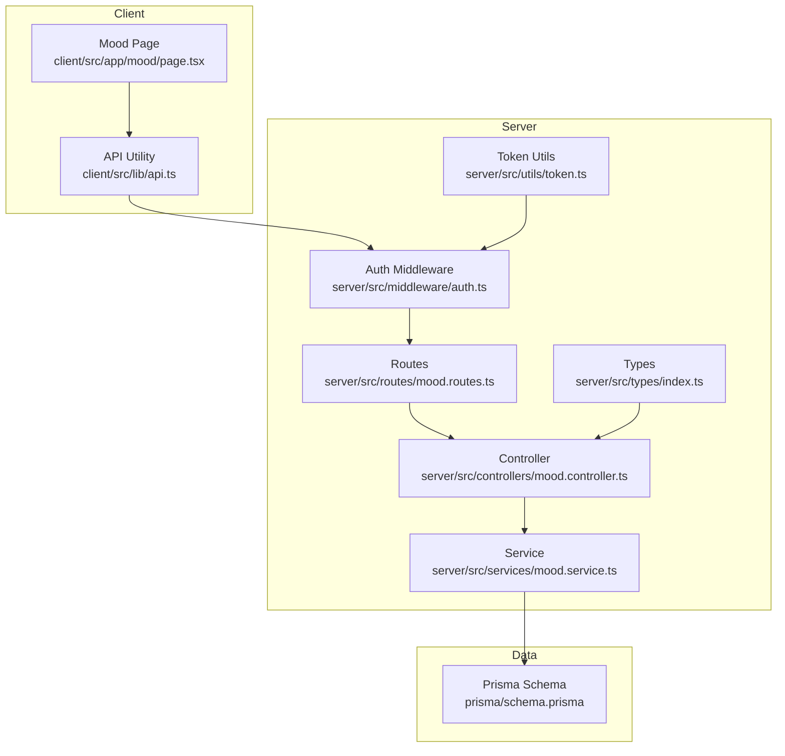
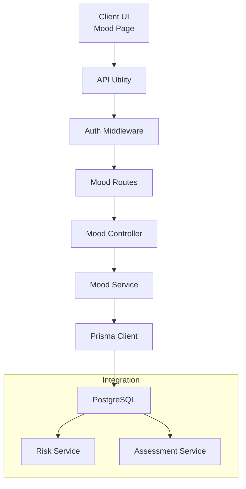
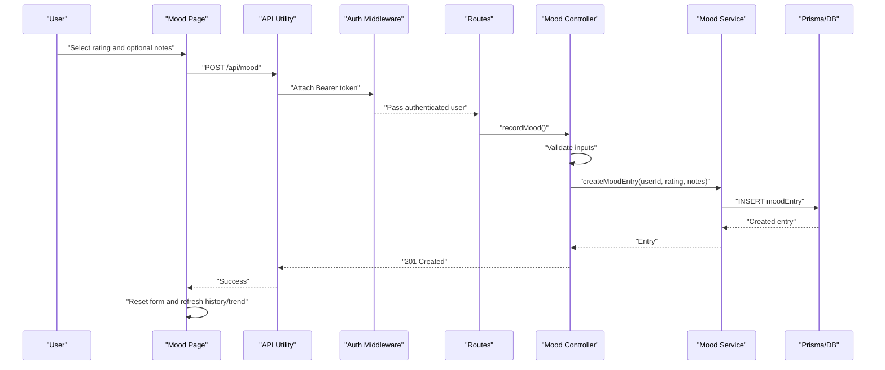
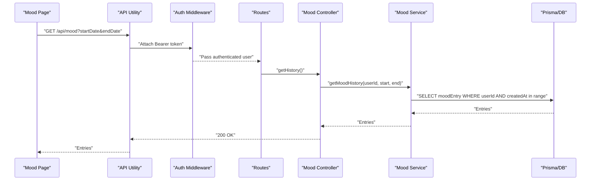
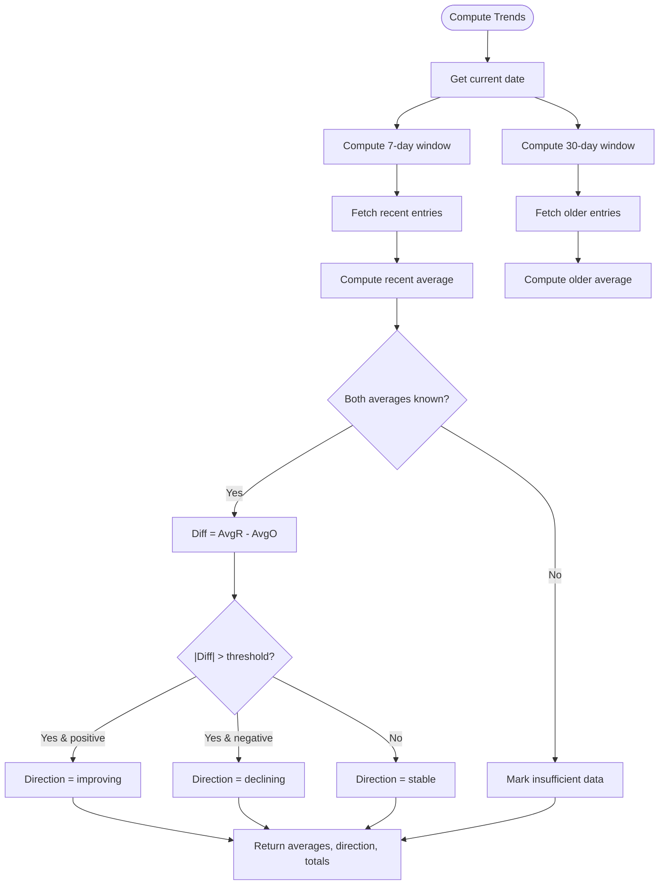
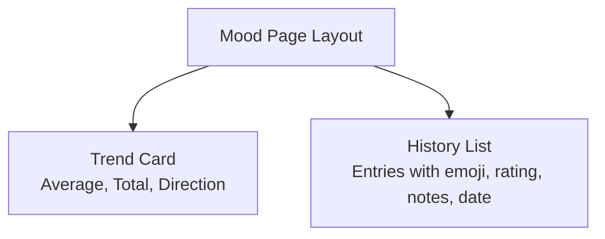
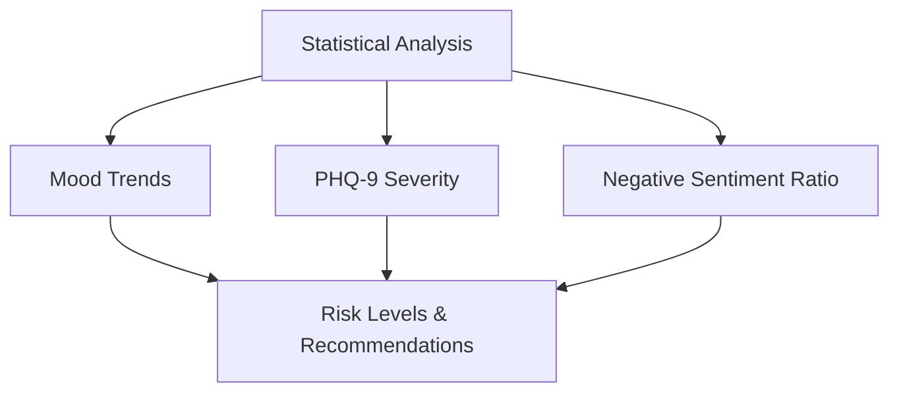
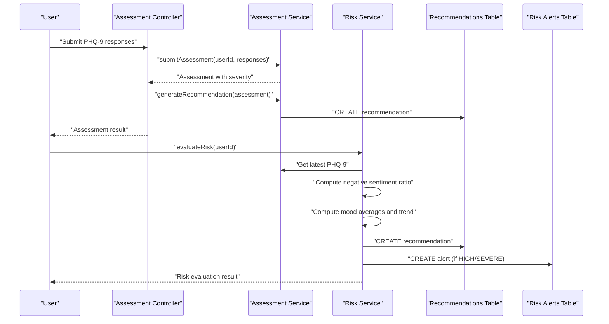
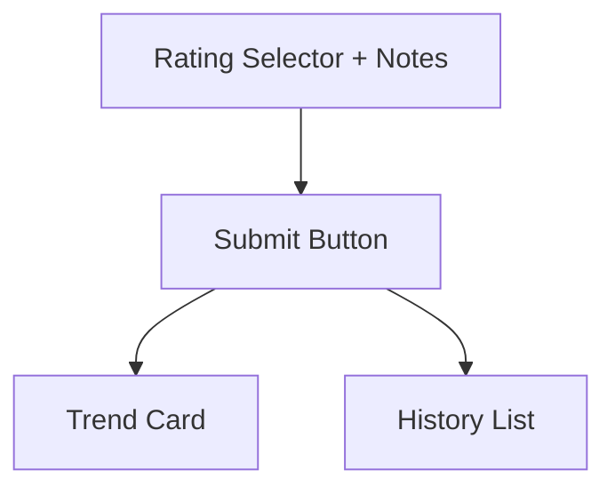
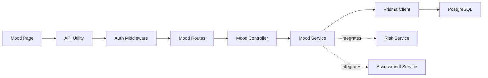

# Mood Tracking System

<cite>
**Referenced Files in This Document**
- [client/src/app/mood/page.tsx](file://client/src/app/mood/page.tsx)
- [client/src/lib/api.ts](file://client/src/lib/api.ts)
- [server/src/controllers/mood.controller.ts](file://server/src/controllers/mood.controller.ts)
- [server/src/services/mood.service.ts](file://server/src/services/mood.service.ts)
- [server/src/routes/mood.routes.ts](file://server/src/routes/mood.routes.ts)
- [server/src/middleware/auth.ts](file://server/src/middleware/auth.ts)
- [server/src/types/index.ts](file://server/src/types/index.ts)
- [server/src/utils/token.ts](file://server/src/utils/token.ts)
- [prisma/schema.prisma](file://prisma/schema.prisma)
- [server/src/services/risk.service.ts](file://server/src/services/risk.service.ts)
- [server/src/controllers/assessment.controller.ts](file://server/src/controllers/assessment.controller.ts)
- [server/src/services/assessment.service.ts](file://server/src/services/assessment.service.ts)
- [server/src/controllers/risk.controller.ts](file://server/src/controllers/risk.controller.ts)
- [server/src/services/dashboard.service.ts](file://server/src/services/dashboard.service.ts)
- [README.md](file://README.md)
</cite>

## Table of Contents
1. [Introduction](#introduction)
2. [Project Structure](#project-structure)
3. [Core Components](#core-components)
4. [Architecture Overview](#architecture-overview)
5. [Detailed Component Analysis](#detailed-component-analysis)
6. [Dependency Analysis](#dependency-analysis)
7. [Performance Considerations](#performance-considerations)
8. [Troubleshooting Guide](#troubleshooting-guide)
9. [Conclusion](#conclusion)
10. [Appendices](#appendices)

## Introduction
This document provides comprehensive documentation for the mood tracking system within BuddyAI, focusing on daily emotional monitoring and trend analysis. It explains how users log mood entries, how optional notes are captured, and how temporal data is recorded. It documents the trend analysis algorithms used to identify mood patterns, seasonal variations, and improvement indicators. It covers historical data management, visualization capabilities, and statistical analysis features. It also describes the integration with assessment results and the recommendation system for comprehensive mental health monitoring. The user interface for mood logging, trend visualization, and historical review is outlined, along with practical examples of workflows, trend interpretation, and correlation analysis with other health metrics. Privacy controls, data retention considerations, and integration with clinical decision support systems are addressed.

## Project Structure
The mood tracking system spans the frontend (Next.js/React) and backend (Node.js/Express) layers, integrated with a PostgreSQL database via Prisma ORM. The frontend provides a responsive UI for mood logging, trend display, and history review. The backend exposes REST endpoints for creating mood entries, retrieving history, and computing trends. Authentication middleware secures endpoints, and the database schema defines the MoodEntry entity and relationships.

**Diagram sources**
- [client/src/app/mood/page.tsx:1-245](file://client/src/app/mood/page.tsx#L1-L245)
- [client/src/lib/api.ts:1-36](file://client/src/lib/api.ts#L1-L36)
- [server/src/middleware/auth.ts:1-39](file://server/src/middleware/auth.ts#L1-L39)
- [server/src/routes/mood.routes.ts:1-12](file://server/src/routes/mood.routes.ts#L1-L12)
- [server/src/controllers/mood.controller.ts:1-67](file://server/src/controllers/mood.controller.ts#L1-L67)
- [server/src/services/mood.service.ts:1-58](file://server/src/services/mood.service.ts#L1-L58)
- [server/src/types/index.ts:1-12](file://server/src/types/index.ts#L1-L12)
- [server/src/utils/token.ts:1-17](file://server/src/utils/token.ts#L1-L17)
- [prisma/schema.prisma:86-95](file://prisma/schema.prisma#L86-L95)

**Section sources**
- [README.md:125-210](file://README.md#L125-L210)
- [client/src/app/mood/page.tsx:1-245](file://client/src/app/mood/page.tsx#L1-L245)
- [server/src/routes/mood.routes.ts:1-12](file://server/src/routes/mood.routes.ts#L1-L12)
- [prisma/schema.prisma:86-95](file://prisma/schema.prisma#L86-L95)

## Core Components
- Mood Logging UI: Allows users to select a mood rating from a 1–5 scale with emoji labels, optionally add notes, and submit entries. It fetches current history and trend data on load.
- Backend API:
  - POST /api/mood: Creates a new mood entry after validating rating and optional notes.
  - GET /api/mood: Retrieves mood history with optional date-range filters.
  - GET /api/mood/trends: Computes recent and older averages and trend direction.
- Data Storage: Prisma-backed MoodEntry model storing user association, rating, optional notes, and timestamps.
- Authentication: JWT-based bearer tokens verified by middleware; protected endpoints ensure only authenticated users can access mood data.
- Risk and Recommendation Integration: Risk service correlates mood trends with PHQ-9 assessments and message sentiment to compute risk levels and generate recommendations.

**Section sources**
- [client/src/app/mood/page.tsx:29-91](file://client/src/app/mood/page.tsx#L29-L91)
- [server/src/controllers/mood.controller.ts:5-66](file://server/src/controllers/mood.controller.ts#L5-L66)
- [server/src/services/mood.service.ts:3-57](file://server/src/services/mood.service.ts#L3-L57)
- [prisma/schema.prisma:86-95](file://prisma/schema.prisma#L86-L95)
- [server/src/middleware/auth.ts:5-22](file://server/src/middleware/auth.ts#L5-L22)
- [server/src/services/risk.service.ts:11-107](file://server/src/services/risk.service.ts#L11-L107)

## Architecture Overview
The mood tracking architecture follows a layered design:
- Presentation Layer: Next.js frontend renders the mood UI and handles user interactions.
- Application Layer: Express routes delegate to controllers that enforce authentication and validate inputs.
- Domain Services: Business logic computes trends and persists data via Prisma.
- Data Layer: PostgreSQL stores mood entries and integrates with risk and assessment workflows.

**Diagram sources**
- [client/src/app/mood/page.tsx:1-245](file://client/src/app/mood/page.tsx#L1-L245)
- [client/src/lib/api.ts:1-36](file://client/src/lib/api.ts#L1-L36)
- [server/src/middleware/auth.ts:1-39](file://server/src/middleware/auth.ts#L1-L39)
- [server/src/routes/mood.routes.ts:1-12](file://server/src/routes/mood.routes.ts#L1-L12)
- [server/src/controllers/mood.controller.ts:1-67](file://server/src/controllers/mood.controller.ts#L1-L67)
- [server/src/services/mood.service.ts:1-58](file://server/src/services/mood.service.ts#L1-L58)
- [prisma/schema.prisma:1-134](file://prisma/schema.prisma#L1-L134)
- [server/src/services/risk.service.ts:1-138](file://server/src/services/risk.service.ts#L1-L138)
- [server/src/services/assessment.service.ts:1-89](file://server/src/services/assessment.service.ts#L1-L89)

## Detailed Component Analysis

### Mood Entry Management
- Rating Scale: A 1–5 scale with emoji labels and descriptive text. The UI enforces selection before submission.
- Optional Notes: Free-text field for contextual notes; submitted as nullable.
- Temporal Recording: Timestamps are stored server-side; UI displays localized dates.
- Validation and Submission:
  - Frontend: Prevents submission without a valid rating; disables button until selection is made.
  - Backend: Ensures moodRating is an integer within 1–5; notes must be a string if present.
- Persistence: Uses Prisma to create a new MoodEntry linked to the authenticated user.

**Diagram sources**
- [client/src/app/mood/page.tsx:63-91](file://client/src/app/mood/page.tsx#L63-L91)
- [client/src/lib/api.ts:3-35](file://client/src/lib/api.ts#L3-L35)
- [server/src/middleware/auth.ts:5-22](file://server/src/middleware/auth.ts#L5-L22)
- [server/src/routes/mood.routes.ts:7](file://server/src/routes/mood.routes.ts#L7)
- [server/src/controllers/mood.controller.ts:5-34](file://server/src/controllers/mood.controller.ts#L5-L34)
- [server/src/services/mood.service.ts:3-7](file://server/src/services/mood.service.ts#L3-L7)
- [prisma/schema.prisma:86-95](file://prisma/schema.prisma#L86-L95)

**Section sources**
- [client/src/app/mood/page.tsx:21-27](file://client/src/app/mood/page.tsx#L21-L27)
- [client/src/app/mood/page.tsx:63-91](file://client/src/app/mood/page.tsx#L63-L91)
- [server/src/controllers/mood.controller.ts:12-30](file://server/src/controllers/mood.controller.ts#L12-L30)
- [server/src/services/mood.service.ts:3-7](file://server/src/services/mood.service.ts#L3-L7)
- [prisma/schema.prisma:86-95](file://prisma/schema.prisma#L86-L95)

### Historical Data Management
- Retrieval: Fetches entries for the authenticated user, optionally filtered by start and end dates.
- Sorting: Returns entries ordered by creation time descending for chronological review.
- UI Display: Renders a scrollable list with emoji, rating, optional notes, and localized date.

**Diagram sources**
- [client/src/app/mood/page.tsx:48-61](file://client/src/app/mood/page.tsx#L48-L61)
- [server/src/controllers/mood.controller.ts:36-52](file://server/src/controllers/mood.controller.ts#L36-L52)
- [server/src/services/mood.service.ts:9-20](file://server/src/services/mood.service.ts#L9-L20)
- [prisma/schema.prisma:86-95](file://prisma/schema.prisma#L86-L95)

**Section sources**
- [client/src/app/mood/page.tsx:210-240](file://client/src/app/mood/page.tsx#L210-L240)
- [server/src/controllers/mood.controller.ts:43-48](file://server/src/controllers/mood.controller.ts#L43-L48)
- [server/src/services/mood.service.ts:9-20](file://server/src/services/mood.service.ts#L9-L20)

### Trend Analysis Algorithms
- Time Windows:
  - Recent period: Last 7 days.
  - Older period: Between 30 and 7 days ago.
- Averages: Computes average mood ratings per window; null if no entries.
- Direction:
  - If both averages are available, compares difference:
    - Positive difference greater than threshold → improving.
    - Negative difference below threshold → declining.
    - Otherwise → stable.
  - If insufficient data → marked accordingly.
- Output: Includes recent average, older average, direction, and total entries.

**Diagram sources**
- [server/src/services/mood.service.ts:22-57](file://server/src/services/mood.service.ts#L22-L57)

**Section sources**
- [server/src/services/mood.service.ts:22-57](file://server/src/services/mood.service.ts#L22-L57)
- [client/src/app/mood/page.tsx:182-207](file://client/src/app/mood/page.tsx#L182-L207)

### Visualization Capabilities
- Trend Card: Displays average mood, total entries, and trend indicator with emoji and color-coded label.
- History List: Shows recent entries with emoji, rating, optional notes, and localized date.
- Responsive Layout: Two-column layout on large screens, stacking on smaller screens.

**Diagram sources**
- [client/src/app/mood/page.tsx:182-207](file://client/src/app/mood/page.tsx#L182-L207)
- [client/src/app/mood/page.tsx:210-240](file://client/src/app/mood/page.tsx#L210-L240)

**Section sources**
- [client/src/app/mood/page.tsx:114-244](file://client/src/app/mood/page.tsx#L114-L244)

### Statistical Analysis Features
- Averages: Computed per time window for trend direction.
- Threshold-based Classification: Uses a fixed threshold to determine improvement vs. decline vs. stability.
- Combined Risk Signals: The risk service augments trend analysis with PHQ-9 severity and negative sentiment ratios to produce risk levels and recommendations.

**Diagram sources**
- [server/src/services/mood.service.ts:22-57](file://server/src/services/mood.service.ts#L22-L57)
- [server/src/services/risk.service.ts:11-107](file://server/src/services/risk.service.ts#L11-L107)

**Section sources**
- [server/src/services/mood.service.ts:22-57](file://server/src/services/mood.service.ts#L22-L57)
- [server/src/services/risk.service.ts:11-107](file://server/src/services/risk.service.ts#L11-L107)

### Integration with Assessment Results and Recommendation System
- Assessment Integration:
  - PHQ-9 scoring and severity classification are computed and stored.
  - When severity reaches moderate or higher, a recommendation is generated and persisted.
- Risk Evaluation:
  - Combines PHQ-9, recent mood trends, and negative sentiment ratios.
  - Generates a recommendation and may create a risk alert for HIGH or SEVERE levels.
- Cohesion with Mood Tracking:
  - Risk computation queries recent mood entries and older mood entries to detect trends.
  - This ensures mood history informs risk assessment and recommendations.

**Diagram sources**
- [server/src/controllers/assessment.controller.ts:5-34](file://server/src/controllers/assessment.controller.ts#L5-L34)
- [server/src/services/assessment.service.ts:20-33](file://server/src/services/assessment.service.ts#L20-L33)
- [server/src/services/assessment.service.ts:76-88](file://server/src/services/assessment.service.ts#L76-L88)
- [server/src/services/risk.service.ts:11-107](file://server/src/services/risk.service.ts#L11-L107)

**Section sources**
- [server/src/controllers/assessment.controller.ts:25-28](file://server/src/controllers/assessment.controller.ts#L25-L28)
- [server/src/services/assessment.service.ts:76-88](file://server/src/services/assessment.service.ts#L76-L88)
- [server/src/services/risk.service.ts:11-107](file://server/src/services/risk.service.ts#L11-L107)

### User Interface for Mood Logging, Trend Visualization, and Historical Review
- Mood Logging:
  - Emoji-based rating selector with validation.
  - Optional notes textarea.
  - Submit button with loading state and success/error messaging.
- Trend Visualization:
  - Average mood, total entries, and trend direction with color-coded indicator.
- Historical Review:
  - Scrollable list of past entries with date, rating, and notes.

**Diagram sources**
- [client/src/app/mood/page.tsx:118-207](file://client/src/app/mood/page.tsx#L118-L207)
- [client/src/app/mood/page.tsx:210-240](file://client/src/app/mood/page.tsx#L210-L240)

**Section sources**
- [client/src/app/mood/page.tsx:118-244](file://client/src/app/mood/page.tsx#L118-L244)

### Practical Examples of Mood Tracking Workflows, Trend Interpretation, and Correlation Analysis
- Daily Logging Workflow:
  - User selects a mood rating and adds optional notes.
  - Submission triggers persistence and UI refresh.
- Trend Interpretation:
  - If recent average exceeds older average by a defined threshold → improving.
  - If recent average is lower than older average by a defined threshold → declining.
  - Otherwise → stable.
- Correlation Analysis:
  - Combine PHQ-9 severity, negative sentiment ratio, and mood trend to compute risk level.
  - Use risk level to generate tailored recommendations and potentially escalate to alerts.

**Section sources**
- [client/src/app/mood/page.tsx:63-91](file://client/src/app/mood/page.tsx#L63-L91)
- [server/src/services/mood.service.ts:43-49](file://server/src/services/mood.service.ts#L43-L49)
- [server/src/services/risk.service.ts:56-73](file://server/src/services/risk.service.ts#L56-L73)

### Data Retention Policies and Privacy Controls
- Authentication and Authorization:
  - All endpoints are protected by JWT-based authentication middleware.
  - Access denied if no token or invalid/expired token.
- Data Scope:
  - Controllers and services operate on the authenticated user’s data only.
- Privacy:
  - Notes are stored as optional free text; ensure minimal sensitive data collection.
  - Token-based session management with short expiration.
- Data Lifecycle:
  - Mood entries persist indefinitely unless otherwise governed by institutional policy.

**Section sources**
- [server/src/middleware/auth.ts:5-22](file://server/src/middleware/auth.ts#L5-L22)
- [server/src/controllers/mood.controller.ts:7-10](file://server/src/controllers/mood.controller.ts#L7-L10)
- [server/src/controllers/mood.controller.ts:38-41](file://server/src/controllers/mood.controller.ts#L38-L41)
- [server/src/utils/token.ts:10-16](file://server/src/utils/token.ts#L10-L16)

### Integration with Clinical Decision Support Systems
- Risk Alerts:
  - Automatic creation of alerts for HIGH or SEVERE risk levels tied to assessments.
- Counsellor Dashboard:
  - Administrative service aggregates risk alert statistics for monitoring.
- Recommendation Engine:
  - Generates recommendations based on risk level derived from mood trends, sentiment, and assessment results.

**Section sources**
- [server/src/services/risk.service.ts:87-104](file://server/src/services/risk.service.ts#L87-L104)
- [server/src/services/dashboard.service.ts:3-18](file://server/src/services/dashboard.service.ts#L3-L18)

## Dependency Analysis
The mood tracking system exhibits clear layering and low coupling:
- UI depends on API utility and auth guard.
- Routes depend on controller and auth middleware.
- Controller depends on service and validates inputs.
- Service depends on Prisma client and database.
- Risk and assessment services integrate with mood data for holistic insights.

**Diagram sources**
- [client/src/app/mood/page.tsx:1-245](file://client/src/app/mood/page.tsx#L1-L245)
- [client/src/lib/api.ts:1-36](file://client/src/lib/api.ts#L1-L36)
- [server/src/middleware/auth.ts:1-39](file://server/src/middleware/auth.ts#L1-L39)
- [server/src/routes/mood.routes.ts:1-12](file://server/src/routes/mood.routes.ts#L1-L12)
- [server/src/controllers/mood.controller.ts:1-67](file://server/src/controllers/mood.controller.ts#L1-L67)
- [server/src/services/mood.service.ts:1-58](file://server/src/services/mood.service.ts#L1-L58)
- [server/src/services/risk.service.ts:1-138](file://server/src/services/risk.service.ts#L1-L138)
- [server/src/services/assessment.service.ts:1-89](file://server/src/services/assessment.service.ts#L1-L89)
- [prisma/schema.prisma:1-134](file://prisma/schema.prisma#L1-L134)

**Section sources**
- [server/src/controllers/mood.controller.ts:1-67](file://server/src/controllers/mood.controller.ts#L1-L67)
- [server/src/services/mood.service.ts:1-58](file://server/src/services/mood.service.ts#L1-L58)
- [server/src/services/risk.service.ts:1-138](file://server/src/services/risk.service.ts#L1-L138)
- [server/src/services/assessment.service.ts:1-89](file://server/src/services/assessment.service.ts#L1-L89)

## Performance Considerations
- Database Queries:
  - Trend computation uses bounded date windows; ensure indexes on user and creation-time fields.
- UI Responsiveness:
  - Batched data fetching for history and trends reduces redundant requests.
- Authentication Overhead:
  - Lightweight JWT verification; cache token verification results where feasible.
- Scalability:
  - Stateless controllers and services enable horizontal scaling.
- Monitoring:
  - Track endpoint latency and error rates for mood endpoints.

[No sources needed since this section provides general guidance]

## Troubleshooting Guide
- Authentication Failures:
  - Missing or invalid Bearer token leads to unauthorized responses and redirection to login.
- Input Validation Errors:
  - Invalid rating or notes type yields client-side and server-side validation errors.
- Network Issues:
  - API utility surfaces server errors and unauthorized conditions; handle gracefully in UI.
- Data Visibility:
  - Ensure date filters are correctly parsed; verify timezone handling for display.

**Section sources**
- [client/src/lib/api.ts:20-35](file://client/src/lib/api.ts#L20-L35)
- [server/src/controllers/mood.controller.ts:14-27](file://server/src/controllers/mood.controller.ts#L14-L27)
- [client/src/app/mood/page.tsx:68-71](file://client/src/app/mood/page.tsx#L68-L71)

## Conclusion
The mood tracking system provides a robust foundation for daily emotional monitoring, trend analysis, and integration with broader mental health workflows. Its clean separation of concerns, strong authentication, and pragmatic trend algorithms enable reliable historical tracking and informed risk assessment. The UI is intuitive for daily logging and trend review, while backend services support scalable persistence and clinical integration.

[No sources needed since this section summarizes without analyzing specific files]

## Appendices

### API Definitions
- POST /api/mood
  - Authenticated user required.
  - Body: { moodRating: number, notes?: string }.
  - Validation: moodRating integer 1–5; notes string if provided.
  - Response: 201 Created with created entry; 400/401/500 on error.
- GET /api/mood
  - Authenticated user required.
  - Query: startDate?, endDate?.
  - Response: 200 OK with array of entries ordered by createdAt desc; 401/500 on error.
- GET /api/mood/trends
  - Authenticated user required.
  - Response: 200 OK with { recentAverage, thirtyDayAverage, direction, totalEntries }; 401/500 on error.

**Section sources**
- [server/src/routes/mood.routes.ts:7-9](file://server/src/routes/mood.routes.ts#L7-L9)
- [server/src/controllers/mood.controller.ts:12-30](file://server/src/controllers/mood.controller.ts#L12-L30)
- [server/src/controllers/mood.controller.ts:43-52](file://server/src/controllers/mood.controller.ts#L43-L52)
- [server/src/controllers/mood.controller.ts:61](file://server/src/controllers/mood.controller.ts#L61)

### Data Model: MoodEntry
- Fields: id, userId (foreign key), moodRating (integer), notes (nullable), createdAt (timestamp).
- Indexes: userId for fast lookups.

**Section sources**
- [prisma/schema.prisma:86-95](file://prisma/schema.prisma#L86-L95)