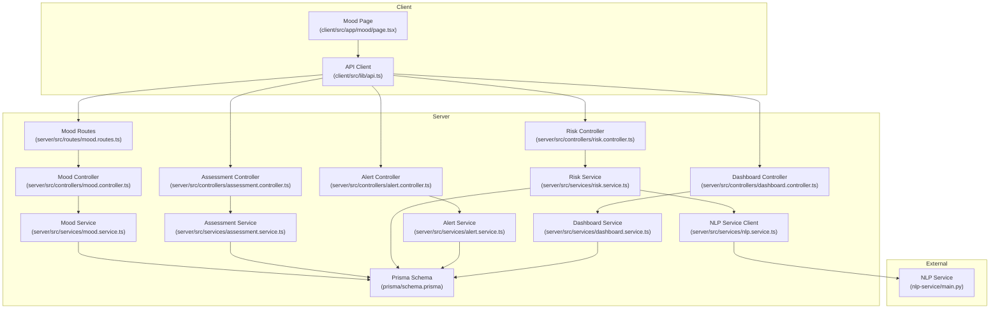
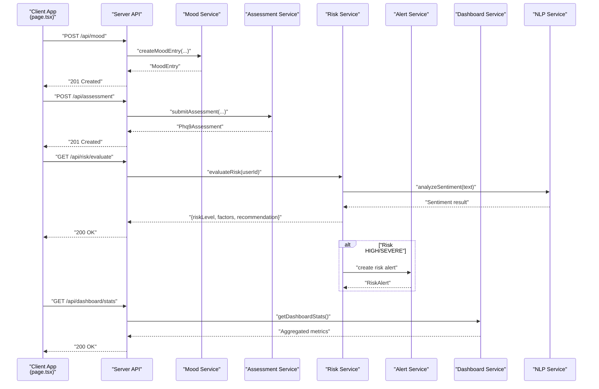
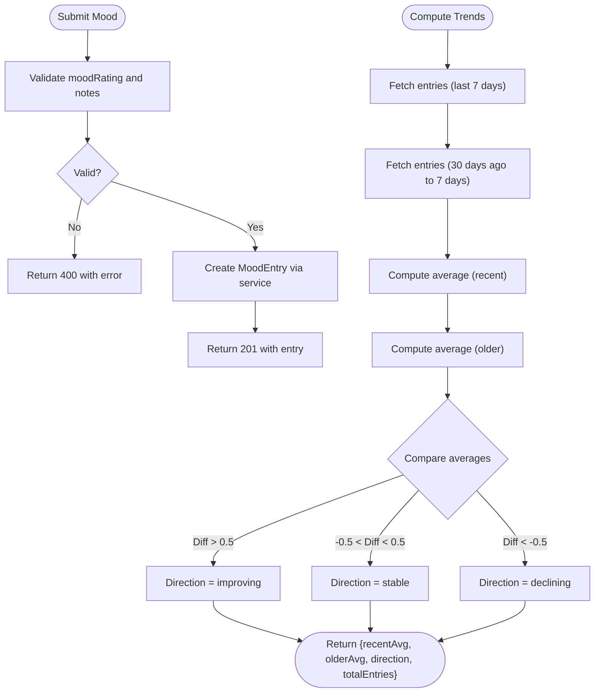
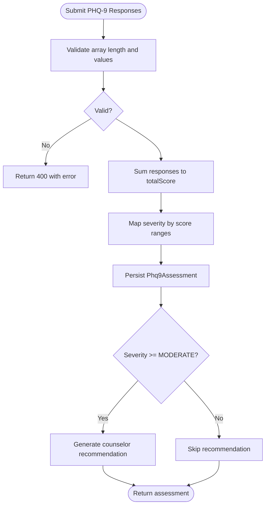
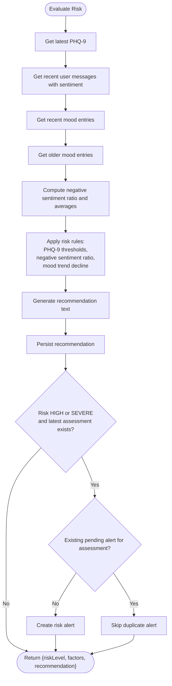
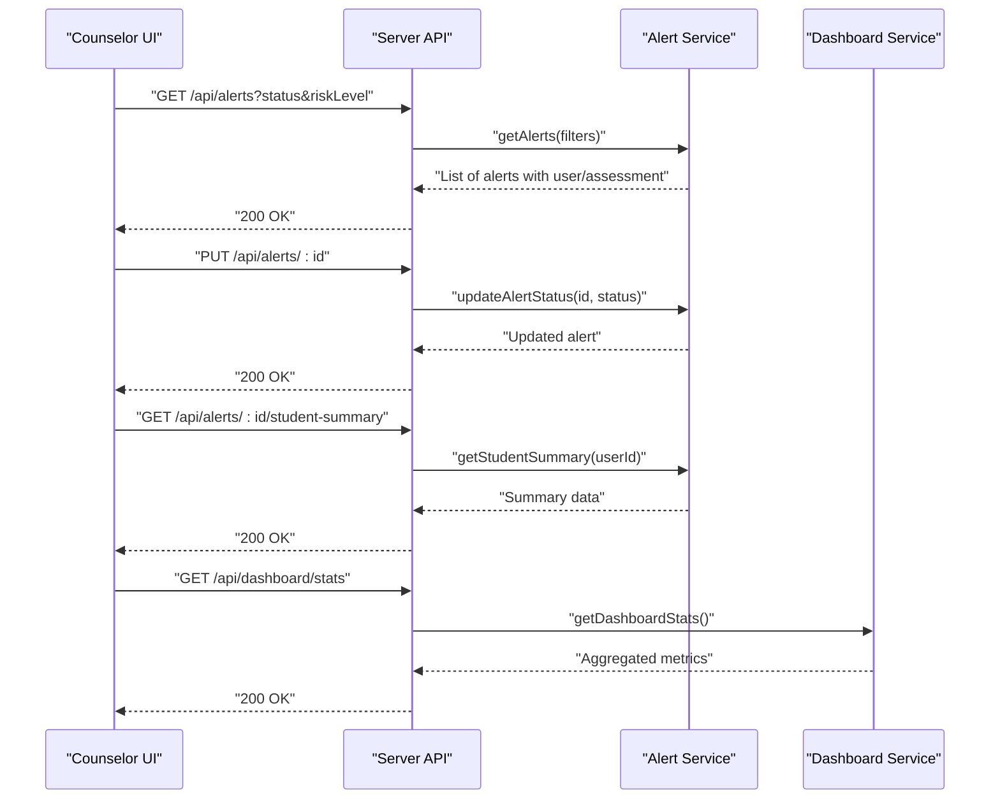
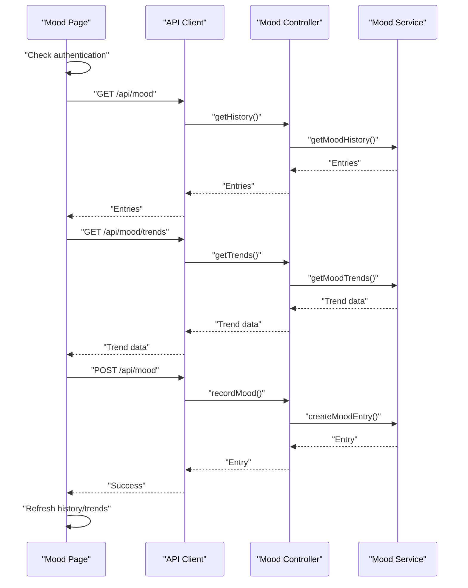
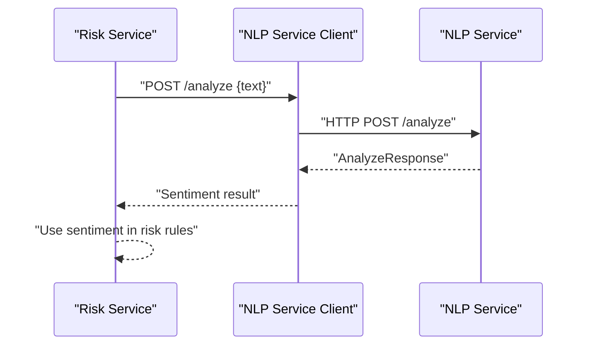
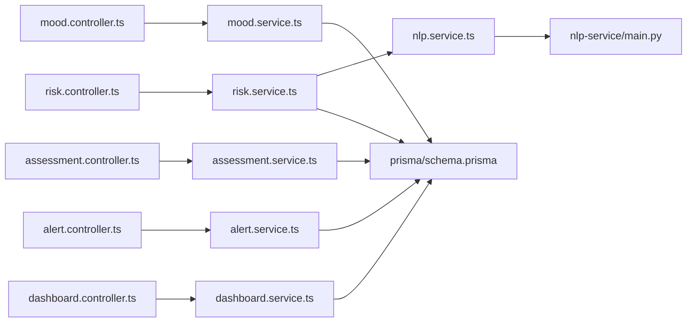
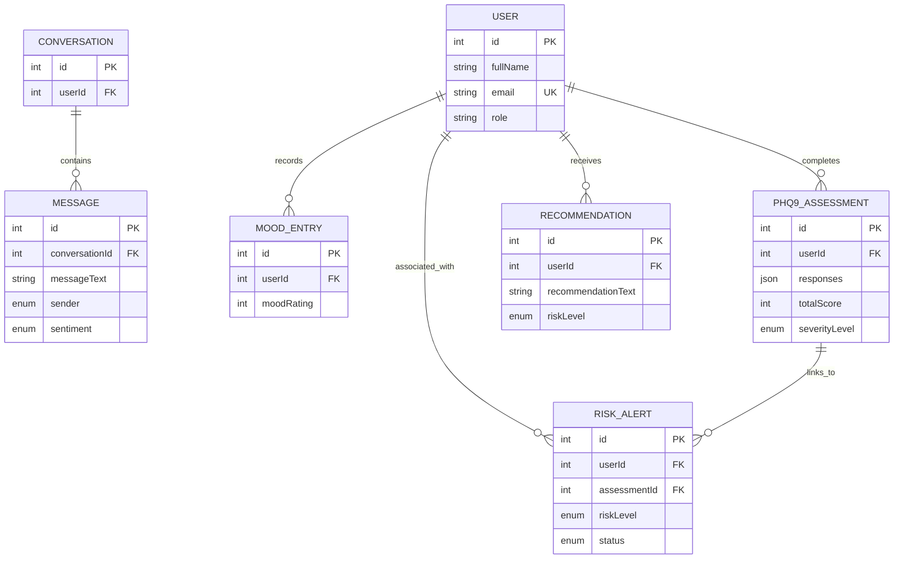

# System Integration

<cite>
**Referenced Files in This Document**
- [mood.controller.ts](file://server/src/controllers/mood.controller.ts)
- [mood.service.ts](file://server/src/services/mood.service.ts)
- [assessment.controller.ts](file://server/src/controllers/assessment.controller.ts)
- [assessment.service.ts](file://server/src/services/assessment.service.ts)
- [risk.controller.ts](file://server/src/controllers/risk.controller.ts)
- [risk.service.ts](file://server/src/services/risk.service.ts)
- [alert.controller.ts](file://server/src/controllers/alert.controller.ts)
- [alert.service.ts](file://server/src/services/alert.service.ts)
- [dashboard.controller.ts](file://server/src/controllers/dashboard.controller.ts)
- [dashboard.service.ts](file://server/src/services/dashboard.service.ts)
- [mood.routes.ts](file://server/src/routes/mood.routes.ts)
- [schema.prisma](file://prisma/schema.prisma)
- [page.tsx](file://client/src/app/mood/page.tsx)
- [api.ts](file://client/src/lib/api.ts)
- [main.py](file://nlp-service/main.py)
- [nlp.service.ts](file://server/src/services/nlp.service.ts)
</cite>

## Table of Contents
1. [Introduction](#introduction)
2. [Project Structure](#project-structure)
3. [Core Components](#core-components)
4. [Architecture Overview](#architecture-overview)
5. [Detailed Component Analysis](#detailed-component-analysis)
6. [Dependency Analysis](#dependency-analysis)
7. [Performance Considerations](#performance-considerations)
8. [Troubleshooting Guide](#troubleshooting-guide)
9. [Conclusion](#conclusion)
10. [Appendices](#appendices)

## Introduction
This document describes the integration of the mood tracking system with PHQ-9 assessments, risk assessment, recommendation generation, alerts, and the counselor dashboard. It explains how mood data correlates with PHQ-9 scores to produce automated risk insights and recommendations, how cross-system alerts are triggered, and how the client integrates with backend APIs and the NLP service for sentiment analysis. It also documents data flows, real-time updates, and operational concerns such as data consistency, conflict resolution, and audit trails.

## Project Structure
The integration spans three layers:
- Client (Next.js): Mood UI, API client, and user interactions
- Server (Express): Controllers, services, routes, and Prisma ORM
- NLP Service (FastAPI): Sentiment analysis for conversational text

**Diagram sources**
- [mood.routes.ts:1-12](file://server/src/routes/mood.routes.ts#L1-L12)
- [mood.controller.ts:1-67](file://server/src/controllers/mood.controller.ts#L1-L67)
- [mood.service.ts:1-58](file://server/src/services/mood.service.ts#L1-L58)
- [assessment.controller.ts:1-74](file://server/src/controllers/assessment.controller.ts#L1-L74)
- [assessment.service.ts:1-89](file://server/src/services/assessment.service.ts#L1-L89)
- [risk.controller.ts:1-32](file://server/src/controllers/risk.controller.ts#L1-L32)
- [risk.service.ts:1-138](file://server/src/services/risk.service.ts#L1-L138)
- [alert.controller.ts:1-70](file://server/src/controllers/alert.controller.ts#L1-L70)
- [alert.service.ts:1-62](file://server/src/services/alert.service.ts#L1-L62)
- [dashboard.controller.ts:1-13](file://server/src/controllers/dashboard.controller.ts#L1-L13)
- [dashboard.service.ts:1-19](file://server/src/services/dashboard.service.ts#L1-L19)
- [nlp.service.ts:1-24](file://server/src/services/nlp.service.ts#L1-L24)
- [schema.prisma:1-134](file://prisma/schema.prisma#L1-L134)
- [main.py:1-71](file://nlp-service/main.py#L1-L71)
- [page.tsx:1-245](file://client/src/app/mood/page.tsx#L1-L245)
- [api.ts:1-36](file://client/src/lib/api.ts#L1-L36)

**Section sources**
- [mood.routes.ts:1-12](file://server/src/routes/mood.routes.ts#L1-L12)
- [schema.prisma:1-134](file://prisma/schema.prisma#L1-L134)

## Core Components
- Mood Tracking
  - Records daily mood ratings and optional notes
  - Provides history and 7-day vs 30-day trend analysis
- PHQ-9 Assessment
  - Submits 9-item responses, computes total score and severity level
  - Generates counselor recommendations for moderate/severe cases
- Risk Assessment
  - Correlates PHQ-9, recent mood trends, and conversational sentiment
  - Produces risk level, factors, and recommendation text
  - Creates cross-system alerts for HIGH/SEVERE cases linked to the latest assessment
- Alerts and Dashboard
  - Lists, updates, and resolves risk alerts
  - Summarizes student profiles for counselors
  - Aggregates system-wide dashboard metrics
- NLP Integration
  - Analyzes user chat messages for sentiment
  - Supplies sentiment labels used in risk scoring

**Section sources**
- [mood.controller.ts:1-67](file://server/src/controllers/mood.controller.ts#L1-L67)
- [mood.service.ts:1-58](file://server/src/services/mood.service.ts#L1-L58)
- [assessment.controller.ts:1-74](file://server/src/controllers/assessment.controller.ts#L1-L74)
- [assessment.service.ts:1-89](file://server/src/services/assessment.service.ts#L1-L89)
- [risk.controller.ts:1-32](file://server/src/controllers/risk.controller.ts#L1-L32)
- [risk.service.ts:1-138](file://server/src/services/risk.service.ts#L1-L138)
- [alert.controller.ts:1-70](file://server/src/controllers/alert.controller.ts#L1-L70)
- [alert.service.ts:1-62](file://server/src/services/alert.service.ts#L1-L62)
- [dashboard.controller.ts:1-13](file://server/src/controllers/dashboard.controller.ts#L1-L13)
- [dashboard.service.ts:1-19](file://server/src/services/dashboard.service.ts#L1-L19)
- [nlp.service.ts:1-24](file://server/src/services/nlp.service.ts#L1-L24)
- [main.py:1-71](file://nlp-service/main.py#L1-L71)

## Architecture Overview
The system orchestrates mood data, PHQ-9 assessments, and NLP-derived sentiment to compute risk and recommendations. Alerts are created when risk exceeds thresholds and are visible to counselors via the dashboard.

**Diagram sources**
- [page.tsx:48-91](file://client/src/app/mood/page.tsx#L48-L91)
- [mood.controller.ts:5-34](file://server/src/controllers/mood.controller.ts#L5-L34)
- [assessment.controller.ts:5-34](file://server/src/controllers/assessment.controller.ts#L5-L34)
- [risk.controller.ts:5-17](file://server/src/controllers/risk.controller.ts#L5-L17)
- [risk.service.ts:11-107](file://server/src/services/risk.service.ts#L11-L107)
- [alert.service.ts:28-33](file://server/src/services/alert.service.ts#L28-L33)
- [dashboard.service.ts:3-18](file://server/src/services/dashboard.service.ts#L3-L18)
- [nlp.service.ts:11-23](file://server/src/services/nlp.service.ts#L11-L23)
- [main.py:43-58](file://nlp-service/main.py#L43-L58)

## Detailed Component Analysis

### Mood Tracking Integration
- Endpoint exposure: POST /api/mood, GET /api/mood, GET /api/mood/trends
- Validation ensures moodRating is an integer in [1,5], optional notes are strings
- Trends compare recent 7-day average to 30-day average to infer direction

**Diagram sources**
- [mood.controller.ts:14-30](file://server/src/controllers/mood.controller.ts#L14-L30)
- [mood.service.ts:22-57](file://server/src/services/mood.service.ts#L22-L57)

**Section sources**
- [mood.routes.ts:7-11](file://server/src/routes/mood.routes.ts#L7-L11)
- [mood.controller.ts:5-66](file://server/src/controllers/mood.controller.ts#L5-L66)
- [mood.service.ts:3-57](file://server/src/services/mood.service.ts#L3-L57)

### PHQ-9 Assessment and Severity Mapping
- Accepts exactly nine integer responses in [0,3], computes total score and severity
- Severity-to-risk mapping drives recommendation generation for counselors
- Assessment records include timestamps and severity level for downstream risk evaluation

**Diagram sources**
- [assessment.controller.ts:14-33](file://server/src/controllers/assessment.controller.ts#L14-L33)
- [assessment.service.ts:20-33](file://server/src/services/assessment.service.ts#L20-L33)
- [assessment.service.ts:48-61](file://server/src/services/assessment.service.ts#L48-L61)
- [assessment.service.ts:76-88](file://server/src/services/assessment.service.ts#L76-L88)

**Section sources**
- [assessment.controller.ts:5-34](file://server/src/controllers/assessment.controller.ts#L5-L34)
- [assessment.service.ts:12-18](file://server/src/services/assessment.service.ts#L12-L18)
- [assessment.service.ts:48-61](file://server/src/services/assessment.service.ts#L48-L61)
- [assessment.service.ts:76-88](file://server/src/services/assessment.service.ts#L76-L88)

### Risk Assessment Correlation Engine
- Gathers latest PHQ-9, recent messages with sentiment, and mood trends
- Applies rules to derive risk level and factor list
- Stores recommendation and creates risk alert for HIGH/SEVERE when appropriate

**Diagram sources**
- [risk.service.ts:11-107](file://server/src/services/risk.service.ts#L11-L107)
- [risk.service.ts:109-120](file://server/src/services/risk.service.ts#L109-L120)
- [risk.service.ts:122-137](file://server/src/services/risk.service.ts#L122-L137)

**Section sources**
- [risk.controller.ts:5-31](file://server/src/controllers/risk.controller.ts#L5-L31)
- [risk.service.ts:11-107](file://server/src/services/risk.service.ts#L11-L107)
- [risk.service.ts:109-137](file://server/src/services/risk.service.ts#L109-L137)

### Alerts and Counselor Dashboard
- Alerts are queryable by status and risk level, with inclusion of user and assessment details
- Alert status transitions supported: PENDING → REVIEWED → RESOLVED
- Student summary aggregates user profile, latest assessment, recent moods, sentiment breakdown, and recent recommendations
- Dashboard statistics include counts per status and risk distribution

**Diagram sources**
- [alert.controller.ts:7-53](file://server/src/controllers/alert.controller.ts#L7-L53)
- [alert.service.ts:3-33](file://server/src/services/alert.service.ts#L3-L33)
- [alert.service.ts:35-61](file://server/src/services/alert.service.ts#L35-L61)
- [dashboard.controller.ts:5-12](file://server/src/controllers/dashboard.controller.ts#L5-L12)
- [dashboard.service.ts:3-18](file://server/src/services/dashboard.service.ts#L3-L18)

**Section sources**
- [alert.controller.ts:5-69](file://server/src/controllers/alert.controller.ts#L5-L69)
- [alert.service.ts:3-61](file://server/src/services/alert.service.ts#L3-L61)
- [dashboard.controller.ts:5-12](file://server/src/controllers/dashboard.controller.ts#L5-L12)
- [dashboard.service.ts:3-18](file://server/src/services/dashboard.service.ts#L3-L18)

### Client Integration and Real-Time Updates
- The mood page authenticates, loads history and trends concurrently, and submits new entries
- The API client injects Authorization header and handles 401 redirects to login
- UI reacts to submission state and refreshes data after successful recording

**Diagram sources**
- [page.tsx:40-61](file://client/src/app/mood/page.tsx#L40-L61)
- [page.tsx:63-91](file://client/src/app/mood/page.tsx#L63-L91)
- [api.ts:3-35](file://client/src/lib/api.ts#L3-L35)
- [mood.controller.ts:36-66](file://server/src/controllers/mood.controller.ts#L36-L66)
- [mood.service.ts:9-20](file://server/src/services/mood.service.ts#L9-L20)
- [mood.service.ts:22-57](file://server/src/services/mood.service.ts#L22-L57)

**Section sources**
- [page.tsx:29-244](file://client/src/app/mood/page.tsx#L29-L244)
- [api.ts:3-35](file://client/src/lib/api.ts#L3-L35)

### NLP Sentiment Integration
- The server calls the NLP service to analyze text sentiment for conversational messages
- Results feed into risk scoring to detect elevated negative sentiment ratios

**Diagram sources**
- [risk.service.ts:18-27](file://server/src/services/risk.service.ts#L18-L27)
- [nlp.service.ts:11-23](file://server/src/services/nlp.service.ts#L11-L23)
- [main.py:43-58](file://nlp-service/main.py#L43-L58)

**Section sources**
- [nlp.service.ts:11-23](file://server/src/services/nlp.service.ts#L11-L23)
- [main.py:43-64](file://nlp-service/main.py#L43-L64)

## Dependency Analysis
The integration relies on shared domain models and enums defined in the Prisma schema. Controllers depend on services, services on Prisma, and risk service on the NLP client.

**Diagram sources**
- [mood.controller.ts:1-3](file://server/src/controllers/mood.controller.ts#L1-L3)
- [assessment.controller.ts:1-3](file://server/src/controllers/assessment.controller.ts#L1-L3)
- [risk.controller.ts:1-3](file://server/src/controllers/risk.controller.ts#L1-L3)
- [alert.controller.ts:1-3](file://server/src/controllers/alert.controller.ts#L1-L3)
- [dashboard.controller.ts:1-3](file://server/src/controllers/dashboard.controller.ts#L1-L3)
- [mood.service.ts](file://server/src/services/mood.service.ts#L1)
- [assessment.service.ts](file://server/src/services/assessment.service.ts#L1)
- [risk.service.ts](file://server/src/services/risk.service.ts#L1)
- [alert.service.ts](file://server/src/services/alert.service.ts#L1)
- [dashboard.service.ts](file://server/src/services/dashboard.service.ts#L1)
- [nlp.service.ts](file://server/src/services/nlp.service.ts#L1)
- [main.py:1-71](file://nlp-service/main.py#L1-L71)
- [schema.prisma:1-134](file://prisma/schema.prisma#L1-L134)

**Section sources**
- [schema.prisma:47-133](file://prisma/schema.prisma#L47-L133)

## Performance Considerations
- Concurrent client requests for history and trends reduce perceived latency
- Trend computation uses bounded windows (7 and 30 days) to keep complexity O(n) per window
- Risk evaluation batches reads and uses simple aggregations; consider indexing on createdAt for large datasets
- NLP calls are synchronous; consider rate limiting and caching repeated texts

## Troubleshooting Guide
- Authentication failures: Client redirects to login on 401 from API client
- Validation errors: Controllers return 400 with descriptive messages for invalid inputs
- Risk evaluation errors: Service catches exceptions and surfaces them via controller
- Alert status transitions: Controller validates allowed statuses and returns 400 for invalid values

**Section sources**
- [api.ts:20-26](file://client/src/lib/api.ts#L20-L26)
- [mood.controller.ts:14-27](file://server/src/controllers/mood.controller.ts#L14-L27)
- [assessment.controller.ts:14-21](file://server/src/controllers/assessment.controller.ts#L14-L21)
- [risk.controller.ts:12-16](file://server/src/controllers/risk.controller.ts#L12-L16)
- [alert.controller.ts:37-40](file://server/src/controllers/alert.controller.ts#L37-L40)

## Conclusion
The integration harmonizes mood tracking, PHQ-9 assessments, and conversational sentiment to deliver automated risk insights, recommendations, and actionable alerts. The client provides responsive real-time updates, while the server encapsulates robust validation, correlation logic, and counselor-facing dashboards. The NLP service augments risk scoring with sentiment analytics. Together, these components form a cohesive clinical decision support pipeline.

## Appendices

### Data Models and Relationships

**Diagram sources**
- [schema.prisma:47-133](file://prisma/schema.prisma#L47-L133)

### API Endpoints Overview
- Mood
  - POST /api/mood: Record mood entry
  - GET /api/mood: Retrieve history
  - GET /api/mood/trends: Compute trends
- Assessment
  - POST /api/assessment: Submit PHQ-9 responses
  - GET /api/assessment/history: Retrieve history
  - GET /api/assessment/:id: Retrieve by ID
- Risk
  - POST /api/risk/evaluate: Evaluate risk and generate recommendation/alerts
  - GET /api/risk/latest: Retrieve latest recommendation/alert
- Alerts
  - GET /api/alerts: List alerts with filters
  - GET /api/alerts/:id: Retrieve alert
  - PUT /api/alerts/:id: Update alert status
  - GET /api/alerts/:id/student-summary: Counselor summary
- Dashboard
  - GET /api/dashboard/stats: System metrics

**Section sources**
- [mood.routes.ts:7-11](file://server/src/routes/mood.routes.ts#L7-L11)
- [assessment.controller.ts:5-73](file://server/src/controllers/assessment.controller.ts#L5-L73)
- [risk.controller.ts:5-31](file://server/src/controllers/risk.controller.ts#L5-L31)
- [alert.controller.ts:5-69](file://server/src/controllers/alert.controller.ts#L5-L69)
- [dashboard.controller.ts:5-12](file://server/src/controllers/dashboard.controller.ts#L5-L12)