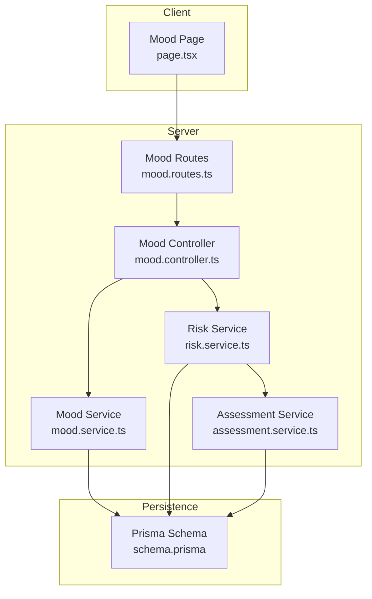
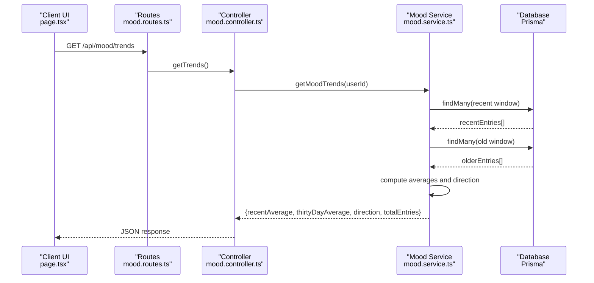
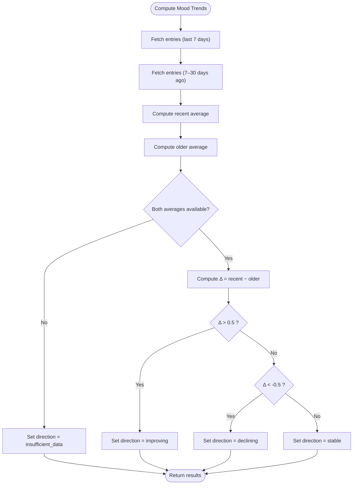
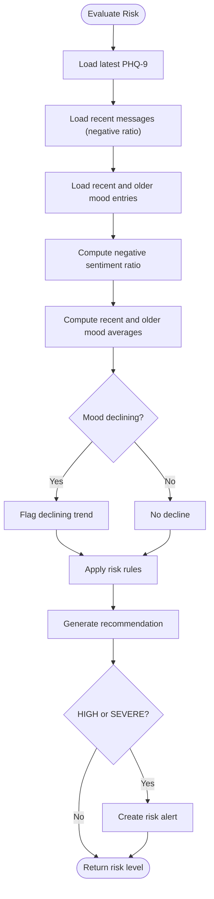
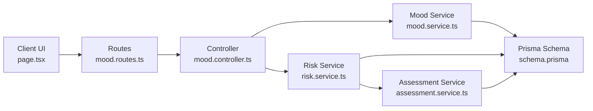

# Trend Analysis Algorithms

<cite>
**Referenced Files in This Document**
- [mood.service.ts](file://server/src/services/mood.service.ts)
- [mood.controller.ts](file://server/src/controllers/mood.controller.ts)
- [mood.routes.ts](file://server/src/routes/mood.routes.ts)
- [mood.test.ts](file://server/src/__tests__/mood.test.ts)
- [risk.service.ts](file://server/src/services/risk.service.ts)
- [assessment.service.ts](file://server/src/services/assessment.service.ts)
- [schema.prisma](file://prisma/schema.prisma)
- [ModelReadMe.md](file://ModelReadMe.md)
- [requirements.md](file://requirements.md)
- [README.md](file://README.md)
- [page.tsx](file://client/src/app/mood/page.tsx)
</cite>

## Table of Contents
1. [Introduction](#introduction)
2. [Project Structure](#project-structure)
3. [Core Components](#core-components)
4. [Architecture Overview](#architecture-overview)
5. [Detailed Component Analysis](#detailed-component-analysis)
6. [Dependency Analysis](#dependency-analysis)
7. [Performance Considerations](#performance-considerations)
8. [Troubleshooting Guide](#troubleshooting-guide)
9. [Conclusion](#conclusion)
10. [Appendices](#appendices)

## Introduction
This document explains the mood trend analysis algorithms implemented in the system. It focuses on how recent versus older mood averages are computed, how directional trends are classified, and how these trends integrate with assessment results and sentiment signals to inform risk evaluation. The current implementation uses simple comparative averages with threshold-based classification. The document also outlines how to extend the system to incorporate advanced statistical methods such as moving averages, trend lines, seasonal decomposition, correlation analysis, and anomaly detection while preserving integration with external factors like assessment scores and conversational sentiment.

## Project Structure
The mood trend analysis spans backend services, controllers, routes, database modeling, tests, and the frontend UI. The following diagram maps the main components involved in trend computation and presentation.

**Diagram sources**
- [mood.routes.ts:1-12](file://server/src/routes/mood.routes.ts#L1-L12)
- [mood.controller.ts:1-67](file://server/src/controllers/mood.controller.ts#L1-L67)
- [mood.service.ts:1-58](file://server/src/services/mood.service.ts#L1-L58)
- [risk.service.ts:1-138](file://server/src/services/risk.service.ts#L1-L138)
- [assessment.service.ts:1-89](file://server/src/services/assessment.service.ts#L1-L89)
- [schema.prisma:86-95](file://prisma/schema.prisma#L86-L95)

**Section sources**
- [mood.routes.ts:1-12](file://server/src/routes/mood.routes.ts#L1-L12)
- [mood.controller.ts:1-67](file://server/src/controllers/mood.controller.ts#L1-L67)
- [mood.service.ts:1-58](file://server/src/services/mood.service.ts#L1-L58)
- [risk.service.ts:1-138](file://server/src/services/risk.service.ts#L1-L138)
- [assessment.service.ts:1-89](file://server/src/services/assessment.service.ts#L1-L89)
- [schema.prisma:86-95](file://prisma/schema.prisma#L86-L95)

## Core Components
- Mood Service: Computes recent and older mood averages over defined windows and classifies the trend direction.
- Risk Service: Integrates PHQ-9 assessment, recent sentiment ratios, and mood trends to compute risk and generate recommendations/alerts.
- Assessment Service: Calculates PHQ-9 total scores and severity levels.
- Prisma Schema: Defines the MoodEntry entity and relationships used by trend analysis.
- Frontend Mood Page: Presents trend results and mood history to the user.

Key outputs of the trend analysis:
- Recent average mood rating
- Older average mood rating
- Direction: improving, stable, declining, insufficient_data
- Total entries used in the calculation

**Section sources**
- [mood.service.ts:22-57](file://server/src/services/mood.service.ts#L22-L57)
- [risk.service.ts:11-107](file://server/src/services/risk.service.ts#L11-L107)
- [assessment.service.ts:20-33](file://server/src/services/assessment.service.ts#L20-L33)
- [schema.prisma:86-95](file://prisma/schema.prisma#L86-L95)
- [page.tsx:15-20](file://client/src/app/mood/page.tsx#L15-L20)

## Architecture Overview
The trend analysis pipeline connects user inputs, persistence, and service logic to produce actionable insights.

**Diagram sources**
- [mood.routes.ts:7-9](file://server/src/routes/mood.routes.ts#L7-L9)
- [mood.controller.ts:54-66](file://server/src/controllers/mood.controller.ts#L54-L66)
- [mood.service.ts:22-57](file://server/src/services/mood.service.ts#L22-L57)

## Detailed Component Analysis

### Mood Trend Computation
The current algorithm compares two non-overlapping windows:
- Recent window: last 7 days
- Older window: 30 days ago to 7 days ago

It computes arithmetic means per window and classifies the direction using thresholds.

Mathematical formulation:
- Let \(\bar{x}_r\) be the mean of recent ratings over the 7-day window.
- Let \(\bar{x}_o\) be the mean of older ratings over the 30-day window.
- Define \( \Delta = \bar{x}_r - \bar{x}_o \).
- Direction classification:
  - If \(\Delta > 0.5\): improving
  - If \(\Delta < -0.5\): declining
  - Else: stable
- If either window yields zero entries, direction is insufficient_data.

Data structures:
- recentEntries: array of entries in the recent window
- olderEntries: array of entries in the older window
- recentAverage: average of recentEntries
- thirtyDayAverage: average of olderEntries

**Diagram sources**
- [mood.service.ts:22-57](file://server/src/services/mood.service.ts#L22-L57)

**Section sources**
- [mood.service.ts:22-57](file://server/src/services/mood.service.ts#L22-L57)
- [mood.test.ts:54-133](file://server/src/__tests__/mood.test.ts#L54-L133)

### Integration with Assessment Results and Sentiment
Risk evaluation integrates:
- Latest PHQ-9 total score and severity
- Recent negative sentiment ratio from messages
- Mood trend direction derived from the mood service

Rules:
- If PHQ-9 score ≥ 20 → SEVERE risk
- Else if PHQ-9 score ≥ 15 AND negative sentiment ratio > 0.5 → HIGH risk
- Else if PHQ-9 score ≥ 10 OR mood trend is declining → MODERATE risk
- Else → LOW risk

Recommendations and alerts are generated accordingly.

**Diagram sources**
- [risk.service.ts:11-107](file://server/src/services/risk.service.ts#L11-L107)

**Section sources**
- [risk.service.ts:11-107](file://server/src/services/risk.service.ts#L11-L107)
- [assessment.service.ts:12-18](file://server/src/services/assessment.service.ts#L12-L18)
- [assessment.service.ts:20-33](file://server/src/services/assessment.service.ts#L20-L33)

### Frontend Presentation
The client fetches both history and trends and renders:
- Average mood and total entries
- Trend direction indicator (improving/stable/declining)
- Mood history list with emoji ratings and timestamps

Note: The frontend currently expects a slightly different shape than returned by the backend service (averageMood vs recentAverage, trend vs direction). This mismatch should be addressed to align data contracts.

**Section sources**
- [page.tsx:29-245](file://client/src/app/mood/page.tsx#L29-L245)
- [mood.controller.ts:54-66](file://server/src/controllers/mood.controller.ts#L54-L66)
- [mood.service.ts:51-56](file://server/src/services/mood.service.ts#L51-L56)

## Dependency Analysis
The following diagram shows how modules depend on each other for trend computation and risk integration.

**Diagram sources**
- [mood.routes.ts:1-12](file://server/src/routes/mood.routes.ts#L1-L12)
- [mood.controller.ts:1-67](file://server/src/controllers/mood.controller.ts#L1-L67)
- [mood.service.ts:1-58](file://server/src/services/mood.service.ts#L1-L58)
- [risk.service.ts:1-138](file://server/src/services/risk.service.ts#L1-L138)
- [assessment.service.ts:1-89](file://server/src/services/assessment.service.ts#L1-L89)
- [schema.prisma:86-95](file://prisma/schema.prisma#L86-L95)

**Section sources**
- [mood.routes.ts:1-12](file://server/src/routes/mood.routes.ts#L1-L12)
- [mood.controller.ts:1-67](file://server/src/controllers/mood.controller.ts#L1-L67)
- [mood.service.ts:1-58](file://server/src/services/mood.service.ts#L1-L58)
- [risk.service.ts:1-138](file://server/src/services/risk.service.ts#L1-L138)
- [assessment.service.ts:1-89](file://server/src/services/assessment.service.ts#L1-L89)
- [schema.prisma:86-95](file://prisma/schema.prisma#L86-L95)

## Performance Considerations
- Query windows: The current implementation performs two queries with date-range filters. Indexing on userId and createdAt improves retrieval performance.
- Aggregation cost: Computing averages involves scanning up to 30 days of entries. For large datasets, consider pre-aggregating daily averages or using materialized views.
- Concurrency: Trend computation is O(n) per window; keep windows bounded to limit computational overhead.
- Network latency: The client fetches history and trends concurrently, reducing perceived latency.

[No sources needed since this section provides general guidance]

## Troubleshooting Guide
Common issues and resolutions:
- Insufficient data: When one or both windows return empty arrays, direction is set to insufficient_data. Ensure sufficient entries exist in the target period.
- Threshold sensitivity: The ±0.5 thresholds are arbitrary. Adjust thresholds or introduce adaptive thresholds based on variance.
- Data contract mismatch: The frontend expects averageMood and trend fields, while the backend returns recentAverage, thirtyDayAverage, direction, and totalEntries. Align field names and shapes to avoid confusion.
- Authentication errors: Controllers require an authenticated user; ensure the client sends proper credentials.

**Section sources**
- [mood.service.ts:43-49](file://server/src/services/mood.service.ts#L43-L49)
- [mood.controller.ts:56-62](file://server/src/controllers/mood.controller.ts#L56-L62)
- [page.tsx:15-20](file://client/src/app/mood/page.tsx#L15-L20)

## Conclusion
The current mood trend analysis uses straightforward comparative averaging with simple thresholds to classify direction. It integrates well with PHQ-9 assessments and recent sentiment to drive risk evaluation. To meet advanced analytical needs—such as moving averages, trend lines, seasonal decomposition, correlation analysis, and anomaly detection—the system can be extended while preserving its modular architecture and existing integrations.

[No sources needed since this section summarizes without analyzing specific files]

## Appendices

### Mathematical Formulas and Algorithms

- Arithmetic means:
  \[
  \bar{x}_r = \frac{1}{n_r} \sum_{i=1}^{n_r} x_i^r, \quad \bar{x}_o = \frac{1}{n_o} \sum_{i=1}^{n_o} x_i^o
  \]
  where \(x_i^r\) are recent ratings, \(x_i^o\) are older ratings, and \(n_r, n_o\) are counts.

- Direction classification:
  \[
  \Delta = \bar{x}_r - \bar{x}_o
  \]
  - improving if \(\Delta > 0.5\)
  - declining if \(\Delta < -0.5\)
  - stable otherwise
  - insufficient_data if either \(n_r = 0\) or \(n_o = 0\)

- Confidence interval for average (optional extension):
  Assuming known population variance \(\sigma^2\) or using sample variance \(s^2 = \frac{1}{n-1}\sum(x_i - \bar{x})^2\), a 95% CI for the mean is:
  \[
  \bar{x} \pm z_{\alpha/2} \cdot \frac{\sigma}{\sqrt{n}} \quad \text{or} \quad \bar{x} \pm t_{\alpha/2, n-1} \cdot \frac{s}{\sqrt{n}}
  \]

- Significance testing (optional extension):
  To test whether the change \(\Delta\) is statistically significant, compute a paired t-test or a two-sample t-test depending on overlap assumptions.

- Moving average (optional extension):
  Simple moving average over \(k\) periods:
  \[
  MA_t^{(k)} = \frac{1}{k} \sum_{i=0}^{k-1} x_{t-i}
  \]
  Exponential moving average:
  \[
  EMA_t = \alpha x_t + (1 - \alpha) EMA_{t-1}, \quad EMA_0 = x_0
  \]

- Trend line (optional extension):
  Fit a linear model \(y = a + b t\) via least squares to smoothed series to estimate slope \(b\).

- Seasonal decomposition (optional extension):
  Decompose time series into trend, seasonal, and residual components. Classical decomposition or STL decomposition can be applied to weekly or monthly aggregated data.

- Correlation analysis (optional extension):
  Compute correlation between mood ratings and PHQ-9 scores or negative sentiment ratios over aligned windows.

- Anomaly detection (optional extension):
  Z-score or modified Z-score thresholds, isolation forests, or LSTMs for sequence anomaly detection.

**Section sources**
- [mood.service.ts:35-49](file://server/src/services/mood.service.ts#L35-L49)
- [risk.service.ts:40-73](file://server/src/services/risk.service.ts#L40-L73)

### Integration with External Factors
- PHQ-9 assessment: Used to derive severity and risk level; contributes numeric scores and categorical severity.
- Conversational sentiment: Negative sentiment ratio over recent messages informs risk rules.
- Mood history: Provides directional trend and contextualizes assessment results.

**Section sources**
- [risk.service.ts:12-27](file://server/src/services/risk.service.ts#L12-L27)
- [assessment.service.ts:20-33](file://server/src/services/assessment.service.ts#L20-L33)
- [requirements.md:87-131](file://requirements.md#L87-L131)

### Algorithmic Bias Mitigation and Statistical Validity
- Bias mitigation:
  - Use balanced thresholds and consider variance-adjusted thresholds.
  - Incorporate multiple data sources (assessments, sentiment, mood) to reduce reliance on any single signal.
  - Periodically re-evaluate thresholds against ground-truth outcomes.
- Data smoothing:
  - Apply moving averages or exponential smoothing to reduce noise.
- Statistical validity:
  - Validate thresholds with historical data.
  - Monitor false positive/negative rates and adjust sensitivity/specificity trade-offs.

[No sources needed since this section provides general guidance]