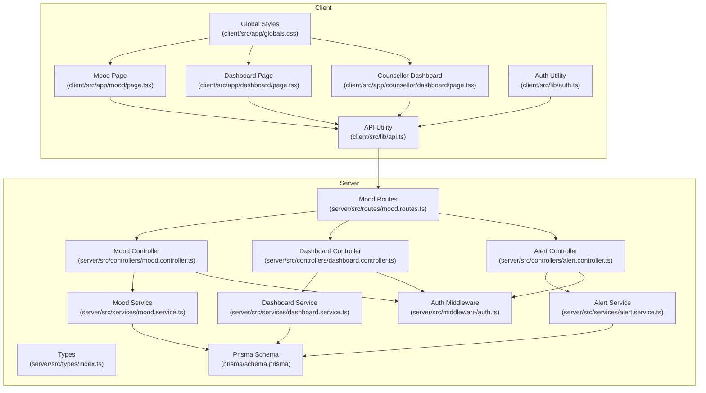
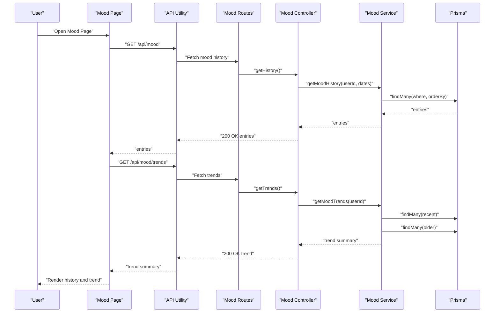
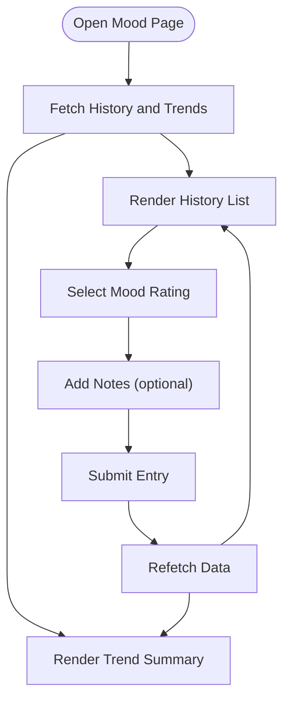
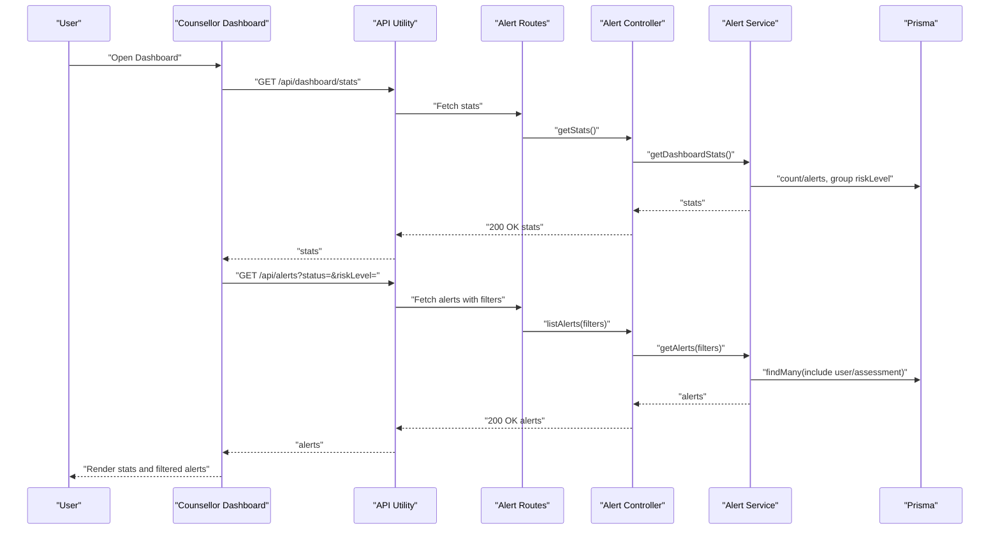
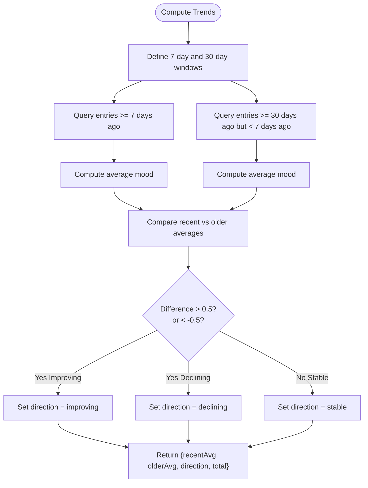
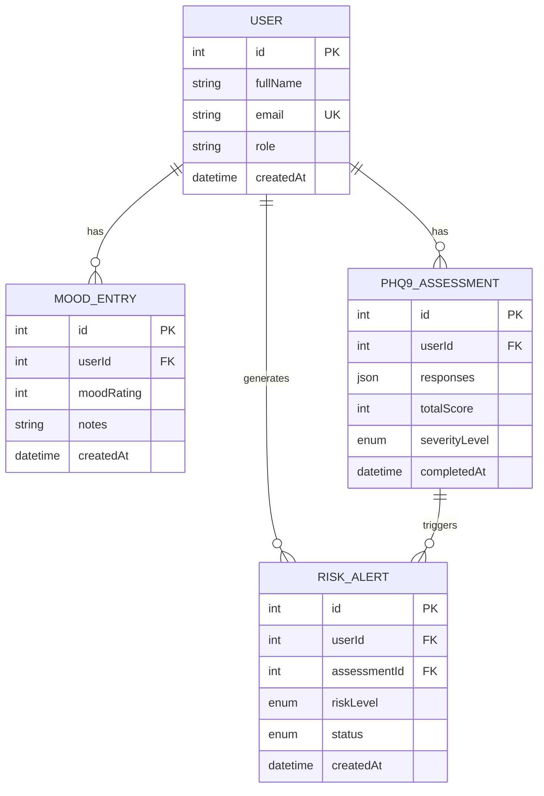
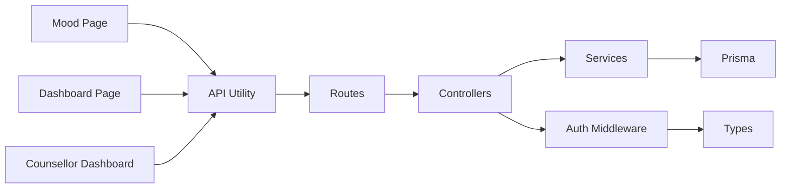

# Visualization and Reporting

<cite>
**Referenced Files in This Document**
- [mood.page.tsx](file://client/src/app/mood/page.tsx)
- [dashboard.page.tsx](file://client/src/app/dashboard/page.tsx)
- [counsellor.dashboard.page.tsx](file://client/src/app/counsellor/dashboard/page.tsx)
- [api.ts](file://client/src/lib/api.ts)
- [auth.ts](file://client/src/lib/auth.ts)
- [mood.controller.ts](file://server/src/controllers/mood.controller.ts)
- [mood.service.ts](file://server/src/services/mood.service.ts)
- [mood.routes.ts](file://server/src/routes/mood.routes.ts)
- [dashboard.controller.ts](file://server/src/controllers/dashboard.controller.ts)
- [dashboard.service.ts](file://server/src/services/dashboard.service.ts)
- [alert.controller.ts](file://server/src/controllers/alert.controller.ts)
- [alert.service.ts](file://server/src/services/alert.service.ts)
- [auth.middleware.ts](file://server/src/middleware/auth.ts)
- [types.index.ts](file://server/src/types/index.ts)
- [schema.prisma](file://prisma/schema.prisma)
- [globals.css](file://client/src/app/globals.css)
</cite>

## Table of Contents
1. [Introduction](#introduction)
2. [Project Structure](#project-structure)
3. [Core Components](#core-components)
4. [Architecture Overview](#architecture-overview)
5. [Detailed Component Analysis](#detailed-component-analysis)
6. [Dependency Analysis](#dependency-analysis)
7. [Performance Considerations](#performance-considerations)
8. [Troubleshooting Guide](#troubleshooting-guide)
9. [Conclusion](#conclusion)
10. [Appendices](#appendices)

## Introduction
This document describes the visualization and reporting system for mood tracking and related insights. It covers how mood history and trends are presented, how interactive dashboards surface quick statistics and actionable insights, and how the backend supports these features with authenticated APIs. It also outlines current capabilities, extension points for richer visualizations, and operational considerations such as privacy and accessibility.

## Project Structure
The visualization and reporting system spans the client (Next.js) and server (Express) layers:
- Client pages render mood logging, history, and summary trends.
- Client utilities manage API requests and authentication state.
- Server routes expose authenticated endpoints for mood history, trends, and counselor dashboards.
- Services encapsulate Prisma queries for data retrieval and aggregation.
- Prisma schema defines the data model for mood entries and related entities.

**Diagram sources**
- [mood.page.tsx:1-245](file://client/src/app/mood/page.tsx#L1-L245)
- [dashboard.page.tsx:1-206](file://client/src/app/dashboard/page.tsx#L1-L206)
- [counsellor.dashboard.page.tsx:1-213](file://client/src/app/counsellor/dashboard/page.tsx#L1-L213)
- [api.ts:1-36](file://client/src/lib/api.ts#L1-L36)
- [auth.ts:1-27](file://client/src/lib/auth.ts#L1-L27)
- [mood.routes.ts:1-12](file://server/src/routes/mood.routes.ts#L1-L12)
- [mood.controller.ts:1-67](file://server/src/controllers/mood.controller.ts#L1-L67)
- [mood.service.ts:1-58](file://server/src/services/mood.service.ts#L1-L58)
- [dashboard.controller.ts:1-13](file://server/src/controllers/dashboard.controller.ts#L1-L13)
- [dashboard.service.ts:1-19](file://server/src/services/dashboard.service.ts#L1-L19)
- [alert.controller.ts:1-70](file://server/src/controllers/alert.controller.ts#L1-L70)
- [alert.service.ts:1-62](file://server/src/services/alert.service.ts#L1-L62)
- [auth.middleware.ts:1-39](file://server/src/middleware/auth.ts#L1-L39)
- [types.index.ts:1-12](file://server/src/types/index.ts#L1-L12)
- [schema.prisma:1-134](file://prisma/schema.prisma#L1-L134)
- [globals.css:1-20](file://client/src/app/globals.css#L1-L20)

**Section sources**
- [mood.page.tsx:1-245](file://client/src/app/mood/page.tsx#L1-L245)
- [dashboard.page.tsx:1-206](file://client/src/app/dashboard/page.tsx#L1-L206)
- [counsellor.dashboard.page.tsx:1-213](file://client/src/app/counsellor/dashboard/page.tsx#L1-L213)
- [api.ts:1-36](file://client/src/lib/api.ts#L1-L36)
- [auth.ts:1-27](file://client/src/lib/auth.ts#L1-L27)
- [mood.routes.ts:1-12](file://server/src/routes/mood.routes.ts#L1-L12)
- [mood.controller.ts:1-67](file://server/src/controllers/mood.controller.ts#L1-L67)
- [mood.service.ts:1-58](file://server/src/services/mood.service.ts#L1-L58)
- [dashboard.controller.ts:1-13](file://server/src/controllers/dashboard.controller.ts#L1-L13)
- [dashboard.service.ts:1-19](file://server/src/services/dashboard.service.ts#L1-L19)
- [alert.controller.ts:1-70](file://server/src/controllers/alert.controller.ts#L1-L70)
- [alert.service.ts:1-62](file://server/src/services/alert.service.ts#L1-L62)
- [auth.middleware.ts:1-39](file://server/src/middleware/auth.ts#L1-L39)
- [types.index.ts:1-12](file://server/src/types/index.ts#L1-L12)
- [schema.prisma:1-134](file://prisma/schema.prisma#L1-L134)
- [globals.css:1-20](file://client/src/app/globals.css#L1-L20)

## Core Components
- Mood Tracking Page
  - Presents a five-point mood scale with emoji indicators, optional notes, and submission handling.
  - Fetches recent mood history and aggregated trends via authenticated API calls.
  - Displays a summary card with average mood, total entries, and trend direction.
  - Renders a scrollable history list with dates and optional notes.

- Dashboard Pages
  - Student Dashboard: Shows latest mood, PHQ-9 severity, risk level, and recent mood entries.
  - Counsellor Dashboard: Provides alert statistics, status/risk filters, and a paginated alert list.

- API Layer
  - Centralized request utility adds Authorization headers and handles 401 redirects.
  - Authentication middleware validates bearer tokens and attaches user context.

- Backend Services
  - Mood service computes recent and older averages over 7-day and 30-day windows and determines trend direction.
  - Dashboard service aggregates alert counts and risk distribution.
  - Alert service supports filtering, status updates, and student summaries including recent moods and sentiment breakdown.

- Data Model
  - MoodEntry records user mood ratings and timestamps.
  - Related models support assessments, recommendations, and risk alerts.

**Section sources**
- [mood.page.tsx:29-244](file://client/src/app/mood/page.tsx#L29-L244)
- [dashboard.page.tsx:29-205](file://client/src/app/dashboard/page.tsx#L29-L205)
- [counsellor.dashboard.page.tsx:28-212](file://client/src/app/counsellor/dashboard/page.tsx#L28-L212)
- [api.ts:3-35](file://client/src/lib/api.ts#L3-L35)
- [auth.middleware.ts:5-22](file://server/src/middleware/auth.ts#L5-L22)
- [mood.service.ts:22-57](file://server/src/services/mood.service.ts#L22-L57)
- [dashboard.service.ts:3-18](file://server/src/services/dashboard.service.ts#L3-L18)
- [alert.service.ts:3-61](file://server/src/services/alert.service.ts#L3-L61)
- [schema.prisma:86-95](file://prisma/schema.prisma#L86-L95)

## Architecture Overview
The visualization pipeline integrates client-side rendering with server-side data aggregation:
- Client pages call authenticated endpoints for mood history and trends.
- Controllers validate requests and delegate to services.
- Services query Prisma for structured data and compute derived metrics.
- Responses are returned to client components for rendering.

**Diagram sources**
- [mood.page.tsx:48-61](file://client/src/app/mood/page.tsx#L48-L61)
- [api.ts:3-35](file://client/src/lib/api.ts#L3-L35)
- [mood.routes.ts:7-9](file://server/src/routes/mood.routes.ts#L7-L9)
- [mood.controller.ts:36-66](file://server/src/controllers/mood.controller.ts#L36-L66)
- [mood.service.ts:9-57](file://server/src/services/mood.service.ts#L9-L57)

## Detailed Component Analysis

### Mood Tracking Visualization
- Data Presentation
  - History list displays mood ratings, optional notes, and creation dates.
  - Trend summary shows average mood over recent windows, total entries, and direction indicator.
- Interactions
  - Mood selection via emoji-based buttons with immediate visual feedback.
  - Optional notes field for contextual logging.
  - Submission with validation and loading states.
- Styling and Responsiveness
  - Grid layout adapts from single column on small screens to two columns on larger screens.
  - Tailwind utilities provide spacing, shadows, and responsive breakpoints.

**Diagram sources**
- [mood.page.tsx:48-91](file://client/src/app/mood/page.tsx#L48-L91)

**Section sources**
- [mood.page.tsx:29-244](file://client/src/app/mood/page.tsx#L29-L244)
- [globals.css:1-20](file://client/src/app/globals.css#L1-L20)

### Dashboard Overview and Filtering
- Student Dashboard
  - Displays latest mood, PHQ-9 severity, and risk level.
  - Shows recent mood entries with emoji and dates.
- Counsellor Dashboard
  - Shows alert totals and status breakdowns.
  - Supports filtering by alert status and risk level.
  - Lists alerts with user identifiers, risk badges, status badges, and dates.

**Diagram sources**
- [counsellor.dashboard.page.tsx:49-75](file://client/src/app/counsellor/dashboard/page.tsx#L49-L75)
- [dashboard.controller.ts:5-12](file://server/src/controllers/dashboard.controller.ts#L5-L12)
- [dashboard.service.ts:3-18](file://server/src/services/dashboard.service.ts#L3-L18)
- [alert.controller.ts:5-16](file://server/src/controllers/alert.controller.ts#L5-L16)
- [alert.service.ts:3-16](file://server/src/services/alert.service.ts#L3-L16)

**Section sources**
- [dashboard.page.tsx:29-205](file://client/src/app/dashboard/page.tsx#L29-L205)
- [counsellor.dashboard.page.tsx:28-212](file://client/src/app/counsellor/dashboard/page.tsx#L28-L212)
- [dashboard.controller.ts:1-13](file://server/src/controllers/dashboard.controller.ts#L1-L13)
- [dashboard.service.ts:1-19](file://server/src/services/dashboard.service.ts#L1-L19)
- [alert.controller.ts:1-70](file://server/src/controllers/alert.controller.ts#L1-L70)
- [alert.service.ts:1-62](file://server/src/services/alert.service.ts#L1-L62)

### Backend Data Aggregation and Trend Calculation
- Trend computation compares recent average versus older average over defined windows.
- History filtering supports optional start/end date parameters.
- Dashboard stats derive counts and distributions from risk alerts.

**Diagram sources**
- [mood.service.ts:22-57](file://server/src/services/mood.service.ts#L22-L57)

**Section sources**
- [mood.controller.ts:36-66](file://server/src/controllers/mood.controller.ts#L36-L66)
- [mood.service.ts:1-58](file://server/src/services/mood.service.ts#L1-L58)

### Data Model for Mood and Related Insights

**Diagram sources**
- [schema.prisma:47-133](file://prisma/schema.prisma#L47-L133)

**Section sources**
- [schema.prisma:47-133](file://prisma/schema.prisma#L47-L133)

## Dependency Analysis
- Client-to-Server Dependencies
  - Client pages depend on API utility for authenticated requests.
  - Routes depend on controllers; controllers depend on services; services depend on Prisma.
- Authentication and Roles
  - Auth middleware enforces bearer tokens and role checks.
  - Types define the authenticated request shape.
- Cohesion and Coupling
  - Controllers isolate route logic; services encapsulate data access and computation.
  - Client components remain presentation-focused, delegating data concerns to services and API utilities.

**Diagram sources**
- [mood.page.tsx:1-7](file://client/src/app/mood/page.tsx#L1-L7)
- [dashboard.page.tsx:1-7](file://client/src/app/dashboard/page.tsx#L1-L7)
- [counsellor.dashboard.page.tsx:1-7](file://client/src/app/counsellor/dashboard/page.tsx#L1-L7)
- [api.ts:1-36](file://client/src/lib/api.ts#L1-L36)
- [mood.routes.ts:1-12](file://server/src/routes/mood.routes.ts#L1-L12)
- [mood.controller.ts:1-6](file://server/src/controllers/mood.controller.ts#L1-L6)
- [mood.service.ts](file://server/src/services/mood.service.ts#L1)
- [auth.middleware.ts:1-39](file://server/src/middleware/auth.ts#L1-L39)
- [types.index.ts:1-12](file://server/src/types/index.ts#L1-L12)

**Section sources**
- [mood.routes.ts:1-12](file://server/src/routes/mood.routes.ts#L1-L12)
- [mood.controller.ts:1-67](file://server/src/controllers/mood.controller.ts#L1-L67)
- [mood.service.ts:1-58](file://server/src/services/mood.service.ts#L1-L58)
- [auth.middleware.ts:1-39](file://server/src/middleware/auth.ts#L1-L39)
- [types.index.ts:1-12](file://server/src/types/index.ts#L1-L12)

## Performance Considerations
- Client
  - Use of Promise.allSettled ensures partial failures do not block rendering.
  - Sorting and averaging are O(n) per window; keep windows bounded to maintain responsiveness.
- Server
  - Indexes on user ID and timestamps improve query performance for history and trends.
  - Aggregations use single-pass reductions; consider caching frequent trend computations if needed.
- Network
  - Centralized API utility reduces duplication and simplifies header management.

[No sources needed since this section provides general guidance]

## Troubleshooting Guide
- Authentication Failures
  - Unauthorized responses remove token and redirect to login; verify token presence and expiration.
- Validation Errors
  - Mood recording requires integer rating in range; invalid notes types cause 400 responses.
  - Trend and history endpoints rely on authenticated user context.
- Counselor Filters
  - Ensure filter values match expected enums; empty filters return all records.

**Section sources**
- [api.ts:20-26](file://client/src/lib/api.ts#L20-L26)
- [mood.controller.ts:14-27](file://server/src/controllers/mood.controller.ts#L14-L27)
- [counsellor.dashboard.page.tsx:65-80](file://client/src/app/counsellor/dashboard/page.tsx#L65-L80)

## Conclusion
The current system provides a solid foundation for mood visualization and reporting:
- Client pages present mood history and trends with minimal interactivity.
- Server endpoints deliver authenticated data with straightforward aggregations.
- The Prisma schema supports related insights such as assessments and risk alerts.

Future enhancements could include:
- Richer visualizations (line charts, seasonal breakdowns) with lightweight charting libraries.
- Export/reporting features for PDF/CSV generation and secure sharing.
- Advanced filtering (date ranges, trend overlays) and statistical summaries.
- Accessibility improvements (ARIA labels, keyboard navigation) and mobile-first design refinements.

[No sources needed since this section summarizes without analyzing specific files]

## Appendices

### API Definitions
- Mood History
  - Method: GET
  - Path: /api/mood
  - Query: startDate, endDate (optional)
  - Response: Array of mood entries ordered by creation date descending
- Mood Trends
  - Method: GET
  - Path: /api/mood/trends
  - Response: Trend summary with recent average, older average, direction, and total entries
- Dashboard Stats
  - Method: GET
  - Path: /api/dashboard/stats
  - Response: Alert totals, pending, reviewed, resolved, total students, risk distribution
- Alerts
  - Method: GET
  - Path: /api/alerts
  - Query: status, riskLevel (optional)
  - Response: Alert list with user and assessment details

**Section sources**
- [mood.routes.ts:7-9](file://server/src/routes/mood.routes.ts#L7-L9)
- [mood.controller.ts:36-66](file://server/src/controllers/mood.controller.ts#L36-L66)
- [dashboard.controller.ts:5-12](file://server/src/controllers/dashboard.controller.ts#L5-L12)
- [alert.controller.ts:5-16](file://server/src/controllers/alert.controller.ts#L5-L16)

### Implementation Notes and Extension Points
- Charting Libraries
  - Consider lightweight charting libraries for line graphs and seasonal patterns without heavy dependencies.
- Export and Sharing
  - Add endpoints to generate CSV/PDF reports and secure share links with time-limited access.
- Responsive and Accessibility
  - Use semantic HTML, ARIA attributes, and Tailwind utilities to enhance mobile usability and screen reader support.
- Privacy and Security
  - Enforce role-based access, sanitize shared reports, and avoid embedding sensitive identifiers in URLs.

[No sources needed since this section provides general guidance]