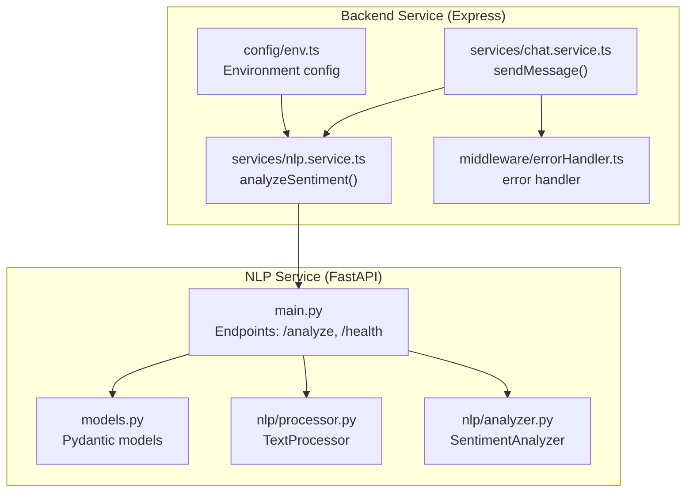
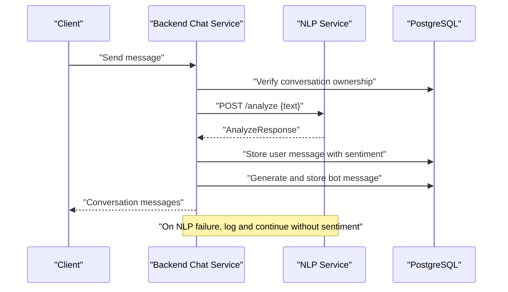
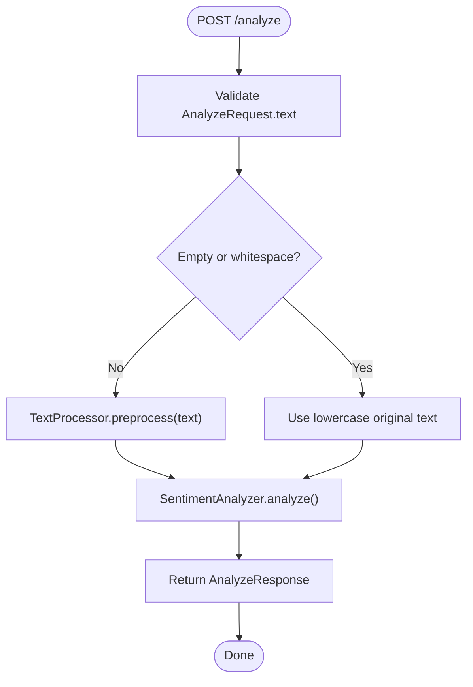
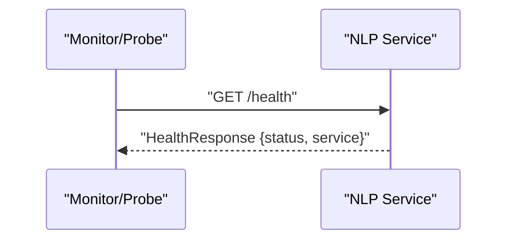
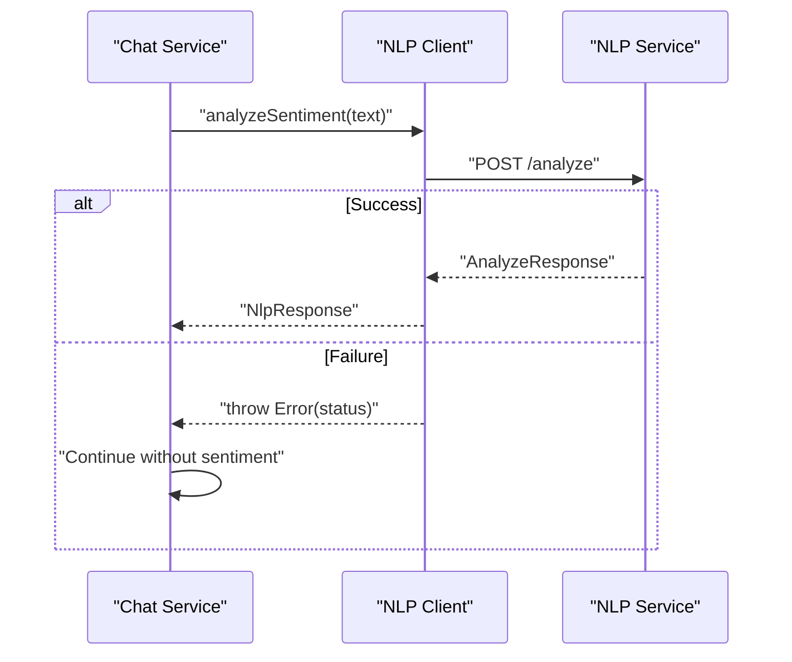
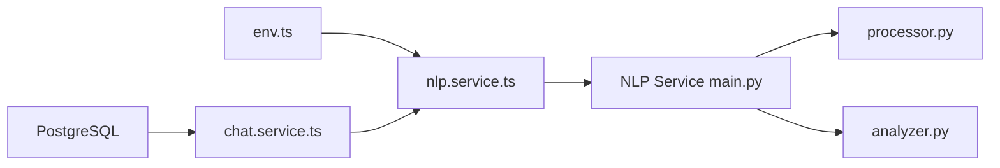

# API Endpoints and Integration

<cite>
**Referenced Files in This Document**
- [main.py](file://nlp-service/main.py)
- [models.py](file://nlp-service/models.py)
- [analyzer.py](file://nlp-service/nlp/analyzer.py)
- [processor.py](file://nlp-service/nlp/processor.py)
- [env.ts](file://server/src/config/env.ts)
- [nlp.service.ts](file://server/src/services/nlp.service.ts)
- [chat.service.ts](file://server/src/services/chat.service.ts)
- [errorHandler.ts](file://server/src/middleware/errorHandler.ts)
- [docker-compose.yml](file://docker-compose.yml)
</cite>

## Table of Contents
1. [Introduction](#introduction)
2. [Project Structure](#project-structure)
3. [Core Components](#core-components)
4. [Architecture Overview](#architecture-overview)
5. [Detailed Component Analysis](#detailed-component-analysis)
6. [Dependency Analysis](#dependency-analysis)
7. [Performance Considerations](#performance-considerations)
8. [Troubleshooting Guide](#troubleshooting-guide)
9. [Conclusion](#conclusion)
10. [Appendices](#appendices)

## Introduction
This document provides comprehensive API documentation for the NLP sentiment analysis service and its integration with the BuddyAI backend. It covers:
- The /analyze POST endpoint with request/response schemas and validation rules
- The /health GET endpoint for service monitoring
- The text analysis workflow, error handling strategies, and HTTP status codes
- CORS configuration, security considerations, and rate limiting approaches
- Client integration patterns showing how the backend service calls the NLP API, error propagation, and fallback mechanisms

## Project Structure
The NLP service is implemented as a FastAPI application with two primary internal components:
- TextProcessor: cleans and tokenizes input text
- SentimentAnalyzer: computes sentiment scores using VADER

The backend service (server) integrates with the NLP service via a dedicated client function and uses the results to enrich chat conversations.

**Diagram sources**
- [main.py:1-71](file://nlp-service/main.py#L1-L71)
- [models.py:1-26](file://nlp-service/models.py#L1-L26)
- [processor.py:1-19](file://nlp-service/nlp/processor.py#L1-L19)
- [analyzer.py:1-27](file://nlp-service/nlp/analyzer.py#L1-L27)
- [env.ts:1-12](file://server/src/config/env.ts#L1-L12)
- [nlp.service.ts:1-24](file://server/src/services/nlp.service.ts#L1-L24)
- [chat.service.ts:1-105](file://server/src/services/chat.service.ts#L1-L105)
- [errorHandler.ts:1-13](file://server/src/middleware/errorHandler.ts#L1-L13)

**Section sources**
- [main.py:1-71](file://nlp-service/main.py#L1-L71)
- [models.py:1-26](file://nlp-service/models.py#L1-L26)
- [processor.py:1-19](file://nlp-service/nlp/processor.py#L1-L19)
- [analyzer.py:1-27](file://nlp-service/nlp/analyzer.py#L1-L27)
- [env.ts:1-12](file://server/src/config/env.ts#L1-L12)
- [nlp.service.ts:1-24](file://server/src/services/nlp.service.ts#L1-L24)
- [chat.service.ts:1-105](file://server/src/services/chat.service.ts#L1-L105)
- [errorHandler.ts:1-13](file://server/src/middleware/errorHandler.ts#L1-L13)

## Core Components
- AnalyzeRequest: Validates that the incoming text is present and non-empty after trimming.
- AnalyzeResponse: Returns sentiment classification and normalized scores (compound, positive, negative, neutral).
- HealthResponse: Provides a simple health status payload for monitoring.
- TextProcessor: Lowercases, tokenizes, filters stopwords and non-alphabetic tokens, and reconstructs cleaned text.
- SentimentAnalyzer: Uses VADER to compute polarity scores and classifies sentiment based on thresholds.

**Section sources**
- [models.py:4-26](file://nlp-service/models.py#L4-L26)
- [processor.py:10-19](file://nlp-service/nlp/processor.py#L10-L19)
- [analyzer.py:8-27](file://nlp-service/nlp/analyzer.py#L8-L27)

## Architecture Overview
The backend service calls the NLP service asynchronously during chat message processing. If the NLP call fails, the system continues without sentiment enrichment and logs the failure.

**Diagram sources**
- [chat.service.ts:45-89](file://server/src/services/chat.service.ts#L45-L89)
- [nlp.service.ts:11-23](file://server/src/services/nlp.service.ts#L11-L23)
- [main.py:43-58](file://nlp-service/main.py#L43-L58)

## Detailed Component Analysis

### /analyze POST Endpoint
- Purpose: Analyze text sentiment using VADER via the NLP service.
- Authentication: None (configured for local development).
- Request Schema: AnalyzeRequest
  - text: string (required; must not be empty after trimming)
- Response Schema: AnalyzeResponse
  - sentiment: string ("positive", "neutral", "negative")
  - compound_score: number (normalized compound score)
  - pos: number (positive sentiment proportion)
  - neg: number (negative sentiment proportion)
  - neu: number (neutral sentiment proportion)
- Processing Logic:
  - Preprocess text using TextProcessor
  - If preprocessed text is empty, fall back to lowercase original text
  - Compute sentiment using SentimentAnalyzer
- Error Handling:
  - On internal errors, returns HTTP 500 with a descriptive message
- HTTP Status Codes:
  - 200 OK on successful analysis
  - 500 Internal Server Error on analysis failure

**Diagram sources**
- [models.py:4-12](file://nlp-service/models.py#L4-L12)
- [processor.py:10-19](file://nlp-service/nlp/processor.py#L10-L19)
- [analyzer.py:8-27](file://nlp-service/nlp/analyzer.py#L8-L27)
- [main.py:43-58](file://nlp-service/main.py#L43-L58)

**Section sources**
- [models.py:4-26](file://nlp-service/models.py#L4-L26)
- [processor.py:10-19](file://nlp-service/nlp/processor.py#L10-L19)
- [analyzer.py:8-27](file://nlp-service/nlp/analyzer.py#L8-L27)
- [main.py:43-58](file://nlp-service/main.py#L43-L58)

### /health GET Endpoint
- Purpose: Service health check for monitoring and readiness probes.
- Response Schema: HealthResponse
  - status: string ("healthy")
  - service: string (service identifier)
- Typical Responses:
  - 200 OK with health payload

**Diagram sources**
- [main.py:61-64](file://nlp-service/main.py#L61-L64)
- [models.py:23-26](file://nlp-service/models.py#L23-L26)

**Section sources**
- [main.py:61-64](file://nlp-service/main.py#L61-L64)
- [models.py:23-26](file://nlp-service/models.py#L23-L26)

### Backend Integration Patterns
- Client Call: The backend uses a dedicated function to call /analyze and parse the response.
- Error Propagation: Non-OK responses trigger an error that bubbles up to the Express error handler.
- Fallback Mechanism: In chat processing, if NLP analysis fails, the system logs the error and proceeds without sentiment enrichment.

**Diagram sources**
- [nlp.service.ts:11-23](file://server/src/services/nlp.service.ts#L11-L23)
- [chat.service.ts:58-65](file://server/src/services/chat.service.ts#L58-L65)
- [main.py:43-58](file://nlp-service/main.py#L43-L58)

**Section sources**
- [nlp.service.ts:11-23](file://server/src/services/nlp.service.ts#L11-L23)
- [chat.service.ts:58-65](file://server/src/services/chat.service.ts#L58-L65)
- [errorHandler.ts:7-12](file://server/src/middleware/errorHandler.ts#L7-L12)

## Dependency Analysis
- Environment Configuration: The backend reads the NLP service URL from environment variables.
- Internal Dependencies:
  - main.py depends on models.py, processor.py, and analyzer.py
  - chat.service.ts depends on nlp.service.ts
  - nlp.service.ts depends on env.ts
- External Dependencies:
  - NLTK resources are downloaded at startup and cached locally
  - PostgreSQL is used by the backend for persistence

**Diagram sources**
- [env.ts:10](file://server/src/config/env.ts#L10)
- [nlp.service.ts:11-23](file://server/src/services/nlp.service.ts#L11-L23)
- [main.py:43-58](file://nlp-service/main.py#L43-L58)
- [processor.py:10-19](file://nlp-service/nlp/processor.py#L10-L19)
- [analyzer.py:8-27](file://nlp-service/nlp/analyzer.py#L8-L27)
- [chat.service.ts:45-89](file://server/src/services/chat.service.ts#L45-L89)

**Section sources**
- [env.ts:10](file://server/src/config/env.ts#L10)
- [nlp.service.ts:11-23](file://server/src/services/nlp.service.ts#L11-L23)
- [main.py:43-58](file://nlp-service/main.py#L43-L58)
- [processor.py:10-19](file://nlp-service/nlp/processor.py#L10-L19)
- [analyzer.py:8-27](file://nlp-service/nlp/analyzer.py#L8-L27)
- [chat.service.ts:45-89](file://server/src/services/chat.service.ts#L45-L89)

## Performance Considerations
- Startup Resource Download: NLTK resources are downloaded once at service startup to reduce latency on first requests.
- Preprocessing Cost: Text preprocessing involves tokenization and filtering; keep input sizes reasonable to minimize overhead.
- Caching: Consider caching repeated analyses if the same text is sent frequently.
- Concurrency: The FastAPI app runs with default settings; scale horizontally behind a reverse proxy for throughput.
- Network Latency: The backend performs synchronous HTTP calls to the NLP service; consider timeouts and retries if integrating into high-throughput paths.

[No sources needed since this section provides general guidance]

## Troubleshooting Guide
- NLP Service Unavailable:
  - Symptom: Backend throws an error when calling /analyze.
  - Behavior: The chat service logs the error and continues without sentiment enrichment.
  - Resolution: Ensure the NLP service is reachable at the configured URL and healthy.
- Validation Errors:
  - Symptom: Requests with empty or missing text receive a 422 error.
  - Resolution: Ensure the request body includes a non-empty text value.
- Health Probe Failures:
  - Symptom: Monitoring reports unhealthy status.
  - Resolution: Confirm the /health endpoint responds with a 200 OK and the expected payload.

**Section sources**
- [nlp.service.ts:18-20](file://server/src/services/nlp.service.ts#L18-L20)
- [chat.service.ts:62-65](file://server/src/services/chat.service.ts#L62-L65)
- [models.py:7-12](file://nlp-service/models.py#L7-L12)
- [main.py:61-64](file://nlp-service/main.py#L61-L64)

## Conclusion
The NLP sentiment analysis service exposes a simple, robust API for sentiment classification with strong defaults and graceful error handling. The backend integrates seamlessly, providing a fallback mechanism when the NLP service is unavailable. For production deployments, consider adding authentication, rate limiting, and improved resilience patterns around the NLP calls.

[No sources needed since this section summarizes without analyzing specific files]

## Appendices

### API Definitions

- Base URL
  - Backend configuration resolves the NLP service URL from environment variables.
  - Default value is provided for local development.

- /analyze
  - Method: POST
  - Content-Type: application/json
  - Request Body: AnalyzeRequest
    - text: string (required; non-empty after trimming)
  - Response Body: AnalyzeResponse
    - sentiment: string
    - compound_score: number
    - pos: number
    - neg: number
    - neu: number
  - Status Codes:
    - 200 OK on success
    - 500 Internal Server Error on analysis failure

- /health
  - Method: GET
  - Response Body: HealthResponse
    - status: string
    - service: string
  - Status Codes:
    - 200 OK on success

**Section sources**
- [env.ts:10](file://server/src/config/env.ts#L10)
- [models.py:4-26](file://nlp-service/models.py#L4-L26)
- [main.py:43-58](file://nlp-service/main.py#L43-L58)
- [main.py:61-64](file://nlp-service/main.py#L61-L64)

### CORS Configuration
- The NLP service allows cross-origin requests from any origin for development convenience.
- Production deployments should restrict origins to trusted domains.

**Section sources**
- [main.py:30-36](file://nlp-service/main.py#L30-L36)

### Security Considerations
- Authentication: The /analyze endpoint does not require authentication in the current implementation.
- Authorization: Ensure the NLP service is not exposed publicly; restrict network access to trusted services.
- Secrets: The backend reads JWT secret and database URL from environment variables; protect these values.
- Transport: Use TLS termination at the edge or reverse proxy for encrypted communication.

**Section sources**
- [env.ts:6-11](file://server/src/config/env.ts#L6-L11)
- [docker-compose.yml:1-19](file://docker-compose.yml#L1-L19)

### Rate Limiting Approaches
- Suggested Strategies:
  - Apply rate limits at the reverse proxy or gateway per IP address.
  - Enforce per-user quotas in the backend when authentication is introduced.
  - Use circuit breakers to prevent cascading failures if the NLP service becomes slow or unavailable.

[No sources needed since this section provides general guidance]

### Client Integration Examples

- Backend Calling NLP Service
  - The backend constructs a POST request to /analyze with the text payload.
  - On non-OK responses, it throws an error that is handled by the centralized error handler.
  - Example snippet path: [nlp.service.ts:11-23](file://server/src/services/nlp.service.ts#L11-L23)

- Chat Message Processing with Fallback
  - During message sending, the backend attempts to analyze sentiment.
  - If the NLP call fails, it logs the error and proceeds without sentiment enrichment.
  - Example snippet path: [chat.service.ts:58-65](file://server/src/services/chat.service.ts#L58-L65)

- Error Propagation
  - The centralized error handler ensures consistent error responses.
  - Example snippet path: [errorHandler.ts:7-12](file://server/src/middleware/errorHandler.ts#L7-L12)

**Section sources**
- [nlp.service.ts:11-23](file://server/src/services/nlp.service.ts#L11-L23)
- [chat.service.ts:58-65](file://server/src/services/chat.service.ts#L58-L65)
- [errorHandler.ts:7-12](file://server/src/middleware/errorHandler.ts#L7-L12)