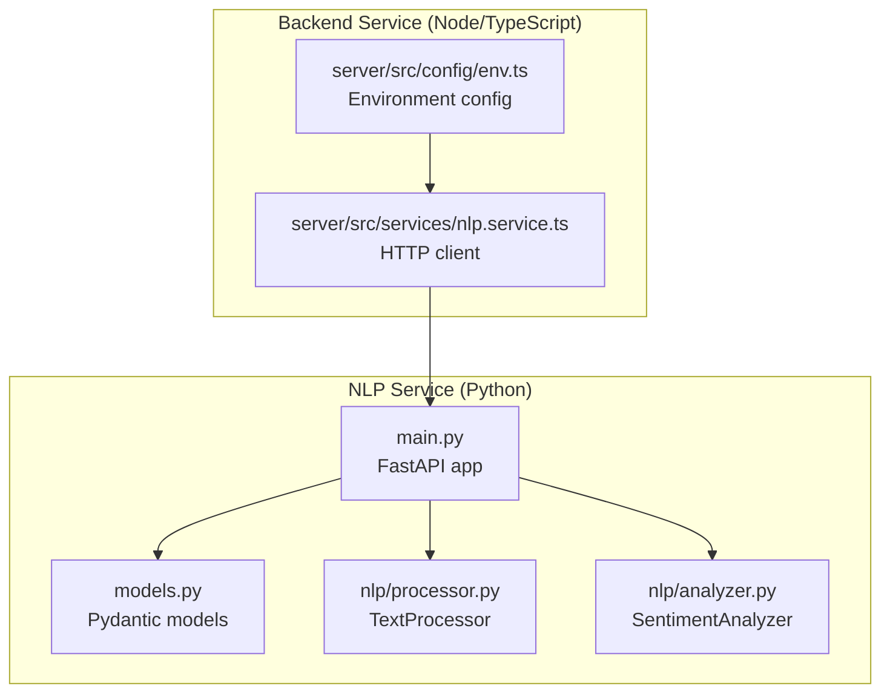
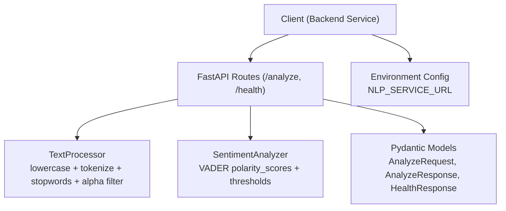
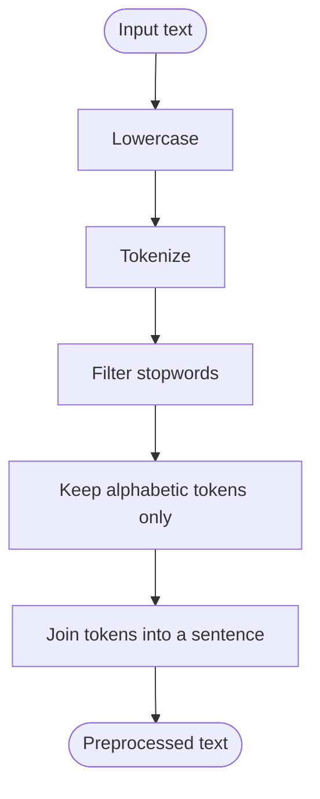
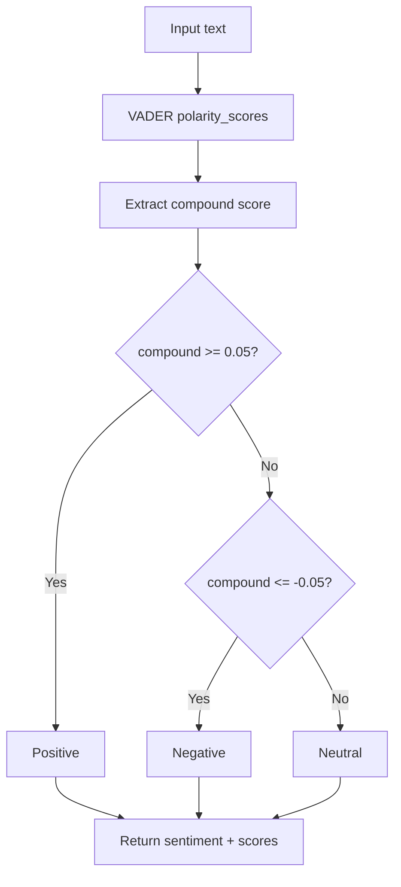
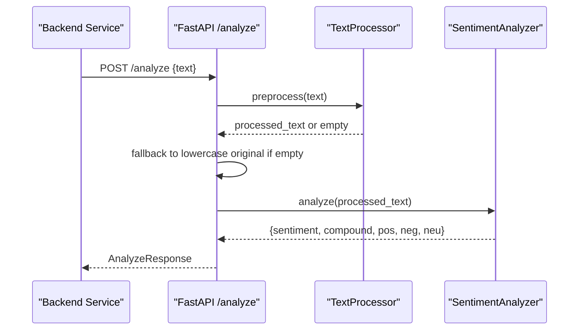
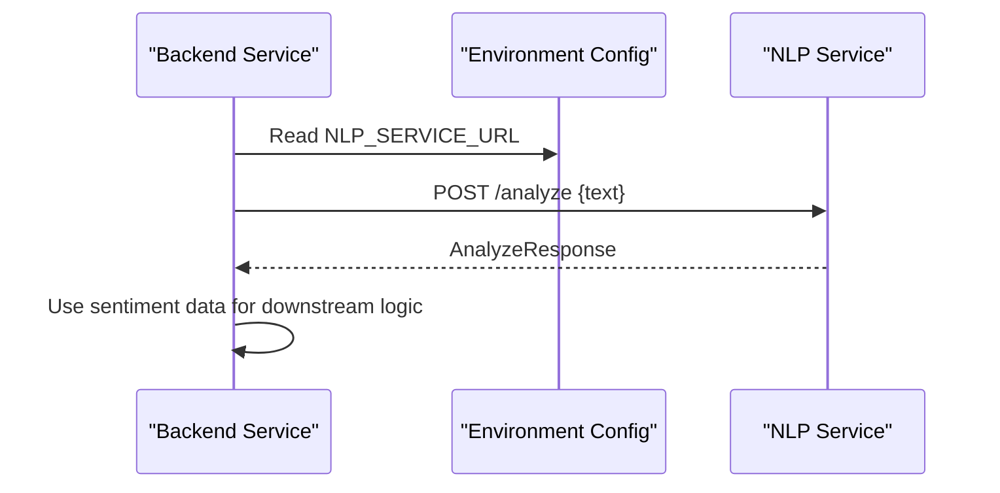
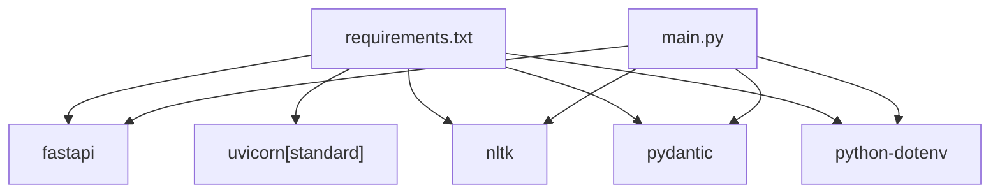

# NLP Sentiment Analysis Service

<cite>
**Referenced Files in This Document**
- [main.py](file://nlp-service/main.py)
- [models.py](file://nlp-service/models.py)
- [analyzer.py](file://nlp-service/nlp/analyzer.py)
- [processor.py](file://nlp-service/nlp/processor.py)
- [requirements.txt](file://nlp-service/requirements.txt)
- [test_main.py](file://nlp-service/test_main.py)
- [nlp.service.ts](file://server/src/services/nlp.service.ts)
- [env.ts](file://server/src/config/env.ts)
- [README.md](file://README.md)
- [ModelReadMe.md](file://ModelReadMe.md)
</cite>

## Table of Contents
1. [Introduction](#introduction)
2. [Project Structure](#project-structure)
3. [Core Components](#core-components)
4. [Architecture Overview](#architecture-overview)
5. [Detailed Component Analysis](#detailed-component-analysis)
6. [Dependency Analysis](#dependency-analysis)
7. [Performance Considerations](#performance-considerations)
8. [Troubleshooting Guide](#troubleshooting-guide)
9. [Conclusion](#conclusion)
10. [Appendices](#appendices)

## Introduction
This document provides comprehensive technical and operational documentation for the standalone NLP sentiment analysis service implemented with FastAPI, NLTK, and VADER. It explains the text preprocessing pipeline, VADER sentiment classification, API endpoints, integration with the main backend service, error handling, thresholds, and performance optimization strategies. Practical examples illustrate text processing workflows, sentiment scoring interpretation, and integration patterns tailored for high-volume text processing.

## Project Structure
The NLP service is organized into a minimal FastAPI application with dedicated modules for data models, text preprocessing, and sentiment analysis. The backend service integrates with this NLP service via a simple HTTP client.

**Diagram sources**
- [main.py:1-71](file://nlp-service/main.py#L1-L71)
- [models.py:1-26](file://nlp-service/models.py#L1-L26)
- [processor.py:1-19](file://nlp-service/nlp/processor.py#L1-L19)
- [analyzer.py:1-27](file://nlp-service/nlp/analyzer.py#L1-L27)
- [nlp.service.ts:1-24](file://server/src/services/nlp.service.ts#L1-L24)
- [env.ts:1-12](file://server/src/config/env.ts#L1-L12)

**Section sources**
- [main.py:1-71](file://nlp-service/main.py#L1-L71)
- [models.py:1-26](file://nlp-service/models.py#L1-L26)
- [processor.py:1-19](file://nlp-service/nlp/processor.py#L1-L19)
- [analyzer.py:1-27](file://nlp-service/nlp/analyzer.py#L1-L27)
- [nlp.service.ts:1-24](file://server/src/services/nlp.service.ts#L1-L24)
- [env.ts:1-12](file://server/src/config/env.ts#L1-L12)

## Core Components
- FastAPI application with CORS middleware and health endpoint.
- Pydantic models for request/response validation.
- TextProcessor for tokenization, stopword removal, and normalization.
- SentimentAnalyzer wrapping NLTK’s VADER for polarity scoring and classification.
- Backend integration via a simple fetch-based client.

Key responsibilities:
- Text preprocessing pipeline: lowercase conversion, tokenization, stopword removal, alphabetic filtering, and rejoining.
- VADER sentiment classification: compound score thresholding for positive/neutral/negative.
- API endpoints: POST /analyze for single-text sentiment and GET /health for service status.
- Integration: backend service calls the NLP service endpoint with JSON payload.

**Section sources**
- [main.py:28-64](file://nlp-service/main.py#L28-L64)
- [models.py:4-26](file://nlp-service/models.py#L4-L26)
- [processor.py:10-18](file://nlp-service/nlp/processor.py#L10-L18)
- [analyzer.py:8-26](file://nlp-service/nlp/analyzer.py#L8-L26)
- [nlp.service.ts:11-23](file://server/src/services/nlp.service.ts#L11-L23)

## Architecture Overview
The NLP service operates as a microservice with a clear separation of concerns:
- Presentation layer: FastAPI routes.
- Domain logic: TextProcessor and SentimentAnalyzer.
- Data contracts: Pydantic models.
- Integration layer: Backend service consumes the NLP service via HTTP.

**Diagram sources**
- [main.py:43-64](file://nlp-service/main.py#L43-L64)
- [processor.py:6-18](file://nlp-service/nlp/processor.py#L6-L18)
- [analyzer.py:4-26](file://nlp-service/nlp/analyzer.py#L4-L26)
- [models.py:4-26](file://nlp-service/models.py#L4-L26)
- [nlp.service.ts:11-23](file://server/src/services/nlp.service.ts#L11-L23)
- [env.ts:10](file://server/src/config/env.ts#L10)

## Detailed Component Analysis

### Text Preprocessing Pipeline
The TextProcessor performs:
- Lowercasing to normalize case.
- Word tokenization using NLTK’s tokenizer.
- Stopword removal using NLTK’s English stopword corpus.
- Alphabetic filtering to remove punctuation and non-letter tokens.
- Rejoining tokens into a single string suitable for downstream analysis.

**Diagram sources**
- [processor.py:10-18](file://nlp-service/nlp/processor.py#L10-L18)

**Section sources**
- [processor.py:6-18](file://nlp-service/nlp/processor.py#L6-L18)

### VADER Sentiment Analysis Integration
The SentimentAnalyzer wraps NLTK’s VADER:
- Computes polarity scores including compound, positive, neutral, and negative magnitudes.
- Applies thresholds to classify sentiment:
  - Positive: compound score ≥ 0.05
  - Negative: compound score ≤ -0.05
  - Neutral: otherwise
- Rounds scores to four decimal places for consistency.

**Diagram sources**
- [analyzer.py:8-26](file://nlp-service/nlp/analyzer.py#L8-L26)

**Section sources**
- [analyzer.py:4-26](file://nlp-service/nlp/analyzer.py#L4-L26)

### API Endpoints
- POST /analyze
  - Request: AnalyzeRequest with a non-empty text field.
  - Processing: Preprocess text, fallback to lowercase original if preprocessing yields empty, then analyze with VADER.
  - Response: AnalyzeResponse with sentiment label and normalized scores.
  - Error handling: Raises HTTP 500 on analysis failure; Pydantic validation errors on invalid input.
- GET /health
  - Returns HealthResponse indicating service status.

**Diagram sources**
- [main.py:43-58](file://nlp-service/main.py#L43-L58)
- [processor.py:10-18](file://nlp-service/nlp/processor.py#L10-L18)
- [analyzer.py:8-26](file://nlp-service/nlp/analyzer.py#L8-L26)
- [models.py:4-26](file://nlp-service/models.py#L4-L26)

**Section sources**
- [main.py:43-64](file://nlp-service/main.py#L43-L64)
- [models.py:4-26](file://nlp-service/models.py#L4-L26)

### Integration with the Main Backend Service
The backend service calls the NLP service using a fetch-based client configured with the NLP service URL from environment variables. On HTTP errors, it throws an error with the status code.

**Diagram sources**
- [nlp.service.ts:11-23](file://server/src/services/nlp.service.ts#L11-L23)
- [env.ts:10](file://server/src/config/env.ts#L10)

**Section sources**
- [nlp.service.ts:1-24](file://server/src/services/nlp.service.ts#L1-L24)
- [env.ts:1-12](file://server/src/config/env.ts#L1-L12)

### Batch Processing Capabilities
Current implementation supports single-text sentiment analysis via POST /analyze. There is no built-in batch endpoint. For high-volume scenarios, consider:
- Client-side batching with retries and backoff.
- Asynchronous processing with worker queues.
- Upstream aggregation of multiple texts and splitting into chunks.
- Rate limiting and circuit breaker patterns at the caller.

[No sources needed since this section provides general guidance]

### Threshold Tuning and Accuracy Validation Approaches
Thresholds:
- Positive: compound ≥ 0.05
- Negative: compound ≤ -0.05
- Neutral: otherwise

Validation approaches:
- Unit tests covering positive, negative, neutral, and validation error cases.
- Representative dataset testing with known labels for precision/recall/F1-score.
- A/B testing with adjusted thresholds to balance false positives/negatives.
- Logging and auditing of compound scores and classifications for manual review.

**Section sources**
- [analyzer.py:13-18](file://nlp-service/nlp/analyzer.py#L13-L18)
- [test_main.py:17-55](file://nlp-service/test_main.py#L17-L55)

### Practical Examples of Text Processing Workflows
- Example 1: Positive sentiment
  - Input: “I am so happy and excited today!”
  - Preprocessing: lowercase, tokenize, remove stopwords, keep alphabetic tokens.
  - VADER: compound score > 0.05 → Positive.
- Example 2: Negative sentiment
  - Input: “I feel terrible and hopeless.”
  - Preprocessing: same steps.
  - VADER: compound score < -0.05 → Negative.
- Example 3: Neutral sentiment
  - Input: “The weather is okay today.”
  - Preprocessing: same steps.
  - VADER: -0.05 < compound < 0.05 → Neutral.

**Section sources**
- [test_main.py:18-37](file://nlp-service/test_main.py#L18-L37)
- [analyzer.py:13-18](file://nlp-service/nlp/analyzer.py#L13-L18)

### Integration Patterns
- Synchronous call: Backend service calls NLP service synchronously for immediate results.
- Asynchronous call: For latency-sensitive flows, queue messages and process results later.
- Circuit breaker: Protect backend from cascading failures if NLP service is down.
- Retry with exponential backoff: Handle transient network errors.

[No sources needed since this section provides general guidance]

## Dependency Analysis
External dependencies:
- FastAPI and Uvicorn for the web server.
- NLTK for tokenization, stopword corpus, and VADER lexicon.
- Pydantic for request/response validation.
- python-dotenv for environment configuration.

**Diagram sources**
- [requirements.txt:1-6](file://nlp-service/requirements.txt#L1-L6)
- [main.py:1-7](file://nlp-service/main.py#L1-L7)

**Section sources**
- [requirements.txt:1-6](file://nlp-service/requirements.txt#L1-L6)
- [main.py:1-7](file://nlp-service/main.py#L1-L7)

## Performance Considerations
- NLTK resource initialization:
  - Downloads required corpora on startup and persists them locally for reuse.
  - Cleans partial zip files from previous runs to avoid corruption.
- Memory management:
  - NLTK resources are loaded once at startup; avoid repeated downloads.
  - Keep TextProcessor and SentimentAnalyzer instances as singletons within the process.
- Concurrency:
  - Use Uvicorn workers for concurrent request handling.
  - Consider separate processes for CPU-bound preprocessing if needed.
- Scalability:
  - Horizontal scaling via load balancer and multiple service replicas.
  - Stateless design: no in-memory caches that persist across restarts.
- Network latency:
  - Backend service should implement timeouts and retries.
  - Consider caching recent results at the application layer if acceptable.

**Section sources**
- [main.py:9-27](file://nlp-service/main.py#L9-L27)
- [main.py:67-71](file://nlp-service/main.py#L67-L71)

## Troubleshooting Guide
Common issues and resolutions:
- NLTK resource download failures:
  - Ensure network connectivity and writable local path for NLTK data.
  - Verify that partial zip files are cleaned up before retry.
- Empty or invalid input:
  - Pydantic validation rejects empty or missing text fields; ensure clients send non-empty strings.
- Analysis failures:
  - The /analyze endpoint raises HTTP 500 on exceptions; log and inspect underlying errors.
- Backend integration errors:
  - The backend client throws on non-OK responses; check NLP_SERVICE_URL and service availability.

**Section sources**
- [main.py:14-26](file://nlp-service/main.py#L14-L26)
- [models.py:7-12](file://nlp-service/models.py#L7-L12)
- [main.py:57-58](file://nlp-service/main.py#L57-L58)
- [nlp.service.ts:18-20](file://server/src/services/nlp.service.ts#L18-L20)

## Conclusion
The NLP sentiment analysis service provides a robust, minimal implementation of text preprocessing and VADER-based sentiment classification integrated with a FastAPI microservice. It offers clear APIs, strong validation, and straightforward integration with the backend service. For production deployments, focus on resilient networking, performance tuning, and scalable deployment strategies while maintaining the simplicity of the existing architecture.

## Appendices

### API Definitions
- POST /analyze
  - Request: AnalyzeRequest with text field.
  - Response: AnalyzeResponse with sentiment, compound_score, pos, neg, neu.
  - Error: HTTP 500 on analysis failure; Pydantic validation errors on invalid input.
- GET /health
  - Response: HealthResponse with status and service fields.

**Section sources**
- [models.py:4-26](file://nlp-service/models.py#L4-L26)
- [main.py:43-64](file://nlp-service/main.py#L43-L64)

### Model Configuration and Thresholds
- Thresholds:
  - Positive: compound ≥ 0.05
  - Negative: compound ≤ -0.05
  - Neutral: otherwise
- Scores returned:
  - compound_score, pos, neg, neu rounded to four decimals.

**Section sources**
- [analyzer.py:13-26](file://nlp-service/nlp/analyzer.py#L13-L26)

### Testing Coverage
- Health endpoint validation.
- Positive, negative, and neutral sentiment classification tests.
- Empty text and missing field validation tests.
- Response completeness verification.

**Section sources**
- [test_main.py:8-55](file://nlp-service/test_main.py#L8-L55)

### Related System Documentation
- High-level system architecture and runtime behavior.
- NLP and sentiment analysis workflow details.
- PHQ-9 assessment and risk evaluation context.

**Section sources**
- [README.md:125-354](file://README.md#L125-L354)
- [ModelReadMe.md:223-282](file://ModelReadMe.md#L223-L282)