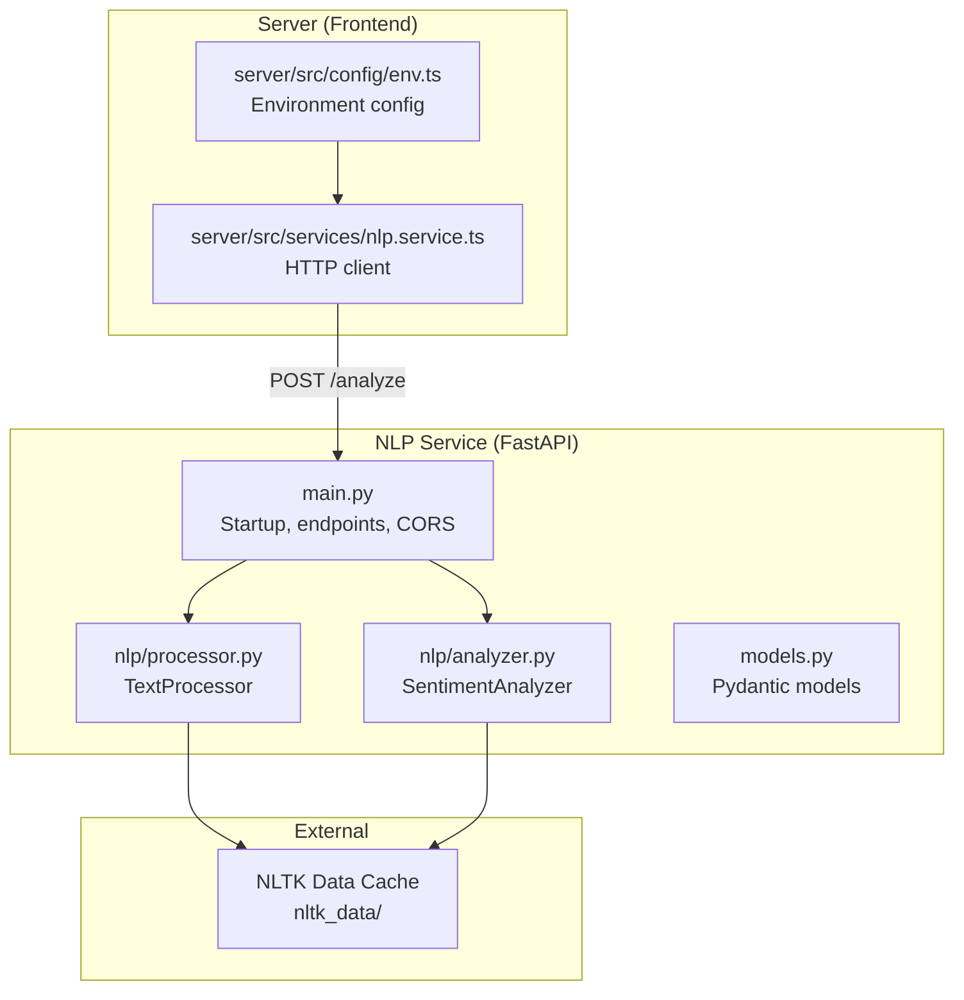
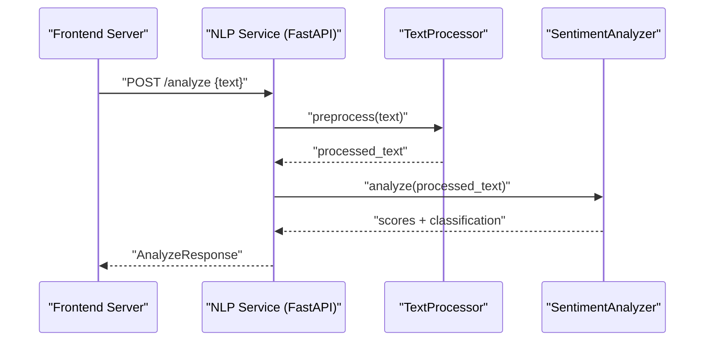
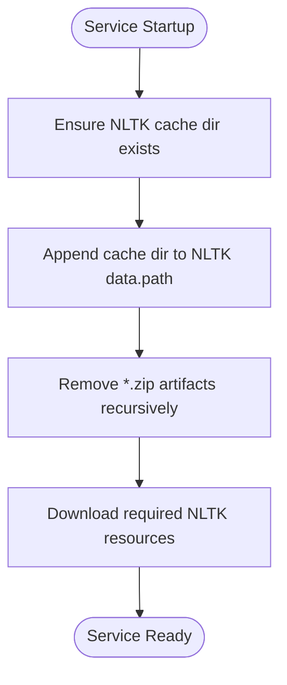
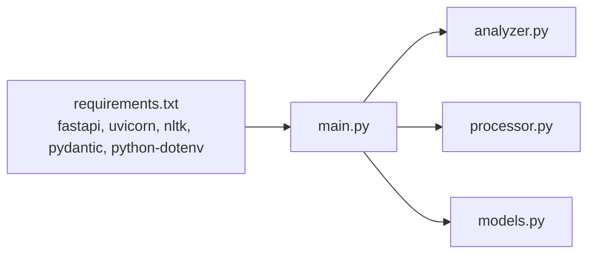

# Performance Optimization and Configuration

<cite>
**Referenced Files in This Document**
- [main.py](file://nlp-service/main.py)
- [analyzer.py](file://nlp-service/nlp/analyzer.py)
- [processor.py](file://nlp-service/nlp/processor.py)
- [models.py](file://nlp-service/models.py)
- [nlp.service.ts](file://server/src/services/nlp.service.ts)
- [env.ts](file://server/src/config/env.ts)
- [docker-compose.yml](file://docker-compose.yml)
- [requirements.txt](file://nlp-service/requirements.txt)
- [test_main.py](file://nlp-service/test_main.py)
</cite>

## Table of Contents
1. [Introduction](#introduction)
2. [Project Structure](#project-structure)
3. [Core Components](#core-components)
4. [Architecture Overview](#architecture-overview)
5. [Detailed Component Analysis](#detailed-component-analysis)
6. [Dependency Analysis](#dependency-analysis)
7. [Performance Considerations](#performance-considerations)
8. [Troubleshooting Guide](#troubleshooting-guide)
9. [Conclusion](#conclusion)
10. [Appendices](#appendices)

## Introduction
This document focuses on performance optimization and configuration management for the NLP service. It explains NLTK data download and caching, custom NLTK data path configuration, and cleanup procedures. It also covers memory management, processing queue optimization, concurrent request handling, environment variable configuration (including NLP_PORT), service scaling considerations, benchmarking approaches, performance monitoring, bottleneck identification, deployment optimization, container resource allocation, and production readiness. Finally, it provides troubleshooting guidance for common performance issues, memory leaks, and processing delays.

## Project Structure
The NLP service is implemented as a FastAPI application with two primary modules:
- Text preprocessor: tokenization, stopword removal, and normalization
- Sentiment analyzer: VADER-based polarity scoring and classification

Key runtime characteristics:
- NLTK resources are downloaded and cached locally during service startup
- The service exposes a single endpoint for sentiment analysis and a health check
- The frontend server consumes the NLP service via a configurable URL

**Diagram sources**
- [main.py:1-71](file://nlp-service/main.py#L1-L71)
- [processor.py:1-19](file://nlp-service/nlp/processor.py#L1-L19)
- [analyzer.py:1-27](file://nlp-service/nlp/analyzer.py#L1-L27)
- [models.py:1-26](file://nlp-service/models.py#L1-L26)
- [nlp.service.ts:1-24](file://server/src/services/nlp.service.ts#L1-L24)
- [env.ts:1-12](file://server/src/config/env.ts#L1-L12)

**Section sources**
- [main.py:1-71](file://nlp-service/main.py#L1-L71)
- [processor.py:1-19](file://nlp-service/nlp/processor.py#L1-L19)
- [analyzer.py:1-27](file://nlp-service/nlp/analyzer.py#L1-L27)
- [models.py:1-26](file://nlp-service/models.py#L1-L26)
- [nlp.service.ts:1-24](file://server/src/services/nlp.service.ts#L1-L24)
- [env.ts:1-12](file://server/src/config/env.ts#L1-L12)

## Core Components
- TextProcessor: Lowercases, tokenizes, filters stopwords and non-alphabetic tokens, and reconstructs cleaned text for downstream analysis.
- SentimentAnalyzer: Uses VADER to compute polarity scores and classify sentiment into positive, neutral, or negative.
- FastAPI endpoints: /analyze for sentiment analysis and /health for health checks.
- Environment configuration: NLP_SERVICE_URL and NLP_PORT; CORS enabled for development.

Performance-relevant behaviors:
- NLTK data is cached under a local directory appended to NLTK’s data path.
- Partially downloaded zip artifacts are removed on startup to avoid corruption.
- Preprocessing ensures minimal token count for VADER, reducing unnecessary computation.

**Section sources**
- [processor.py:10-19](file://nlp-service/nlp/processor.py#L10-L19)
- [analyzer.py:8-27](file://nlp-service/nlp/analyzer.py#L8-L27)
- [main.py:9-27](file://nlp-service/main.py#L9-L27)
- [main.py:43-64](file://nlp-service/main.py#L43-L64)
- [env.ts:10](file://server/src/config/env.ts#L10)

## Architecture Overview
The NLP service is a stateless, single-purpose microservice. Requests flow from the frontend server to the NLP service, which performs preprocessing and sentiment analysis using NLTK/VADER. Results are returned as structured JSON.

**Diagram sources**
- [nlp.service.ts:11-23](file://server/src/services/nlp.service.ts#L11-L23)
- [main.py:43-58](file://nlp-service/main.py#L43-L58)
- [processor.py:10-19](file://nlp-service/nlp/processor.py#L10-L19)
- [analyzer.py:8-27](file://nlp-service/nlp/analyzer.py#L8-L27)

## Detailed Component Analysis

### NLTK Data Download and Caching Mechanism
- Local cache directory: A dedicated folder is created and appended to NLTK’s data path.
- Cleanup: On startup, any existing partial zip artifacts are removed to prevent corrupted downloads.
- Downloads: Required corpora are fetched into the local cache directory.
- Persistence: NLTK data remains on disk across restarts, avoiding repeated downloads.

**Diagram sources**
- [main.py:9-27](file://nlp-service/main.py#L9-L27)

**Section sources**
- [main.py:9-27](file://nlp-service/main.py#L9-L27)

### Custom NLTK Data Path Configuration
- The service programmatically sets NLTK’s data path to a local directory and ensures it exists.
- This approach isolates NLTK data from system-wide locations and simplifies deployment.

**Section sources**
- [main.py:10-12](file://nlp-service/main.py#L10-L12)

### Cleanup Procedures
- Partial downloads are detected by scanning for zip files in the NLTK cache directory and removing them before attempting fresh downloads.
- This mitigates issues caused by interrupted or corrupted downloads.

**Section sources**
- [main.py:14-20](file://nlp-service/main.py#L14-L20)

### Memory Management Techniques
- Stateless design: No persistent state is maintained between requests.
- Resource reuse: NLTK resources are loaded once at import-time and reused across requests.
- Preprocessing: Reduces token volume to minimize downstream processing overhead.

Recommendations:
- Monitor memory growth across long-running instances.
- Consider lazy initialization of heavy NLTK resources if needed, though current design loads them early.

**Section sources**
- [analyzer.py:5-6](file://nlp-service/nlp/analyzer.py#L5-L6)
- [processor.py:7-8](file://nlp-service/nlp/processor.py#L7-L8)

### Processing Queue Optimization
- Current implementation: Single-threaded FastAPI app with synchronous endpoint handlers.
- Recommendations:
  - Use asynchronous workers or a worker pool to parallelize preprocessing and analysis.
  - Introduce a bounded queue with backpressure to protect the service under load.
  - Offload heavy tasks to background jobs if latency-sensitive clients require immediate responses.

[No sources needed since this section provides general guidance]

### Concurrent Request Handling
- Current implementation: No explicit concurrency controls; requests are handled synchronously.
- Recommendations:
  - Scale horizontally with multiple replicas behind a load balancer.
  - Use a WSGI/ASGI server configured with multiple workers for CPU-bound tasks.
  - Add rate limiting and circuit breakers at the gateway level.

[No sources needed since this section provides general guidance]

### Environment Variable Configuration
- NLP_PORT: Controls the listening port for the NLP service.
- NLP_SERVICE_URL: Frontend server uses this to reach the NLP service.
- DATABASE_URL and JWT_SECRET: Present in server configuration but not used by the NLP service.

Operational notes:
- Set NLP_PORT to expose the service on the desired port.
- Ensure NLP_SERVICE_URL matches the deployed endpoint.

**Section sources**
- [main.py:69](file://nlp-service/main.py#L69)
- [env.ts:10](file://server/src/config/env.ts#L10)

### Service Scaling Considerations
- Stateless design enables straightforward horizontal scaling.
- Use container orchestration to run multiple replicas and distribute traffic.
- Persist NLTK cache externally (volume or mounted path) to avoid redundant downloads per replica.

[No sources needed since this section provides general guidance]

### Benchmarking Approaches
- Endpoint-level latency: Measure /analyze latency across varying payload sizes and concurrent clients.
- Throughput: Count successful requests per second under load.
- Resource utilization: Track CPU, memory, and disk I/O during benchmarks.
- Warm-up runs: Exclude cold-start costs by priming NLTK resources.

Recommended tools:
- Locust, k6, or Artillery for load testing.
- Prometheus/Grafana for metrics collection.

[No sources needed since this section provides general guidance]

### Performance Monitoring Metrics
- Latency percentiles (p50, p95, p99) for /analyze
- Error rates and 5xx counts
- Resource usage (CPU%, Mem%, Disk IO)
- Queue depth and rejection rates (if queues are introduced)

[No sources needed since this section provides general guidance]

### Bottleneck Identification Strategies
- Instrument /analyze to record preprocessing and analysis durations.
- Profile NLTK operations to identify hotspots.
- Monitor disk I/O for NLTK cache reads/writes.

[No sources needed since this section provides general guidance]

### Deployment Optimization
- Container image: Keep base images minimal; cache pip dependencies in layers.
- Mount persistent volumes for NLTK cache to speed up cold starts.
- Configure health checks using /health for orchestrator readiness/liveness probes.

[No sources needed since this section provides general guidance]

### Container Resource Allocation
- Start with conservative CPU/memory limits; adjust based on observed utilization.
- Enable swap cautiously; monitor for increased latency.
- Use horizontal pod autoscaling based on CPU or custom latency metrics.

[No sources needed since this section provides general guidance]

### Production Readiness Considerations
- Enable structured logging and request tracing.
- Add circuit breakers and retries at the caller side.
- Implement graceful shutdown hooks to drain connections.
- Secure endpoints with authentication/authorization as needed.

[No sources needed since this section provides general guidance]

## Dependency Analysis
The NLP service depends on FastAPI, NLTK, Pydantic, and optional Python-dotenv. The frontend server depends on Express and environment configuration.

**Diagram sources**
- [requirements.txt:1-6](file://nlp-service/requirements.txt#L1-L6)
- [main.py:1-8](file://nlp-service/main.py#L1-L8)
- [analyzer.py:1](file://nlp-service/nlp/analyzer.py#L1)
- [processor.py:1](file://nlp-service/nlp/processor.py#L1)
- [models.py:1](file://nlp-service/models.py#L1)

**Section sources**
- [requirements.txt:1-6](file://nlp-service/requirements.txt#L1-L6)
- [main.py:1-8](file://nlp-service/main.py#L1-L8)

## Performance Considerations
- Preprocessing reduces token count and improves VADER performance consistency.
- Local NLTK cache avoids network latency and improves cold-start times.
- Stateless design supports easy scaling and high availability.

Recommendations:
- Introduce asynchronous processing or worker pools for throughput improvements.
- Add bounded queues and backpressure mechanisms.
- Use profiling and APM tools to identify and resolve bottlenecks.

[No sources needed since this section provides general guidance]

## Troubleshooting Guide
Common performance issues and remedies:
- Slow cold starts: Verify NLTK cache persistence and confirm that required resources are present after startup.
- Memory growth over time: Investigate whether additional state is being accumulated; current design is stateless.
- Processing delays: Profile preprocessing and VADER analysis; consider optimizing text length or batching.
- Port binding failures: Confirm NLP_PORT is set and not conflicting with other services.
- CORS errors: Ensure frontend origin is permitted; CORS is currently configured broadly.

Validation via tests:
- Health endpoint should return healthy status.
- Positive, negative, and neutral examples should return expected classifications.
- Empty or missing text should yield validation errors.

**Section sources**
- [main.py:61-64](file://nlp-service/main.py#L61-L64)
- [test_main.py:8-15](file://nlp-service/test_main.py#L8-L15)
- [test_main.py:17-37](file://nlp-service/test_main.py#L17-L37)
- [test_main.py:39-55](file://nlp-service/test_main.py#L39-L55)

## Conclusion
The NLP service is designed for simplicity and scalability. Its performance hinges on efficient preprocessing, a local NLTK cache, and careful deployment practices. By introducing asynchronous processing, bounded queues, and robust monitoring, the service can meet higher throughput and latency targets while remaining production-ready.

[No sources needed since this section summarizes without analyzing specific files]

## Appendices

### Appendix A: Endpoint Reference
- POST /analyze: Accepts text, returns sentiment classification and scores.
- GET /health: Returns service health status.

**Section sources**
- [main.py:43-64](file://nlp-service/main.py#L43-L64)

### Appendix B: Environment Variables
- NLP_PORT: Listening port for the NLP service.
- NLP_SERVICE_URL: Base URL used by the frontend server to reach the NLP service.

**Section sources**
- [main.py:69](file://nlp-service/main.py#L69)
- [env.ts:10](file://server/src/config/env.ts#L10)