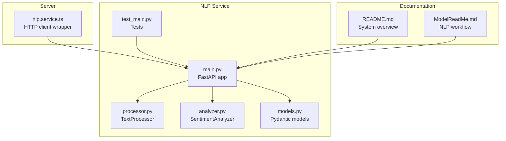
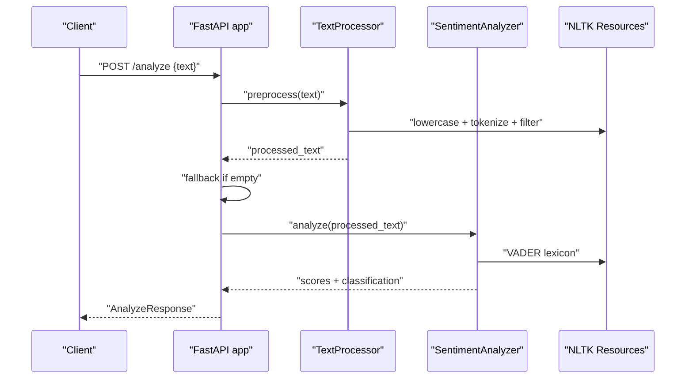
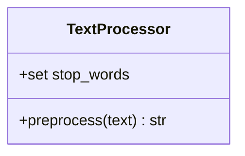
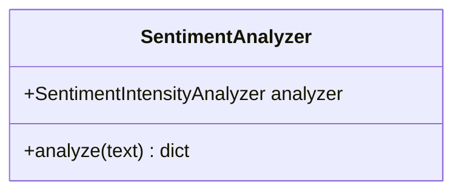
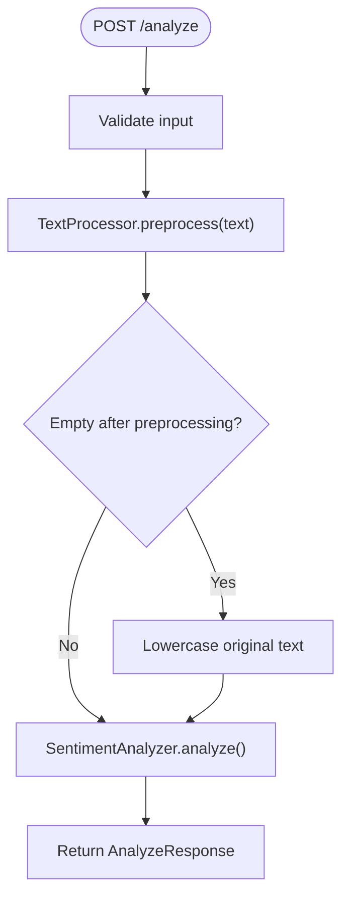
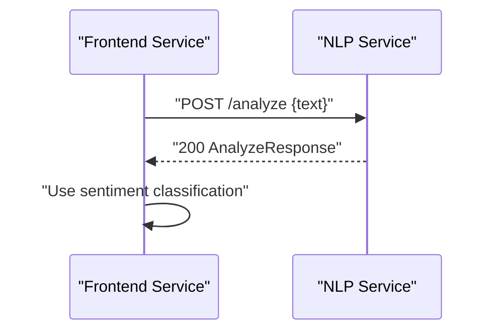
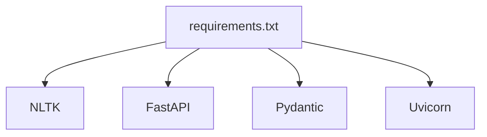

# Text Processing Pipeline

<cite>
**Referenced Files in This Document**
- [processor.py](file://nlp-service/nlp/processor.py)
- [analyzer.py](file://nlp-service/nlp/analyzer.py)
- [main.py](file://nlp-service/main.py)
- [models.py](file://nlp-service/models.py)
- [test_main.py](file://nlp-service/test_main.py)
- [nlp.service.ts](file://server/src/services/nlp.service.ts)
- [README.md](file://README.md)
- [ModelReadMe.md](file://ModelReadMe.md)
- [requirements.txt](file://nlp-service/requirements.txt)
</cite>

## Table of Contents
1. [Introduction](#introduction)
2. [Project Structure](#project-structure)
3. [Core Components](#core-components)
4. [Architecture Overview](#architecture-overview)
5. [Detailed Component Analysis](#detailed-component-analysis)
6. [Dependency Analysis](#dependency-analysis)
7. [Performance Considerations](#performance-considerations)
8. [Troubleshooting Guide](#troubleshooting-guide)
9. [Conclusion](#conclusion)
10. [Appendices](#appendices)

## Introduction
This document focuses on the text processing pipeline component used for sentiment analysis within the NLP service. It explains the TextProcessor class implementation, covering text preprocessing steps such as tokenization using NLTK punkt_tab, stop-word removal using the stopwords corpus, lowercasing, and punctuation normalization. It documents the cleaning workflow that handles special characters, numbers, and whitespace normalization, and outlines the preprocessing logic that ensures robust text input for sentiment analysis, including fallback mechanisms when preprocessing removes all content. Practical examples of text transformation workflows, configuration options, performance optimization techniques, edge cases, and troubleshooting guidance are included.

## Project Structure
The text processing pipeline resides in the NLP service and integrates with the broader system architecture. The relevant files include:
- TextProcessor class for preprocessing
- SentimentAnalyzer class for VADER-based sentiment scoring
- FastAPI application entrypoint with initialization and health endpoints
- Pydantic models for request/response validation
- Frontend service wrapper for invoking the NLP service
- Tests validating behavior and edge cases
- Documentation describing the NLP workflow and model usage

**Diagram sources**
- [main.py:1-71](file://nlp-service/main.py#L1-L71)
- [processor.py:1-19](file://nlp-service/nlp/processor.py#L1-L19)
- [analyzer.py:1-27](file://nlp-service/nlp/analyzer.py#L1-L27)
- [models.py:1-26](file://nlp-service/models.py#L1-L26)
- [test_main.py:1-56](file://nlp-service/test_main.py#L1-L56)
- [nlp.service.ts:1-24](file://server/src/services/nlp.service.ts#L1-L24)
- [README.md:125-210](file://README.md#L125-L210)
- [ModelReadMe.md:223-282](file://ModelReadMe.md#L223-L282)

**Section sources**
- [main.py:1-71](file://nlp-service/main.py#L1-L71)
- [processor.py:1-19](file://nlp-service/nlp/processor.py#L1-L19)
- [analyzer.py:1-27](file://nlp-service/nlp/analyzer.py#L1-L27)
- [models.py:1-26](file://nlp-service/models.py#L1-L26)
- [test_main.py:1-56](file://nlp-service/test_main.py#L1-L56)
- [nlp.service.ts:1-24](file://server/src/services/nlp.service.ts#L1-L24)
- [README.md:125-210](file://README.md#L125-L210)
- [ModelReadMe.md:223-282](file://ModelReadMe.md#L223-L282)

## Core Components
- TextProcessor: Implements text preprocessing for sentiment analysis, including lowercasing, tokenization, stop-word removal, and non-alphabetic token filtering.
- SentimentAnalyzer: Wraps VADER for computing sentiment scores and classifying sentiment.
- FastAPI application: Initializes NLTK resources, exposes endpoints for health and sentiment analysis, and applies preprocessing with fallback logic.
- Pydantic models: Define request validation and response schema.
- Frontend service: Invokes the NLP service endpoint to analyze sentiment.

Key responsibilities:
- TextProcessor: Ensures normalized, tokenized text suitable for VADER.
- SentimentAnalyzer: Produces standardized sentiment classification and scores.
- FastAPI app: Orchestrates preprocessing and analysis, handles errors, and returns structured results.
- Pydantic models: Enforce input validation and output shape.
- Frontend service: Provides a typed client for the NLP service.

**Section sources**
- [processor.py:6-19](file://nlp-service/nlp/processor.py#L6-L19)
- [analyzer.py:4-27](file://nlp-service/nlp/analyzer.py#L4-L27)
- [main.py:43-58](file://nlp-service/main.py#L43-L58)
- [models.py:4-26](file://nlp-service/models.py#L4-L26)
- [nlp.service.ts:11-23](file://server/src/services/nlp.service.ts#L11-L23)

## Architecture Overview
The text processing pipeline follows a clear separation of concerns:
- Input validation occurs at the API boundary using Pydantic models.
- Text preprocessing is performed by TextProcessor.
- Sentiment analysis is delegated to SentimentAnalyzer.
- A fallback mechanism ensures analysis proceeds even when preprocessing yields empty text.
- The frontend service consumes the NLP service endpoint.

**Diagram sources**
- [main.py:43-58](file://nlp-service/main.py#L43-L58)
- [processor.py:10-18](file://nlp-service/nlp/processor.py#L10-L18)
- [analyzer.py:8-27](file://nlp-service/nlp/analyzer.py#L8-L27)

## Detailed Component Analysis

### TextProcessor Implementation
The TextProcessor class encapsulates the text preprocessing logic:
- Lowercasing: Converts input to lowercase for consistent tokenization and stop-word matching.
- Tokenization: Uses NLTK’s word tokenizer to split text into tokens.
- Stop-word removal: Filters out English stop words using NLTK’s stopwords corpus.
- Non-alphabetic filtering: Retains only alphabetic tokens to avoid noise from punctuation and digits.
- Joining: Reconstructs a clean sentence string for downstream analysis.

**Diagram sources**
- [processor.py:6-19](file://nlp-service/nlp/processor.py#L6-L19)

Preprocessing steps:
- Lowercasing: Ensures uniformity for tokenization and stop-word matching.
- Tokenization: Uses NLTK punkt_tab resources for robust segmentation.
- Stop-word removal: Uses NLTK stopwords corpus for English.
- Filtering: Keeps only alphabetic tokens to remove punctuation and numbers.
- Rejoining: Produces a clean string suitable for VADER.

Fallback behavior:
- If preprocessing produces empty text, the API falls back to lowercasing the original input before analysis.

Validation and error handling:
- Input validation is enforced by Pydantic models to reject empty or missing text.
- The API wraps analysis in a try/catch and raises HTTP exceptions on failure.

**Section sources**
- [processor.py:10-18](file://nlp-service/nlp/processor.py#L10-L18)
- [main.py:43-58](file://nlp-service/main.py#L43-L58)
- [models.py:7-12](file://nlp-service/models.py#L7-L12)

### SentimentAnalyzer Implementation
The SentimentAnalyzer class:
- Initializes a VADER SentimentIntensityAnalyzer.
- Computes polarity scores and classifies sentiment based on thresholds.
- Returns a structured dictionary with sentiment label and normalized scores.

**Diagram sources**
- [analyzer.py:4-27](file://nlp-service/nlp/analyzer.py#L4-L27)

Classification thresholds:
- Positive: compound score greater than or equal to 0.05.
- Negative: compound score less than or equal to -0.05.
- Neutral: otherwise.

**Section sources**
- [analyzer.py:8-27](file://nlp-service/nlp/analyzer.py#L8-L27)

### API Orchestration and Fallback Logic
The FastAPI application:
- Downloads and initializes NLTK resources on startup.
- Exposes an analyze endpoint that:
  - Preprocesses the input text.
  - Applies fallback logic if preprocessing yields empty text.
  - Performs sentiment analysis and returns a structured response.
- Provides a health endpoint for readiness checks.

**Diagram sources**
- [main.py:43-58](file://nlp-service/main.py#L43-L58)
- [processor.py:10-18](file://nlp-service/nlp/processor.py#L10-L18)
- [analyzer.py:8-27](file://nlp-service/nlp/analyzer.py#L8-L27)

**Section sources**
- [main.py:9-27](file://nlp-service/main.py#L9-L27)
- [main.py:43-58](file://nlp-service/main.py#L43-L58)

### Frontend Integration
The frontend service invokes the NLP service endpoint with a typed request and handles HTTP errors gracefully.

**Diagram sources**
- [nlp.service.ts:11-23](file://server/src/services/nlp.service.ts#L11-L23)

**Section sources**
- [nlp.service.ts:11-23](file://server/src/services/nlp.service.ts#L11-L23)

## Dependency Analysis
External dependencies and their roles:
- NLTK: Provides tokenization (punkt_tab), stop-word corpus (stopwords), and VADER lexicon for sentiment analysis.
- FastAPI: Exposes REST endpoints and handles routing and serialization.
- Pydantic: Validates request/response shapes and enforces constraints.
- Uvicorn: ASGI server for running the FastAPI application.

**Diagram sources**
- [requirements.txt:1-6](file://nlp-service/requirements.txt#L1-L6)

Internal dependencies:
- main.py depends on processor.py and analyzer.py for preprocessing and analysis.
- models.py defines request/response schemas used by main.py.
- test_main.py exercises main.py endpoints and validates behavior.

**Section sources**
- [requirements.txt:1-6](file://nlp-service/requirements.txt#L1-L6)
- [main.py:6-7](file://nlp-service/main.py#L6-L7)
- [models.py:4-26](file://nlp-service/models.py#L4-L26)
- [test_main.py:1-56](file://nlp-service/test_main.py#L1-L56)

## Performance Considerations
- Resource initialization: NLTK resources are downloaded and cached on startup to avoid repeated network calls.
- Minimal preprocessing cost: Lowercasing and tokenization are lightweight; stop-word filtering and alphabetic filtering add negligible overhead.
- Fallback efficiency: When preprocessing removes all content, the fallback simply lowercases the original text, minimizing computation.
- Scalability: The FastAPI/Uvicorn stack is suitable for concurrent requests; ensure adequate worker processes and memory for production loads.
- Caching: Consider caching frequently analyzed phrases if workload permits, though VADER operates on full sentences and may not benefit from phrase-level caching.

[No sources needed since this section provides general guidance]

## Troubleshooting Guide
Common issues and resolutions:
- Empty or whitespace-only input:
  - Validation rejects empty or blank text; ensure clients strip and validate input before sending.
  - Reference: [models.py:7-12](file://nlp-service/models.py#L7-L12)
- NLTK resource failures:
  - Verify NLTK data path and permissions; the app attempts to download required resources on startup.
  - Reference: [main.py:9-27](file://nlp-service/main.py#L9-L27)
- Unexpected empty output after preprocessing:
  - The fallback lowers the original text; confirm preprocessing filters are functioning as expected.
  - Reference: [main.py:50-52](file://nlp-service/main.py#L50-L52)
- VADER classification anomalies:
  - Review classification thresholds and ensure input text is sufficiently long for meaningful scores.
  - Reference: [analyzer.py:13-18](file://nlp-service/nlp/analyzer.py#L13-L18)
- API errors:
  - Inspect HTTP status codes and error messages; the API wraps exceptions and returns structured details.
  - Reference: [main.py:57-58](file://nlp-service/main.py#L57-L58)
- Frontend connectivity:
  - Confirm endpoint URL and headers; handle non-OK responses with appropriate error handling.
  - Reference: [nlp.service.ts:18-20](file://server/src/services/nlp.service.ts#L18-L20)

**Section sources**
- [models.py:7-12](file://nlp-service/models.py#L7-L12)
- [main.py:9-27](file://nlp-service/main.py#L9-L27)
- [main.py:50-52](file://nlp-service/main.py#L50-L52)
- [analyzer.py:13-18](file://nlp-service/nlp/analyzer.py#L13-L18)
- [main.py:57-58](file://nlp-service/main.py#L57-L58)
- [nlp.service.ts:18-20](file://server/src/services/nlp.service.ts#L18-L20)

## Conclusion
The text processing pipeline provides a focused, robust preprocessing stage tailored for VADER-based sentiment analysis. It leverages NLTK for tokenization and stop-word filtering, normalizes text through lowercasing, and ensures downstream analysis remains meaningful even when preprocessing removes all tokens. The API layer adds validation and a controlled fallback, while the frontend service integrates seamlessly with the broader system. Together, these components form a reliable foundation for sentiment analysis within the BuddyAI platform.

[No sources needed since this section summarizes without analyzing specific files]

## Appendices

### Practical Examples of Text Transformation Workflows
- Typical workflow:
  - Input: “I feel exhausted and hopeless lately.”
  - Lowercase: “i feel exhausted and hopeless lately.”
  - Tokenization: [“i”, “feel”, “exhausted”, “and”, “hopeless”, “lately”]
  - Stop-word removal: [“feel”, “exhausted”, “hopeless”, “lately”]
  - Non-alphabetic filtering: [“feel”, “exhausted”, “hopeless”, “lately”]
  - Rejoined: “feel exhausted hopeless lately”
  - Analysis: VADER scores and classification
- Edge case:
  - Input: “!!!”
  - Preprocessing yields empty; fallback lowercases original and proceeds with analysis.

[No sources needed since this section provides conceptual examples]

### Preprocessing Configuration Options
- Tokenization: Controlled by NLTK punkt_tab; adjust only if changing tokenizer behavior.
- Stop-word corpus: Controlled by NLTK stopwords; change requires updating NLTK resources.
- Alphabetic filtering: Retains only alphabetic tokens; modify to include numbers or punctuation if needed.
- Fallback behavior: Lowercases original text when preprocessing removes all tokens.

[No sources needed since this section provides general guidance]

### Edge Cases in Text Processing
- All tokens removed by stop-word filtering or non-alphabetic filtering:
  - Handled by fallback logic to preserve original text for analysis.
  - Reference: [main.py:50-52](file://nlp-service/main.py#L50-L52)
- Extremely short or empty inputs:
  - Validated by Pydantic; rejected with 422 Unprocessable Entity.
  - Reference: [models.py:7-12](file://nlp-service/models.py#L7-L12)
- Special characters and numbers:
  - Removed by alphabetic filtering; retain only letters for sentiment analysis.
  - Reference: [processor.py:15-16](file://nlp-service/nlp/processor.py#L15-L16)

**Section sources**
- [main.py:50-52](file://nlp-service/main.py#L50-L52)
- [models.py:7-12](file://nlp-service/models.py#L7-L12)
- [processor.py:15-16](file://nlp-service/nlp/processor.py#L15-L16)