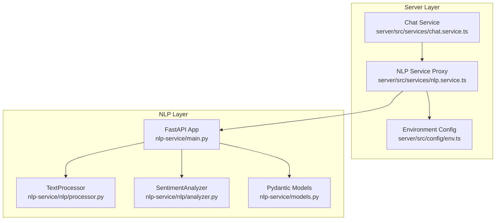
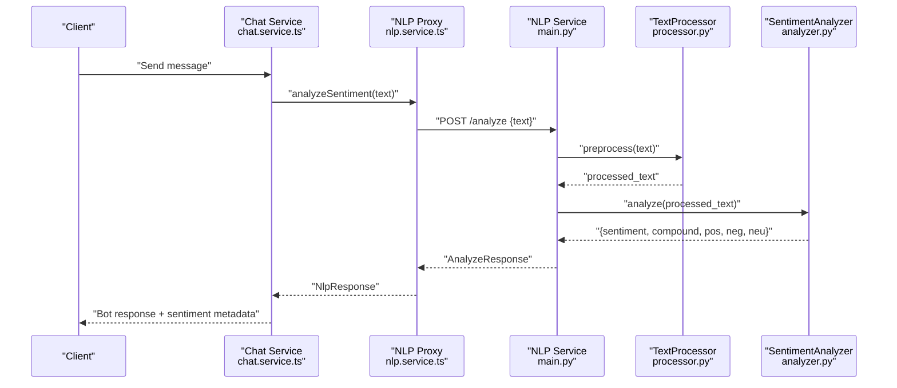
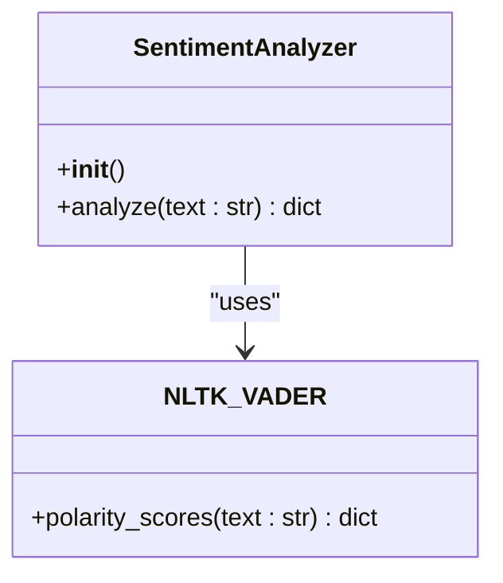
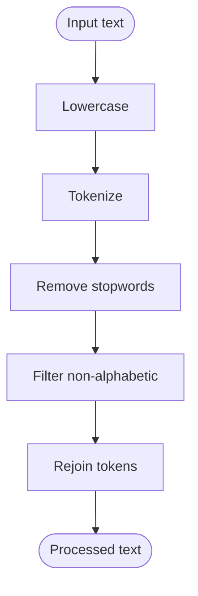
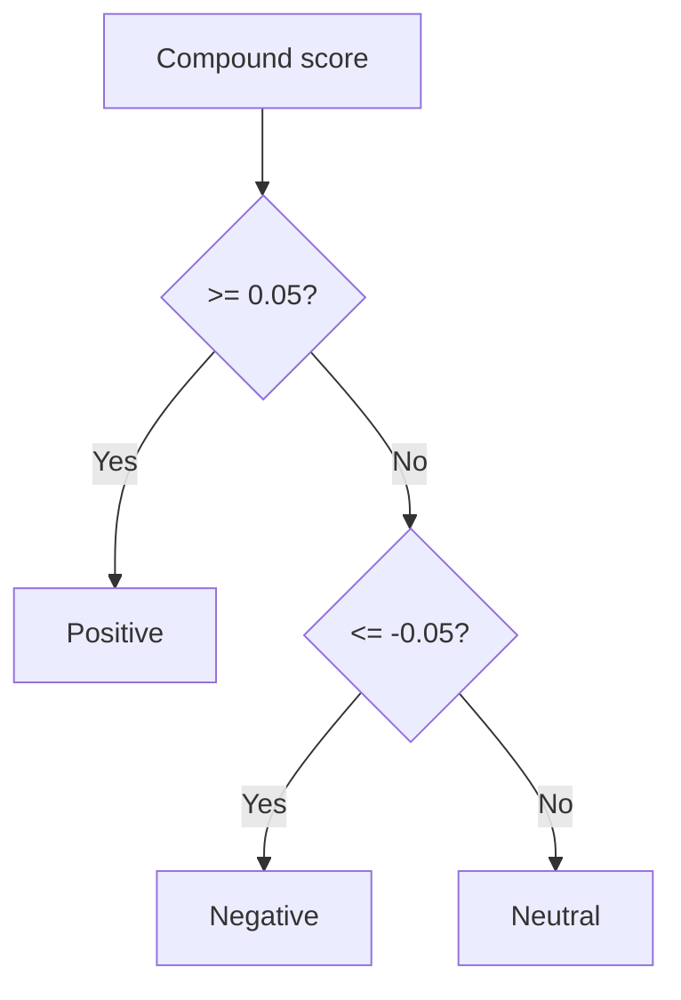
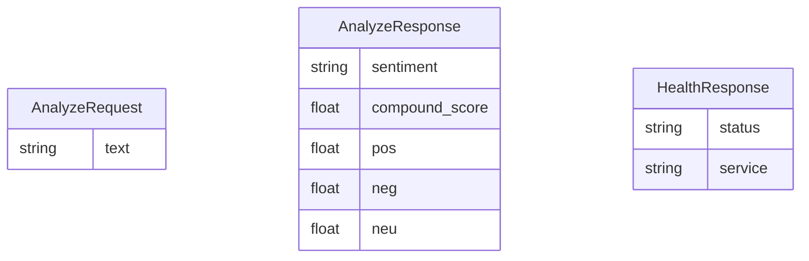
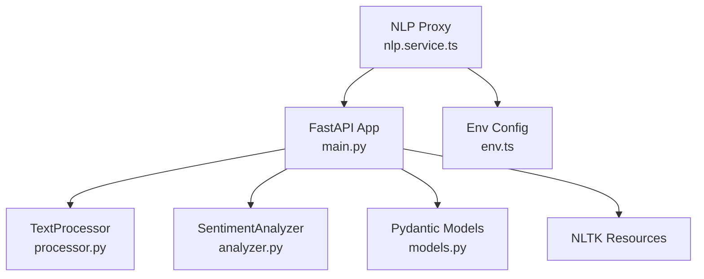

# VADER Sentiment Integration

<cite>
**Referenced Files in This Document**
- [analyzer.py](file://nlp-service/nlp/analyzer.py)
- [processor.py](file://nlp-service/nlp/processor.py)
- [main.py](file://nlp-service/main.py)
- [models.py](file://nlp-service/models.py)
- [test_main.py](file://nlp-service/test_main.py)
- [nlp.service.ts](file://server/src/services/nlp.service.ts)
- [env.ts](file://server/src/config/env.ts)
- [chat.service.ts](file://server/src/services/chat.service.ts)
- [README.md](file://README.md)
- [ModelReadMe.md](file://ModelReadMe.md)
</cite>

## Table of Contents
1. [Introduction](#introduction)
2. [Project Structure](#project-structure)
3. [Core Components](#core-components)
4. [Architecture Overview](#architecture-overview)
5. [Detailed Component Analysis](#detailed-component-analysis)
6. [Dependency Analysis](#dependency-analysis)
7. [Performance Considerations](#performance-considerations)
8. [Troubleshooting Guide](#troubleshooting-guide)
9. [Conclusion](#conclusion)
10. [Appendices](#appendices)

## Introduction
This document explains the VADER (Valence Aware Dictionary and sEntiment Reasoner) sentiment analysis integration within the BuddyAI system. It focuses on the SentimentAnalyzer class implementation, VADER lexicon utilization, compound score calculation methodology, individual sentiment score extraction (positive, negative, neutral), threshold-based classification logic, and how these outputs are integrated into the broader conversational AI pipeline. Practical examples, score interpretation guidelines, confidence assessment, limitations, cultural considerations, and customization options are covered to help developers and stakeholders deploy and operate the sentiment analysis service effectively.

## Project Structure
The VADER sentiment integration spans two layers:
- NLP microservice (Python/FastAPI) that exposes a sentiment analysis endpoint and encapsulates VADER-based logic.
- Server microservice (TypeScript/Node.js) that orchestrates chat flows and consumes the NLP service.

**Diagram sources**
- [main.py:1-71](file://nlp-service/main.py#L1-L71)
- [processor.py:1-19](file://nlp-service/nlp/processor.py#L1-L19)
- [analyzer.py:1-27](file://nlp-service/nlp/analyzer.py#L1-L27)
- [models.py:1-26](file://nlp-service/models.py#L1-L26)
- [nlp.service.ts:1-24](file://server/src/services/nlp.service.ts#L1-L24)
- [env.ts:1-12](file://server/src/config/env.ts#L1-L12)
- [chat.service.ts:1-79](file://server/src/services/chat.service.ts#L1-L79)

**Section sources**
- [main.py:1-71](file://nlp-service/main.py#L1-L71)
- [nlp.service.ts:1-24](file://server/src/services/nlp.service.ts#L1-L24)
- [env.ts:1-12](file://server/src/config/env.ts#L1-L12)
- [chat.service.ts:1-79](file://server/src/services/chat.service.ts#L1-L79)

## Core Components
- SentimentAnalyzer: Wraps NLTK’s VADER sentiment analyzer, computes polarity scores, and returns a unified result with compound, positive, negative, and neutral scores plus a classification label.
- TextProcessor: Performs basic text normalization and tokenization, removing stopwords and non-alphabetic tokens to improve consistency for downstream analysis.
- FastAPI service: Exposes /analyze and /health endpoints, initializes NLTK resources, and orchestrates preprocessing and analysis.
- Pydantic models: Define request/response schemas for validation and serialization.
- Server proxy: Provides a typed client to call the NLP service from the chat flow.

Key outputs:
- sentiment: "positive", "neutral", or "negative"
- compound_score: normalized compound score [-1, 1]
- pos, neg, neu: proportion-like scores in [0, 1], summing approximately to 1

**Section sources**
- [analyzer.py:4-27](file://nlp-service/nlp/analyzer.py#L4-L27)
- [processor.py:6-19](file://nlp-service/nlp/processor.py#L6-L19)
- [main.py:43-64](file://nlp-service/main.py#L43-L64)
- [models.py:4-26](file://nlp-service/models.py#L4-L26)
- [nlp.service.ts:11-23](file://server/src/services/nlp.service.ts#L11-L23)

## Architecture Overview
The sentiment pipeline integrates seamlessly into the chat flow. The server’s chat service invokes the NLP proxy, which calls the NLP microservice. The NLP service preprocesses the text and applies VADER to produce sentiment scores and classification.

**Diagram sources**
- [chat.service.ts:54-79](file://server/src/services/chat.service.ts#L54-L79)
- [nlp.service.ts:11-23](file://server/src/services/nlp.service.ts#L11-L23)
- [main.py:43-58](file://nlp-service/main.py#L43-L58)
- [processor.py:10-18](file://nlp-service/nlp/processor.py#L10-L18)
- [analyzer.py:8-26](file://nlp-service/nlp/analyzer.py#L8-L26)

## Detailed Component Analysis

### SentimentAnalyzer Implementation
The SentimentAnalyzer class encapsulates VADER sentiment scoring:
- Initializes a VADER analyzer instance.
- Computes polarity scores via the analyzer and extracts the compound score.
- Applies threshold-based classification:
  - Positive if compound ≥ 0.05
  - Negative if compound ≤ -0.05
  - Neutral otherwise
- Returns a dictionary containing sentiment label and rounded scores for compound, pos, neg, neu.

**Diagram sources**
- [analyzer.py:4-27](file://nlp-service/nlp/analyzer.py#L4-L27)

**Section sources**
- [analyzer.py:4-27](file://nlp-service/nlp/analyzer.py#L4-L27)

### TextProcessor and Lexical Feature Detection
The TextProcessor performs:
- Lowercasing
- Tokenization
- Stopword removal
- Non-alphabetic token filtering
- Rejoining tokens into a clean string suitable for VADER

This preprocessing improves consistency and reduces noise, especially for short conversational texts. If preprocessing yields an empty string, the service falls back to lowercased original text to ensure analysis proceeds.

**Diagram sources**
- [processor.py:10-18](file://nlp-service/nlp/processor.py#L10-L18)
- [main.py:47-52](file://nlp-service/main.py#L47-L52)

**Section sources**
- [processor.py:6-19](file://nlp-service/nlp/processor.py#L6-L19)
- [main.py:43-58](file://nlp-service/main.py#L43-L58)

### Compound Score Calculation and Threshold Classification
VADER produces a compound score in [-1, 1]. The classification thresholds are:
- Positive: compound ≥ 0.05
- Negative: compound ≤ -0.05
- Neutral: otherwise

These thresholds are chosen to minimize ambiguity around zero and align with typical sentiment boundaries.

**Diagram sources**
- [analyzer.py:13-18](file://nlp-service/nlp/analyzer.py#L13-L18)

**Section sources**
- [analyzer.py:8-26](file://nlp-service/nlp/analyzer.py#L8-L26)

### Individual Sentiment Scores (pos, neg, neu)
The analyzer returns:
- pos: proportion-like positive sentiment
- neg: proportion-like negative sentiment
- neu: proportion-like neutral sentiment

These scores are rounded to four decimal places and are useful for:
- Confidence assessment (higher absolute deviation from 0.5 indicates stronger sentiment)
- Comparative analysis across messages
- Integrating with downstream risk evaluation logic

**Section sources**
- [analyzer.py:20-26](file://nlp-service/nlp/analyzer.py#L20-L26)

### API Contracts and Validation
The NLP service enforces:
- Request validation: text must be present and non-empty
- Response shape: standardized fields for sentiment label and scores
- Health endpoint for service readiness

**Diagram sources**
- [models.py:4-26](file://nlp-service/models.py#L4-L26)

**Section sources**
- [models.py:4-26](file://nlp-service/models.py#L4-L26)
- [main.py:43-64](file://nlp-service/main.py#L43-L64)

### Server Integration and Confidence Assessment
The server’s chat service:
- Calls the NLP proxy to analyze user messages
- Maps VADER sentiment labels to internal constants
- Stores sentiment and compound score with each message
- Uses sentiment metadata to tailor bot responses

Confidence assessment:
- Compound score magnitude indicates strength of sentiment
- pos/neg/neu proportions reflect distribution across categories
- Neutral classification may occur even with slight deviations if compound is near zero

**Section sources**
- [chat.service.ts:54-79](file://server/src/services/chat.service.ts#L54-L79)
- [nlp.service.ts:11-23](file://server/src/services/nlp.service.ts#L11-L23)

## Dependency Analysis
The NLP service depends on NLTK resources and FastAPI. The server depends on the NLP service URL configured via environment variables.

**Diagram sources**
- [main.py:1-71](file://nlp-service/main.py#L1-L71)
- [processor.py:1-19](file://nlp-service/nlp/processor.py#L1-L19)
- [analyzer.py:1-27](file://nlp-service/nlp/analyzer.py#L1-L27)
- [models.py:1-26](file://nlp-service/models.py#L1-L26)
- [nlp.service.ts:1-24](file://server/src/services/nlp.service.ts#L1-L24)
- [env.ts:1-12](file://server/src/config/env.ts#L1-L12)

**Section sources**
- [main.py:1-71](file://nlp-service/main.py#L1-L71)
- [nlp.service.ts:1-24](file://server/src/services/nlp.service.ts#L1-L24)
- [env.ts:1-12](file://server/src/config/env.ts#L1-L12)

## Performance Considerations
- VADER is fast and deterministic, making it suitable for real-time chat scenarios.
- Preprocessing is lightweight; tokenization and stopword removal add minimal overhead.
- NLTK resource initialization occurs at startup; ensure adequate disk space and network access for offline environments.
- Consider caching repeated identical inputs if throughput is high, though VADER’s speed typically avoids this need.

## Troubleshooting Guide
Common issues and resolutions:
- Empty or missing text:
  - Validation rejects empty or missing text; ensure clients send non-empty strings.
- NLTK resource errors:
  - The service attempts to download required resources on startup; verify network connectivity and disk permissions.
- Service unavailability:
  - The server proxy throws an error if the NLP service responds with non-OK status; confirm the NLP service is healthy and reachable.
- Unexpected neutral classification:
  - If compound is near zero, neutral is expected; consider adjusting thresholds if domain-specific behavior differs.

**Section sources**
- [test_main.py:39-45](file://nlp-service/test_main.py#L39-L45)
- [main.py:22-27](file://nlp-service/main.py#L22-L27)
- [nlp.service.ts:18-20](file://server/src/services/nlp.service.ts#L18-L20)

## Conclusion
The VADER sentiment integration in BuddyAI provides a robust, threshold-based classification system with granular sentiment scores suitable for conversational AI applications. The modular design—comprising a dedicated NLP microservice and a typed server proxy—enables scalable deployment and easy maintenance. By combining VADER outputs with PHQ-9 assessments and mood trends, the system supports comprehensive mental health monitoring and early intervention workflows.

## Appendices

### Practical Examples and Workflows
- Positive sentiment example:
  - Input: "I am so happy and excited today!"
  - Expected: sentiment "positive", compound_score > 0.05
- Negative sentiment example:
  - Input: "I feel terrible and hopeless"
  - Expected: sentiment "negative", compound_score < -0.05
- Neutral sentiment example:
  - Input: "The weather is okay today"
  - Expected: sentiment "neutral" or "positive" depending on slight lexical tendencies; compound_score within [-0.05, 0.05]

Validation coverage confirms:
- Health endpoint returns a healthy status
- Response includes sentiment, compound_score, pos, neg, neu
- Empty text triggers validation error

**Section sources**
- [test_main.py:17-55](file://nlp-service/test_main.py#L17-L55)

### Score Interpretation Guidelines
- Compound score:
  - Range: [-1, 1]
  - Strength indicator: larger absolute value implies stronger sentiment
- Proportions (pos, neg, neu):
  - Range: [0, 1]
  - Sum approximately equals 1
  - Useful for comparative analysis and confidence assessment

### Confidence Assessment
- High confidence: compound_score magnitude significantly greater than thresholds
- Medium confidence: compound_score near thresholds
- Low confidence: near-zero compound with balanced pos/neg/neu

### Limitations and Cultural Considerations
- VADER is lexicon-based and tuned for social media-like text; formal or domain-specific language may require adjustments.
- Cultural and linguistic differences may affect lexicon applicability; consider domain adaptation or multilingual alternatives for diverse populations.
- Strong negation or sarcasm may be misclassified; combine with contextual features if needed.

### Customization Options
- Adjust thresholds for domain-specific behavior (e.g., stricter positive/negative boundaries).
- Extend preprocessing to handle domain-specific tokens or slang.
- Integrate additional lexicons or hybrid models for specialized contexts.
- Add confidence weighting or ensemble methods to refine classification.

**Section sources**
- [README.md:102-105](file://README.md#L102-L105)
- [ModelReadMe.md:274-281](file://ModelReadMe.md#L274-L281)
- [ModelReadMe.md:429-435](file://ModelReadMe.md#L429-L435)