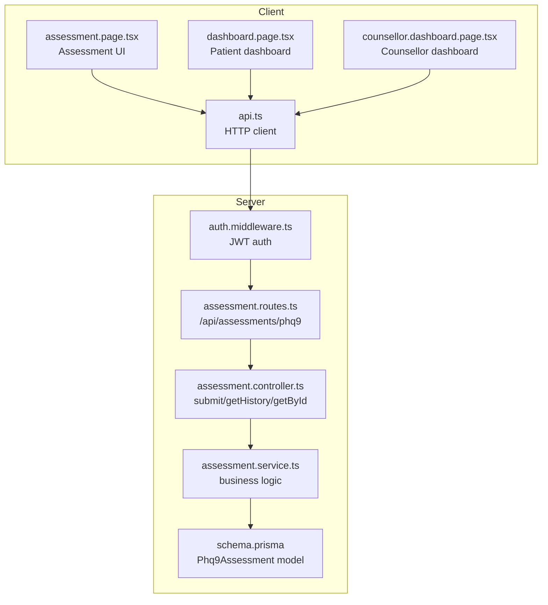
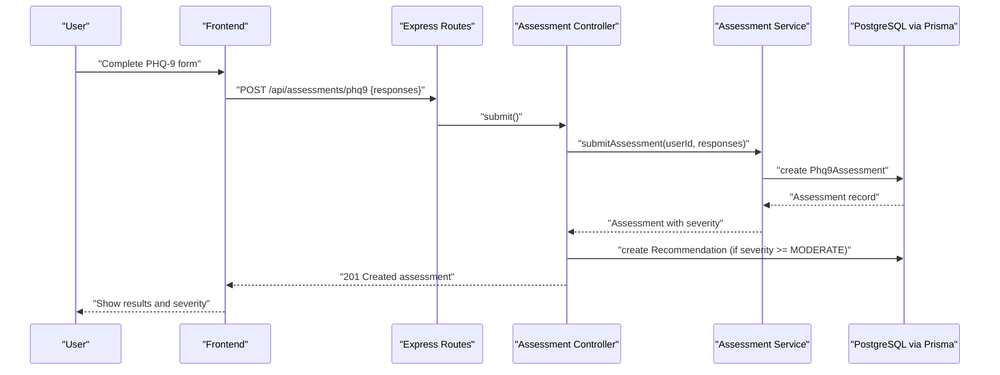
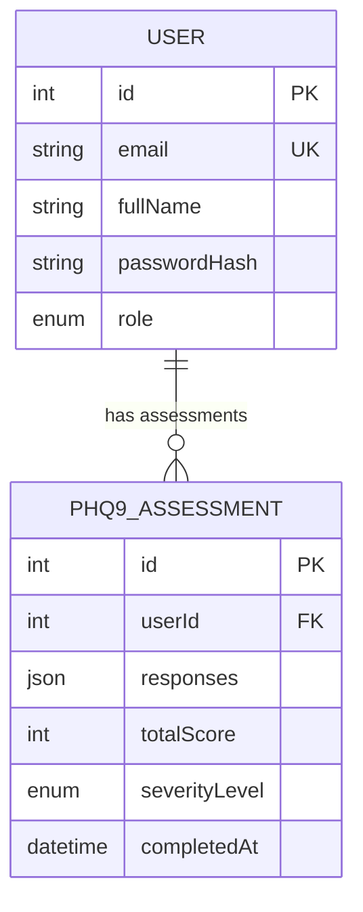
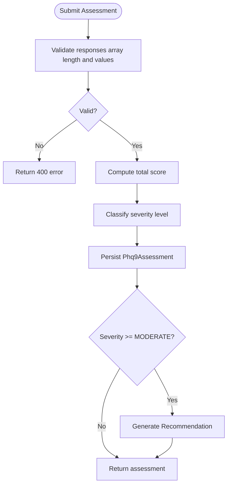
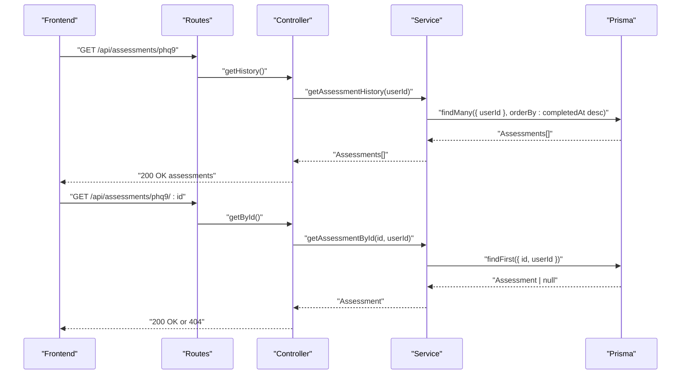
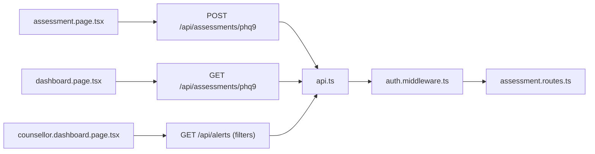
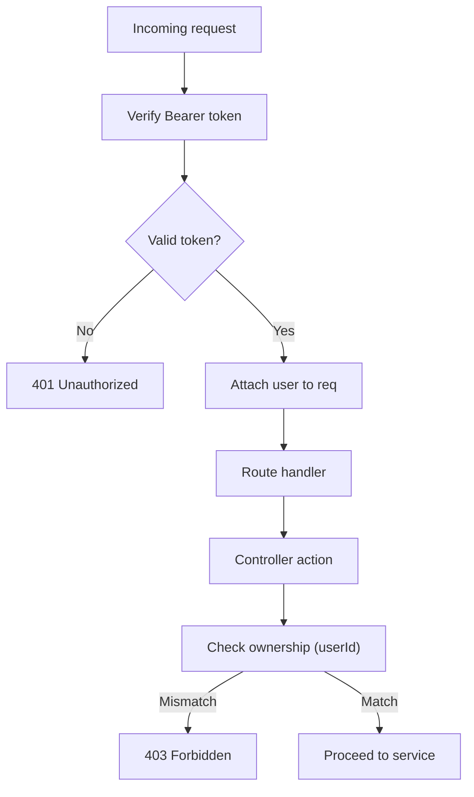
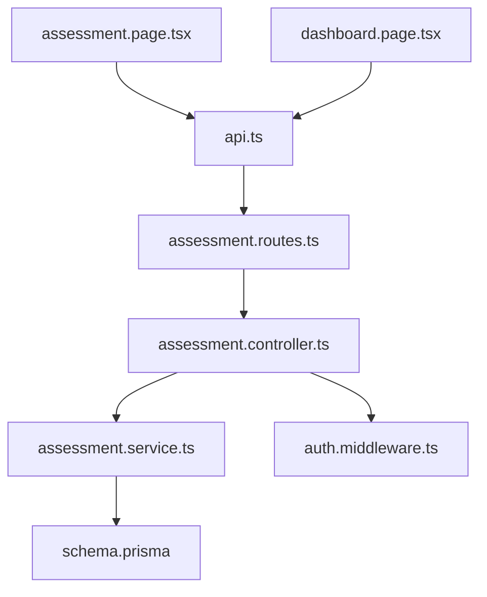

# Assessment History Tracking

<cite>
**Referenced Files in This Document**
- [assessment.controller.ts](file://server/src/controllers/assessment.controller.ts)
- [assessment.service.ts](file://server/src/services/assessment.service.ts)
- [assessment.routes.ts](file://server/src/routes/assessment.routes.ts)
- [schema.prisma](file://prisma/schema.prisma)
- [api.ts](file://client/src/lib/api.ts)
- [assessment.page.tsx](file://client/src/app/assessment/page.tsx)
- [dashboard.page.tsx](file://client/src/app/dashboard/page.tsx)
- [counsellor.dashboard.page.tsx](file://client/src/app/counsellor/dashboard/page.tsx)
- [auth.middleware.ts](file://server/src/middleware/auth.ts)
- [token.utils.ts](file://server/src/utils/token.ts)
- [assessment.service.test.ts](file://server/src/__tests__/assessment.test.ts)
</cite>

## Table of Contents
1. [Introduction](#introduction)
2. [Project Structure](#project-structure)
3. [Core Components](#core-components)
4. [Architecture Overview](#architecture-overview)
5. [Detailed Component Analysis](#detailed-component-analysis)
6. [Dependency Analysis](#dependency-analysis)
7. [Performance Considerations](#performance-considerations)
8. [Troubleshooting Guide](#troubleshooting-guide)
9. [Conclusion](#conclusion)

## Introduction
This document describes the PHQ-9 assessment history tracking system within the BuddyAI platform. It covers how assessment records are created, persisted, retrieved, and viewed, along with mechanisms for generating recommendations based on severity thresholds. The system integrates with the patient dashboard to surface the latest assessment results and supports counsellor workflows through risk alert generation. Privacy and authentication are enforced via JWT-based middleware, and the backend uses Prisma ORM with PostgreSQL for data persistence.

## Project Structure
The assessment history tracking spans three primary areas:
- Backend API and persistence: Express controllers, services, routes, and Prisma schema
- Frontend integration: Patient assessment UI and dashboard widgets
- Authentication and authorization: Middleware and token utilities

**Diagram sources**
- [assessment.routes.ts:1-12](file://server/src/routes/assessment.routes.ts#L1-L12)
- [assessment.controller.ts:1-74](file://server/src/controllers/assessment.controller.ts#L1-L74)
- [assessment.service.ts:1-89](file://server/src/services/assessment.service.ts#L1-L89)
- [schema.prisma:97-108](file://prisma/schema.prisma#L97-L108)
- [api.ts:1-36](file://client/src/lib/api.ts#L1-L36)

**Section sources**
- [assessment.controller.ts:1-74](file://server/src/controllers/assessment.controller.ts#L1-L74)
- [assessment.service.ts:1-89](file://server/src/services/assessment.service.ts#L1-L89)
- [assessment.routes.ts:1-12](file://server/src/routes/assessment.routes.ts#L1-L12)
- [schema.prisma:97-108](file://prisma/schema.prisma#L97-L108)
- [api.ts:1-36](file://client/src/lib/api.ts#L1-L36)
- [assessment.page.tsx:1-192](file://client/src/app/assessment/page.tsx#L1-L192)
- [dashboard.page.tsx:1-206](file://client/src/app/dashboard/page.tsx#L1-L206)
- [counsellor.dashboard.page.tsx:1-213](file://client/src/app/counsellor/dashboard/page.tsx#L1-L213)

## Core Components
- Authentication middleware validates JWT tokens and attaches user context to requests.
- Assessment routes expose endpoints for submitting PHQ-9 responses, retrieving assessment history, and fetching a specific assessment by ID.
- Assessment service encapsulates scoring, severity classification, persistence, and recommendation generation.
- Prisma schema defines the Phq9Assessment model with indexing for efficient lookups.
- Frontend clients consume the API to render assessment forms, show results, and integrate with dashboards.

Key responsibilities:
- Data persistence: Prisma creates Phq9Assessment records with total score and severity level.
- Retrieval: Services fetch all assessments ordered by completion time and single assessment by ID.
- Recommendations: When severity reaches moderate or higher, a recommendation is generated and persisted.
- Privacy: All endpoints require authentication; controllers enforce user ownership for retrieval.

**Section sources**
- [auth.middleware.ts:1-39](file://server/src/middleware/auth.ts#L1-L39)
- [assessment.routes.ts:1-12](file://server/src/routes/assessment.routes.ts#L1-L12)
- [assessment.controller.ts:1-74](file://server/src/controllers/assessment.controller.ts#L1-L74)
- [assessment.service.ts:1-89](file://server/src/services/assessment.service.ts#L1-L89)
- [schema.prisma:97-108](file://prisma/schema.prisma#L97-L108)

## Architecture Overview
The system follows a layered architecture:
- Presentation layer: Next.js pages and API client
- Application layer: Express routes and controllers
- Domain layer: Assessment service with business logic
- Data layer: Prisma ORM with PostgreSQL

**Diagram sources**
- [assessment.routes.ts:7-9](file://server/src/routes/assessment.routes.ts#L7-L9)
- [assessment.controller.ts:5-34](file://server/src/controllers/assessment.controller.ts#L5-L34)
- [assessment.service.ts:20-33](file://server/src/services/assessment.service.ts#L20-L33)
- [schema.prisma:97-108](file://prisma/schema.prisma#L97-L108)

## Detailed Component Analysis

### Assessment Data Model
The Phq9Assessment model stores:
- Responses as JSON for flexible storage of the nine-item scale
- Total score and severity level derived from responses
- Timestamp of completion
- Foreign key relationship to User

**Diagram sources**
- [schema.prisma:47-61](file://prisma/schema.prisma#L47-L61)
- [schema.prisma:97-108](file://prisma/schema.prisma#L97-L108)

**Section sources**
- [schema.prisma:97-108](file://prisma/schema.prisma#L97-L108)

### Assessment Submission Workflow
- Input validation ensures exactly nine integer responses in [0,3].
- Total score computed as the sum of responses.
- Severity classified into five levels based on score ranges.
- Assessment persisted with current timestamp.
- If severity is moderate or higher, a recommendation is generated and stored.

**Diagram sources**
- [assessment.controller.ts:14-33](file://server/src/controllers/assessment.controller.ts#L14-L33)
- [assessment.service.ts:20-33](file://server/src/services/assessment.service.ts#L20-L33)
- [assessment.service.ts:12-18](file://server/src/services/assessment.service.ts#L12-L18)
- [assessment.service.ts:76-88](file://server/src/services/assessment.service.ts#L76-L88)

**Section sources**
- [assessment.controller.ts:5-34](file://server/src/controllers/assessment.controller.ts#L5-L34)
- [assessment.service.ts:20-33](file://server/src/services/assessment.service.ts#L20-L33)
- [assessment.service.ts:12-18](file://server/src/services/assessment.service.ts#L12-L18)
- [assessment.service.ts:76-88](file://server/src/services/assessment.service.ts#L76-L88)

### Assessment History Retrieval
- Retrieve all assessments for the authenticated user.
- Results are ordered by completion time descending to show the most recent first.
- Individual assessment retrieval requires matching the assessment ID and user ID.

**Diagram sources**
- [assessment.routes.ts:8-9](file://server/src/routes/assessment.routes.ts#L8-L9)
- [assessment.controller.ts:36-73](file://server/src/controllers/assessment.controller.ts#L36-L73)
- [assessment.service.ts:35-46](file://server/src/services/assessment.service.ts#L35-L46)

**Section sources**
- [assessment.controller.ts:36-73](file://server/src/controllers/assessment.controller.ts#L36-L73)
- [assessment.service.ts:35-46](file://server/src/services/assessment.service.ts#L35-L46)

### Frontend Integration
- Assessment page collects nine Likert-scale responses and submits them to the backend.
- On successful submission, the result displays total score and severity classification.
- Patient dashboard fetches the latest assessment and displays severity and score prominently.
- Counsellor dashboard surfaces risk alerts; while not directly querying assessment history, it integrates with risk evaluation that considers PHQ-9 scores.

**Diagram sources**
- [assessment.page.tsx:52-73](file://client/src/app/assessment/page.tsx#L52-L73)
- [dashboard.page.tsx:53-63](file://client/src/app/dashboard/page.tsx#L53-L63)
- [counsellor.dashboard.page.tsx:49-58](file://client/src/app/counsellor/dashboard/page.tsx#L49-L58)
- [api.ts:1-36](file://client/src/lib/api.ts#L1-L36)
- [auth.middleware.ts:5-22](file://server/src/middleware/auth.ts#L5-L22)
- [assessment.routes.ts:7-9](file://server/src/routes/assessment.routes.ts#L7-L9)

**Section sources**
- [assessment.page.tsx:1-192](file://client/src/app/assessment/page.tsx#L1-L192)
- [dashboard.page.tsx:1-206](file://client/src/app/dashboard/page.tsx#L1-L206)
- [counsellor.dashboard.page.tsx:1-213](file://client/src/app/counsellor/dashboard/page.tsx#L1-L213)
- [api.ts:1-36](file://client/src/lib/api.ts#L1-L36)

### Privacy and Security
- Authentication: All assessment endpoints are protected by middleware that verifies a Bearer token and decodes user identity.
- Authorization: Controllers verify that requested assessments belong to the authenticated user.
- Token lifecycle: Tokens are signed with a secret and expire after 24 hours; the client stores the token in local storage for subsequent requests.

**Diagram sources**
- [auth.middleware.ts:5-22](file://server/src/middleware/auth.ts#L5-L22)
- [assessment.controller.ts:36-73](file://server/src/controllers/assessment.controller.ts#L36-L73)
- [token.utils.ts:10-16](file://server/src/utils/token.ts#L10-L16)

**Section sources**
- [auth.middleware.ts:1-39](file://server/src/middleware/auth.ts#L1-L39)
- [assessment.controller.ts:36-73](file://server/src/controllers/assessment.controller.ts#L36-L73)
- [token.utils.ts:1-17](file://server/src/utils/token.ts#L1-L17)

## Dependency Analysis
- Controllers depend on services for business logic and on middleware for authentication.
- Services depend on Prisma for database operations and on shared enums/types.
- Routes define endpoint contracts and delegate to controllers.
- Frontend depends on the API client and authentication utilities.

**Diagram sources**
- [assessment.controller.ts:1-74](file://server/src/controllers/assessment.controller.ts#L1-L74)
- [assessment.service.ts:1-89](file://server/src/services/assessment.service.ts#L1-L89)
- [assessment.routes.ts:1-12](file://server/src/routes/assessment.routes.ts#L1-L12)
- [schema.prisma:97-108](file://prisma/schema.prisma#L97-L108)
- [api.ts:1-36](file://client/src/lib/api.ts#L1-L36)

**Section sources**
- [assessment.controller.ts:1-74](file://server/src/controllers/assessment.controller.ts#L1-L74)
- [assessment.service.ts:1-89](file://server/src/services/assessment.service.ts#L1-L89)
- [assessment.routes.ts:1-12](file://server/src/routes/assessment.routes.ts#L1-L12)
- [schema.prisma:97-108](file://prisma/schema.prisma#L97-L108)
- [api.ts:1-36](file://client/src/lib/api.ts#L1-L36)

## Performance Considerations
- Indexing: The Phq9Assessment model includes an index on userId, enabling efficient retrieval of a user's assessment history.
- Sorting: History queries order by completedAt descending in memory; consider adding an index on completedAt if the dataset grows large.
- Pagination: For extensive histories, introduce pagination parameters to limit returned records per request.
- Query optimization: Use Prisma's built-in query optimization and avoid N+1 selects by fetching related data in a single query if extended views are needed.
- Caching: Cache frequently accessed latest assessment results on the client to reduce redundant network calls.

**Section sources**
- [schema.prisma:107-108](file://prisma/schema.prisma#L107-L108)
- [assessment.service.ts:35-40](file://server/src/services/assessment.service.ts#L35-L40)

## Troubleshooting Guide
Common issues and resolutions:
- Authentication failures: Ensure the Authorization header contains a valid Bearer token. The client removes the token on 401 responses and redirects to login.
- Invalid assessment responses: The controller enforces an array of exactly nine integers within [0,3]; adjust inputs accordingly.
- Access denied: Controllers verify that the requested assessment belongs to the authenticated user; confirm the current user context.
- Recommendation not generated: Recommendations are produced only when severity is moderate or higher; verify severity classification logic.

Operational checks:
- Verify token validity and expiration via token utilities.
- Confirm Prisma model schema matches service expectations.
- Review route definitions to ensure correct endpoint paths.

**Section sources**
- [api.ts:20-26](file://client/src/lib/api.ts#L20-L26)
- [assessment.controller.ts:14-21](file://server/src/controllers/assessment.controller.ts#L14-L21)
- [assessment.controller.ts:52-67](file://server/src/controllers/assessment.controller.ts#L52-L67)
- [token.utils.ts:14-16](file://server/src/utils/token.ts#L14-L16)
- [assessment.service.ts:76-88](file://server/src/services/assessment.service.ts#L76-L88)

## Conclusion
The PHQ-9 assessment history tracking system provides a secure, scalable foundation for capturing, storing, and retrieving patient depression severity data. It integrates seamlessly with the patient dashboard to highlight recent results and triggers recommendations for higher-risk cases. With proper indexing, pagination, and caching strategies, the system can efficiently support longitudinal trend analysis and enhance both patient self-monitoring and counsellor oversight.