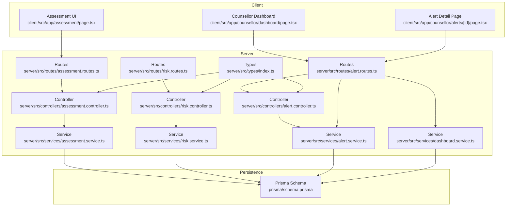
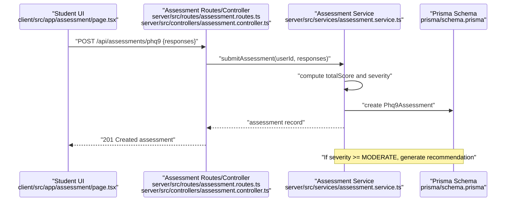
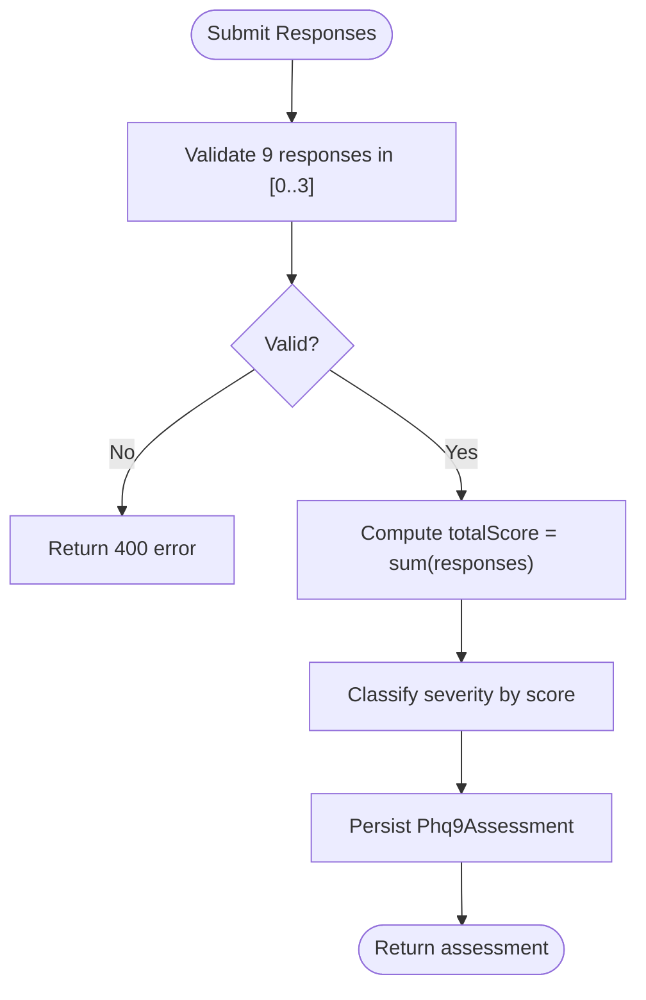
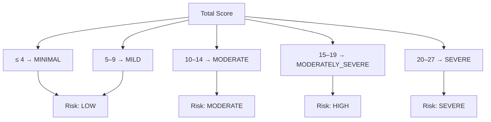
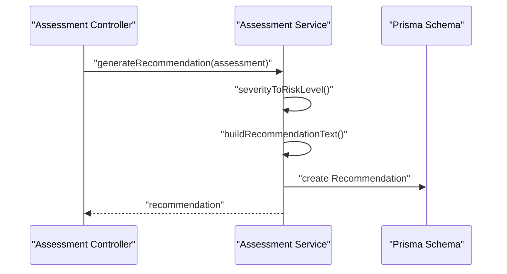
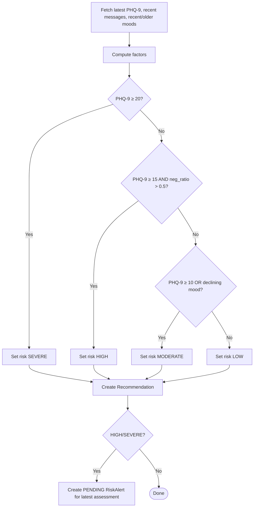
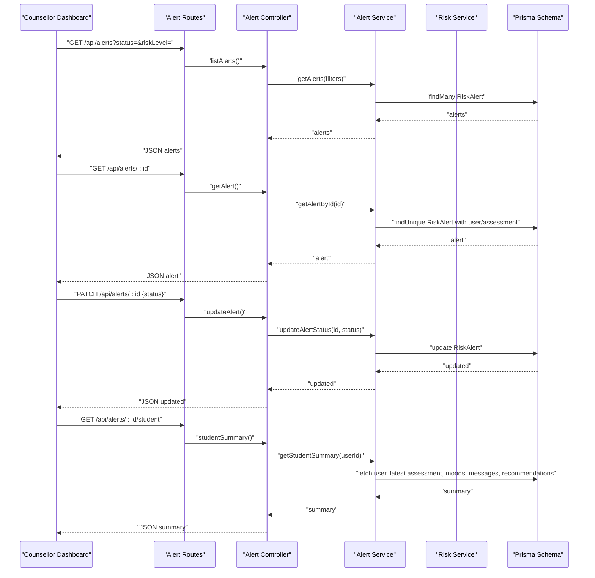
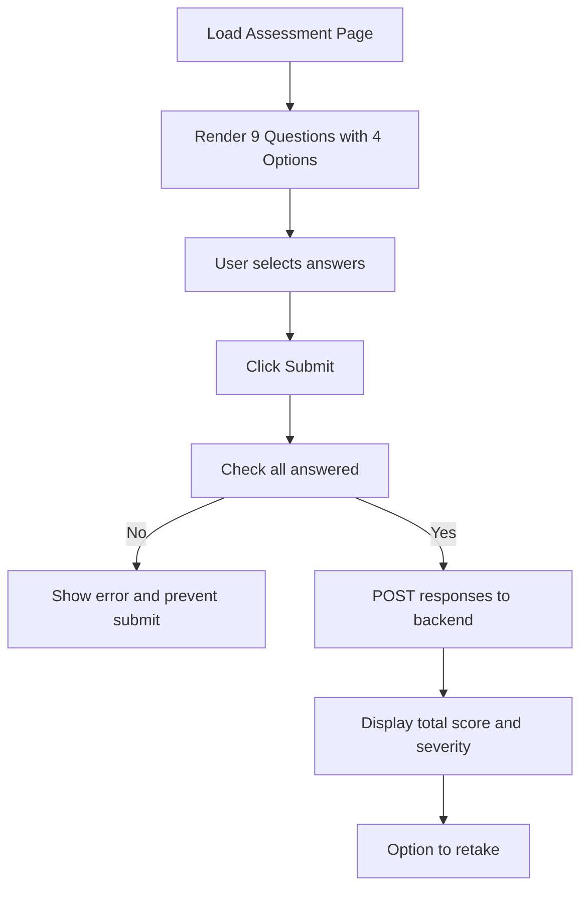
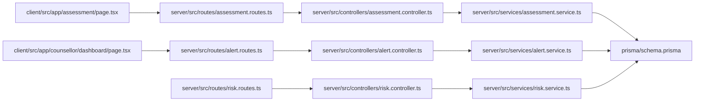
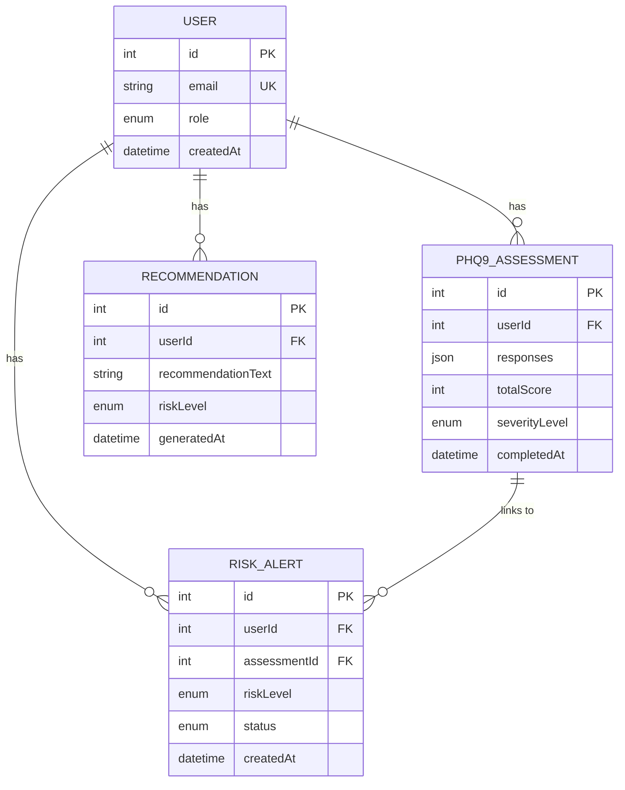

# PHQ-9 Assessment System

<cite>
**Referenced Files in This Document**
- [assessment.controller.ts](file://server/src/controllers/assessment.controller.ts)
- [assessment.service.ts](file://server/src/services/assessment.service.ts)
- [assessment.routes.ts](file://server/src/routes/assessment.routes.ts)
- [page.tsx](file://client/src/app/assessment/page.tsx)
- [schema.prisma](file://prisma/schema.prisma)
- [risk.service.ts](file://server/src/services/risk.service.ts)
- [alert.service.ts](file://server/src/services/alert.service.ts)
- [risk.controller.ts](file://server/src/controllers/risk.controller.ts)
- [alert.controller.ts](file://server/src/controllers/alert.controller.ts)
- [risk.routes.ts](file://server/src/routes/risk.routes.ts)
- [alert.routes.ts](file://server/src/routes/alert.routes.ts)
- [page.tsx](file://client/src/app/counsellor/alerts/[id]/page.tsx)
- [page.tsx](file://client/src/app/counsellor/dashboard/page.tsx)
- [dashboard.controller.ts](file://server/src/controllers/dashboard.controller.ts)
- [dashboard.service.ts](file://server/src/services/dashboard.service.ts)
- [index.ts](file://server/src/types/index.ts)
</cite>

## Table of Contents
1. [Introduction](#introduction)
2. [Project Structure](#project-structure)
3. [Core Components](#core-components)
4. [Architecture Overview](#architecture-overview)
5. [Detailed Component Analysis](#detailed-component-analysis)
6. [Dependency Analysis](#dependency-analysis)
7. [Performance Considerations](#performance-considerations)
8. [Troubleshooting Guide](#troubleshooting-guide)
9. [Conclusion](#conclusion)
10. [Appendices](#appendices)

## Introduction
This document describes the PHQ-9 (Patient Health Questionnaire-9) assessment system for clinical depression screening within the BuddyAI platform. It covers the questionnaire presentation, response collection, automated scoring and severity classification, assessment history tracking, result interpretation, and recommendation generation. It also documents the integrated risk alert system that notifies counselors when individuals are identified as HIGH or SEVERE risk, along with the user interfaces for assessment administration, progress tracking, and result display.

## Project Structure
The PHQ-9 system spans the client-side Next.js application and the server-side Express API with Prisma ORM. Key areas include:
- Client assessment UI for students
- Assessment submission and retrieval endpoints
- Assessment persistence and scoring logic
- Risk evaluation combining PHQ-9 and behavioral signals
- Risk alert creation and counselor dashboard

**Diagram sources**
- [assessment.routes.ts:1-12](file://server/src/routes/assessment.routes.ts#L1-L12)
- [risk.routes.ts:1-11](file://server/src/routes/risk.routes.ts#L1-L11)
- [alert.routes.ts:1-15](file://server/src/routes/alert.routes.ts#L1-L15)
- [assessment.controller.ts:1-74](file://server/src/controllers/assessment.controller.ts#L1-L74)
- [risk.controller.ts:1-32](file://server/src/controllers/risk.controller.ts#L1-L32)
- [alert.controller.ts:1-70](file://server/src/controllers/alert.controller.ts#L1-L70)
- [assessment.service.ts:1-89](file://server/src/services/assessment.service.ts#L1-L89)
- [risk.service.ts:1-138](file://server/src/services/risk.service.ts#L1-L138)
- [alert.service.ts:1-62](file://server/src/services/alert.service.ts#L1-L62)
- [dashboard.service.ts:1-19](file://server/src/services/dashboard.service.ts#L1-L19)
- [schema.prisma:1-134](file://prisma/schema.prisma#L1-L134)
- [index.ts:1-12](file://server/src/types/index.ts#L1-L12)

**Section sources**
- [assessment.routes.ts:1-12](file://server/src/routes/assessment.routes.ts#L1-L12)
- [risk.routes.ts:1-11](file://server/src/routes/risk.routes.ts#L1-L11)
- [alert.routes.ts:1-15](file://server/src/routes/alert.routes.ts#L1-L15)
- [assessment.controller.ts:1-74](file://server/src/controllers/assessment.controller.ts#L1-L74)
- [risk.controller.ts:1-32](file://server/src/controllers/risk.controller.ts#L1-L32)
- [alert.controller.ts:1-70](file://server/src/controllers/alert.controller.ts#L1-L70)
- [assessment.service.ts:1-89](file://server/src/services/assessment.service.ts#L1-L89)
- [risk.service.ts:1-138](file://server/src/services/risk.service.ts#L1-L138)
- [alert.service.ts:1-62](file://server/src/services/alert.service.ts#L1-L62)
- [dashboard.service.ts:1-19](file://server/src/services/dashboard.service.ts#L1-L19)
- [schema.prisma:1-134](file://prisma/schema.prisma#L1-L134)
- [index.ts:1-12](file://server/src/types/index.ts#L1-L12)

## Core Components
- Assessment controller validates responses, submits to service, and conditionally generates recommendations for moderate or higher severity.
- Assessment service computes total score, severity level, persists assessment, and creates recommendations with risk levels.
- Client assessment page renders PHQ-9 questions, collects radio button responses, enforces completeness, and displays results with severity classification.
- Risk service evaluates risk combining PHQ-9 score, recent negative sentiment ratio, and mood trends; stores recommendations and creates risk alerts for HIGH/SEVERE.
- Alert service manages listing, updating, and retrieving alert details and student summaries for counselors.
- Counselor dashboard and alert detail pages present risk alerts, statuses, and student summaries for triage and action.

**Section sources**
- [assessment.controller.ts:5-34](file://server/src/controllers/assessment.controller.ts#L5-L34)
- [assessment.service.ts:20-33](file://server/src/services/assessment.service.ts#L20-L33)
- [page.tsx:33-192](file://client/src/app/assessment/page.tsx#L33-L192)
- [risk.service.ts:11-107](file://server/src/services/risk.service.ts#L11-L107)
- [alert.service.ts:3-33](file://server/src/services/alert.service.ts#L3-L33)
- [page.tsx:28-213](file://client/src/app/counsellor/dashboard/page.tsx#L28-L213)
- [page.tsx:34-246](file://client/src/app/counsellor/alerts/[id]/page.tsx#L34-L246)

## Architecture Overview
The PHQ-9 workflow integrates three primary flows:
- Student assessment submission and result display
- Automated risk evaluation and recommendation generation
- Risk alert creation and counselor triage

**Diagram sources**
- [assessment.routes.ts:7-9](file://server/src/routes/assessment.routes.ts#L7-L9)
- [assessment.controller.ts:5-34](file://server/src/controllers/assessment.controller.ts#L5-L34)
- [assessment.service.ts:20-33](file://server/src/services/assessment.service.ts#L20-L33)
- [schema.prisma:97-108](file://prisma/schema.prisma#L97-L108)

## Detailed Component Analysis

### Assessment Submission and Scoring
- Validation ensures exactly nine integer responses within [0,3].
- Total score is computed as the sum of responses.
- Severity classification follows standard PHQ-9 thresholds:
  - Minimal: 0–4
  - Mild: 5–9
  - Moderate: 10–14
  - Moderately Severe: 15–19
  - Severe: 20–27
- Persistence stores responses, total score, and severity level with timestamps.

**Diagram sources**
- [assessment.controller.ts:14-21](file://server/src/controllers/assessment.controller.ts#L14-L21)
- [assessment.service.ts:20-33](file://server/src/services/assessment.service.ts#L20-L33)
- [assessment.service.ts:12-18](file://server/src/services/assessment.service.ts#L12-L18)

**Section sources**
- [assessment.controller.ts:14-21](file://server/src/controllers/assessment.controller.ts#L14-L21)
- [assessment.service.ts:20-33](file://server/src/services/assessment.service.ts#L20-L33)
- [assessment.service.ts:12-18](file://server/src/services/assessment.service.ts#L12-L18)

### Severity Classification and Risk Mapping
- Severity levels are mapped to risk levels for alerting:
  - MINIMAL/MILD → LOW
  - MODERATE → MODERATE
  - MODERATELY_SEVERE → HIGH
  - SEVERE → SEVERE

**Diagram sources**
- [assessment.service.ts:12-18](file://server/src/services/assessment.service.ts#L12-L18)
- [assessment.service.ts:48-61](file://server/src/services/assessment.service.ts#L48-L61)

**Section sources**
- [assessment.service.ts:48-61](file://server/src/services/assessment.service.ts#L48-L61)

### Recommendation Generation
- For MODERATE, MODERATELY_SEVERE, or SEVERE severity, a recommendation is created with associated risk level and stored in the database.

**Diagram sources**
- [assessment.controller.ts:25-28](file://server/src/controllers/assessment.controller.ts#L25-L28)
- [assessment.service.ts:76-88](file://server/src/services/assessment.service.ts#L76-L88)
- [schema.prisma:110-119](file://prisma/schema.prisma#L110-L119)

**Section sources**
- [assessment.controller.ts:25-28](file://server/src/controllers/assessment.controller.ts#L25-L28)
- [assessment.service.ts:63-74](file://server/src/services/assessment.service.ts#L63-L74)
- [assessment.service.ts:76-88](file://server/src/services/assessment.service.ts#L76-L88)

### Risk Evaluation and Alert Creation
- Risk evaluation considers:
  - Latest PHQ-9 total score
  - Negative sentiment ratio among recent user messages
  - Recent vs. older mood averages
- Rules:
  - Score ≥ 20 → SEVERE
  - Score ≥ 15 AND negative sentiment ratio > 0.5 → HIGH
  - Score ≥ 10 OR declining mood trend → MODERATE
  - Otherwise → LOW
- On HIGH/SEVERE, a recommendation is stored and a PENDING risk alert is created for the latest assessment (deduplicated).

**Diagram sources**
- [risk.service.ts:11-107](file://server/src/services/risk.service.ts#L11-L107)
- [schema.prisma:121-133](file://prisma/schema.prisma#L121-L133)

**Section sources**
- [risk.service.ts:11-107](file://server/src/services/risk.service.ts#L11-L107)

### Counselor Alert System
- Routes restrict to authenticated counselors for alert management.
- Counselors can list alerts with filtering, view details, update status, and fetch student summaries including latest PHQ-9, mood averages, sentiment breakdown, and recent recommendations.
- Dashboard aggregates statistics (total alerts, pending, reviewed, resolved) and risk distribution.

**Diagram sources**
- [alert.routes.ts:7-12](file://server/src/routes/alert.routes.ts#L7-L12)
- [alert.controller.ts:5-69](file://server/src/controllers/alert.controller.ts#L5-L69)
- [alert.service.ts:3-61](file://server/src/services/alert.service.ts#L3-L61)
- [risk.service.ts:122-137](file://server/src/services/risk.service.ts#L122-L137)
- [schema.prisma:121-133](file://prisma/schema.prisma#L121-L133)

**Section sources**
- [alert.routes.ts:7-12](file://server/src/routes/alert.routes.ts#L7-L12)
- [alert.controller.ts:5-69](file://server/src/controllers/alert.controller.ts#L5-L69)
- [alert.service.ts:3-61](file://server/src/services/alert.service.ts#L3-L61)
- [risk.controller.ts:5-31](file://server/src/controllers/risk.controller.ts#L5-L31)
- [risk.service.ts:122-137](file://server/src/services/risk.service.ts#L122-L137)

### User Interface for Assessment Administration
- Presents nine PHQ-9 items with four Likert-scale options (0–3).
- Enforces completion before submission.
- Displays total score, severity level, and a general recommendation note for non-MINIMAL results.
- Provides “Retake Assessment” capability.

**Diagram sources**
- [page.tsx:33-192](file://client/src/app/assessment/page.tsx#L33-L192)

**Section sources**
- [page.tsx:33-192](file://client/src/app/assessment/page.tsx#L33-L192)

### Assessment History Tracking
- Students can retrieve previous assessments ordered by completion time.
- Individual assessment details can be fetched by ID.

**Section sources**
- [assessment.controller.ts:36-48](file://server/src/controllers/assessment.controller.ts#L36-L48)
- [assessment.service.ts:35-46](file://server/src/services/assessment.service.ts#L35-L46)

### Result Interpretation Guidelines
- Severity levels and descriptions are presented with color-coded badges in the UI.
- Non-MINIMAL results include a general recommendation to speak with a counselor.

**Section sources**
- [page.tsx:75-90](file://client/src/app/assessment/page.tsx#L75-L90)
- [page.tsx:112-118](file://client/src/app/assessment/page.tsx#L112-L118)

### Practical Examples
- Example 1: Total score 12 → Severity MODERATE → Risk MODERATE → Recommendation generated.
- Example 2: Total score 21 → Severity SEVERE → Risk SEVERE → Recommendation generated and PENDING risk alert created.
- Example 3: PHQ-9 score 16 with negative sentiment ratio 0.6 → Risk HIGH → Recommendation generated and PENDING risk alert created.

**Section sources**
- [assessment.service.ts:63-74](file://server/src/services/assessment.service.ts#L63-L74)
- [risk.service.ts:87-104](file://server/src/services/risk.service.ts#L87-L104)

## Dependency Analysis
- Controllers depend on services for business logic.
- Services depend on Prisma for data access.
- Routes define endpoint contracts and apply authentication middleware.
- Client pages consume server endpoints via an API abstraction.

**Diagram sources**
- [assessment.routes.ts:1-12](file://server/src/routes/assessment.routes.ts#L1-L12)
- [assessment.controller.ts:1-74](file://server/src/controllers/assessment.controller.ts#L1-L74)
- [assessment.service.ts:1-89](file://server/src/services/assessment.service.ts#L1-L89)
- [alert.routes.ts:1-15](file://server/src/routes/alert.routes.ts#L1-L15)
- [alert.controller.ts:1-70](file://server/src/controllers/alert.controller.ts#L1-L70)
- [alert.service.ts:1-62](file://server/src/services/alert.service.ts#L1-L62)
- [risk.routes.ts:1-11](file://server/src/routes/risk.routes.ts#L1-L11)
- [risk.controller.ts:1-32](file://server/src/controllers/risk.controller.ts#L1-L32)
- [risk.service.ts:1-138](file://server/src/services/risk.service.ts#L1-L138)
- [schema.prisma:1-134](file://prisma/schema.prisma#L1-L134)

**Section sources**
- [assessment.controller.ts:1-74](file://server/src/controllers/assessment.controller.ts#L1-L74)
- [assessment.service.ts:1-89](file://server/src/services/assessment.service.ts#L1-L89)
- [alert.controller.ts:1-70](file://server/src/controllers/alert.controller.ts#L1-L70)
- [alert.service.ts:1-62](file://server/src/services/alert.service.ts#L1-L62)
- [risk.controller.ts:1-32](file://server/src/controllers/risk.controller.ts#L1-L32)
- [risk.service.ts:1-138](file://server/src/services/risk.service.ts#L1-L138)
- [schema.prisma:1-134](file://prisma/schema.prisma#L1-L134)

## Performance Considerations
- Batch queries in dashboard and alert services reduce round-trips.
- Indexes on foreign keys and frequently queried fields improve lookup performance.
- Recommendation and alert creation occur after initial assessment submission to avoid blocking the main path.

## Troubleshooting Guide
- Authentication errors: Controllers check for an authenticated user and return 401 if missing.
- Validation errors: Assessment controller rejects malformed responses with 400.
- Not found errors: Retrieving assessments or alerts returns 404 when resources are absent.
- Status updates: Alert status patch requires valid status values.

Common checks:
- Ensure responses array length equals nine and values are integers in [0,3].
- Verify user authentication before accessing protected endpoints.
- Confirm counselor role for alert management routes.

**Section sources**
- [assessment.controller.ts:7-21](file://server/src/controllers/assessment.controller.ts#L7-L21)
- [assessment.controller.ts:52-67](file://server/src/controllers/assessment.controller.ts#L52-L67)
- [alert.controller.ts:37-40](file://server/src/controllers/alert.controller.ts#L37-L40)
- [alert.controller.ts:22-25](file://server/src/controllers/alert.controller.ts#L22-L25)

## Conclusion
The PHQ-9 assessment system provides a robust, standards-aligned screening tool integrated with risk evaluation and alerting. Students complete a validated nine-item questionnaire, receive immediate feedback, and trigger automated recommendations when indicated. Counselors are notified of HIGH and SEVERE risks through a dedicated alert system, enabling timely intervention and comprehensive student support.

## Appendices

### Data Model Overview

**Diagram sources**
- [schema.prisma:47-133](file://prisma/schema.prisma#L47-L133)

### API Reference

- POST /api/assessments/phq9
  - Description: Submit PHQ-9 responses for scoring and severity classification.
  - Auth: Required
  - Body: { responses: number[] (exactly 9 integers in [0,3]) }
  - Responses:
    - 201 Created: Assessment record with totalScore, severityLevel, and timestamps
    - 400 Bad Request: Validation error
    - 401 Unauthorized: Authentication required

- GET /api/assessments/phq9
  - Description: Retrieve assessment history for the authenticated user.
  - Auth: Required
  - Responses:
    - 200 OK: Array of assessments ordered by completion time

- GET /api/assessments/phq9/:id
  - Description: Retrieve a specific assessment by ID.
  - Auth: Required
  - Responses:
    - 200 OK: Assessment record
    - 404 Not Found: Assessment not found

- POST /api/risk/evaluate
  - Description: Evaluate current risk combining PHQ-9 and behavioral signals.
  - Auth: Required
  - Responses:
    - 200 OK: { riskLevel, factors[], recommendation }

- GET /api/risk/latest
  - Description: Get latest recommendation and alert for the user.
  - Auth: Required
  - Responses:
    - 200 OK: { recommendation, alert }

- GET /api/alerts
  - Description: List alerts (counselor only).
  - Auth: Required, Role: COUNSELLOR
  - Query: status, riskLevel
  - Responses:
    - 200 OK: Array of alerts with user and assessment included

- GET /api/alerts/:id
  - Description: Get alert details (counselor only).
  - Auth: Required, Role: COUNSELLOR
  - Responses:
    - 200 OK: Alert with user and assessment
    - 404 Not Found: Alert not found

- PATCH /api/alerts/:id
  - Description: Update alert status (counselor only).
  - Auth: Required, Role: COUNSELLOR
  - Body: { status: "PENDING" | "REVIEWED" | "RESOLVED" }
  - Responses:
    - 200 OK: Updated alert
    - 400 Bad Request: Invalid status
    - 404 Not Found: Alert not found

- GET /api/alerts/:id/student
  - Description: Get student summary for alert (counselor only).
  - Auth: Required, Role: COUNSELLOR
  - Responses:
    - 200 OK: { user, latestAssessment, moodSummary, sentimentBreakdown, recommendations }

- GET /api/dashboard/stats
  - Description: Get counselor dashboard statistics (counselor only).
  - Auth: Required, Role: COUNSELLOR
  - Responses:
    - 200 OK: { alerts, totalStudents, riskDistribution }

**Section sources**
- [assessment.routes.ts:7-9](file://server/src/routes/assessment.routes.ts#L7-L9)
- [risk.routes.ts:7-8](file://server/src/routes/risk.routes.ts#L7-L8)
- [alert.routes.ts:9-12](file://server/src/routes/alert.routes.ts#L9-L12)
- [dashboard.controller.ts:5-12](file://server/src/controllers/dashboard.controller.ts#L5-L12)
- [assessment.controller.ts:5-34](file://server/src/controllers/assessment.controller.ts#L5-L34)
- [risk.controller.ts:5-31](file://server/src/controllers/risk.controller.ts#L5-L31)
- [alert.controller.ts:5-69](file://server/src/controllers/alert.controller.ts#L5-L69)
- [dashboard.service.ts:3-18](file://server/src/services/dashboard.service.ts#L3-L18)

### Privacy and Security Notes
- Authentication middleware protects all assessment and risk endpoints.
- Counselor-only routes enforce role-based access for alert management.
- Data retention and deletion policies should align with institutional privacy requirements; the schema supports user-centric records but does not define retention rules.