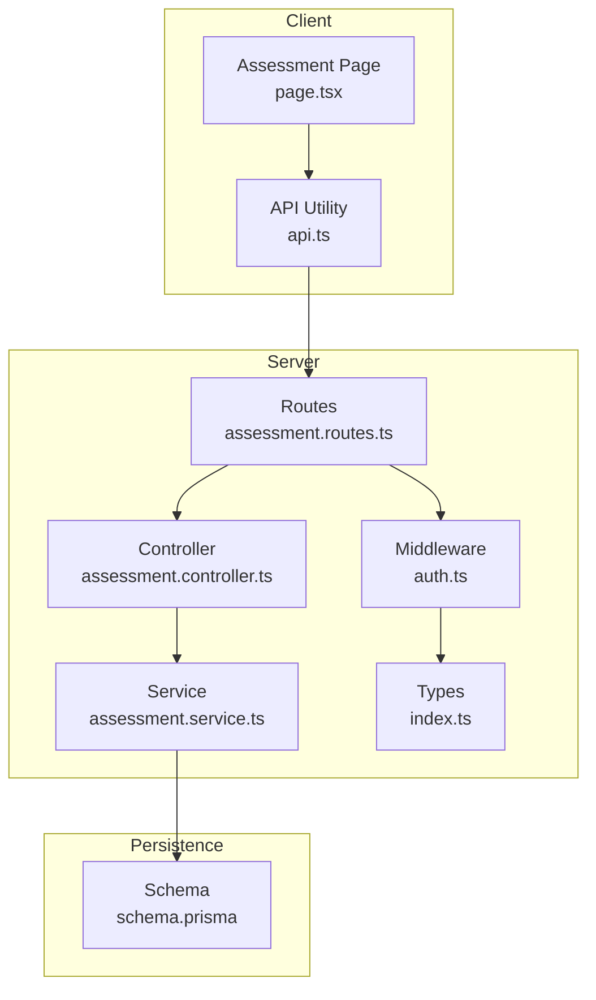
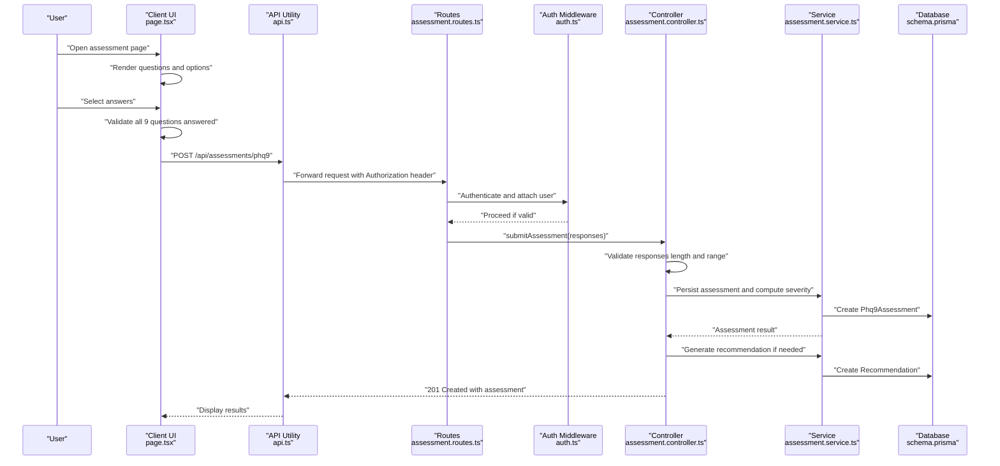
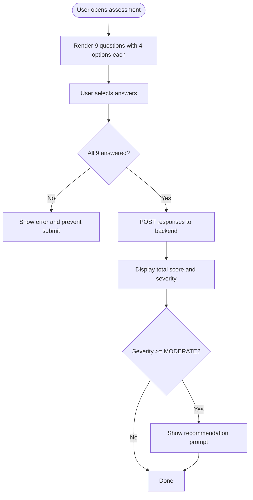
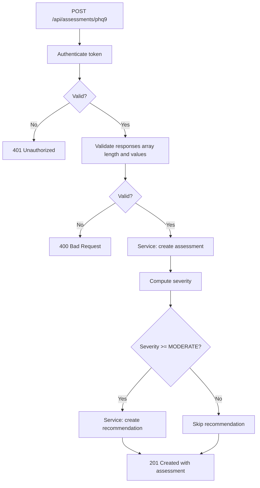
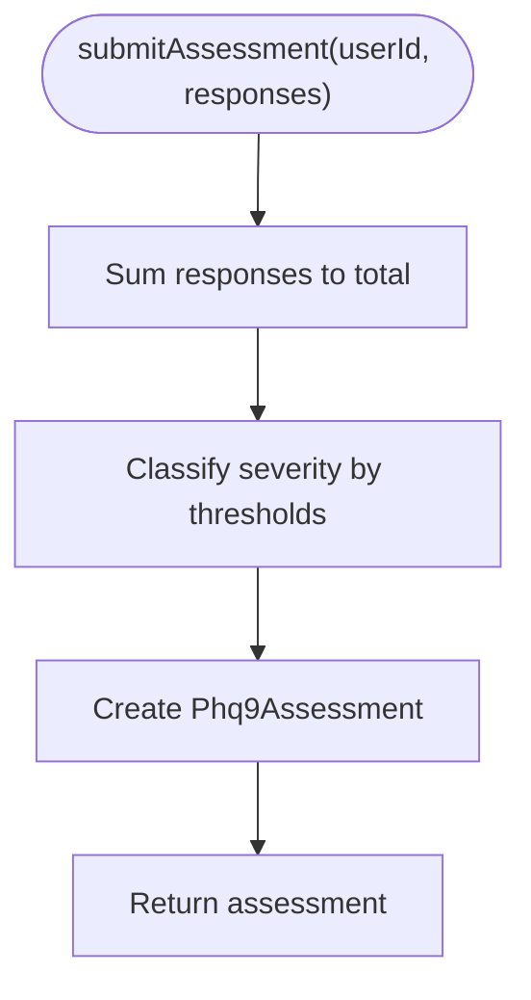
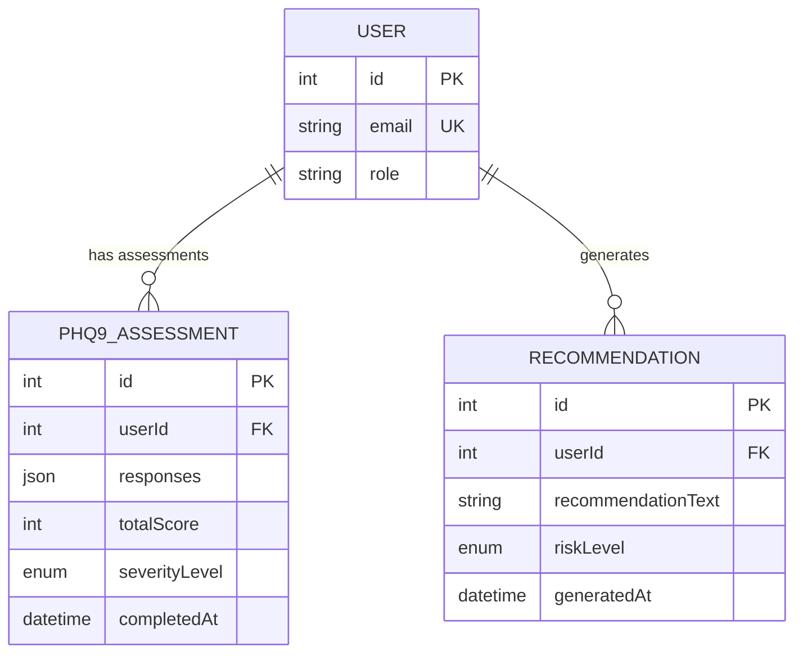
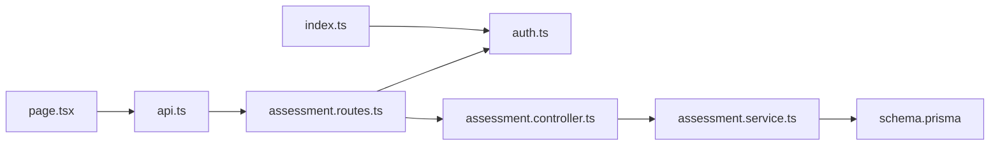

# Questionnaire Management

<cite>
**Referenced Files in This Document**
- [assessment.controller.ts](file://server/src/controllers/assessment.controller.ts)
- [assessment.service.ts](file://server/src/services/assessment.service.ts)
- [assessment.routes.ts](file://server/src/routes/assessment.routes.ts)
- [auth.ts](file://server/src/middleware/auth.ts)
- [page.tsx](file://client/src/app/assessment/page.tsx)
- [api.ts](file://client/src/lib/api.ts)
- [schema.prisma](file://prisma/schema.prisma)
- [assessment.test.ts](file://server/src/__tests__/assessment.test.ts)
- [index.ts](file://server/src/types/index.ts)
</cite>

## Table of Contents
1. [Introduction](#introduction)
2. [Project Structure](#project-structure)
3. [Core Components](#core-components)
4. [Architecture Overview](#architecture-overview)
5. [Detailed Component Analysis](#detailed-component-analysis)
6. [Dependency Analysis](#dependency-analysis)
7. [Performance Considerations](#performance-considerations)
8. [Troubleshooting Guide](#troubleshooting-guide)
9. [Conclusion](#conclusion)

## Introduction
This document describes the PHQ-9 questionnaire management system, a nine-question clinical interview designed to assess depressive symptoms over the past two weeks. The system captures responses for the following domains: sleep disturbances, appetite changes, fatigue/energy loss, concentration difficulties, depressed mood, feelings of worthlessness, suicidal ideation, restlessness or psychomotor changes, and overall sadness. Responses are scored on a 0–3 scale, with total scores mapped to severity categories and automatic recommendations generated for moderate or higher severity levels.

## Project Structure
The PHQ-9 implementation spans a Next.js frontend and an Express backend with Prisma ORM. The frontend renders the questionnaire, collects responses, validates completeness, and submits to the backend. The backend authenticates requests, validates input, computes severity, persists results, and conditionally generates recommendations.

**Diagram sources**
- [assessment.routes.ts:1-12](file://server/src/routes/assessment.routes.ts#L1-L12)
- [assessment.controller.ts:1-74](file://server/src/controllers/assessment.controller.ts#L1-L74)
- [assessment.service.ts:1-89](file://server/src/services/assessment.service.ts#L1-L89)
- [auth.ts:1-39](file://server/src/middleware/auth.ts#L1-L39)
- [page.tsx:1-192](file://client/src/app/assessment/page.tsx#L1-L192)
- [api.ts:1-36](file://client/src/lib/api.ts#L1-L36)
- [schema.prisma:1-134](file://prisma/schema.prisma#L1-L134)
- [index.ts:1-12](file://server/src/types/index.ts#L1-L12)

**Section sources**
- [assessment.routes.ts:1-12](file://server/src/routes/assessment.routes.ts#L1-L12)
- [assessment.controller.ts:1-74](file://server/src/controllers/assessment.controller.ts#L1-L74)
- [assessment.service.ts:1-89](file://server/src/services/assessment.service.ts#L1-L89)
- [auth.ts:1-39](file://server/src/middleware/auth.ts#L1-L39)
- [page.tsx:1-192](file://client/src/app/assessment/page.tsx#L1-L192)
- [api.ts:1-36](file://client/src/lib/api.ts#L1-L36)
- [schema.prisma:1-134](file://prisma/schema.prisma#L1-L134)
- [index.ts:1-12](file://server/src/types/index.ts#L1-L12)

## Core Components
- Frontend questionnaire page:
  - Presents nine questions in order with four Likert-style options (0–3).
  - Tracks responses locally and enforces completion before submission.
  - Displays results with severity classification and optional recommendation messaging.
- Backend controller:
  - Validates authentication, ensures exactly nine numeric responses in [0,3].
  - Delegates persistence and severity classification to the service layer.
  - Generates recommendations for moderate or higher severity automatically.
- Service layer:
  - Computes total score and severity level.
  - Persists assessment and optionally creates a recommendation record.
- Database schema:
  - Stores PHQ-9 responses as JSON, total score, severity level, and timestamps.
  - Links assessments to users and supports recommendation and risk alert associations.

**Section sources**
- [page.tsx:8-192](file://client/src/app/assessment/page.tsx#L8-L192)
- [assessment.controller.ts:5-34](file://server/src/controllers/assessment.controller.ts#L5-L34)
- [assessment.service.ts:20-33](file://server/src/services/assessment.service.ts#L20-L33)
- [schema.prisma:97-108](file://prisma/schema.prisma#L97-L108)

## Architecture Overview
The PHQ-9 workflow integrates client-side rendering and validation with server-side persistence and severity classification.

**Diagram sources**
- [page.tsx:52-73](file://client/src/app/assessment/page.tsx#L52-L73)
- [api.ts:3-35](file://client/src/lib/api.ts#L3-L35)
- [assessment.routes.ts:7](file://server/src/routes/assessment.routes.ts#L7)
- [auth.ts:5-22](file://server/src/middleware/auth.ts#L5-L22)
- [assessment.controller.ts:5-34](file://server/src/controllers/assessment.controller.ts#L5-L34)
- [assessment.service.ts:20-33](file://server/src/services/assessment.service.ts#L20-L33)
- [schema.prisma:97-108](file://prisma/schema.prisma#L97-L108)

## Detailed Component Analysis

### Frontend: PHQ-9 Questionnaire Interface
- Questions and options:
  - Nine questions presented in fixed order.
  - Four response options: “Not at all” (0), “Several days” (1), “More than half the days” (2), “Nearly every day” (3).
- Response collection and validation:
  - Local state tracks selected values per question.
  - Submission is blocked until all nine questions are answered.
- Result display:
  - Shows total score out of 27 and severity category with color-coded feedback.
  - Provides action to retake the assessment.

**Diagram sources**
- [page.tsx:8-192](file://client/src/app/assessment/page.tsx#L8-L192)

**Section sources**
- [page.tsx:8-192](file://client/src/app/assessment/page.tsx#L8-L192)

### Backend: Controller Validation and Workflow
- Authentication:
  - Requires a valid Bearer token; rejects unauthorized requests.
- Input validation:
  - Ensures exactly nine integer responses within [0,3]; rejects malformed input.
- Persistence and severity:
  - Delegates to service to compute total and severity, persist assessment.
- Automatic recommendation:
  - Triggers recommendation creation when severity is moderate or higher.

**Diagram sources**
- [assessment.controller.ts:5-34](file://server/src/controllers/assessment.controller.ts#L5-L34)
- [assessment.service.ts:20-33](file://server/src/services/assessment.service.ts#L20-L33)

**Section sources**
- [assessment.controller.ts:5-34](file://server/src/controllers/assessment.controller.ts#L5-L34)
- [auth.ts:5-22](file://server/src/middleware/auth.ts#L5-L22)

### Backend: Service Layer Logic
- Severity classification:
  - Total score ≤ 4: MINIMAL
  - 5–9: MILD
  - 10–14: MODERATE
  - 15–19: MODERATELY SEVERE
  - 20–27: SEVERE
- Risk mapping and recommendation building:
  - Maps severity to risk level and constructs recommendation text for moderate/severe cases.
- Persistence:
  - Creates Phq9Assessment with responses, total score, and severity level.

**Diagram sources**
- [assessment.service.ts:20-33](file://server/src/services/assessment.service.ts#L20-L33)

**Section sources**
- [assessment.service.ts:12-18](file://server/src/services/assessment.service.ts#L12-L18)
- [assessment.service.ts:48-88](file://server/src/services/assessment.service.ts#L48-L88)

### Database Schema: PHQ-9 Assessment Storage
- Entity: Phq9Assessment
  - Fields: userId, responses (JSON), totalScore, severityLevel, completedAt
  - Relations: belongs to User; can be linked to RiskAlerts
- Enums: SeverityLevel and RiskLevel used consistently across models
- Indexes: userId for efficient history queries

**Diagram sources**
- [schema.prisma:97-119](file://prisma/schema.prisma#L97-L119)

**Section sources**
- [schema.prisma:97-108](file://prisma/schema.prisma#L97-L108)

### API Endpoints and Request/Response Contracts
- POST /api/assessments/phq9
  - Authentication: Bearer token required
  - Request body: { responses: number[] } where responses.length === 9 and each element ∈ [0,3]
  - Response: 201 Created with assessment object containing totalScore, severityLevel, and completedAt
- GET /api/assessments/phq9
  - Authentication: Bearer token required
  - Response: 200 OK with array of assessments ordered by completion time descending
- GET /api/assessments/phq9/:id
  - Authentication: Bearer token required
  - Response: 200 OK with assessment matching id and userId; 404 if not found

**Section sources**
- [assessment.routes.ts:7-9](file://server/src/routes/assessment.routes.ts#L7-L9)
- [assessment.controller.ts:36-73](file://server/src/controllers/assessment.controller.ts#L36-L73)

### Question Presentation Logic and Scoring
- Question order:
  - Fixed order as defined in the client component.
- Response validation:
  - Client enforces completion before submission.
  - Server enforces array length and value range.
- Scoring:
  - Total score computed as the sum of responses.
  - Severity determined by thresholds.

**Section sources**
- [page.tsx:8-192](file://client/src/app/assessment/page.tsx#L8-L192)
- [assessment.controller.ts:14-21](file://server/src/controllers/assessment.controller.ts#L14-L21)
- [assessment.service.ts:20-33](file://server/src/services/assessment.service.ts#L20-L33)

### Assessment Initiation Workflow
- Authentication:
  - Client checks token presence; redirects unauthenticated users to login.
- Navigation:
  - Users navigate to the assessment page to begin.
- Submission:
  - On successful validation, client posts responses to the backend endpoint.

**Section sources**
- [page.tsx:40-44](file://client/src/app/assessment/page.tsx#L40-L44)
- [api.ts:20-26](file://client/src/lib/api.ts#L20-L26)

### Form Validation Rules
- Client-side:
  - Prevents submission until all nine questions are answered.
- Server-side:
  - Enforces array length equals nine and each value is an integer within [0,3].

**Section sources**
- [page.tsx:56-59](file://client/src/app/assessment/page.tsx#L56-L59)
- [assessment.controller.ts:14-21](file://server/src/controllers/assessment.controller.ts#L14-L21)

### Data Integrity Checks
- Input sanitization:
  - Strict validation on the server prevents malformed submissions.
- Domain constraints:
  - Responses stored as JSON; severity level constrained by enum.
- Access control:
  - Routes require authentication; retrieval filters by userId.

**Section sources**
- [assessment.controller.ts:14-21](file://server/src/controllers/assessment.controller.ts#L14-L21)
- [assessment.controller.ts:57-67](file://server/src/controllers/assessment.controller.ts#L57-L67)
- [assessment.service.ts:42-46](file://server/src/services/assessment.service.ts#L42-L46)

### Examples of Administration and Response Handling
- Example scenario:
  - User completes all nine questions with values in [0,3].
  - Client sends POST with responses array.
  - Server validates, computes severity, persists assessment, and returns assessment object.
  - If severity is moderate or higher, a recommendation is created and associated with the user.
- Boundary testing:
  - Tests cover boundary thresholds for each severity category and confirm correct classification.

**Section sources**
- [assessment.test.ts:24-154](file://server/src/__tests__/assessment.test.ts#L24-L154)

## Dependency Analysis
- Client depends on:
  - API utility for authenticated requests.
  - Authentication state to guard navigation.
- Server depends on:
  - Middleware for authentication.
  - Service layer for business logic.
  - Prisma for database operations.
- Data model relationships:
  - User → Phq9Assessment and Recommendation.
  - Phq9Assessment ↔ RiskAlert via foreign keys.

**Diagram sources**
- [page.tsx:1-192](file://client/src/app/assessment/page.tsx#L1-L192)
- [api.ts:1-36](file://client/src/lib/api.ts#L1-L36)
- [assessment.routes.ts:1-12](file://server/src/routes/assessment.routes.ts#L1-L12)
- [auth.ts:1-39](file://server/src/middleware/auth.ts#L1-L39)
- [assessment.controller.ts:1-74](file://server/src/controllers/assessment.controller.ts#L1-L74)
- [assessment.service.ts:1-89](file://server/src/services/assessment.service.ts#L1-L89)
- [schema.prisma:1-134](file://prisma/schema.prisma#L1-L134)
- [index.ts:1-12](file://server/src/types/index.ts#L1-L12)

**Section sources**
- [assessment.routes.ts:1-12](file://server/src/routes/assessment.routes.ts#L1-L12)
- [assessment.controller.ts:1-74](file://server/src/controllers/assessment.controller.ts#L1-L74)
- [assessment.service.ts:1-89](file://server/src/services/assessment.service.ts#L1-L89)
- [auth.ts:1-39](file://server/src/middleware/auth.ts#L1-L39)
- [page.tsx:1-192](file://client/src/app/assessment/page.tsx#L1-L192)
- [api.ts:1-36](file://client/src/lib/api.ts#L1-L36)
- [schema.prisma:1-134](file://prisma/schema.prisma#L1-L134)
- [index.ts:1-12](file://server/src/types/index.ts#L1-L12)

## Performance Considerations
- Client-side:
  - Minimal DOM updates by managing local state efficiently; radio button selection is O(1) per change.
- Server-side:
  - Single pass summation for total score; constant-time classification.
  - Database writes are single-row inserts with minimal overhead.
- Scalability:
  - Current implementation is read/write bound by user interactions; no heavy loops or joins.

[No sources needed since this section provides general guidance]

## Troubleshooting Guide
- Authentication failures:
  - Missing or invalid Bearer token leads to 401 responses; client clears token and redirects to login.
- Validation errors:
  - Non-array or incorrect-length responses trigger 400 errors with descriptive messages.
  - Values outside [0,3] are rejected.
- Retrieval issues:
  - Invalid assessment ID yields 400; missing assessment yields 404.
- Unexpected severity:
  - Verify total score calculation and thresholds align with expectations.

**Section sources**
- [assessment.controller.ts:7-21](file://server/src/controllers/assessment.controller.ts#L7-L21)
- [assessment.controller.ts:57-67](file://server/src/controllers/assessment.controller.ts#L57-L67)
- [api.ts:20-26](file://client/src/lib/api.ts#L20-L26)

## Conclusion
The PHQ-9 questionnaire management system provides a robust, secure, and user-friendly pathway for assessing depressive symptoms. The frontend offers a clear, validated interface, while the backend enforces strict input validation, computes severity accurately, and persists results with optional recommendations. Together, these components ensure reliable data capture and actionable insights for users and counselors alike.