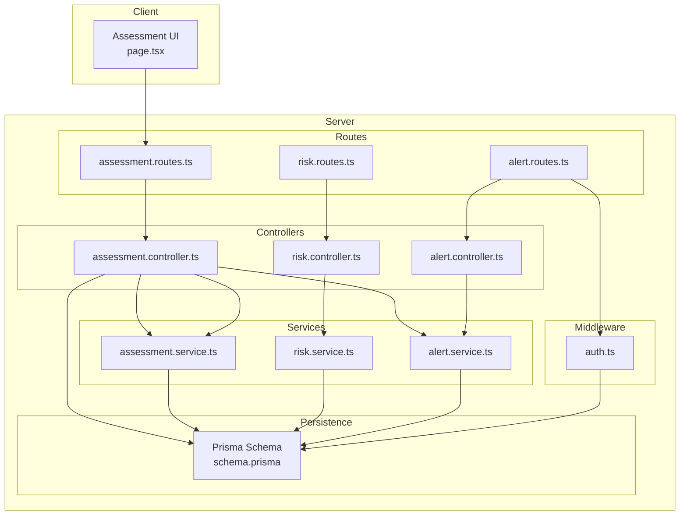
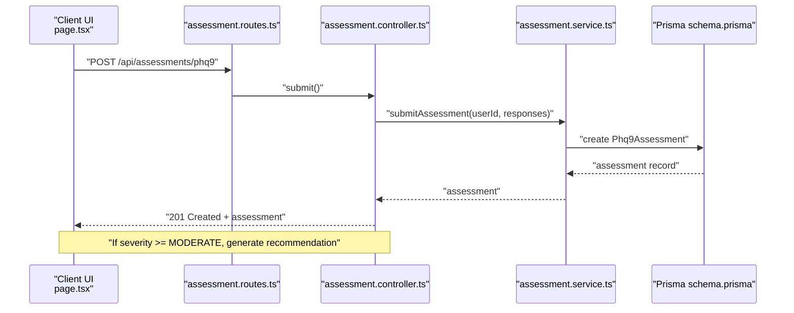
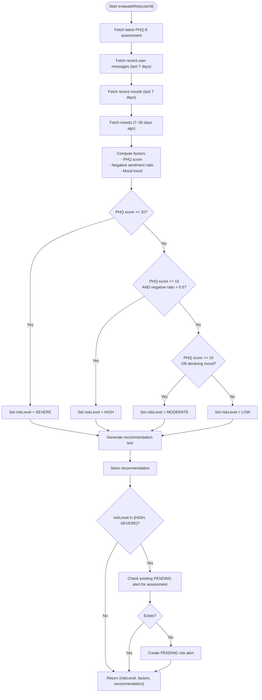
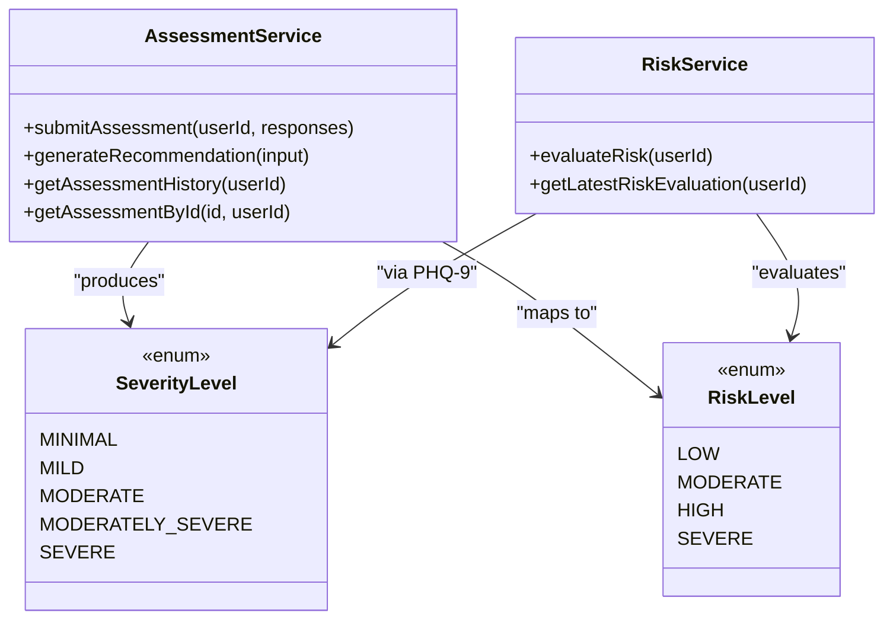
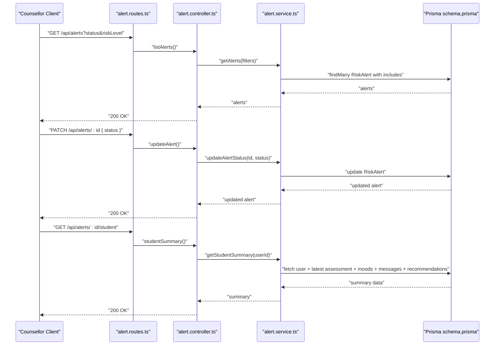
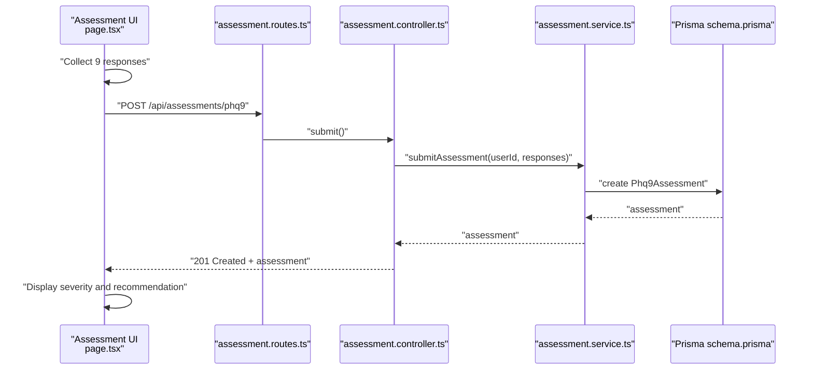
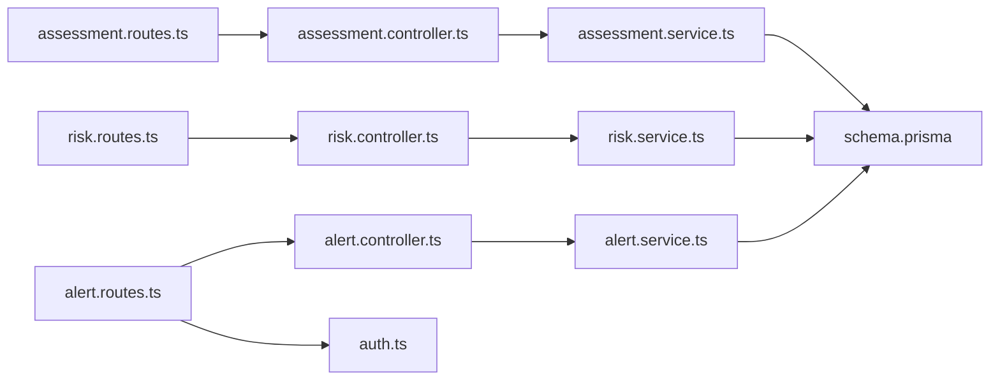
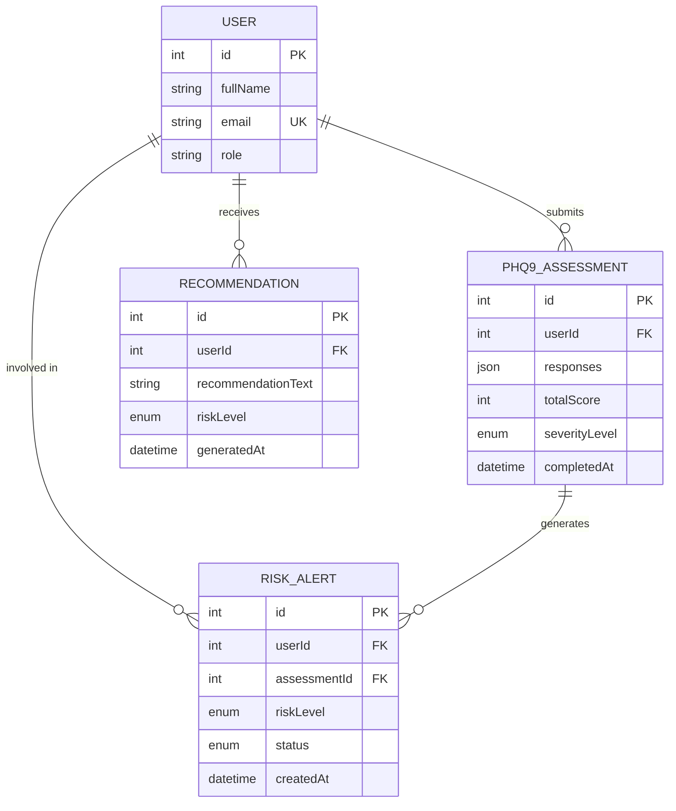

# Risk Assessment Integration

<cite>
**Referenced Files in This Document**
- [risk.service.ts](file://server/src/services/risk.service.ts)
- [risk.controller.ts](file://server/src/controllers/risk.controller.ts)
- [risk.routes.ts](file://server/src/routes/risk.routes.ts)
- [assessment.service.ts](file://server/src/services/assessment.service.ts)
- [assessment.controller.ts](file://server/src/controllers/assessment.controller.ts)
- [assessment.routes.ts](file://server/src/routes/assessment.routes.ts)
- [alert.service.ts](file://server/src/services/alert.service.ts)
- [alert.controller.ts](file://server/src/controllers/alert.controller.ts)
- [alert.routes.ts](file://server/src/routes/alert.routes.ts)
- [auth.ts](file://server/src/middleware/auth.ts)
- [schema.prisma](file://prisma/schema.prisma)
- [page.tsx](file://client/src/app/assessment/page.tsx)
- [risk.test.ts](file://server/src/__tests__/risk.test.ts)
</cite>

## Table of Contents
1. [Introduction](#introduction)
2. [Project Structure](#project-structure)
3. [Core Components](#core-components)
4. [Architecture Overview](#architecture-overview)
5. [Detailed Component Analysis](#detailed-component-analysis)
6. [Dependency Analysis](#dependency-analysis)
7. [Performance Considerations](#performance-considerations)
8. [Troubleshooting Guide](#troubleshooting-guide)
9. [Conclusion](#conclusion)
10. [Appendices](#appendices)

## Introduction
This document describes the PHQ-9 risk assessment integration system, focusing on clinical decision logic for moderate and severe risk categorization, automatic risk alert generation, recommendations for severe cases, and integration with the risk alert management system. It explains severity level mapping to risk categories, escalation procedures, counselor notification workflows, examples of risk assessment triggers, alert generation processes, and clinical intervention protocols. It also documents service layer coordination between assessment and risk management systems, data sharing mechanisms, and audit trail requirements.

## Project Structure
The system spans a client-side Next.js application and a server-side Express application with TypeScript. The server integrates:
- Assessment submission and classification
- Risk evaluation combining PHQ-9 scores, sentiment trends, and mood trends
- Automatic recommendation generation
- Risk alert creation and management
- Counselor access to alerts and student summaries

**Diagram sources**
- [assessment.routes.ts:1-12](file://server/src/routes/assessment.routes.ts#L1-L12)
- [risk.routes.ts:1-11](file://server/src/routes/risk.routes.ts#L1-L11)
- [alert.routes.ts:1-15](file://server/src/routes/alert.routes.ts#L1-L15)
- [assessment.controller.ts:1-74](file://server/src/controllers/assessment.controller.ts#L1-L74)
- [risk.controller.ts:1-32](file://server/src/controllers/risk.controller.ts#L1-L32)
- [alert.controller.ts:1-70](file://server/src/controllers/alert.controller.ts#L1-L70)
- [assessment.service.ts:1-89](file://server/src/services/assessment.service.ts#L1-L89)
- [risk.service.ts:1-138](file://server/src/services/risk.service.ts#L1-L138)
- [alert.service.ts:1-62](file://server/src/services/alert.service.ts#L1-L62)
- [auth.ts:1-39](file://server/src/middleware/auth.ts#L1-L39)
- [schema.prisma:1-134](file://prisma/schema.prisma#L1-L134)
- [page.tsx:1-192](file://client/src/app/assessment/page.tsx#L1-L192)

**Section sources**
- [assessment.routes.ts:1-12](file://server/src/routes/assessment.routes.ts#L1-L12)
- [risk.routes.ts:1-11](file://server/src/routes/risk.routes.ts#L1-L11)
- [alert.routes.ts:1-15](file://server/src/routes/alert.routes.ts#L1-L15)
- [assessment.controller.ts:1-74](file://server/src/controllers/assessment.controller.ts#L1-L74)
- [risk.controller.ts:1-32](file://server/src/controllers/risk.controller.ts#L1-L32)
- [alert.controller.ts:1-70](file://server/src/controllers/alert.controller.ts#L1-L70)
- [assessment.service.ts:1-89](file://server/src/services/assessment.service.ts#L1-L89)
- [risk.service.ts:1-138](file://server/src/services/risk.service.ts#L1-L138)
- [alert.service.ts:1-62](file://server/src/services/alert.service.ts#L1-L62)
- [auth.ts:1-39](file://server/src/middleware/auth.ts#L1-L39)
- [schema.prisma:1-134](file://prisma/schema.prisma#L1-L134)
- [page.tsx:1-192](file://client/src/app/assessment/page.tsx#L1-L192)

## Core Components
- Assessment subsystem: submits PHQ-9 responses, computes total score and severity level, and generates recommendations for moderate/severe cases.
- Risk evaluation subsystem: evaluates risk using PHQ-9, sentiment trends, and mood trends; creates recommendations and risk alerts for HIGH/SEVERE.
- Alert management subsystem: lists, retrieves, updates alert statuses, and provides student summaries for counselors.
- Authorization and roles: enforces authentication and counselor-only access to alert endpoints.

Key responsibilities:
- Severity classification and mapping to risk levels
- Automatic recommendation generation aligned with risk levels
- Risk alert creation with de-duplication per assessment
- Counselor access via filtered alert queries and student summaries

**Section sources**
- [assessment.service.ts:1-89](file://server/src/services/assessment.service.ts#L1-L89)
- [risk.service.ts:1-138](file://server/src/services/risk.service.ts#L1-L138)
- [alert.service.ts:1-62](file://server/src/services/alert.service.ts#L1-L62)
- [auth.ts:1-39](file://server/src/middleware/auth.ts#L1-L39)

## Architecture Overview
The system follows a layered architecture:
- Presentation layer: client UI for PHQ-9 assessment
- API layer: Express routes delegating to controllers
- Business logic layer: services implementing domain logic
- Persistence layer: Prisma ORM models and PostgreSQL

**Diagram sources**
- [assessment.routes.ts:1-12](file://server/src/routes/assessment.routes.ts#L1-L12)
- [assessment.controller.ts:1-74](file://server/src/controllers/assessment.controller.ts#L1-L74)
- [assessment.service.ts:1-89](file://server/src/services/assessment.service.ts#L1-L89)
- [schema.prisma:97-108](file://prisma/schema.prisma#L97-L108)

## Detailed Component Analysis

### Risk Evaluation and Alert Generation
Risk evaluation combines:
- Latest PHQ-9 total score
- Negative sentiment ratio from recent user messages
- Mood trend comparison between recent and older periods

Decision logic:
- Score ≥ 20 → SEVERE
- Score ≥ 15 AND negative sentiment ratio > 0.5 → HIGH
- Score ≥ 10 OR declining mood trend → MODERATE
- Otherwise → LOW

Recommendation text is generated per risk level and stored. For HIGH/SEVERE, a pending risk alert is created only if none exists for the latest assessment.

**Diagram sources**
- [risk.service.ts:11-107](file://server/src/services/risk.service.ts#L11-L107)

**Section sources**
- [risk.service.ts:11-107](file://server/src/services/risk.service.ts#L11-L107)
- [risk.test.ts:68-190](file://server/src/__tests__/risk.test.ts#L68-L190)

### Severity Level Mapping and Escalation
Severity levels and mapping to risk categories:
- MINIMAL/MILD → LOW
- MODERATE → MODERATE
- MODERATELY_SEVERE → HIGH
- SEVERE → SEVERE

Escalation procedures:
- HIGH/SEVERE → automatic risk alert creation (PENDING)
- Alerts reviewed and resolved by counselors
- Student receives tailored recommendation text

**Diagram sources**
- [assessment.service.ts:3-61](file://server/src/services/assessment.service.ts#L3-L61)
- [risk.service.ts:3-107](file://server/src/services/risk.service.ts#L3-L107)
- [schema.prisma:26-45](file://prisma/schema.prisma#L26-L45)

**Section sources**
- [assessment.service.ts:48-61](file://server/src/services/assessment.service.ts#L48-L61)
- [risk.service.ts:56-73](file://server/src/services/risk.service.ts#L56-L73)

### Alert Management and Counselor Workflow
Counselors access alerts via protected routes:
- List alerts with optional filters (status, riskLevel)
- Retrieve individual alert details
- Update alert status (PENDING → REVIEWED → RESOLVED)
- View student summary including latest assessment, recent moods, recent messages, and recommendations

**Diagram sources**
- [alert.routes.ts:1-15](file://server/src/routes/alert.routes.ts#L1-L15)
- [alert.controller.ts:1-70](file://server/src/controllers/alert.controller.ts#L1-L70)
- [alert.service.ts:3-61](file://server/src/services/alert.service.ts#L3-L61)
- [schema.prisma:121-133](file://prisma/schema.prisma#L121-L133)

**Section sources**
- [alert.routes.ts:7-12](file://server/src/routes/alert.routes.ts#L7-L12)
- [alert.controller.ts:5-69](file://server/src/controllers/alert.controller.ts#L5-L69)
- [alert.service.ts:3-61](file://server/src/services/alert.service.ts#L3-L61)

### Client-Side Assessment Experience
The client presents PHQ-9 questions with four Likert-scale options, validates completeness, and displays severity classification and recommendations after submission. Submission is handled via the assessment route.

**Diagram sources**
- [page.tsx:52-73](file://client/src/app/assessment/page.tsx#L52-L73)
- [assessment.routes.ts](file://server/src/routes/assessment.routes.ts#L7)
- [assessment.controller.ts:5-34](file://server/src/controllers/assessment.controller.ts#L5-L34)
- [assessment.service.ts:20-33](file://server/src/services/assessment.service.ts#L20-L33)
- [schema.prisma:97-108](file://prisma/schema.prisma#L97-L108)

**Section sources**
- [page.tsx:1-192](file://client/src/app/assessment/page.tsx#L1-L192)
- [assessment.controller.ts:5-34](file://server/src/controllers/assessment.controller.ts#L5-L34)

## Dependency Analysis
- Controllers depend on services for business logic.
- Services depend on Prisma for persistence.
- Routes depend on controllers.
- Alert routes depend on authentication middleware to enforce counselor-only access.
- Risk evaluation depends on assessment data and messaging/mood history.

**Diagram sources**
- [assessment.routes.ts:1-12](file://server/src/routes/assessment.routes.ts#L1-L12)
- [risk.routes.ts:1-11](file://server/src/routes/risk.routes.ts#L1-L11)
- [alert.routes.ts:1-15](file://server/src/routes/alert.routes.ts#L1-L15)
- [assessment.controller.ts:1-74](file://server/src/controllers/assessment.controller.ts#L1-L74)
- [risk.controller.ts:1-32](file://server/src/controllers/risk.controller.ts#L1-L32)
- [alert.controller.ts:1-70](file://server/src/controllers/alert.controller.ts#L1-L70)
- [assessment.service.ts:1-89](file://server/src/services/assessment.service.ts#L1-L89)
- [risk.service.ts:1-138](file://server/src/services/risk.service.ts#L1-L138)
- [alert.service.ts:1-62](file://server/src/services/alert.service.ts#L1-L62)
- [auth.ts:1-39](file://server/src/middleware/auth.ts#L1-L39)
- [schema.prisma:1-134](file://prisma/schema.prisma#L1-L134)

**Section sources**
- [assessment.controller.ts:1-74](file://server/src/controllers/assessment.controller.ts#L1-L74)
- [risk.controller.ts:1-32](file://server/src/controllers/risk.controller.ts#L1-L32)
- [alert.controller.ts:1-70](file://server/src/controllers/alert.controller.ts#L1-L70)
- [auth.ts:24-38](file://server/src/middleware/auth.ts#L24-L38)

## Performance Considerations
- Risk evaluation performs two separate queries for recent and older mood windows; batching or caching recent mood aggregates could reduce load.
- Alert listing supports filtering; ensure appropriate indexes exist for status and riskLevel filters.
- Recommendation storage is lightweight; consider pagination for counselor dashboards listing many recommendations.
- Authentication middleware verifies tokens; ensure token verification is efficient and cached appropriately.

## Troubleshooting Guide
Common issues and resolutions:
- Authentication failures: Ensure Bearer token is present and valid; unauthorized requests receive 401 responses.
- Access denied for counselors: Alert routes require counselor role; insufficient permissions yield 403.
- Assessment validation errors: Responses must be an array of nine integers from 0 to 3; invalid input yields 400.
- Alert not found: Retrieving or updating a non-existent alert returns 404.
- Duplicate risk alerts: Risk evaluation checks for existing PENDING alerts per assessment and avoids duplication.

**Section sources**
- [auth.ts:5-22](file://server/src/middleware/auth.ts#L5-L22)
- [alert.controller.ts:18-52](file://server/src/controllers/alert.controller.ts#L18-L52)
- [assessment.controller.ts:14-21](file://server/src/controllers/assessment.controller.ts#L14-L21)
- [risk.service.ts:88-104](file://server/src/services/risk.service.ts#L88-L104)

## Conclusion
The PHQ-9 risk assessment integration system provides robust clinical decision logic, automatic risk alert generation for moderate and severe cases, and seamless counselor workflows. It maps severity levels to risk categories, escalates appropriately, and maintains audit trails through persisted recommendations and alerts. The service layer coordinates assessment and risk management while ensuring secure access for counselors.

## Appendices

### Data Models Overview

**Diagram sources**
- [schema.prisma:47-133](file://prisma/schema.prisma#L47-L133)

### Examples of Risk Assessment Triggers and Escalation
- Severe risk: PHQ-9 total score ≥ 20 → SEVERE → automatic PENDING risk alert → counselor notification and review.
- High risk: PHQ-9 total score ≥ 15 AND negative sentiment ratio > 0.5 → HIGH → automatic PENDING risk alert.
- Moderate risk: PHQ-9 total score ≥ 10 OR declining mood trend → MODERATE → recommendation stored; alert created only if severity threshold met in combined evaluation.
- Low risk: otherwise → LOW → no alert; recommendation stored.

**Section sources**
- [risk.service.ts:60-73](file://server/src/services/risk.service.ts#L60-L73)
- [risk.test.ts:69-166](file://server/src/__tests__/risk.test.ts#L69-L166)