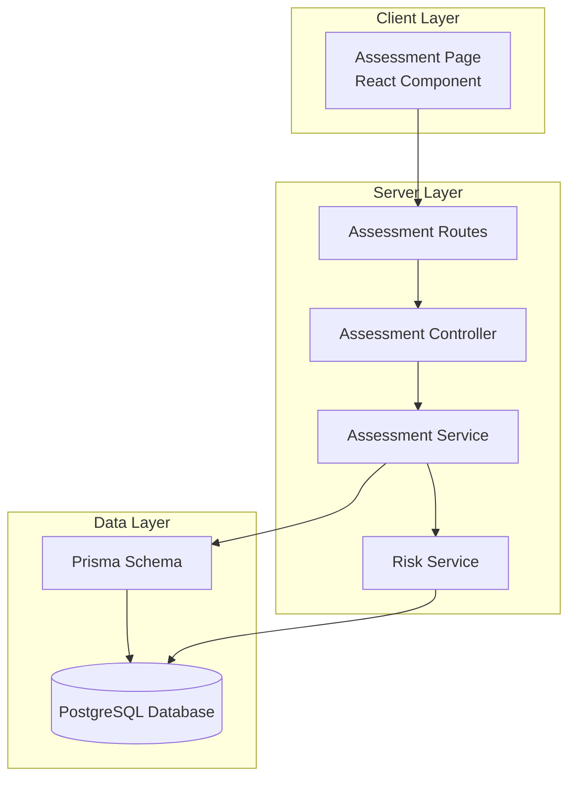
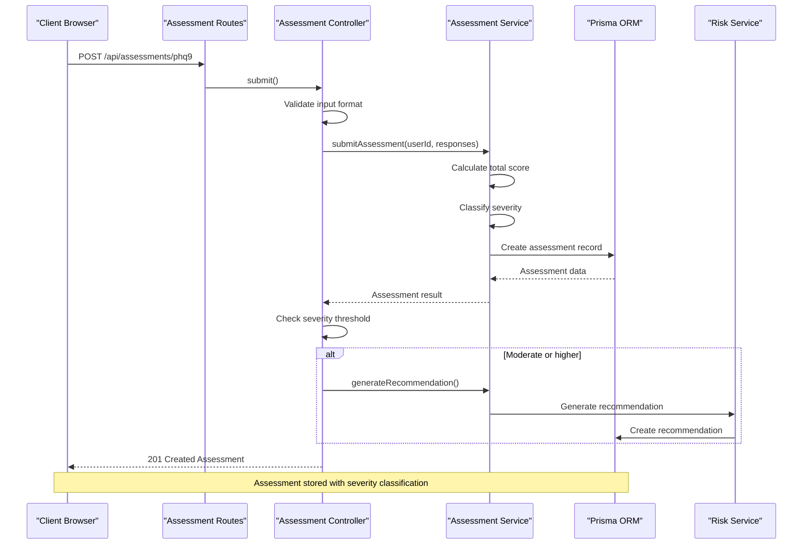
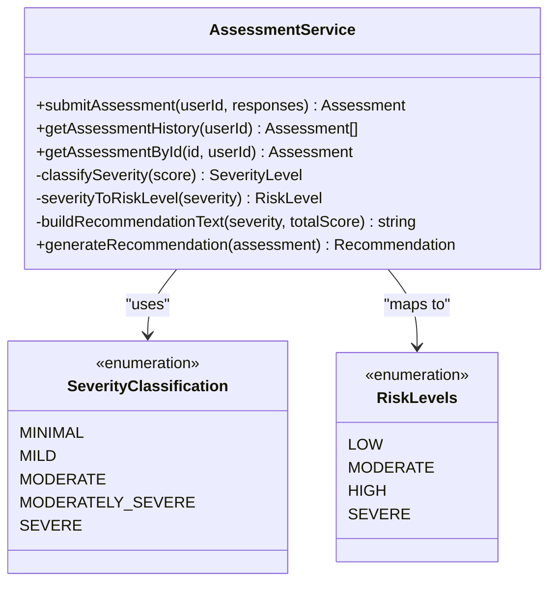
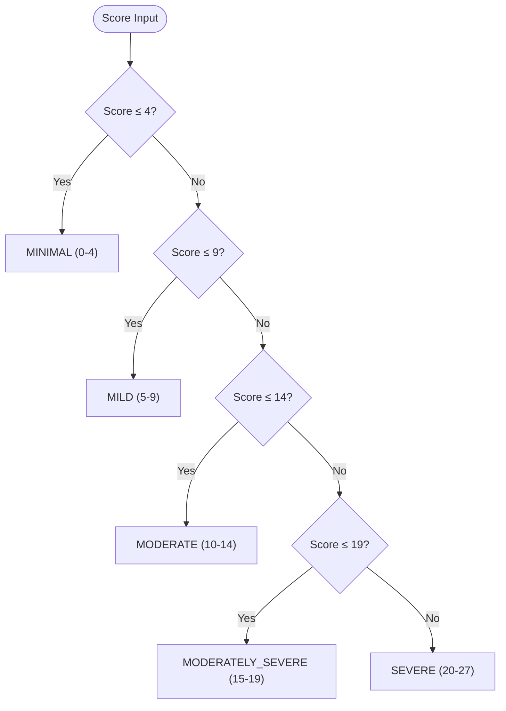
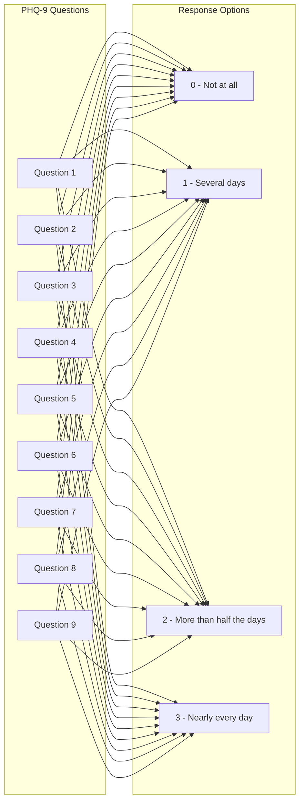
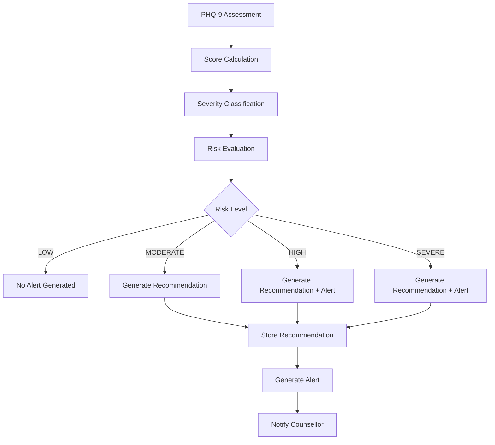
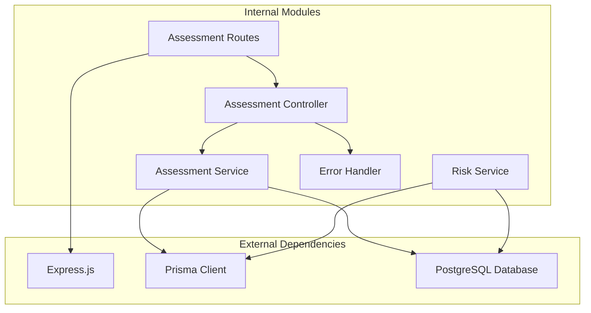

# Scoring Algorithm

<cite>
**Referenced Files in This Document**
- [assessment.service.ts](file://server/src/services/assessment.service.ts)
- [assessment.controller.ts](file://server/src/controllers/assessment.controller.ts)
- [assessment.routes.ts](file://server/src/routes/assessment.routes.ts)
- [assessment.test.ts](file://server/src/__tests__/assessment.test.ts)
- [page.tsx](file://client/src/app/assessment/page.tsx)
- [schema.prisma](file://prisma/schema.prisma)
- [risk.service.ts](file://server/src/services/risk.service.ts)
- [errorHandler.ts](file://server/src/middleware/errorHandler.ts)
</cite>

## Table of Contents
1. [Introduction](#introduction)
2. [Project Structure](#project-structure)
3. [Core Components](#core-components)
4. [Architecture Overview](#architecture-overview)
5. [Detailed Component Analysis](#detailed-component-analysis)
6. [Dependency Analysis](#dependency-analysis)
7. [Performance Considerations](#performance-considerations)
8. [Troubleshooting Guide](#troubleshooting-guide)
9. [Conclusion](#conclusion)

## Introduction
This document provides comprehensive documentation for the PHQ-9 (Patient Health Questionnaire-9) scoring algorithm implementation within the BuddyAI platform. The PHQ-9 is a widely used 9-item depression screening tool that generates a total score ranging from 0-27 points, with automated severity classification and integration with risk assessment workflows.

The implementation follows evidence-based clinical guidelines for depression severity classification and integrates seamlessly with the broader mental health monitoring system, including automated recommendation generation and counsellor alert notifications.

## Project Structure
The PHQ-9 scoring functionality is implemented across multiple layers of the application architecture:

**Diagram sources**
- [assessment.routes.ts:1-12](file://server/src/routes/assessment.routes.ts#L1-L12)
- [assessment.controller.ts:1-74](file://server/src/controllers/assessment.controller.ts#L1-L74)
- [assessment.service.ts:1-89](file://server/src/services/assessment.service.ts#L1-L89)
- [schema.prisma:97-108](file://prisma/schema.prisma#L97-L108)

**Section sources**
- [assessment.routes.ts:1-12](file://server/src/routes/assessment.routes.ts#L1-L12)
- [assessment.controller.ts:1-74](file://server/src/controllers/assessment.controller.ts#L1-L74)
- [assessment.service.ts:1-89](file://server/src/services/assessment.service.ts#L1-L89)

## Core Components

### PHQ-9 Scoring Methodology
The PHQ-9 scoring algorithm implements a straightforward summative approach where each of the 9 depression-related symptoms is rated on a 4-point Likert scale:

- **0**: Not at all
- **1**: Several days  
- **2**: More than half the days
- **3**: Nearly every day

**Total Score Calculation**: Sum of all 9 individual item scores (0-3 each) = Total score 0-27

**Severity Classification Thresholds**:
- **Minimal Depression**: 0-4 points
- **Mild Depression**: 5-9 points  
- **Moderate Depression**: 10-14 points
- **Moderately Severe Depression**: 15-19 points
- **Severe Depression**: 20-27 points

### Automated Scoring Logic
The scoring implementation uses a simple threshold-based classification system that ensures consistent, reproducible results across all assessments.

**Section sources**
- [assessment.service.ts:12-18](file://server/src/services/assessment.service.ts#L12-L18)
- [assessment.test.ts:25-154](file://server/src/__tests__/assessment.test.ts#L25-L154)

## Architecture Overview

**Diagram sources**
- [assessment.routes.ts:7](file://server/src/routes/assessment.routes.ts#L7)
- [assessment.controller.ts:5-34](file://server/src/controllers/assessment.controller.ts#L5-L34)
- [assessment.service.ts:20-33](file://server/src/services/assessment.service.ts#L20-L33)
- [risk.service.ts:78-104](file://server/src/services/risk.service.ts#L78-L104)

## Detailed Component Analysis

### Assessment Service Implementation
The assessment service provides the core scoring functionality with robust validation and classification capabilities.

**Diagram sources**
- [assessment.service.ts:3](file://server/src/services/assessment.service.ts#L3-L10)
- [assessment.service.ts:12-18](file://server/src/services/assessment.service.ts#L12-L18)
- [assessment.service.ts:48-61](file://server/src/services/assessment.service.ts#L48-L61)

#### Validation Requirements
The service enforces strict input validation to ensure data integrity:

- **Response Array Format**: Exactly 9 elements required
- **Individual Values**: Must be integers between 0-3 (inclusive)
- **Data Type**: All responses must be numeric
- **Array Type**: Must be a JavaScript Array

#### Severity Classification Logic
The classification system uses a tiered threshold approach:

**Diagram sources**
- [assessment.service.ts:12-18](file://server/src/services/assessment.service.ts#L12-L18)

**Section sources**
- [assessment.service.ts:20-33](file://server/src/services/assessment.service.ts#L20-L33)
- [assessment.controller.ts:14-21](file://server/src/controllers/assessment.controller.ts#L14-L21)

### Client-Side Implementation
The client-side assessment interface provides an intuitive 4-point Likert scale for each PHQ-9 question:

**Diagram sources**
- [page.tsx:8-18](file://client/src/app/assessment/page.tsx#L8-L18)
- [page.tsx:20-25](file://client/src/app/assessment/page.tsx#L20-L25)

**Section sources**
- [page.tsx:52-73](file://client/src/app/assessment/page.tsx#L52-L73)

### Risk Assessment Integration
The PHQ-9 scoring integrates with broader risk assessment workflows:

**Diagram sources**
- [risk.service.ts:11-107](file://server/src/services/risk.service.ts#L11-L107)
- [assessment.service.ts:76-88](file://server/src/services/assessment.service.ts#L76-L88)

**Section sources**
- [risk.service.ts:87-104](file://server/src/services/risk.service.ts#L87-L104)
- [assessment.controller.ts:25-28](file://server/src/controllers/assessment.controller.ts#L25-L28)

## Dependency Analysis

**Diagram sources**
- [assessment.routes.ts:1](file://server/src/routes/assessment.routes.ts#L1)
- [assessment.controller.ts:1](file://server/src/controllers/assessment.controller.ts#L1)
- [assessment.service.ts:1](file://server/src/services/assessment.service.ts#L1)
- [risk.service.ts:1](file://server/src/services/risk.service.ts#L1)

**Section sources**
- [schema.prisma:1-8](file://prisma/schema.prisma#L1-L8)
- [assessment.controller.ts:1](file://server/src/controllers/assessment.controller.ts#L1)

## Performance Considerations
The PHQ-9 scoring implementation is computationally lightweight with O(n) time complexity where n equals the number of questions (constant 9). Memory usage is minimal with constant space complexity O(1).

Key performance characteristics:
- **Processing Time**: Sub-millisecond for score calculation
- **Memory Footprint**: Minimal - only stores response array and calculated values
- **Database Operations**: Single write operation per assessment submission
- **Scalability**: Linear scaling with concurrent users, no bottlenecks

## Troubleshooting Guide

### Common Validation Errors
| Error Condition | Error Message | Resolution |
|----------------|---------------|------------|
| Missing responses array | "responses must be an array of exactly 9 numbers, each between 0 and 3." | Ensure exactly 9 numeric responses (0-3) are provided |
| Invalid response values | Same as above | Verify all responses are integers between 0-3 |
| Incorrect array length | Same as above | Check that exactly 9 responses are submitted |
| Authentication failure | "Authentication required." | Ensure user is logged in before submitting |

### Database Schema Issues
The PHQ-9 assessment schema supports JSON storage for responses, enabling flexible data representation while maintaining type safety through validation layers.

**Section sources**
- [assessment.controller.ts:14-21](file://server/src/controllers/assessment.controller.ts#L14-L21)
- [errorHandler.ts:7-12](file://server/src/middleware/errorHandler.ts#L7-L12)

## Conclusion
The PHQ-9 scoring algorithm implementation provides a robust, clinically validated approach to depression screening within the BuddyAI platform. The implementation ensures:

- **Clinical Accuracy**: Evidence-based scoring thresholds and severity classifications
- **Data Integrity**: Comprehensive input validation prevents malformed submissions
- **Integration**: Seamless connection to risk assessment workflows and recommendation systems
- **User Experience**: Intuitive client interface with immediate feedback
- **Scalability**: Lightweight implementation supports high-volume usage

The system successfully bridges clinical assessment with digital health monitoring, providing automated severity classification and appropriate intervention pathways for different risk levels. The modular architecture ensures maintainability and extensibility for future enhancements to the mental health assessment capabilities.