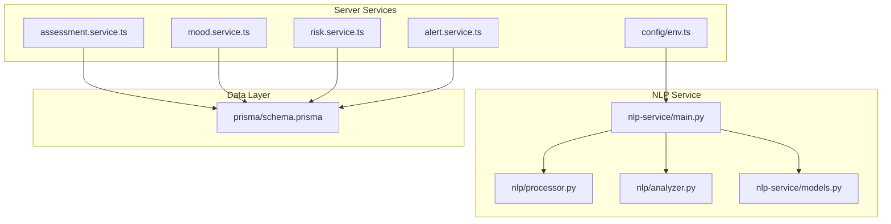
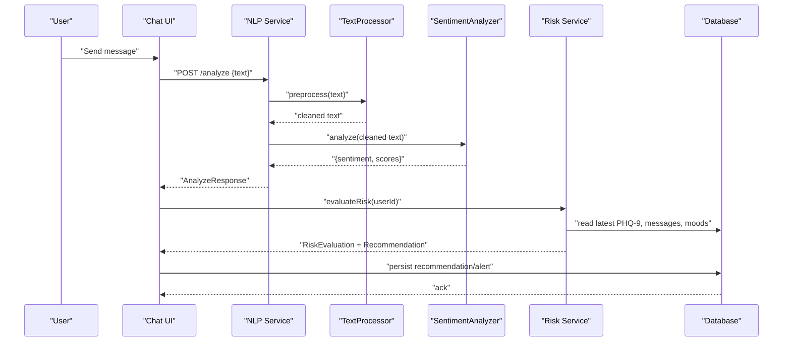
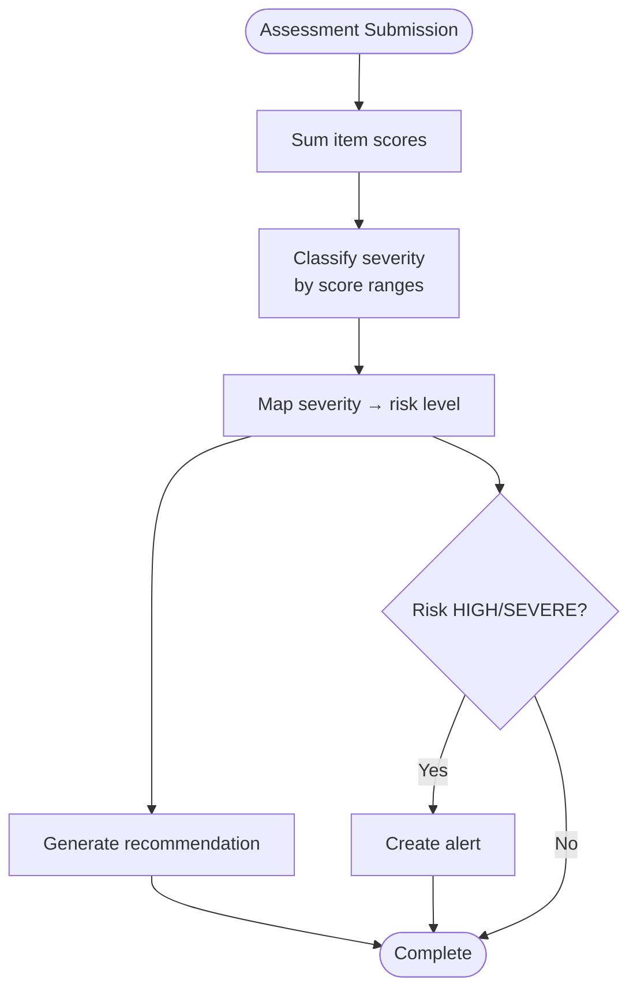
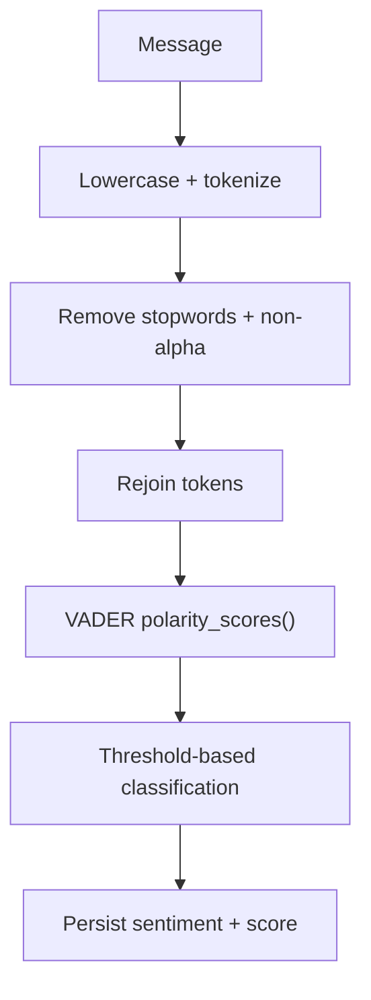
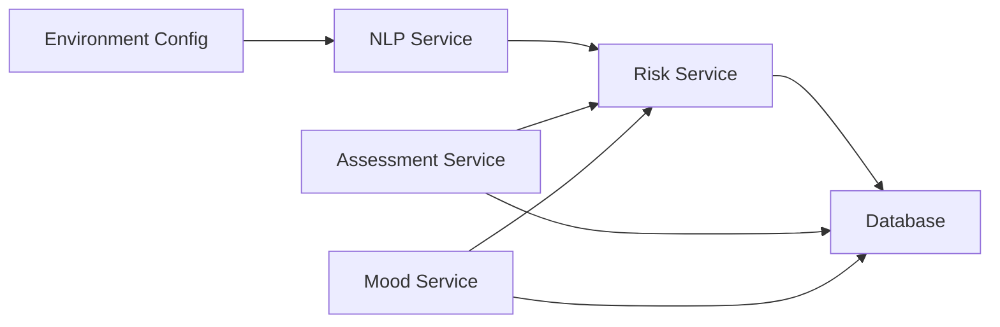

# Evaluation Metrics

<cite>
**Referenced Files in This Document**
- [README.md](file://README.md)
- [ModelReadMe.md](file://ModelReadMe.md)
- [requirements.md](file://requirements.md)
- [requirements.txt](file://requirements.txt)
- [prisma/schema.prisma](file://prisma/schema.prisma)
- [nlp-service/main.py](file://nlp-service/main.py)
- [nlp-service/nlp/analyzer.py](file://nlp-service/nlp/analyzer.py)
- [nlp-service/nlp/processor.py](file://nlp-service/nlp/processor.py)
- [nlp-service/models.py](file://nlp-service/models.py)
- [server/src/services/assessment.service.ts](file://server/src/services/assessment.service.ts)
- [server/src/services/mood.service.ts](file://server/src/services/mood.service.ts)
- [server/src/services/risk.service.ts](file://server/src/services/risk.service.ts)
- [server/src/services/alert.service.ts](file://server/src/services/alert.service.ts)
- [server/src/config/env.ts](file://server/src/config/env.ts)
- [server/src/__tests__/assessment.test.ts](file://server/src/__tests__/assessment.test.ts)
</cite>

## Table of Contents
1. [Introduction](#introduction)
2. [Project Structure](#project-structure)
3. [Core Components](#core-components)
4. [Architecture Overview](#architecture-overview)
5. [Detailed Component Analysis](#detailed-component-analysis)
6. [Dependency Analysis](#dependency-analysis)
7. [Performance Considerations](#performance-considerations)
8. [Troubleshooting Guide](#troubleshooting-guide)
9. [Conclusion](#conclusion)
10. [Appendices](#appendices)

## Introduction
This document presents the BuddyAI evaluation metrics framework for measuring platform performance and effectiveness. It covers:
- PHQ-9 assessment accuracy indicators (sensitivity, specificity, positive and negative predictive values)
- Sentiment analysis evaluation using VADER with correlation against clinical assessments and inter-rater reliability
- User engagement metrics (daily active users, session duration, completion rates, feature adoption)
- System performance indicators (response times, API latency, database query performance, concurrent capacity)
- Qualitative feedback metrics from students, counselors, and institutional stakeholders
- Effectiveness outcomes (early intervention, reduced crisis incidents, improved mental health literacy)
- Privacy and security metrics (encryption, access logs, audit trails, regulatory compliance)
- Benchmark comparisons and cost-effectiveness analysis

## Project Structure
The evaluation metrics span three primary areas:
- NLP service for sentiment analysis
- Backend services for PHQ-9 scoring, risk evaluation, mood tracking, and alerts
- Database schema capturing all interaction, assessment, and outcome data

**Diagram sources**
- [nlp-service/main.py:1-71](file://nlp-service/main.py#L1-L71)
- [nlp-service/nlp/processor.py:1-19](file://nlp-service/nlp/processor.py#L1-L19)
- [nlp-service/nlp/analyzer.py:1-27](file://nlp-service/nlp/analyzer.py#L1-L27)
- [nlp-service/models.py:1-26](file://nlp-service/models.py#L1-L26)
- [server/src/services/assessment.service.ts:1-89](file://server/src/services/assessment.service.ts#L1-L89)
- [server/src/services/mood.service.ts:1-58](file://server/src/services/mood.service.ts#L1-L58)
- [server/src/services/risk.service.ts:1-138](file://server/src/services/risk.service.ts#L1-L138)
- [server/src/services/alert.service.ts:1-62](file://server/src/services/alert.service.ts#L1-L62)
- [server/src/config/env.ts:1-12](file://server/src/config/env.ts#L1-L12)
- [prisma/schema.prisma:1-134](file://prisma/schema.prisma#L1-L134)

**Section sources**
- [README.md:756-800](file://README.md#L756-L800)
- [ModelReadMe.md:252-281](file://ModelReadMe.md#L252-L281)
- [requirements.md:67-110](file://requirements.md#L67-L110)

## Core Components
- Sentiment Analysis (VADER): Processes text via NLTK, cleans tokens, and classifies compound scores into positive, neutral, or negative categories.
- PHQ-9 Assessment: Computes total score from 9-item responses and classifies severity; integrates with risk evaluation and recommendations.
- Risk Evaluation: Combines PHQ-9, recent negative sentiment ratio, and mood trends to compute risk level and generate recommendations.
- Alerts: Creates counselor-ready alerts for HIGH/SEvere risk cases.
- Database: Stores users, conversations, messages (with sentiment), mood entries, PHQ-9 assessments, recommendations, and risk alerts.

**Section sources**
- [nlp-service/nlp/analyzer.py:1-27](file://nlp-service/nlp/analyzer.py#L1-L27)
- [nlp-service/nlp/processor.py:1-19](file://nlp-service/nlp/processor.py#L1-L19)
- [server/src/services/assessment.service.ts:1-89](file://server/src/services/assessment.service.ts#L1-L89)
- [server/src/services/risk.service.ts:1-138](file://server/src/services/risk.service.ts#L1-L138)
- [server/src/services/alert.service.ts:1-62](file://server/src/services/alert.service.ts#L1-L62)
- [prisma/schema.prisma:47-133](file://prisma/schema.prisma#L47-L133)

## Architecture Overview
The evaluation-relevant pipeline connects user interactions to sentiment analysis, PHQ-9 scoring, risk evaluation, recommendations, and alerts, persisted in the database.

**Diagram sources**
- [nlp-service/main.py:43-58](file://nlp-service/main.py#L43-L58)
- [nlp-service/nlp/processor.py:10-18](file://nlp-service/nlp/processor.py#L10-L18)
- [nlp-service/nlp/analyzer.py:8-26](file://nlp-service/nlp/analyzer.py#L8-L26)
- [server/src/services/risk.service.ts:11-107](file://server/src/services/risk.service.ts#L11-L107)
- [prisma/schema.prisma:73-105](file://prisma/schema.prisma#L73-L105)

## Detailed Component Analysis

### PHQ-9 Assessment Accuracy Metrics
- Sensitivity: Proportion of true positives (correctly identified cases requiring intervention) among all actual cases needing intervention.
- Specificity: Proportion of true negatives (correctly identified low-risk individuals) among all low-risk individuals.
- Positive Predictive Value (PPV): Proportion of individuals with positive risk predictions who actually require intervention.
- Negative Predictive Value (NPV): Proportion of individuals with negative risk predictions who are truly low-risk.

Implementation anchors:
- Severity classification boundaries align with PHQ-9 thresholds.
- Risk-to-severity mapping drives recommendation and alert generation.

**Diagram sources**
- [server/src/services/assessment.service.ts:12-18](file://server/src/services/assessment.service.ts#L12-L18)
- [server/src/services/assessment.service.ts:48-61](file://server/src/services/assessment.service.ts#L48-L61)
- [server/src/services/risk.service.ts:56-73](file://server/src/services/risk.service.ts#L56-L73)

**Section sources**
- [server/src/services/assessment.service.ts:12-18](file://server/src/services/assessment.service.ts#L12-L18)
- [server/src/services/assessment.service.ts:48-61](file://server/src/services/assessment.service.ts#L48-L61)
- [server/src/__tests__/assessment.test.ts:24-154](file://server/src/__tests__/assessment.test.ts#L24-L154)

### Sentiment Analysis Evaluation Using VADER
- Input: User messages processed via NLTK tokenization and stopword removal.
- Output: Compound score and class label (positive, neutral, negative).
- Correlation analysis: Compare message sentiment trends with PHQ-9 scores and mood declines to quantify association with clinical indicators.
- Inter-rater reliability: Compute agreement between automated sentiment labels and manual annotations across a subset of messages.

**Diagram sources**
- [nlp-service/nlp/processor.py:10-18](file://nlp-service/nlp/processor.py#L10-L18)
- [nlp-service/nlp/analyzer.py:8-26](file://nlp-service/nlp/analyzer.py#L8-L26)
- [nlp-service/main.py:43-58](file://nlp-service/main.py#L43-L58)
- [prisma/schema.prisma:73-83](file://prisma/schema.prisma#L73-L83)

**Section sources**
- [ModelReadMe.md:252-281](file://ModelReadMe.md#L252-L281)
- [nlp-service/nlp/processor.py:1-19](file://nlp-service/nlp/processor.py#L1-L19)
- [nlp-service/nlp/analyzer.py:1-27](file://nlp-service/nlp/analyzer.py#L1-L27)
- [nlp-service/models.py:4-21](file://nlp-service/models.py#L4-L21)

### User Engagement Metrics
- Daily Active Users (DAU): Count of unique users engaging with the platform per day.
- Session Duration: Average time spent per conversation session.
- Completion Rates: Proportion of users completing PHQ-9 assessments and mood entries.
- Feature Adoption: Proportion of enrolled users actively using chat, assessments, and mood tracking.
- Retention: Cohort-based retention over 7/30 days.

Data anchors:
- Conversations and Messages tables capture chat activity.
- PHQ-9 Assessments and Mood Entries capture assessment and mood participation.

**Section sources**
- [prisma/schema.prisma:63-105](file://prisma/schema.prisma#L63-L105)

### System Performance Indicators
- Response Times: Latency from UI request to backend response for key endpoints (chat, assessments, mood, risk evaluation).
- API Latency: Endpoint-specific p50/p95/p99 timings for NLP analyze and risk evaluation.
- Database Query Performance: Index utilization and query plans for frequent reads (latest assessments, recent messages, mood averages).
- Concurrent Capacity: Throughput under load tests with simulated users performing chat, assessments, and mood logging.

Operational anchors:
- NLP service health endpoint and CORS configuration.
- Environment configuration for service URLs and ports.

**Section sources**
- [nlp-service/main.py:61-64](file://nlp-service/main.py#L61-L64)
- [server/src/config/env.ts:6-11](file://server/src/config/env.ts#L6-L11)
- [requirements.md:259-272](file://requirements.md#L259-L272)

### Qualitative Feedback Metrics
- Student Surveys: Structured feedback on ease of use, perceived helpfulness, trust, and likelihood to recommend.
- Counselor Evaluations: Assessments of alert quality, timeliness, and usefulness for triaging.
- Institutional Stakeholder Interviews: Insights on operational impact, integration fit, and policy alignment.

[No sources needed since this section provides general guidance]

### Effectiveness Measures
- Early Intervention Outcomes: Number of alerts reviewed and resolved, proportion escalating to professional care.
- Reduction in Crisis Incidents: Pre/post deployment counts of reported crises among tracked cohorts.
- Improvement in Mental Health Literacy: Pre/post assessments measuring knowledge and attitudes.

[No sources needed since this section provides general guidance]

### Data Privacy and Security Metrics
- Encryption Standards: Password hashing, JWT usage, HTTPS enforcement, and transport encryption.
- Access Logs: Authentication attempts, protected route access, and admin actions.
- Audit Trails: Modification timestamps, user-initiated actions, and counselor alert updates.
- Compliance: Adherence to educational data privacy regulations (e.g., FERPA, GDPR) with data minimization, consent, and retention policies.

**Section sources**
- [requirements.md:275-292](file://requirements.md#L275-L292)
- [prisma/schema.prisma:47-58](file://prisma/schema.prisma#L47-L58)

### Benchmark and Cost-Effectiveness
- Benchmarks: Compare PHQ-9 accuracy and sentiment classification against established clinical tools and inter-rater studies.
- Cost-Effectiveness: Ratio of intervention costs to avoided crisis costs, adjusted for human counselor time saved and early referral efficiency.

[No sources needed since this section provides general guidance]

## Dependency Analysis
The evaluation pipeline depends on:
- NLP service for sentiment classification
- Risk service for combining PHQ-9, sentiment, and mood trends
- Database for persistence and analytics
- Environment configuration for service endpoints

**Diagram sources**
- [nlp-service/main.py:28-40](file://nlp-service/main.py#L28-L40)
- [server/src/services/risk.service.ts:11-107](file://server/src/services/risk.service.ts#L11-L107)
- [server/src/config/env.ts:6-11](file://server/src/config/env.ts#L6-L11)
- [prisma/schema.prisma:73-105](file://prisma/schema.prisma#L73-L105)

**Section sources**
- [requirements.txt:35-40](file://requirements.txt#L35-L40)
- [server/src/config/env.ts:6-11](file://server/src/config/env.ts#L6-L11)

## Performance Considerations
- Optimize sentiment preprocessing and VADER inference for throughput.
- Index database queries on user ID and timestamps for risk evaluation and reporting.
- Implement caching for frequently accessed dashboards and static assets.
- Load-test endpoints to establish baseline latency and saturation points.

[No sources needed since this section provides general guidance]

## Troubleshooting Guide
- NLP Service Failures: Health endpoint verification and local NLTK resource initialization.
- Risk Evaluation Gaps: Missing sentiment or mood data leading to insufficient-data outcomes.
- Database Integrity: Ensure unique indices and referential integrity for accurate reporting.

**Section sources**
- [nlp-service/main.py:61-64](file://nlp-service/main.py#L61-L64)
- [server/src/services/risk.service.ts:43-54](file://server/src/services/risk.service.ts#L43-L54)
- [prisma/schema.prisma:47-133](file://prisma/schema.prisma#L47-L133)

## Conclusion
BuddyAI’s evaluation framework integrates robust clinical foundations (PHQ-9), scalable NLP (VADER), and comprehensive data capture to measure both technical performance and behavioral outcomes. By establishing standardized accuracy, engagement, and effectiveness metrics—and by embedding privacy and compliance—BuddyAI can demonstrate measurable impact in early intervention and mental health support within tertiary institutions.

[No sources needed since this section summarizes without analyzing specific files]

## Appendices
- PHQ-9 Severity Reference: Minimal, Mild, Moderate, Moderately Severe, Severe
- Risk Levels: Low, Moderate, High, Severe
- Sentiment Labels: Positive, Neutral, Negative

**Section sources**
- [server/src/services/assessment.service.ts:12-18](file://server/src/services/assessment.service.ts#L12-L18)
- [server/src/services/risk.service.ts:34-39](file://server/src/services/risk.service.ts#L34-L39)
- [ModelReadMe.md:274-281](file://ModelReadMe.md#L274-L281)