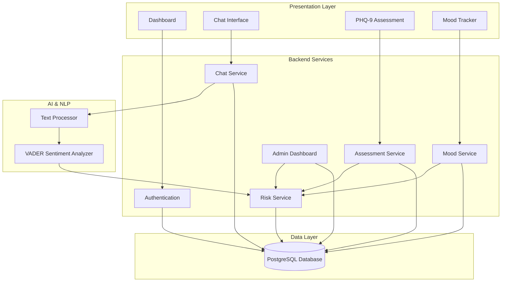
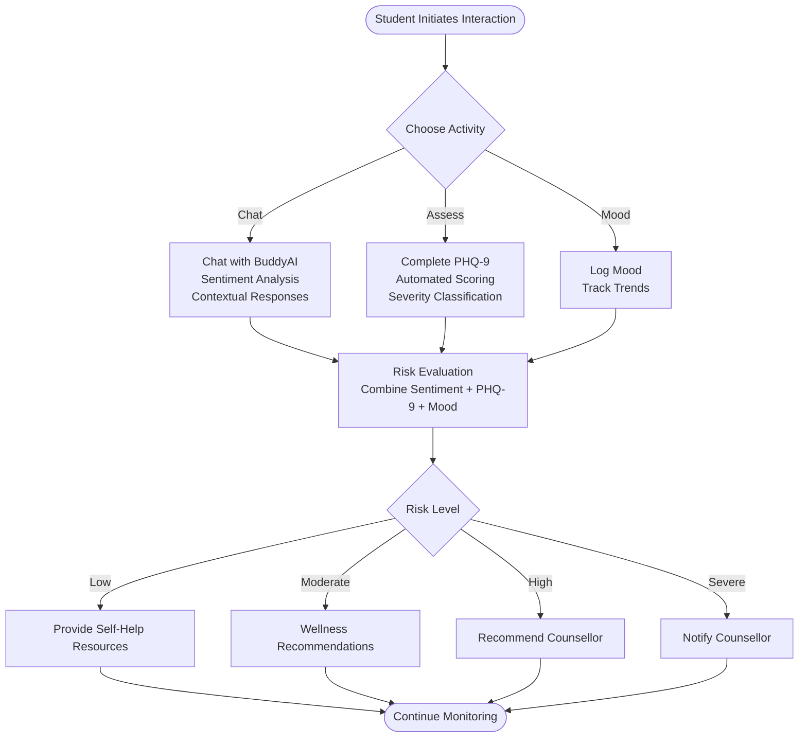

# Introduction and Purpose

<cite>
**Referenced Files in This Document**
- [README.md](file://README.md)
- [ModelReadMe.md](file://ModelReadMe.md)
- [requirements.md](file://requirements.md)
- [requirements.txt](file://requirements.txt)
- [server/src/controllers/chat.controller.ts](file://server/src/controllers/chat.controller.ts)
- [server/src/services/chat.service.ts](file://server/src/services/chat.service.ts)
- [nlp-service/nlp/analyzer.py](file://nlp-service/nlp/analyzer.py)
- [nlp-service/nlp/processor.py](file://nlp-service/nlp/processor.py)
- [server/src/services/assessment.service.ts](file://server/src/services/assessment.service.ts)
- [server/src/services/risk.service.ts](file://server/src/services/risk.service.ts)
- [server/src/services/mood.service.ts](file://server/src/services/mood.service.ts)
- [client/src/app/dashboard/page.tsx](file://client/src/app/dashboard/page.tsx)
- [client/src/app/chat/page.tsx](file://client/src/app/chat/page.tsx)
- [client/src/app/assessment/page.tsx](file://client/src/app/assessment/page.tsx)
- [client/src/app/mood/page.tsx](file://client/src/app/mood/page.tsx)
</cite>

## Table of Contents
1. [Introduction](#introduction)
2. [Problem Statement](#problem-statement)
3. [Platform Mission and Vision](#platform-mission-and-vision)
4. [Core Objectives](#core-objectives)
5. [System Architecture Overview](#system-architecture-overview)
6. [Key Features and Capabilities](#key-features-and-capabilities)
7. [Target Scenarios and Use Cases](#target-scenarios-and-use-cases)
8. [Statistics and Impact](#statistics-and-impact)
9. [Accessibility, Confidentiality, and Student-Centered Care](#accessibility-confidentiality-and-student-centered-care)
10. [Conclusion](#conclusion)

## Introduction
BuddyAI is an AI-powered mental health support platform designed specifically for students in tertiary institutions. Its mission is to reduce barriers to mental health support—such as stigma, limited access, and lack of awareness—by offering a confidential, accessible, and student-centered companion that complements professional care rather than replacing it. Through intelligent conversational interaction, sentiment analysis, PHQ-9-based assessments, mood tracking, and risk evaluation, BuddyAI enables early identification of emotional distress and timely access to resources and support.

**Section sources**
- [README.md:3-31](file://README.md#L3-L31)
- [ModelReadMe.md:3-21](file://ModelReadMe.md#L3-L21)

## Problem Statement
Depression and other mental health challenges are highly prevalent among tertiary institution students. Contributing factors include academic pressure, financial stress, social isolation, and personal transitions. Many students do not seek professional help due to:
- Stigma surrounding mental health
- Limited awareness of available resources
- Long wait times for counseling services
- Delayed recognition of symptoms

BuddyAI addresses these systemic barriers by providing:
- Early detection of depressive symptoms
- Continuous emotional monitoring
- Personalized support recommendations
- Easy access to mental health resources
- Automated referral guidance for professional intervention when necessary

**Section sources**
- [README.md:9-18](file://README.md#L9-L18)

## Platform Mission and Vision
BuddyAI’s mission is to empower students to take charge of their mental wellbeing through an approachable, private, and intelligent support system. The platform is committed to:
- Complementing professional mental health services rather than substituting them
- Normalizing conversations about mental health by making support available, nonjudgmental, and easy to access
- Providing actionable insights grounded in evidence-based frameworks such as the PHQ-9

**Section sources**
- [README.md:7](file://README.md#L7)
- [ModelReadMe.md:7](file://ModelReadMe.md#L7)

## Core Objectives
BuddyAI is built around several interconnected objectives that work together to support student mental health:
- Conversational AI support: Natural, context-aware chat interactions that encourage open dialogue
- Automated PHQ-9 assessment integration: Secure, validated screening with automated scoring and severity classification
- Sentiment analysis for mood tracking: Real-time detection of emotional tone to inform risk evaluation
- Personalized recommendation generation: Tailored self-help suggestions and resource referrals based on risk and history
- Administrative dashboards: Counsellor oversight for high-risk cases and system monitoring

**Section sources**
- [README.md:20-31](file://README.md#L20-L31)
- [requirements.md:25-254](file://requirements.md#L25-L254)

## System Architecture Overview
BuddyAI follows a multi-tier, modular architecture that separates presentation, application processing, AI services, and data management. This design ensures scalability, maintainability, and security while enabling seamless integration of conversational AI, sentiment analysis, assessments, and mood tracking.

**Diagram sources**
- [README.md:125-211](file://README.md#L125-L211)
- [server/src/controllers/chat.controller.ts:1-69](file://server/src/controllers/chat.controller.ts#L1-L69)
- [server/src/services/chat.service.ts:1-105](file://server/src/services/chat.service.ts#L1-L105)
- [nlp-service/nlp/analyzer.py:1-27](file://nlp-service/nlp/analyzer.py#L1-L27)
- [nlp-service/nlp/processor.py:1-19](file://nlp-service/nlp/processor.py#L1-L19)
- [server/src/services/assessment.service.ts:1-89](file://server/src/services/assessment.service.ts#L1-L89)
- [server/src/services/risk.service.ts:1-138](file://server/src/services/risk.service.ts#L1-L138)
- [server/src/services/mood.service.ts:1-58](file://server/src/services/mood.service.ts#L1-L58)

**Section sources**
- [README.md:125-211](file://README.md#L125-L211)

## Key Features and Capabilities
- User Authentication: Secure registration, login, password management, and session handling
- Conversational AI Support: Natural language conversations, emotional expression analysis, and context-aware responses
- Sentiment Analysis Engine: Positive, neutral, and negative emotion detection with sentiment scores
- Depression Assessment: PHQ-9 integration with automated scoring and severity classification
- Mood Tracking: Daily logging, visualization, and trend analysis
- Recommendation System: Personalized self-help suggestions and referral guidance
- Administrative Dashboard: User management, system monitoring, assessment statistics, and report generation

**Section sources**
- [README.md:35-83](file://README.md#L35-L83)
- [requirements.md:25-254](file://requirements.md#L25-L254)

## Target Scenarios and Use Cases
BuddyAI is designed to support common student mental health scenarios:

- Anxiety and Stress Management
  - Scenario: A student shares concerns about upcoming exams and expresses worry.
  - Platform Response: Sentiment analysis detects negative tone; PHQ-9 and mood history inform risk evaluation; recommendations include stress management techniques and mindfulness resources; optional escalation to a counsellor if risk is elevated.

- Depression Screening and Monitoring
  - Scenario: A student completes the PHQ-9 and logs mood ratings over time.
  - Platform Response: Automated scoring classifies severity; trend analysis identifies worsening mood; recommendations guide self-help and professional support; high-risk cases trigger alerts for counsellor review.

- Crisis Situations
  - Scenario: A message indicates severe distress or thoughts of self-harm.
  - Platform Response: High negative sentiment combined with high PHQ-9 scores triggers a high or severe risk classification; automatic alert notifies a counsellor for immediate intervention.

- Ongoing Wellbeing Check-ins
  - Scenario: A student regularly chats with BuddyAI, logs mood, and periodically retakes the PHQ-9.
  - Platform Response: Continuous monitoring tracks improvements or declines; recommendations adapt over time; dashboard provides quick insights and next steps.

**Diagram sources**
- [server/src/services/chat.service.ts:45-89](file://server/src/services/chat.service.ts#L45-L89)
- [server/src/services/assessment.service.ts:20-33](file://server/src/services/assessment.service.ts#L20-L33)
- [server/src/services/risk.service.ts:11-107](file://server/src/services/risk.service.ts#L11-L107)
- [client/src/app/chat/page.tsx:55-107](file://client/src/app/chat/page.tsx#L55-L107)
- [client/src/app/assessment/page.tsx:52-73](file://client/src/app/assessment/page.tsx#L52-L73)
- [client/src/app/mood/page.tsx:63-91](file://client/src/app/mood/page.tsx#L63-L91)

**Section sources**
- [server/src/services/chat.service.ts:15-24](file://server/src/services/chat.service.ts#L15-L24)
- [server/src/services/assessment.service.ts:63-74](file://server/src/services/assessment.service.ts#L63-L74)
- [server/src/services/risk.service.ts:109-120](file://server/src/services/risk.service.ts#L109-L120)
- [client/src/app/dashboard/page.tsx:105-177](file://client/src/app/dashboard/page.tsx#L105-L177)

## Statistics and Impact
While specific institutional statistics are not embedded in the repository, research consistently demonstrates:
- Up to 40% of university students report symptoms consistent with a diagnosable mental health condition
- Stigma remains a leading barrier to help-seeking
- Early intervention improves outcomes and reduces long-term disability
- Digital-first, AI-assisted support increases access and reduces wait times

BuddyAI’s integrated approach—combining conversational AI, validated screening, and continuous monitoring—supports early identification and timely access to care, aligning with evidence-based practices for student mental health.

[No sources needed since this section provides general guidance]

## Accessibility, Confidentiality, and Student-Centered Care
BuddyAI prioritizes:
- Accessibility: Web-based, responsive interface with simple navigation; chat, assessments, and mood tracking available anytime, anywhere
- Confidentiality: Secure authentication, encrypted storage, and strict access controls; data retention policies aligned with privacy standards
- Student-Centered Care: Nonjudgmental, empathetic interactions; personalized recommendations; seamless integration with professional support when needed

**Section sources**
- [requirements.md:275-321](file://requirements.md#L275-L321)
- [requirements.md:323-357](file://requirements.md#L323-L357)
- [README.md:113-117](file://README.md#L113-L117)

## Conclusion
BuddyAI is a student-focused, AI-powered platform that transforms mental health support in tertiary institutions. By removing barriers, providing early detection, and offering personalized, confidential care, it empowers students to seek help earlier and more consistently. Designed to complement—not replace—professional services, BuddyAI delivers a practical pathway to improved mental wellbeing through technology, empathy, and evidence-based practices.

[No sources needed since this section summarizes without analyzing specific files]