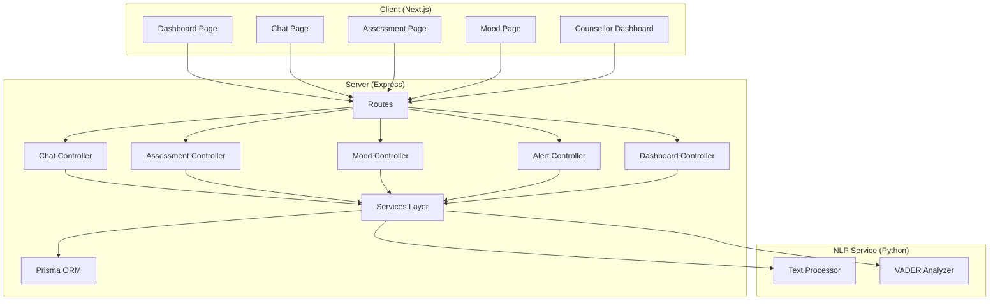
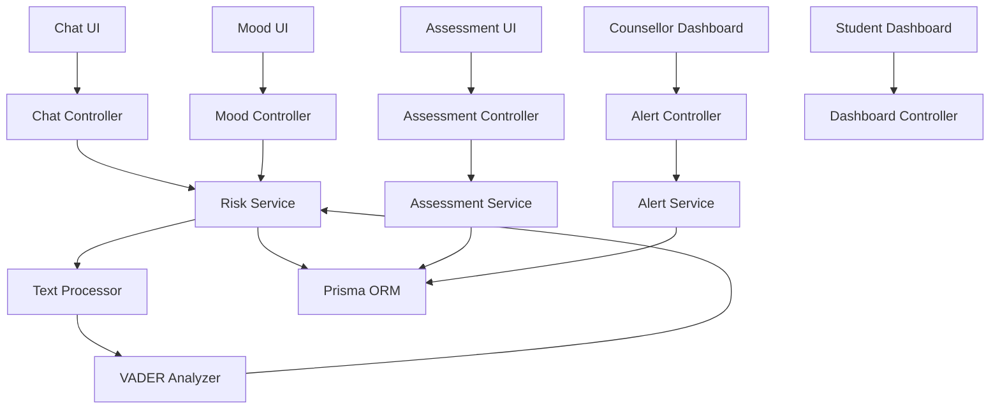
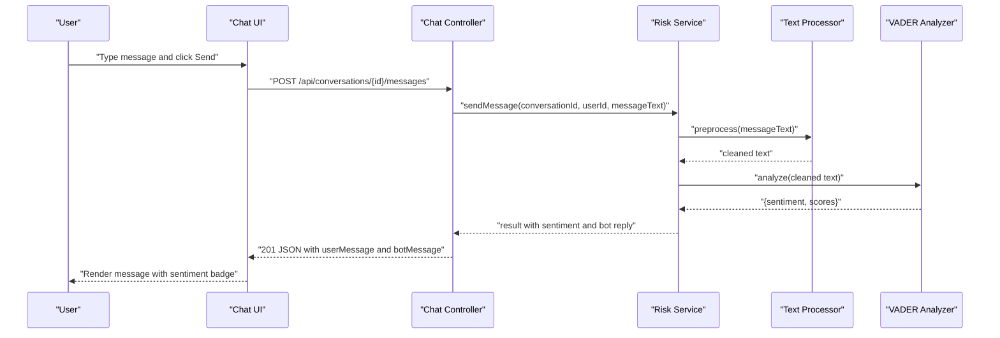
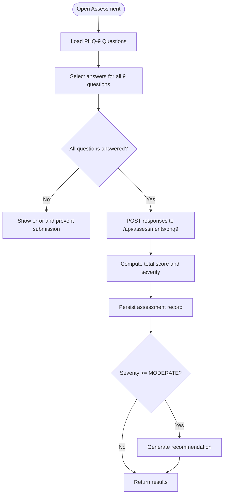
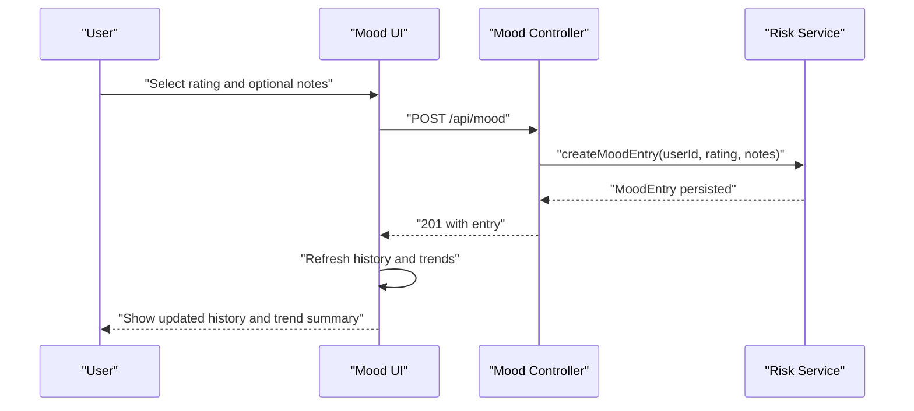
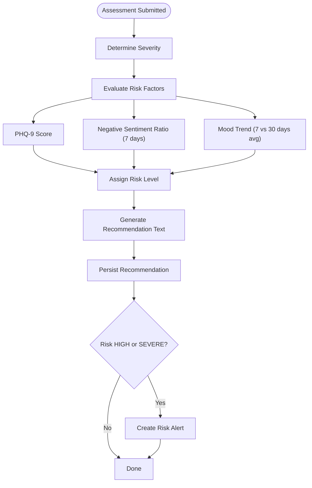
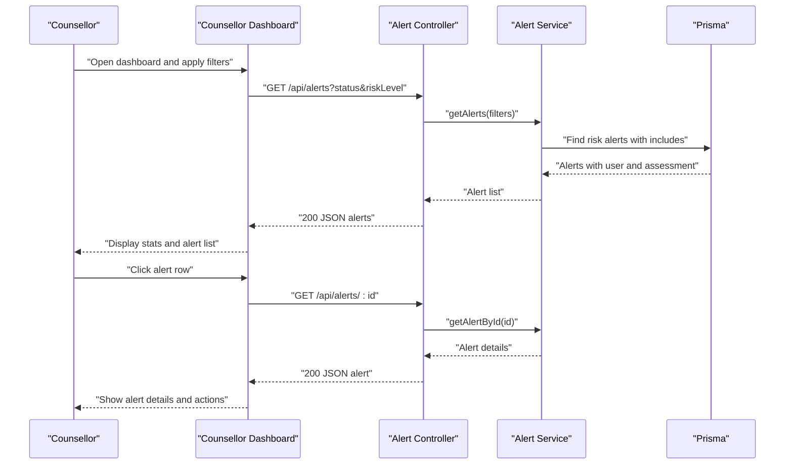
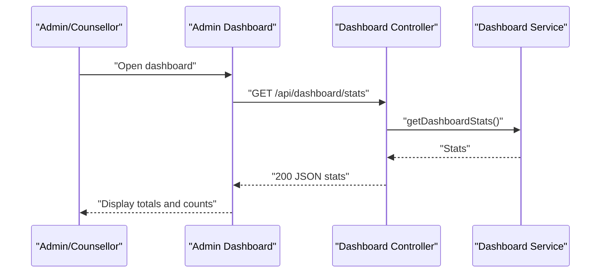
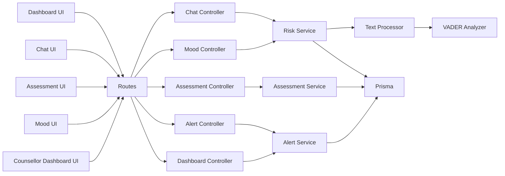

# Key Features

<cite>
**Referenced Files in This Document**
- [client/src/app/chat/page.tsx](file://client/src/app/chat/page.tsx)
- [client/src/app/assessment/page.tsx](file://client/src/app/assessment/page.tsx)
- [client/src/app/mood/page.tsx](file://client/src/app/mood/page.tsx)
- [client/src/app/dashboard/page.tsx](file://client/src/app/dashboard/page.tsx)
- [client/src/app/counsellor/dashboard/page.tsx](file://client/src/app/counsellor/dashboard/page.tsx)
- [server/src/controllers/chat.controller.ts](file://server/src/controllers/chat.controller.ts)
- [server/src/controllers/assessment.controller.ts](file://server/src/controllers/assessment.controller.ts)
- [server/src/controllers/mood.controller.ts](file://server/src/controllers/mood.controller.ts)
- [server/src/controllers/alert.controller.ts](file://server/src/controllers/alert.controller.ts)
- [server/src/controllers/dashboard.controller.ts](file://server/src/controllers/dashboard.controller.ts)
- [server/src/services/risk.service.ts](file://server/src/services/risk.service.ts)
- [server/src/services/alert.service.ts](file://server/src/services/alert.service.ts)
- [server/src/services/assessment.service.ts](file://server/src/services/assessment.service.ts)
- [nlp-service/nlp/analyzer.py](file://nlp-service/nlp/analyzer.py)
- [nlp-service/nlp/processor.py](file://nlp-service/nlp/processor.py)
</cite>

## Table of Contents
1. [Introduction](#introduction)
2. [Project Structure](#project-structure)
3. [Core Components](#core-components)
4. [Architecture Overview](#architecture-overview)
5. [Detailed Component Analysis](#detailed-component-analysis)
6. [Dependency Analysis](#dependency-analysis)
7. [Performance Considerations](#performance-considerations)
8. [Troubleshooting Guide](#troubleshooting-guide)
9. [Conclusion](#conclusion)

## Introduction
This document details the key features of BuddyAI, focusing on the platform’s core functionality modules. It explains how the AI chat assistant performs conversational support with integrated VADER sentiment analysis, how the PHQ-9 depression assessment administers, scores, classifies risk, and interprets results, how the mood tracking system logs daily entries, analyzes trends, and maintains historical records, and how the personalized recommendation engine synthesizes insights from assessments and mood patterns. It also covers the counselor dashboard for risk alert management and student monitoring, and the administrative dashboard for system oversight. Practical workflows and user interaction patterns are included to illustrate each feature.

## Project Structure
BuddyAI is organized into three primary layers:
- Frontend (Next.js app) under client/src/app, implementing user-facing pages for chat, assessment, mood tracking, dashboards, and navigation.
- Backend (Express server) under server/src, exposing REST endpoints via controllers and orchestrating domain logic in services.
- NLP service (Python) under nlp-service, providing VADER-based sentiment analysis and text preprocessing.

**Diagram sources**
- [client/src/app/dashboard/page.tsx:1-206](file://client/src/app/dashboard/page.tsx#L1-L206)
- [client/src/app/chat/page.tsx:1-196](file://client/src/app/chat/page.tsx#L1-L196)
- [client/src/app/assessment/page.tsx:1-192](file://client/src/app/assessment/page.tsx#L1-L192)
- [client/src/app/mood/page.tsx:1-245](file://client/src/app/mood/page.tsx#L1-L245)
- [client/src/app/counsellor/dashboard/page.tsx:1-213](file://client/src/app/counsellor/dashboard/page.tsx#L1-L213)
- [server/src/controllers/chat.controller.ts:1-69](file://server/src/controllers/chat.controller.ts#L1-L69)
- [server/src/controllers/assessment.controller.ts:1-74](file://server/src/controllers/assessment.controller.ts#L1-L74)
- [server/src/controllers/mood.controller.ts:1-67](file://server/src/controllers/mood.controller.ts#L1-L67)
- [server/src/controllers/alert.controller.ts:1-70](file://server/src/controllers/alert.controller.ts#L1-L70)
- [server/src/controllers/dashboard.controller.ts:1-13](file://server/src/controllers/dashboard.controller.ts#L1-L13)
- [nlp-service/nlp/processor.py:1-19](file://nlp-service/nlp/processor.py#L1-L19)
- [nlp-service/nlp/analyzer.py:1-27](file://nlp-service/nlp/analyzer.py#L1-L27)

**Section sources**
- [client/src/app/dashboard/page.tsx:1-206](file://client/src/app/dashboard/page.tsx#L1-L206)
- [client/src/app/chat/page.tsx:1-196](file://client/src/app/chat/page.tsx#L1-L196)
- [client/src/app/assessment/page.tsx:1-192](file://client/src/app/assessment/page.tsx#L1-L192)
- [client/src/app/mood/page.tsx:1-245](file://client/src/app/mood/page.tsx#L1-L245)
- [client/src/app/counsellor/dashboard/page.tsx:1-213](file://client/src/app/counsellor/dashboard/page.tsx#L1-L213)
- [server/src/controllers/chat.controller.ts:1-69](file://server/src/controllers/chat.controller.ts#L1-L69)
- [server/src/controllers/assessment.controller.ts:1-74](file://server/src/controllers/assessment.controller.ts#L1-L74)
- [server/src/controllers/mood.controller.ts:1-67](file://server/src/controllers/mood.controller.ts#L1-L67)
- [server/src/controllers/alert.controller.ts:1-70](file://server/src/controllers/alert.controller.ts#L1-L70)
- [server/src/controllers/dashboard.controller.ts:1-13](file://server/src/controllers/dashboard.controller.ts#L1-L13)
- [nlp-service/nlp/processor.py:1-19](file://nlp-service/nlp/processor.py#L1-L19)
- [nlp-service/nlp/analyzer.py:1-27](file://nlp-service/nlp/analyzer.py#L1-L27)

## Core Components
- AI Chat Assistant with VADER sentiment integration
- PHQ-9 Depression Assessment with scoring and risk classification
- Mood Tracking with daily logging, trend analysis, and history
- Personalized Recommendation Engine
- Counselor Dashboard for risk alert management and monitoring
- Administrative Dashboard for system oversight

**Section sources**
- [client/src/app/chat/page.tsx:1-196](file://client/src/app/chat/page.tsx#L1-L196)
- [client/src/app/assessment/page.tsx:1-192](file://client/src/app/assessment/page.tsx#L1-L192)
- [client/src/app/mood/page.tsx:1-245](file://client/src/app/mood/page.tsx#L1-L245)
- [client/src/app/counsellor/dashboard/page.tsx:1-213](file://client/src/app/counsellor/dashboard/page.tsx#L1-L213)
- [server/src/services/risk.service.ts:1-138](file://server/src/services/risk.service.ts#L1-L138)
- [server/src/services/assessment.service.ts:1-89](file://server/src/services/assessment.service.ts#L1-L89)
- [server/src/services/alert.service.ts:1-62](file://server/src/services/alert.service.ts#L1-L62)
- [nlp-service/nlp/analyzer.py:1-27](file://nlp-service/nlp/analyzer.py#L1-L27)
- [nlp-service/nlp/processor.py:1-19](file://nlp-service/nlp/processor.py#L1-L19)

## Architecture Overview
The system follows a layered architecture:
- Client-side pages orchestrate user interactions and fetch data from backend endpoints.
- Controllers validate requests, enforce authentication, and delegate to services.
- Services encapsulate business logic, including risk evaluation, assessment scoring, and recommendation generation.
- Prisma handles database persistence and queries.
- The NLP service provides sentiment analysis and text preprocessing.

**Diagram sources**
- [client/src/app/chat/page.tsx:1-196](file://client/src/app/chat/page.tsx#L1-L196)
- [client/src/app/assessment/page.tsx:1-192](file://client/src/app/assessment/page.tsx#L1-L192)
- [client/src/app/mood/page.tsx:1-245](file://client/src/app/mood/page.tsx#L1-L245)
- [client/src/app/dashboard/page.tsx:1-206](file://client/src/app/dashboard/page.tsx#L1-L206)
- [client/src/app/counsellor/dashboard/page.tsx:1-213](file://client/src/app/counsellor/dashboard/page.tsx#L1-L213)
- [server/src/controllers/chat.controller.ts:1-69](file://server/src/controllers/chat.controller.ts#L1-L69)
- [server/src/controllers/assessment.controller.ts:1-74](file://server/src/controllers/assessment.controller.ts#L1-L74)
- [server/src/controllers/mood.controller.ts:1-67](file://server/src/controllers/mood.controller.ts#L1-L67)
- [server/src/controllers/alert.controller.ts:1-70](file://server/src/controllers/alert.controller.ts#L1-L70)
- [server/src/controllers/dashboard.controller.ts:1-13](file://server/src/controllers/dashboard.controller.ts#L1-L13)
- [server/src/services/risk.service.ts:1-138](file://server/src/services/risk.service.ts#L1-L138)
- [server/src/services/assessment.service.ts:1-89](file://server/src/services/assessment.service.ts#L1-L89)
- [server/src/services/alert.service.ts:1-62](file://server/src/services/alert.service.ts#L1-L62)
- [nlp-service/nlp/processor.py:1-19](file://nlp-service/nlp/processor.py#L1-L19)
- [nlp-service/nlp/analyzer.py:1-27](file://nlp-service/nlp/analyzer.py#L1-L27)

## Detailed Component Analysis

### AI Chat Assistant with VADER Sentiment Analysis
The chat module enables students to converse with BuddyAI, persisting conversations and messages, and displaying sentiment indicators derived from VADER sentiment analysis. The frontend posts messages, creates conversations when needed, and renders user and bot messages with sentiment badges.

**Diagram sources**
- [client/src/app/chat/page.tsx:55-107](file://client/src/app/chat/page.tsx#L55-L107)
- [server/src/controllers/chat.controller.ts:33-53](file://server/src/controllers/chat.controller.ts#L33-L53)
- [server/src/services/risk.service.ts:11-107](file://server/src/services/risk.service.ts#L11-L107)
- [nlp-service/nlp/processor.py:10-19](file://nlp-service/nlp/processor.py#L10-L19)
- [nlp-service/nlp/analyzer.py:8-27](file://nlp-service/nlp/analyzer.py#L8-L27)

Key behaviors:
- Conversation lifecycle: create a conversation if none exists; otherwise reuse the latest.
- Message submission validates presence of message text.
- Sentiment classification uses VADER compound score thresholds to label POSITIVE, NEGATIVE, or NEUTRAL.
- UI displays sentiment badges for user messages and a “typing” indicator for bot replies.

Practical workflow example:
- User opens chat, sends a message, receives an auto-generated bot response, and sees a sentiment label reflecting the detected emotional tone.

**Section sources**
- [client/src/app/chat/page.tsx:17-121](file://client/src/app/chat/page.tsx#L17-L121)
- [server/src/controllers/chat.controller.ts:33-53](file://server/src/controllers/chat.controller.ts#L33-L53)
- [server/src/services/risk.service.ts:11-107](file://server/src/services/risk.service.ts#L11-L107)
- [nlp-service/nlp/analyzer.py:8-27](file://nlp-service/nlp/analyzer.py#L8-L27)
- [nlp-service/nlp/processor.py:10-19](file://nlp-service/nlp/processor.py#L10-L19)

### PHQ-9 Depression Assessment
The assessment module presents nine standardized questions, collects ordinal responses, computes a total score, classifies severity, and optionally triggers recommendations and risk alerts. The frontend enforces completion of all questions before submission.

**Diagram sources**
- [client/src/app/assessment/page.tsx:52-73](file://client/src/app/assessment/page.tsx#L52-L73)
- [server/src/controllers/assessment.controller.ts:5-34](file://server/src/controllers/assessment.controller.ts#L5-L34)
- [server/src/services/assessment.service.ts:20-33](file://server/src/services/assessment.service.ts#L20-L33)
- [server/src/services/assessment.service.ts:48-88](file://server/src/services/assessment.service.ts#L48-L88)

Scoring and classification:
- Total score is the sum of responses (each 0–3).
- Severity levels: MINIMAL, MILD, MODERATE, MODERATELY_SEVERE, SEVERE.
- Risk level mapping supports downstream risk evaluation and alert creation.

Practical workflow example:
- Student completes the questionnaire, submits, views total score and severity classification, and receives guidance based on severity.

**Section sources**
- [client/src/app/assessment/page.tsx:33-96](file://client/src/app/assessment/page.tsx#L33-L96)
- [server/src/controllers/assessment.controller.ts:5-34](file://server/src/controllers/assessment.controller.ts#L5-L34)
- [server/src/services/assessment.service.ts:12-33](file://server/src/services/assessment.service.ts#L12-L33)
- [server/src/services/assessment.service.ts:48-88](file://server/src/services/assessment.service.ts#L48-L88)

### Mood Tracking System
The mood module allows daily logging of mood ratings with optional notes, displays recent history, and computes trend metrics including average mood and trend direction.

**Diagram sources**
- [client/src/app/mood/page.tsx:63-91](file://client/src/app/mood/page.tsx#L63-L91)
- [server/src/controllers/mood.controller.ts:5-34](file://server/src/controllers/mood.controller.ts#L5-L34)
- [server/src/services/risk.service.ts:29-54](file://server/src/services/risk.service.ts#L29-L54)

Trend analysis:
- Compares recent 7-day average against 7–30 day average to determine IMPROVING, DECLINING, or STABLE.
- Provides average mood and total entries for quick insight.

Practical workflow example:
- Student logs mood daily, reviews recent entries, and observes trend changes over time.

**Section sources**
- [client/src/app/mood/page.tsx:29-112](file://client/src/app/mood/page.tsx#L29-L112)
- [server/src/controllers/mood.controller.ts:5-67](file://server/src/controllers/mood.controller.ts#L5-L67)
- [server/src/services/risk.service.ts:29-54](file://server/src/services/risk.service.ts#L29-L54)

### Personalized Recommendation Engine
Recommendations are generated from assessment severity and risk evaluation. When severity reaches MODERATE or above, a tailored recommendation is stored and associated with risk level. Risk evaluation aggregates PHQ-9 score, recent negative sentiment ratio, and mood trend to compute risk level and recommendation text.

**Diagram sources**
- [server/src/services/assessment.service.ts:48-88](file://server/src/services/assessment.service.ts#L48-L88)
- [server/src/services/risk.service.ts:11-107](file://server/src/services/risk.service.ts#L11-L107)

Recommendation categories:
- LOW/MODERATE/HIGH/SEVERE with distinct guidance text and alert creation for high-risk cases.

**Section sources**
- [server/src/services/assessment.service.ts:48-88](file://server/src/services/assessment.service.ts#L48-L88)
- [server/src/services/risk.service.ts:11-107](file://server/src/services/risk.service.ts#L11-L107)

### Counselor Dashboard and Alert Management
Counselors monitor risk alerts and student wellbeing via a dashboard that lists alerts with filtering by status and risk level, and provides a student summary including recent assessments, moods, sentiment breakdown, and recommendations.

**Diagram sources**
- [client/src/app/counsellor/dashboard/page.tsx:49-81](file://client/src/app/counsellor/dashboard/page.tsx#L49-L81)
- [server/src/controllers/alert.controller.ts:5-53](file://server/src/controllers/alert.controller.ts#L5-L53)
- [server/src/services/alert.service.ts:3-26](file://server/src/services/alert.service.ts#L3-L26)

Administrative dashboard:
- The student dashboard aggregates latest mood, PHQ-9 severity, and risk level for quick overview and quick action links.

**Section sources**
- [client/src/app/counsellor/dashboard/page.tsx:28-107](file://client/src/app/counsellor/dashboard/page.tsx#L28-L107)
- [server/src/controllers/alert.controller.ts:5-53](file://server/src/controllers/alert.controller.ts#L5-L53)
- [server/src/services/alert.service.ts:35-61](file://server/src/services/alert.service.ts#L35-L61)
- [client/src/app/dashboard/page.tsx:29-95](file://client/src/app/dashboard/page.tsx#L29-L95)

### Administrative Dashboard
The administrative dashboard endpoint provides system-wide statistics for counselors, enabling oversight of alert volumes and statuses.

**Diagram sources**
- [client/src/app/counsellor/dashboard/page.tsx:49-63](file://client/src/app/counsellor/dashboard/page.tsx#L49-L63)
- [server/src/controllers/dashboard.controller.ts:5-12](file://server/src/controllers/dashboard.controller.ts#L5-L12)

**Section sources**
- [server/src/controllers/dashboard.controller.ts:1-13](file://server/src/controllers/dashboard.controller.ts#L1-L13)
- [client/src/app/counsellor/dashboard/page.tsx:117-136](file://client/src/app/counsellor/dashboard/page.tsx#L117-L136)

## Dependency Analysis
- Frontend pages depend on API endpoints exposed by controllers.
- Controllers depend on services for business logic.
- Services depend on Prisma for persistence and on the NLP service for sentiment analysis.
- Risk evaluation depends on assessment severity, recent messages’ sentiment, and mood trends.

**Diagram sources**
- [client/src/app/dashboard/page.tsx:1-206](file://client/src/app/dashboard/page.tsx#L1-L206)
- [client/src/app/chat/page.tsx:1-196](file://client/src/app/chat/page.tsx#L1-L196)
- [client/src/app/assessment/page.tsx:1-192](file://client/src/app/assessment/page.tsx#L1-L192)
- [client/src/app/mood/page.tsx:1-245](file://client/src/app/mood/page.tsx#L1-L245)
- [client/src/app/counsellor/dashboard/page.tsx:1-213](file://client/src/app/counsellor/dashboard/page.tsx#L1-L213)
- [server/src/controllers/chat.controller.ts:1-69](file://server/src/controllers/chat.controller.ts#L1-L69)
- [server/src/controllers/assessment.controller.ts:1-74](file://server/src/controllers/assessment.controller.ts#L1-L74)
- [server/src/controllers/mood.controller.ts:1-67](file://server/src/controllers/mood.controller.ts#L1-L67)
- [server/src/controllers/alert.controller.ts:1-70](file://server/src/controllers/alert.controller.ts#L1-L70)
- [server/src/controllers/dashboard.controller.ts:1-13](file://server/src/controllers/dashboard.controller.ts#L1-L13)
- [server/src/services/risk.service.ts:1-138](file://server/src/services/risk.service.ts#L1-L138)
- [server/src/services/assessment.service.ts:1-89](file://server/src/services/assessment.service.ts#L1-L89)
- [server/src/services/alert.service.ts:1-62](file://server/src/services/alert.service.ts#L1-L62)
- [nlp-service/nlp/processor.py:1-19](file://nlp-service/nlp/processor.py#L1-L19)
- [nlp-service/nlp/analyzer.py:1-27](file://nlp-service/nlp/analyzer.py#L1-L27)

**Section sources**
- [server/src/services/risk.service.ts:1-138](file://server/src/services/risk.service.ts#L1-L138)
- [server/src/services/assessment.service.ts:1-89](file://server/src/services/assessment.service.ts#L1-L89)
- [server/src/services/alert.service.ts:1-62](file://server/src/services/alert.service.ts#L1-L62)
- [nlp-service/nlp/analyzer.py:1-27](file://nlp-service/nlp/analyzer.py#L1-L27)
- [nlp-service/nlp/processor.py:1-19](file://nlp-service/nlp/processor.py#L1-L19)

## Performance Considerations
- Asynchronous loading: Client pages use concurrent API calls to reduce perceived latency (e.g., fetching mood history and trends together).
- Efficient sentiment analysis: Preprocessing cleans text to improve VADER performance while keeping overhead minimal.
- Trend computations: Aggregation over bounded windows (7 and 30 days) ensures predictable runtime and memory usage.
- Recommendations and alerts: Stored once per assessment or risk evaluation to avoid recomputation.

[No sources needed since this section provides general guidance]

## Troubleshooting Guide
Common issues and resolutions:
- Authentication redirects: Pages redirect unauthenticated users to the login route.
- Validation errors:
  - Chat requires non-empty message text.
  - Assessment requires exactly nine ordinal responses within the allowed range.
  - Mood requires a numeric rating between 1 and 5.
- Network failures: Client pages catch and surface errors during submissions or data fetches.
- Counselor access: Non-counselor users are redirected away from the counselor dashboard.

**Section sources**
- [client/src/app/chat/page.tsx:26-32](file://client/src/app/chat/page.tsx#L26-L32)
- [server/src/controllers/chat.controller.ts:43-46](file://server/src/controllers/chat.controller.ts#L43-L46)
- [server/src/controllers/assessment.controller.ts:14-21](file://server/src/controllers/assessment.controller.ts#L14-L21)
- [server/src/controllers/mood.controller.ts:14-22](file://server/src/controllers/mood.controller.ts#L14-L22)
- [client/src/app/counsellor/dashboard/page.tsx:36-46](file://client/src/app/counsellor/dashboard/page.tsx#L36-L46)

## Conclusion
BuddyAI’s key features integrate conversational AI with robust mental health workflows. The chat assistant leverages VADER sentiment to enrich interactions, the PHQ-9 assessment automates scoring and risk classification, the mood tracker provides actionable insights through trend analysis, and the recommendation engine personalizes support. Counselor and administrative dashboards streamline monitoring and intervention for high-risk cases.

[No sources needed since this section summarizes without analyzing specific files]