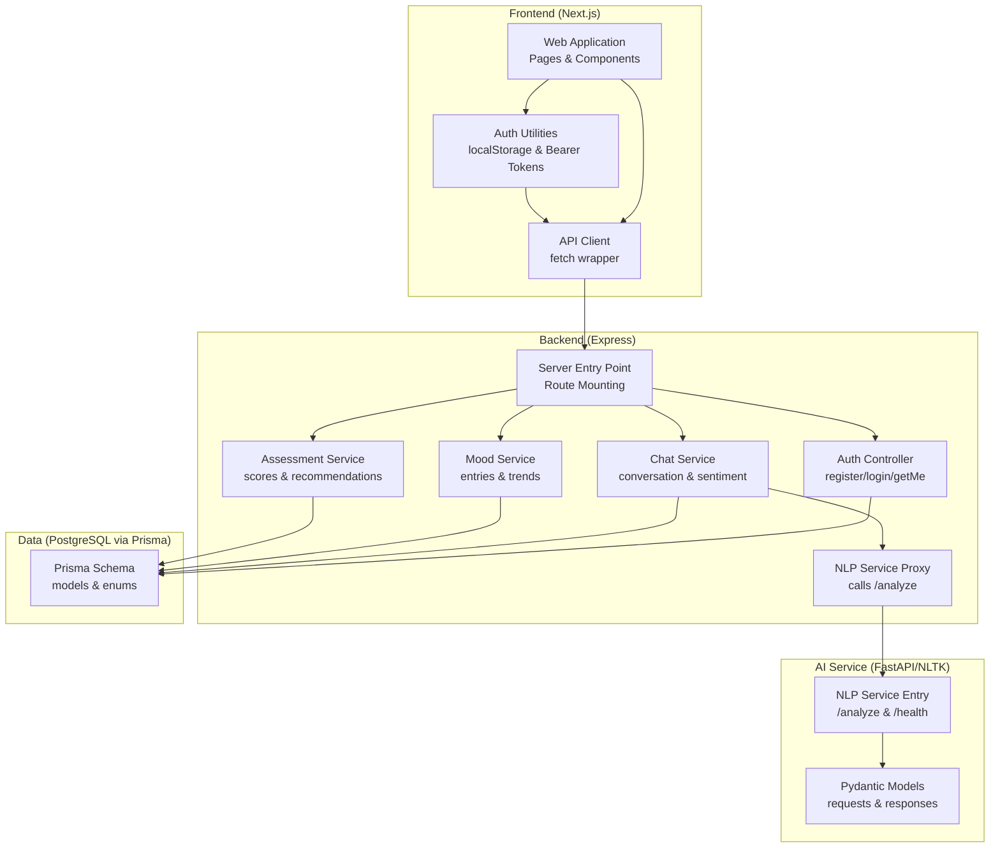
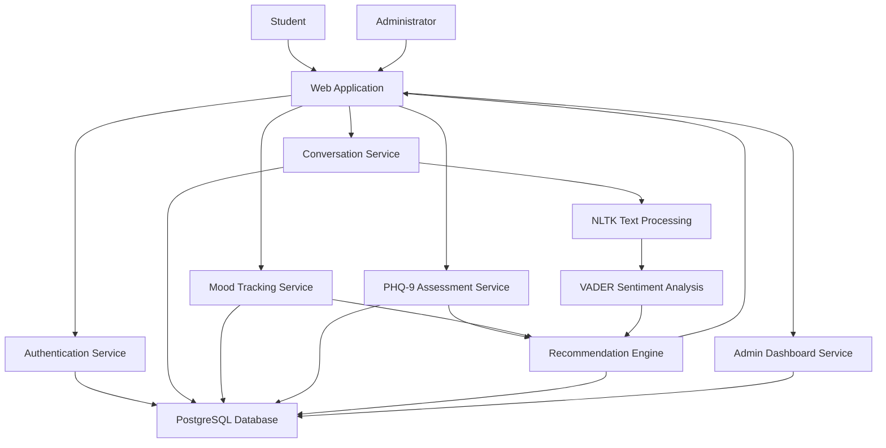
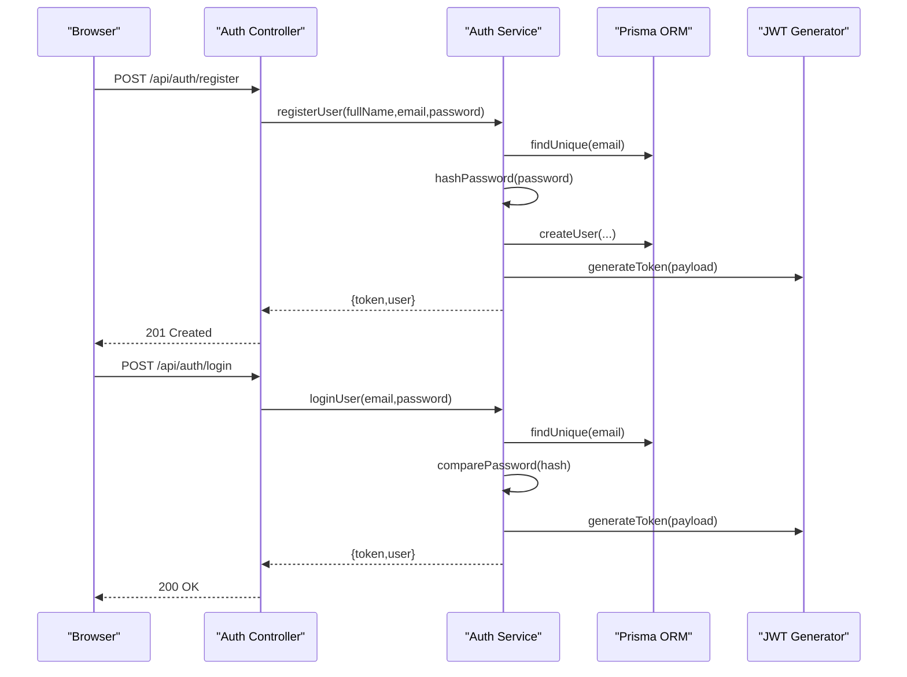
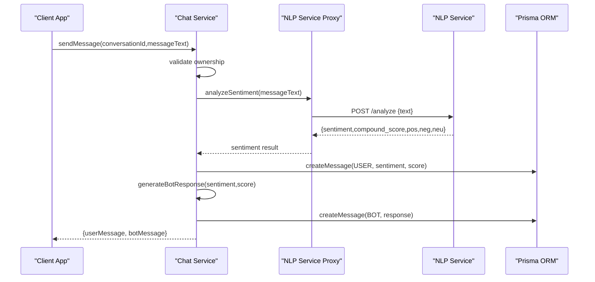
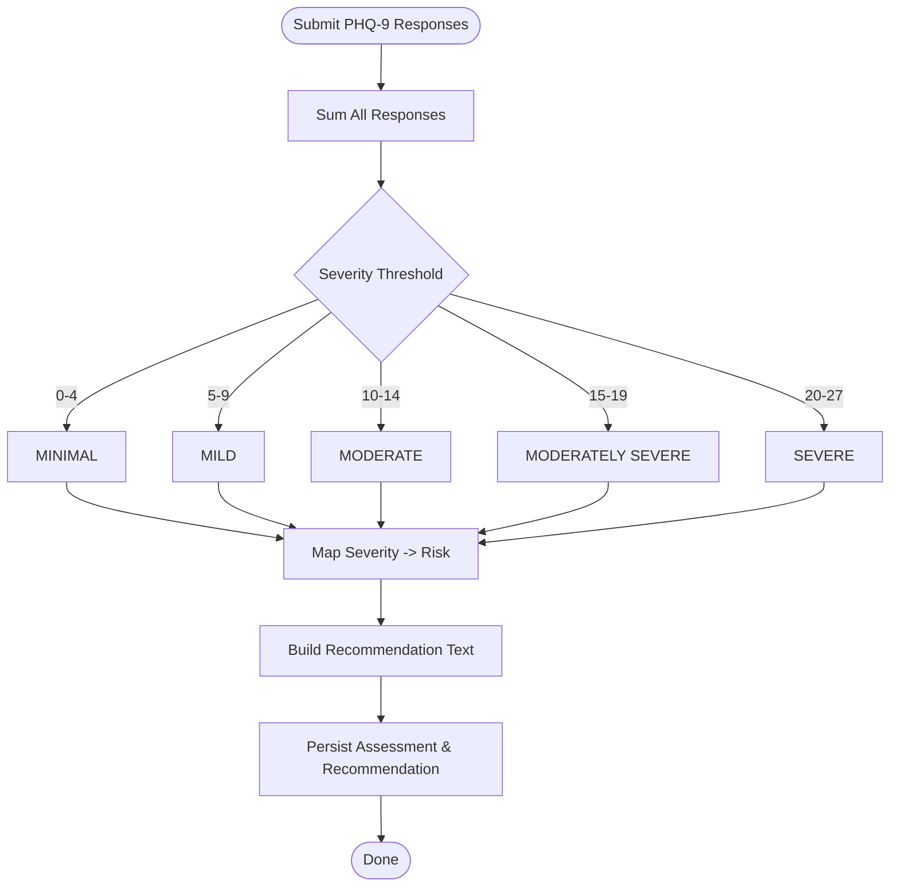
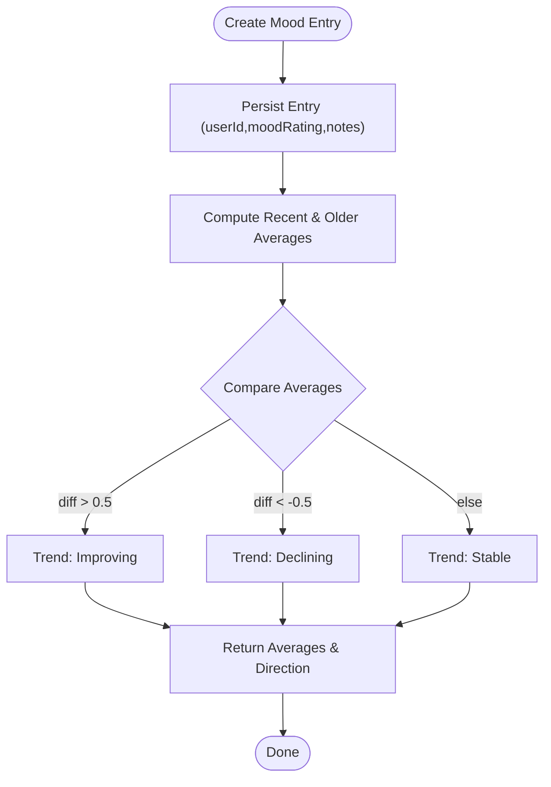
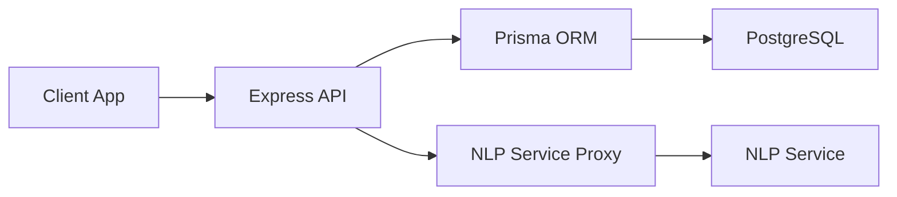

# Project Overview

<cite>
**Referenced Files in This Document**
- [README.md](file://README.md)
- [requirements.md](file://requirements.md)
- [client/README.md](file://client/README.md)
- [server/src/index.ts](file://server/src/index.ts)
- [server/src/services/nlp.service.ts](file://server/src/services/nlp.service.ts)
- [nlp-service/main.py](file://nlp-service/main.py)
- [nlp-service/models.py](file://nlp-service/models.py)
- [prisma/schema.prisma](file://prisma/schema.prisma)
- [client/src/lib/api.ts](file://client/src/lib/api.ts)
- [client/src/lib/auth.ts](file://client/src/lib/auth.ts)
- [server/src/controllers/auth.controller.ts](file://server/src/controllers/auth.controller.ts)
- [server/src/services/auth.service.ts](file://server/src/services/auth.service.ts)
- [server/src/services/assessment.service.ts](file://server/src/services/assessment.service.ts)
- [server/src/services/mood.service.ts](file://server/src/services/mood.service.ts)
- [server/src/services/chat.service.ts](file://server/src/services/chat.service.ts)
</cite>

## Table of Contents
1. [Introduction](#introduction)
2. [Project Structure](#project-structure)
3. [Core Components](#core-components)
4. [Architecture Overview](#architecture-overview)
5. [Detailed Component Analysis](#detailed-component-analysis)
6. [Dependency Analysis](#dependency-analysis)
7. [Performance Considerations](#performance-considerations)
8. [Troubleshooting Guide](#troubleshooting-guide)
9. [Conclusion](#conclusion)

## Introduction
BuddyAI is an AI-powered mental health support platform designed specifically for tertiary institution students experiencing symptoms of depression. Its purpose is to serve as an early intervention tool that detects potential depressive symptoms, provides continuous emotional monitoring, and offers personalized support recommendations. The system integrates conversational AI, sentiment analysis, PHQ-9 assessment, and mood tracking to encourage timely professional help while remaining clearly positioned as a supportive tool rather than a replacement for professional care.

Target audience
- Tertiary institution students seeking confidential, accessible mental health support
- Counsellors needing oversight of high-risk cases and system-generated insights
- Institution administrators requiring monitoring and reporting capabilities

Problem statement
- Students face significant mental health challenges due to academic pressure, financial stress, social isolation, and personal issues
- Barriers such as stigma, lack of awareness, limited access to counseling services, and delayed symptom recognition prevent many from seeking help
- BuddyAI addresses these barriers by offering early detection, continuous monitoring, personalized guidance, and seamless referral pathways

System role
- BuddyAI augments institutional mental health resources by providing immediate, low-barrier support and timely risk identification
- It emphasizes confidentiality, accessibility, and early intervention to reduce the burden on formal services and improve outcomes

Practical examples
- A student logs in, chats with the AI, and receives contextual, empathetic responses grounded in sentiment analysis
- The student completes a PHQ-9 assessment; the system calculates a score, classifies severity, and generates tailored recommendations
- Over time, the platform tracks mood trends and highlights concerning shifts, prompting personalized self-help suggestions or alerting counsellors when needed

How it addresses barriers
- Stigma reduction: AI-driven, anonymous, and nonjudgmental support encourages engagement
- Access improvement: 24/7 availability and web-based interface removes geographic and scheduling constraints
- Awareness enhancement: Continuous monitoring and personalized insights help students recognize and articulate their needs

**Section sources**
- [README.md:1-31](file://README.md#L1-L31)
- [README.md:9-18](file://README.md#L9-L18)
- [requirements.md:323-391](file://requirements.md#L323-L391)

## Project Structure
The system follows a multi-tier architecture with clear separation between presentation, backend services, AI processing, and data management. The frontend is a Next.js application, the backend is an Express server, the AI layer is a dedicated NLP microservice, and the data layer uses PostgreSQL with Prisma ORM.

**Diagram sources**
- [server/src/index.ts:1-35](file://server/src/index.ts#L1-L35)
- [server/src/services/nlp.service.ts:1-24](file://server/src/services/nlp.service.ts#L1-L24)
- [nlp-service/main.py:1-71](file://nlp-service/main.py#L1-L71)
- [nlp-service/models.py:1-26](file://nlp-service/models.py#L1-L26)
- [prisma/schema.prisma:1-134](file://prisma/schema.prisma#L1-L134)
- [client/src/lib/api.ts:1-36](file://client/src/lib/api.ts#L1-L36)
- [client/src/lib/auth.ts:1-27](file://client/src/lib/auth.ts#L1-L27)

**Section sources**
- [README.md:125-211](file://README.md#L125-L211)
- [client/README.md:1-37](file://client/README.md#L1-L37)

## Core Components
- Conversational AI and chat: Enables natural, context-aware conversations with sentiment-informed responses and secure message storage
- Sentiment analysis engine: Processes user messages using NLTK/VADER to detect positive, neutral, or negative emotional tone and produce sentiment scores
- PHQ-9 assessment integration: Provides structured depression screening, automated scoring, severity classification, and recommendation generation
- Mood monitoring: Supports daily mood logging, trend analysis, and longitudinal tracking to identify changes over time
- Authentication and authorization: Implements secure login, JWT-based sessions, role-based access control, and protected endpoints
- Administrative dashboard: Offers counsellor oversight of risk alerts, student summaries, and system reports

**Section sources**
- [README.md:35-83](file://README.md#L35-L83)
- [requirements.md:25-221](file://requirements.md#L25-L221)

## Architecture Overview
BuddyAI employs a multi-tier intelligent system architecture:
- Presentation Layer: Next.js web interface for students and administrators
- Backend Application Layer: Express server orchestrating business logic and API routes
- AI Services Layer: NLP microservice for text preprocessing and VADER sentiment analysis
- Data Layer: PostgreSQL with Prisma ORM for persistent storage and relationships

**Diagram sources**
- [README.md:125-211](file://README.md#L125-L211)
- [server/src/index.ts:13-35](file://server/src/index.ts#L13-L35)

**Section sources**
- [README.md:125-211](file://README.md#L125-L211)

## Detailed Component Analysis

### Authentication and Authorization
- Registration and login manage secure credential handling, password hashing, and JWT issuance
- Protected routes enforce role-based access control, ensuring students and counsellors access only permitted features
- Frontend utilities persist tokens and user metadata, injecting Authorization headers for API calls

**Diagram sources**
- [server/src/controllers/auth.controller.ts:1-50](file://server/src/controllers/auth.controller.ts#L1-L50)
- [server/src/services/auth.service.ts:1-72](file://server/src/services/auth.service.ts#L1-L72)
- [prisma/schema.prisma:47-61](file://prisma/schema.prisma#L47-L61)

**Section sources**
- [server/src/controllers/auth.controller.ts:1-50](file://server/src/controllers/auth.controller.ts#L1-L50)
- [server/src/services/auth.service.ts:1-72](file://server/src/services/auth.service.ts#L1-L72)
- [client/src/lib/auth.ts:1-27](file://client/src/lib/auth.ts#L1-L27)
- [client/src/lib/api.ts:1-36](file://client/src/lib/api.ts#L1-L36)

### Conversational AI and Sentiment Analysis
- The chat service validates conversation ownership, analyzes user messages via the NLP proxy, and persists both user and bot messages
- The NLP proxy forwards text to the standalone NLP service, which preprocesses text and applies VADER to produce sentiment classification and scores
- Bot responses are contextually tailored to sentiment and optional sentiment scores

**Diagram sources**
- [server/src/services/chat.service.ts:1-105](file://server/src/services/chat.service.ts#L1-L105)
- [server/src/services/nlp.service.ts:1-24](file://server/src/services/nlp.service.ts#L1-L24)
- [nlp-service/main.py:43-64](file://nlp-service/main.py#L43-L64)
- [nlp-service/models.py:4-26](file://nlp-service/models.py#L4-L26)

**Section sources**
- [server/src/services/chat.service.ts:1-105](file://server/src/services/chat.service.ts#L1-L105)
- [server/src/services/nlp.service.ts:1-24](file://server/src/services/nlp.service.ts#L1-L24)
- [nlp-service/main.py:1-71](file://nlp-service/main.py#L1-L71)
- [nlp-service/models.py:1-26](file://nlp-service/models.py#L1-L26)

### PHQ-9 Assessment and Risk Classification
- The assessment service computes total scores from responses, classifies severity, and generates recommendations based on severity thresholds
- Risk levels are mapped from severity categories and persisted alongside recommendations and assessments
- The system ensures assessments are associated with the correct user and ordered chronologically

**Diagram sources**
- [server/src/services/assessment.service.ts:12-89](file://server/src/services/assessment.service.ts#L12-L89)
- [prisma/schema.prisma:97-108](file://prisma/schema.prisma#L97-L108)

**Section sources**
- [server/src/services/assessment.service.ts:1-89](file://server/src/services/assessment.service.ts#L1-L89)
- [prisma/schema.prisma:97-108](file://prisma/schema.prisma#L97-L108)

### Mood Monitoring and Trend Analysis
- Students log daily mood ratings with optional notes; the system aggregates entries and computes recent vs. older averages
- Trend direction is determined by comparing recent and historical averages, enabling “improving,” “declining,” or “stable” classifications
- Historical mood data supports longitudinal insights and recommendation refinement

**Diagram sources**
- [server/src/services/mood.service.ts:1-58](file://server/src/services/mood.service.ts#L1-L58)
- [prisma/schema.prisma:86-95](file://prisma/schema.prisma#L86-L95)

**Section sources**
- [server/src/services/mood.service.ts:1-58](file://server/src/services/mood.service.ts#L1-L58)
- [prisma/schema.prisma:86-95](file://prisma/schema.prisma#L86-L95)

### Administrative Dashboard and Alerts
- Counsellors can review flagged high-risk and severe-risk cases, update alert statuses, and generate reports
- Risk alerts are triggered by PHQ-9 assessments meeting threshold criteria and linked to the relevant assessment and user
- The dashboard consolidates summaries and trends to guide intervention decisions

**Section sources**
- [requirements.md:203-221](file://requirements.md#L203-L221)
- [prisma/schema.prisma:121-133](file://prisma/schema.prisma#L121-L133)

## Dependency Analysis
The system exhibits clear layering and minimal coupling:
- Frontend depends on the backend API and local auth utilities
- Backend depends on Prisma for data access and the NLP service for sentiment analysis
- NLP service encapsulates NLTK/VADER logic and exposes a simple REST API
- Database schema defines strong relationships and enumerations for consistent domain modeling

**Diagram sources**
- [server/src/index.ts:13-35](file://server/src/index.ts#L13-L35)
- [server/src/services/nlp.service.ts:11-23](file://server/src/services/nlp.service.ts#L11-L23)
- [nlp-service/main.py:28-71](file://nlp-service/main.py#L28-L71)
- [prisma/schema.prisma:1-134](file://prisma/schema.prisma#L1-134)

**Section sources**
- [server/src/index.ts:1-35](file://server/src/index.ts#L1-L35)
- [server/src/services/nlp.service.ts:1-24](file://server/src/services/nlp.service.ts#L1-L24)
- [nlp-service/main.py:1-71](file://nlp-service/main.py#L1-L71)
- [prisma/schema.prisma:1-134](file://prisma/schema.prisma#L1-L134)

## Performance Considerations
- Real-time sentiment analysis: The NLP service is invoked per message; ensure adequate capacity and consider caching repeated inputs
- Database queries: Use Prisma’s indexing and pagination for assessment and mood history retrieval; avoid large unfiltered scans
- Recommendation generation: Keep rule-based logic lightweight; offload heavy analytics to batch jobs if needed
- Frontend responsiveness: Debounce chat inputs and batch UI updates to minimize re-renders

## Troubleshooting Guide
Common issues and resolutions
- Authentication failures: Verify token presence and validity; confirm backend route protection and frontend Authorization header injection
- NLP service unavailability: The chat service continues without sentiment when NLP is down; monitor NLP health endpoint and network connectivity
- Database connection errors: Confirm DATABASE_URL environment variable and Prisma client initialization
- CORS issues: Ensure NLP service allows origins and headers; validate frontend API base URL configuration

Operational checks
- Health endpoints: Use backend /health and NLP /health to validate service readiness
- Logs: Inspect backend and NLP service logs for exceptions and error messages
- Network: Confirm container/service networking if using Docker Compose

**Section sources**
- [client/src/lib/api.ts:20-35](file://client/src/lib/api.ts#L20-L35)
- [server/src/services/chat.service.ts:58-65](file://server/src/services/chat.service.ts#L58-L65)
- [nlp-service/main.py:61-64](file://nlp-service/main.py#L61-L64)
- [server/src/index.ts:18-20](file://server/src/index.ts#L18-L20)

## Conclusion
BuddyAI delivers a comprehensive, accessible, and scalable solution for mental health support in tertiary institutions. By combining conversational AI, sentiment analysis, structured assessment, and continuous mood monitoring, it helps students recognize warning signs, engage with support resources, and connect with professionals when needed. The system’s layered architecture, robust data model, and clear separation of concerns position it for maintainability, security, and growth while reinforcing its supportive role alongside professional care.