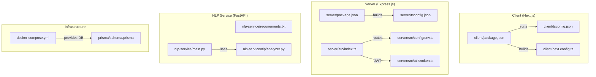
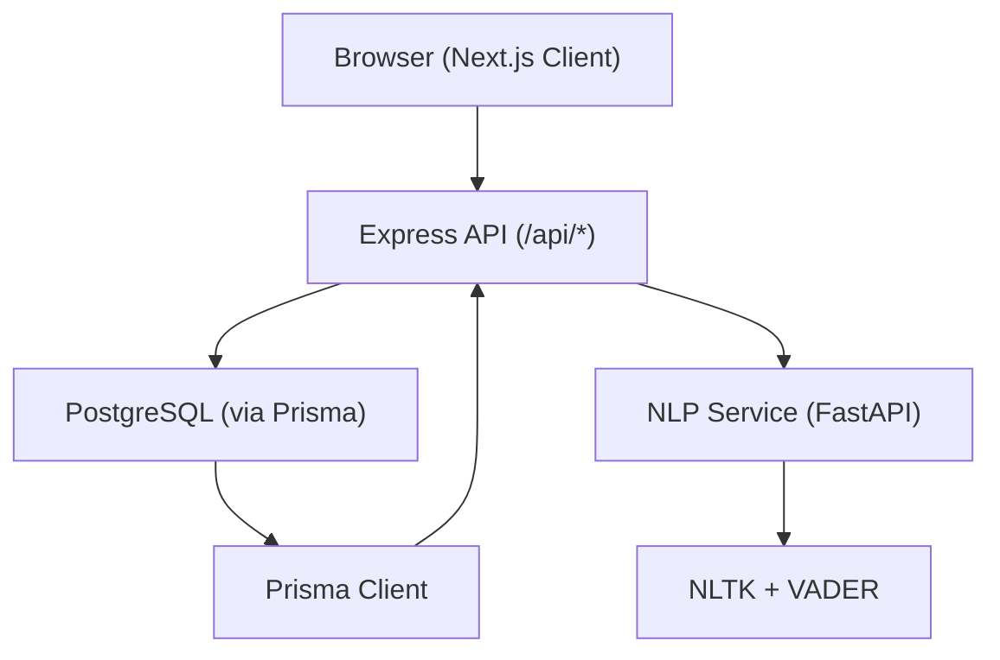
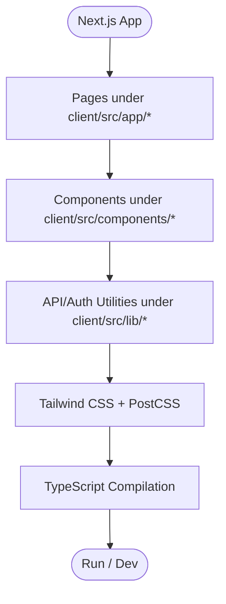
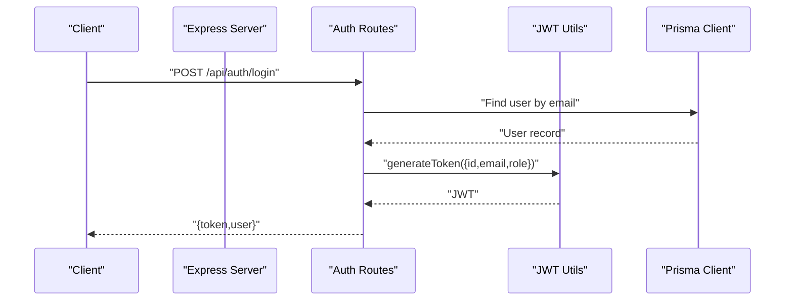
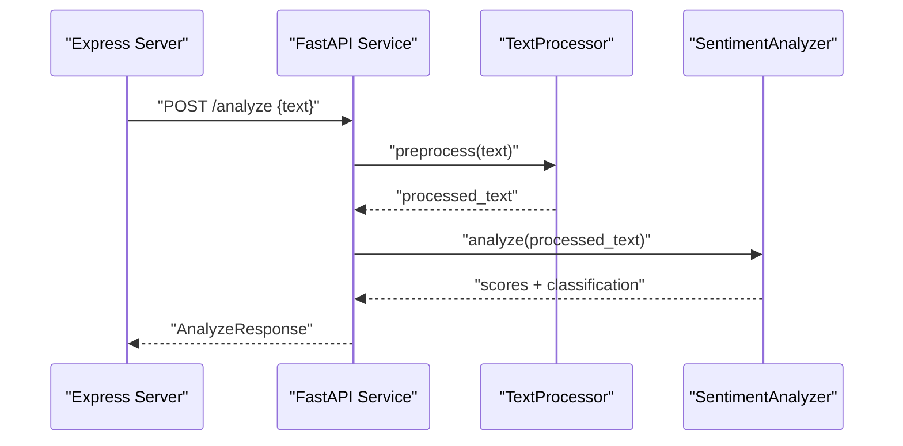
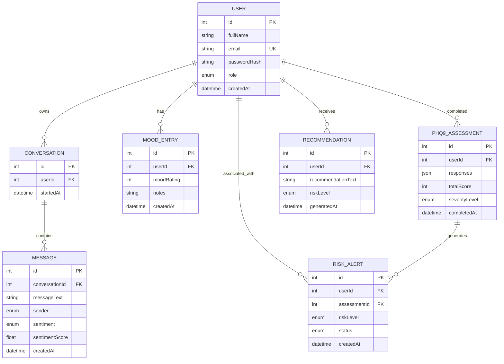
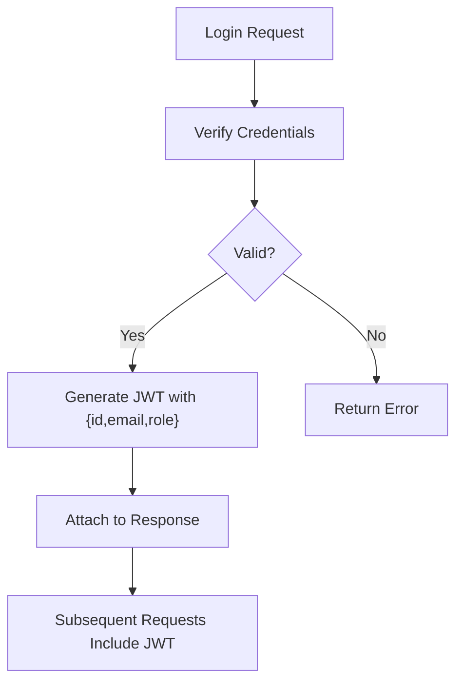
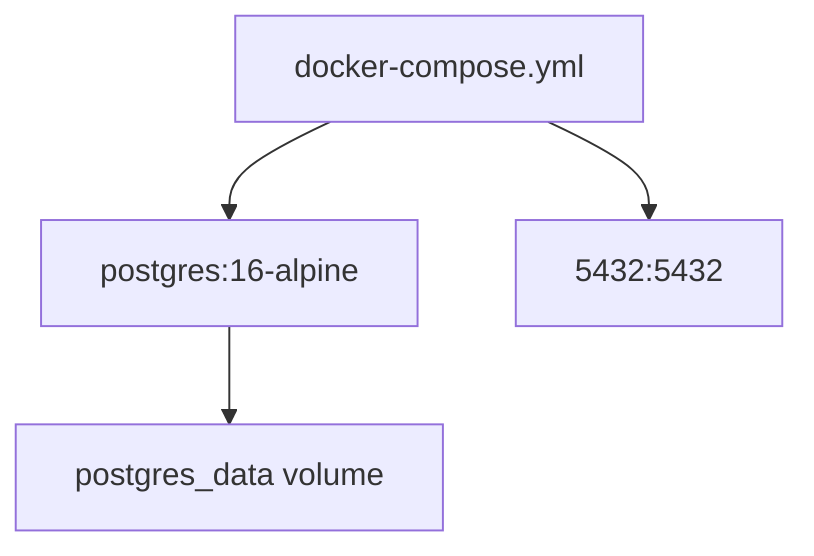
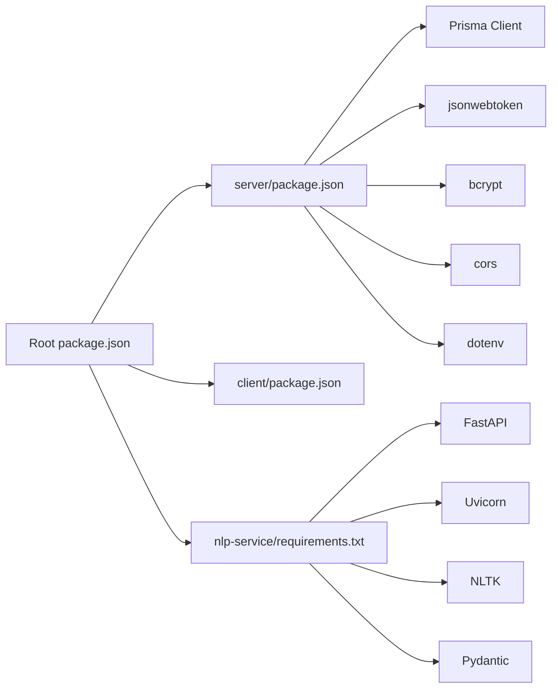

# Technology Stack

<cite>
**Referenced Files in This Document**
- [package.json](file://package.json)
- [docker-compose.yml](file://docker-compose.yml)
- [prisma/schema.prisma](file://prisma/schema.prisma)
- [client/package.json](file://client/package.json)
- [client/tsconfig.json](file://client/tsconfig.json)
- [client/next.config.ts](file://client/next.config.ts)
- [server/package.json](file://server/package.json)
- [server/tsconfig.json](file://server/tsconfig.json)
- [server/src/index.ts](file://server/src/index.ts)
- [server/src/config/env.ts](file://server/src/config/env.ts)
- [server/src/utils/token.ts](file://server/src/utils/token.ts)
- [server/vitest.config.ts](file://server/vitest.config.ts)
- [nlp-service/requirements.txt](file://nlp-service/requirements.txt)
- [nlp-service/main.py](file://nlp-service/main.py)
- [nlp-service/nlp/analyzer.py](file://nlp-service/nlp/analyzer.py)
</cite>

## Table of Contents
1. [Introduction](#introduction)
2. [Project Structure](#project-structure)
3. [Core Components](#core-components)
4. [Architecture Overview](#architecture-overview)
5. [Detailed Component Analysis](#detailed-component-analysis)
6. [Dependency Analysis](#dependency-analysis)
7. [Performance Considerations](#performance-considerations)
8. [Troubleshooting Guide](#troubleshooting-guide)
9. [Version Compatibility and Upgrade Paths](#version-compatibility-and-upgrade-paths)
10. [Conclusion](#conclusion)

## Introduction
This document describes the complete technology stack powering BuddyAI. It covers the frontend built on Next.js 16 with React 19, TypeScript, and Tailwind CSS; the backend powered by Express.js with TypeScript, Prisma ORM, and PostgreSQL; the NLP service implemented with FastAPI and Python, leveraging NLTK and VADER sentiment analysis; the authentication system using JWT tokens with role-based access control; containerization via Docker and Docker Compose; development environment setup; build and testing tools; and operational considerations such as deployment, monitoring, and upgrades.

## Project Structure
The repository is organized into three primary services plus shared configuration:
- Frontend: Next.js 16 application under client/
- Backend: Express.js server under server/ with TypeScript and Prisma
- NLP Service: FastAPI microservice under nlp-service/ with Python
- Shared infrastructure: Docker Compose for PostgreSQL under docker-compose.yml
- Database schema: Prisma schema under prisma/schema.prisma

**Diagram sources**
- [client/package.json:1-27](file://client/package.json#L1-L27)
- [client/tsconfig.json:1-35](file://client/tsconfig.json#L1-L35)
- [client/next.config.ts:1-8](file://client/next.config.ts#L1-L8)
- [server/package.json:1-36](file://server/package.json#L1-L36)
- [server/tsconfig.json:1-19](file://server/tsconfig.json#L1-L19)
- [server/src/index.ts:1-35](file://server/src/index.ts#L1-L35)
- [server/src/config/env.ts:1-12](file://server/src/config/env.ts#L1-L12)
- [server/src/utils/token.ts:1-17](file://server/src/utils/token.ts#L1-L17)
- [nlp-service/requirements.txt:1-6](file://nlp-service/requirements.txt#L1-L6)
- [nlp-service/main.py:1-71](file://nlp-service/main.py#L1-L71)
- [nlp-service/nlp/analyzer.py:1-27](file://nlp-service/nlp/analyzer.py#L1-L27)
- [docker-compose.yml:1-19](file://docker-compose.yml#L1-L19)
- [prisma/schema.prisma:1-134](file://prisma/schema.prisma#L1-L134)

**Section sources**
- [package.json:1-33](file://package.json#L1-L33)
- [docker-compose.yml:1-19](file://docker-compose.yml#L1-L19)
- [prisma/schema.prisma:1-134](file://prisma/schema.prisma#L1-L134)
- [client/package.json:1-27](file://client/package.json#L1-L27)
- [client/tsconfig.json:1-35](file://client/tsconfig.json#L1-L35)
- [client/next.config.ts:1-8](file://client/next.config.ts#L1-L8)
- [server/package.json:1-36](file://server/package.json#L1-L36)
- [server/tsconfig.json:1-19](file://server/tsconfig.json#L1-L19)
- [server/src/index.ts:1-35](file://server/src/index.ts#L1-L35)
- [server/src/config/env.ts:1-12](file://server/src/config/env.ts#L1-L12)
- [server/src/utils/token.ts:1-17](file://server/src/utils/token.ts#L1-L17)
- [nlp-service/requirements.txt:1-6](file://nlp-service/requirements.txt#L1-L6)
- [nlp-service/main.py:1-71](file://nlp-service/main.py#L1-L71)
- [nlp-service/nlp/analyzer.py:1-27](file://nlp-service/nlp/analyzer.py#L1-L27)

## Core Components
- Frontend: Next.js 16 with React 19, TypeScript, ESLint, Tailwind CSS, and PostCSS
- Backend: Express.js with TypeScript, Prisma ORM, JSON Web Tokens (JWT), bcrypt, CORS, dotenv
- NLP Service: FastAPI with Uvicorn, NLTK, VADER sentiment analysis, Pydantic models
- Database: PostgreSQL managed via Prisma migrations and Prisma Studio
- Containerization: Docker Compose with a named PostgreSQL service and persistent volume
- Testing: Vitest for backend, pytest implicitly via FastAPI test runner in nlp-service
- Build and Dev Scripts: npm scripts orchestrating concurrent dev/build/start across services

**Section sources**
- [client/package.json:1-27](file://client/package.json#L1-L27)
- [server/package.json:1-36](file://server/package.json#L1-L36)
- [nlp-service/requirements.txt:1-6](file://nlp-service/requirements.txt#L1-L6)
- [prisma/schema.prisma:1-134](file://prisma/schema.prisma#L1-L134)
- [docker-compose.yml:1-19](file://docker-compose.yml#L1-L19)
- [package.json:5-18](file://package.json#L5-L18)

## Architecture Overview
The system comprises three collaborating services:
- Client (Next.js) communicates with the backend REST API and requests NLP analysis via the NLP service.
- Backend (Express) exposes REST endpoints, authenticates users with JWT, enforces role-based access control, and integrates with PostgreSQL via Prisma.
- NLP Service (FastAPI) performs sentiment analysis using NLTK/VADER and returns structured results.
- Docker Compose provisions a persistent PostgreSQL instance for the backend.

**Diagram sources**
- [server/src/index.ts:1-35](file://server/src/index.ts#L1-L35)
- [prisma/schema.prisma:1-134](file://prisma/schema.prisma#L1-L134)
- [nlp-service/main.py:1-71](file://nlp-service/main.py#L1-L71)
- [nlp-service/nlp/analyzer.py:1-27](file://nlp-service/nlp/analyzer.py#L1-L27)
- [docker-compose.yml:1-19](file://docker-compose.yml#L1-L19)

## Detailed Component Analysis

### Frontend: Next.js 16, React 19, TypeScript, Tailwind CSS
- Framework and runtime: Next.js 16 with React 19
- Type safety: TypeScript compiler options configured for strictness and module resolution
- Styling: Tailwind CSS v4 with PostCSS pipeline
- Tooling: ESLint, build and dev scripts
- Routing: App Router pages under client/src/app/*
- Global styles: client/src/app/globals.css
- Navigation: client/src/components/Navbar.tsx
- API utilities: client/src/lib/api.ts and client/src/lib/auth.ts

**Diagram sources**
- [client/package.json:1-27](file://client/package.json#L1-L27)
- [client/tsconfig.json:1-35](file://client/tsconfig.json#L1-L35)
- [client/next.config.ts:1-8](file://client/next.config.ts#L1-L8)

**Section sources**
- [client/package.json:1-27](file://client/package.json#L1-L27)
- [client/tsconfig.json:1-35](file://client/tsconfig.json#L1-L35)
- [client/next.config.ts:1-8](file://client/next.config.ts#L1-L8)

### Backend: Express.js, TypeScript, Prisma, JWT Authentication
- Server entrypoint registers routes for auth, mood, assessments, conversations, risk, alerts, and dashboard
- Middleware: CORS enabled globally; centralized error handler registered last
- Environment configuration loads PORT, DATABASE_URL, JWT_SECRET, and NLP_SERVICE_URL
- JWT utilities provide token generation and verification with a typed payload
- Prisma schema defines enums and models for Users, Conversations, Messages, MoodEntries, Assessments, Recommendations, and RiskAlerts
- Role-based access control is represented by the Role enum (STUDENT, COUNSELLOR)

**Diagram sources**
- [server/src/index.ts:1-35](file://server/src/index.ts#L1-L35)
- [server/src/config/env.ts:1-12](file://server/src/config/env.ts#L1-L12)
- [server/src/utils/token.ts:1-17](file://server/src/utils/token.ts#L1-L17)
- [prisma/schema.prisma:47-61](file://prisma/schema.prisma#L47-L61)

**Section sources**
- [server/src/index.ts:1-35](file://server/src/index.ts#L1-L35)
- [server/src/config/env.ts:1-12](file://server/src/config/env.ts#L1-L12)
- [server/src/utils/token.ts:1-17](file://server/src/utils/token.ts#L1-L17)
- [prisma/schema.prisma:10-13](file://prisma/schema.prisma#L10-L13)

### NLP Service: FastAPI, NLTK, VADER
- FastAPI application with CORS middleware and health check endpoint
- Initializes TextProcessor and SentimentAnalyzer on startup
- Downloads required NLTK resources into a local directory to avoid permission issues
- Analyze endpoint preprocesses text and applies VADER sentiment scoring
- Returns structured results via Pydantic models

**Diagram sources**
- [nlp-service/main.py:1-71](file://nlp-service/main.py#L1-L71)
- [nlp-service/nlp/analyzer.py:1-27](file://nlp-service/nlp/analyzer.py#L1-L27)

**Section sources**
- [nlp-service/requirements.txt:1-6](file://nlp-service/requirements.txt#L1-L6)
- [nlp-service/main.py:1-71](file://nlp-service/main.py#L1-L71)
- [nlp-service/nlp/analyzer.py:1-27](file://nlp-service/nlp/analyzer.py#L1-L27)

### Database: PostgreSQL via Prisma
- Datasource provider set to PostgreSQL with DATABASE_URL from environment
- Enumerations for Role, Sentiment, Sender, SeverityLevel, RiskLevel, AlertStatus
- Models represent Users, Conversations, Messages, MoodEntries, Assessments, Recommendations, and RiskAlerts with relations and indexes

**Diagram sources**
- [prisma/schema.prisma:1-134](file://prisma/schema.prisma#L1-L134)

**Section sources**
- [prisma/schema.prisma:5-8](file://prisma/schema.prisma#L5-L8)
- [prisma/schema.prisma:10-45](file://prisma/schema.prisma#L10-L45)
- [prisma/schema.prisma:47-133](file://prisma/schema.prisma#L47-L133)

### Authentication and Authorization
- JWT-based authentication with secret loaded from environment
- Token payload includes user id, email, and role
- Role enum supports STUDENT and COUNSELLOR for RBAC
- Token generation and verification utilities

**Diagram sources**
- [server/src/utils/token.ts:1-17](file://server/src/utils/token.ts#L1-L17)
- [prisma/schema.prisma:10-13](file://prisma/schema.prisma#L10-L13)

**Section sources**
- [server/src/utils/token.ts:1-17](file://server/src/utils/token.ts#L1-L17)
- [prisma/schema.prisma:10-13](file://prisma/schema.prisma#L10-L13)

### Containerization and Deployment
- Docker Compose defines a postgres service with:
  - Image: postgres:16-alpine
  - Named container: buddyai-db
  - Persistent volume: postgres_data
  - Exposed port: 5432
  - Environment variables for user, password, and database name
- The root package.json orchestrates dev/build/start across server, client, and NLP service

**Diagram sources**
- [docker-compose.yml:1-19](file://docker-compose.yml#L1-L19)

**Section sources**
- [docker-compose.yml:1-19](file://docker-compose.yml#L1-L19)
- [package.json:5-18](file://package.json#L5-L18)

### Development Environment Setup
- Root scripts install dependencies for all services and run dev servers concurrently
- Backend: TypeScript compilation, nodemon watch mode, Vitest tests
- Frontend: Next.js dev server, ESLint, Tailwind CSS
- NLP Service: Python FastAPI with uvicorn
- Database: PostgreSQL via Docker Compose

**Section sources**
- [package.json:5-18](file://package.json#L5-L18)
- [server/package.json:6-12](file://server/package.json#L6-L12)
- [client/package.json:5-10](file://client/package.json#L5-L10)
- [nlp-service/requirements.txt:1-6](file://nlp-service/requirements.txt#L1-L6)
- [docker-compose.yml:1-19](file://docker-compose.yml#L1-L19)

## Dependency Analysis
- Frontend depends on Next.js, React, TypeScript, Tailwind CSS, and ESLint
- Backend depends on Express, Prisma Client, bcrypt, jsonwebtoken, dotenv, and CORS
- NLP Service depends on FastAPI, Uvicorn, NLTK, Pydantic, python-dotenv
- Root package orchestrates cross-service scripts and Prisma tooling

**Diagram sources**
- [package.json:1-33](file://package.json#L1-L33)
- [server/package.json:13-20](file://server/package.json#L13-L20)
- [client/package.json:11-15](file://client/package.json#L11-L15)
- [nlp-service/requirements.txt:1-6](file://nlp-service/requirements.txt#L1-L6)

**Section sources**
- [package.json:1-33](file://package.json#L1-L33)
- [server/package.json:13-20](file://server/package.json#L13-L20)
- [client/package.json:11-15](file://client/package.json#L11-L15)
- [nlp-service/requirements.txt:1-6](file://nlp-service/requirements.txt#L1-L6)

## Performance Considerations
- Frontend
  - Use Next.js static generation and caching where appropriate
  - Minimize Tailwind bundle size by purging unused styles
  - Enable incremental static regeneration for dynamic pages
- Backend
  - Keep database queries efficient with proper indexing and relations
  - Use connection pooling and limit concurrent heavy operations
  - Cache infrequent computations; avoid repeated NLP calls
- NLP Service
  - Pre-download NLTK resources once during initialization
  - Use batching for bulk sentiment analysis
  - Scale horizontally behind a reverse proxy
- Infrastructure
  - Persist PostgreSQL data using Docker volumes
  - Monitor container resource usage and tune JVM/worker processes

## Troubleshooting Guide
- Authentication
  - Verify JWT secret and expiration settings
  - Ensure token payload matches expected shape
- Database
  - Confirm DATABASE_URL format and connectivity
  - Run Prisma migrations and generate client after schema changes
- NLP Service
  - Check NLTK resource download logs and retry on failure
  - Validate CORS configuration for cross-origin requests
- Development
  - Use root scripts to start all services concurrently
  - Inspect health endpoints for each service

**Section sources**
- [server/src/config/env.ts:6-11](file://server/src/config/env.ts#L6-L11)
- [server/src/utils/token.ts:1-17](file://server/src/utils/token.ts#L1-L17)
- [prisma/schema.prisma:5-8](file://prisma/schema.prisma#L5-L8)
- [nlp-service/main.py:9-27](file://nlp-service/main.py#L9-L27)
- [package.json:5-18](file://package.json#L5-L18)

## Version Compatibility and Upgrade Paths
- Frontend
  - Next.js 16.2.9, React 19.2.4, TypeScript 5.x, Tailwind CSS 4.x
  - Upgrade path: Align minor versions; verify PostCSS and ESLint configs
- Backend
  - Express 4.21.x, TypeScript 5.x, Prisma 6.x, jsonwebtoken 9.x, bcrypt 5.x
  - Upgrade path: Increment patch versions; test route and middleware compatibility
- NLP Service
  - FastAPI, Uvicorn, NLTK, Pydantic, python-dotenv
  - Upgrade path: Pin compatible versions; test VADER and model serialization
- Database
  - PostgreSQL 16 via docker-compose; Prisma 6.x client
  - Upgrade path: Back up data, update image tag, run migrations
- Tooling
  - Vitest 4.x for backend tests; root scripts orchestrate dev/build/start
  - Upgrade path: Keep toolchains aligned with framework versions

[No sources needed since this section provides general guidance]

## Conclusion
BuddyAI’s stack combines a modern React frontend, a robust Express backend with Prisma and JWT, a dedicated NLP microservice, and containerized PostgreSQL. The documented architecture, components, and operational practices enable scalable development, testing, and deployment across environments.