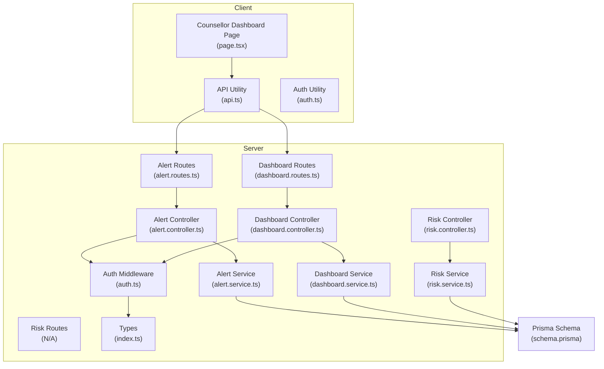
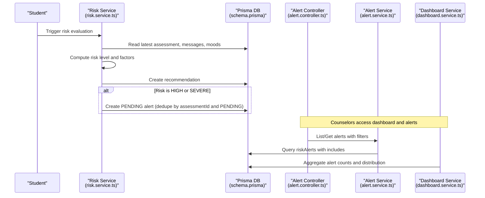
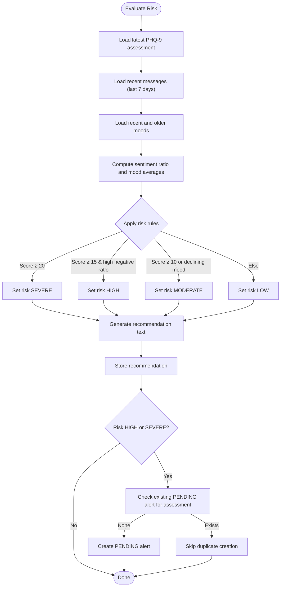
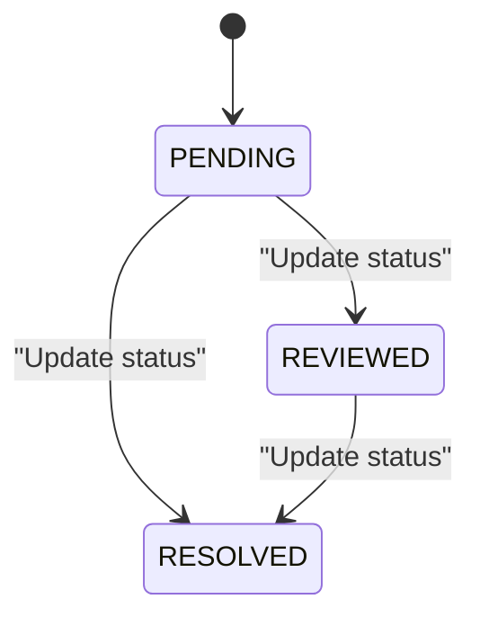
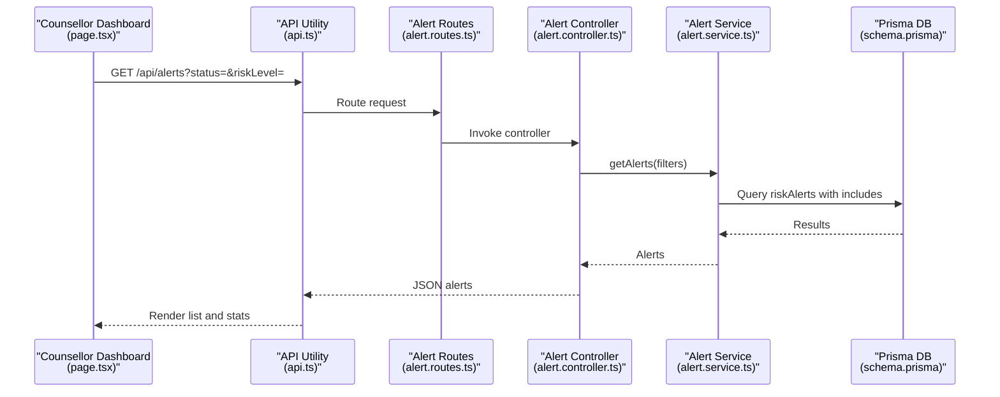
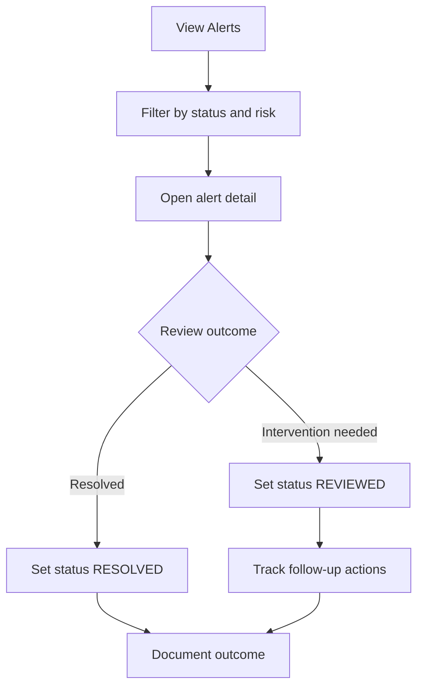
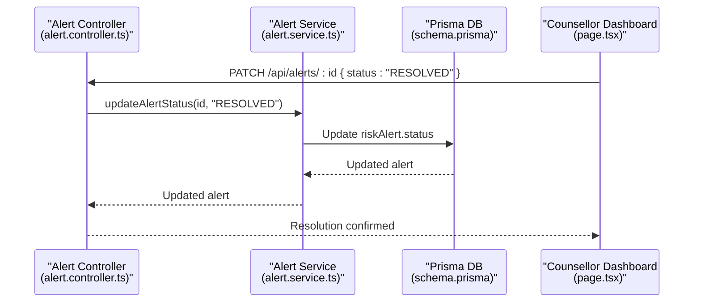
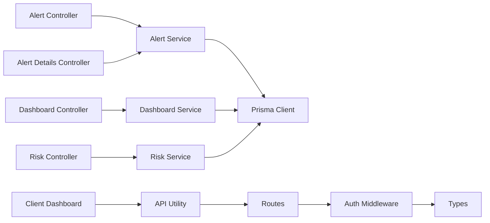

# Alert Management Workflow

<cite>
**Referenced Files in This Document**
- [alert.controller.ts](file://server/src/controllers/alert.controller.ts)
- [alert.service.ts](file://server/src/services/alert.service.ts)
- [alert.routes.ts](file://server/src/routes/alert.routes.ts)
- [risk.controller.ts](file://server/src/controllers/risk.controller.ts)
- [risk.service.ts](file://server/src/services/risk.service.ts)
- [dashboard.controller.ts](file://server/src/controllers/dashboard.controller.ts)
- [dashboard.service.ts](file://server/src/services/dashboard.service.ts)
- [dashboard.routes.ts](file://server/src/routes/dashboard.routes.ts)
- [auth.ts](file://server/src/middleware/auth.ts)
- [schema.prisma](file://prisma/schema.prisma)
- [index.ts](file://server/src/types/index.ts)
- [page.tsx](file://client/src/app/counsellor/dashboard/page.tsx)
- [api.ts](file://client/src/lib/api.ts)
- [auth.ts](file://client/src/lib/auth.ts)
</cite>

## Table of Contents
1. [Introduction](#introduction)
2. [Project Structure](#project-structure)
3. [Core Components](#core-components)
4. [Architecture Overview](#architecture-overview)
5. [Detailed Component Analysis](#detailed-component-analysis)
6. [Dependency Analysis](#dependency-analysis)
7. [Performance Considerations](#performance-considerations)
8. [Troubleshooting Guide](#troubleshooting-guide)
9. [Conclusion](#conclusion)
10. [Appendices](#appendices)

## Introduction
This document describes the alert management workflow from risk detection to resolution. It covers how risk evaluations trigger alert creation, the alert lifecycle states and transitions, counselor dashboards and review procedures, prioritization based on risk severity, and resolution documentation. It also outlines escalation pathways, reporting, and quality assurance considerations grounded in the repository’s backend controllers, services, routes, middleware, Prisma schema, and frontend dashboard.

## Project Structure
The alert management workflow spans:
- Backend routes and controllers for alert listing, retrieval, updates, and counselor dashboard statistics
- Risk evaluation service that generates risk levels and creates alerts when appropriate
- Prisma schema defining alert models, statuses, and relationships
- Frontend counselor dashboard for filtering, viewing, and navigating alerts
- Authentication and authorization middleware ensuring only counselors can access alert endpoints

**Diagram sources**
- [alert.routes.ts:1-15](file://server/src/routes/alert.routes.ts#L1-L15)
- [alert.controller.ts:1-70](file://server/src/controllers/alert.controller.ts#L1-L70)
- [alert.service.ts:1-62](file://server/src/services/alert.service.ts#L1-L62)
- [dashboard.routes.ts:1-11](file://server/src/routes/dashboard.routes.ts#L1-L11)
- [dashboard.controller.ts:1-13](file://server/src/controllers/dashboard.controller.ts#L1-L13)
- [dashboard.service.ts:1-19](file://server/src/services/dashboard.service.ts#L1-L19)
- [risk.controller.ts:1-32](file://server/src/controllers/risk.controller.ts#L1-L32)
- [risk.service.ts:1-138](file://server/src/services/risk.service.ts#L1-L138)
- [auth.ts:1-39](file://server/src/middleware/auth.ts#L1-L39)
- [index.ts:1-12](file://server/src/types/index.ts#L1-L12)
- [schema.prisma:1-134](file://prisma/schema.prisma#L1-L134)
- [page.tsx:1-213](file://client/src/app/counsellor/dashboard/page.tsx#L1-L213)
- [api.ts:1-36](file://client/src/lib/api.ts#L1-L36)
- [auth.ts:1-27](file://client/src/lib/auth.ts#L1-L27)

**Section sources**
- [alert.routes.ts:1-15](file://server/src/routes/alert.routes.ts#L1-L15)
- [alert.controller.ts:1-70](file://server/src/controllers/alert.controller.ts#L1-L70)
- [alert.service.ts:1-62](file://server/src/services/alert.service.ts#L1-L62)
- [dashboard.routes.ts:1-11](file://server/src/routes/dashboard.routes.ts#L1-L11)
- [dashboard.controller.ts:1-13](file://server/src/controllers/dashboard.controller.ts#L1-L13)
- [dashboard.service.ts:1-19](file://server/src/services/dashboard.service.ts#L1-L19)
- [risk.controller.ts:1-32](file://server/src/controllers/risk.controller.ts#L1-L32)
- [risk.service.ts:1-138](file://server/src/services/risk.service.ts#L1-L138)
- [auth.ts:1-39](file://server/src/middleware/auth.ts#L1-L39)
- [index.ts:1-12](file://server/src/types/index.ts#L1-L12)
- [schema.prisma:1-134](file://prisma/schema.prisma#L1-L134)
- [page.tsx:1-213](file://client/src/app/counsellor/dashboard/page.tsx#L1-L213)
- [api.ts:1-36](file://client/src/lib/api.ts#L1-L36)
- [auth.ts:1-27](file://client/src/lib/auth.ts#L1-L27)

## Core Components
- Alert model and lifecycle
  - Alert status enum includes PENDING, REVIEWED, RESOLVED
  - Alerts link users and assessments and track risk level and creation timestamps
- Risk evaluation pipeline
  - Evaluates PHQ-9 scores, recent message sentiment, and mood trends
  - Generates risk levels and recommendations
  - Creates PENDING alerts for HIGH and SEVERE risk when no duplicate exists
- Alert management endpoints
  - List alerts with optional status and risk filters
  - Retrieve individual alert with related user and assessment
  - Update alert status to PENDING, REVIEWED, or RESOLVED
  - Fetch student summary for counselor review
- Counselor dashboard
  - Displays total alerts, pending, reviewed, resolved counts
  - Filters alerts by status and risk level
  - Navigates to alert detail pages
- Authentication and authorization
  - Bearer token authentication
  - Role gating for counselors on alert and dashboard endpoints

**Section sources**
- [schema.prisma:41-45](file://prisma/schema.prisma#L41-L45)
- [schema.prisma:121-133](file://prisma/schema.prisma#L121-L133)
- [risk.service.ts:11-107](file://server/src/services/risk.service.ts#L11-L107)
- [alert.controller.ts:5-69](file://server/src/controllers/alert.controller.ts#L5-L69)
- [alert.service.ts:3-33](file://server/src/services/alert.service.ts#L3-L33)
- [page.tsx:28-212](file://client/src/app/counsellor/dashboard/page.tsx#L28-L212)
- [auth.ts:5-38](file://server/src/middleware/auth.ts#L5-L38)

## Architecture Overview
The alert lifecycle is initiated by risk evaluation and managed via dedicated endpoints. The counselor dashboard aggregates statistics and lists alerts for review and action.

**Diagram sources**
- [risk.service.ts:11-107](file://server/src/services/risk.service.ts#L11-L107)
- [schema.prisma:121-133](file://prisma/schema.prisma#L121-L133)
- [alert.controller.ts:5-69](file://server/src/controllers/alert.controller.ts#L5-L69)
- [alert.service.ts:3-33](file://server/src/services/alert.service.ts#L3-L33)
- [dashboard.service.ts:3-18](file://server/src/services/dashboard.service.ts#L3-L18)

## Detailed Component Analysis

### Alert Creation from Risk Evaluation
- Inputs considered:
  - Latest PHQ-9 total score
  - Recent messages (last 7 days) sentiment breakdown
  - Mood averages for last 7 days vs previous 7–30 days
- Decision logic:
  - Scores ≥ 20 → SEVERE
  - Scores ≥ 15 with high negative sentiment ratio → HIGH
  - Scores ≥ 10 or declining mood trend → MODERATE
  - Otherwise → LOW
- Outputs:
  - Recommendation stored per user
  - PENDING alert created only if risk is HIGH or SEVERE and no matching PENDING alert exists for the latest assessment

**Diagram sources**
- [risk.service.ts:11-107](file://server/src/services/risk.service.ts#L11-L107)

**Section sources**
- [risk.service.ts:11-107](file://server/src/services/risk.service.ts#L11-L107)
- [schema.prisma:121-133](file://prisma/schema.prisma#L121-L133)

### Alert States and Transitions
- States: PENDING, REVIEWED, RESOLVED
- Allowed transitions:
  - PENDING → REVIEWED
  - PENDING → RESOLVED
  - REVIEWED → RESOLVED
- Transition enforcement:
  - Controllers validate status values against the allowed set
  - Updates occur atomically via Prisma

**Diagram sources**
- [alert.controller.ts:37-40](file://server/src/controllers/alert.controller.ts#L37-L40)
- [schema.prisma:41-45](file://prisma/schema.prisma#L41-L45)

**Section sources**
- [alert.controller.ts:32-53](file://server/src/controllers/alert.controller.ts#L32-L53)
- [alert.service.ts:28-33](file://server/src/services/alert.service.ts#L28-L33)
- [schema.prisma:41-45](file://prisma/schema.prisma#L41-L45)

### Counselor Notification and Escalation
- Dashboard overview:
  - Total alerts, pending, reviewed, resolved counts
  - Filter by status and risk level
- Navigation:
  - Clickable rows navigate to alert detail pages
- Escalation:
  - Alerts with HIGH/SEVERE risk are automatically created as PENDING
  - Manual review and status updates move alerts toward resolution

**Diagram sources**
- [page.tsx:49-80](file://client/src/app/counsellor/dashboard/page.tsx#L49-L80)
- [api.ts:3-35](file://client/src/lib/api.ts#L3-L35)
- [alert.routes.ts:7-12](file://server/src/routes/alert.routes.ts#L7-L12)
- [alert.controller.ts:5-16](file://server/src/controllers/alert.controller.ts#L5-L16)
- [alert.service.ts:3-16](file://server/src/services/alert.service.ts#L3-L16)
- [schema.prisma:121-133](file://prisma/schema.prisma#L121-L133)

**Section sources**
- [page.tsx:28-212](file://client/src/app/counsellor/dashboard/page.tsx#L28-L212)
- [alert.routes.ts:7-12](file://server/src/routes/alert.routes.ts#L7-L12)
- [alert.controller.ts:5-16](file://server/src/controllers/alert.controller.ts#L5-L16)
- [alert.service.ts:3-16](file://server/src/services/alert.service.ts#L3-L16)

### Alert Prioritization and Review
- Prioritization basis:
  - Risk level (LOW, MODERATE, HIGH, SEVERE) derived from PHQ-9, sentiment, and mood trends
- Review process:
  - Counselors filter by status and risk level
  - Open alert detail to review user and assessment context
  - Update status to REVIEWED or RESOLVED

**Diagram sources**
- [page.tsx:138-167](file://client/src/app/counsellor/dashboard/page.tsx#L138-L167)
- [alert.controller.ts:32-53](file://server/src/controllers/alert.controller.ts#L32-L53)

**Section sources**
- [risk.service.ts:56-73](file://server/src/services/risk.service.ts#L56-L73)
- [page.tsx:138-167](file://client/src/app/counsellor/dashboard/page.tsx#L138-L167)
- [alert.controller.ts:32-53](file://server/src/controllers/alert.controller.ts#L32-L53)

### Resolution Process and Outcomes
- Resolution steps:
  - Counselor reviews alert and related student summary
  - Update status to RESOLVED after documented follow-up and outcomes
- Data included in summaries:
  - Latest assessment, recent moods, sentiment breakdown, recommendations

**Diagram sources**
- [alert.controller.ts:32-53](file://server/src/controllers/alert.controller.ts#L32-L53)
- [alert.service.ts:28-33](file://server/src/services/alert.service.ts#L28-L33)
- [schema.prisma:121-127](file://prisma/schema.prisma#L121-L127)

**Section sources**
- [alert.controller.ts:32-53](file://server/src/controllers/alert.controller.ts#L32-L53)
- [alert.service.ts:28-33](file://server/src/services/alert.service.ts#L28-L33)
- [alert.service.ts:35-61](file://server/src/services/alert.service.ts#L35-L61)

### Typical Scenarios and Timelines
- Scenario A: Severe risk detected
  - Risk evaluation → recommendation stored → PENDING alert created
  - Timeline: minutes to hours depending on evaluation cadence
- Scenario B: Moderate risk with declining mood
  - Risk evaluation → recommendation stored → counselor review → status updated
  - Timeline: same-day to next business day
- Scenario C: Low risk
  - Risk evaluation → recommendation stored → no alert created
  - Timeline: immediate feedback to student

**Section sources**
- [risk.service.ts:87-104](file://server/src/services/risk.service.ts#L87-L104)
- [risk.service.ts:122-137](file://server/src/services/risk.service.ts#L122-L137)

### Reporting and Quality Assurance
- Reporting:
  - Dashboard statistics include total alerts, pending, reviewed, resolved, and risk distribution
- Quality assurance:
  - Deduplication prevents multiple PENDING alerts for the same assessment
  - Strict status validation prevents invalid transitions
  - Role-gated endpoints restrict access to counselors

**Section sources**
- [dashboard.service.ts:3-18](file://server/src/services/dashboard.service.ts#L3-L18)
- [alert.controller.ts:37-40](file://server/src/controllers/alert.controller.ts#L37-L40)
- [alert.routes.ts:7](file://server/src/routes/alert.routes.ts#L7)
- [dashboard.routes.ts:7](file://server/src/routes/dashboard.routes.ts#L7)

## Dependency Analysis
- Controllers depend on services for data access and business logic
- Services depend on Prisma for database operations
- Routes enforce authentication and role checks via middleware
- Frontend dashboard depends on API utilities and local storage for auth tokens

**Diagram sources**
- [alert.controller.ts:1-70](file://server/src/controllers/alert.controller.ts#L1-L70)
- [alert.service.ts:1-62](file://server/src/services/alert.service.ts#L1-L62)
- [dashboard.controller.ts:1-13](file://server/src/controllers/dashboard.controller.ts#L1-L13)
- [dashboard.service.ts:1-19](file://server/src/services/dashboard.service.ts#L1-L19)
- [risk.controller.ts:1-32](file://server/src/controllers/risk.controller.ts#L1-L32)
- [risk.service.ts:1-138](file://server/src/services/risk.service.ts#L1-L138)
- [alert.routes.ts:1-15](file://server/src/routes/alert.routes.ts#L1-L15)
- [dashboard.routes.ts:1-11](file://server/src/routes/dashboard.routes.ts#L1-L11)
- [auth.ts:1-39](file://server/src/middleware/auth.ts#L1-L39)
- [index.ts:1-12](file://server/src/types/index.ts#L1-L12)
- [page.tsx:1-213](file://client/src/app/counsellor/dashboard/page.tsx#L1-L213)
- [api.ts:1-36](file://client/src/lib/api.ts#L1-L36)

**Section sources**
- [alert.controller.ts:1-70](file://server/src/controllers/alert.controller.ts#L1-L70)
- [alert.service.ts:1-62](file://server/src/services/alert.service.ts#L1-L62)
- [dashboard.controller.ts:1-13](file://server/src/controllers/dashboard.controller.ts#L1-L13)
- [dashboard.service.ts:1-19](file://server/src/services/dashboard.service.ts#L1-L19)
- [risk.controller.ts:1-32](file://server/src/controllers/risk.controller.ts#L1-L32)
- [risk.service.ts:1-138](file://server/src/services/risk.service.ts#L1-L138)
- [alert.routes.ts:1-15](file://server/src/routes/alert.routes.ts#L1-L15)
- [dashboard.routes.ts:1-11](file://server/src/routes/dashboard.routes.ts#L1-L11)
- [auth.ts:1-39](file://server/src/middleware/auth.ts#L1-L39)
- [index.ts:1-12](file://server/src/types/index.ts#L1-L12)
- [page.tsx:1-213](file://client/src/app/counsellor/dashboard/page.tsx#L1-L213)
- [api.ts:1-36](file://client/src/lib/api.ts#L1-L36)

## Performance Considerations
- Database queries
  - Alert listing uses filtered queries with ordering and includes; ensure indexes on userId and assessmentId for scalability
  - Dashboard aggregation uses count/groupBy; consider caching periodic stats
- Network requests
  - Client uses concurrent requests for stats and alerts; ensure backend rate limiting and pagination for large datasets
- Token verification
  - Middleware performs token verification per request; keep token verification efficient and secure

[No sources needed since this section provides general guidance]

## Troubleshooting Guide
- Unauthorized or missing token
  - Symptom: 401 responses on protected endpoints
  - Action: Verify Authorization header and token validity; redirect to login if missing
- Access denied for roles
  - Symptom: 403 responses when non-counselors access alert endpoints
  - Action: Confirm user role and re-authenticate
- Invalid status update
  - Symptom: 400 response when updating alert status
  - Action: Ensure status is one of PENDING, REVIEWED, RESOLVED
- Alert not found
  - Symptom: 404 response when retrieving or updating non-existent alert
  - Action: Verify alert ID and existence in DB

**Section sources**
- [auth.ts:5-22](file://server/src/middleware/auth.ts#L5-L22)
- [alert.controller.ts:37-46](file://server/src/controllers/alert.controller.ts#L37-L46)
- [alert.controller.ts:22-25](file://server/src/controllers/alert.controller.ts#L22-L25)

## Conclusion
The alert management workflow integrates risk evaluation, automatic alert creation, counselor review, and resolution tracking. The system enforces strict state transitions, supports filtering and dashboards, and maintains audit trails via the database. Extending the system could include automated escalations, email notifications, and intervention logging.

[No sources needed since this section summarizes without analyzing specific files]

## Appendices

### Endpoint Reference
- GET /api/alerts
  - Query parameters: status, riskLevel
  - Response: array of alerts with user and assessment includes
- GET /api/alerts/:id
  - Response: single alert with user and assessment includes
- PATCH /api/alerts/:id
  - Body: { status: "PENDING" | "REVIEWED" | "RESOLVED" }
  - Response: updated alert
- GET /api/alerts/:id/student
  - Response: student summary (user, latest assessment, mood summary, sentiment breakdown, recommendations)
- GET /api/dashboard/stats
  - Response: aggregated alert counts and risk distribution

**Section sources**
- [alert.routes.ts:9-12](file://server/src/routes/alert.routes.ts#L9-L12)
- [alert.controller.ts:5-69](file://server/src/controllers/alert.controller.ts#L5-L69)
- [dashboard.routes.ts:8](file://server/src/routes/dashboard.routes.ts#L8)
- [dashboard.controller.ts:5-12](file://server/src/controllers/dashboard.controller.ts#L5-L12)