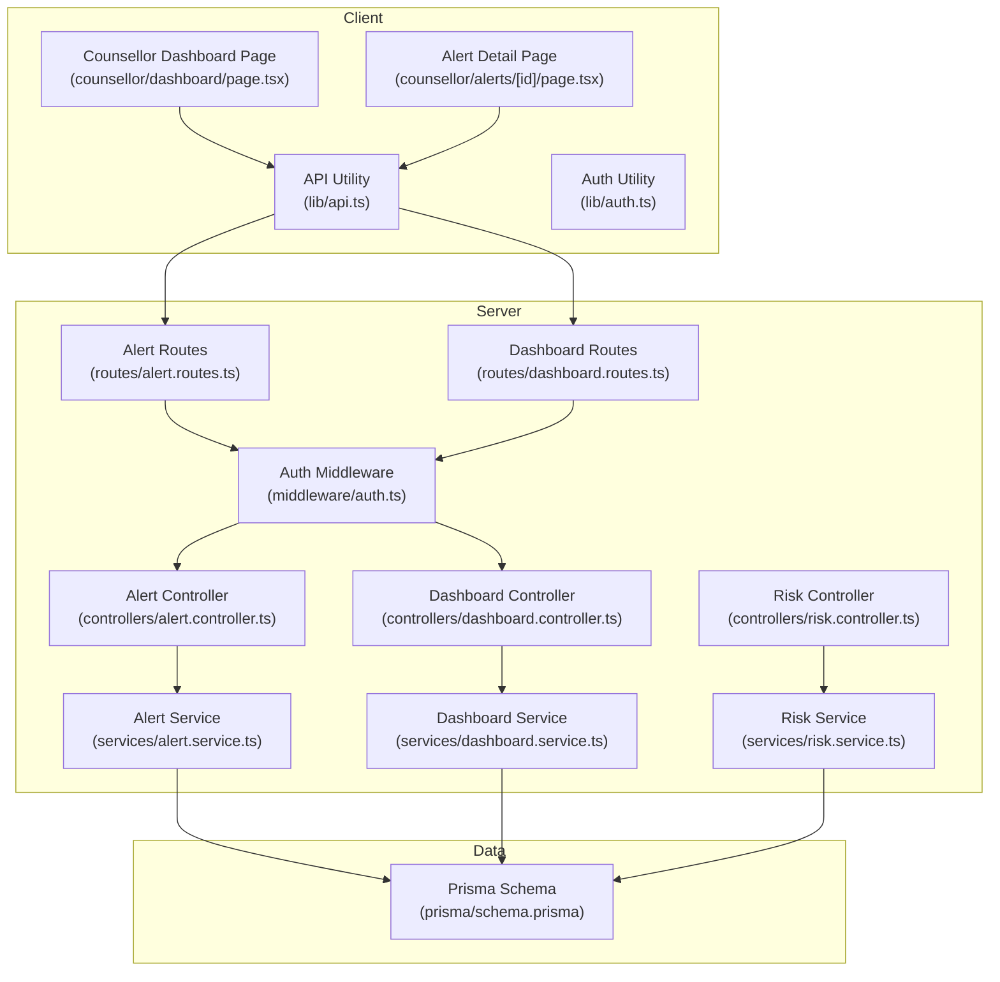
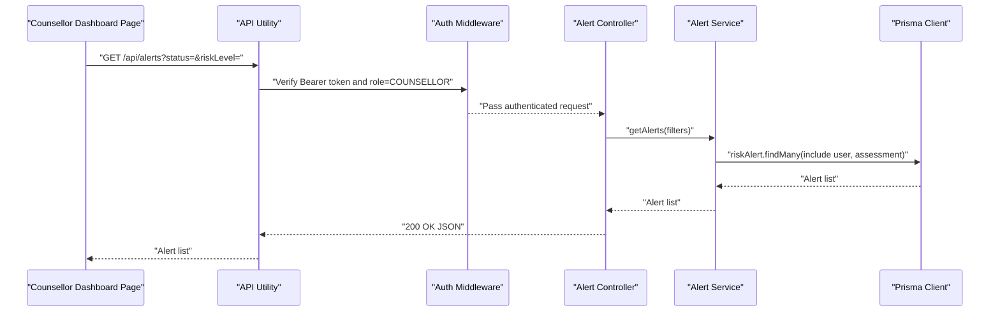
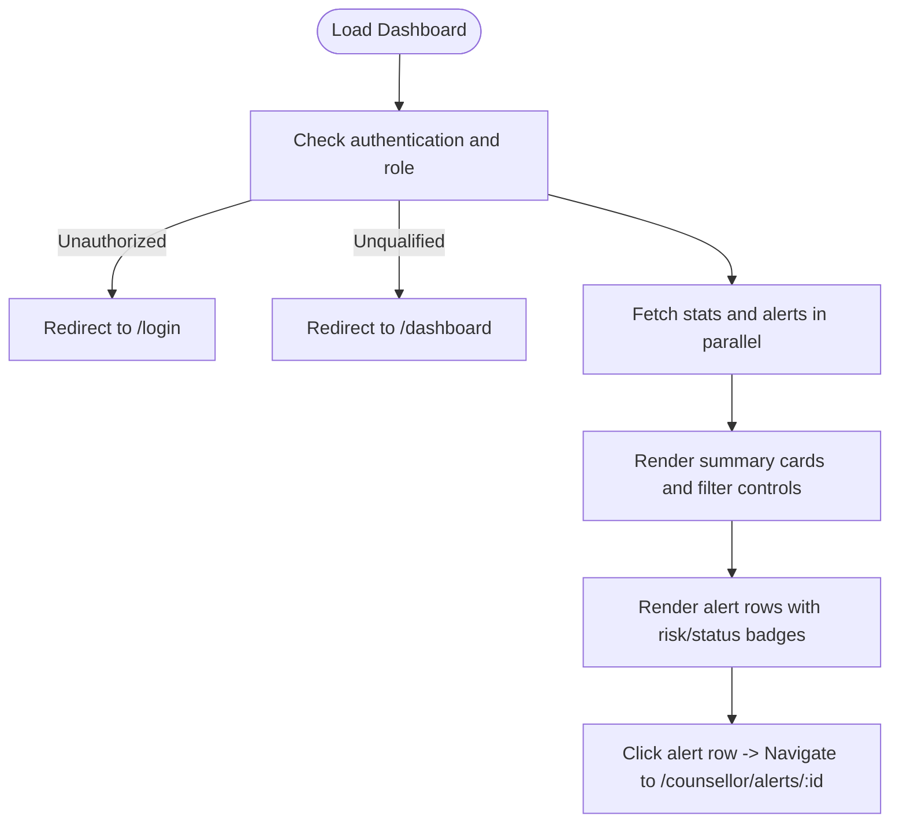
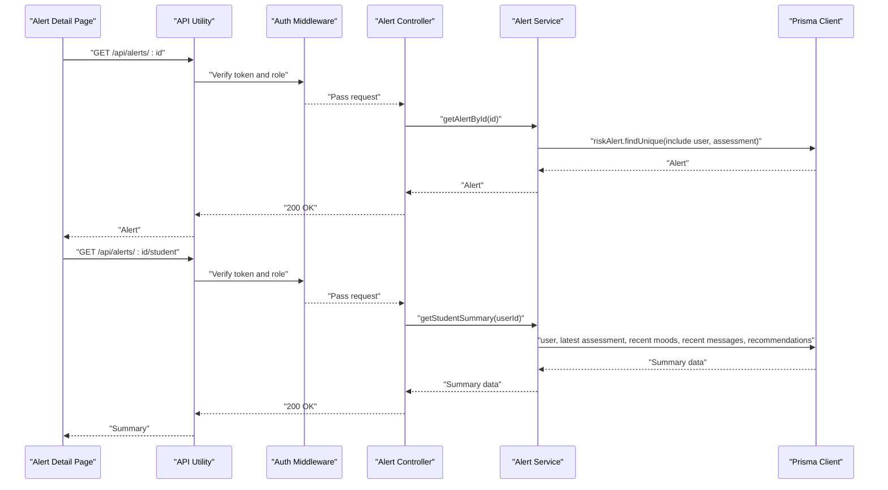
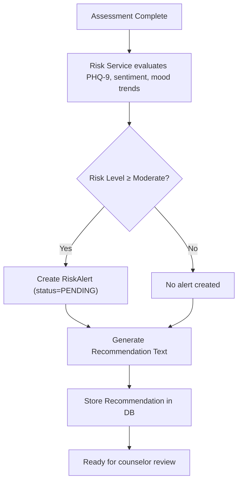
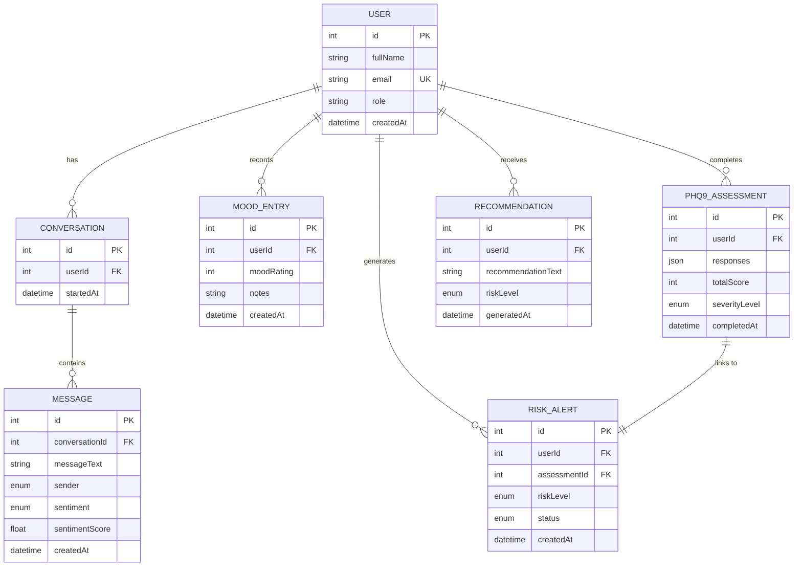
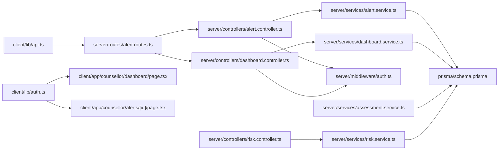

# Counselor Dashboard Integration

<cite>
**Referenced Files in This Document**
- [client/src/app/counsellor/dashboard/page.tsx](file://client/src/app/counsellor/dashboard/page.tsx)
- [client/src/app/counsellor/alerts/[id]/page.tsx](file://client/src/app/counsellor/alerts/[id]/page.tsx)
- [client/src/lib/api.ts](file://client/src/lib/api.ts)
- [client/src/lib/auth.ts](file://client/src/lib/auth.ts)
- [server/src/controllers/dashboard.controller.ts](file://server/src/controllers/dashboard.controller.ts)
- [server/src/services/dashboard.service.ts](file://server/src/services/dashboard.service.ts)
- [server/src/controllers/alert.controller.ts](file://server/src/controllers/alert.controller.ts)
- [server/src/services/alert.service.ts](file://server/src/services/alert.service.ts)
- [server/src/routes/alert.routes.ts](file://server/src/routes/alert.routes.ts)
- [server/src/middleware/auth.ts](file://server/src/middleware/auth.ts)
- [server/src/controllers/risk.controller.ts](file://server/src/controllers/risk.controller.ts)
- [server/src/services/risk.service.ts](file://server/src/services/risk.service.ts)
- [server/src/services/assessment.service.ts](file://server/src/services/assessment.service.ts)
- [prisma/schema.prisma](file://prisma/schema.prisma)
- [requirements.md](file://requirements.md)
- [README.md](file://README.md)
</cite>

## Table of Contents
1. [Introduction](#introduction)
2. [Project Structure](#project-structure)
3. [Core Components](#core-components)
4. [Architecture Overview](#architecture-overview)
5. [Detailed Component Analysis](#detailed-component-analysis)
6. [Dependency Analysis](#dependency-analysis)
7. [Performance Considerations](#performance-considerations)
8. [Troubleshooting Guide](#troubleshooting-guide)
9. [Conclusion](#conclusion)
10. [Appendices](#appendices)

## Introduction
This document describes the counselor dashboard integration for risk alert management within the BuddyAI platform. It focuses on the clinical interface enabling counselors to monitor high-risk students, review alert summaries, prioritize cases, and manage interventions. The documentation covers dashboard layout, alert detail views, student assessment history, recent chat sentiment, mood trends, risk evaluation details, intervention planning tools, communication features, reporting/analytics, and integration touchpoints with external clinical systems.

## Project Structure
The system comprises:
- Frontend (Next.js) with client-side pages for counselor dashboard and alert detail
- Authentication and API utilities for secure client-server communication
- Backend (Express) controllers, services, and routes for risk alerts and dashboard statistics
- Prisma ORM schema modeling clinical data entities and relationships
- Requirements and README documents defining functional and non-functional behaviors

**Diagram sources**
- [client/src/app/counsellor/dashboard/page.tsx:1-213](file://client/src/app/counsellor/dashboard/page.tsx#L1-L213)
- [client/src/app/counsellor/alerts/[id]/page.tsx](file://client/src/app/counsellor/alerts/[id]/page.tsx#L1-L246)
- [client/src/lib/api.ts:1-36](file://client/src/lib/api.ts#L1-L36)
- [client/src/lib/auth.ts:1-27](file://client/src/lib/auth.ts#L1-L27)
- [server/src/routes/alert.routes.ts:1-15](file://server/src/routes/alert.routes.ts#L1-L15)
- [server/src/controllers/alert.controller.ts:1-70](file://server/src/controllers/alert.controller.ts#L1-L70)
- [server/src/services/alert.service.ts:1-62](file://server/src/services/alert.service.ts#L1-L62)
- [server/src/controllers/dashboard.controller.ts:1-13](file://server/src/controllers/dashboard.controller.ts#L1-L13)
- [server/src/services/dashboard.service.ts:1-19](file://server/src/services/dashboard.service.ts#L1-L19)
- [server/src/middleware/auth.ts:1-39](file://server/src/middleware/auth.ts#L1-L39)
- [server/src/controllers/risk.controller.ts:1-32](file://server/src/controllers/risk.controller.ts#L1-L32)
- [server/src/services/risk.service.ts:38-111](file://server/src/services/risk.service.ts#L38-L111)
- [prisma/schema.prisma:1-134](file://prisma/schema.prisma#L1-L134)

**Section sources**
- [client/src/app/counsellor/dashboard/page.tsx:1-213](file://client/src/app/counsellor/dashboard/page.tsx#L1-L213)
- [client/src/app/counsellor/alerts/[id]/page.tsx](file://client/src/app/counsellor/alerts/[id]/page.tsx#L1-L246)
- [client/src/lib/api.ts:1-36](file://client/src/lib/api.ts#L1-L36)
- [client/src/lib/auth.ts:1-27](file://client/src/lib/auth.ts#L1-L27)
- [server/src/routes/alert.routes.ts:1-15](file://server/src/routes/alert.routes.ts#L1-L15)
- [server/src/controllers/alert.controller.ts:1-70](file://server/src/controllers/alert.controller.ts#L1-L70)
- [server/src/services/alert.service.ts:1-62](file://server/src/services/alert.service.ts#L1-L62)
- [server/src/controllers/dashboard.controller.ts:1-13](file://server/src/controllers/dashboard.controller.ts#L1-L13)
- [server/src/services/dashboard.service.ts:1-19](file://server/src/services/dashboard.service.ts#L1-L19)
- [server/src/middleware/auth.ts:1-39](file://server/src/middleware/auth.ts#L1-L39)
- [server/src/controllers/risk.controller.ts:1-32](file://server/src/controllers/risk.controller.ts#L1-L32)
- [server/src/services/risk.service.ts:38-111](file://server/src/services/risk.service.ts#L38-L111)
- [prisma/schema.prisma:1-134](file://prisma/schema.prisma#L1-L134)

## Core Components
- Counselor Dashboard Page: Loads dashboard statistics and filtered risk alerts, supports status and risk-level filtering, and navigates to alert details.
- Alert Detail Page: Displays alert metadata, current status, and a student summary including mood averages, recent PHQ-9 scores, sentiment breakdown, and recommendations.
- API Utilities: Centralized fetch wrapper handling auth tokens, 401 redirects, and error propagation.
- Authentication Utilities: Token and user session helpers for client-side role checks.
- Alert Routes and Controllers: Expose endpoints for listing alerts, retrieving a single alert, updating status, and fetching student summaries.
- Dashboard Controller and Service: Aggregates alert counts, statuses, and risk distribution for dashboard KPIs.
- Risk and Assessment Services: Drive risk evaluation, recommendation generation, and automatic alert creation for high/moderate/severe cases.
- Prisma Schema: Defines entities (User, RiskAlert, Phq9Assessment, MoodEntry, Recommendation, Message) and relationships used by the clinical interface.

**Section sources**
- [client/src/app/counsellor/dashboard/page.tsx:28-213](file://client/src/app/counsellor/dashboard/page.tsx#L28-L213)
- [client/src/app/counsellor/alerts/[id]/page.tsx](file://client/src/app/counsellor/alerts/[id]/page.tsx#L34-L246)
- [client/src/lib/api.ts:3-35](file://client/src/lib/api.ts#L3-L35)
- [client/src/lib/auth.ts:14-26](file://client/src/lib/auth.ts#L14-L26)
- [server/src/controllers/alert.controller.ts:5-69](file://server/src/controllers/alert.controller.ts#L5-L69)
- [server/src/services/alert.service.ts:3-61](file://server/src/services/alert.service.ts#L3-L61)
- [server/src/controllers/dashboard.controller.ts:5-12](file://server/src/controllers/dashboard.controller.ts#L5-L12)
- [server/src/services/dashboard.service.ts:3-18](file://server/src/services/dashboard.service.ts#L3-L18)
- [server/src/controllers/risk.controller.ts:5-31](file://server/src/controllers/risk.controller.ts#L5-L31)
- [server/src/services/risk.service.ts:38-107](file://server/src/services/risk.service.ts#L38-L107)
- [prisma/schema.prisma:47-133](file://prisma/schema.prisma#L47-L133)

## Architecture Overview
The counselor dashboard integrates frontend React components with backend APIs secured via JWT-based authentication and role-based authorization. Data flows from Prisma-managed PostgreSQL tables through service layers to controller endpoints, returning structured clinical summaries to the counselor interface.

**Diagram sources**
- [client/src/app/counsellor/dashboard/page.tsx:49-63](file://client/src/app/counsellor/dashboard/page.tsx#L49-L63)
- [client/src/lib/api.ts:3-35](file://client/src/lib/api.ts#L3-L35)
- [server/src/middleware/auth.ts:5-22](file://server/src/middleware/auth.ts#L5-L22)
- [server/src/controllers/alert.controller.ts:5-16](file://server/src/controllers/alert.controller.ts#L5-L16)
- [server/src/services/alert.service.ts:3-16](file://server/src/services/alert.service.ts#L3-L16)
- [prisma/schema.prisma:121-129](file://prisma/schema.prisma#L121-L129)

## Detailed Component Analysis

### Counselor Dashboard Layout
The dashboard presents:
- Summary cards for total alerts, pending, reviewed, and resolved counts
- Filter controls for status and risk level
- A paginated-style list of alerts with student identifiers, risk badges, status badges, and creation dates
- Navigation to alert detail pages

Key behaviors:
- Role guard ensures only counselors access the dashboard
- Parallel loading of stats and alerts for responsive UX
- Dynamic badge coloring for risk and status
- Filtering via query parameters applied on change

**Diagram sources**
- [client/src/app/counsellor/dashboard/page.tsx:36-80](file://client/src/app/counsellor/dashboard/page.tsx#L36-L80)
- [client/src/lib/auth.ts:24-26](file://client/src/lib/auth.ts#L24-L26)

**Section sources**
- [client/src/app/counsellor/dashboard/page.tsx:28-213](file://client/src/app/counsellor/dashboard/page.tsx#L28-L213)
- [client/src/lib/auth.ts:14-26](file://client/src/lib/auth.ts#L14-L26)

### Alert Detail View and Student Summary
The alert detail page displays:
- Alert metadata (risk level, status, student identity, date)
- Status progression controls (e.g., Pending → Reviewed → Resolved)
- Student summary panel with:
  - Average mood rating and recent count
  - Latest PHQ-9 total score and severity level
  - Sentiment breakdown (positive, neutral, negative) derived from recent messages
  - Recent recommendations

Workflow:
- On load, fetch alert and student summary concurrently
- Allow status updates via PATCH endpoint
- Provide back navigation to the dashboard

**Diagram sources**
- [client/src/app/counsellor/alerts/[id]/page.tsx](file://client/src/app/counsellor/alerts/[id]/page.tsx#L57-L70)
- [server/src/controllers/alert.controller.ts:18-30](file://server/src/controllers/alert.controller.ts#L18-L30)
- [server/src/services/alert.service.ts:18-42](file://server/src/services/alert.service.ts#L18-L42)
- [prisma/schema.prisma:47-119](file://prisma/schema.prisma#L47-L119)

**Section sources**
- [client/src/app/counsellor/alerts/[id]/page.tsx](file://client/src/app/counsellor/alerts/[id]/page.tsx#L34-L246)
- [server/src/controllers/alert.controller.ts:18-30](file://server/src/controllers/alert.controller.ts#L18-L30)
- [server/src/services/alert.service.ts:35-61](file://server/src/services/alert.service.ts#L35-L61)

### Intervention Planning Tools
Intervention planning is supported by:
- Automatic risk evaluation and recommendation generation upon assessments
- Risk alert creation for high/moderate/severe cases
- Stored recommendations retrievable in the alert detail view
- Status transitions (Pending → Reviewed → Resolved) to track intervention progress

**Diagram sources**
- [server/src/services/risk.service.ts:38-107](file://server/src/services/risk.service.ts#L38-L107)
- [server/src/services/assessment.service.ts:48-88](file://server/src/services/assessment.service.ts#L48-L88)
- [prisma/schema.prisma:110-119](file://prisma/schema.prisma#L110-L119)

**Section sources**
- [server/src/services/risk.service.ts:38-107](file://server/src/services/risk.service.ts#L38-L107)
- [server/src/services/assessment.service.ts:48-88](file://server/src/services/assessment.service.ts#L48-L88)
- [prisma/schema.prisma:110-119](file://prisma/schema.prisma#L110-L119)

### Communication Features
Communication features leverage:
- Chat module for message exchange and sentiment analysis
- Mood tracking for longitudinal trend analysis
- Recommendation engine for evidence-based suggestions

These components feed the alert detail view’s sentiment breakdown and mood summary panels, supporting informed care coordination.

**Section sources**
- [prisma/schema.prisma:73-84](file://prisma/schema.prisma#L73-L84)
- [prisma/schema.prisma:86-95](file://prisma/schema.prisma#L86-L95)
- [prisma/schema.prisma:110-119](file://prisma/schema.prisma#L110-L119)
- [README.md:645-662](file://README.md#L645-L662)

### Reporting and Analytics
The dashboard service aggregates:
- Total alerts and counts per status
- Total number of students
- Risk distribution across levels

These metrics inform caseload statistics and risk trends for supervisors and administrators.

**Section sources**
- [server/src/services/dashboard.service.ts:3-18](file://server/src/services/dashboard.service.ts#L3-L18)
- [server/src/controllers/dashboard.controller.ts:5-12](file://server/src/controllers/dashboard.controller.ts#L5-L12)

### Data Models Overview
The clinical data model centers around users, assessments, mood entries, messages, recommendations, and risk alerts.

**Diagram sources**
- [prisma/schema.prisma:47-133](file://prisma/schema.prisma#L47-L133)

## Dependency Analysis
- Client depends on API utility for network requests and auth utilities for role checks.
- Controllers depend on services for business logic and Prisma for persistence.
- Routes enforce authentication and role-based access before invoking controllers.
- Risk and assessment services collaborate to compute risk levels and generate recommendations.

**Diagram sources**
- [client/src/lib/api.ts:1-36](file://client/src/lib/api.ts#L1-L36)
- [client/src/lib/auth.ts:1-27](file://client/src/lib/auth.ts#L1-L27)
- [client/src/app/counsellor/dashboard/page.tsx:1-8](file://client/src/app/counsellor/dashboard/page.tsx#L1-L8)
- [client/src/app/counsellor/alerts/[id]/page.tsx](file://client/src/app/counsellor/alerts/[id]/page.tsx#L1-L7)
- [server/src/routes/alert.routes.ts:1-15](file://server/src/routes/alert.routes.ts#L1-L15)
- [server/src/controllers/alert.controller.ts:1-3](file://server/src/controllers/alert.controller.ts#L1-L3)
- [server/src/controllers/dashboard.controller.ts:1-3](file://server/src/controllers/dashboard.controller.ts#L1-L3)
- [server/src/services/alert.service.ts:1-2](file://server/src/services/alert.service.ts#L1-L2)
- [server/src/services/dashboard.service.ts:1-2](file://server/src/services/dashboard.service.ts#L1-L2)
- [server/src/middleware/auth.ts:1-3](file://server/src/middleware/auth.ts#L1-L3)
- [server/src/controllers/risk.controller.ts:1-3](file://server/src/controllers/risk.controller.ts#L1-L3)
- [server/src/services/risk.service.ts:1-2](file://server/src/services/risk.service.ts#L1-L2)
- [server/src/services/assessment.service.ts:1-2](file://server/src/services/assessment.service.ts#L1-L2)
- [prisma/schema.prisma:1-134](file://prisma/schema.prisma#L1-L134)

**Section sources**
- [client/src/lib/api.ts:1-36](file://client/src/lib/api.ts#L1-L36)
- [client/src/lib/auth.ts:1-27](file://client/src/lib/auth.ts#L1-L27)
- [server/src/middleware/auth.ts:24-38](file://server/src/middleware/auth.ts#L24-L38)
- [server/src/routes/alert.routes.ts:7-12](file://server/src/routes/alert.routes.ts#L7-L12)
- [server/src/controllers/alert.controller.ts:1-3](file://server/src/controllers/alert.controller.ts#L1-L3)
- [server/src/controllers/dashboard.controller.ts:1-3](file://server/src/controllers/dashboard.controller.ts#L1-L3)
- [server/src/services/alert.service.ts:1-2](file://server/src/services/alert.service.ts#L1-L2)
- [server/src/services/dashboard.service.ts:1-2](file://server/src/services/dashboard.service.ts#L1-L2)
- [server/src/controllers/risk.controller.ts:1-3](file://server/src/controllers/risk.controller.ts#L1-L3)
- [server/src/services/risk.service.ts:1-2](file://server/src/services/risk.service.ts#L1-L2)
- [server/src/services/assessment.service.ts:1-2](file://server/src/services/assessment.service.ts#L1-L2)
- [prisma/schema.prisma:1-134](file://prisma/schema.prisma#L1-L134)

## Performance Considerations
- Parallelize client-side requests for stats and alerts to reduce perceived latency.
- Use pagination or virtualization for long alert lists to improve rendering performance.
- Cache frequently accessed summary data on the client for repeated navigation.
- Optimize database queries with appropriate indexes and selective includes.

## Troubleshooting Guide
Common issues and resolutions:
- Unauthorized Access: 401 responses trigger logout and redirect to login; verify token presence and validity.
- Role-Based Denial: Ensure the authenticated user has the counselor role before accessing counselor routes.
- Alert Not Found: Controllers return 404 when alert ID does not exist; confirm ID correctness.
- Invalid Status Updates: Status must be one of the allowed values; validate client-side before sending PATCH.

**Section sources**
- [client/src/lib/api.ts:20-35](file://client/src/lib/api.ts#L20-L35)
- [server/src/middleware/auth.ts:5-22](file://server/src/middleware/auth.ts#L5-L22)
- [server/src/controllers/alert.controller.ts:22-46](file://server/src/controllers/alert.controller.ts#L22-L46)

## Conclusion
The counselor dashboard integration provides a robust clinical interface for managing risk alerts, reviewing student summaries, and coordinating interventions. Its modular architecture, strong authentication and authorization, and clear data models enable scalable deployment and future enhancements such as reporting dashboards, care coordination workflows, and external system integrations.

## Appendices

### Accessibility and Mobile Responsiveness
- Use semantic HTML and ARIA attributes for screen reader support.
- Ensure sufficient color contrast for risk and status badges.
- Test responsive breakpoints for filter controls and summary cards.
- Provide keyboard navigation for interactive elements (buttons, selects).

### Integration with External Clinical Systems
- Use standardized identifiers (e.g., user IDs) for mapping to external systems.
- Exportable reports can be built from dashboard service aggregations and alert lists.
- Consider FHIR-like export formats for PHQ-9 scores, mood trends, and recommendations.

### Examples: Navigation and Workflows
- Dashboard Navigation: From the dashboard, click an alert row to open the alert detail page.
- Alert Review Process: On the alert detail page, review the student summary and sentiment breakdown, then mark as “Reviewed” and later “Resolved.”
- Intervention Documentation: Use the alert status transitions to document intervention steps; recommendations are automatically generated and retrievable.

**Section sources**
- [client/src/app/counsellor/dashboard/page.tsx:174-209](file://client/src/app/counsellor/dashboard/page.tsx#L174-L209)
- [client/src/app/counsellor/alerts/[id]/page.tsx](file://client/src/app/counsellor/alerts/[id]/page.tsx#L170-L179)
- [requirements.md:317-321](file://requirements.md#L317-L321)
- [README.md:645-662](file://README.md#L645-L662)