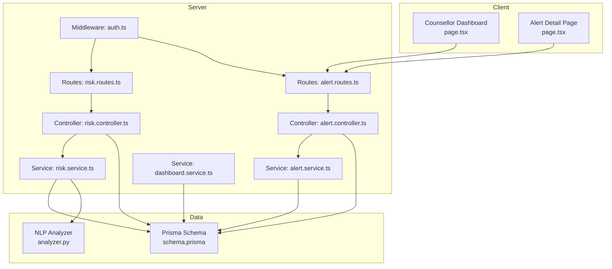
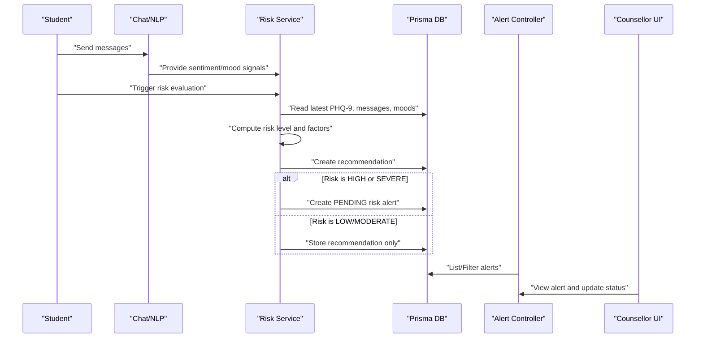
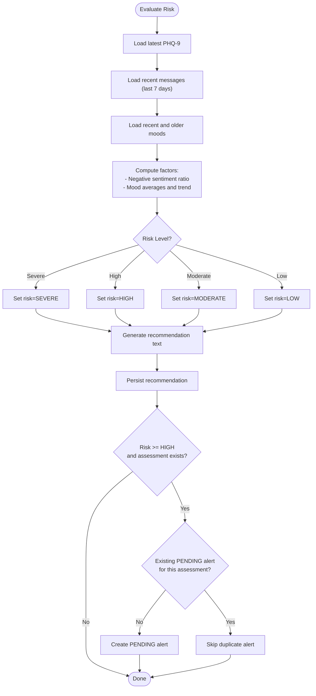
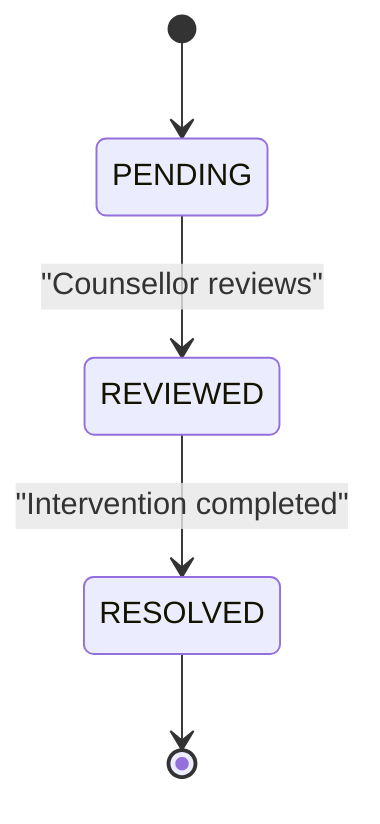
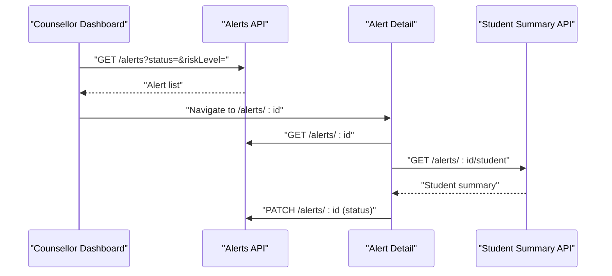
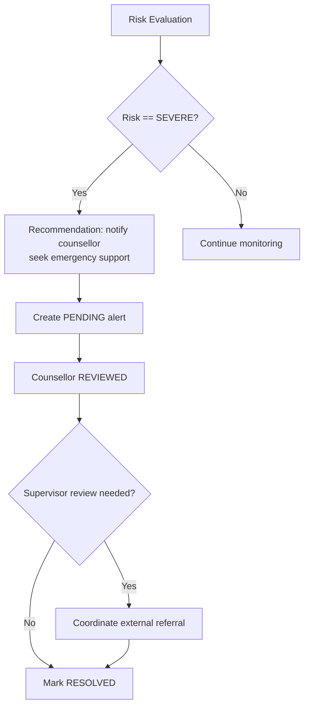
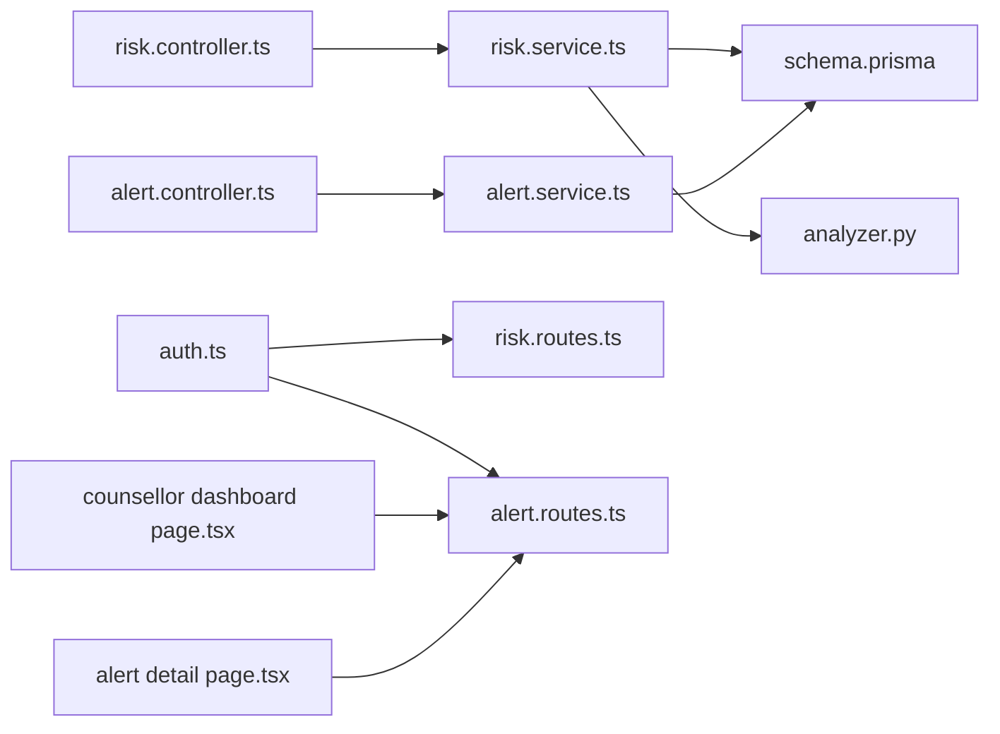

# Escalation Procedures

<cite>
**Referenced Files in This Document**
- [risk.controller.ts](file://server/src/controllers/risk.controller.ts)
- [risk.service.ts](file://server/src/services/risk.service.ts)
- [alert.controller.ts](file://server/src/controllers/alert.controller.ts)
- [alert.service.ts](file://server/src/services/alert.service.ts)
- [risk.routes.ts](file://server/src/routes/risk.routes.ts)
- [alert.routes.ts](file://server/src/routes/alert.routes.ts)
- [schema.prisma](file://prisma/schema.prisma)
- [auth.ts](file://server/src/middleware/auth.ts)
- [assessment.controller.ts](file://server/src/controllers/assessment.controller.ts)
- [assessment.service.ts](file://server/src/services/assessment.service.ts)
- [assessment.test.ts](file://server/src/__tests__/assessment.test.ts)
- [risk.test.ts](file://server/src/__tests__/risk.test.ts)
- [requirements.md](file://requirements.md)
- [analyzer.py](file://nlp-service/nlp/analyzer.py)
- [page.tsx](file://client/src/app/counsellor/alerts/[id]/page.tsx)
- [page.tsx](file://client/src/app/counsellor/dashboard/page.tsx)
- [dashboard.service.ts](file://server/src/services/dashboard.service.ts)
</cite>

## Table of Contents
1. [Introduction](#introduction)
2. [Project Structure](#project-structure)
3. [Core Components](#core-components)
4. [Architecture Overview](#architecture-overview)
5. [Detailed Component Analysis](#detailed-component-analysis)
6. [Dependency Analysis](#dependency-analysis)
7. [Performance Considerations](#performance-considerations)
8. [Troubleshooting Guide](#troubleshooting-guide)
9. [Conclusion](#conclusion)
10. [Appendices](#appendices)

## Introduction
This document defines escalation procedures for high-risk cases within the BuddyAI system. It outlines the multi-level escalation hierarchy from automated risk flags to clinical supervision and emergency intervention. It explains criteria for escalating from low to severe risk, the workflow for alert generation and status transitions, communication protocols among counselors and supervisors, documentation requirements per step, and emergency response procedures for acute risk situations. Scenario-based examples illustrate typical escalation paths, decision points, and stakeholder involvement. Legal and ethical considerations, confidentiality requirements, and regulatory compliance are addressed throughout.

## Project Structure
The escalation lifecycle spans client dashboards, server routes/controllers/services, and database models:
- Risk evaluation and alert creation are handled server-side via risk controller/service.
- Alerts are filtered and managed by counselors through dedicated routes and UI pages.
- Assessment and mood data feed risk evaluation.
- Prisma models define risk levels, alert statuses, and relationships.

**Diagram sources**
- [risk.routes.ts:1-11](file://server/src/routes/risk.routes.ts#L1-L11)
- [alert.routes.ts:1-15](file://server/src/routes/alert.routes.ts#L1-L15)
- [risk.controller.ts:1-32](file://server/src/controllers/risk.controller.ts#L1-L32)
- [alert.controller.ts:1-70](file://server/src/controllers/alert.controller.ts#L1-L70)
- [risk.service.ts:1-138](file://server/src/services/risk.service.ts#L1-L138)
- [alert.service.ts:1-62](file://server/src/services/alert.service.ts#L1-L62)
- [dashboard.service.ts:1-19](file://server/src/services/dashboard.service.ts#L1-L19)
- [auth.ts:1-39](file://server/src/middleware/auth.ts#L1-L39)
- [schema.prisma:1-134](file://prisma/schema.prisma#L1-L134)
- [analyzer.py:1-27](file://nlp-service/nlp/analyzer.py#L1-L27)
- [page.tsx:1-213](file://client/src/app/counsellor/dashboard/page.tsx#L1-L213)
- [page.tsx:1-246](file://client/src/app/counsellor/alerts/[id]/page.tsx#L1-L246)

**Section sources**
- [risk.routes.ts:1-11](file://server/src/routes/risk.routes.ts#L1-L11)
- [alert.routes.ts:1-15](file://server/src/routes/alert.routes.ts#L1-L15)
- [risk.controller.ts:1-32](file://server/src/controllers/risk.controller.ts#L1-L32)
- [alert.controller.ts:1-70](file://server/src/controllers/alert.controller.ts#L1-L70)
- [risk.service.ts:1-138](file://server/src/services/risk.service.ts#L1-L138)
- [alert.service.ts:1-62](file://server/src/services/alert.service.ts#L1-L62)
- [schema.prisma:1-134](file://prisma/schema.prisma#L1-L134)
- [auth.ts:1-39](file://server/src/middleware/auth.ts#L1-L39)
- [page.tsx:1-213](file://client/src/app/counsellor/dashboard/page.tsx#L1-L213)
- [page.tsx:1-246](file://client/src/app/counsellor/alerts/[id]/page.tsx#L1-L246)

## Core Components
- Risk evaluation engine: Computes risk level from PHQ-9, sentiment trends, and mood trends; persists recommendations and creates alerts for high/serious risk.
- Alert management: Lists, retrieves, updates alert status, and generates student summaries for review.
- Counselor dashboard: Displays statistics and filters alerts by status and risk level; links to alert detail.
- Authentication and authorization: Enforces bearer token auth and role-based access for counselors.
- Assessment module: Submits PHQ-9 responses, classifies severity, and triggers recommendations for moderate/severe cases.
- NLP sentiment analysis: Provides sentiment classification for messages used in risk evaluation.

Key implementation references:
- Risk evaluation and alert creation: [evaluateRisk:11-107](file://server/src/services/risk.service.ts#L11-L107), [generateRecommendationText:109-120](file://server/src/services/risk.service.ts#L109-L120)
- Alert CRUD and student summary: [getAlerts:3-16](file://server/src/services/alert.service.ts#L3-L16), [getAlertById:18-26](file://server/src/services/alert.service.ts#L18-L26), [updateAlertStatus:28-33](file://server/src/services/alert.service.ts#L28-L33), [getStudentSummary:35-61](file://server/src/services/alert.service.ts#L35-L61)
- Routes and controllers: [risk.routes.ts:1-11](file://server/src/routes/risk.routes.ts#L1-L11), [alert.routes.ts:1-15](file://server/src/routes/alert.routes.ts#L1-L15), [risk.controller.ts:1-32](file://server/src/controllers/risk.controller.ts#L1-L32), [alert.controller.ts:1-70](file://server/src/controllers/alert.controller.ts#L1-L70)
- Assessment and severity classification: [submitAssessment:20-33](file://server/src/services/assessment.service.ts#L20-L33), [classifySeverity:12-18](file://server/src/services/assessment.service.ts#L12-L18)
- NLP analyzer: [SentimentAnalyzer.analyze:8-27](file://nlp-service/nlp/analyzer.py#L8-L27)

**Section sources**
- [risk.service.ts:1-138](file://server/src/services/risk.service.ts#L1-L138)
- [alert.service.ts:1-62](file://server/src/services/alert.service.ts#L1-L62)
- [risk.routes.ts:1-11](file://server/src/routes/risk.routes.ts#L1-L11)
- [alert.routes.ts:1-15](file://server/src/routes/alert.routes.ts#L1-L15)
- [risk.controller.ts:1-32](file://server/src/controllers/risk.controller.ts#L1-L32)
- [alert.controller.ts:1-70](file://server/src/controllers/alert.controller.ts#L1-L70)
- [assessment.service.ts:1-50](file://server/src/services/assessment.service.ts#L1-L50)
- [analyzer.py:1-27](file://nlp-service/nlp/analyzer.py#L1-L27)

## Architecture Overview
The escalation pipeline integrates assessment, sentiment, mood tracking, risk evaluation, alerting, and counselor workflows.

**Diagram sources**
- [risk.service.ts:11-107](file://server/src/services/risk.service.ts#L11-L107)
- [alert.controller.ts:1-70](file://server/src/controllers/alert.controller.ts#L1-L70)
- [alert.routes.ts:1-15](file://server/src/routes/alert.routes.ts#L1-L15)
- [schema.prisma:121-133](file://prisma/schema.prisma#L121-L133)

## Detailed Component Analysis

### Risk Evaluation and Alert Creation
Risk evaluation aggregates:
- Latest PHQ-9 total score
- Recent negative sentiment ratio (last 7 days)
- Mood trend comparison (last 7 vs previous 23 days)

Escalation thresholds:
- Severe: PHQ-9 total score ≥ 20
- High: PHQ-9 total score ≥ 15 AND negative sentiment ratio > 50%
- Moderate: PHQ-9 total score ≥ 10 OR declining mood trend
- Low: otherwise

On HIGH/SEVERE risk, a PENDING alert is created for the latest assessment if none exists. A recommendation is stored for all evaluations.

**Diagram sources**
- [risk.service.ts:11-107](file://server/src/services/risk.service.ts#L11-L107)

**Section sources**
- [risk.service.ts:11-107](file://server/src/services/risk.service.ts#L11-L107)
- [assessment.service.ts:20-33](file://server/src/services/assessment.service.ts#L20-L33)
- [assessment.test.ts:40-155](file://server/src/__tests__/assessment.test.ts#L40-L155)
- [risk.test.ts:84-125](file://server/src/__tests__/risk.test.ts#L84-L125)

### Alert Lifecycle and Status Transitions
Alerts progress through three statuses:
- PENDING: Newly created for HIGH/SEVERE risk
- REVIEWED: Counselor reviewed the case
- RESOLVED: Case closed after intervention

Counselors can:
- List alerts with filters (status, risk level)
- View alert details and student summary
- Update alert status sequentially (PENDING → REVIEWED → RESOLVED)

**Diagram sources**
- [alert.controller.ts:32-53](file://server/src/controllers/alert.controller.ts#L32-L53)
- [alert.service.ts:28-33](file://server/src/services/alert.service.ts#L28-L33)
- [schema.prisma:41-45](file://prisma/schema.prisma#L41-L45)

**Section sources**
- [alert.controller.ts:1-70](file://server/src/controllers/alert.controller.ts#L1-L70)
- [alert.service.ts:1-62](file://server/src/services/alert.service.ts#L1-L62)
- [alert.routes.ts:1-15](file://server/src/routes/alert.routes.ts#L1-L15)
- [page.tsx:72-85](file://client/src/app/counsellor/alerts/[id]/page.tsx#L72-L85)
- [page.tsx:169-209](file://client/src/app/counsellor/dashboard/page.tsx#L169-L209)

### Counselor Dashboard and Student Summary
The dashboard provides:
- Summary counts for total alerts, pending, reviewed, resolved
- Filterable alert list by status and risk level
- Navigation to alert detail pages

The alert detail page displays:
- Alert metadata (risk level, status, date)
- Student summary: latest PHQ-9, mood average and entries, sentiment breakdown, recent recommendations
- Sequential status update controls

**Diagram sources**
- [page.tsx:49-81](file://client/src/app/counsellor/dashboard/page.tsx#L49-L81)
- [page.tsx:57-85](file://client/src/app/counsellor/alerts/[id]/page.tsx#L57-L85)
- [alert.routes.ts:9-12](file://server/src/routes/alert.routes.ts#L9-L12)
- [alert.controller.ts:55-69](file://server/src/controllers/alert.controller.ts#L55-L69)

**Section sources**
- [page.tsx:1-213](file://client/src/app/counsellor/dashboard/page.tsx#L1-L213)
- [page.tsx:1-246](file://client/src/app/counsellor/alerts/[id]/page.tsx#L1-L246)
- [alert.controller.ts:1-70](file://server/src/controllers/alert.controller.ts#L1-L70)
- [alert.routes.ts:1-15](file://server/src/routes/alert.routes.ts#L1-L15)

### Emergency Response and Crisis Intervention
Emergency-level recommendations are generated for severe risk. The system notifies counselors and advises contacting emergency services or crisis helplines when appropriate. While the current backend does not model external referrals or supervisor escalation steps, the alert status model supports progression toward resolution and can be extended to incorporate supervisor review and external coordination.

**Diagram sources**
- [risk.service.ts:109-120](file://server/src/services/risk.service.ts#L109-L120)
- [risk.service.ts:87-104](file://server/src/services/risk.service.ts#L87-L104)

**Section sources**
- [risk.service.ts:109-120](file://server/src/services/risk.service.ts#L109-L120)
- [risk.service.ts:87-104](file://server/src/services/risk.service.ts#L87-L104)

### Scenario-Based Examples
Example 1: High-risk escalation via sentiment and PHQ-9
- A student completes a PHQ-9 with a score indicating moderate/severe depression and recent messages show a high negative sentiment ratio.
- Risk evaluation sets risk to HIGH, stores recommendation, and creates a PENDING alert.
- Counselor views the alert on the dashboard, navigates to the alert detail, reviews the student summary, marks as REVIEWED, and updates to RESOLVED after intervention.

Example 2: Severe-risk emergency response
- A student’s PHQ-9 score meets severe criteria; recommendation text directs counselor notification and emergency support.
- Alert is created with PENDING status; counselor initiates emergency contact and coordinates care, then resolves the alert.

Example 3: Moderate-risk monitoring
- A student’s PHQ-9 score is moderate and mood is declining; risk is classified MODERATE.
- Recommendation is stored; no alert is created automatically, but the case remains visible for ongoing monitoring.

**Section sources**
- [risk.test.ts:84-125](file://server/src/__tests__/risk.test.ts#L84-L125)
- [assessment.test.ts:40-155](file://server/src/__tests__/assessment.test.ts#L40-L155)
- [risk.service.ts:11-107](file://server/src/services/risk.service.ts#L11-L107)
- [page.tsx:72-85](file://client/src/app/counsellor/alerts/[id]/page.tsx#L72-L85)
- [page.tsx:169-209](file://client/src/app/counsellor/dashboard/page.tsx#L169-L209)

## Dependency Analysis
- Controllers depend on services for business logic.
- Services depend on Prisma for persistence and on the NLP analyzer for sentiment classification.
- Routes enforce authentication and role checks.
- Client dashboards consume server endpoints for alerts and summaries.

**Diagram sources**
- [risk.controller.ts:1-32](file://server/src/controllers/risk.controller.ts#L1-L32)
- [alert.controller.ts:1-70](file://server/src/controllers/alert.controller.ts#L1-L70)
- [risk.service.ts:1-138](file://server/src/services/risk.service.ts#L1-L138)
- [alert.service.ts:1-62](file://server/src/services/alert.service.ts#L1-L62)
- [schema.prisma:1-134](file://prisma/schema.prisma#L1-L134)
- [analyzer.py:1-27](file://nlp-service/nlp/analyzer.py#L1-L27)
- [auth.ts:1-39](file://server/src/middleware/auth.ts#L1-L39)
- [risk.routes.ts:1-11](file://server/src/routes/risk.routes.ts#L1-L11)
- [alert.routes.ts:1-15](file://server/src/routes/alert.routes.ts#L1-L15)
- [page.tsx:1-213](file://client/src/app/counsellor/dashboard/page.tsx#L1-L213)
- [page.tsx:1-246](file://client/src/app/counsellor/alerts/[id]/page.tsx#L1-L246)

**Section sources**
- [risk.controller.ts:1-32](file://server/src/controllers/risk.controller.ts#L1-L32)
- [alert.controller.ts:1-70](file://server/src/controllers/alert.controller.ts#L1-L70)
- [risk.service.ts:1-138](file://server/src/services/risk.service.ts#L1-L138)
- [alert.service.ts:1-62](file://server/src/services/alert.service.ts#L1-L62)
- [auth.ts:1-39](file://server/src/middleware/auth.ts#L1-L39)
- [risk.routes.ts:1-11](file://server/src/routes/risk.routes.ts#L1-L11)
- [alert.routes.ts:1-15](file://server/src/routes/alert.routes.ts#L1-L15)
- [schema.prisma:1-134](file://prisma/schema.prisma#L1-L134)
- [page.tsx:1-213](file://client/src/app/counsellor/dashboard/page.tsx#L1-L213)
- [page.tsx:1-246](file://client/src/app/counsellor/alerts/[id]/page.tsx#L1-L246)

## Performance Considerations
- Risk evaluation performs multiple Prisma queries; batching and caching recent data can reduce latency.
- Sentiment analysis is delegated to an external NLP service; ensure network timeouts and retries are configured.
- Dashboard statistics use grouped counts; keep indices on alert status and risk level for fast filtering.
- Client-side UI uses concurrent requests for alert and summary; ensure error boundaries and loading states.

## Troubleshooting Guide
Common issues and resolutions:
- Authentication failures: Ensure Bearer token is present and valid; verify role-based access for counselor endpoints.
  - Reference: [auth.ts:5-22](file://server/src/middleware/auth.ts#L5-L22)
- Alert not found: Confirm alert ID exists and belongs to the counselor’s scope.
  - Reference: [alert.controller.ts:18-30](file://server/src/controllers/alert.controller.ts#L18-L30)
- Invalid status update: Only PENDING, REVIEWED, and RESOLVED are accepted.
  - Reference: [alert.controller.ts:37-40](file://server/src/controllers/alert.controller.ts#L37-L40)
- Duplicate alerts: Risk evaluation prevents duplicate PENDING alerts for the same assessment.
  - Reference: [risk.service.ts:88-104](file://server/src/services/risk.service.ts#L88-L104)
- Unexpected risk level: Verify PHQ-9 score thresholds and sentiment ratio calculations.
  - Reference: [risk.service.ts:60-73](file://server/src/services/risk.service.ts#L60-L73), [assessment.test.ts:40-155](file://server/src/__tests__/assessment.test.ts#L40-L155)

**Section sources**
- [auth.ts:5-22](file://server/src/middleware/auth.ts#L5-L22)
- [alert.controller.ts:18-40](file://server/src/controllers/alert.controller.ts#L18-L40)
- [risk.service.ts:88-104](file://server/src/services/risk.service.ts#L88-L104)
- [assessment.test.ts:40-155](file://server/src/__tests__/assessment.test.ts#L40-L155)

## Conclusion
The BuddyAI system automates risk flagging and alert generation for high-risk cases while providing counselors with a streamlined workflow to review, escalate, and resolve cases. By adhering to defined thresholds, maintaining audit-ready documentation through stored recommendations and alerts, and enforcing strict authentication and authorization, the platform supports timely clinical intervention and regulatory compliance.

## Appendices

### Communication Protocols
- Internal: REST endpoints for risk evaluation and alert management.
- External: Emergency recommendations advise contacting crisis services; supervisor coordination can be modeled by extending alert status and adding supervisor review fields.

**Section sources**
- [risk.service.ts:109-120](file://server/src/services/risk.service.ts#L109-L120)
- [alert.routes.ts:1-15](file://server/src/routes/alert.routes.ts#L1-L15)
- [alert.controller.ts:1-70](file://server/src/controllers/alert.controller.ts#L1-L70)

### Documentation Requirements per Escalation Step
- Initial risk flag:
  - Rationale: PHQ-9 score, negative sentiment ratio, mood trend
  - Actions taken: Recommendation stored, alert created if HIGH/SEVERE
  - Outcome: PENDING alert status
- Clinical team review:
  - Rationale: Student summary (latest PHQ-9, mood average, sentiment breakdown)
  - Actions taken: Status updated to REVIEWED
  - Outcome: Case under active supervision
- Resolution:
  - Rationale: Intervention outcomes and follow-up plans
  - Actions taken: Status updated to RESOLVED
  - Outcome: Closure of the case

**Section sources**
- [risk.service.ts:11-107](file://server/src/services/risk.service.ts#L11-L107)
- [alert.service.ts:35-61](file://server/src/services/alert.service.ts#L35-L61)
- [page.tsx:72-85](file://client/src/app/counsellor/alerts/[id]/page.tsx#L72-L85)

### Legal and Ethical Considerations, Confidentiality, and Regulatory Compliance
- Access control: Authentication required and role-based restrictions for counselor-only endpoints.
  - Reference: [auth.ts:24-38](file://server/src/middleware/auth.ts#L24-L38), [alert.routes.ts](file://server/src/routes/alert.routes.ts#L7)
- Data protection: Student mental health data must be protected from unauthorized access.
  - Reference: [requirements.md:289-292](file://requirements.md#L289-L292)
- Business rules:
  - Only counselors may access risk alerts.
  - High Risk and Severe Risk must generate a risk alert.
  - Students may view only their own records.
  - Counsellors may only access students associated with generated risk alerts.
  - Every PHQ-9 assessment must generate a severity classification.
  - Recommendations must be generated after each risk evaluation.
  - The system uses PHQ-9 and VADER for assessment and sentiment classification.
  - Reference: [requirements.md:327-357](file://requirements.md#L327-L357), [requirements.md:363-367](file://requirements.md#L363-L367)