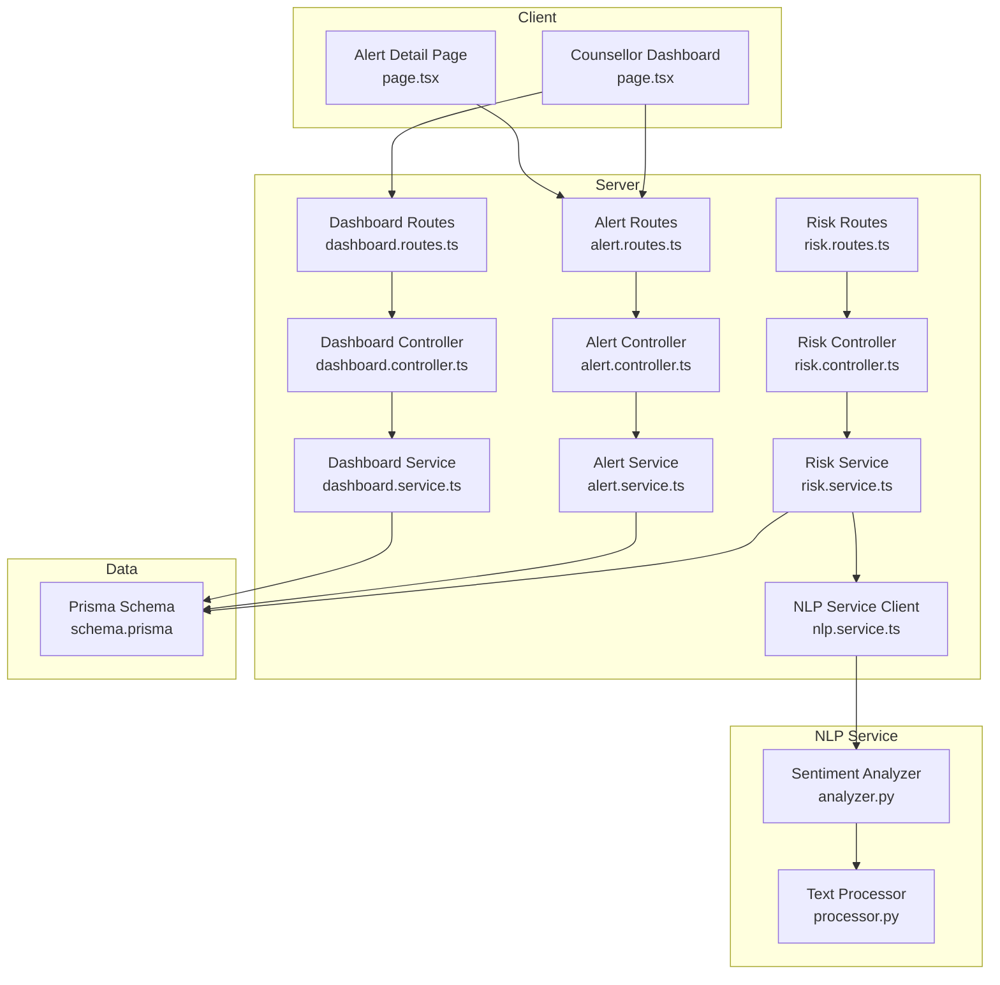
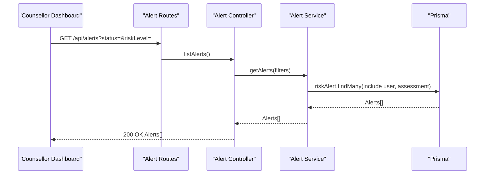
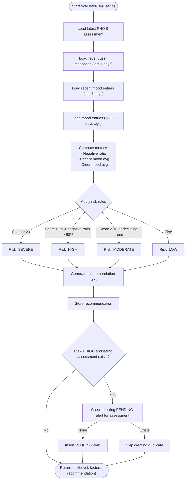
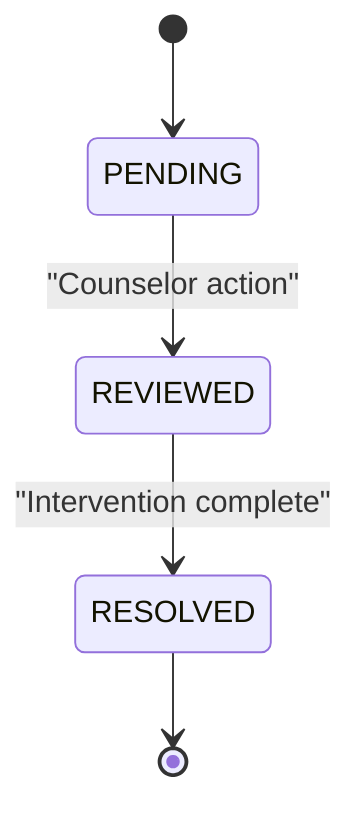
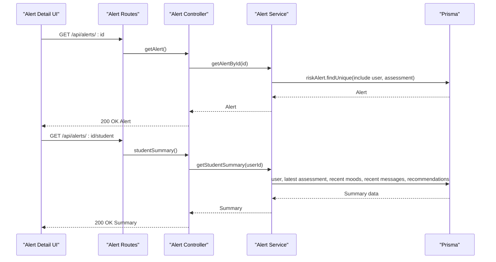
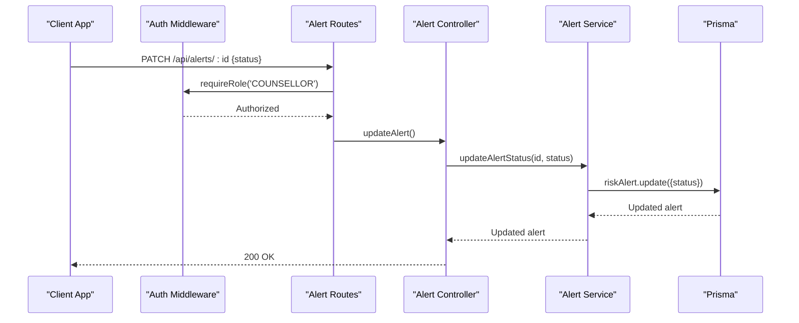
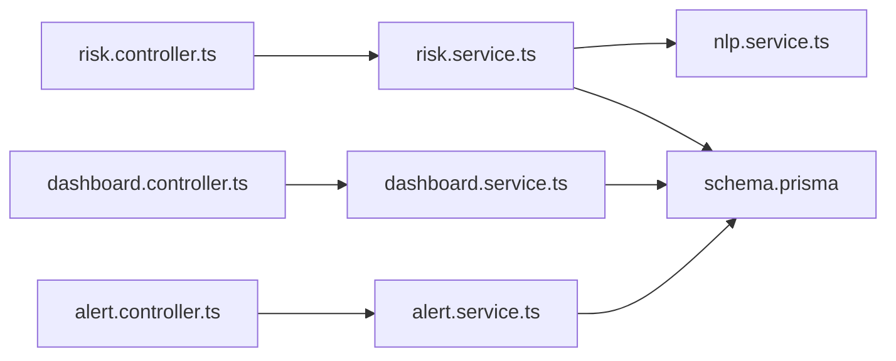
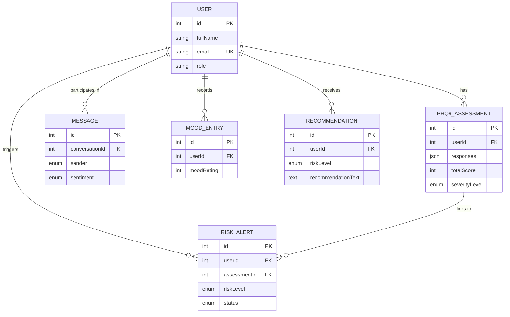

# Risk Alert System

<cite>
**Referenced Files in This Document**
- [risk.service.ts](file://server/src/services/risk.service.ts)
- [risk.controller.ts](file://server/src/controllers/risk.controller.ts)
- [risk.routes.ts](file://server/src/routes/risk.routes.ts)
- [alert.service.ts](file://server/src/services/alert.service.ts)
- [alert.controller.ts](file://server/src/controllers/alert.controller.ts)
- [alert.routes.ts](file://server/src/routes/alert.routes.ts)
- [dashboard.service.ts](file://server/src/services/dashboard.service.ts)
- [dashboard.controller.ts](file://server/src/controllers/dashboard.controller.ts)
- [dashboard.routes.ts](file://server/src/routes/dashboard.routes.ts)
- [nlp.service.ts](file://server/src/services/nlp.service.ts)
- [analyzer.py](file://nlp-service/nlp/analyzer.py)
- [processor.py](file://nlp-service/nlp/processor.py)
- [schema.prisma](file://prisma/schema.prisma)
- [page.tsx](file://client/src/app/counsellor/dashboard/page.tsx)
- [page.tsx](file://client/src/app/counsellor/alerts/[id]/page.tsx)
</cite>

## Table of Contents
1. [Introduction](#introduction)
2. [Project Structure](#project-structure)
3. [Core Components](#core-components)
4. [Architecture Overview](#architecture-overview)
5. [Detailed Component Analysis](#detailed-component-analysis)
6. [Dependency Analysis](#dependency-analysis)
7. [Performance Considerations](#performance-considerations)
8. [Troubleshooting Guide](#troubleshooting-guide)
9. [Conclusion](#conclusion)
10. [Appendices](#appendices)

## Introduction
This document describes the risk alert system designed to identify high-risk cases and notify counselors. It explains the risk detection algorithms that combine PHQ-9 scores, sentiment analysis trends, and mood tracking patterns. It documents the alert generation workflow from risk assessment through counselor notification and status management, including alert lifecycle states (PENDING, REVIEWED, RESOLVED) and escalation procedures. It also covers the counselor dashboard for reviewing flagged cases, accessing assessment history, and tracking interventions, along with communication protocols for alert notifications, status updates, and follow-ups. Practical examples illustrate risk assessment workflows, escalation scenarios, and intervention planning. Finally, it addresses alert accuracy validation, strategies to reduce false positives, and integration with clinical decision support systems.

## Project Structure
The system is organized into three primary layers:
- Backend services: Express controllers, services, and routes for risk evaluation, alert management, and counselor dashboard.
- NLP sentiment analysis: A separate Python service that classifies user messages into POSITIVE, NEUTRAL, or NEGATIVE sentiment.
- Frontend: React-based counselor dashboard and alert detail pages for monitoring and managing alerts.

**Diagram sources**
- [risk.routes.ts:1-11](file://server/src/routes/risk.routes.ts#L1-L11)
- [risk.controller.ts:1-32](file://server/src/controllers/risk.controller.ts#L1-L32)
- [risk.service.ts:1-138](file://server/src/services/risk.service.ts#L1-L138)
- [alert.routes.ts:1-15](file://server/src/routes/alert.routes.ts#L1-L15)
- [alert.controller.ts:1-70](file://server/src/controllers/alert.controller.ts#L1-L70)
- [alert.service.ts:1-62](file://server/src/services/alert.service.ts#L1-L62)
- [dashboard.routes.ts:1-11](file://server/src/routes/dashboard.routes.ts#L1-L11)
- [dashboard.controller.ts:1-13](file://server/src/controllers/dashboard.controller.ts#L1-L13)
- [dashboard.service.ts:1-19](file://server/src/services/dashboard.service.ts#L1-L19)
- [nlp.service.ts:1-24](file://server/src/services/nlp.service.ts#L1-L24)
- [analyzer.py:1-27](file://nlp-service/nlp/analyzer.py#L1-L27)
- [processor.py:1-19](file://nlp-service/nlp/processor.py#L1-L19)
- [schema.prisma:1-134](file://prisma/schema.prisma#L1-L134)

**Section sources**
- [risk.routes.ts:1-11](file://server/src/routes/risk.routes.ts#L1-L11)
- [alert.routes.ts:1-15](file://server/src/routes/alert.routes.ts#L1-L15)
- [dashboard.routes.ts:1-11](file://server/src/routes/dashboard.routes.ts#L1-L11)

## Core Components
- Risk Detection Engine: Evaluates PHQ-9 total score, recent negative sentiment ratio, and mood trend to compute a risk level and generate recommendations. Creates PENDING alerts for HIGH and SEVERE risks linked to the latest assessment.
- Alert Management: Lists, retrieves, updates statuses, and provides student summaries for counselor review.
- Counselor Dashboard: Displays statistics, filters alerts by status and risk level, and navigates to alert details.
- NLP Sentiment Analysis: Provides sentiment classification for user messages via an external service.
- Data Model: Defines enums for RiskLevel and AlertStatus, and relationships among Users, Assessments, Messages, MoodEntries, Recommendations, and RiskAlerts.

Key implementation references:
- Risk evaluation and alert creation: [evaluateRisk:11-107](file://server/src/services/risk.service.ts#L11-L107)
- Alert listing and status updates: [getAlerts:3-16](file://server/src/services/alert.service.ts#L3-L16), [updateAlertStatus:28-33](file://server/src/services/alert.service.ts#L28-L33)
- Counselor dashboard UI: [CounsellorDashboardPage:28-213](file://client/src/app/counsellor/dashboard/page.tsx#L28-L213)
- Alert detail UI: [AlertDetailPage:34-246](file://client/src/app/counsellor/alerts/[id]/page.tsx#L34-L246)
- NLP integration: [analyzeSentiment:11-23](file://server/src/services/nlp.service.ts#L11-L23), [SentimentAnalyzer:4-27](file://nlp-service/nlp/analyzer.py#L4-L27)

**Section sources**
- [risk.service.ts:1-138](file://server/src/services/risk.service.ts#L1-L138)
- [alert.service.ts:1-62](file://server/src/services/alert.service.ts#L1-L62)
- [page.tsx:28-213](file://client/src/app/counsellor/dashboard/page.tsx#L28-L213)
- [page.tsx:34-246](file://client/src/app/counsellor/alerts/[id]/page.tsx#L34-L246)
- [nlp.service.ts:1-24](file://server/src/services/nlp.service.ts#L1-L24)
- [analyzer.py:1-27](file://nlp-service/nlp/analyzer.py#L1-L27)
- [schema.prisma:1-134](file://prisma/schema.prisma#L1-L134)

## Architecture Overview
The system integrates client-side dashboards with backend services and an external NLP service. Risk detection runs on demand and creates alerts when thresholds are met. Counselors manage alerts through filtered views and status updates.

**Diagram sources**
- [alert.routes.ts:1-15](file://server/src/routes/alert.routes.ts#L1-L15)
- [alert.controller.ts:5-16](file://server/src/controllers/alert.controller.ts#L5-L16)
- [alert.service.ts:3-16](file://server/src/services/alert.service.ts#L3-L16)

## Detailed Component Analysis

### Risk Detection and Alert Generation
Risk detection combines:
- PHQ-9 total score: recent assessment determines baseline risk.
- Sentiment trend: proportion of negative messages over the last 7 days.
- Mood trend: average mood rating over the last 7 days versus the previous 23 days.

Rules:
- Score ≥ 20 → SEVERE risk; creates PENDING alert if none exists for the latest assessment.
- Score ≥ 15 with negative sentiment ratio > 50% → HIGH risk; creates PENDING alert.
- Score ≥ 10 or declining mood trend → MODERATE risk.
- Otherwise → LOW risk.

Recommendations are stored per user and returned with risk evaluation.

**Diagram sources**
- [risk.service.ts:11-107](file://server/src/services/risk.service.ts#L11-L107)

**Section sources**
- [risk.service.ts:11-107](file://server/src/services/risk.service.ts#L11-L107)

### Alert Lifecycle and Escalation
Alerts progress through three states:
- PENDING: Newly created for HIGH/SEVERE risk.
- REVIEWED: Counselor acknowledges and begins follow-up.
- RESOLVED: Case closed after intervention.

Escalation procedures:
- Automatic: HIGH/SEVERE triggers PENDING alert creation.
- Manual: Counselors move alerts from PENDING to REVIEWED, then to RESOLVED.
- UI progression: Buttons enable sequential state transitions.

**Diagram sources**
- [schema.prisma:41-45](file://prisma/schema.prisma#L41-L45)
- [alert.controller.ts:32-53](file://server/src/controllers/alert.controller.ts#L32-L53)
- [alert.service.ts:28-33](file://server/src/services/alert.service.ts#L28-L33)

**Section sources**
- [alert.controller.ts:32-53](file://server/src/controllers/alert.controller.ts#L32-L53)
- [alert.service.ts:28-33](file://server/src/services/alert.service.ts#L28-L33)
- [schema.prisma:41-45](file://prisma/schema.prisma#L41-L45)

### Counselor Dashboard and Intervention Tracking
The counselor dashboard provides:
- Summary statistics: total alerts, pending, reviewed, resolved counts.
- Filtering: by status and risk level.
- Navigation: to alert detail pages.

Alert detail page displays:
- Alert metadata and current status.
- Student summary: average mood, mood entries count, latest PHQ-9 score/severity, sentiment breakdown, and recent recommendations.
- Action buttons to advance status.

**Diagram sources**
- [alert.routes.ts:1-15](file://server/src/routes/alert.routes.ts#L1-L15)
- [alert.controller.ts:18-69](file://server/src/controllers/alert.controller.ts#L18-L69)
- [alert.service.ts:18-61](file://server/src/services/alert.service.ts#L18-L61)

**Section sources**
- [page.tsx:28-213](file://client/src/app/counsellor/dashboard/page.tsx#L28-L213)
- [page.tsx:34-246](file://client/src/app/counsellor/alerts/[id]/page.tsx#L34-L246)
- [alert.controller.ts:18-69](file://server/src/controllers/alert.controller.ts#L18-L69)
- [alert.service.ts:18-61](file://server/src/services/alert.service.ts#L18-L61)

### Communication Protocols and Follow-Up Procedures
- Authentication and roles: Routes enforce authentication and counselor role checks.
- Status updates: PATCH endpoint validates status values and updates alert records.
- NLP integration: Sentiment classification is requested via a dedicated service endpoint; results inform risk factors.

**Diagram sources**
- [alert.routes.ts:7-12](file://server/src/routes/alert.routes.ts#L7-L12)
- [alert.controller.ts:32-53](file://server/src/controllers/alert.controller.ts#L32-L53)
- [alert.service.ts:28-33](file://server/src/services/alert.service.ts#L28-L33)

**Section sources**
- [alert.routes.ts:7-12](file://server/src/routes/alert.routes.ts#L7-L12)
- [alert.controller.ts:32-53](file://server/src/controllers/alert.controller.ts#L32-L53)
- [alert.service.ts:28-33](file://server/src/services/alert.service.ts#L28-L33)

### Practical Examples

#### Example 1: Risk Assessment Workflow
- A student completes a PHQ-9 assessment with a total score indicating moderate risk.
- Over the past week, sentiment analysis shows a higher-than-normal proportion of negative messages.
- The system evaluates the case and assigns MODERATE risk, generates a recommendation, and does not create an alert because risk is below HIGH/SEVERE threshold.

References:
- [evaluateRisk:11-107](file://server/src/services/risk.service.ts#L11-L107)

#### Example 2: Alert Escalation Scenario
- A student’s PHQ-9 score is high and sentiment ratio exceeds the threshold.
- The system creates a PENDING alert linked to the latest assessment.
- A counselor reviews the alert, marks it REVIEWED, and schedules a session.
- After follow-up, the counselor marks it RESOLVED.

References:
- [evaluateRisk:88-104](file://server/src/services/risk.service.ts#L88-L104)
- [updateAlertStatus:28-33](file://server/src/services/alert.service.ts#L28-L33)
- [getNextStatus:106-112](file://client/src/app/counsellor/alerts/[id]/page.tsx#L106-L112)

#### Example 3: Intervention Planning
- The counselor accesses the student summary to review recent moods, sentiment breakdown, and recommendations.
- Based on the summary, the counselor decides on a tailored intervention plan and updates the alert status accordingly.

References:
- [getStudentSummary:35-61](file://server/src/services/alert.service.ts#L35-L61)
- [AlertDetailPage:182-242](file://client/src/app/counsellor/alerts/[id]/page.tsx#L182-L242)

## Dependency Analysis
The system exhibits clear separation of concerns:
- Controllers depend on Services for business logic.
- Services depend on Prisma for persistence.
- Risk Service depends on NLP Service for sentiment classification.
- Routes enforce authentication and role-based access.
- Client UI consumes server endpoints for dashboard and alert management.

**Diagram sources**
- [risk.controller.ts:1-32](file://server/src/controllers/risk.controller.ts#L1-L32)
- [risk.service.ts:1-138](file://server/src/services/risk.service.ts#L1-L138)
- [alert.controller.ts:1-70](file://server/src/controllers/alert.controller.ts#L1-L70)
- [alert.service.ts:1-62](file://server/src/services/alert.service.ts#L1-L62)
- [dashboard.controller.ts:1-13](file://server/src/controllers/dashboard.controller.ts#L1-L13)
- [dashboard.service.ts:1-19](file://server/src/services/dashboard.service.ts#L1-L19)
- [nlp.service.ts:1-24](file://server/src/services/nlp.service.ts#L1-L24)
- [schema.prisma:1-134](file://prisma/schema.prisma#L1-L134)

**Section sources**
- [risk.controller.ts:1-32](file://server/src/controllers/risk.controller.ts#L1-L32)
- [alert.controller.ts:1-70](file://server/src/controllers/alert.controller.ts#L1-L70)
- [dashboard.controller.ts:1-13](file://server/src/controllers/dashboard.controller.ts#L1-L13)
- [nlp.service.ts:1-24](file://server/src/services/nlp.service.ts#L1-L24)
- [schema.prisma:1-134](file://prisma/schema.prisma#L1-L134)

## Performance Considerations
- Asynchronous queries: Services use Promise-based parallelization for fetching related data (e.g., student summary).
- Efficient filtering: Alert listing supports status and risk-level filters to minimize payload size.
- Indexing: Prisma schema defines indexes on foreign keys and user identifiers to optimize joins and lookups.
- NLP latency: Client-side requests to the NLP service should be monitored; consider caching or batching where appropriate.

[No sources needed since this section provides general guidance]

## Troubleshooting Guide
Common issues and resolutions:
- Authentication failures: Ensure counselor role and valid JWT are present for protected routes.
- Invalid status updates: Verify status values conform to PENDING, REVIEWED, or RESOLVED.
- Alert not found: Confirm alert ID exists and belongs to the requesting counselor’s scope.
- NLP service errors: Check NLP service availability and response codes; handle non-OK responses gracefully.

References:
- [requireRole enforcement:7-7](file://server/src/routes/alert.routes.ts#L7-L7)
- [status validation:37-40](file://server/src/controllers/alert.controller.ts#L37-L40)
- [NLP error handling:18-20](file://server/src/services/nlp.service.ts#L18-L20)

**Section sources**
- [alert.routes.ts:7-7](file://server/src/routes/alert.routes.ts#L7-L7)
- [alert.controller.ts:37-40](file://server/src/controllers/alert.controller.ts#L37-L40)
- [nlp.service.ts:18-20](file://server/src/services/nlp.service.ts#L18-L20)

## Conclusion
The risk alert system integrates PHQ-9 scoring, sentiment analysis, and mood tracking to automatically detect high-risk cases and escalate them to counselors. The counselor dashboard enables efficient triage, review, and resolution of alerts, while the underlying data model and services ensure robust persistence and scalability. By combining automated detection with manual oversight, the system supports timely interventions and continuous improvement through recommendation storage and summary reporting.

[No sources needed since this section summarizes without analyzing specific files]

## Appendices

### Data Model Overview

**Diagram sources**
- [schema.prisma:47-133](file://prisma/schema.prisma#L47-L133)

### API Endpoints Summary
- Risk
  - POST /api/risk/evaluate (authenticated)
  - GET /api/risk/latest (authenticated)
- Alerts
  - GET /api/alerts (authenticated, counselor)
  - GET /api/alerts/:id (authenticated, counselor)
  - PATCH /api/alerts/:id (authenticated, counselor)
  - GET /api/alerts/:id/student (authenticated, counselor)
- Dashboard
  - GET /api/dashboard/stats (authenticated, counselor)

**Section sources**
- [risk.routes.ts:7-8](file://server/src/routes/risk.routes.ts#L7-L8)
- [alert.routes.ts:9-12](file://server/src/routes/alert.routes.ts#L9-L12)
- [dashboard.routes.ts:7-8](file://server/src/routes/dashboard.routes.ts#L7-L8)