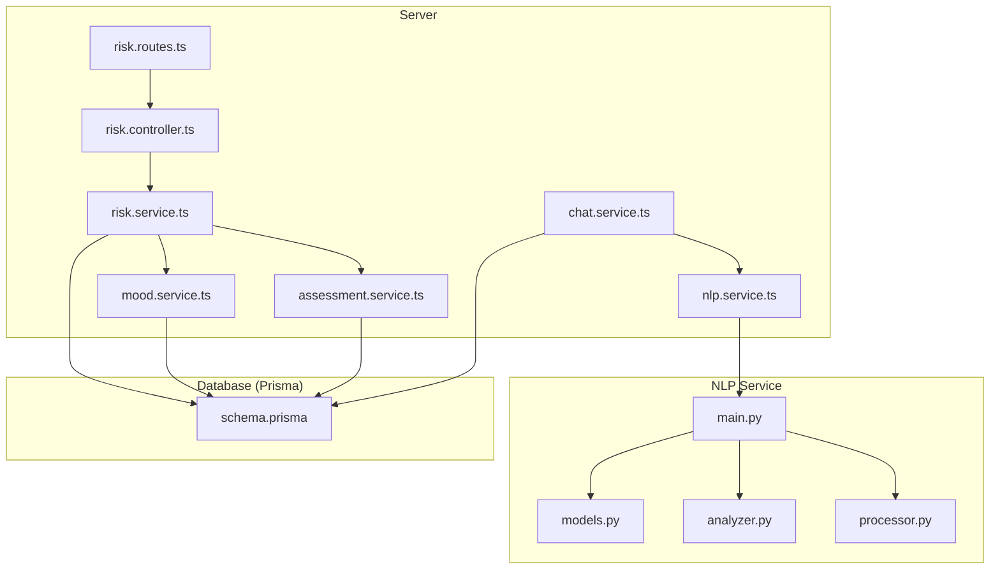
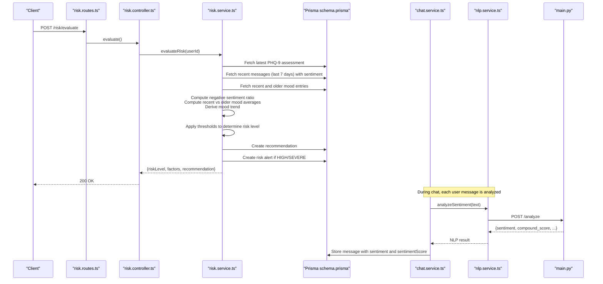
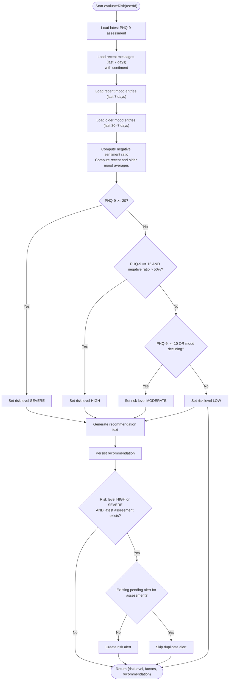
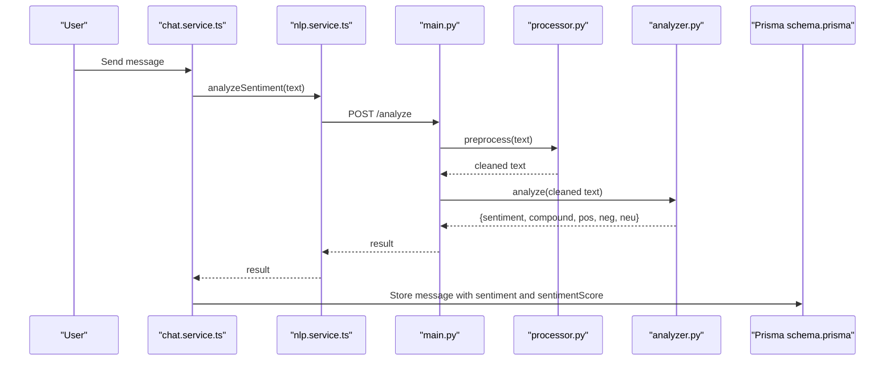
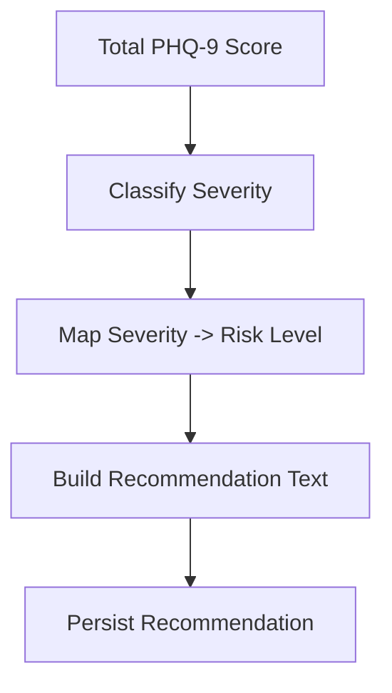
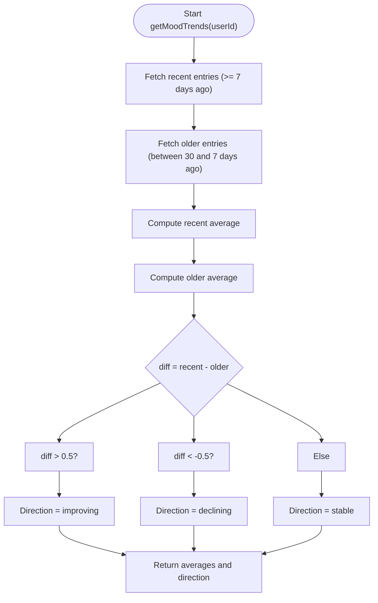
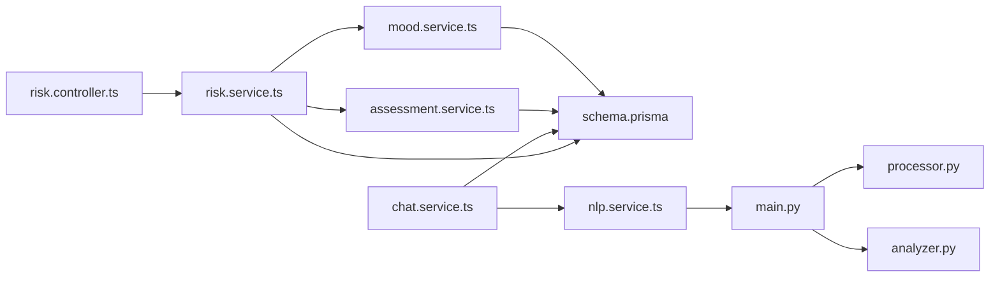

# Risk Detection Algorithms

<cite>
**Referenced Files in This Document**
- [risk.service.ts](file://server/src/services/risk.service.ts)
- [risk.controller.ts](file://server/src/controllers/risk.controller.ts)
- [risk.routes.ts](file://server/src/routes/risk.routes.ts)
- [assessment.service.ts](file://server/src/services/assessment.service.ts)
- [mood.service.ts](file://server/src/services/mood.service.ts)
- [chat.service.ts](file://server/src/services/chat.service.ts)
- [nlp.service.ts](file://server/src/services/nlp.service.ts)
- [analyzer.py](file://nlp-service/nlp/analyzer.py)
- [processor.py](file://nlp-service/nlp/processor.py)
- [main.py](file://nlp-service/main.py)
- [models.py](file://nlp-service/models.py)
- [schema.prisma](file://prisma/schema.prisma)
- [risk.test.ts](file://server/src/__tests__/risk.test.ts)
</cite>

## Table of Contents
1. [Introduction](#introduction)
2. [Project Structure](#project-structure)
3. [Core Components](#core-components)
4. [Architecture Overview](#architecture-overview)
5. [Detailed Component Analysis](#detailed-component-analysis)
6. [Dependency Analysis](#dependency-analysis)
7. [Performance Considerations](#performance-considerations)
8. [Troubleshooting Guide](#troubleshooting-guide)
9. [Conclusion](#conclusion)
10. [Appendices](#appendices)

## Introduction
This document details the multi-factor risk detection methodology implemented in the system. It combines:
- PHQ-9 depression screening scores
- Sentiment analysis trends derived from user-chat conversations
- Mood tracking patterns over time

The risk evaluation process aggregates these signals into a single risk level, generates tailored recommendations, and triggers alerts for high-risk cases. The document also outlines the thresholds, decision logic, and integration points with the NLP service and database models.

## Project Structure
The risk detection pipeline spans backend services, controllers, routes, and an external NLP microservice:
- Risk evaluation service orchestrates PHQ-9, sentiment, and mood signals.
- Chat service integrates VADER-based sentiment analysis for each user message.
- NLP service exposes a REST endpoint for sentiment inference.
- Prisma defines the data model for assessments, messages, moods, recommendations, and risk alerts.

**Diagram sources**
- [risk.service.ts:1-138](file://server/src/services/risk.service.ts#L1-L138)
- [risk.controller.ts:1-32](file://server/src/controllers/risk.controller.ts#L1-L32)
- [risk.routes.ts:1-11](file://server/src/routes/risk.routes.ts#L1-L11)
- [assessment.service.ts:1-89](file://server/src/services/assessment.service.ts#L1-L89)
- [mood.service.ts:1-58](file://server/src/services/mood.service.ts#L1-L58)
- [chat.service.ts:1-105](file://server/src/services/chat.service.ts#L1-L105)
- [nlp.service.ts:1-24](file://server/src/services/nlp.service.ts#L1-L24)
- [main.py:1-71](file://nlp-service/main.py#L1-L71)
- [processor.py:1-19](file://nlp-service/nlp/processor.py#L1-L19)
- [analyzer.py:1-27](file://nlp-service/nlp/analyzer.py#L1-L27)
- [models.py:1-26](file://nlp-service/models.py#L1-L26)
- [schema.prisma:1-134](file://prisma/schema.prisma#L1-L134)

**Section sources**
- [risk.service.ts:1-138](file://server/src/services/risk.service.ts#L1-L138)
- [risk.controller.ts:1-32](file://server/src/controllers/risk.controller.ts#L1-L32)
- [risk.routes.ts:1-11](file://server/src/routes/risk.routes.ts#L1-L11)
- [assessment.service.ts:1-89](file://server/src/services/assessment.service.ts#L1-L89)
- [mood.service.ts:1-58](file://server/src/services/mood.service.ts#L1-L58)
- [chat.service.ts:1-105](file://server/src/services/chat.service.ts#L1-L105)
- [nlp.service.ts:1-24](file://server/src/services/nlp.service.ts#L1-L24)
- [main.py:1-71](file://nlp-service/main.py#L1-L71)
- [processor.py:1-19](file://nlp-service/nlp/processor.py#L1-L19)
- [analyzer.py:1-27](file://nlp-service/nlp/analyzer.py#L1-L27)
- [models.py:1-26](file://nlp-service/models.py#L1-L26)
- [schema.prisma:1-134](file://prisma/schema.prisma#L1-L134)

## Core Components
- Risk Evaluation Service: Computes risk level from PHQ-9, recent negative sentiment ratio, and mood trend; persists recommendation and optional risk alert.
- Assessment Service: Submits PHQ-9 responses, computes severity, and generates recommendations.
- Mood Service: Aggregates recent and older mood entries to infer directional trends.
- Chat Service: Integrates NLP sentiment analysis for each user message; stores sentiment and sentiment score.
- NLP Service: Provides VADER-based sentiment analysis via REST endpoint.
- Database Models: Define enums and relations for assessments, messages, moods, recommendations, and risk alerts.

Key thresholds and logic:
- PHQ-9 thresholds: Severe (≥20), High (≥15 with high negative sentiment), Moderate (≥10 or declining mood), Low otherwise.
- Negative sentiment ratio threshold: >50% negative messages in the last 7 days.
- Mood trend threshold: Decline if recent average minus older average < −0.5.

**Section sources**
- [risk.service.ts:11-107](file://server/src/services/risk.service.ts#L11-L107)
- [assessment.service.ts:12-61](file://server/src/services/assessment.service.ts#L12-L61)
- [mood.service.ts:22-56](file://server/src/services/mood.service.ts#L22-L56)
- [chat.service.ts:45-88](file://server/src/services/chat.service.ts#L45-L88)
- [nlp.service.ts:11-23](file://server/src/services/nlp.service.ts#L11-L23)
- [schema.prisma:15-45](file://prisma/schema.prisma#L15-L45)

## Architecture Overview
The risk detection architecture integrates three data streams:
- PHQ-9: Stored assessment history; latest score drives initial risk classification.
- Sentiment: Derived from user messages; processed by NLP service and stored with each message.
- Mood: Self-reported entries aggregated over recent and older windows to detect trends.

**Diagram sources**
- [risk.routes.ts:7-8](file://server/src/routes/risk.routes.ts#L7-L8)
- [risk.controller.ts:5-16](file://server/src/controllers/risk.controller.ts#L5-L16)
- [risk.service.ts:11-107](file://server/src/services/risk.service.ts#L11-L107)
- [chat.service.ts:45-88](file://server/src/services/chat.service.ts#L45-L88)
- [nlp.service.ts:11-23](file://server/src/services/nlp.service.ts#L11-L23)
- [main.py:43-58](file://nlp-service/main.py#L43-L58)
- [schema.prisma:73-133](file://prisma/schema.prisma#L73-L133)

## Detailed Component Analysis

### Risk Evaluation Service
Responsibilities:
- Retrieve latest PHQ-9 assessment.
- Collect recent messages (last 7 days) with sentiment and compute negative sentiment ratio.
- Aggregate recent and older mood entries to compute averages and detect decline.
- Apply thresholds to assign risk level and compile factors.
- Persist recommendation and create risk alert for HIGH/SEVERE when appropriate.

Decision logic highlights:
- Severe: PHQ-9 ≥ 20.
- High: PHQ-9 ≥ 15 AND negative sentiment ratio > 50%.
- Moderate: PHQ-9 ≥ 10 OR mood trend declining.
- Low: Otherwise.

Recommendation generation and alerting:
- Generates risk-appropriate recommendation text.
- Creates a recommendation record.
- Creates a pending risk alert only if none exists for the current assessment.

**Diagram sources**
- [risk.service.ts:11-107](file://server/src/services/risk.service.ts#L11-L107)

**Section sources**
- [risk.service.ts:11-107](file://server/src/services/risk.service.ts#L11-L107)

### Sentiment Analysis Integration (VADER)
The system integrates VADER sentiment analysis during chat:
- Each user message is sent to the NLP service endpoint.
- The NLP service preprocesses text and applies VADER to produce sentiment and scores.
- The chat service maps the sentiment label to the internal enum and stores the compound score with the message.

**Diagram sources**
- [chat.service.ts:45-88](file://server/src/services/chat.service.ts#L45-L88)
- [nlp.service.ts:11-23](file://server/src/services/nlp.service.ts#L11-L23)
- [main.py:43-58](file://nlp-service/main.py#L43-L58)
- [processor.py:10-18](file://nlp-service/nlp/processor.py#L10-L18)
- [analyzer.py:8-26](file://nlp-service/nlp/analyzer.py#L8-L26)
- [models.py:4-20](file://nlp-service/models.py#L4-L20)

**Section sources**
- [chat.service.ts:45-88](file://server/src/services/chat.service.ts#L45-L88)
- [nlp.service.ts:11-23](file://server/src/services/nlp.service.ts#L11-L23)
- [main.py:43-58](file://nlp-service/main.py#L43-L58)
- [processor.py:10-18](file://nlp-service/nlp/processor.py#L10-L18)
- [analyzer.py:8-26](file://nlp-service/nlp/analyzer.py#L8-L26)
- [models.py:4-20](file://nlp-service/models.py#L4-L20)

### PHQ-9 Severity Mapping and Recommendations
- Severity classification is computed from total score.
- Risk level mapping aligns severity categories to risk levels.
- Recommendations are generated based on severity and total score.

**Diagram sources**
- [assessment.service.ts:12-88](file://server/src/services/assessment.service.ts#L12-L88)

**Section sources**
- [assessment.service.ts:12-88](file://server/src/services/assessment.service.ts#L12-L88)

### Mood Trend Calculation
- Recent window: last 7 days.
- Older window: 30–7 days prior.
- Direction inferred from difference between averages; thresholds define improving, stable, or declining.

**Diagram sources**
- [mood.service.ts:22-56](file://server/src/services/mood.service.ts#L22-L56)

**Section sources**
- [mood.service.ts:22-56](file://server/src/services/mood.service.ts#L22-L56)

## Dependency Analysis
- Controllers depend on services for business logic.
- Services depend on Prisma for persistence and on the NLP service for sentiment analysis.
- The NLP service encapsulates text preprocessing and VADER analysis.
- Database models define enums and relationships used across services.

**Diagram sources**
- [risk.controller.ts:1-32](file://server/src/controllers/risk.controller.ts#L1-L32)
- [risk.service.ts:1-138](file://server/src/services/risk.service.ts#L1-L138)
- [assessment.service.ts:1-89](file://server/src/services/assessment.service.ts#L1-L89)
- [mood.service.ts:1-58](file://server/src/services/mood.service.ts#L1-L58)
- [chat.service.ts:1-105](file://server/src/services/chat.service.ts#L1-L105)
- [nlp.service.ts:1-24](file://server/src/services/nlp.service.ts#L1-L24)
- [main.py:1-71](file://nlp-service/main.py#L1-L71)
- [processor.py:1-19](file://nlp-service/nlp/processor.py#L1-L19)
- [analyzer.py:1-27](file://nlp-service/nlp/analyzer.py#L1-L27)
- [schema.prisma:1-134](file://prisma/schema.prisma#L1-L134)

**Section sources**
- [risk.controller.ts:1-32](file://server/src/controllers/risk.controller.ts#L1-L32)
- [risk.service.ts:1-138](file://server/src/services/risk.service.ts#L1-L138)
- [assessment.service.ts:1-89](file://server/src/services/assessment.service.ts#L1-L89)
- [mood.service.ts:1-58](file://server/src/services/mood.service.ts#L1-L58)
- [chat.service.ts:1-105](file://server/src/services/chat.service.ts#L1-L105)
- [nlp.service.ts:1-24](file://server/src/services/nlp.service.ts#L1-L24)
- [main.py:1-71](file://nlp-service/main.py#L1-L71)
- [processor.py:1-19](file://nlp-service/nlp/processor.py#L1-L19)
- [analyzer.py:1-27](file://nlp-service/nlp/analyzer.py#L1-L27)
- [schema.prisma:1-134](file://prisma/schema.prisma#L1-L134)

## Performance Considerations
- Minimize database queries by fetching only necessary windows (7-day and 30-day mood windows) and limiting message retrieval to those with sentiment labels.
- Offload sentiment analysis to the NLP service to keep the chat flow responsive; handle transient failures gracefully.
- Cache or batch processing could be considered for high-volume deployments, though current implementation favors simplicity and correctness.

## Troubleshooting Guide
Common issues and mitigations:
- Missing PHQ-9 assessment: The evaluator defaults to a neutral baseline and may classify as LOW if no other signals are present.
- Insufficient sentiment data: Messages without sentiment labels are excluded from the negative ratio computation.
- Duplicate risk alerts: The evaluator checks for an existing pending alert tied to the latest assessment before creating a new one.
- NLP service unavailability: Chat continues without sentiment; risk evaluation still considers PHQ-9 and mood trends.

Validation coverage:
- Tests verify risk level assignments under various combinations of PHQ-9 scores, negative sentiment ratios, and mood trends.
- Tests confirm alert creation for severe/high risk and prevention of duplicates.

**Section sources**
- [risk.service.ts:88-104](file://server/src/services/risk.service.ts#L88-L104)
- [risk.test.ts:68-191](file://server/src/__tests__/risk.test.ts#L68-L191)

## Conclusion
The risk detection system employs a pragmatic, multi-factor approach:
- PHQ-9 captures symptom severity.
- Sentiment trends from chat capture behavioral and emotional cues.
- Mood trends reflect temporal changes in self-reported well-being.

Thresholds and decision logic are explicit and validated by tests. The modular design separates concerns across services and cleanly integrates an external NLP component. Recommendations and alerts are persisted for downstream clinical workflows.

## Appendices

### Risk Scoring Formula and Thresholds
- Inputs:
  - PHQ-9 total score
  - Negative sentiment ratio over the last 7 days
  - Recent vs older mood averages (declining trend if difference < −0.5)
- Output: Risk level (LOW, MODERATE, HIGH, SEVERE)
- Decision tree:
  - If PHQ-9 ≥ 20 → SEVERE
  - Else if PHQ-9 ≥ 15 AND negative sentiment ratio > 50% → HIGH
  - Else if PHQ-9 ≥ 10 OR mood trend declining → MODERATE
  - Else → LOW

Interpretation examples:
- Scenario A: PHQ-9 = 22 → SEVERE; recommendation emphasizes immediate professional support; risk alert created.
- Scenario B: PHQ-9 = 16 with 75% negative messages → HIGH; recommendation advises counselor appointment; risk alert created.
- Scenario C: PHQ-9 = 12 → MODERATE; recommendation suggests stress management and counselor support; risk alert created.
- Scenario D: PHQ-9 = 5, negative ratio = 25%, mood stable → LOW; recommendation encourages maintenance; no risk alert.

False positive reduction techniques:
- Require high negative sentiment ratio (>50%) alongside elevated PHQ-9 for HIGH classification.
- Use mood trend decline as an independent signal to avoid relying solely on PHQ-9.
- Avoid duplicate alerts per assessment by checking for existing pending alerts.

Sensitivity adjustments:
- Thresholds can be tuned (e.g., lowering PHQ-9 cutoff for HIGH or adjusting the negative ratio threshold) to balance sensitivity and specificity.
- Mood trend thresholds can be relaxed or tightened depending on population characteristics.

Integration with clinical guidelines:
- PHQ-9 thresholds align with standard severity categories.
- Recommendations mirror evidence-based guidance for escalating care based on severity and behavioral indicators.

Validation metrics:
- Unit tests cover typical and edge-case scenarios for risk assignment and alerting behavior.

**Section sources**
- [risk.service.ts:60-73](file://server/src/services/risk.service.ts#L60-L73)
- [risk.test.ts:69-166](file://server/src/__tests__/risk.test.ts#L69-L166)
- [assessment.service.ts:12-61](file://server/src/services/assessment.service.ts#L12-L61)