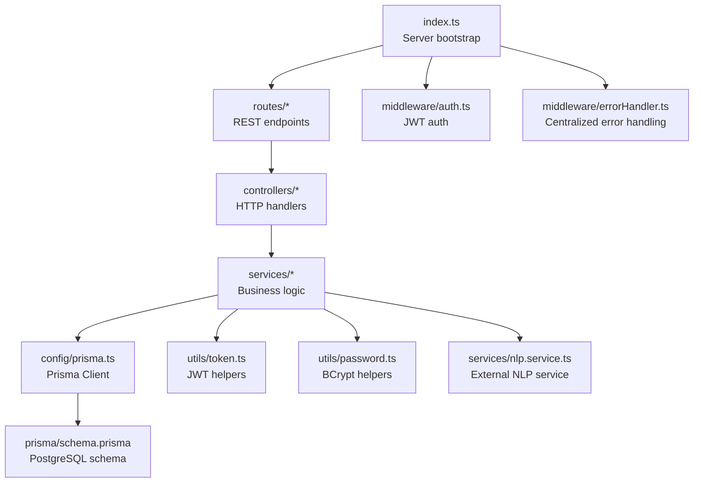
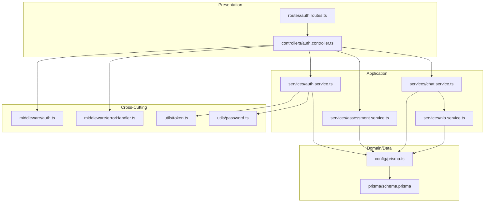
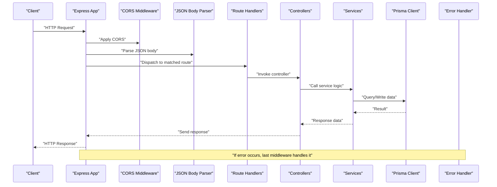
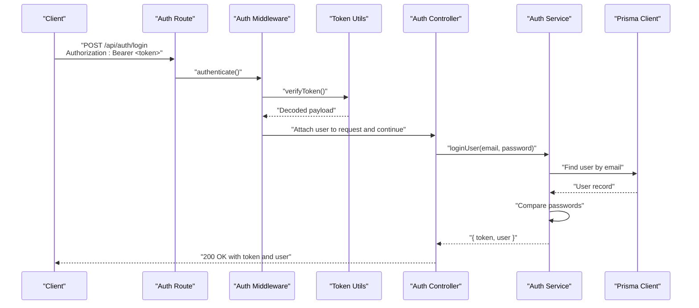
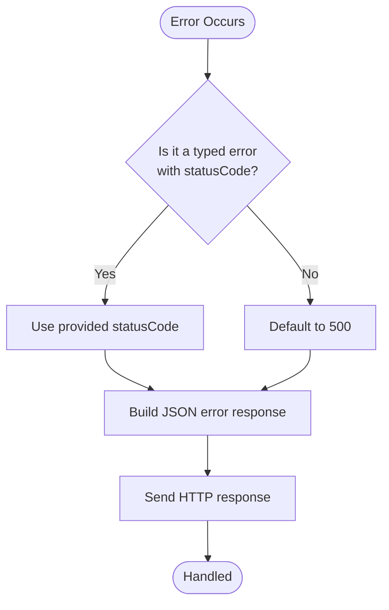
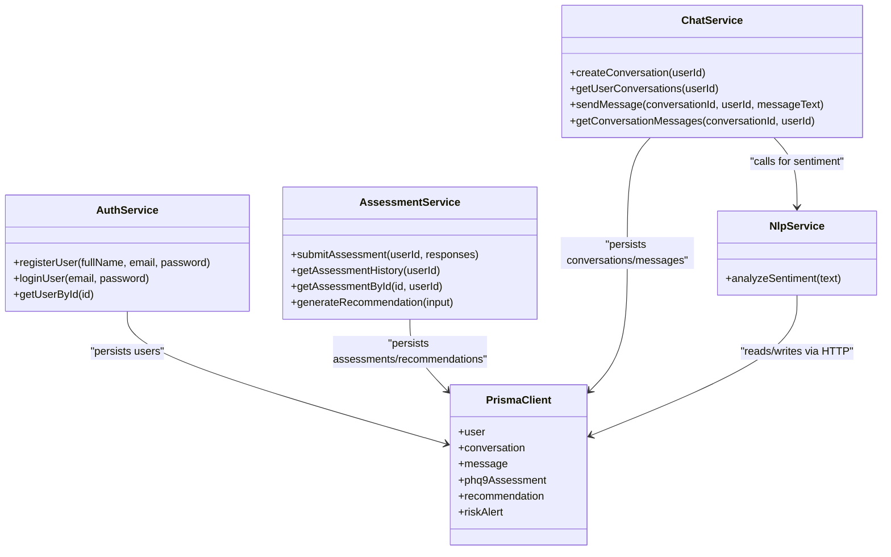
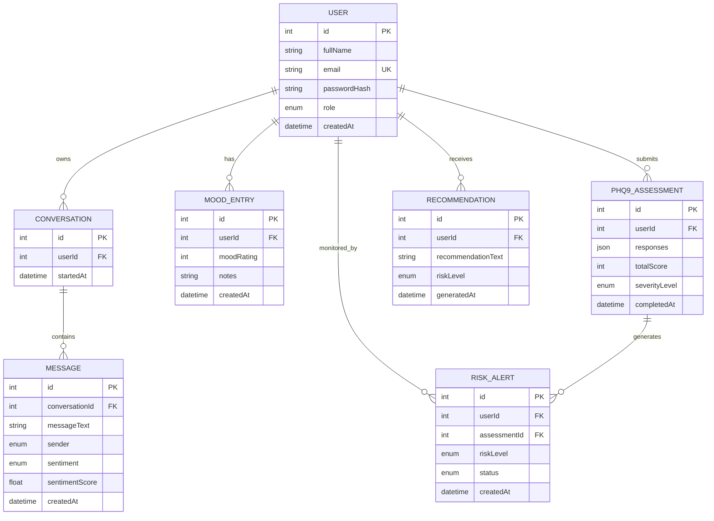
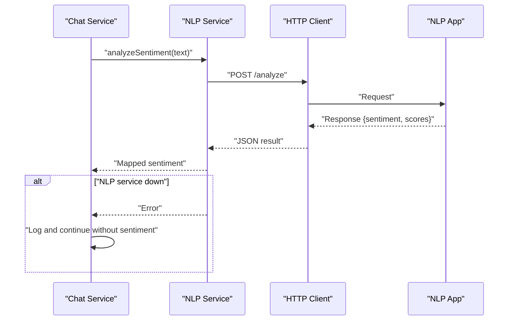
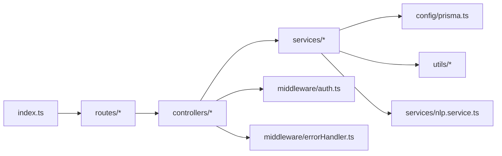

# Backend Services Layer

<cite>
**Referenced Files in This Document**
- [index.ts](file://server/src/index.ts)
- [env.ts](file://server/src/config/env.ts)
- [prisma.ts](file://server/src/config/prisma.ts)
- [auth.middleware.ts](file://server/src/middleware/auth.ts)
- [errorHandler.ts](file://server/src/middleware/errorHandler.ts)
- [auth.controller.ts](file://server/src/controllers/auth.controller.ts)
- [auth.routes.ts](file://server/src/routes/auth.routes.ts)
- [types.index.ts](file://server/src/types/index.ts)
- [token.utils.ts](file://server/src/utils/token.ts)
- [password.utils.ts](file://server/src/utils/password.ts)
- [auth.service.ts](file://server/src/services/auth.service.ts)
- [assessment.service.ts](file://server/src/services/assessment.service.ts)
- [chat.service.ts](file://server/src/services/chat.service.ts)
- [nlp.service.ts](file://server/src/services/nlp.service.ts)
- [schema.prisma](file://prisma/schema.prisma)
</cite>

## Table of Contents
1. [Introduction](#introduction)
2. [Project Structure](#project-structure)
3. [Core Components](#core-components)
4. [Architecture Overview](#architecture-overview)
5. [Detailed Component Analysis](#detailed-component-analysis)
6. [Dependency Analysis](#dependency-analysis)
7. [Performance Considerations](#performance-considerations)
8. [Troubleshooting Guide](#troubleshooting-guide)
9. [Conclusion](#conclusion)

## Introduction
This document describes the backend services layer built with Express.js. It explains server initialization, middleware stack (including authentication and error handling), layered architecture (controllers, services, data access), JWT-based authentication flow, service composition and inter-service communication, integration with Prisma ORM, RESTful API design, validation, and security. It also outlines scalability, load balancing, and performance optimization considerations.

## Project Structure
The server follows a feature-based, layered structure:
- Entry point initializes Express, global middleware, routes, and health endpoint.
- Routes define REST endpoints per feature.
- Controllers handle HTTP requests, delegate to services, and manage responses.
- Services encapsulate business logic and orchestrate data access.
- Data access uses Prisma Client configured centrally.
- Middleware enforces authentication and centralized error handling.
- Utilities provide token generation/verification and password hashing/comparison.
- Environment configuration centralizes runtime settings.

**Diagram sources**
- [index.ts:1-35](file://server/src/index.ts#L1-L35)
- [auth.routes.ts:1-12](file://server/src/routes/auth.routes.ts#L1-L12)
- [auth.controller.ts:1-50](file://server/src/controllers/auth.controller.ts#L1-L50)
- [auth.service.ts:1-72](file://server/src/services/auth.service.ts#L1-L72)
- [prisma.ts:1-6](file://server/src/config/prisma.ts#L1-L6)
- [schema.prisma:1-134](file://prisma/schema.prisma#L1-L134)
- [auth.middleware.ts:1-39](file://server/src/middleware/auth.ts#L1-L39)
- [errorHandler.ts:1-13](file://server/src/middleware/errorHandler.ts#L1-L13)
- [token.utils.ts:1-17](file://server/src/utils/token.ts#L1-L17)
- [password.utils.ts:1-12](file://server/src/utils/password.ts#L1-L12)
- [nlp.service.ts:1-24](file://server/src/services/nlp.service.ts#L1-L24)

**Section sources**
- [index.ts:1-35](file://server/src/index.ts#L1-L35)
- [env.ts:1-12](file://server/src/config/env.ts#L1-L12)

## Core Components
- Server bootstrap and middleware pipeline:
  - CORS and JSON body parsing applied globally.
  - Health check endpoint exposed.
  - Feature routes mounted under /api/*.
  - Centralized error handler attached last.
- Authentication middleware:
  - Extracts Bearer token from Authorization header.
  - Verifies token and attaches user payload to request.
  - Role-gated helper supports role-based access control.
- Error handling middleware:
  - Standardizes error responses with status codes.
- Environment configuration:
  - Loads .env, exposes port, database URL, JWT secret, and NLP service URL.
- Prisma configuration:
  - Singleton Prisma Client initialized once and reused across services.

**Section sources**
- [index.ts:1-35](file://server/src/index.ts#L1-L35)
- [auth.middleware.ts:1-39](file://server/src/middleware/auth.ts#L1-L39)
- [errorHandler.ts:1-13](file://server/src/middleware/errorHandler.ts#L1-L13)
- [env.ts:1-12](file://server/src/config/env.ts#L1-L12)
- [prisma.ts:1-6](file://server/src/config/prisma.ts#L1-L6)

## Architecture Overview
The backend employs a layered architecture:
- Presentation: Express routes and controllers.
- Application: Controllers call services for business logic.
- Domain/Data: Services use Prisma Client for persistence.
- Cross-cutting: Authentication middleware and error handling.

**Diagram sources**
- [auth.routes.ts:1-12](file://server/src/routes/auth.routes.ts#L1-L12)
- [auth.controller.ts:1-50](file://server/src/controllers/auth.controller.ts#L1-L50)
- [auth.service.ts:1-72](file://server/src/services/auth.service.ts#L1-L72)
- [assessment.service.ts:1-89](file://server/src/services/assessment.service.ts#L1-L89)
- [chat.service.ts:1-105](file://server/src/services/chat.service.ts#L1-L105)
- [nlp.service.ts:1-24](file://server/src/services/nlp.service.ts#L1-L24)
- [prisma.ts:1-6](file://server/src/config/prisma.ts#L1-L6)
- [schema.prisma:1-134](file://prisma/schema.prisma#L1-L134)
- [auth.middleware.ts:1-39](file://server/src/middleware/auth.ts#L1-L39)
- [errorHandler.ts:1-13](file://server/src/middleware/errorHandler.ts#L1-L13)
- [token.utils.ts:1-17](file://server/src/utils/token.ts#L1-L17)
- [password.utils.ts:1-12](file://server/src/utils/password.ts#L1-L12)

## Detailed Component Analysis

### Server Initialization and Middleware Pipeline
- Global middleware:
  - CORS enabled for cross-origin requests.
  - Body parsing for JSON payloads.
- Health endpoint:
  - GET /health returns a simple status payload.
- Route mounting:
  - Feature routes grouped under /api/{feature}.
- Error handling:
  - Last middleware catches errors thrown by route handlers or services.

**Diagram sources**
- [index.ts:1-35](file://server/src/index.ts#L1-L35)
- [auth.routes.ts:1-12](file://server/src/routes/auth.routes.ts#L1-L12)
- [auth.controller.ts:1-50](file://server/src/controllers/auth.controller.ts#L1-L50)
- [auth.service.ts:1-72](file://server/src/services/auth.service.ts#L1-L72)
- [prisma.ts:1-6](file://server/src/config/prisma.ts#L1-L6)
- [errorHandler.ts:1-13](file://server/src/middleware/errorHandler.ts#L1-L13)

**Section sources**
- [index.ts:1-35](file://server/src/index.ts#L1-L35)

### Authentication Flow (JWT)
- Token extraction:
  - Authorization header must start with "Bearer ".
- Token verification:
  - Uses shared JWT secret to verify signature and decode payload.
- User context:
  - Verified payload is attached to request for downstream use.
- Role enforcement:
  - Higher-order function validates required roles.

**Diagram sources**
- [auth.routes.ts:1-12](file://server/src/routes/auth.routes.ts#L1-L12)
- [auth.middleware.ts:1-39](file://server/src/middleware/auth.ts#L1-L39)
- [token.utils.ts:1-17](file://server/src/utils/token.ts#L1-L17)
- [auth.controller.ts:1-50](file://server/src/controllers/auth.controller.ts#L1-L50)
- [auth.service.ts:1-72](file://server/src/services/auth.service.ts#L1-L72)
- [prisma.ts:1-6](file://server/src/config/prisma.ts#L1-L6)

**Section sources**
- [auth.middleware.ts:1-39](file://server/src/middleware/auth.ts#L1-L39)
- [token.utils.ts:1-17](file://server/src/utils/token.ts#L1-L17)
- [types.index.ts:1-12](file://server/src/types/index.ts#L1-L12)

### Error Handling Strategy
- Centralized error middleware:
  - Reads status code from error object or defaults to 500.
  - Returns standardized JSON error response.
- Service/controller propagation:
  - Controllers wrap logic in try/catch and forward errors to next().
  - Services throw typed errors with optional status codes.

**Diagram sources**
- [errorHandler.ts:1-13](file://server/src/middleware/errorHandler.ts#L1-L13)
- [auth.controller.ts:1-50](file://server/src/controllers/auth.controller.ts#L1-L50)
- [auth.service.ts:1-72](file://server/src/services/auth.service.ts#L1-L72)

**Section sources**
- [errorHandler.ts:1-13](file://server/src/middleware/errorHandler.ts#L1-L13)
- [auth.controller.ts:1-50](file://server/src/controllers/auth.controller.ts#L1-L50)

### Service Organization and Composition
- Auth service:
  - Handles registration, login, and user retrieval.
  - Uses password hashing and token generation utilities.
- Assessment service:
  - Computes PHQ-9 severity and generates recommendations.
  - Persists assessments and recommendations.
- Chat service:
  - Manages conversations and messages.
  - Integrates NLP service for sentiment analysis.
  - Generates bot responses based on sentiment.
- NLP service:
  - Delegates sentiment analysis to external NLP service.
  - Wraps network errors into domain errors.

**Diagram sources**
- [auth.service.ts:1-72](file://server/src/services/auth.service.ts#L1-L72)
- [assessment.service.ts:1-89](file://server/src/services/assessment.service.ts#L1-L89)
- [chat.service.ts:1-105](file://server/src/services/chat.service.ts#L1-L105)
- [nlp.service.ts:1-24](file://server/src/services/nlp.service.ts#L1-L24)
- [prisma.ts:1-6](file://server/src/config/prisma.ts#L1-L6)
- [schema.prisma:1-134](file://prisma/schema.prisma#L1-L134)

**Section sources**
- [auth.service.ts:1-72](file://server/src/services/auth.service.ts#L1-L72)
- [assessment.service.ts:1-89](file://server/src/services/assessment.service.ts#L1-L89)
- [chat.service.ts:1-105](file://server/src/services/chat.service.ts#L1-L105)
- [nlp.service.ts:1-24](file://server/src/services/nlp.service.ts#L1-L24)

### Data Access and Transactions
- Prisma Client:
  - Singleton initialized once and reused across services.
  - Provides type-safe queries and mutations.
- Schema overview:
  - Entities: User, Conversation, Message, MoodEntry, Phq9Assessment, Recommendation, RiskAlert.
  - Enumerations: Role, Sentiment, Sender, SeverityLevel, RiskLevel, AlertStatus.
- Transactions:
  - Current implementation does not show explicit Prisma transactions.
  - Multi-step operations (e.g., chat message creation) are handled in single service methods without transaction blocks.

**Diagram sources**
- [schema.prisma:1-134](file://prisma/schema.prisma#L1-L134)

**Section sources**
- [prisma.ts:1-6](file://server/src/config/prisma.ts#L1-L6)
- [schema.prisma:1-134](file://prisma/schema.prisma#L1-L134)

### Inter-Service Communication
- Chat service calls NLP service:
  - Sends text to external NLP endpoint.
  - Handles network failures gracefully by logging and continuing without sentiment.
- Service-to-service:
  - Services are cohesive units; no explicit DI container is present.
  - Dependencies are imported directly, enabling straightforward testing and composition.

**Diagram sources**
- [chat.service.ts:1-105](file://server/src/services/chat.service.ts#L1-L105)
- [nlp.service.ts:1-24](file://server/src/services/nlp.service.ts#L1-L24)

**Section sources**
- [chat.service.ts:1-105](file://server/src/services/chat.service.ts#L1-L105)
- [nlp.service.ts:1-24](file://server/src/services/nlp.service.ts#L1-L24)

### RESTful API Design Principles and Validation
- Endpoint design:
  - Resource-based paths under /api/{resource}.
  - Clear HTTP verbs: POST for creation, GET for retrieval.
- Validation:
  - Controllers validate presence of required fields before invoking services.
  - Services enforce domain-specific checks (e.g., uniqueness, existence).
- Security:
  - Authentication middleware protects sensitive endpoints.
  - Passwords hashed with salt; tokens signed with a secret.

**Section sources**
- [auth.routes.ts:1-12](file://server/src/routes/auth.routes.ts#L1-L12)
- [auth.controller.ts:1-50](file://server/src/controllers/auth.controller.ts#L1-L50)
- [auth.service.ts:1-72](file://server/src/services/auth.service.ts#L1-L72)
- [password.utils.ts:1-12](file://server/src/utils/password.ts#L1-L12)
- [token.utils.ts:1-17](file://server/src/utils/token.ts#L1-L17)

## Dependency Analysis
- Coupling:
  - Controllers depend on services; services depend on Prisma Client.
  - Authentication middleware depends on token utilities.
  - Chat service depends on NLP service.
- Cohesion:
  - Services encapsulate related business logic and data access.
- External dependencies:
  - Express, Prisma Client, jsonwebtoken, bcrypt, dotenv.

**Diagram sources**
- [index.ts:1-35](file://server/src/index.ts#L1-L35)
- [auth.routes.ts:1-12](file://server/src/routes/auth.routes.ts#L1-L12)
- [auth.controller.ts:1-50](file://server/src/controllers/auth.controller.ts#L1-L50)
- [auth.service.ts:1-72](file://server/src/services/auth.service.ts#L1-L72)
- [prisma.ts:1-6](file://server/src/config/prisma.ts#L1-L6)
- [auth.middleware.ts:1-39](file://server/src/middleware/auth.ts#L1-L39)
- [errorHandler.ts:1-13](file://server/src/middleware/errorHandler.ts#L1-L13)
- [nlp.service.ts:1-24](file://server/src/services/nlp.service.ts#L1-L24)

**Section sources**
- [index.ts:1-35](file://server/src/index.ts#L1-L35)

## Performance Considerations
- Connection pooling:
  - Prisma Client manages a pool by default; ensure DATABASE_URL is set appropriately for production.
- Caching:
  - Consider caching frequent reads (e.g., user profiles) to reduce database load.
- Asynchronous processing:
  - Offload long-running tasks (e.g., NLP analysis) to background jobs or queues.
- Load balancing:
  - Run multiple instances behind a reverse proxy or platform balancer.
- Horizontal scaling:
  - Stateless server design enables easy scaling; persist sessions externally if needed.
- Monitoring:
  - Add metrics and structured logs for latency, error rates, and throughput.

## Troubleshooting Guide
- Authentication failures:
  - Missing or malformed Authorization header yields 401.
  - Invalid/expired token yields 401.
  - Insufficient permissions yield 403.
- Service errors:
  - Domain errors with status codes propagate to centralized handler.
  - Unknown errors default to 500 with generic message.
- Database connectivity:
  - Verify DATABASE_URL and credentials.
  - Check Prisma Client initialization and connection limits.
- NLP service unavailability:
  - Chat service continues without sentiment; monitor logs for transient failures.

**Section sources**
- [auth.middleware.ts:1-39](file://server/src/middleware/auth.ts#L1-L39)
- [errorHandler.ts:1-13](file://server/src/middleware/errorHandler.ts#L1-L13)
- [chat.service.ts:1-105](file://server/src/services/chat.service.ts#L1-L105)
- [env.ts:1-12](file://server/src/config/env.ts#L1-L12)
- [prisma.ts:1-6](file://server/src/config/prisma.ts#L1-L6)

## Conclusion
The backend services layer is cleanly organized with clear separation of concerns. The Express server applies essential middleware, routes map to controllers, services encapsulate business logic, and Prisma provides robust data access. JWT-based authentication and centralized error handling improve security and reliability. To scale, adopt horizontal scaling, connection pooling tuning, caching, and asynchronous processing for heavy workloads. The current design supports incremental enhancements to transactions, DI, and observability.