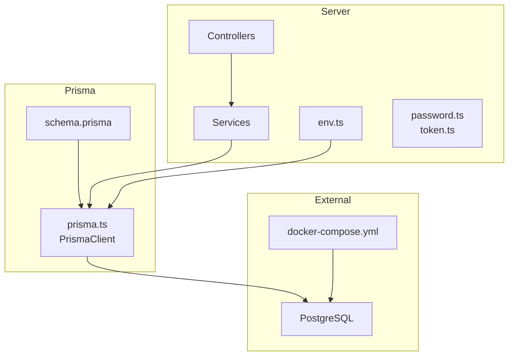
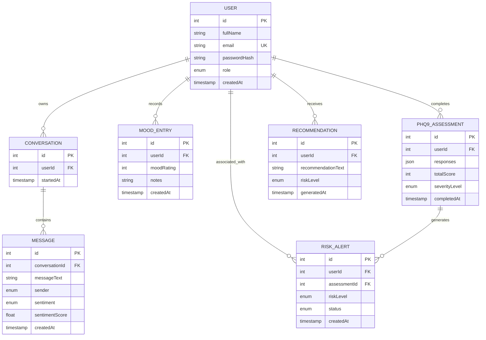
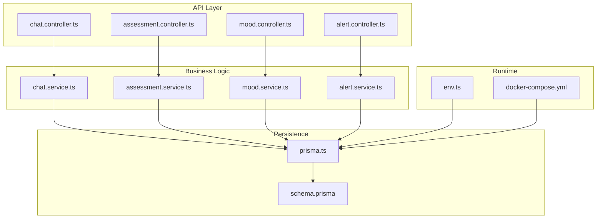
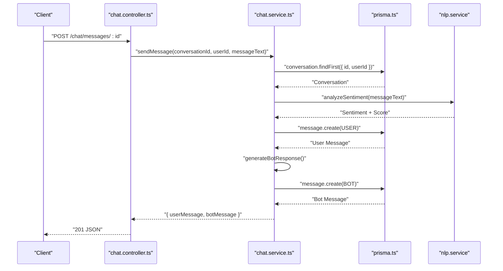
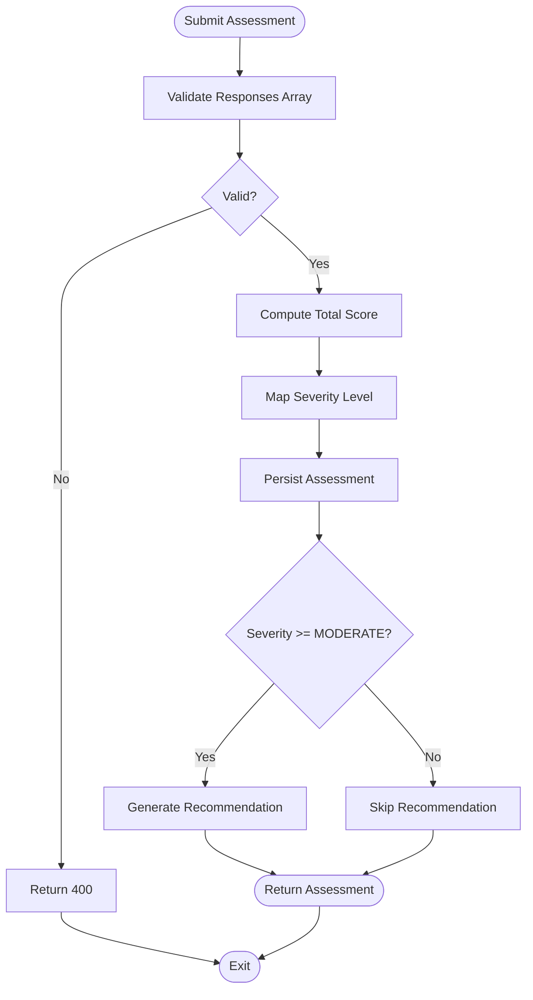
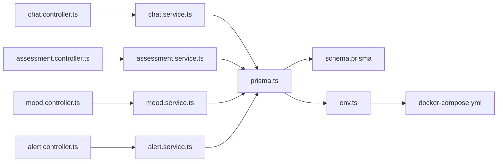

# Data Layer Architecture

<cite>
**Referenced Files in This Document**
- [schema.prisma](file://prisma/schema.prisma)
- [prisma.ts](file://server/src/config/prisma.ts)
- [env.ts](file://server/src/config/env.ts)
- [docker-compose.yml](file://docker-compose.yml)
- [chat.service.ts](file://server/src/services/chat.service.ts)
- [assessment.service.ts](file://server/src/services/assessment.service.ts)
- [mood.service.ts](file://server/src/services/mood.service.ts)
- [alert.service.ts](file://server/src/services/alert.service.ts)
- [chat.controller.ts](file://server/src/controllers/chat.controller.ts)
- [assessment.controller.ts](file://server/src/controllers/assessment.controller.ts)
- [mood.controller.ts](file://server/src/controllers/mood.controller.ts)
- [alert.controller.ts](file://server/src/controllers/alert.controller.ts)
- [password.ts](file://server/src/utils/password.ts)
- [token.ts](file://server/src/utils/token.ts)
- [setup.ts](file://server/src/__tests__/setup.ts)
</cite>

## Table of Contents
1. [Introduction](#introduction)
2. [Project Structure](#project-structure)
3. [Core Components](#core-components)
4. [Architecture Overview](#architecture-overview)
5. [Detailed Component Analysis](#detailed-component-analysis)
6. [Dependency Analysis](#dependency-analysis)
7. [Performance Considerations](#performance-considerations)
8. [Troubleshooting Guide](#troubleshooting-guide)
9. [Conclusion](#conclusion)
10. [Appendices](#appendices)

## Introduction
This document describes the data layer architecture of BuddyAI with a focus on the PostgreSQL database design and Prisma ORM implementation. It documents the entity-relationship model for User, Conversation, Message, MoodEntry, Phq9Assessment, Recommendation, and RiskAlert, including field definitions, data types, primary and foreign keys, and database constraints. It also explains Prisma schema design, model relationships, and generated client API usage, along with data validation rules, business logic constraints, referential integrity enforcement, migration strategies, schema evolution patterns, data seeding processes, data access patterns, query optimization techniques, indexing strategies, data lifecycle management, retention policies, backup procedures, performance considerations, connection pooling, and transaction management patterns.

## Project Structure
The data layer spans three main areas:
- Prisma schema defines the database model and enums.
- Prisma client is initialized in the server configuration.
- Services encapsulate CRUD operations and business logic.
- Controllers handle HTTP requests and responses.
- Environment configuration supplies the DATABASE_URL and other runtime settings.
- Docker Compose provisions a PostgreSQL instance for local development.

**Diagram sources**
- [schema.prisma:1-134](file://prisma/schema.prisma#L1-L134)
- [prisma.ts:1-6](file://server/src/config/prisma.ts#L1-L6)
- [env.ts:1-12](file://server/src/config/env.ts#L1-L12)
- [docker-compose.yml:1-19](file://docker-compose.yml#L1-L19)

**Section sources**
- [schema.prisma:1-134](file://prisma/schema.prisma#L1-L134)
- [prisma.ts:1-6](file://server/src/config/prisma.ts#L1-L6)
- [env.ts:1-12](file://server/src/config/env.ts#L1-L12)
- [docker-compose.yml:1-19](file://docker-compose.yml#L1-L19)

## Core Components
This section documents the entities and their attributes, constraints, and relationships as defined in the Prisma schema.

- User
  - Fields: id (Int, autoincrement), fullName (String), email (String, unique), passwordHash (String), role (Role enum, default STUDENT), createdAt (DateTime, default now), relations: conversations[], moodEntries[], assessments[], recommendations[], riskAlerts[].
  - Constraints: Unique index on email; default role and creation timestamp.
  - Indexes: @@index([email]).

- Conversation
  - Fields: id (Int, autoincrement), userId (Int), startedAt (DateTime, default now), relation: user(User), messages[].
  - Constraints: Foreign key userId -> User.id; default start timestamp.
  - Indexes: @@index([userId]).

- Message
  - Fields: id (Int, autoincrement), conversationId (Int), messageText (String), sender (Sender enum), sentiment (Sentiment enum?), sentimentScore (Float?), createdAt (DateTime, default now), relation: conversation(Conversation).
  - Constraints: Foreign key conversationId -> Conversation.id; optional sentiment and score.
  - Indexes: @@index([conversationId]).

- MoodEntry
  - Fields: id (Int, autoincrement), userId (Int), moodRating (Int), notes (String?), createdAt (DateTime, default now), relation: user(User).
  - Constraints: Foreign key userId -> User.id; rating range validated in service.
  - Indexes: @@index([userId]).

- Phq9Assessment
  - Fields: id (Int, autoincrement), userId (Int), responses (Json), totalScore (Int), severityLevel (SeverityLevel enum), completedAt (DateTime, default now), relation: user(User), riskAlerts[].
  - Constraints: Foreign key userId -> User.id; severity derived from total score; default completion timestamp.
  - Indexes: @@index([userId]).

- Recommendation
  - Fields: id (Int, autoincrement), userId (Int), recommendationText (String), riskLevel (RiskLevel enum), generatedAt (DateTime, default now), relation: user(User).
  - Constraints: Foreign key userId -> User.id; default generation timestamp.
  - Indexes: @@index([userId]).

- RiskAlert
  - Fields: id (Int, autoincrement), userId (Int), assessmentId (Int), riskLevel (RiskLevel enum), status (AlertStatus enum, default PENDING), createdAt (DateTime, default now), relations: user(User), assessment(Phq9Assessment).
  - Constraints: Foreign keys userId -> User.id, assessmentId -> Phq9Assessment.id; default alert status and creation timestamp.
  - Indexes: @@index([userId]), @@index([assessmentId]).

**Diagram sources**
- [schema.prisma:47-133](file://prisma/schema.prisma#L47-L133)

**Section sources**
- [schema.prisma:10-133](file://prisma/schema.prisma#L10-L133)

## Architecture Overview
The data layer follows a layered architecture:
- Prisma schema defines the domain model and enforces referential integrity.
- Prisma client provides type-safe database access.
- Services encapsulate business logic and validation.
- Controllers expose REST endpoints with input validation and error handling.
- Environment configuration injects DATABASE_URL for Prisma.
- Docker Compose provisions a PostgreSQL container for local development.

**Diagram sources**
- [chat.controller.ts:1-69](file://server/src/controllers/chat.controller.ts#L1-L69)
- [assessment.controller.ts:1-74](file://server/src/controllers/assessment.controller.ts#L1-L74)
- [mood.controller.ts:1-67](file://server/src/controllers/mood.controller.ts#L1-L67)
- [alert.controller.ts:1-70](file://server/src/controllers/alert.controller.ts#L1-L70)
- [chat.service.ts:1-105](file://server/src/services/chat.service.ts#L1-L105)
- [assessment.service.ts:1-89](file://server/src/services/assessment.service.ts#L1-L89)
- [mood.service.ts:1-58](file://server/src/services/mood.service.ts#L1-L58)
- [alert.service.ts:1-62](file://server/src/services/alert.service.ts#L1-L62)
- [prisma.ts:1-6](file://server/src/config/prisma.ts#L1-L6)
- [schema.prisma:1-134](file://prisma/schema.prisma#L1-L134)
- [env.ts:1-12](file://server/src/config/env.ts#L1-L12)
- [docker-compose.yml:1-19](file://docker-compose.yml#L1-L19)

## Detailed Component Analysis

### Prisma Schema and Enums
- Enumerations define controlled vocabularies for roles, sentiment, sender, severity level, risk level, and alert status.
- Models define primary keys, defaults, relations, and indexes.
- Foreign keys are declared with relation metadata to enforce referential integrity at the ORM level.

**Section sources**
- [schema.prisma:10-45](file://prisma/schema.prisma#L10-L45)
- [schema.prisma:47-133](file://prisma/schema.prisma#L47-L133)

### Prisma Client Initialization
- A singleton PrismaClient is instantiated and exported for use across services.
- DATABASE_URL is sourced from environment configuration.

**Section sources**
- [prisma.ts:1-6](file://server/src/config/prisma.ts#L1-L6)
- [env.ts:8-8](file://server/src/config/env.ts#L8-L8)

### Chat Module
- Controllers validate authentication and request payloads.
- Services encapsulate conversation creation, retrieval, message sending, and message listing with NLP sentiment analysis integration.
- Business logic ensures conversations belong to the authenticated user before operations.

**Diagram sources**
- [chat.controller.ts:33-53](file://server/src/controllers/chat.controller.ts#L33-L53)
- [chat.service.ts:45-89](file://server/src/services/chat.service.ts#L45-L89)
- [prisma.ts:1-6](file://server/src/config/prisma.ts#L1-L6)

**Section sources**
- [chat.controller.ts:1-69](file://server/src/controllers/chat.controller.ts#L1-L69)
- [chat.service.ts:1-105](file://server/src/services/chat.service.ts#L1-L105)

### Assessment Module
- Controllers validate PHQ-9 responses format and scoring bounds.
- Services compute total score, severity level, and optionally generate recommendations and risk alerts for moderate/severe cases.
- Business logic maps severity to risk level and constructs recommendation text.

**Diagram sources**
- [assessment.controller.ts:12-34](file://server/src/controllers/assessment.controller.ts#L12-L34)
- [assessment.service.ts:20-33](file://server/src/services/assessment.service.ts#L20-L33)
- [assessment.service.ts:48-88](file://server/src/services/assessment.service.ts#L48-L88)

**Section sources**
- [assessment.controller.ts:1-74](file://server/src/controllers/assessment.controller.ts#L1-L74)
- [assessment.service.ts:1-89](file://server/src/services/assessment.service.ts#L1-L89)

### Mood Module
- Controllers validate mood rating range and optional notes.
- Services persist mood entries and compute trend summaries over recent and older windows.

**Section sources**
- [mood.controller.ts:1-67](file://server/src/controllers/mood.controller.ts#L1-L67)
- [mood.service.ts:1-58](file://server/src/services/mood.service.ts#L1-L58)

### Risk Alerts Module
- Controllers filter and update alerts with strict status validation.
- Services fetch paginated alerts with included user and assessment details, and produce student summaries.

**Section sources**
- [alert.controller.ts:1-70](file://server/src/controllers/alert.controller.ts#L1-L70)
- [alert.service.ts:1-62](file://server/src/services/alert.service.ts#L1-L62)

### Authentication and Authorization
- JWT tokens carry user identity and role; controllers guard endpoints and services verify ownership of resources.

**Section sources**
- [token.ts:1-16](file://server/src/utils/token.ts#L1-L16)
- [chat.controller.ts:7-10](file://server/src/controllers/chat.controller.ts#L7-L10)
- [assessment.controller.ts:7-10](file://server/src/controllers/assessment.controller.ts#L7-L10)
- [mood.controller.ts:7-10](file://server/src/controllers/mood.controller.ts#L7-L10)
- [alert.controller.ts:5-15](file://server/src/controllers/alert.controller.ts#L5-L15)

### Password Hashing
- Password hashing and comparison utilities are provided for secure credential handling.

**Section sources**
- [password.ts:1-11](file://server/src/utils/password.ts#L1-L11)

## Dependency Analysis
- Controllers depend on services for business logic.
- Services depend on Prisma client for persistence.
- Prisma client depends on schema definitions and DATABASE_URL.
- Environment configuration supplies runtime values.
- Docker Compose provides the PostgreSQL backend.

**Diagram sources**
- [chat.controller.ts:1-69](file://server/src/controllers/chat.controller.ts#L1-L69)
- [assessment.controller.ts:1-74](file://server/src/controllers/assessment.controller.ts#L1-L74)
- [mood.controller.ts:1-67](file://server/src/controllers/mood.controller.ts#L1-L67)
- [alert.controller.ts:1-70](file://server/src/controllers/alert.controller.ts#L1-L70)
- [chat.service.ts:1-105](file://server/src/services/chat.service.ts#L1-L105)
- [assessment.service.ts:1-89](file://server/src/services/assessment.service.ts#L1-L89)
- [mood.service.ts:1-58](file://server/src/services/mood.service.ts#L1-L58)
- [alert.service.ts:1-62](file://server/src/services/alert.service.ts#L1-L62)
- [prisma.ts:1-6](file://server/src/config/prisma.ts#L1-L6)
- [schema.prisma:1-134](file://prisma/schema.prisma#L1-L134)
- [env.ts:1-12](file://server/src/config/env.ts#L1-L12)
- [docker-compose.yml:1-19](file://docker-compose.yml#L1-L19)

**Section sources**
- [chat.controller.ts:1-69](file://server/src/controllers/chat.controller.ts#L1-L69)
- [assessment.controller.ts:1-74](file://server/src/controllers/assessment.controller.ts#L1-L74)
- [mood.controller.ts:1-67](file://server/src/controllers/mood.controller.ts#L1-L67)
- [alert.controller.ts:1-70](file://server/src/controllers/alert.controller.ts#L1-L70)
- [chat.service.ts:1-105](file://server/src/services/chat.service.ts#L1-L105)
- [assessment.service.ts:1-89](file://server/src/services/assessment.service.ts#L1-L89)
- [mood.service.ts:1-58](file://server/src/services/mood.service.ts#L1-L58)
- [alert.service.ts:1-62](file://server/src/services/alert.service.ts#L1-L62)
- [prisma.ts:1-6](file://server/src/config/prisma.ts#L1-L6)
- [schema.prisma:1-134](file://prisma/schema.prisma#L1-L134)
- [env.ts:1-12](file://server/src/config/env.ts#L1-L12)
- [docker-compose.yml:1-19](file://docker-compose.yml#L1-L19)

## Performance Considerations
- Indexes: The schema defines indexes on foreign keys and unique identifiers to accelerate joins and lookups.
- Query patterns: Services use targeted queries with ordering and limiting (e.g., last message per conversation, recent entries).
- Connection pooling: Prisma manages connection pooling by default; production deployments should tune pool size and timeouts via environment variables.
- Transactions: For multi-step operations (e.g., assessment creation followed by recommendation), wrap in Prisma transactions to maintain atomicity.
- Caching: Consider caching frequently accessed dashboards or summaries at the application layer.
- Monitoring: Enable Prisma query logging and database slow query logs during profiling.

[No sources needed since this section provides general guidance]

## Troubleshooting Guide
- Authentication failures: Ensure JWT is present and valid; controllers return 401 when missing.
- Resource ownership: Controllers verify that requested resources belong to the authenticated user; otherwise return 404.
- Validation errors: Controllers validate input shapes and ranges; services apply domain-specific checks (e.g., PHQ-9 responses length and bounds).
- NLP service unavailability: Chat service continues without sentiment when NLP is unreachable; log errors and degrade gracefully.
- Database connectivity: Confirm DATABASE_URL in environment matches Docker Compose credentials and port mapping.

**Section sources**
- [chat.controller.ts:7-10](file://server/src/controllers/chat.controller.ts#L7-L10)
- [assessment.controller.ts:14-21](file://server/src/controllers/assessment.controller.ts#L14-L21)
- [mood.controller.ts:14-27](file://server/src/controllers/mood.controller.ts#L14-L27)
- [chat.service.ts:58-65](file://server/src/services/chat.service.ts#L58-L65)
- [env.ts:8-8](file://server/src/config/env.ts#L8-L8)
- [docker-compose.yml:8-13](file://docker-compose.yml#L8-L13)

## Conclusion
The BuddyAI data layer leverages Prisma to model a relational domain around users, conversations, messages, mood tracking, PHQ-9 assessments, recommendations, and risk alerts. The schema enforces referential integrity and indexes, while services encapsulate business logic and validation. Controllers provide guarded endpoints with clear error handling. The stack integrates with PostgreSQL via Docker Compose and supports scalable deployment patterns through Prisma’s connection management.

[No sources needed since this section summarizes without analyzing specific files]

## Appendices

### Data Validation Rules and Business Logic Constraints
- PHQ-9 responses must be an array of exactly nine integers ranging from zero to three; severity is computed from the total score.
- Mood rating must be an integer between one and five; notes are optional strings.
- Messages require non-empty text; sentiment and score are optional and populated via NLP.
- Risk alerts default to pending status and are associated with assessments and users.
- Recommendations are generated for moderate or greater severity levels.

**Section sources**
- [assessment.controller.ts:14-21](file://server/src/controllers/assessment.controller.ts#L14-L21)
- [assessment.service.ts:12-18](file://server/src/services/assessment.service.ts#L12-L18)
- [mood.controller.ts:14-27](file://server/src/controllers/mood.controller.ts#L14-L27)
- [chat.service.ts:54-65](file://server/src/services/chat.service.ts#L54-L65)
- [alert.service.ts:28-33](file://server/src/services/alert.service.ts#L28-L33)

### Database Migration Strategies and Schema Evolution
- Use Prisma Migrate to manage schema changes in development and staging environments.
- Generate migrations from schema updates; review and test before applying to production.
- For breaking changes, plan rollbacks and data transformations; coordinate with application versioning.

[No sources needed since this section provides general guidance]

### Data Seeding Processes
- Seed initial data (e.g., users, roles, default configurations) using Prisma Studio or seed scripts.
- Ensure seed scripts are idempotent and safe for repeated runs.

[No sources needed since this section provides general guidance]

### Data Access Patterns and Query Optimization
- Prefer indexed foreign keys for joins (e.g., userId, conversationId).
- Use orderBy and take for pagination and recent-first views.
- Minimize projections to only selected fields when building summaries.

**Section sources**
- [chat.service.ts:32-43](file://server/src/services/chat.service.ts#L32-L43)
- [mood.service.ts:9-20](file://server/src/services/mood.service.ts#L9-L20)
- [alert.service.ts:3-16](file://server/src/services/alert.service.ts#L3-L16)

### Indexing Strategies
- Maintain indexes on foreign keys and unique identifiers to optimize joins and lookups.
- Consider composite indexes for frequent filter combinations (e.g., user + date ranges).

**Section sources**
- [schema.prisma:60-61](file://prisma/schema.prisma#L60-L61)
- [schema.prisma:70-71](file://prisma/schema.prisma#L70-L71)
- [schema.prisma:83-84](file://prisma/schema.prisma#L83-L84)
- [schema.prisma:94-95](file://prisma/schema.prisma#L94-L95)
- [schema.prisma:107-108](file://prisma/schema.prisma#L107-L108)
- [schema.prisma:118-119](file://prisma/schema.prisma#L118-L119)
- [schema.prisma:131-133](file://prisma/schema.prisma#L131-L133)

### Data Lifecycle Management, Retention Policies, and Backup Procedures
- Define retention periods for messages, mood entries, and assessments aligned with privacy requirements.
- Schedule regular logical backups of the PostgreSQL database; test restore procedures periodically.
- Archive historical data to cold storage if needed.

[No sources needed since this section provides general guidance]

### Transaction Management Patterns
- Wrap multi-step writes (e.g., assessment creation and recommendation generation) in Prisma transactions to ensure atomicity.
- Handle rollback scenarios and propagate errors to controllers for appropriate HTTP responses.

[No sources needed since this section provides general guidance]

### Testing Considerations
- Mock Prisma client in unit tests to isolate business logic and avoid database dependencies.
- Validate controller-level validations and error responses.

**Section sources**
- [setup.ts:4-46](file://server/src/__tests__/setup.ts#L4-L46)