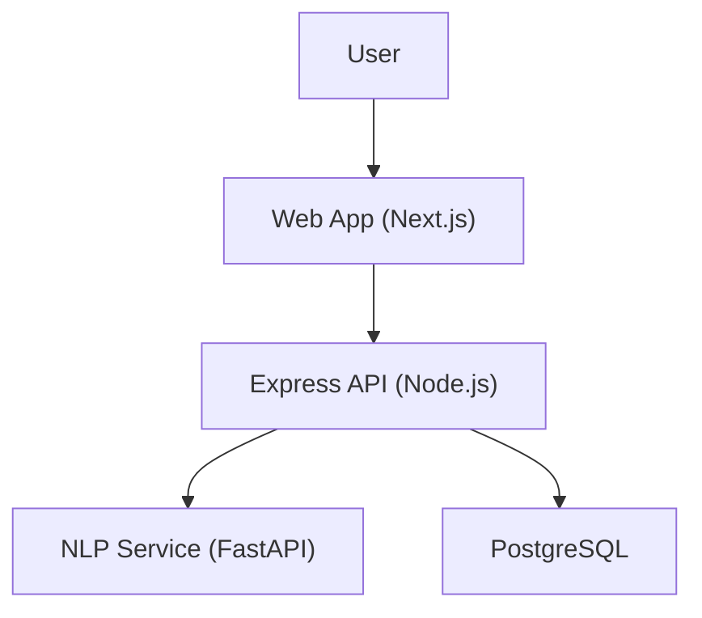
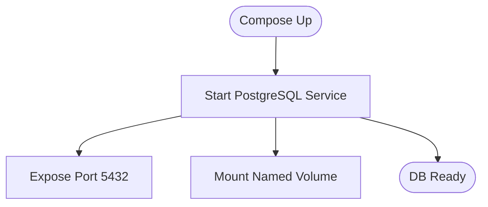
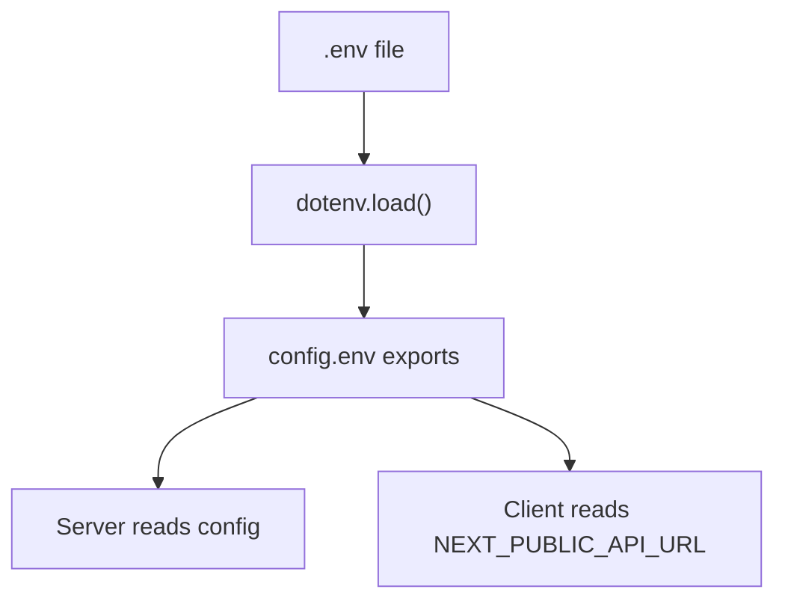
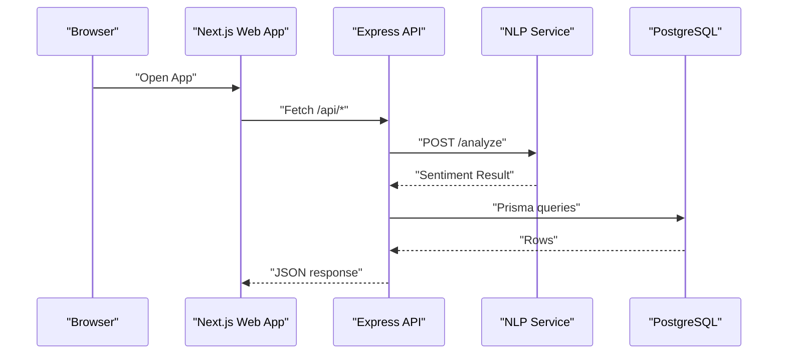
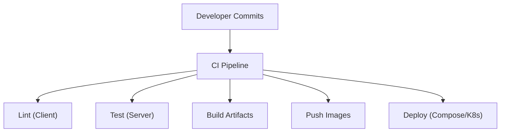
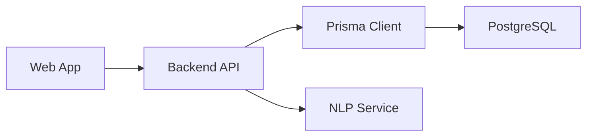

# Deployment Architecture

<cite>
**Referenced Files in This Document**
- [docker-compose.yml](file://docker-compose.yml)
- [README.md](file://README.md)
- [client/package.json](file://client/package.json)
- [server/package.json](file://server/package.json)
- [server/src/config/env.ts](file://server/src/config/env.ts)
- [server/src/config/prisma.ts](file://server/src/config/prisma.ts)
- [client/src/lib/api.ts](file://client/src/lib/api.ts)
- [client/src/lib/auth.ts](file://client/src/lib/auth.ts)
- [nlp-service/main.py](file://nlp-service/main.py)
- [nlp-service/models.py](file://nlp-service/models.py)
- [nlp-service/requirements.txt](file://nlp-service/requirements.txt)
</cite>

## Table of Contents
1. [Introduction](#introduction)
2. [Project Structure](#project-structure)
3. [Core Components](#core-components)
4. [Architecture Overview](#architecture-overview)
5. [Detailed Component Analysis](#detailed-component-analysis)
6. [Dependency Analysis](#dependency-analysis)
7. [Performance Considerations](#performance-considerations)
8. [Troubleshooting Guide](#troubleshooting-guide)
9. [Conclusion](#conclusion)
10. [Appendices](#appendices)

## Introduction
This document describes the BuddyAI deployment architecture for containerized microservices using Docker Compose. It covers the multi-container orchestration of the web application, backend API, NLP service, PostgreSQL database, and supporting infrastructure. It documents networking, service discovery, inter-container communication, environment configuration, secrets handling, volume mounting, CI/CD integration, automated testing, deployment automation, scaling, load balancing, high availability, monitoring/logging, health checks, alerting, production topology, security, disaster recovery, and performance/resource planning.

## Project Structure
BuddyAI follows a multi-repository-like structure with three primary components:
- Web client (Next.js)
- Backend API (Node.js/Express)
- NLP service (Python/FastAPI)
- Database (PostgreSQL via Prisma)

```mermaid
graph TB
subgraph "Client"
WEB["Next.js Web App"]
end
subgraph "Server"
API["Express API"]
PRISMA["Prisma Client"]
end
subgraph "NLP"
NLP["FastAPI NLP Service"]
end
subgraph "Data"
DB["PostgreSQL"]
end
WEB --> API
API --> PRISMA
PRISMA --> DB
API --> NLP
```

**Diagram sources**
- [README.md:213-270](file://README.md#L213-L270)
- [client/package.json:11-15](file://client/package.json#L11-L15)
- [server/package.json:13-20](file://server/package.json#L13-L20)
- [nlp-service/requirements.txt:1-6](file://nlp-service/requirements.txt#L1-L6)

**Section sources**
- [README.md:125-210](file://README.md#L125-L210)
- [docker-compose.yml:1-19](file://docker-compose.yml#L1-L19)
- [client/package.json:1-27](file://client/package.json#L1-L27)
- [server/package.json:1-36](file://server/package.json#L1-L36)
- [nlp-service/requirements.txt:1-6](file://nlp-service/requirements.txt#L1-L6)

## Core Components
- Web Application (Next.js): Provides the frontend user interface and communicates with the backend API via environment-configured base URLs.
- Backend API (Node.js/Express): Exposes REST endpoints, integrates with PostgreSQL via Prisma, and calls the NLP service for sentiment analysis.
- NLP Service (Python/FastAPI): Offers a sentiment analysis endpoint and a health check, configured with CORS for cross-origin requests.
- Database (PostgreSQL): Persistent relational store managed by Prisma with named volumes for durability.

**Section sources**
- [client/src/lib/api.ts:1-36](file://client/src/lib/api.ts#L1-L36)
- [server/src/config/env.ts:6-11](file://server/src/config/env.ts#L6-L11)
- [server/src/config/prisma.ts:1-6](file://server/src/config/prisma.ts#L1-L6)
- [nlp-service/main.py:28-65](file://nlp-service/main.py#L28-L65)
- [docker-compose.yml:4-19](file://docker-compose.yml#L4-L19)

## Architecture Overview
The system employs a multi-tier architecture with clear separation of concerns:
- Presentation Layer: Next.js web app
- Backend Layer: Express API with controllers, services, routes, middleware, and Prisma ORM
- NLP Layer: FastAPI service for sentiment analysis
- Data Layer: PostgreSQL with Prisma migrations and client



**Diagram sources**
- [README.md:213-270](file://README.md#L213-L270)
- [client/src/lib/api.ts:1-36](file://client/src/lib/api.ts#L1-L36)
- [server/src/config/env.ts:10-10](file://server/src/config/env.ts#L10-L10)
- [nlp-service/main.py:61-64](file://nlp-service/main.py#L61-L64)
- [docker-compose.yml:4-19](file://docker-compose.yml#L4-L19)

## Detailed Component Analysis

### Container Orchestration with Docker Compose
- Database service: PostgreSQL 16 Alpine, mapped container name, restart policy, environment variables for credentials and database name, exposed port, and named volume for data persistence.
- Volume: Named volume for PostgreSQL data to ensure persistence across container recreation.



**Diagram sources**
- [docker-compose.yml:4-19](file://docker-compose.yml#L4-L19)

**Section sources**
- [docker-compose.yml:1-19](file://docker-compose.yml#L1-L19)

### Environment Configuration and Secrets Management
- Backend reads environment variables via dotenv loaded from a root-level .env file. Critical variables include PORT, DATABASE_URL, JWT_SECRET, and NLP_SERVICE_URL.
- Client reads NEXT_PUBLIC_API_URL for frontend API base URL.
- Secrets handling: JWT secret is configurable; credentials for PostgreSQL are set via environment variables. For production, external secret managers should be integrated to manage secrets outside the repository.



**Diagram sources**
- [server/src/config/env.ts:1-11](file://server/src/config/env.ts#L1-L11)
- [client/src/lib/api.ts:1-1](file://client/src/lib/api.ts#L1-L1)

**Section sources**
- [server/src/config/env.ts:1-11](file://server/src/config/env.ts#L1-L11)
- [client/src/lib/api.ts:1-36](file://client/src/lib/api.ts#L1-L36)

### Volume Mounting Strategy
- PostgreSQL data is persisted using a named volume postgres_data mounted under /var/lib/postgresql/data. This ensures data durability across container restarts and rebuilds.

**Section sources**
- [docker-compose.yml:14-15](file://docker-compose.yml#L14-L15)

### Container Networking and Service Discovery
- Services communicate using internal DNS names resolved by Docker Compose. The backend API is configured to call the NLP service using the environment variable NLP_SERVICE_URL, defaulting to http://localhost:8001. In Compose, the NLP service would be reachable by its service name.
- CORS is enabled in the NLP service to accept requests from the web application origin.



**Diagram sources**
- [nlp-service/main.py:30-36](file://nlp-service/main.py#L30-L36)
- [nlp-service/main.py:43-58](file://nlp-service/main.py#L43-L58)
- [server/src/config/env.ts:10-10](file://server/src/config/env.ts#L10-L10)
- [client/src/lib/api.ts:15-18](file://client/src/lib/api.ts#L15-L18)

**Section sources**
- [nlp-service/main.py:30-36](file://nlp-service/main.py#L30-L36)
- [nlp-service/main.py:43-58](file://nlp-service/main.py#L43-L58)
- [server/src/config/env.ts:10-10](file://server/src/config/env.ts#L10-L10)

### Inter-Container Communication Patterns
- Web-to-API: Fetch requests to backend endpoints with optional Authorization header from local storage.
- API-to-NLP: Outbound HTTP POST to /analyze with CORS enabled.
- API-to-DB: Internal connection via Prisma using DATABASE_URL.

**Section sources**
- [client/src/lib/api.ts:1-36](file://client/src/lib/api.ts#L1-L36)
- [nlp-service/main.py:43-58](file://nlp-service/main.py#L43-L58)
- [server/src/config/prisma.ts:1-6](file://server/src/config/prisma.ts#L1-L6)

### CI/CD Pipeline Integration and Automated Testing
- Backend testing: Vitest is configured for unit/integration tests.
- Frontend build and lint scripts are present in package.json.
- To integrate with CI/CD, configure jobs to:
  - Install dependencies for client and server
  - Run tests (server vitest, client lint)
  - Build artifacts
  - Push container images to a registry
  - Deploy using docker-compose or Kubernetes manifests



**Diagram sources**
- [server/package.json:10-11](file://server/package.json#L10-L11)
- [client/package.json:5-10](file://client/package.json#L5-L10)

**Section sources**
- [server/package.json:6-11](file://server/package.json#L6-L11)
- [client/package.json:5-10](file://client/package.json#L5-L10)

### Deployment Automation Scripts
- Use docker-compose commands to orchestrate services locally or in staging/production environments.
- For production, prefer declarative deployments via Compose files or Kubernetes manifests, with rolling updates and health checks.

**Section sources**
- [docker-compose.yml:1-19](file://docker-compose.yml#L1-L19)

### Scaling Strategies and Load Balancing
- Horizontal scaling: Run multiple replicas of the API service behind a reverse proxy or load balancer.
- Stateless design: Keep the API stateless to enable easy scaling.
- Database: Scale PostgreSQL using replication or managed services; consider read replicas for reporting workloads.

[No sources needed since this section provides general guidance]

### High Availability Setup
- Multi-region deployments with active-passive failover for the API and database.
- Use managed databases with automatic failover and backups.
- Implement circuit breakers and retries in the API to handle transient failures.

[No sources needed since this section provides general guidance]

### Monitoring and Logging Architecture
- Health checks:
  - NLP service exposes a GET /health endpoint returning a health status.
  - Add readiness/liveness probes in Compose or Kubernetes.
- Logging:
  - Centralized logging using a solution like ELK or similar to aggregate container logs.
- Metrics:
  - Expose Prometheus metrics endpoints in the API and NLP service.
  - Track response times, error rates, and throughput.

**Section sources**
- [nlp-service/main.py:61-64](file://nlp-service/main.py#L61-L64)

### Alerting Mechanisms
- Configure alerts for:
  - Database connectivity issues
  - High error rates in API/NLP
  - Low disk space on volumes
  - Unhealthy containers or pods

[No sources needed since this section provides general guidance]

### Production Deployment Topology
- Reverse proxy (e.g., Nginx) in front of the API for TLS termination, rate limiting, and static asset serving.
- Separate networks for internal services and public exposure.
- Blue/green or rolling deployments to minimize downtime.

[No sources needed since this section provides general guidance]

### Security Considerations
- Secrets management: Externalize secrets using environment variables or secret managers; avoid committing secrets to the repository.
- Transport security: Enforce HTTPS/TLS at the reverse proxy and between services.
- Access control: Use JWT for session management; enforce RBAC on sensitive endpoints.
- Network segmentation: Restrict inbound/outbound traffic using firewall rules and network policies.
- Vulnerability scanning: Scan container images regularly and keep dependencies updated.

[No sources needed since this section provides general guidance]

### Disaster Recovery Procedures
- Backup schedules for PostgreSQL data volume.
- Point-in-time recovery procedures.
- Failback testing and documented RTO/RPO targets.
- Offsite backups and multi-region replication.

[No sources needed since this section provides general guidance]

## Dependency Analysis
Inter-service dependencies and coupling:
- Web app depends on the backend API base URL.
- Backend API depends on:
  - Prisma client for database operations
  - NLP service for sentiment analysis
  - Environment configuration for URLs and secrets
- NLP service depends on NLTK resources and FastAPI.



**Diagram sources**
- [client/src/lib/api.ts:1-36](file://client/src/lib/api.ts#L1-L36)
- [server/src/config/env.ts:10-10](file://server/src/config/env.ts#L10-L10)
- [server/src/config/prisma.ts:1-6](file://server/src/config/prisma.ts#L1-L6)
- [nlp-service/main.py:28-65](file://nlp-service/main.py#L28-L65)

**Section sources**
- [client/src/lib/api.ts:1-36](file://client/src/lib/api.ts#L1-L36)
- [server/src/config/env.ts:6-11](file://server/src/config/env.ts#L6-L11)
- [server/src/config/prisma.ts:1-6](file://server/src/config/prisma.ts#L1-L6)
- [nlp-service/main.py:28-65](file://nlp-service/main.py#L28-L65)

## Performance Considerations
- Resource allocation:
  - Set CPU/memory limits/requests for each service in Compose or Kubernetes.
  - Use autoscaling based on CPU utilization or custom metrics.
- Database performance:
  - Indexes for frequently queried columns (users, messages, assessments).
  - Connection pooling in the API.
- Caching:
  - Use Redis for session storage and caching hot data.
- CDN:
  - Serve static assets via CDN for the web app.

[No sources needed since this section provides general guidance]

## Troubleshooting Guide
- Unauthorized requests:
  - The web app clears the token and redirects to login on 401 responses.
- Health checks:
  - Verify NLP service health endpoint returns healthy status.
- Database connectivity:
  - Confirm DATABASE_URL and credentials; ensure the database is reachable from the API container.

**Section sources**
- [client/src/lib/api.ts:20-26](file://client/src/lib/api.ts#L20-L26)
- [nlp-service/main.py:61-64](file://nlp-service/main.py#L61-L64)
- [server/src/config/env.ts:8-8](file://server/src/config/env.ts#L8-L8)

## Conclusion
BuddyAI’s deployment architecture leverages Docker Compose to orchestrate a scalable, secure, and maintainable system. The web application, backend API, NLP service, and PostgreSQL database are clearly separated and communicate via well-defined endpoints. With proper environment management, secrets handling, volume persistence, CI/CD integration, monitoring/logging, and adherence to security and disaster recovery best practices, the system can be reliably deployed and operated in production.

## Appendices

### API Base URL Configuration
- Client reads NEXT_PUBLIC_API_URL for frontend API base URL.
- Backend reads NLP_SERVICE_URL for NLP service endpoint.

**Section sources**
- [client/src/lib/api.ts:1-1](file://client/src/lib/api.ts#L1-L1)
- [server/src/config/env.ts:10-10](file://server/src/config/env.ts#L10-L10)

### NLP Service Contracts
- POST /analyze accepts text and returns sentiment classification and scores.
- GET /health returns service status.

**Section sources**
- [nlp-service/models.py:4-21](file://nlp-service/models.py#L4-L21)
- [nlp-service/main.py:43-58](file://nlp-service/main.py#L43-L58)
- [nlp-service/main.py:61-64](file://nlp-service/main.py#L61-L64)