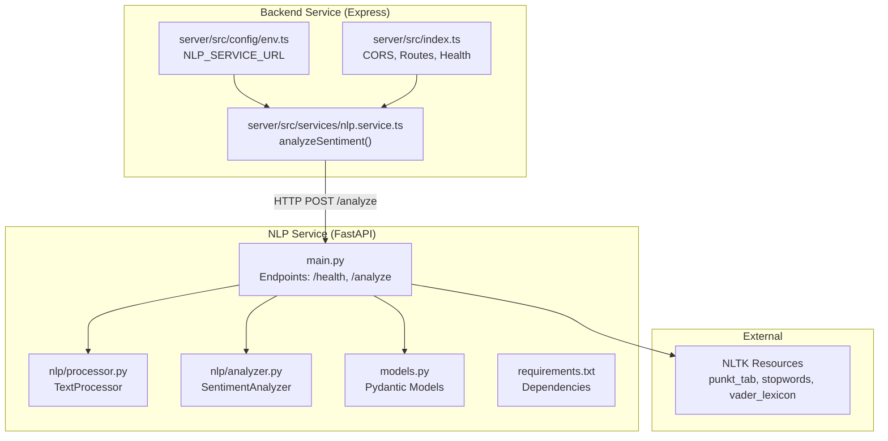
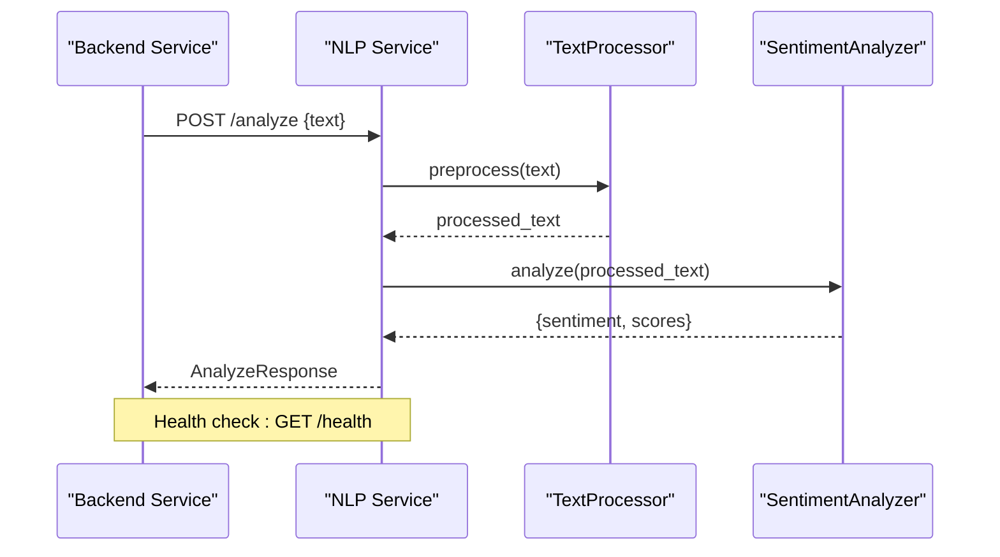
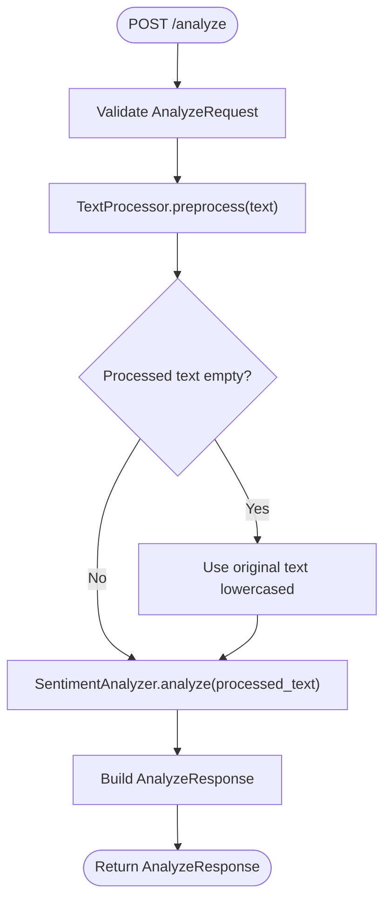
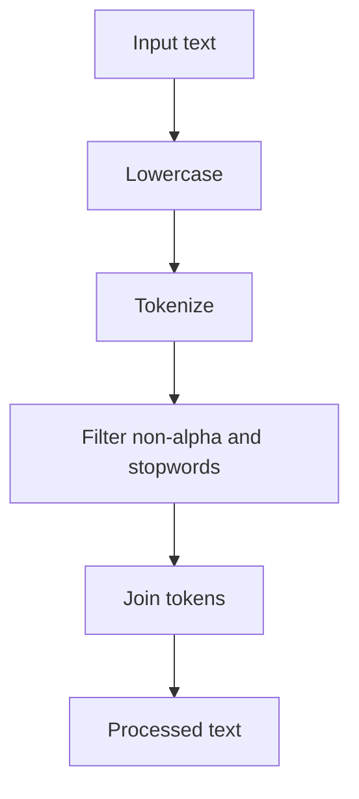
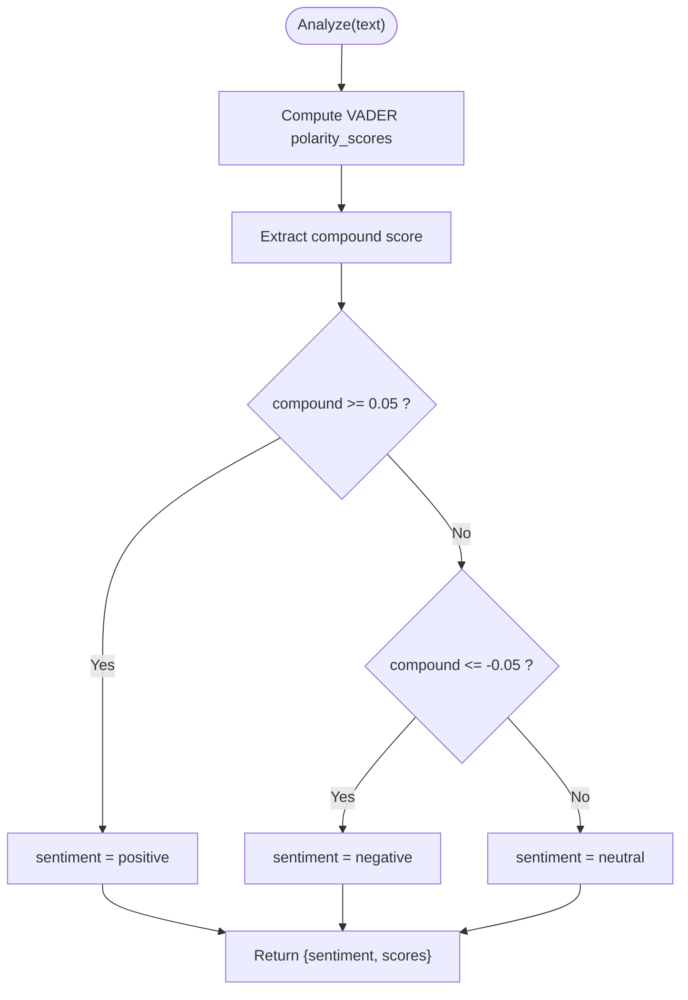
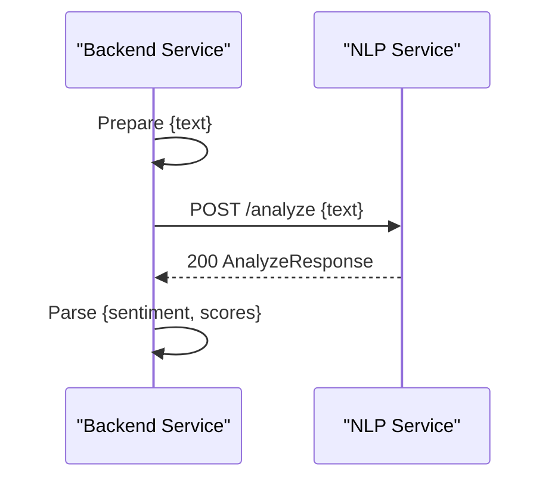
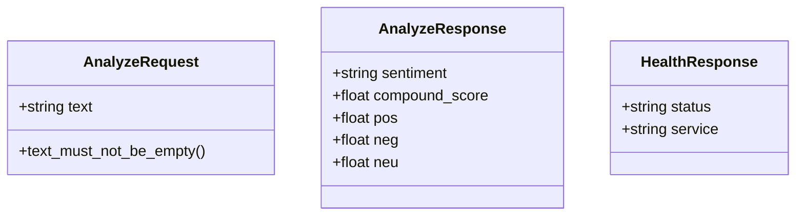
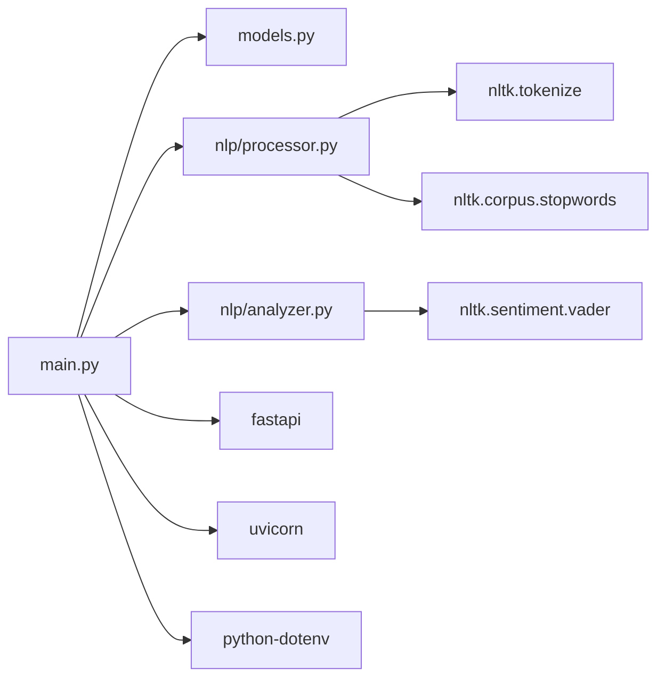

# NLP Processing Layer

<cite>
**Referenced Files in This Document**
- [main.py](file://nlp-service/main.py)
- [models.py](file://nlp-service/models.py)
- [analyzer.py](file://nlp-service/nlp/analyzer.py)
- [processor.py](file://nlp-service/nlp/processor.py)
- [requirements.txt](file://nlp-service/requirements.txt)
- [test_main.py](file://nlp-service/test_main.py)
- [nlp.service.ts](file://server/src/services/nlp.service.ts)
- [env.ts](file://server/src/config/env.ts)
- [index.ts](file://server/src/index.ts)
- [docker-compose.yml](file://docker-compose.yml)
</cite>

## Table of Contents
1. [Introduction](#introduction)
2. [Project Structure](#project-structure)
3. [Core Components](#core-components)
4. [Architecture Overview](#architecture-overview)
5. [Detailed Component Analysis](#detailed-component-analysis)
6. [Dependency Analysis](#dependency-analysis)
7. [Performance Considerations](#performance-considerations)
8. [Troubleshooting Guide](#troubleshooting-guide)
9. [Conclusion](#conclusion)
10. [Appendices](#appendices)

## Introduction
This document describes the NLP processing layer architecture for the standalone FastAPI sentiment analysis service. It explains the microservice design, text preprocessing pipeline, and the sentiment analysis workflow using NLTK and VADER. It also documents the service endpoints, integration patterns with the main backend service, request/response formats, error handling strategies, and scalability considerations. The focus is on building a robust, maintainable, and scalable sentiment analysis microservice that can be deployed independently and consumed by the main backend service.

## Project Structure
The NLP processing layer is implemented as a FastAPI microservice located under the nlp-service directory. It exposes two primary endpoints: a health check and a text sentiment analysis endpoint. The service initializes NLTK resources on startup, sets up CORS, and defines Pydantic models for request and response validation. The server-side integration is handled by the backend service via a dedicated NLP service client that posts text to the /analyze endpoint and receives structured sentiment results.

**Diagram sources**
- [main.py:28-64](file://nlp-service/main.py#L28-L64)
- [processor.py:6-19](file://nlp-service/nlp/processor.py#L6-L19)
- [analyzer.py:4-27](file://nlp-service/nlp/analyzer.py#L4-L27)
- [models.py:4-26](file://nlp-service/models.py#L4-L26)
- [requirements.txt:1-6](file://nlp-service/requirements.txt#L1-L6)
- [nlp.service.ts:11-23](file://server/src/services/nlp.service.ts#L11-L23)
- [env.ts:10](file://server/src/config/env.ts#L10)
- [index.ts:15-30](file://server/src/index.ts#L15-L30)

**Section sources**
- [main.py:1-71](file://nlp-service/main.py#L1-L71)
- [models.py:1-26](file://nlp-service/models.py#L1-L26)
- [processor.py:1-19](file://nlp-service/nlp/processor.py#L1-L19)
- [analyzer.py:1-27](file://nlp-service/nlp/analyzer.py#L1-L27)
- [requirements.txt:1-6](file://nlp-service/requirements.txt#L1-L6)
- [nlp.service.ts:1-24](file://server/src/services/nlp.service.ts#L1-L24)
- [env.ts:1-12](file://server/src/config/env.ts#L1-L12)
- [index.ts:1-35](file://server/src/index.ts#L1-L35)

## Core Components
- FastAPI Application: Initializes NLTK data, sets CORS, creates TextProcessor and SentimentAnalyzer instances, and registers endpoints for health and analysis.
- TextProcessor: Implements text normalization, tokenization, stopword removal, and filtering to alphabetic tokens for consistent VADER input.
- SentimentAnalyzer: Uses NLTK’s VADER to compute polarity scores and classify sentiment into positive, neutral, or negative based on thresholds.
- Pydantic Models: Define strict request validation for text input and response schema for sentiment classification and scores.
- Backend Integration: The backend service calls the NLP service via a typed interface that posts text and parses structured results.

Key implementation references:
- Endpoint registration and lifecycle initialization: [main.py:28-40](file://nlp-service/main.py#L28-L40)
- Text preprocessing pipeline: [processor.py:10-19](file://nlp-service/nlp/processor.py#L10-L19)
- Sentiment analysis and classification: [analyzer.py:8-27](file://nlp-service/nlp/analyzer.py#L8-L27)
- Request/response models: [models.py:4-26](file://nlp-service/models.py#L4-L26)
- Backend client call: [nlp.service.ts:11-23](file://server/src/services/nlp.service.ts#L11-L23)

**Section sources**
- [main.py:28-64](file://nlp-service/main.py#L28-L64)
- [processor.py:6-19](file://nlp-service/nlp/processor.py#L6-L19)
- [analyzer.py:4-27](file://nlp-service/nlp/analyzer.py#L4-L27)
- [models.py:4-26](file://nlp-service/models.py#L4-L26)
- [nlp.service.ts:11-23](file://server/src/services/nlp.service.ts#L11-L23)

## Architecture Overview
The NLP processing layer follows a microservice pattern:
- Standalone FastAPI service handles text preprocessing and sentiment analysis.
- Backend service consumes the NLP service via HTTP requests.
- Health checks are exposed by both services for operational monitoring.
- NLTK resources are downloaded and cached locally on service startup.

**Diagram sources**
- [main.py:43-64](file://nlp-service/main.py#L43-L64)
- [processor.py:10-19](file://nlp-service/nlp/processor.py#L10-L19)
- [analyzer.py:8-27](file://nlp-service/nlp/analyzer.py#L8-L27)
- [nlp.service.ts:11-23](file://server/src/services/nlp.service.ts#L11-L23)

## Detailed Component Analysis

### FastAPI Application and Endpoints
- Health Endpoint: Returns a simple health payload indicating the service is alive.
- Analysis Endpoint: Validates input, preprocesses text, falls back to original text if preprocessing yields empty results, runs VADER analysis, and returns structured sentiment scores.

**Diagram sources**
- [main.py:43-58](file://nlp-service/main.py#L43-L58)
- [processor.py:10-19](file://nlp-service/nlp/processor.py#L10-L19)
- [analyzer.py:8-27](file://nlp-service/nlp/analyzer.py#L8-L27)
- [models.py:15-21](file://nlp-service/models.py#L15-L21)

**Section sources**
- [main.py:43-64](file://nlp-service/main.py#L43-L64)
- [models.py:4-26](file://nlp-service/models.py#L4-L26)

### Text Preprocessing Pipeline
- Normalization: Converts text to lowercase.
- Tokenization: Splits text into tokens.
- Filtering: Removes non-alphabetic tokens and stopwords.
- Reconstruction: Joins filtered tokens into a single string suitable for VADER.

**Diagram sources**
- [processor.py:10-19](file://nlp-service/nlp/processor.py#L10-L19)

**Section sources**
- [processor.py:6-19](file://nlp-service/nlp/processor.py#L6-L19)

### Sentiment Analysis Workflow with VADER
- VADER Polarity Scores: Computes compound, positive, neutral, and negative scores.
- Classification Thresholds: Uses fixed thresholds to classify sentiment.
- Response Formatting: Rounds scores to four decimal places and returns a standardized response.

**Diagram sources**
- [analyzer.py:8-27](file://nlp-service/nlp/analyzer.py#L8-L27)

**Section sources**
- [analyzer.py:4-27](file://nlp-service/nlp/analyzer.py#L4-L27)

### Integration with Backend Service
- Backend client: Sends a POST request to the NLP service /analyze endpoint with a JSON payload containing the text.
- Error handling: Propagates non-OK HTTP responses as errors.
- Response parsing: Expects a structured JSON response with sentiment classification and scores.

**Diagram sources**
- [nlp.service.ts:11-23](file://server/src/services/nlp.service.ts#L11-L23)
- [main.py:43-58](file://nlp-service/main.py#L43-L58)

**Section sources**
- [nlp.service.ts:11-23](file://server/src/services/nlp.service.ts#L11-L23)
- [env.ts:10](file://server/src/config/env.ts#L10)

### Data Models and Validation
- AnalyzeRequest: Ensures non-empty text after trimming.
- AnalyzeResponse: Defines fields for sentiment label and normalized scores.
- HealthResponse: Lightweight health status for service readiness.

**Diagram sources**
- [models.py:4-26](file://nlp-service/models.py#L4-L26)

**Section sources**
- [models.py:4-26](file://nlp-service/models.py#L4-L26)

## Dependency Analysis
- Internal Dependencies:
  - main.py depends on models.py for request/response types, and on nlp/processor.py and nlp/analyzer.py for core logic.
  - nlp/analyzer.py depends on NLTK’s VADER.
  - nlp/processor.py depends on NLTK tokenizers and stopwords.
- External Dependencies:
  - FastAPI and Uvicorn for the web server.
  - NLTK for tokenization and sentiment analysis.
  - Pydantic for data validation.
  - python-dotenv for environment configuration.

**Diagram sources**
- [main.py:3-7](file://nlp-service/main.py#L3-L7)
- [analyzer.py:1](file://nlp-service/nlp/analyzer.py#L1)
- [processor.py:1-4](file://nlp-service/nlp/processor.py#L1-L4)
- [requirements.txt:1-6](file://nlp-service/requirements.txt#L1-L6)

**Section sources**
- [main.py:1-71](file://nlp-service/main.py#L1-L71)
- [requirements.txt:1-6](file://nlp-service/requirements.txt#L1-L6)

## Performance Considerations
- Resource Initialization:
  - NLTK data is downloaded and cached locally during startup to avoid repeated network overhead and ensure deterministic behavior.
  - Partial downloads are cleaned up before downloading to prevent corruption.
- Throughput and Latency:
  - Keep the analyzer and processor instances initialized once per service lifecycle to avoid reinitialization costs.
  - Consider batching multiple texts for analysis if the backend supports it, though the current endpoint is designed for single-text analysis.
- Concurrency:
  - FastAPI/Uvicorn provides asynchronous request handling; ensure the underlying NLTK operations remain lightweight and non-blocking.
- Memory Management:
  - Avoid retaining large intermediate data structures beyond the scope of a single request.
- Scalability:
  - Deploy multiple replicas behind a load balancer.
  - Use connection pooling and keep-alive for backend-to-NLP service calls.
- Caching Strategies:
  - Implement request-level caching for identical inputs if acceptable for the domain.
  - Use external cache stores (e.g., Redis) for inter-service caching if needed.
- Monitoring:
  - Expose metrics endpoints and integrate with Prometheus/Grafana.
  - Log latency, error rates, and throughput.

[No sources needed since this section provides general guidance]

## Troubleshooting Guide
- Health Checks:
  - Verify the NLP service health endpoint returns a healthy status.
  - Verify the backend service health endpoint is reachable.
- Input Validation:
  - Empty or missing text fields cause validation errors; ensure the backend sends properly formatted requests.
- Network Connectivity:
  - Confirm the backend can reach the NLP service URL configured in environment variables.
- Error Propagation:
  - Non-200 responses from the NLP service trigger errors in the backend client; inspect HTTP status codes and logs.
- NLTK Resource Issues:
  - If NLTK fails to download or initialize, check disk permissions and network connectivity for the container or host.

**Section sources**
- [main.py:61-64](file://nlp-service/main.py#L61-L64)
- [index.ts:18-20](file://server/src/index.ts#L18-L20)
- [test_main.py:39-45](file://nlp-service/test_main.py#L39-L45)
- [nlp.service.ts:18-20](file://server/src/services/nlp.service.ts#L18-L20)

## Conclusion
The NLP processing layer is a focused, modular microservice that performs text preprocessing and sentiment analysis using NLTK and VADER. Its design emphasizes simplicity, strong typing via Pydantic, and straightforward integration with the backend service. With proper deployment, health checks, and monitoring, it can be scaled to support high-volume text processing while maintaining predictable performance and reliability.

[No sources needed since this section summarizes without analyzing specific files]

## Appendices

### Service Discovery and Deployment Notes
- Service Discovery: Configure the backend service to resolve the NLP service via DNS or environment variables.
- Health Checks: Both services expose health endpoints for readiness and liveness probes.
- Containerization: Use Docker Compose to orchestrate the NLP service and database as needed.

**Section sources**
- [env.ts:10](file://server/src/config/env.ts#L10)
- [index.ts:18-20](file://server/src/index.ts#L18-L20)
- [docker-compose.yml:1-19](file://docker-compose.yml#L1-L19)

### Testing Coverage
- Health endpoint tests verify response shape and status.
- Sentiment classification tests cover positive, negative, and neutral cases.
- Validation tests ensure empty and malformed inputs are rejected.

**Section sources**
- [test_main.py:8-56](file://nlp-service/test_main.py#L8-L56)