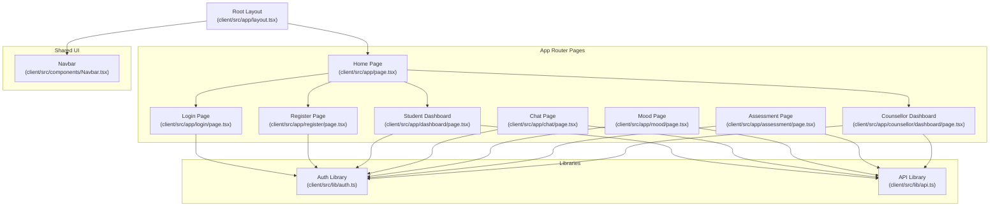
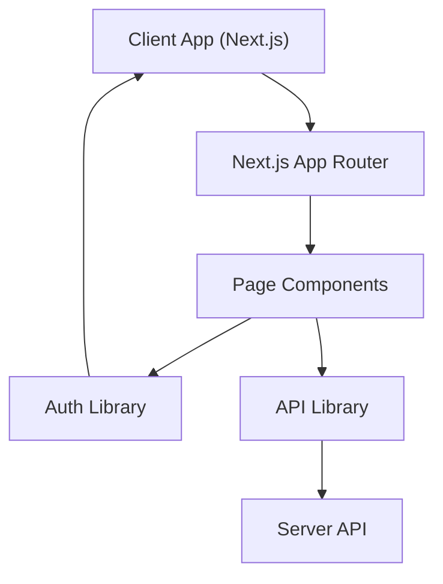
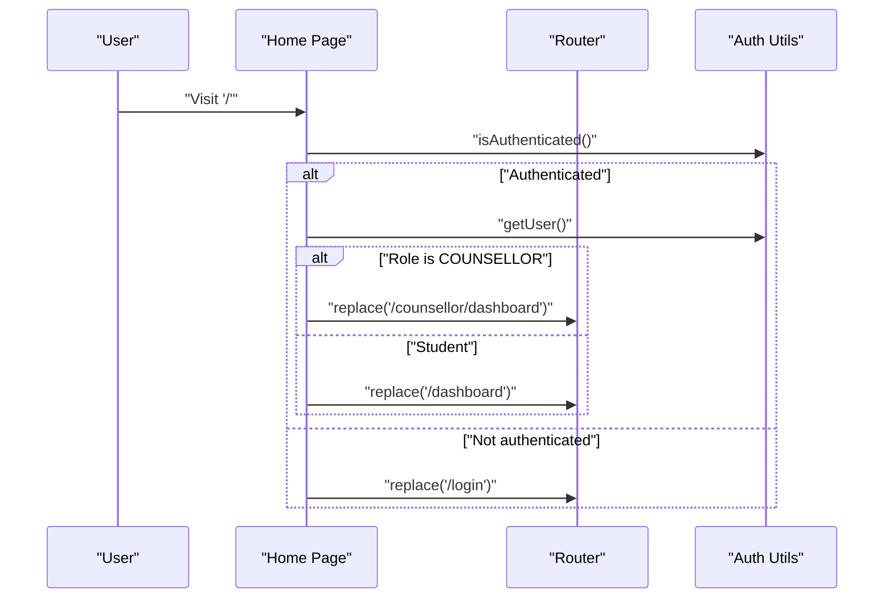
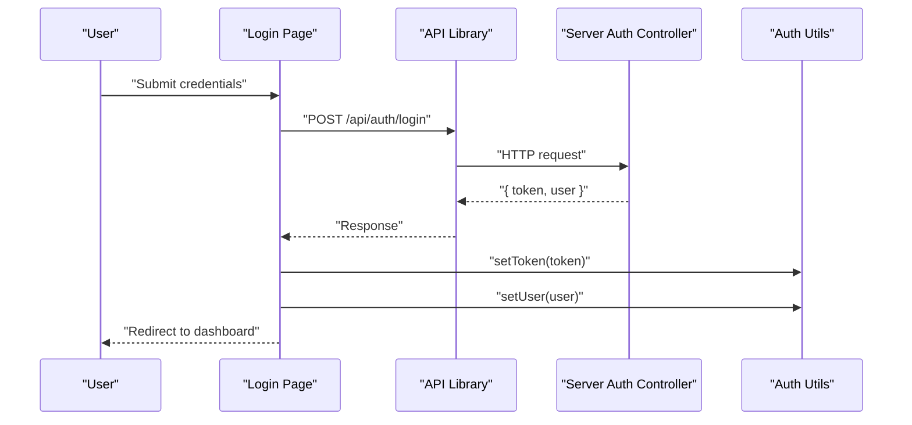
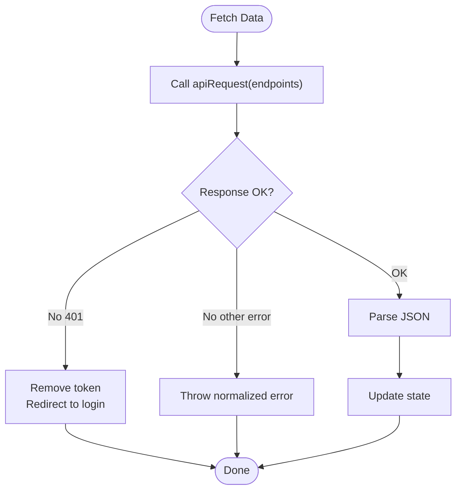
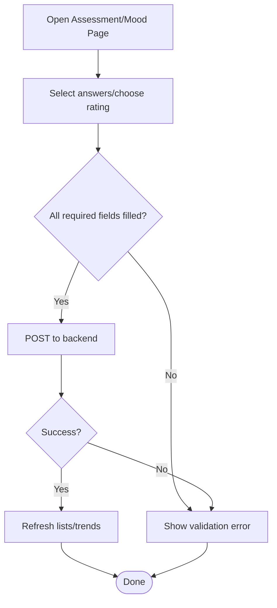
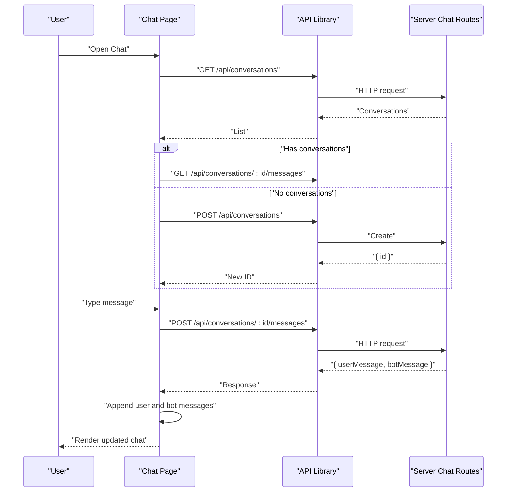
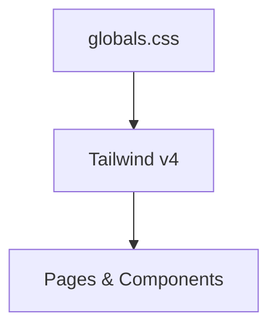
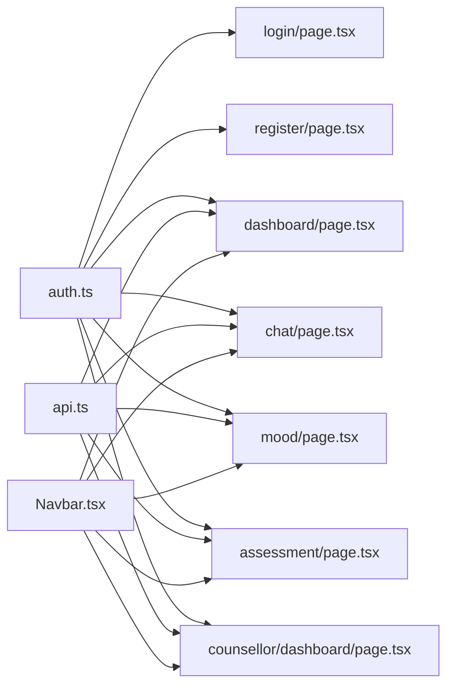

# Presentation Layer

<cite>
**Referenced Files in This Document**
- [layout.tsx](file://client/src/app/layout.tsx)
- [page.tsx](file://client/src/app/page.tsx)
- [login/page.tsx](file://client/src/app/login/page.tsx)
- [register/page.tsx](file://client/src/app/register/page.tsx)
- [dashboard/page.tsx](file://client/src/app/dashboard/page.tsx)
- [chat/page.tsx](file://client/src/app/chat/page.tsx)
- [mood/page.tsx](file://client/src/app/mood/page.tsx)
- [assessment/page.tsx](file://client/src/app/assessment/page.tsx)
- [counsellor/dashboard/page.tsx](file://client/src/app/counsellor/dashboard/page.tsx)
- [Navbar.tsx](file://client/src/components/Navbar.tsx)
- [api.ts](file://client/src/lib/api.ts)
- [auth.ts](file://client/src/lib/auth.ts)
- [globals.css](file://client/src/app/globals.css)
- [package.json](file://client/package.json)
- [auth.controller.ts](file://server/src/controllers/auth.controller.ts)
- [auth.middleware.ts](file://server/src/middleware/auth.ts)
</cite>

## Table of Contents
1. [Introduction](#introduction)
2. [Project Structure](#project-structure)
3. [Core Components](#core-components)
4. [Architecture Overview](#architecture-overview)
5. [Detailed Component Analysis](#detailed-component-analysis)
6. [Dependency Analysis](#dependency-analysis)
7. [Performance Considerations](#performance-considerations)
8. [Troubleshooting Guide](#troubleshooting-guide)
9. [Conclusion](#conclusion)

## Introduction
This document describes the presentation layer architecture of the Next.js React application. It explains the routing system, component hierarchy, state management patterns, UI components, navigation flow, client-side authentication, API integration via a dedicated API library, form handling for assessments and mood tracking, and the real-time chat interface. It also covers the styling architecture using Tailwind CSS, responsive design patterns, accessibility considerations, client-side error handling, loading states, and UX optimizations. Finally, it documents the relationship between frontend components and backend services, including authentication token management and API communication patterns.

## Project Structure
The presentation layer is organized as a Next.js App Router application under client/src/app. Each route corresponds to a page component that encapsulates UI, state, and data fetching. Shared UI elements live under client/src/components, while cross-cutting concerns like API requests and authentication are centralized under client/src/lib. Global styles are defined in client/src/app/globals.css and configured via Tailwind CSS.

**Diagram sources**
- [layout.tsx](file://client/src/app/layout.tsx)
- [page.tsx](file://client/src/app/page.tsx)
- [login/page.tsx](file://client/src/app/login/page.tsx)
- [register/page.tsx](file://client/src/app/register/page.tsx)
- [dashboard/page.tsx](file://client/src/app/dashboard/page.tsx)
- [chat/page.tsx](file://client/src/app/chat/page.tsx)
- [mood/page.tsx](file://client/src/app/mood/page.tsx)
- [assessment/page.tsx](file://client/src/app/assessment/page.tsx)
- [counsellor/dashboard/page.tsx](file://client/src/app/counsellor/dashboard/page.tsx)
- [Navbar.tsx](file://client/src/components/Navbar.tsx)
- [api.ts](file://client/src/lib/api.ts)
- [auth.ts](file://client/src/lib/auth.ts)

**Section sources**
- [layout.tsx](file://client/src/app/layout.tsx)
- [globals.css](file://client/src/app/globals.css)
- [package.json](file://client/package.json)

## Core Components
- Root layout and global styles: Defines the HTML wrapper, fonts, and top-level layout with a shared navbar and main content area.
- Authentication utilities: Centralized token and user helpers for localStorage-backed session management.
- API library: Unified request function that injects Authorization headers, handles 401 redirects, and normalizes errors.
- Navigation bar: Renders dynamic links based on authentication state and user role, with logout and protected route guards.

Key responsibilities:
- Routing: Next.js App Router organizes pages by filesystem under client/src/app.
- State management: React hooks manage local UI state and fetched data.
- Authentication: Token stored in localStorage; guards redirect unauthenticated users and populate Navbar.
- Styling: Tailwind CSS classes drive responsive design and theme tokens.

**Section sources**
- [layout.tsx](file://client/src/app/layout.tsx)
- [globals.css](file://client/src/app/globals.css)
- [Navbar.tsx](file://client/src/components/Navbar.tsx)
- [auth.ts](file://client/src/lib/auth.ts)
- [api.ts](file://client/src/lib/api.ts)

## Architecture Overview
The presentation layer follows a clean separation of concerns:
- Pages own UI, state, and data fetching.
- Libraries encapsulate cross-cutting concerns (auth and API).
- Navbar is a presentational component that reacts to auth state.
- Routes enforce authentication and role-based redirection.

**Diagram sources**
- [layout.tsx](file://client/src/app/layout.tsx)
- [login/page.tsx](file://client/src/app/login/page.tsx)
- [register/page.tsx](file://client/src/app/register/page.tsx)
- [dashboard/page.tsx](file://client/src/app/dashboard/page.tsx)
- [chat/page.tsx](file://client/src/app/chat/page.tsx)
- [mood/page.tsx](file://client/src/app/mood/page.tsx)
- [assessment/page.tsx](file://client/src/app/assessment/page.tsx)
- [counsellor/dashboard/page.tsx](file://client/src/app/counsellor/dashboard/page.tsx)
- [auth.ts](file://client/src/lib/auth.ts)
- [api.ts](file://client/src/lib/api.ts)

## Detailed Component Analysis

### Routing System and Navigation Flow
- Root layout wraps all pages and renders a persistent Navbar.
- Home page performs client-side redirection based on authentication and role.
- Protected pages check authentication and redirect to login when missing.
- Role-based navigation: Students see dashboard, chat, assessment, mood; counsellors see dashboard and alerts.

**Diagram sources**
- [page.tsx](file://client/src/app/page.tsx)
- [auth.ts](file://client/src/lib/auth.ts)

**Section sources**
- [layout.tsx](file://client/src/app/layout.tsx)
- [page.tsx](file://client/src/app/page.tsx)
- [Navbar.tsx](file://client/src/components/Navbar.tsx)

### Authentication Mechanisms
- Client-side:
  - Token and user stored in localStorage.
  - Navbar displays user info and logout button; logout clears token and user.
  - Pages guard access and redirect unauthenticated users.
- Server-side:
  - Authentication middleware verifies Bearer tokens.
  - Role-based protection ensures only authorized users access restricted routes.

**Diagram sources**
- [login/page.tsx](file://client/src/app/login/page.tsx)
- [api.ts](file://client/src/lib/api.ts)
- [auth.controller.ts](file://server/src/controllers/auth.controller.ts)
- [auth.middleware.ts](file://server/src/middleware/auth.ts)

**Section sources**
- [login/page.tsx](file://client/src/app/login/page.tsx)
- [register/page.tsx](file://client/src/app/register/page.tsx)
- [auth.ts](file://client/src/lib/auth.ts)
- [auth.controller.ts](file://server/src/controllers/auth.controller.ts)
- [auth.middleware.ts](file://server/src/middleware/auth.ts)

### API Integration and Data Fetching Patterns
- Centralized request function:
  - Reads token from localStorage.
  - Injects Authorization header.
  - Handles 401 by clearing token and redirecting to login.
  - Parses JSON and throws normalized errors.
- Pages use Promise.allSettled to fetch multiple resources concurrently and update UI progressively.
- Error boundaries: Try/catch around network calls; UI surfaces user-friendly messages.

**Diagram sources**
- [api.ts](file://client/src/lib/api.ts)
- [dashboard/page.tsx](file://client/src/app/dashboard/page.tsx)
- [chat/page.tsx](file://client/src/app/chat/page.tsx)
- [mood/page.tsx](file://client/src/app/mood/page.tsx)
- [assessment/page.tsx](file://client/src/app/assessment/page.tsx)
- [counsellor/dashboard/page.tsx](file://client/src/app/counsellor/dashboard/page.tsx)

**Section sources**
- [api.ts](file://client/src/lib/api.ts)
- [dashboard/page.tsx](file://client/src/app/dashboard/page.tsx)
- [chat/page.tsx](file://client/src/app/chat/page.tsx)
- [mood/page.tsx](file://client/src/app/mood/page.tsx)
- [assessment/page.tsx](file://client/src/app/assessment/page.tsx)
- [counsellor/dashboard/page.tsx](file://client/src/app/counsellor/dashboard/page.tsx)

### Form Handling: Assessments and Mood Tracking
- Assessments (PHQ-9):
  - Radio button groups per question; validation prevents submission until all answered.
  - On submit, posts responses and displays severity level with color-coded badges.
- Mood tracking:
  - Emoji-based rating selection; optional notes.
  - Posts rating and notes; refreshes history and trends after successful submission.

**Diagram sources**
- [assessment/page.tsx](file://client/src/app/assessment/page.tsx)
- [mood/page.tsx](file://client/src/app/mood/page.tsx)

**Section sources**
- [assessment/page.tsx](file://client/src/app/assessment/page.tsx)
- [mood/page.tsx](file://client/src/app/mood/page.tsx)

### Real-Time Chat Interface
- Loads existing conversations and messages on mount.
- Creates a new conversation if none exists.
- Sends user messages and appends user and bot responses to the UI.
- Displays typing indicators and scrolls to the latest message.
- Uses sentiment metadata to annotate user messages.

**Diagram sources**
- [chat/page.tsx](file://client/src/app/chat/page.tsx)
- [api.ts](file://client/src/lib/api.ts)

**Section sources**
- [chat/page.tsx](file://client/src/app/chat/page.tsx)

### Styling Architecture and Responsive Design
- Tailwind CSS v4 configured via PostCSS and imported in globals.css.
- Theme tokens define background/foreground and font families.
- Components use responsive utilities (e.g., grid layouts, padding/margin scales) and semantic color classes.
- Typography and spacing scale consistently across pages.

**Diagram sources**
- [globals.css](file://client/src/app/globals.css)
- [package.json](file://client/package.json)

**Section sources**
- [globals.css](file://client/src/app/globals.css)
- [package.json](file://client/package.json)

### Accessibility Considerations
- Semantic HTML and proper labeling for forms (labels associated with inputs).
- Focus states and keyboard navigability via native button and input elements.
- Sufficient color contrast for text and badges.
- ARIA-free interactive patterns rely on semantic elements and focus management.

[No sources needed since this section provides general guidance]

## Dependency Analysis
- Pages depend on:
  - Auth utilities for guards and user info.
  - API library for all backend communication.
  - Navbar for role-aware navigation.
- Libraries are cohesive and single-purpose, minimizing coupling.
- No circular dependencies observed among pages and libraries.

**Diagram sources**
- [auth.ts](file://client/src/lib/auth.ts)
- [api.ts](file://client/src/lib/api.ts)
- [login/page.tsx](file://client/src/app/login/page.tsx)
- [register/page.tsx](file://client/src/app/register/page.tsx)
- [dashboard/page.tsx](file://client/src/app/dashboard/page.tsx)
- [chat/page.tsx](file://client/src/app/chat/page.tsx)
- [mood/page.tsx](file://client/src/app/mood/page.tsx)
- [assessment/page.tsx](file://client/src/app/assessment/page.tsx)
- [counsellor/dashboard/page.tsx](file://client/src/app/counsellor/dashboard/page.tsx)
- [Navbar.tsx](file://client/src/components/Navbar.tsx)

**Section sources**
- [auth.ts](file://client/src/lib/auth.ts)
- [api.ts](file://client/src/lib/api.ts)
- [Navbar.tsx](file://client/src/components/Navbar.tsx)

## Performance Considerations
- Concurrent data fetching: Pages use Promise.allSettled to parallelize independent requests, reducing perceived latency.
- Minimal re-renders: Local state updates are scoped to individual pages and forms.
- Client-side caching: localStorage stores token and user to avoid repeated auth checks.
- Tailwind utilities: Atomic CSS keeps bundles lean; avoid unused utilities to minimize CSS size.
- Image and asset optimization: Leverage Next.js image optimization for future enhancements.

[No sources needed since this section provides general guidance]

## Troubleshooting Guide
Common issues and remedies:
- Unauthorized access:
  - Symptom: Redirect to login after 401.
  - Cause: Missing/expired token or invalid/expired server token.
  - Fix: Clear localStorage token and re-authenticate; ensure middleware validates tokens.
- Login/Register failures:
  - Symptom: Error banners appear after submission.
  - Cause: Backend validation errors or network issues.
  - Fix: Inspect normalized error messages returned by apiRequest; verify endpoint availability.
- Protected route bypass:
  - Symptom: Accessing dashboard without authentication.
  - Cause: Missing guards or stale auth state.
  - Fix: Ensure pages check isAuthenticated and redirect accordingly.
- Chat not loading:
  - Symptom: Empty chat or loading spinner.
  - Cause: No prior conversations or network error.
  - Fix: Trigger conversation creation; confirm API connectivity and error handling.
- Styling inconsistencies:
  - Symptom: Fonts or colors not applied.
  - Cause: Tailwind not built or missing base styles.
  - Fix: Verify Tailwind configuration and rebuild; ensure globals.css is imported.

**Section sources**
- [api.ts](file://client/src/lib/api.ts)
- [login/page.tsx](file://client/src/app/login/page.tsx)
- [register/page.tsx](file://client/src/app/register/page.tsx)
- [dashboard/page.tsx](file://client/src/app/dashboard/page.tsx)
- [chat/page.tsx](file://client/src/app/chat/page.tsx)
- [globals.css](file://client/src/app/globals.css)

## Conclusion
The presentation layer employs a clean, modular architecture leveraging Next.js App Router, React hooks, and a centralized API/auth library. It enforces client-side authentication and role-based navigation, integrates with backend services through a unified API abstraction, and delivers responsive, accessible UIs using Tailwind CSS. Forms for assessments and mood tracking, along with a real-time chat interface, demonstrate robust state management and user experience optimizations. The design supports scalability and maintainability while ensuring secure and reliable user interactions.