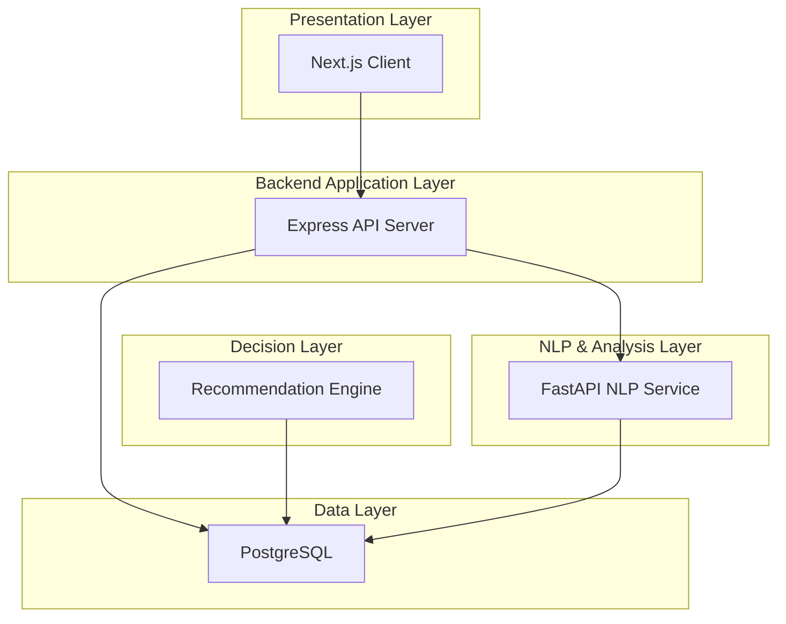
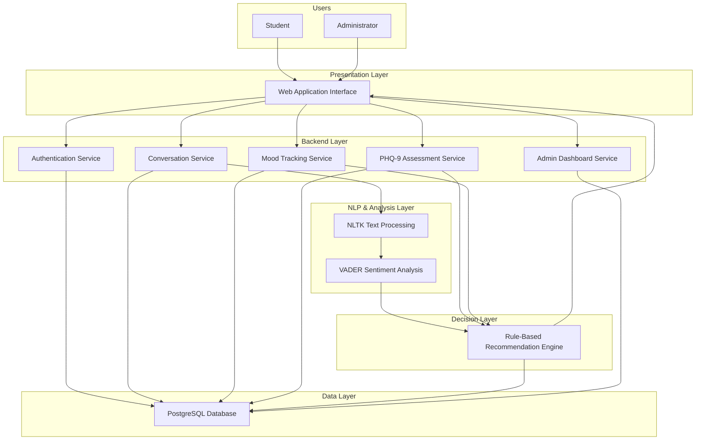
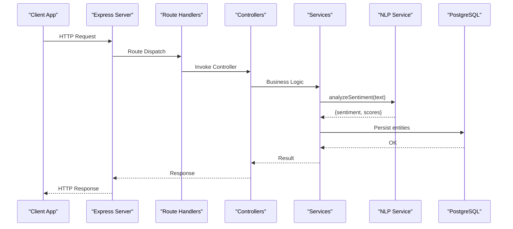
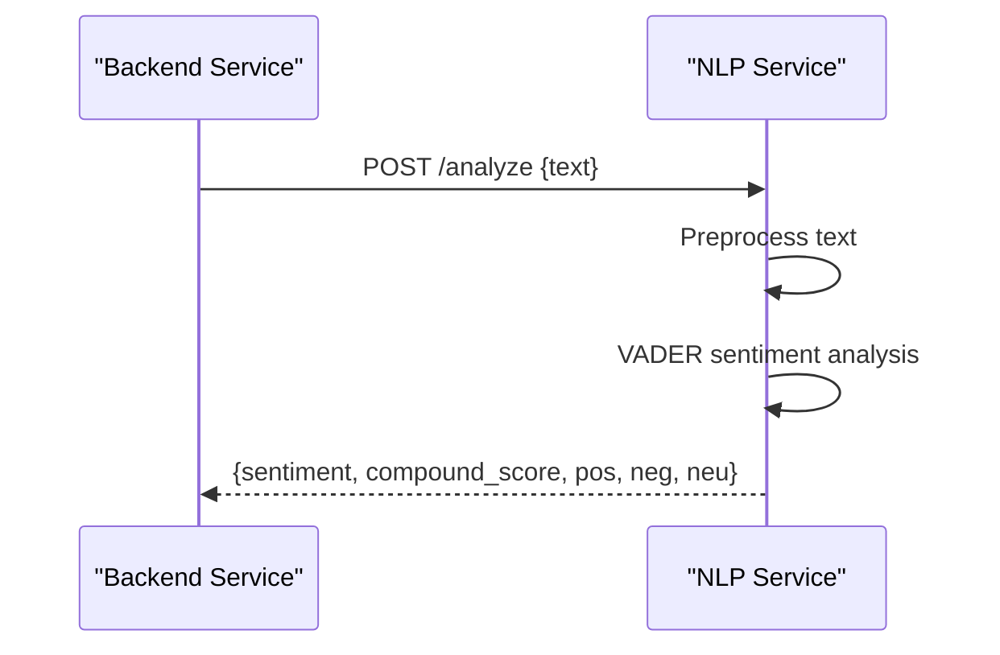
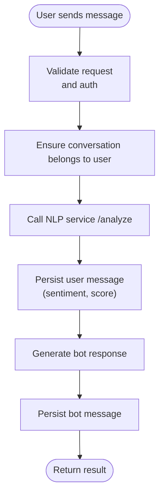
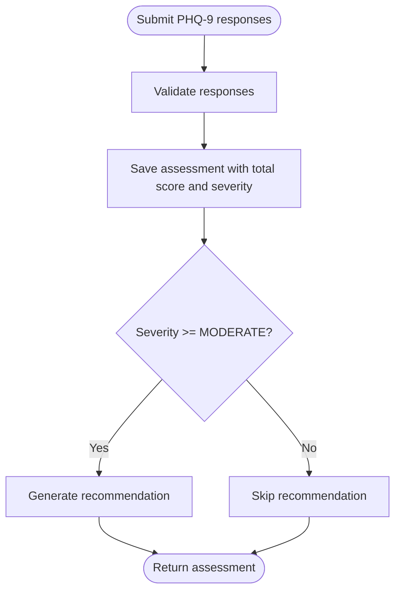
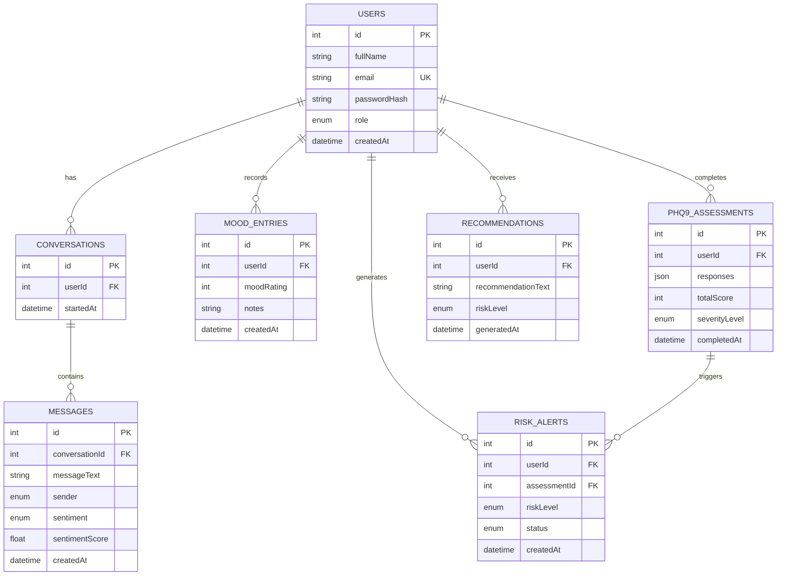
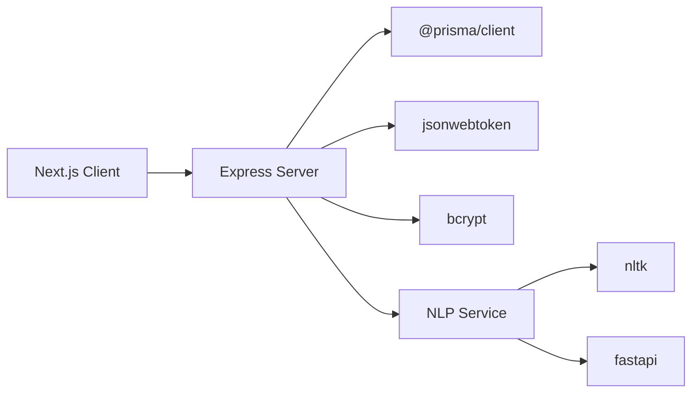

# System Architecture

<cite>
**Referenced Files in This Document**
- [README.md](file://README.md)
- [requirements.md](file://requirements.md)
- [docker-compose.yml](file://docker-compose.yml)
- [prisma/schema.prisma](file://prisma/schema.prisma)
- [server/src/index.ts](file://server/src/index.ts)
- [server/src/config/env.ts](file://server/src/config/env.ts)
- [server/src/services/nlp.service.ts](file://server/src/services/nlp.service.ts)
- [server/src/controllers/chat.controller.ts](file://server/src/controllers/chat.controller.ts)
- [server/src/controllers/assessment.controller.ts](file://server/src/controllers/assessment.controller.ts)
- [server/src/controllers/mood.controller.ts](file://server/src/controllers/mood.controller.ts)
- [server/src/routes/chat.routes.ts](file://server/src/routes/chat.routes.ts)
- [server/src/services/chat.service.ts](file://server/src/services/chat.service.ts)
- [nlp-service/main.py](file://nlp-service/main.py)
- [nlp-service/requirements.txt](file://nlp-service/requirements.txt)
- [client/package.json](file://client/package.json)
- [server/package.json](file://server/package.json)
</cite>

## Table of Contents
1. [Introduction](#introduction)
2. [Project Structure](#project-structure)
3. [Core Components](#core-components)
4. [Architecture Overview](#architecture-overview)
5. [Detailed Component Analysis](#detailed-component-analysis)
6. [Dependency Analysis](#dependency-analysis)
7. [Performance Considerations](#performance-considerations)
8. [Troubleshooting Guide](#troubleshooting-guide)
9. [Conclusion](#conclusion)
10. [Appendices](#appendices)

## Introduction
This document presents the system architecture for BuddyAI, a multi-tier intelligent system designed to support students experiencing symptoms of depression. The architecture follows a clear separation of concerns across:
- Presentation Layer (web interface)
- Backend Application Layer (RESTful API)
- NLP & Analysis Layer (sentiment analysis)
- Decision Layer (recommendation engine)
- Data Layer (PostgreSQL)

It documents component interactions from user authentication through conversation management, sentiment analysis, PHQ-9 assessment processing, and recommendation generation. It also covers microservices architecture, containerized deployment using Docker Compose, inter-service communication patterns, infrastructure requirements, scalability, security (JWT), monitoring, disaster recovery, technology stack integration, and third-party dependencies.

## Project Structure
The repository is organized into distinct modules:
- client: Next.js frontend application
- server: Express-based backend API with TypeScript
- nlp-service: Standalone FastAPI microservice for NLP
- prisma: Database schema and Prisma configuration
- Root-level orchestration and documentation

**Diagram sources**
- [server/src/index.ts:1-35](file://server/src/index.ts#L1-L35)
- [server/src/config/env.ts:1-12](file://server/src/config/env.ts#L1-L12)
- [server/src/services/nlp.service.ts:1-24](file://server/src/services/nlp.service.ts#L1-L24)
- [nlp-service/main.py:1-71](file://nlp-service/main.py#L1-L71)
- [prisma/schema.prisma:1-134](file://prisma/schema.prisma#L1-L134)

**Section sources**
- [README.md:125-211](file://README.md#L125-L211)
- [client/package.json:1-27](file://client/package.json#L1-L27)
- [server/package.json:1-36](file://server/package.json#L1-L36)
- [nlp-service/requirements.txt:1-6](file://nlp-service/requirements.txt#L1-L6)

## Core Components
- Presentation Layer (Next.js)
  - Provides user-facing pages for authentication, chat, mood tracking, PHQ-9 assessment, and admin dashboard.
  - Communicates with the backend REST API for all data operations.

- Backend Application Layer (Express)
  - Exposes REST endpoints under /api/* for authentication, conversations, mood, assessments, risk, alerts, and dashboard.
  - Implements middleware for authentication and centralized error handling.
  - Orchestrates cross-cutting concerns such as JWT-based authentication and authorization.

- NLP & Analysis Layer (FastAPI)
  - Independent microservice offering sentiment analysis via VADER.
  - Provides health checks and CORS-enabled endpoints.
  - Consumed by the backend via HTTP calls.

- Decision Layer (Recommendation Engine)
  - Implemented within backend services and controllers.
  - Generates recommendations based on sentiment, PHQ-9 results, and mood history.
  - Triggers risk alerts for moderate/severe cases.

- Data Layer (PostgreSQL)
  - Managed via Prisma ORM with strongly-typed models.
  - Stores users, conversations, messages, mood entries, PHQ-9 assessments, recommendations, and risk alerts.

**Section sources**
- [README.md:125-211](file://README.md#L125-L211)
- [server/src/index.ts:1-35](file://server/src/index.ts#L1-L35)
- [server/src/config/env.ts:1-12](file://server/src/config/env.ts#L1-L12)
- [server/src/services/nlp.service.ts:1-24](file://server/src/services/nlp.service.ts#L1-L24)
- [nlp-service/main.py:1-71](file://nlp-service/main.py#L1-L71)
- [prisma/schema.prisma:1-134](file://prisma/schema.prisma#L1-L134)

## Architecture Overview
The system employs a multi-tier, microservices-oriented design:
- Presentation Layer: Next.js SPA
- Backend Layer: Express REST API with route/controller/service pattern
- NLP Layer: Standalone FastAPI service
- Decision Layer: Rule-based logic integrated in backend services
- Data Layer: PostgreSQL with Prisma ORM

Inter-service communication:
- Backend calls NLP service via HTTP POST to /analyze with raw text.
- Backend persists all domain entities to PostgreSQL through Prisma.

**Diagram sources**
- [README.md:212-271](file://README.md#L212-L271)
- [server/src/index.ts:1-35](file://server/src/index.ts#L1-L35)
- [server/src/services/nlp.service.ts:1-24](file://server/src/services/nlp.service.ts#L1-L24)
- [nlp-service/main.py:1-71](file://nlp-service/main.py#L1-L71)
- [prisma/schema.prisma:1-134](file://prisma/schema.prisma#L1-L134)

## Detailed Component Analysis

### Backend REST API
- Entry point initializes Express, registers routes, and applies global middleware.
- Routes are grouped by domain: auth, mood, assessments, conversations, risk, alerts, dashboard.
- Centralized error handler ensures consistent error responses.

**Diagram sources**
- [server/src/index.ts:1-35](file://server/src/index.ts#L1-L35)
- [server/src/routes/chat.routes.ts:1-13](file://server/src/routes/chat.routes.ts#L1-L13)
- [server/src/controllers/chat.controller.ts:1-69](file://server/src/controllers/chat.controller.ts#L1-L69)
- [server/src/services/chat.service.ts:1-105](file://server/src/services/chat.service.ts#L1-L105)
- [server/src/services/nlp.service.ts:1-24](file://server/src/services/nlp.service.ts#L1-L24)
- [prisma/schema.prisma:1-134](file://prisma/schema.prisma#L1-L134)

**Section sources**
- [server/src/index.ts:1-35](file://server/src/index.ts#L1-L35)
- [server/src/routes/chat.routes.ts:1-13](file://server/src/routes/chat.routes.ts#L1-L13)
- [server/src/controllers/chat.controller.ts:1-69](file://server/src/controllers/chat.controller.ts#L1-L69)
- [server/src/services/chat.service.ts:1-105](file://server/src/services/chat.service.ts#L1-L105)

### NLP Microservice
- FastAPI service exposes:
  - POST /analyze: Accepts text, preprocesses, runs VADER sentiment analysis, returns sentiment label and scores.
  - GET /health: Health check endpoint.
- Downloads required NLTK resources at startup and configures CORS.

**Diagram sources**
- [nlp-service/main.py:1-71](file://nlp-service/main.py#L1-L71)
- [server/src/services/nlp.service.ts:1-24](file://server/src/services/nlp.service.ts#L1-L24)

**Section sources**
- [nlp-service/main.py:1-71](file://nlp-service/main.py#L1-L71)
- [nlp-service/requirements.txt:1-6](file://nlp-service/requirements.txt#L1-L6)
- [server/src/config/env.ts:1-12](file://server/src/config/env.ts#L1-L12)
- [server/src/services/nlp.service.ts:1-24](file://server/src/services/nlp.service.ts#L1-L24)

### Conversation Management and Sentiment Analysis
- Controllers validate requests and enforce authentication.
- Services create conversations, persist messages, call NLP for sentiment, and generate bot responses.
- Sentiment label is mapped to internal enum; scores are stored for downstream analytics.

**Diagram sources**
- [server/src/controllers/chat.controller.ts:1-69](file://server/src/controllers/chat.controller.ts#L1-L69)
- [server/src/services/chat.service.ts:1-105](file://server/src/services/chat.service.ts#L1-L105)
- [server/src/services/nlp.service.ts:1-24](file://server/src/services/nlp.service.ts#L1-L24)

**Section sources**
- [server/src/controllers/chat.controller.ts:1-69](file://server/src/controllers/chat.controller.ts#L1-L69)
- [server/src/services/chat.service.ts:1-105](file://server/src/services/chat.service.ts#L1-L105)

### PHQ-9 Assessment Processing
- Controllers validate PHQ-9 responses (array length 9, values 0–3).
- Services persist assessment, compute severity level, and optionally generate recommendations for moderate/severe cases.

**Diagram sources**
- [server/src/controllers/assessment.controller.ts:1-74](file://server/src/controllers/assessment.controller.ts#L1-L74)
- [prisma/schema.prisma:97-108](file://prisma/schema.prisma#L97-L108)

**Section sources**
- [server/src/controllers/assessment.controller.ts:1-74](file://server/src/controllers/assessment.controller.ts#L1-L74)
- [prisma/schema.prisma:97-108](file://prisma/schema.prisma#L97-L108)

### Mood Tracking
- Controllers validate mood rating range and optional notes.
- Services persist entries and provide history and trend analysis.

**Section sources**
- [server/src/controllers/mood.controller.ts:1-67](file://server/src/controllers/mood.controller.ts#L1-L67)
- [prisma/schema.prisma:86-95](file://prisma/schema.prisma#L86-L95)

### Data Model
The database schema defines entities and relationships for users, conversations, messages, mood entries, PHQ-9 assessments, recommendations, and risk alerts.

**Diagram sources**
- [prisma/schema.prisma:47-134](file://prisma/schema.prisma#L47-L134)

**Section sources**
- [prisma/schema.prisma:1-134](file://prisma/schema.prisma#L1-L134)

## Dependency Analysis
- Backend depends on:
  - Prisma client for database operations
  - bcrypt for password hashing
  - jsonwebtoken for JWT
  - dotenv for environment configuration
  - cors for cross-origin allowance
- NLP service depends on:
  - FastAPI, Uvicorn, NLTK, Pydantic, python-dotenv
- Frontend depends on:
  - Next.js, React, Tailwind CSS, TypeScript

**Diagram sources**
- [client/package.json:1-27](file://client/package.json#L1-L27)
- [server/package.json:1-36](file://server/package.json#L1-L36)
- [nlp-service/requirements.txt:1-6](file://nlp-service/requirements.txt#L1-L6)

**Section sources**
- [client/package.json:1-27](file://client/package.json#L1-L27)
- [server/package.json:1-36](file://server/package.json#L1-L36)
- [nlp-service/requirements.txt:1-6](file://nlp-service/requirements.txt#L1-L6)

## Performance Considerations
- Asynchronous processing: NLP calls are awaited; failures are handled gracefully to avoid blocking user interactions.
- Caching: No explicit caching layer is present; consider Redis for recommendation and sentiment caches if latency becomes a concern.
- Horizontal scaling: Separate services can be scaled independently; ensure stateless NLP and shared database.
- Database indexing: Prisma models define indexes on foreign keys; maintain these for optimal joins.
- Network latency: Keep NLP service close to backend (same compose network) to minimize RTT.

## Troubleshooting Guide
Common issues and resolutions:
- NLP service unavailability
  - Symptom: Conversation proceeds without sentiment enrichment.
  - Action: Verify NLP service health endpoint and logs; confirm NLP_SERVICE_URL configuration.
  - Section sources
    - [server/src/services/nlp.service.ts:1-24](file://server/src/services/nlp.service.ts#L1-L24)
    - [server/src/config/env.ts:1-12](file://server/src/config/env.ts#L1-L12)

- Authentication errors
  - Symptom: 401 responses on protected routes.
  - Action: Confirm JWT presence and validity; verify auth middleware.
  - Section sources
    - [server/src/controllers/chat.controller.ts:1-69](file://server/src/controllers/chat.controller.ts#L1-L69)

- PHQ-9 validation failures
  - Symptom: 400 responses for invalid responses payload.
  - Action: Ensure exactly 9 integer values in range 0–3.
  - Section sources
    - [server/src/controllers/assessment.controller.ts:1-74](file://server/src/controllers/assessment.controller.ts#L1-L74)

- Database connectivity
  - Symptom: Operational errors on queries.
  - Action: Confirm DATABASE_URL and PostgreSQL availability; check Docker volume persistence.
  - Section sources
    - [prisma/schema.prisma:5-8](file://prisma/schema.prisma#L5-L8)
    - [docker-compose.yml:1-19](file://docker-compose.yml#L1-L19)

## Conclusion
BuddyAI’s architecture cleanly separates concerns across presentation, backend, NLP, decision, and data layers. The microservices design isolates the NLP component, enabling independent scaling and deployment. The RESTful backend orchestrates user workflows, integrates sentiment analysis, processes PHQ-9 assessments, and generates recommendations. PostgreSQL with Prisma provides robust persistence. Security is addressed via JWT and RBAC-aligned controllers. The documented deployment topology and operational guidance support reliable, scalable operations.

## Appendices

### Deployment Topology and Infrastructure
- Containerization: PostgreSQL is containerized with persistent volume; NLP service and backend can be similarly containerized.
- Networking: Services communicate over local network; ensure NLP_SERVICE_URL points to reachable NLP container.
- Persistence: Volume mounted for PostgreSQL data durability.

**Section sources**
- [docker-compose.yml:1-19](file://docker-compose.yml#L1-L19)
- [server/src/config/env.ts:1-12](file://server/src/config/env.ts#L1-L12)

### Cross-Cutting Concerns
- Security
  - JWT-based authentication and authorization enforced via middleware and role enums.
  - Password hashing via bcrypt.
  - RBAC aligned with user roles (STUDENT vs COUNSELLOR).
- Monitoring
  - Health endpoints (/health) for API and NLP service.
  - Consider adding structured logs, metrics, and APM for production.
- Disaster Recovery
  - Persistent volume for PostgreSQL data.
  - Backups of database dumps and schema migrations recommended.

**Section sources**
- [server/src/index.ts:18-20](file://server/src/index.ts#L18-L20)
- [nlp-service/main.py:61-65](file://nlp-service/main.py#L61-L65)
- [prisma/schema.prisma:10-45](file://prisma/schema.prisma#L10-L45)

### Technology Stack Integration and Compatibility
- Frontend: Next.js 16.x, React 19.x, TypeScript 5.x, Tailwind CSS 4.x
- Backend: Node.js, Express 4.x, TypeScript 5.x, Prisma 6.x
- NLP: Python 3.x, FastAPI, Uvicorn, NLTK, Pydantic
- Database: PostgreSQL 16, Prisma ORM
- Authentication: jsonwebtoken, bcrypt
- Dev/Test: Vitest, Supertest, ts-node, nodemon

**Section sources**
- [client/package.json:1-27](file://client/package.json#L1-L27)
- [server/package.json:1-36](file://server/package.json#L1-L36)
- [nlp-service/requirements.txt:1-6](file://nlp-service/requirements.txt#L1-L6)
- [README.md:86-124](file://README.md#L86-L124)