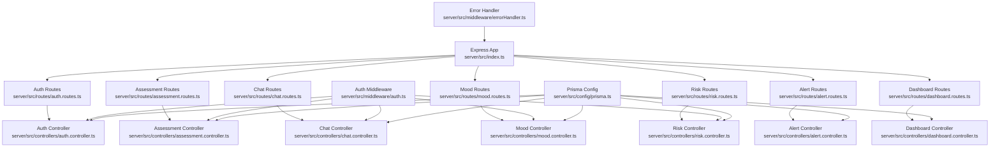
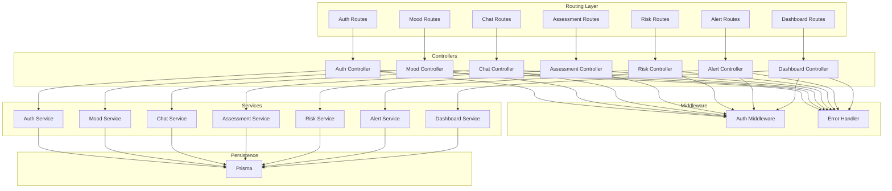
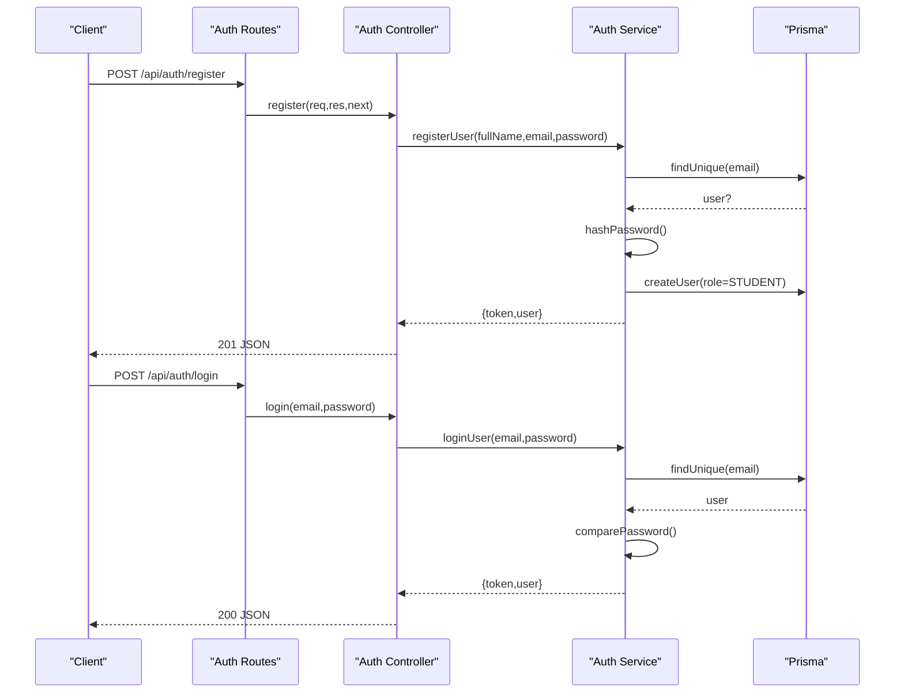
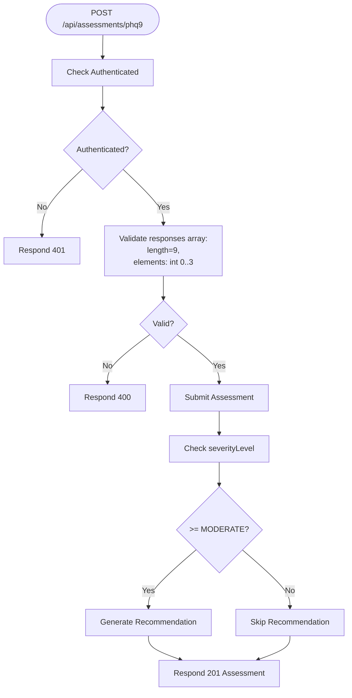
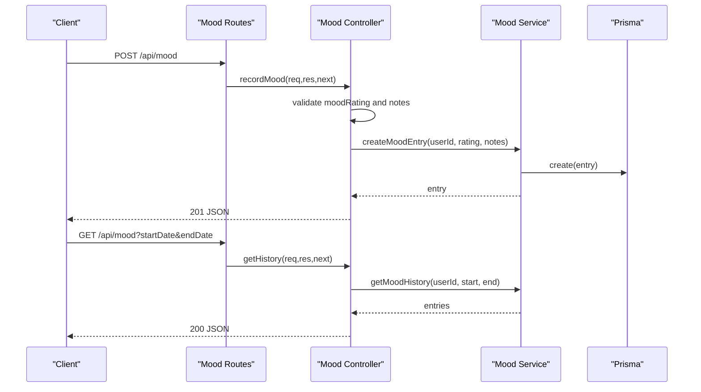
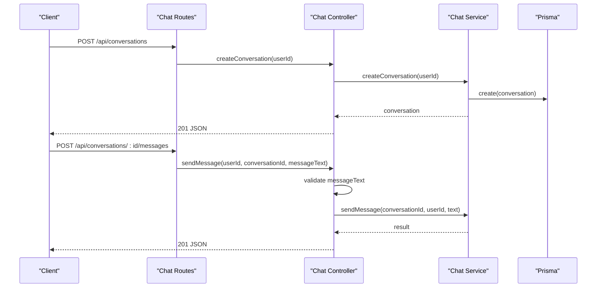
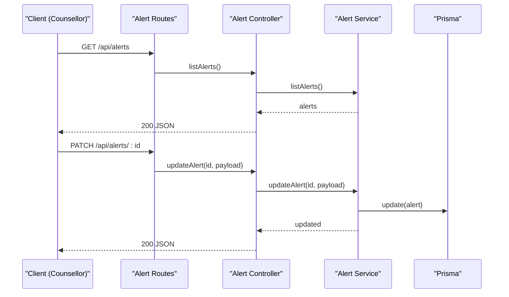
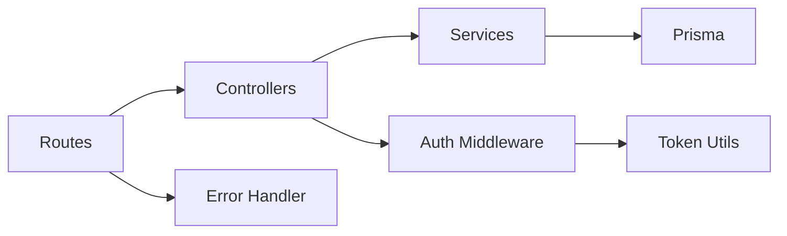

# API Testing

<cite>
**Referenced Files in This Document**
- [index.ts](file://server/src/index.ts)
- [auth.routes.ts](file://server/src/routes/auth.routes.ts)
- [assessment.routes.ts](file://server/src/routes/assessment.routes.ts)
- [chat.routes.ts](file://server/src/routes/chat.routes.ts)
- [mood.routes.ts](file://server/src/routes/mood.routes.ts)
- [risk.routes.ts](file://server/src/routes/risk.routes.ts)
- [alert.routes.ts](file://server/src/routes/alert.routes.ts)
- [dashboard.routes.ts](file://server/src/routes/dashboard.routes.ts)
- [auth.middleware.ts](file://server/src/middleware/auth.ts)
- [auth.controller.ts](file://server/src/controllers/auth.controller.ts)
- [assessment.controller.ts](file://server/src/controllers/assessment.controller.ts)
- [chat.controller.ts](file://server/src/controllers/chat.controller.ts)
- [mood.controller.ts](file://server/src/controllers/mood.controller.ts)
- [risk.controller.ts](file://server/src/controllers/risk.controller.ts)
- [alert.controller.ts](file://server/src/controllers/alert.controller.ts)
- [dashboard.controller.ts](file://server/src/controllers/dashboard.controller.ts)
- [auth.service.ts](file://server/src/services/auth.service.ts)
- [token.utils.ts](file://server/src/utils/token.ts)
- [error.handler.ts](file://server/src/middleware/errorHandler.ts)
- [prisma.config.ts](file://server/src/config/prisma.ts)
</cite>

## Table of Contents
1. [Introduction](#introduction)
2. [Project Structure](#project-structure)
3. [Core Components](#core-components)
4. [Architecture Overview](#architecture-overview)
5. [Detailed Component Analysis](#detailed-component-analysis)
6. [Dependency Analysis](#dependency-analysis)
7. [Performance Considerations](#performance-considerations)
8. [Troubleshooting Guide](#troubleshooting-guide)
9. [Conclusion](#conclusion)
10. [Appendices](#appendices)

## Introduction
This document defines a comprehensive API testing strategy for the BuddyAI backend. It focuses on validating RESTful endpoints across authentication, assessment, chat, mood tracking, risk evaluation, alert handling, and dashboard functionalities. The strategy covers HTTP method testing, status code validation, response schema verification, authentication testing with JWT tokens, role-based access control, session validation, request payload validation, parameter testing, error response handling, API contract testing, OpenAPI validation, endpoint documentation verification, complex workflows, batch operations, and security/performance testing.

## Project Structure
The server exposes a set of API groups under the /api base path. Each group corresponds to a dedicated route module that mounts controller handlers. Middleware enforces authentication and optional role checks. Controllers delegate to services backed by Prisma ORM, while shared utilities handle token generation/verification.

**Diagram sources**
- [index.ts:1-35](file://server/src/index.ts#L1-L35)
- [auth.routes.ts:1-12](file://server/src/routes/auth.routes.ts#L1-L12)
- [assessment.routes.ts:1-12](file://server/src/routes/assessment.routes.ts#L1-L12)
- [chat.routes.ts:1-13](file://server/src/routes/chat.routes.ts#L1-L13)
- [mood.routes.ts:1-12](file://server/src/routes/mood.routes.ts#L1-L12)
- [risk.routes.ts:1-11](file://server/src/routes/risk.routes.ts#L1-L11)
- [alert.routes.ts:1-15](file://server/src/routes/alert.routes.ts#L1-L15)
- [dashboard.routes.ts:1-11](file://server/src/routes/dashboard.routes.ts#L1-L11)
- [auth.controller.ts:1-50](file://server/src/controllers/auth.controller.ts#L1-L50)
- [assessment.controller.ts:1-74](file://server/src/controllers/assessment.controller.ts#L1-L74)
- [chat.controller.ts:1-69](file://server/src/controllers/chat.controller.ts#L1-L69)
- [mood.controller.ts:1-67](file://server/src/controllers/mood.controller.ts#L1-L67)
- [risk.controller.ts](file://server/src/controllers/risk.controller.ts)
- [alert.controller.ts](file://server/src/controllers/alert.controller.ts)
- [dashboard.controller.ts](file://server/src/controllers/dashboard.controller.ts)
- [auth.middleware.ts:1-39](file://server/src/middleware/auth.ts#L1-L39)
- [error.handler.ts](file://server/src/middleware/errorHandler.ts)
- [prisma.config.ts](file://server/src/config/prisma.ts)

**Section sources**
- [index.ts:1-35](file://server/src/index.ts#L1-L35)

## Core Components
- Authentication and Authorization
  - JWT-based authentication via Authorization header with Bearer token.
  - Role-based access control enforcing counselor-only endpoints.
- Request Validation
  - Body and parameter validation with explicit 400 responses for malformed requests.
- Error Handling
  - Centralized error handler for consistent error responses.
- Persistence
  - Services interact with Prisma ORM for database operations.

Key testing areas:
- Authentication: token presence, validity, expiration, and role enforcement.
- Payload validation: shape, types, and constraints per endpoint.
- Parameter validation: path/query parameters and sanitization.
- Status codes: 2xx, 4xx, and 5xx coverage aligned with controller logic.
- Response schemas: structure and field presence verified against service outputs.

**Section sources**
- [auth.middleware.ts:1-39](file://server/src/middleware/auth.ts#L1-L39)
- [auth.controller.ts:1-50](file://server/src/controllers/auth.controller.ts#L1-L50)
- [assessment.controller.ts:1-74](file://server/src/controllers/assessment.controller.ts#L1-L74)
- [chat.controller.ts:1-69](file://server/src/controllers/chat.controller.ts#L1-L69)
- [mood.controller.ts:1-67](file://server/src/controllers/mood.controller.ts#L1-L67)
- [risk.controller.ts](file://server/src/controllers/risk.controller.ts)
- [alert.controller.ts](file://server/src/controllers/alert.controller.ts)
- [dashboard.controller.ts](file://server/src/controllers/dashboard.controller.ts)
- [error.handler.ts](file://server/src/middleware/errorHandler.ts)
- [prisma.config.ts](file://server/src/config/prisma.ts)

## Architecture Overview
The API follows a layered architecture:
- Routes define endpoints and attach middleware.
- Controllers orchestrate request handling and delegate to services.
- Services encapsulate business logic and data access.
- Middleware handles cross-cutting concerns (auth, error handling).
- Utilities provide token operations.

**Diagram sources**
- [auth.routes.ts:1-12](file://server/src/routes/auth.routes.ts#L1-L12)
- [mood.routes.ts:1-12](file://server/src/routes/mood.routes.ts#L1-L12)
- [chat.routes.ts:1-13](file://server/src/routes/chat.routes.ts#L1-L13)
- [assessment.routes.ts:1-12](file://server/src/routes/assessment.routes.ts#L1-L12)
- [risk.routes.ts:1-11](file://server/src/routes/risk.routes.ts#L1-L11)
- [alert.routes.ts:1-15](file://server/src/routes/alert.routes.ts#L1-L15)
- [dashboard.routes.ts:1-11](file://server/src/routes/dashboard.routes.ts#L1-L11)
- [auth.controller.ts:1-50](file://server/src/controllers/auth.controller.ts#L1-L50)
- [mood.controller.ts:1-67](file://server/src/controllers/mood.controller.ts#L1-L67)
- [chat.controller.ts:1-69](file://server/src/controllers/chat.controller.ts#L1-L69)
- [assessment.controller.ts:1-74](file://server/src/controllers/assessment.controller.ts#L1-L74)
- [risk.controller.ts](file://server/src/controllers/risk.controller.ts)
- [alert.controller.ts](file://server/src/controllers/alert.controller.ts)
- [dashboard.controller.ts](file://server/src/controllers/dashboard.controller.ts)
- [auth.middleware.ts:1-39](file://server/src/middleware/auth.ts#L1-L39)
- [error.handler.ts](file://server/src/middleware/errorHandler.ts)
- [auth.service.ts:1-72](file://server/src/services/auth.service.ts#L1-L72)
- [prisma.config.ts](file://server/src/config/prisma.ts)

## Detailed Component Analysis

### Authentication and Authorization Testing
Endpoints:
- POST /api/auth/register
- POST /api/auth/login
- GET /api/auth/me

Validation checklist:
- HTTP methods: POST for register/login, GET for me.
- Status codes: 201 on successful registration, 200 on login, 200 on fetch profile, 400 for missing fields, 409 for duplicate email, 401 for invalid credentials, 404 for missing user.
- Headers: Content-Type: application/json.
- Authentication: Bearer token required for protected endpoints; missing/expired/invalid tokens must yield 401.
- Role-based access: Protected endpoints under auth middleware should reject unauthenticated requests.

**Diagram sources**
- [auth.routes.ts:1-12](file://server/src/routes/auth.routes.ts#L1-L12)
- [auth.controller.ts:1-50](file://server/src/controllers/auth.controller.ts#L1-L50)
- [auth.service.ts:1-72](file://server/src/services/auth.service.ts#L1-L72)
- [prisma.config.ts](file://server/src/config/prisma.ts)

**Section sources**
- [auth.routes.ts:1-12](file://server/src/routes/auth.routes.ts#L1-L12)
- [auth.controller.ts:1-50](file://server/src/controllers/auth.controller.ts#L1-L50)
- [auth.service.ts:1-72](file://server/src/services/auth.service.ts#L1-L72)
- [auth.middleware.ts:1-39](file://server/src/middleware/auth.ts#L1-L39)
- [token.utils.ts:1-17](file://server/src/utils/token.ts#L1-L17)

### Assessment Workflow Testing
Endpoints:
- POST /api/assessments/phq9
- GET /api/assessments/phq9
- GET /api/assessments/phq9/:id

Validation checklist:
- HTTP methods: POST, GET (list), GET (detail).
- Authentication: all require Bearer token.
- Payload validation: responses array must be length 9 with integers 0–3; otherwise 400.
- Status codes: 201 on submission, 200 on list/detail, 400 for invalid payload, 404 if assessment not found by id.
- Severity-triggered actions: when severity level indicates MODERATE or above, recommendation generation is invoked.

**Diagram sources**
- [assessment.routes.ts:1-12](file://server/src/routes/assessment.routes.ts#L1-L12)
- [assessment.controller.ts:1-74](file://server/src/controllers/assessment.controller.ts#L1-L74)

**Section sources**
- [assessment.routes.ts:1-12](file://server/src/routes/assessment.routes.ts#L1-L12)
- [assessment.controller.ts:1-74](file://server/src/controllers/assessment.controller.ts#L1-L74)

### Mood Tracking Testing
Endpoints:
- POST /api/mood
- GET /api/mood
- GET /api/mood/trends

Validation checklist:
- HTTP methods: POST, GET (history), GET (trends).
- Authentication: all require Bearer token.
- Payload validation: moodRating required, integer 1–5; notes optional string.
- Query parameters: history supports startDate and endDate date filters.
- Status codes: 201 on creation, 200 on retrieval, 400 for invalid rating/notes, 404 if not found.

**Diagram sources**
- [mood.routes.ts:1-12](file://server/src/routes/mood.routes.ts#L1-L12)
- [mood.controller.ts:1-67](file://server/src/controllers/mood.controller.ts#L1-L67)

**Section sources**
- [mood.routes.ts:1-12](file://server/src/routes/mood.routes.ts#L1-L12)
- [mood.controller.ts:1-67](file://server/src/controllers/mood.controller.ts#L1-L67)

### Chat Functionality Testing
Endpoints:
- POST /api/conversations
- GET /api/conversations
- POST /api/conversations/:id/messages
- GET /api/conversations/:id/messages

Validation checklist:
- HTTP methods: POST (create), GET (list), POST (send), GET (messages).
- Authentication: all require Bearer token.
- Path parameters: conversation id parsed and validated.
- Payload validation: messageText required, non-empty string; otherwise 400.
- Status codes: 201 on creation/send, 200 on list/retrieve, 400 for invalid messageText, 404 if conversation not found.

**Diagram sources**
- [chat.routes.ts:1-13](file://server/src/routes/chat.routes.ts#L1-L13)
- [chat.controller.ts:1-69](file://server/src/controllers/chat.controller.ts#L1-L69)

**Section sources**
- [chat.routes.ts:1-13](file://server/src/routes/chat.routes.ts#L1-L13)
- [chat.controller.ts:1-69](file://server/src/controllers/chat.controller.ts#L1-L69)

### Risk Management Testing
Endpoints:
- POST /api/risk/evaluate
- GET /api/risk/latest

Validation checklist:
- HTTP methods: POST, GET.
- Authentication: all require Bearer token.
- Payload validation: depends on service-specific requirements.
- Status codes: 201/200 on success, 400 for invalid payload, 404 if latest not found.

**Section sources**
- [risk.routes.ts:1-11](file://server/src/routes/risk.routes.ts#L1-L11)
- [risk.controller.ts](file://server/src/controllers/risk.controller.ts)

### Alert Handling Testing
Endpoints:
- GET /api/alerts
- GET /api/alerts/:id
- PATCH /api/alerts/:id
- GET /api/alerts/:id/student

Validation checklist:
- HTTP methods: GET (list), GET (detail), PATCH (update), GET (student summary).
- Authentication: requires Bearer token.
- Role-based access: requireRole('COUNSELLOR').
- Status codes: 200 on success, 403 for insufficient permissions, 404 if not found.

**Diagram sources**
- [alert.routes.ts:1-15](file://server/src/routes/alert.routes.ts#L1-L15)
- [alert.controller.ts](file://server/src/controllers/alert.controller.ts)

**Section sources**
- [alert.routes.ts:1-15](file://server/src/routes/alert.routes.ts#L1-L15)
- [alert.controller.ts](file://server/src/controllers/alert.controller.ts)

### Dashboard Functionality Testing
Endpoint:
- GET /api/dashboard/stats

Validation checklist:
- HTTP methods: GET.
- Authentication: requires Bearer token.
- Role-based access: requireRole('COUNSELLOR').
- Status codes: 200 on success, 403 for insufficient permissions.

**Section sources**
- [dashboard.routes.ts:1-11](file://server/src/routes/dashboard.routes.ts#L1-L11)
- [dashboard.controller.ts](file://server/src/controllers/dashboard.controller.ts)

### Health Endpoint
Endpoint:
- GET /health

Validation checklist:
- HTTP methods: GET.
- Status codes: 200 with JSON body indicating health status.

**Section sources**
- [index.ts:18-20](file://server/src/index.ts#L18-L20)

## Dependency Analysis
- Route-to-Controller coupling is thin; controllers depend on services.
- Controllers depend on Prisma for persistence.
- Middleware injects user identity and enforces roles.
- Token utilities centralize JWT operations.

**Diagram sources**
- [auth.routes.ts:1-12](file://server/src/routes/auth.routes.ts#L1-L12)
- [assessment.routes.ts:1-12](file://server/src/routes/assessment.routes.ts#L1-L12)
- [chat.routes.ts:1-13](file://server/src/routes/chat.routes.ts#L1-L13)
- [mood.routes.ts:1-12](file://server/src/routes/mood.routes.ts#L1-L12)
- [risk.routes.ts:1-11](file://server/src/routes/risk.routes.ts#L1-L11)
- [alert.routes.ts:1-15](file://server/src/routes/alert.routes.ts#L1-L15)
- [dashboard.routes.ts:1-11](file://server/src/routes/dashboard.routes.ts#L1-L11)
- [auth.controller.ts:1-50](file://server/src/controllers/auth.controller.ts#L1-L50)
- [assessment.controller.ts:1-74](file://server/src/controllers/assessment.controller.ts#L1-L74)
- [chat.controller.ts:1-69](file://server/src/controllers/chat.controller.ts#L1-L69)
- [mood.controller.ts:1-67](file://server/src/controllers/mood.controller.ts#L1-L67)
- [risk.controller.ts](file://server/src/controllers/risk.controller.ts)
- [alert.controller.ts](file://server/src/controllers/alert.controller.ts)
- [dashboard.controller.ts](file://server/src/controllers/dashboard.controller.ts)
- [auth.middleware.ts:1-39](file://server/src/middleware/auth.ts#L1-L39)
- [token.utils.ts:1-17](file://server/src/utils/token.ts#L1-L17)
- [error.handler.ts](file://server/src/middleware/errorHandler.ts)
- [prisma.config.ts](file://server/src/config/prisma.ts)

**Section sources**
- [index.ts:1-35](file://server/src/index.ts#L1-L35)
- [auth.middleware.ts:1-39](file://server/src/middleware/auth.ts#L1-L39)
- [token.utils.ts:1-17](file://server/src/utils/token.ts#L1-L17)
- [error.handler.ts](file://server/src/middleware/errorHandler.ts)
- [prisma.config.ts](file://server/src/config/prisma.ts)

## Performance Considerations
- Rate limiting: Enforce per-endpoint or global limits to prevent abuse; validate 429 responses during load tests.
- Concurrency: Test concurrent submissions for assessments and chat to detect race conditions.
- Caching: Consider caching frequent reads (e.g., dashboard stats) with cache invalidation policies.
- Database queries: Monitor slow queries for chat/message retrieval and trend computations.
- Token reuse: Validate short-lived tokens refresh behavior to avoid repeated auth overhead.

## Troubleshooting Guide
Common issues and remediation:
- 401 Unauthorized
  - Cause: Missing or malformed Authorization header; invalid/expired token.
  - Remediation: Ensure Bearer token is present and valid; re-authenticate if necessary.
- 403 Forbidden
  - Cause: Insufficient role for counselor-only endpoints.
  - Remediation: Authenticate as a user with role 'COUNSELLOR'.
- 400 Bad Request
  - Cause: Missing or invalid payload fields; incorrect types or ranges.
  - Remediation: Align payloads with validation rules (e.g., moodRating 1–5, PHQ-9 responses length 9 with values 0–3).
- 404 Not Found
  - Cause: Non-existent resource by id.
  - Remediation: Verify ids and ownership checks.
- 500 Internal Server Error
  - Cause: Unhandled exceptions in services or controllers.
  - Remediation: Review centralized error handler logs and service stack traces.

**Section sources**
- [auth.middleware.ts:1-39](file://server/src/middleware/auth.ts#L1-L39)
- [assessment.controller.ts:1-74](file://server/src/controllers/assessment.controller.ts#L1-L74)
- [chat.controller.ts:1-69](file://server/src/controllers/chat.controller.ts#L1-L69)
- [mood.controller.ts:1-67](file://server/src/controllers/mood.controller.ts#L1-L67)
- [auth.service.ts:1-72](file://server/src/services/auth.service.ts#L1-L72)
- [error.handler.ts](file://server/src/middleware/errorHandler.ts)

## Conclusion
This API testing strategy provides a structured approach to validate BuddyAI’s REST endpoints across functional correctness, authentication, authorization, payload validation, error handling, and operational robustness. By focusing on the documented endpoints and their associated controllers, middleware, and services, teams can ensure reliable and secure API behavior for all user roles and workflows.

## Appendices

### API Contract Testing and OpenAPI Validation
- Maintain an OpenAPI/Swagger specification aligned with routes and controllers.
- Validate runtime responses against schema definitions to catch drift between code and docs.
- Use automated tooling to enforce contract compliance during CI.

### Security Testing Approaches
- JWT token tampering: attempt altered claims and verify rejection.
- Role escalation: attempt counselor-only endpoints with STUDENT credentials.
- Input injection: test payloads with malicious content to ensure sanitization and 400 responses.
- CORS and CSRF: verify headers and protections for browser clients.

### Real-Time Communication Endpoints
- Current routes expose synchronous REST endpoints; no WebSocket endpoints are present.
- Recommendations: introduce event streaming or polling-based updates for chat timelines if needed.

### Batch Operations
- No explicit batch endpoints are defined.
- Recommendations: design batch mutation endpoints with idempotency keys and partial failure reporting.