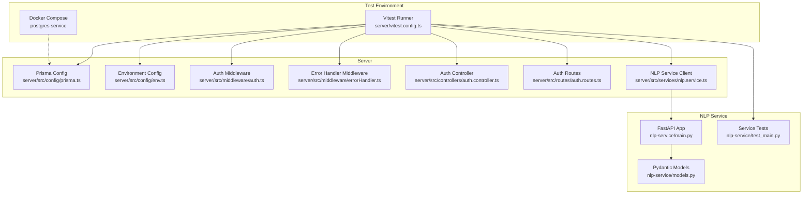
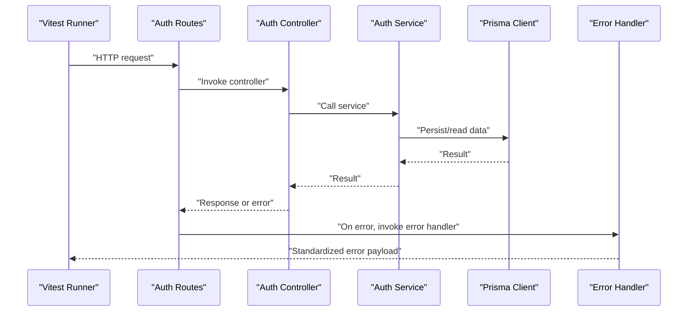
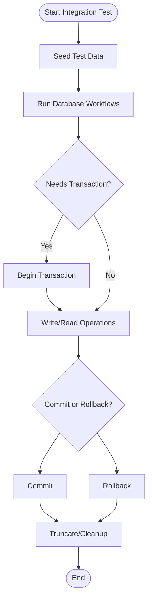
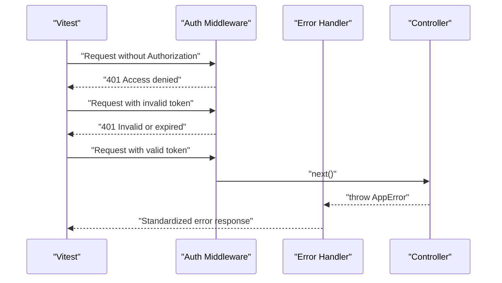
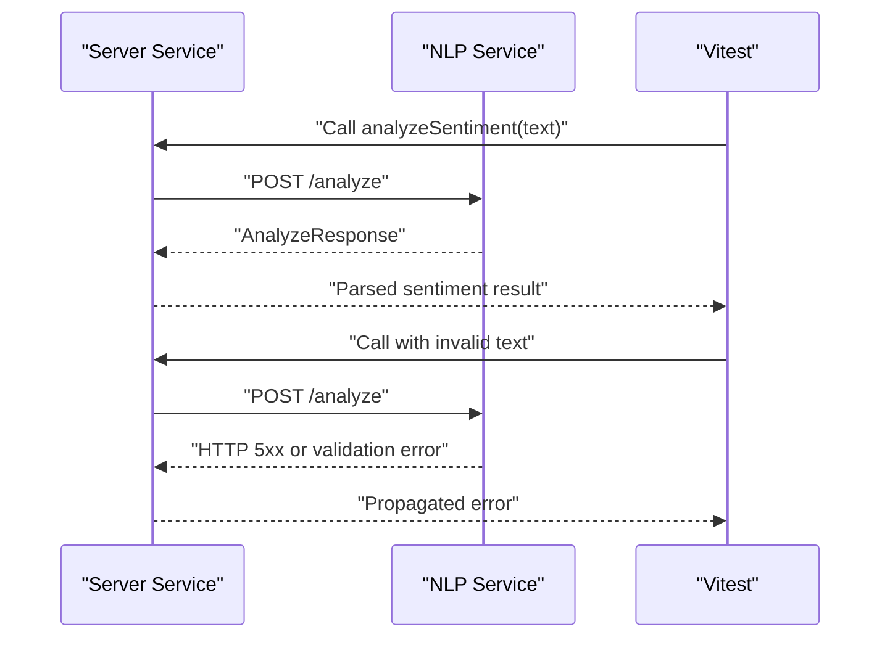
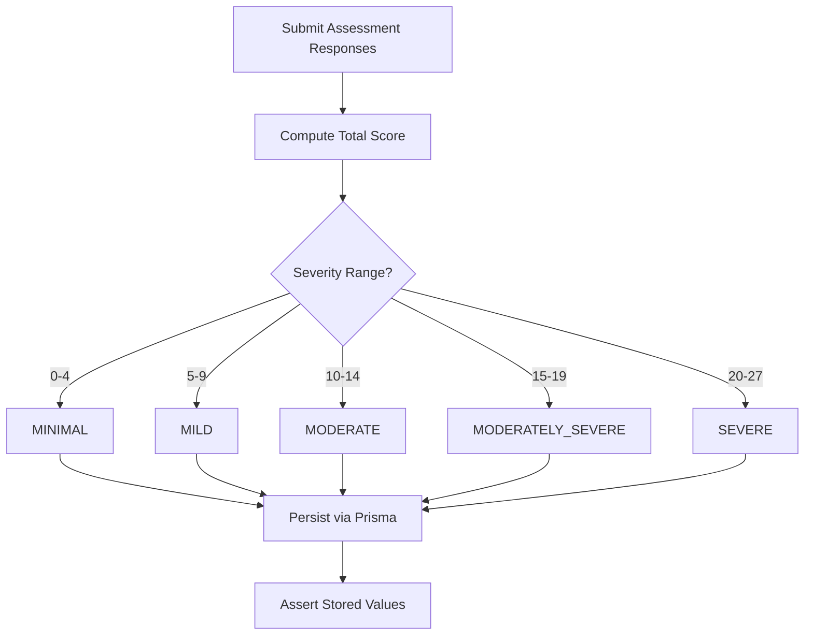
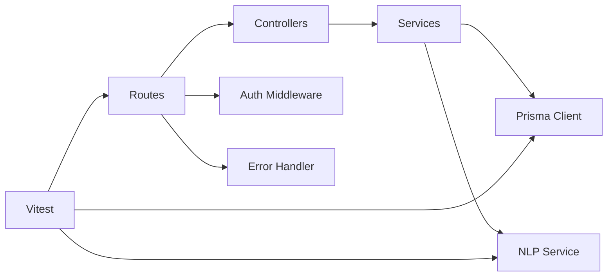

# Integration Testing

<cite>
**Referenced Files in This Document**
- [docker-compose.yml](file://docker-compose.yml)
- [vitest.config.ts](file://server/vitest.config.ts)
- [setup.ts](file://server/src/__tests__/setup.ts)
- [prisma.ts](file://server/src/config/prisma.ts)
- [env.ts](file://server/src/config/env.ts)
- [auth.ts](file://server/src/middleware/auth.ts)
- [errorHandler.ts](file://server/src/middleware/errorHandler.ts)
- [auth.controller.ts](file://server/src/controllers/auth.controller.ts)
- [auth.routes.ts](file://server/src/routes/auth.routes.ts)
- [nlp.service.ts](file://server/src/services/nlp.service.ts)
- [main.py](file://nlp-service/main.py)
- [models.py](file://nlp-service/models.py)
- [test_main.py](file://nlp-service/test_main.py)
- [auth.test.ts](file://server/src/__tests__/auth.test.ts)
- [assessment.test.ts](file://server/src/__tests__/assessment.test.ts)
</cite>

## Table of Contents
1. [Introduction](#introduction)
2. [Project Structure](#project-structure)
3. [Core Components](#core-components)
4. [Architecture Overview](#architecture-overview)
5. [Detailed Component Analysis](#detailed-component-analysis)
6. [Dependency Analysis](#dependency-analysis)
7. [Performance Considerations](#performance-considerations)
8. [Troubleshooting Guide](#troubleshooting-guide)
9. [Conclusion](#conclusion)
10. [Appendices](#appendices)

## Introduction
This document defines an integration testing strategy for validating component interactions across the backend server, database, middleware, and the NLP service. It covers database connectivity using Prisma ORM, middleware validation (authentication and error handling), inter-service communication, and NLP sentiment analysis workflows. It also documents test environment setup, database seeding/cleanup, and performance considerations such as timeouts and resource management.

## Project Structure
The integration testing landscape spans three primary areas:
- Backend server (Express-based) with Vitest for unit/integration tests
- Database orchestrated via Docker Compose (PostgreSQL)
- NLP service (FastAPI) for sentiment analysis

**Diagram sources**
- [docker-compose.yml](file://docker-compose.yml)
- [vitest.config.ts](file://server/vitest.config.ts)
- [prisma.ts](file://server/src/config/prisma.ts)
- [env.ts](file://server/src/config/env.ts)
- [auth.ts](file://server/src/middleware/auth.ts)
- [errorHandler.ts](file://server/src/middleware/errorHandler.ts)
- [auth.controller.ts](file://server/src/controllers/auth.controller.ts)
- [auth.routes.ts](file://server/src/routes/auth.routes.ts)
- [nlp.service.ts](file://server/src/services/nlp.service.ts)
- [main.py](file://nlp-service/main.py)
- [models.py](file://nlp-service/models.py)
- [test_main.py](file://nlp-service/test_main.py)

**Section sources**
- [docker-compose.yml](file://docker-compose.yml)
- [vitest.config.ts](file://server/vitest.config.ts)
- [prisma.ts](file://server/src/config/prisma.ts)
- [env.ts](file://server/src/config/env.ts)
- [auth.ts](file://server/src/middleware/auth.ts)
- [errorHandler.ts](file://server/src/middleware/errorHandler.ts)
- [auth.controller.ts](file://server/src/controllers/auth.controller.ts)
- [auth.routes.ts](file://server/src/routes/auth.routes.ts)
- [nlp.service.ts](file://server/src/services/nlp.service.ts)
- [main.py](file://nlp-service/main.py)
- [models.py](file://nlp-service/models.py)
- [test_main.py](file://nlp-service/test_main.py)

## Core Components
- Database connectivity and Prisma ORM
  - Prisma client initialization and usage are central to persistence in integration tests. The client is mocked in unit tests but can be backed by a real Postgres container during integration tests.
  - Reference: [prisma.ts](file://server/src/config/prisma.ts), [docker-compose.yml](file://docker-compose.yml)

- Middleware stack
  - Authentication middleware validates bearer tokens and attaches user context.
  - Error handler middleware standardizes error responses.
  - References: [auth.ts](file://server/src/middleware/auth.ts), [errorHandler.ts](file://server/src/middleware/errorHandler.ts)

- Inter-service communication
  - Server-side NLP client calls the NLP service endpoint and handles errors.
  - References: [nlp.service.ts](file://server/src/services/nlp.service.ts), [env.ts](file://server/src/config/env.ts), [main.py](file://nlp-service/main.py)

- Test harness and environment
  - Vitest configuration sets global test environment and timeouts.
  - Test setup mocks Prisma and utility modules to isolate tested units while enabling integration scenarios.
  - References: [vitest.config.ts](file://server/vitest.config.ts), [setup.ts](file://server/src/__tests__/setup.ts), [auth.test.ts](file://server/src/__tests__/auth.test.ts), [assessment.test.ts](file://server/src/__tests__/assessment.test.ts)

**Section sources**
- [prisma.ts](file://server/src/config/prisma.ts)
- [docker-compose.yml](file://docker-compose.yml)
- [auth.ts](file://server/src/middleware/auth.ts)
- [errorHandler.ts](file://server/src/middleware/errorHandler.ts)
- [nlp.service.ts](file://server/src/services/nlp.service.ts)
- [env.ts](file://server/src/config/env.ts)
- [main.py](file://nlp-service/main.py)
- [vitest.config.ts](file://server/vitest.config.ts)
- [setup.ts](file://server/src/__tests__/setup.ts)
- [auth.test.ts](file://server/src/__tests__/auth.test.ts)
- [assessment.test.ts](file://server/src/__tests__/assessment.test.ts)

## Architecture Overview
The integration testing architecture ensures realistic end-to-end flows:
- Server routes invoke controllers, which call services and repositories (Prisma).
- Middleware intercepts requests to enforce auth and standardize error responses.
- Services communicate with external systems (e.g., NLP service) over HTTP.
- Tests run against a managed Postgres instance via Docker Compose.

**Diagram sources**
- [auth.routes.ts](file://server/src/routes/auth.routes.ts)
- [auth.controller.ts](file://server/src/controllers/auth.controller.ts)
- [prisma.ts](file://server/src/config/prisma.ts)
- [errorHandler.ts](file://server/src/middleware/errorHandler.ts)

## Detailed Component Analysis

### Database Integration Testing with Prisma ORM
- Approach
  - Use a dedicated test database provisioned by Docker Compose to avoid polluting development data.
  - Configure Prisma to connect to the test database using environment variables set in the test runner.
  - Seed the database with deterministic fixtures before integration tests and truncate/cleanup after.
- Connection pooling and transactions
  - Prisma manages a pool internally; for integration tests, keep a single client instance per suite and reuse it to minimize overhead.
  - Wrap long-running test scenarios in Prisma transactions where appropriate to maintain isolation and enable rollback.
- Transaction handling
  - Use Prisma’s transaction APIs to group writes and assert atomicity.
  - Validate rollback behavior by asserting no side effects after a failing transaction branch.
- Cleanup
  - Truncate seed tables or delete inserted rows after each test or suite teardown.
  - Drop and recreate the test database schema between runs for a clean baseline.

**Section sources**
- [docker-compose.yml](file://docker-compose.yml)
- [prisma.ts](file://server/src/config/prisma.ts)

### Middleware Validation: Authentication and Error Handling
- Authentication middleware
  - Validate missing Authorization header yields 401.
  - Validate malformed Bearer token yields 401.
  - Validate invalid/expired token yields 401.
  - Validate valid token attaches user context and allows downstream processing.
- Error handling middleware
  - Validate thrown errors propagate as standardized JSON with appropriate status codes.
  - Validate unhandled exceptions are captured and returned as internal server errors.

**Diagram sources**
- [auth.ts](file://server/src/middleware/auth.ts)
- [errorHandler.ts](file://server/src/middleware/errorHandler.ts)
- [auth.controller.ts](file://server/src/controllers/auth.controller.ts)

**Section sources**
- [auth.ts](file://server/src/middleware/auth.ts)
- [errorHandler.ts](file://server/src/middleware/errorHandler.ts)
- [auth.controller.ts](file://server/src/controllers/auth.controller.ts)

### Inter-Service Communication: NLP Service Integration
- Workflow
  - Server calls the NLP service /analyze endpoint with a text payload.
  - Validate successful sentiment analysis response fields.
  - Validate error propagation when the NLP service returns non-OK status.
- Endpoint behavior
  - Health endpoint confirms service availability.
  - Analyze endpoint validates preconditions (non-empty text) and returns structured sentiment metrics.

**Diagram sources**
- [nlp.service.ts](file://server/src/services/nlp.service.ts)
- [main.py](file://nlp-service/main.py)
- [models.py](file://nlp-service/models.py)

**Section sources**
- [nlp.service.ts](file://server/src/services/nlp.service.ts)
- [main.py](file://nlp-service/main.py)
- [models.py](file://nlp-service/models.py)
- [test_main.py](file://nlp-service/test_main.py)

### Complex Workflows and System Boundary Validation
- Example: PHQ-9 assessment scoring and persistence
  - Submit assessment responses and validate severity classification boundaries.
  - Assert Prisma writes the correct total score and severity level.
- Example: Authenticated user retrieval
  - Register/login to obtain a token, then call /me protected route with proper headers.
  - Validate unauthorized access returns 401 and authorized access returns user data.

**Section sources**
- [assessment.test.ts](file://server/src/__tests__/assessment.test.ts)
- [auth.test.ts](file://server/src/__tests__/auth.test.ts)

## Dependency Analysis
- Internal dependencies
  - Routes depend on controllers; controllers depend on services; services depend on Prisma and external services.
  - Middleware is wired into routes and executed before controllers.
- External dependencies
  - Database: PostgreSQL managed by Docker Compose.
  - NLP service: FastAPI application exposing /analyze and /health endpoints.
- Test-time dependencies
  - Vitest orchestrates tests; mocks replace Prisma and utilities to simulate database and crypto operations.

**Diagram sources**
- [auth.routes.ts](file://server/src/routes/auth.routes.ts)
- [auth.controller.ts](file://server/src/controllers/auth.controller.ts)
- [prisma.ts](file://server/src/config/prisma.ts)
- [auth.ts](file://server/src/middleware/auth.ts)
- [errorHandler.ts](file://server/src/middleware/errorHandler.ts)
- [nlp.service.ts](file://server/src/services/nlp.service.ts)
- [main.py](file://nlp-service/main.py)

**Section sources**
- [auth.routes.ts](file://server/src/routes/auth.routes.ts)
- [auth.controller.ts](file://server/src/controllers/auth.controller.ts)
- [prisma.ts](file://server/src/config/prisma.ts)
- [auth.ts](file://server/src/middleware/auth.ts)
- [errorHandler.ts](file://server/src/middleware/errorHandler.ts)
- [nlp.service.ts](file://server/src/services/nlp.service.ts)
- [main.py](file://nlp-service/main.py)

## Performance Considerations
- Timeouts
  - Set explicit timeouts for HTTP calls to the NLP service and database operations to prevent hanging tests.
  - Adjust Vitest testTimeout to accommodate slower integrations without masking flaky behavior.
  - Reference: [vitest.config.ts](file://server/vitest.config.ts)
- Connection pooling
  - Reuse a single Prisma client instance across tests to leverage connection pooling and reduce overhead.
  - Close connections in suite teardown to avoid leaks.
- Resource management
  - Use Docker Compose to provision a Postgres instance for integration tests; ensure containers are cleaned up after runs.
  - Limit concurrent integration tests to match database pool capacity.
- Observability
  - Log slow queries and external service latencies to identify bottlenecks during integration runs.

[No sources needed since this section provides general guidance]

## Troubleshooting Guide
- Database connectivity failures
  - Verify DATABASE_URL environment variable points to the test database and Docker Compose is running.
  - Confirm Prisma client initialization succeeds before running tests.
  - References: [docker-compose.yml](file://docker-compose.yml), [prisma.ts](file://server/src/config/prisma.ts)
- Authentication errors
  - Ensure Authorization header is present and formatted as Bearer <token>.
  - Validate token verification logic and that user context is attached before protected routes.
  - References: [auth.ts](file://server/src/middleware/auth.ts), [auth.controller.ts](file://server/src/controllers/auth.controller.ts)
- NLP service errors
  - Confirm NLP_SERVICE_URL points to the running service and port alignment.
  - Validate request payload conforms to the AnalyzeRequest model.
  - References: [env.ts](file://server/src/config/env.ts), [models.py](file://nlp-service/models.py), [main.py](file://nlp-service/main.py)
- Test flakiness
  - Reset test database state between runs; avoid shared mutable state.
  - Increase timeouts cautiously and add retry logic for transient failures only when justified.

**Section sources**
- [docker-compose.yml](file://docker-compose.yml)
- [prisma.ts](file://server/src/config/prisma.ts)
- [auth.ts](file://server/src/middleware/auth.ts)
- [auth.controller.ts](file://server/src/controllers/auth.controller.ts)
- [env.ts](file://server/src/config/env.ts)
- [models.py](file://nlp-service/models.py)
- [main.py](file://nlp-service/main.py)

## Conclusion
This integration testing framework validates end-to-end flows across the server, database, middleware, and NLP service. By combining Docker-managed databases, controlled HTTP calls, and targeted middleware assertions, teams can confidently verify correctness, error propagation, and boundary conditions. Adopting strict timeouts, connection pooling, and robust cleanup procedures ensures reliable and repeatable integration runs.

[No sources needed since this section summarizes without analyzing specific files]

## Appendices

### Test Environment Setup
- Provision Postgres via Docker Compose and configure DATABASE_URL for integration tests.
- Start the NLP service locally or via Docker if needed for sentiment analysis tests.
- Configure Vitest to run in node environment with appropriate timeouts.

References:
- [docker-compose.yml](file://docker-compose.yml)
- [vitest.config.ts](file://server/vitest.config.ts)

### Database Seeding and Cleanup
- Seed: Insert deterministic records for users, assessments, and related entities before running integration tests.
- Cleanup: Truncate seed tables or delete inserted rows after each test; drop/recreate schema between runs for a clean baseline.

References:
- [docker-compose.yml](file://docker-compose.yml)
- [prisma.ts](file://server/src/config/prisma.ts)

### Example Scenarios
- Authentication flow: Register, login, and access protected route with proper headers; assert 401 for missing/expired tokens.
- Assessment scoring: Submit responses across severity boundaries and assert persisted total score and classification.
- NLP integration: Send various texts to /analyze and assert sentiment categories and metric presence; assert error propagation on failure.

References:
- [auth.test.ts](file://server/src/__tests__/auth.test.ts)
- [assessment.test.ts](file://server/src/__tests__/assessment.test.ts)
- [test_main.py](file://nlp-service/test_main.py)