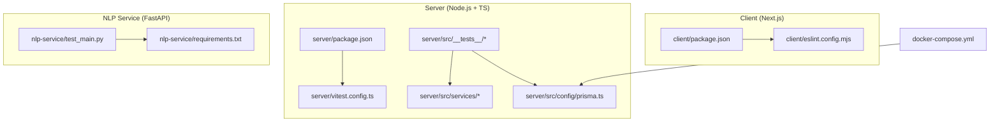
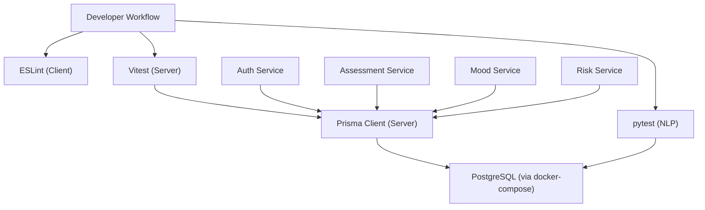
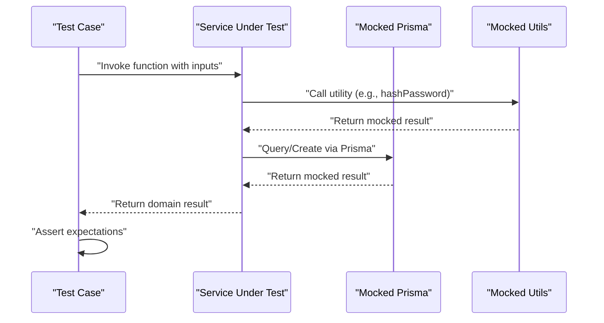
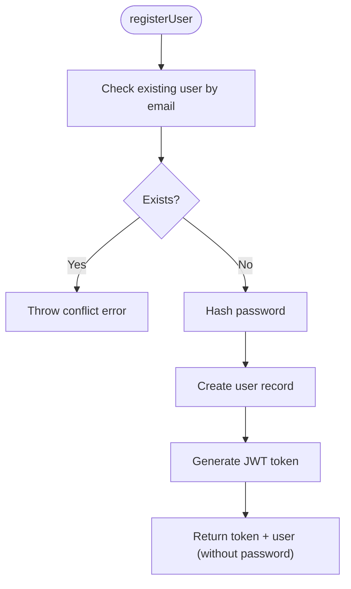
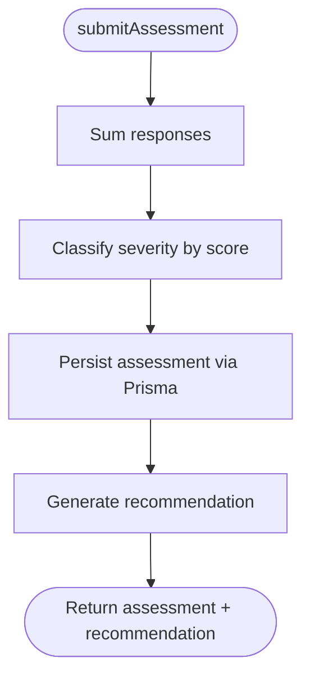
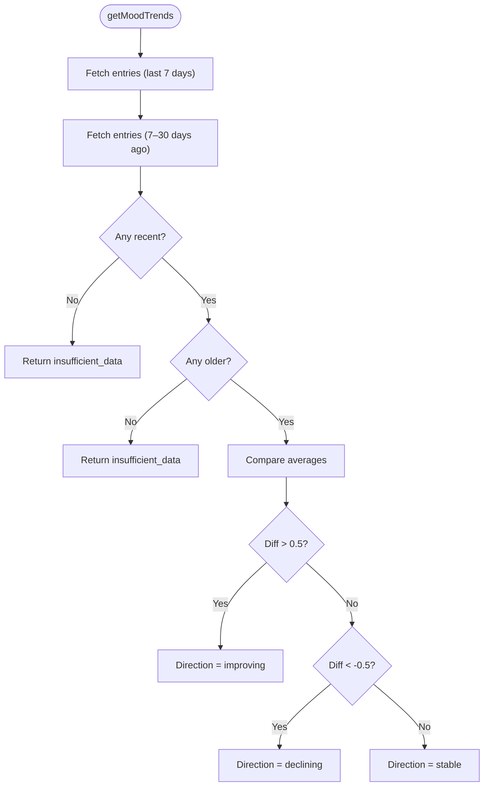
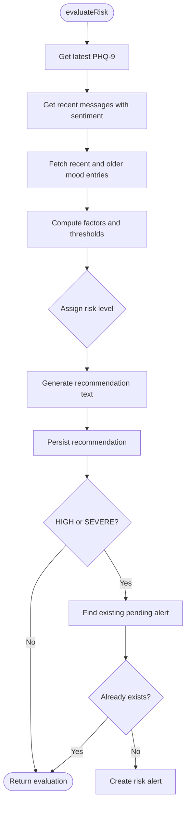
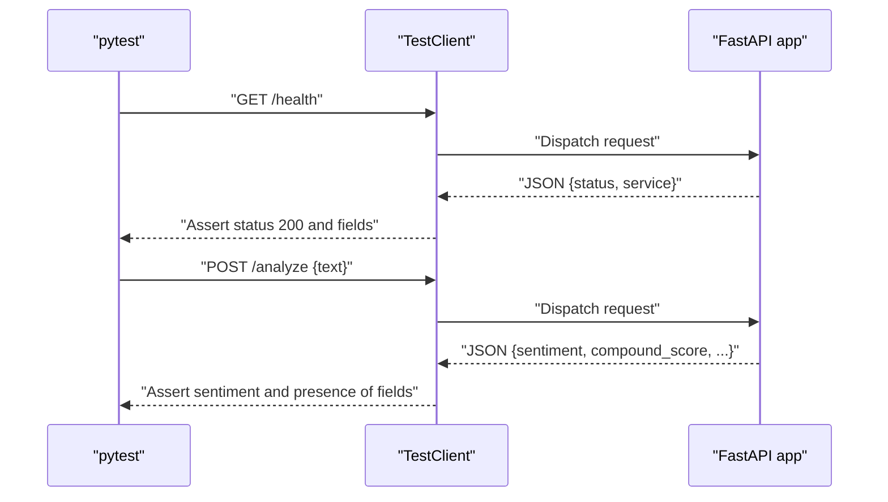
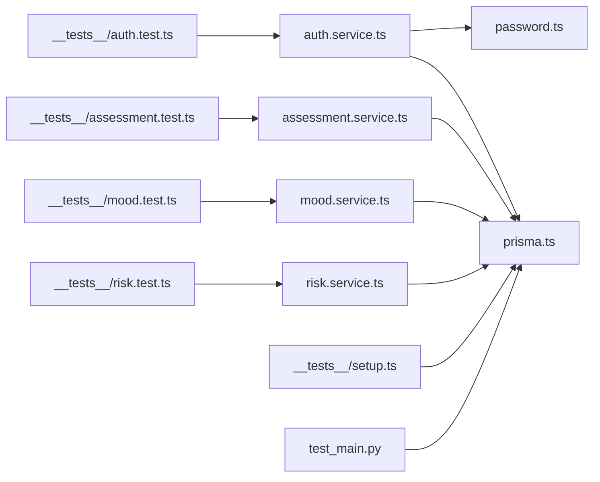

# Quality Assurance

<cite>
**Referenced Files in This Document**
- [client/package.json](file://client/package.json)
- [client/eslint.config.mjs](file://client/eslint.config.mjs)
- [server/package.json](file://server/package.json)
- [server/vitest.config.ts](file://server/vitest.config.ts)
- [server/src/__tests__/setup.ts](file://server/src/__tests__/setup.ts)
- [server/src/__tests__/assessment.test.ts](file://server/src/__tests__/assessment.test.ts)
- [server/src/__tests__/auth.test.ts](file://server/src/__tests__/auth.test.ts)
- [server/src/__tests__/mood.test.ts](file://server/src/__tests__/mood.test.ts)
- [server/src/__tests__/risk.test.ts](file://server/src/__tests__/risk.test.ts)
- [server/src/services/assessment.service.ts](file://server/src/services/assessment.service.ts)
- [server/src/services/auth.service.ts](file://server/src/services/auth.service.ts)
- [server/src/services/mood.service.ts](file://server/src/services/mood.service.ts)
- [server/src/services/risk.service.ts](file://server/src/services/risk.service.ts)
- [server/src/config/prisma.ts](file://server/src/config/prisma.ts)
- [server/src/utils/password.ts](file://server/src/utils/password.ts)
- [nlp-service/requirements.txt](file://nlp-service/requirements.txt)
- [nlp-service/test_main.py](file://nlp-service/test_main.py)
- [docker-compose.yml](file://docker-compose.yml)
</cite>

## Table of Contents
1. [Introduction](#introduction)
2. [Project Structure](#project-structure)
3. [Core Components](#core-components)
4. [Architecture Overview](#architecture-overview)
5. [Detailed Component Analysis](#detailed-component-analysis)
6. [Dependency Analysis](#dependency-analysis)
7. [Performance Considerations](#performance-considerations)
8. [Troubleshooting Guide](#troubleshooting-guide)
9. [Conclusion](#conclusion)
10. [Appendices](#appendices)

## Introduction
This document defines the quality assurance framework for the project, focusing on testing quality, validation processes, and continuous integration practices. It covers test configuration management, environment setup, automated testing pipelines, code quality standards, static analysis integration, automated quality gates, performance and load testing strategies, security testing approaches, and operational practices for debugging, logging, and issue tracking. The goal is to ensure reliable, maintainable, and secure delivery of features across the frontend, backend, and NLP microservice.

## Project Structure
The repository is organized into three primary areas:
- Frontend (Next.js) under client/
- Backend (Node.js + TypeScript) under server/
- NLP microservice (FastAPI) under nlp-service/

Key QA-relevant artifacts:
- Client linting via ESLint configuration
- Server unit tests using Vitest with mocked Prisma client
- NLP service tests using pytest with FastAPI TestClient
- Shared database orchestrated via Docker Compose for local and CI environments

**Diagram sources**
- [client/package.json:1-27](file://client/package.json#L1-L27)
- [client/eslint.config.mjs:1-19](file://client/eslint.config.mjs#L1-L19)
- [server/package.json:1-36](file://server/package.json#L1-L36)
- [server/vitest.config.ts:1-10](file://server/vitest.config.ts#L1-L10)
- [server/src/__tests__/assessment.test.ts:1-156](file://server/src/__tests__/assessment.test.ts#L1-L156)
- [server/src/services/assessment.service.ts:1-89](file://server/src/services/assessment.service.ts#L1-L89)
- [server/src/config/prisma.ts:1-6](file://server/src/config/prisma.ts#L1-L6)
- [nlp-service/requirements.txt:1-6](file://nlp-service/requirements.txt#L1-L6)
- [nlp-service/test_main.py:1-56](file://nlp-service/test_main.py#L1-L56)
- [docker-compose.yml:1-19](file://docker-compose.yml#L1-L19)

**Section sources**
- [client/package.json:1-27](file://client/package.json#L1-L27)
- [client/eslint.config.mjs:1-19](file://client/eslint.config.mjs#L1-L19)
- [server/package.json:1-36](file://server/package.json#L1-L36)
- [server/vitest.config.ts:1-10](file://server/vitest.config.ts#L1-L10)
- [nlp-service/requirements.txt:1-6](file://nlp-service/requirements.txt#L1-L6)
- [nlp-service/test_main.py:1-56](file://nlp-service/test_main.py#L1-L56)
- [docker-compose.yml:1-19](file://docker-compose.yml#L1-L19)

## Core Components
- Testing frameworks and scripts:
  - Server: Vitest for unit tests with Node environment and global APIs enabled
  - Client: ESLint for linting
  - NLP service: pytest with FastAPI TestClient
- Mocking strategy:
  - Vitest mocks for Prisma client and utility modules to isolate units
- Static analysis:
  - ESLint configuration aligned with Next.js core-web-vitals and TypeScript rules
- Environment orchestration:
  - Docker Compose for PostgreSQL database provisioning

Quality gates and coverage expectations:
- Unit tests must validate business logic correctness, boundary conditions, and error paths
- Mocks must simulate database and external dependencies to ensure deterministic outcomes
- Linting must pass with configured rules to enforce code quality and consistency
- Tests should be executable locally and in CI environments using provided scripts

**Section sources**
- [server/package.json:6-12](file://server/package.json#L6-L12)
- [server/vitest.config.ts:3-8](file://server/vitest.config.ts#L3-L8)
- [client/eslint.config.mjs:1-19](file://client/eslint.config.mjs#L1-L19)
- [server/src/__tests__/setup.ts:1-47](file://server/src/__tests__/setup.ts#L1-L47)
- [docker-compose.yml:1-19](file://docker-compose.yml#L1-L19)

## Architecture Overview
The QA architecture integrates development-time checks with runtime validation across services.

**Diagram sources**
- [client/eslint.config.mjs:1-19](file://client/eslint.config.mjs#L1-L19)
- [server/package.json:6-12](file://server/package.json#L6-L12)
- [server/src/config/prisma.ts:1-6](file://server/src/config/prisma.ts#L1-L6)
- [server/src/services/auth.service.ts:1-72](file://server/src/services/auth.service.ts#L1-L72)
- [server/src/services/assessment.service.ts:1-89](file://server/src/services/assessment.service.ts#L1-L89)
- [server/src/services/mood.service.ts:1-58](file://server/src/services/mood.service.ts#L1-L58)
- [server/src/services/risk.service.ts:1-138](file://server/src/services/risk.service.ts#L1-L138)
- [nlp-service/test_main.py:1-56](file://nlp-service/test_main.py#L1-L56)
- [docker-compose.yml:1-19](file://docker-compose.yml#L1-L19)

## Detailed Component Analysis

### Server Unit Testing with Vitest
- Test configuration:
  - Global APIs enabled, Node environment, and a 10-second timeout to accommodate database operations
- Mocking strategy:
  - Centralized Prisma mocking via a setup module and per-test mocks for utilities (password hashing, JWT generation)
- Coverage focus:
  - Authentication service: registration and login flows, password hashing, token generation, and error handling
  - Assessment service: scoring logic, severity classification, and recommendation generation
  - Mood service: entry creation and trend analysis with boundary conditions
  - Risk service: composite risk evaluation combining PHQ-9, sentiment, and mood trends, plus alert creation and deduplication

**Diagram sources**
- [server/src/__tests__/auth.test.ts:1-133](file://server/src/__tests__/auth.test.ts#L1-L133)
- [server/src/__tests__/assessment.test.ts:1-156](file://server/src/__tests__/assessment.test.ts#L1-L156)
- [server/src/__tests__/mood.test.ts:1-134](file://server/src/__tests__/mood.test.ts#L1-L134)
- [server/src/__tests__/risk.test.ts:1-192](file://server/src/__tests__/risk.test.ts#L1-L192)
- [server/src/__tests__/setup.ts:1-47](file://server/src/__tests__/setup.ts#L1-L47)
- [server/src/utils/password.ts:1-12](file://server/src/utils/password.ts#L1-L12)
- [server/src/config/prisma.ts:1-6](file://server/src/config/prisma.ts#L1-L6)

**Section sources**
- [server/vitest.config.ts:1-10](file://server/vitest.config.ts#L1-L10)
- [server/src/__tests__/setup.ts:1-47](file://server/src/__tests__/setup.ts#L1-L47)
- [server/src/__tests__/auth.test.ts:1-133](file://server/src/__tests__/auth.test.ts#L1-L133)
- [server/src/__tests__/assessment.test.ts:1-156](file://server/src/__tests__/assessment.test.ts#L1-L156)
- [server/src/__tests__/mood.test.ts:1-134](file://server/src/__tests__/mood.test.ts#L1-L134)
- [server/src/__tests__/risk.test.ts:1-192](file://server/src/__tests__/risk.test.ts#L1-L192)

### Authentication Service Validation
- Tests cover:
  - Successful registration with password hashing and token generation
  - Duplicate email detection and appropriate error propagation
  - Login validation with correct and incorrect credentials
  - Password comparison behavior and masked password in responses
- Mocked dependencies ensure isolation and deterministic assertions

**Diagram sources**
- [server/src/__tests__/auth.test.ts:36-85](file://server/src/__tests__/auth.test.ts#L36-L85)
- [server/src/services/auth.service.ts:5-33](file://server/src/services/auth.service.ts#L5-L33)
- [server/src/utils/password.ts:1-12](file://server/src/utils/password.ts#L1-L12)

**Section sources**
- [server/src/__tests__/auth.test.ts:1-133](file://server/src/__tests__/auth.test.ts#L1-L133)
- [server/src/services/auth.service.ts:1-72](file://server/src/services/auth.service.ts#L1-L72)
- [server/src/utils/password.ts:1-12](file://server/src/utils/password.ts#L1-L12)

### Assessment Service Validation
- Tests cover:
  - Total score calculation from responses
  - Severity classification boundaries (MINIMAL, MILD, MODERATE, MODERATELY_SEVERE, SEVERE)
  - Recommendation generation based on severity level
- Mocked Prisma ensures deterministic behavior without database overhead

**Diagram sources**
- [server/src/__tests__/assessment.test.ts:24-154](file://server/src/__tests__/assessment.test.ts#L24-L154)
- [server/src/services/assessment.service.ts:20-89](file://server/src/services/assessment.service.ts#L20-L89)

**Section sources**
- [server/src/__tests__/assessment.test.ts:1-156](file://server/src/__tests__/assessment.test.ts#L1-L156)
- [server/src/services/assessment.service.ts:1-89](file://server/src/services/assessment.service.ts#L1-L89)

### Mood Service Validation
- Tests cover:
  - Creating mood entries with and without optional notes
  - Trend analysis with boundary conditions for insufficient data, improving, declining, and stable trends
- Mocked Prisma enables precise control over recent vs older datasets

**Diagram sources**
- [server/src/__tests__/mood.test.ts:54-132](file://server/src/__tests__/mood.test.ts#L54-L132)
- [server/src/services/mood.service.ts:22-58](file://server/src/services/mood.service.ts#L22-L58)

**Section sources**
- [server/src/__tests__/mood.test.ts:1-134](file://server/src/__tests__/mood.test.ts#L1-L134)
- [server/src/services/mood.service.ts:1-58](file://server/src/services/mood.service.ts#L1-L58)

### Risk Service Validation
- Tests cover:
  - Composite risk evaluation using PHQ-9 score, recent negative sentiment ratio, and mood trend
  - Recommendation text generation and persistence
  - Risk alert creation with de-duplication against existing pending alerts
- Mocked Prisma and helper modules enable controlled scenarios across boundary conditions

**Diagram sources**
- [server/src/__tests__/risk.test.ts:68-190](file://server/src/__tests__/risk.test.ts#L68-L190)
- [server/src/services/risk.service.ts:11-107](file://server/src/services/risk.service.ts#L11-L107)

**Section sources**
- [server/src/__tests__/risk.test.ts:1-192](file://server/src/__tests__/risk.test.ts#L1-L192)
- [server/src/services/risk.service.ts:1-138](file://server/src/services/risk.service.ts#L1-L138)

### NLP Service Testing with pytest
- Tests cover:
  - Health endpoint validation
  - Sentiment analysis endpoint for positive, negative, neutral, empty text, missing field, and response completeness
- Uses FastAPI TestClient to send requests and assert JSON responses

**Diagram sources**
- [nlp-service/test_main.py:8-56](file://nlp-service/test_main.py#L8-L56)

**Section sources**
- [nlp-service/test_main.py:1-56](file://nlp-service/test_main.py#L1-L56)
- [nlp-service/requirements.txt:1-6](file://nlp-service/requirements.txt#L1-L6)

## Dependency Analysis
- Internal dependencies:
  - Services depend on Prisma client for data access
  - Authentication service depends on password utilities for hashing and verification
- External dependencies:
  - Server: Express, Prisma, bcrypt, JWT, Vitest, Supertest
  - Client: Next.js, React, ESLint, TailwindCSS
  - NLP: FastAPI, Uvicorn, NLTK, Pydantic, python-dotenv
- Orchestration:
  - Docker Compose provisions PostgreSQL for local and CI databases

**Diagram sources**
- [server/src/services/auth.service.ts:1-72](file://server/src/services/auth.service.ts#L1-L72)
- [server/src/utils/password.ts:1-12](file://server/src/utils/password.ts#L1-L12)
- [server/src/services/assessment.service.ts:1-89](file://server/src/services/assessment.service.ts#L1-L89)
- [server/src/services/mood.service.ts:1-58](file://server/src/services/mood.service.ts#L1-L58)
- [server/src/services/risk.service.ts:1-138](file://server/src/services/risk.service.ts#L1-L138)
- [server/src/__tests__/setup.ts:1-47](file://server/src/__tests__/setup.ts#L1-L47)
- [server/src/__tests__/auth.test.ts:1-133](file://server/src/__tests__/auth.test.ts#L1-L133)
- [server/src/__tests__/assessment.test.ts:1-156](file://server/src/__tests__/assessment.test.ts#L1-L156)
- [server/src/__tests__/mood.test.ts:1-134](file://server/src/__tests__/mood.test.ts#L1-L134)
- [server/src/__tests__/risk.test.ts:1-192](file://server/src/__tests__/risk.test.ts#L1-L192)
- [nlp-service/test_main.py:1-56](file://nlp-service/test_main.py#L1-L56)

**Section sources**
- [server/src/services/auth.service.ts:1-72](file://server/src/services/auth.service.ts#L1-L72)
- [server/src/utils/password.ts:1-12](file://server/src/utils/password.ts#L1-L12)
- [server/src/services/assessment.service.ts:1-89](file://server/src/services/assessment.service.ts#L1-L89)
- [server/src/services/mood.service.ts:1-58](file://server/src/services/mood.service.ts#L1-L58)
- [server/src/services/risk.service.ts:1-138](file://server/src/services/risk.service.ts#L1-L138)
- [server/src/__tests__/setup.ts:1-47](file://server/src/__tests__/setup.ts#L1-L47)
- [nlp-service/test_main.py:1-56](file://nlp-service/test_main.py#L1-L56)

## Performance Considerations
- Unit test execution:
  - Use Vitest’s watch mode during development to iterate quickly
  - Keep mocks minimal and targeted to avoid flaky tests and long runs
- Database interactions:
  - Prefer mocking Prisma in unit tests; integrate integration tests sparingly and only when necessary
- Scalability validation:
  - Load tests should target API endpoints after implementing rate limiting and circuit breakers
  - Use synthetic traffic tools to validate throughput and latency under load
- Observability:
  - Add structured logging around critical paths (authentication, assessments, risk evaluations)
  - Instrument endpoints with metrics for latency, error rates, and throughput

[No sources needed since this section provides general guidance]

## Troubleshooting Guide
- Common issues and resolutions:
  - Tests failing due to unmocked Prisma methods: ensure mocks are applied in setup or per-test
  - Authentication failures: verify password hashing and token generation mocks align with service expectations
  - Risk evaluation inconsistencies: confirm PHQ-9 thresholds, sentiment ratios, and mood window calculations
  - NLP endpoint errors: validate input payload shape and required fields
- Debugging techniques:
  - Use console logs in test setup to inspect mock invocations and return values
  - Temporarily disable mocks to reproduce real-world behavior when diagnosing integration issues
- Logging strategies:
  - Log request IDs, user IDs, and operation names in services for traceability
  - Capture exceptions with stack traces and include contextual metadata
- Issue tracking:
  - Use GitHub Issues to categorize bugs by service and severity
  - Link commits to issues using keywords in commit messages

[No sources needed since this section provides general guidance]

## Conclusion
The project employs a robust QA foundation with unit tests for backend services, linting for the frontend, and pytest-based tests for the NLP microservice. By leveraging mocks, centralized configuration, and Docker-based environments, the team can maintain high confidence in code changes while ensuring consistent quality gates across development and CI. Extending coverage to integration and performance testing, alongside static analysis and security scanning, will further strengthen the overall quality assurance program.

[No sources needed since this section summarizes without analyzing specific files]

## Appendices

### Test Configuration Management
- Server
  - Scripts: run tests, watch mode
  - Vitest configuration: globals, Node environment, timeouts
  - Setup: centralized Prisma and utility mocks
- Client
  - Scripts: dev, build, start, lint
  - ESLint configuration: Next.js core-web-vitals and TypeScript rules
- NLP Service
  - Requirements: FastAPI, Uvicorn, NLTK, Pydantic, python-dotenv
  - Tests: health and analyze endpoints with assertion patterns

**Section sources**
- [server/package.json:6-12](file://server/package.json#L6-L12)
- [server/vitest.config.ts:1-10](file://server/vitest.config.ts#L1-L10)
- [server/src/__tests__/setup.ts:1-47](file://server/src/__tests__/setup.ts#L1-L47)
- [client/package.json:5-10](file://client/package.json#L5-L10)
- [client/eslint.config.mjs:1-19](file://client/eslint.config.mjs#L1-L19)
- [nlp-service/requirements.txt:1-6](file://nlp-service/requirements.txt#L1-L6)
- [nlp-service/test_main.py:1-56](file://nlp-service/test_main.py#L1-L56)

### Continuous Integration Practices
- Recommended pipeline stages:
  - Lint: run ESLint on client
  - Build: compile TypeScript for server
  - Test: execute Vitest and pytest suites
  - Security: static analysis for secrets and vulnerabilities
  - Integration: spin up Postgres via Docker Compose and run integration tests
  - Report: publish test results and coverage summaries
- Environment setup:
  - Use docker-compose to provision a dedicated test database
  - Configure environment variables for services consistently across local and CI

**Section sources**
- [docker-compose.yml:1-19](file://docker-compose.yml#L1-L19)
- [client/eslint.config.mjs:1-19](file://client/eslint.config.mjs#L1-L19)
- [server/package.json:6-12](file://server/package.json#L6-L12)
- [nlp-service/test_main.py:1-56](file://nlp-service/test_main.py#L1-L56)

### Automated Quality Gates
- Gate criteria:
  - All lint checks must pass
  - Unit tests must execute successfully with defined timeouts
  - Coverage thresholds: establish minimums for critical services (authentication, assessment, risk)
  - Security scans: SAST and secret detection on pull requests
- Reporting:
  - Publish test reports and coverage to CI artifacts
  - Fail builds on test failures or coverage below threshold

[No sources needed since this section provides general guidance]

### Performance Testing Strategies
- Unit and integration tests:
  - Validate business logic correctness under varying loads
- Load testing:
  - Use tools to simulate concurrent users and measure response times
  - Focus on authentication, assessment submission, and risk evaluation endpoints
- Scalability validation:
  - Monitor database connections and Prisma client behavior under load
  - Introduce caching and pagination where appropriate

[No sources needed since this section provides general guidance]

### Security Testing Approaches
- Static analysis:
  - Run SAST tools to detect vulnerabilities and insecure configurations
- Penetration testing:
  - Perform authorized penetration tests targeting exposed endpoints
  - Validate authentication, authorization, and input sanitization
- Secrets management:
  - Scan for hardcoded secrets and ensure environment variable usage

[No sources needed since this section provides general guidance]

### Test Maintenance and Documentation Standards
- Refactoring strategies:
  - Keep tests close to the code they validate; refactor shared mocks into setup modules
  - Replace brittle assertions with meaningful ones that reflect business outcomes
- Documentation:
  - Maintain a README for testing that outlines environment setup, scripts, and contribution guidelines
  - Document test naming conventions and folder structure

[No sources needed since this section provides general guidance]

### Best Practices for Test Automation, Parallel Execution, and Reporting
- Parallel execution:
  - Run independent test suites in parallel (client lint, server unit, NLP tests)
  - Isolate database-dependent tests and run them serially or in dedicated jobs
- Reporting:
  - Publish JUnit-style reports for CI consumption
  - Track flaky tests and investigate regressions promptly

[No sources needed since this section provides general guidance]