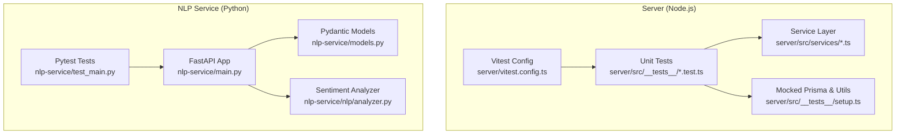
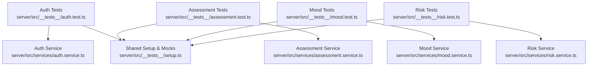
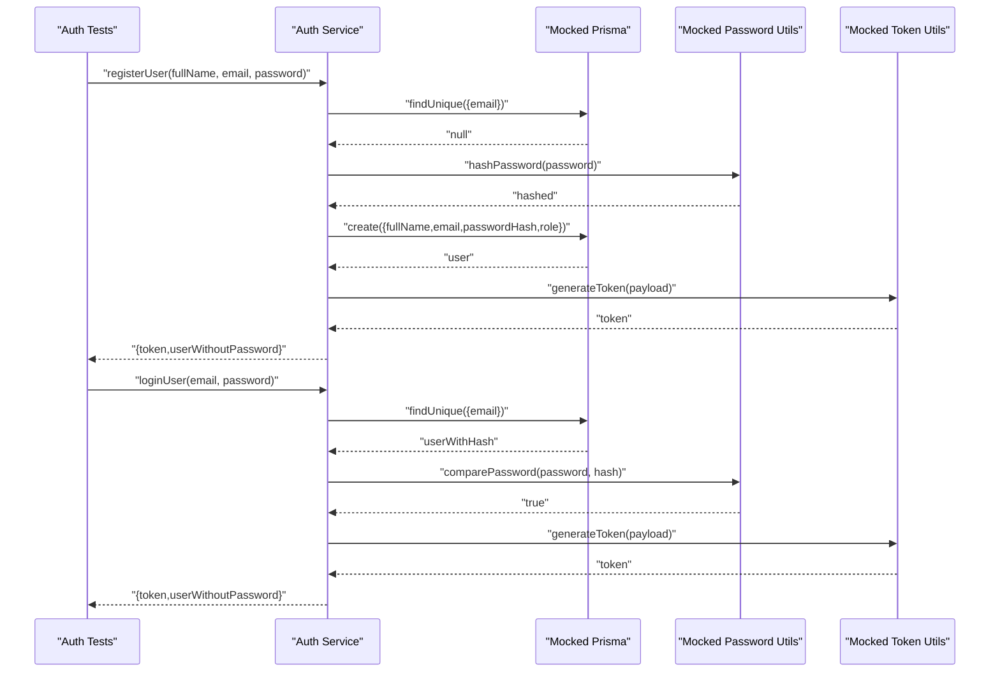
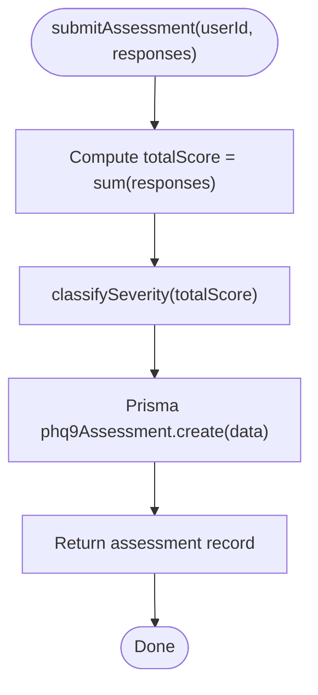
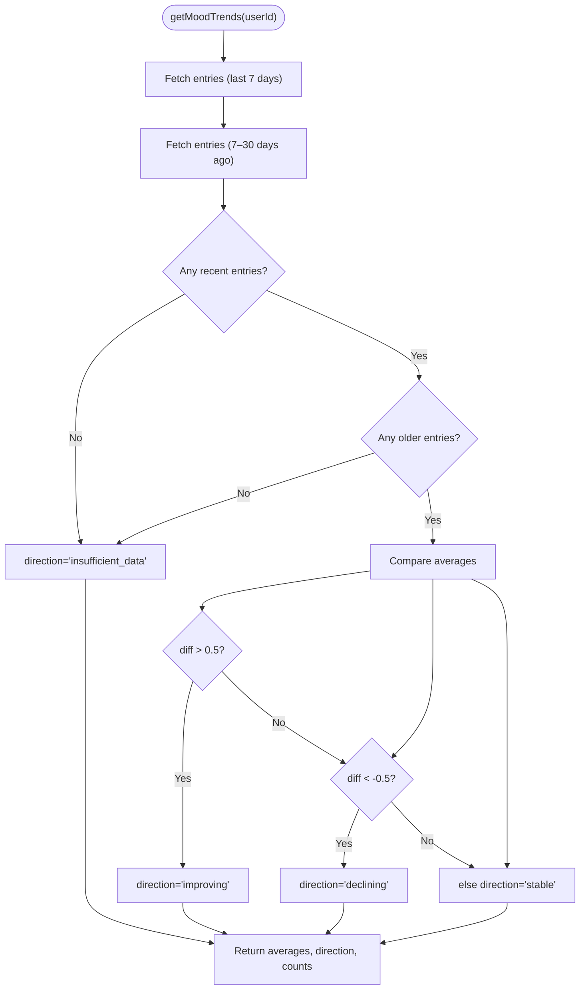
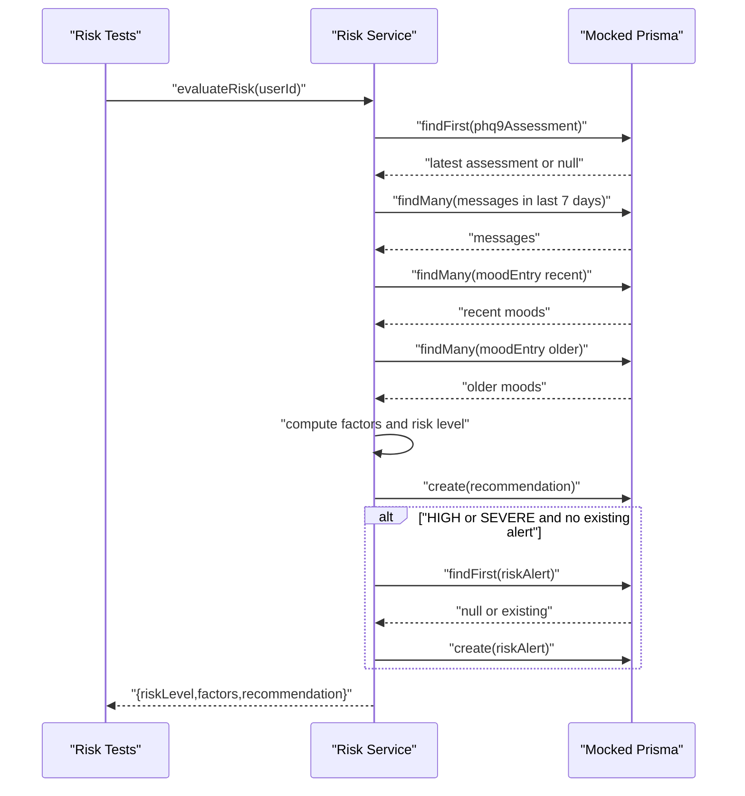
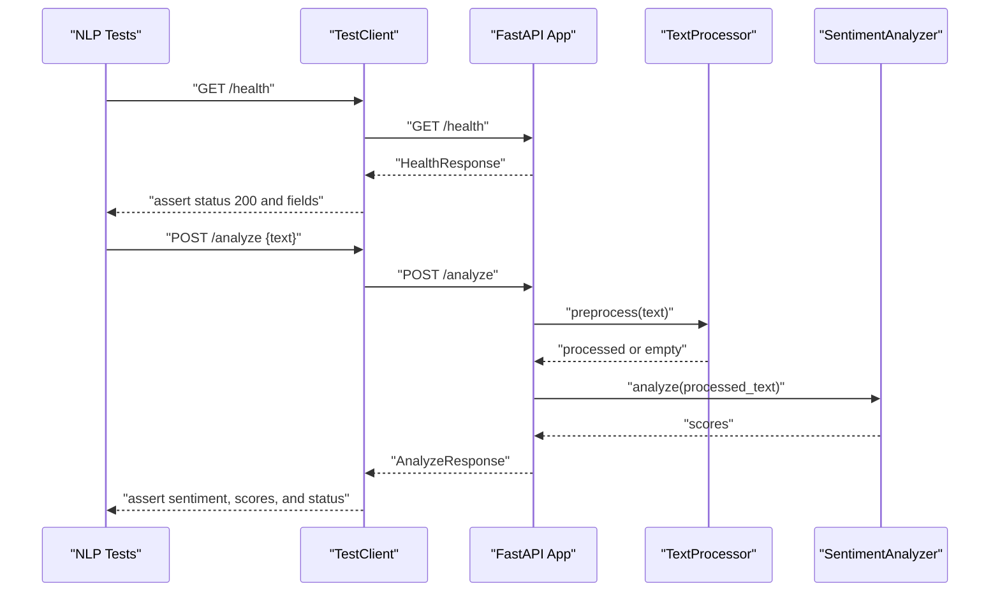
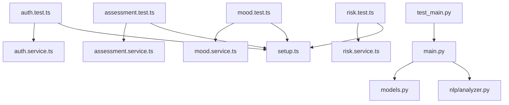

# Testing Strategy

<cite>
**Referenced Files in This Document**
- [vitest.config.ts](file://server/vitest.config.ts)
- [package.json](file://server/package.json)
- [setup.ts](file://server/src/__tests__/setup.ts)
- [auth.test.ts](file://server/src/__tests__/auth.test.ts)
- [assessment.test.ts](file://server/src/__tests__/assessment.test.ts)
- [mood.test.ts](file://server/src/__tests__/mood.test.ts)
- [risk.test.ts](file://server/src/__tests__/risk.test.ts)
- [auth.service.ts](file://server/src/services/auth.service.ts)
- [assessment.service.ts](file://server/src/services/assessment.service.ts)
- [mood.service.ts](file://server/src/services/mood.service.ts)
- [risk.service.ts](file://server/src/services/risk.service.ts)
- [test_main.py](file://nlp-service/test_main.py)
- [main.py](file://nlp-service/main.py)
- [models.py](file://nlp-service/models.py)
- [analyzer.py](file://nlp-service/nlp/analyzer.py)
- [requirements.txt](file://nlp-service/requirements.txt)
</cite>

## Table of Contents
1. [Introduction](#introduction)
2. [Project Structure](#project-structure)
3. [Core Components](#core-components)
4. [Architecture Overview](#architecture-overview)
5. [Detailed Component Analysis](#detailed-component-analysis)
6. [Dependency Analysis](#dependency-analysis)
7. [Performance Considerations](#performance-considerations)
8. [Troubleshooting Guide](#troubleshooting-guide)
9. [Conclusion](#conclusion)
10. [Appendices](#appendices)

## Introduction
This document outlines a comprehensive testing strategy for the BuddyAI project, covering unit tests, integration tests, and API validation across both the Node.js backend and the Python NLP service. It explains the testing frameworks, test organization, authentication and API validation strategies, NLP service testing procedures, test data management, mock implementations, database cleanup strategies, CI workflow expectations, coverage requirements, and quality assurance processes. Practical examples of test implementation, assertion patterns, and debugging techniques are included, along with guidance for performance, load, and security testing, and best practices for maintainable tests and test-driven development.

## Project Structure
The testing strategy spans two primary services:
- Node.js backend (server): Unit and integration tests using Vitest, organized under server/src/__tests__.
- Python NLP service: API tests using pytest with FastAPI TestClient, located under nlp-service.

Key characteristics:
- Vitest configuration sets global test environment and timeouts.
- Backend tests mock Prisma client and utility modules to isolate service logic.
- NLP service tests validate health and sentiment analysis endpoints with realistic assertions.
- Both services rely on minimal external dependencies for testing.

**Diagram sources**
- [vitest.config.ts:1-10](file://server/vitest.config.ts#L1-L10)
- [setup.ts:1-47](file://server/src/__tests__/setup.ts#L1-L47)
- [auth.test.ts:1-133](file://server/src/__tests__/auth.test.ts#L1-L133)
- [assessment.test.ts:1-156](file://server/src/__tests__/assessment.test.ts#L1-L156)
- [mood.test.ts:1-134](file://server/src/__tests__/mood.test.ts#L1-L134)
- [risk.test.ts:1-192](file://server/src/__tests__/risk.test.ts#L1-L192)
- [test_main.py:1-56](file://nlp-service/test_main.py#L1-L56)
- [main.py:1-71](file://nlp-service/main.py#L1-L71)
- [models.py:1-26](file://nlp-service/models.py#L1-L26)
- [analyzer.py:1-27](file://nlp-service/nlp/analyzer.py#L1-L27)

**Section sources**
- [vitest.config.ts:1-10](file://server/vitest.config.ts#L1-L10)
- [package.json:1-36](file://server/package.json#L1-L36)
- [setup.ts:1-47](file://server/src/__tests__/setup.ts#L1-L47)
- [test_main.py:1-56](file://nlp-service/test_main.py#L1-L56)

## Core Components
This section documents the testing components and their roles:

- Vitest configuration and scripts:
  - Global test environment configured for Node.js.
  - Scripts for running and watching tests.
- Backend test suite organization:
  - Controller tests are grouped by feature area (authentication, assessments, mood, risk).
  - Shared mocks centralized in setup.ts to avoid duplication.
- Service layer tests:
  - Isolated unit tests for business logic with mocked Prisma and utility modules.
  - Assertions validate return values, side effects, and error conditions.
- NLP service tests:
  - Health check endpoint validation.
  - Sentiment analysis endpoint with positive, negative, neutral, and validation scenarios.
  - Response shape and status code assertions.

**Section sources**
- [vitest.config.ts:1-10](file://server/vitest.config.ts#L1-L10)
- [package.json:6-12](file://server/package.json#L6-L12)
- [setup.ts:1-47](file://server/src/__tests__/setup.ts#L1-L47)
- [auth.test.ts:1-133](file://server/src/__tests__/auth.test.ts#L1-L133)
- [assessment.test.ts:1-156](file://server/src/__tests__/assessment.test.ts#L1-L156)
- [mood.test.ts:1-134](file://server/src/__tests__/mood.test.ts#L1-L134)
- [risk.test.ts:1-192](file://server/src/__tests__/risk.test.ts#L1-L192)
- [test_main.py:1-56](file://nlp-service/test_main.py#L1-L56)

## Architecture Overview
The testing architecture separates concerns across layers and services:

- Backend (Node.js):
  - Services encapsulate business logic and interact with Prisma client.
  - Tests mock Prisma and utilities to validate service behavior in isolation.
- NLP Service (Python):
  - FastAPI app exposes health and analyze endpoints.
  - Pydantic models enforce request/response validation.
  - Tests use TestClient to validate HTTP-level behavior.

**Diagram sources**
- [auth.test.ts:1-133](file://server/src/__tests__/auth.test.ts#L1-L133)
- [assessment.test.ts:1-156](file://server/src/__tests__/assessment.test.ts#L1-L156)
- [mood.test.ts:1-134](file://server/src/__tests__/mood.test.ts#L1-L134)
- [risk.test.ts:1-192](file://server/src/__tests__/risk.test.ts#L1-L192)
- [auth.service.ts:1-72](file://server/src/services/auth.service.ts#L1-L72)
- [assessment.service.ts:1-89](file://server/src/services/assessment.service.ts#L1-L89)
- [mood.service.ts:1-58](file://server/src/services/mood.service.ts#L1-L58)
- [risk.service.ts:1-138](file://server/src/services/risk.service.ts#L1-L138)
- [setup.ts:1-47](file://server/src/__tests__/setup.ts#L1-L47)

## Detailed Component Analysis

### Authentication Testing Strategy
Authentication tests validate registration and login flows, password hashing, credential comparison, and JWT token generation. The tests mock Prisma user operations, password utilities, and token generation to isolate service logic.

Key patterns:
- Mock Prisma user queries and creates.
- Mock password hashing and comparison utilities.
- Mock JWT token generation.
- Assert returned tokens and user objects exclude sensitive fields.
- Assert thrown errors for invalid credentials and duplicate emails.

**Diagram sources**
- [auth.test.ts:1-133](file://server/src/__tests__/auth.test.ts#L1-L133)
- [auth.service.ts:1-72](file://server/src/services/auth.service.ts#L1-L72)

**Section sources**
- [auth.test.ts:1-133](file://server/src/__tests__/auth.test.ts#L1-L133)
- [auth.service.ts:1-72](file://server/src/services/auth.service.ts#L1-L72)

### Assessment Service Testing
Assessment tests validate PHQ-9 scoring and severity classification boundaries. Tests mock Prisma assessment creation and assert correct severity levels and totals across boundary conditions.

Key patterns:
- Mock Prisma assessment creation.
- Provide arrays of 0–3 scores per question to compute totals.
- Assert severity classifications for MINIMAL, MILD, MODERATE, MODERATELY_SEVERE, and SEVERE ranges.
- Boundary checks ensure edge cases are covered.

**Diagram sources**
- [assessment.test.ts:1-156](file://server/src/__tests__/assessment.test.ts#L1-L156)
- [assessment.service.ts:1-89](file://server/src/services/assessment.service.ts#L1-L89)

**Section sources**
- [assessment.test.ts:1-156](file://server/src/__tests__/assessment.test.ts#L1-L156)
- [assessment.service.ts:1-89](file://server/src/services/assessment.service.ts#L1-L89)

### Mood Service Testing
Mood tests validate creating entries and computing trends. Trend analysis compares recent vs older averages and classifies direction as improving, declining, stable, or insufficient data.

Key patterns:
- Mock Prisma moodEntry create and findMany.
- Provide recent and older mood datasets.
- Assert computed averages, direction, and total entries.
- Validate behavior when datasets are missing.

**Diagram sources**
- [mood.test.ts:1-134](file://server/src/__tests__/mood.test.ts#L1-L134)
- [mood.service.ts:1-58](file://server/src/services/mood.service.ts#L1-L58)

**Section sources**
- [mood.test.ts:1-134](file://server/src/__tests__/mood.test.ts#L1-L134)
- [mood.service.ts:1-58](file://server/src/services/mood.service.ts#L1-L58)

### Risk Service Testing
Risk tests validate multi-factor risk evaluation combining PHQ-9 scores, recent negative sentiment ratio, and mood trends. Tests mock Prisma reads and writes for assessments, messages, moods, recommendations, and risk alerts.

Key patterns:
- Centralized helper to configure mocks for PHQ score, messages, recent/older moods, and existing alert.
- Assert risk level assignments and factor inclusion.
- Assert recommendation text generation and alert creation only for HIGH/SEVERE when no duplicate exists.

**Diagram sources**
- [risk.test.ts:1-192](file://server/src/__tests__/risk.test.ts#L1-L192)
- [risk.service.ts:1-138](file://server/src/services/risk.service.ts#L1-L138)

**Section sources**
- [risk.test.ts:1-192](file://server/src/__tests__/risk.test.ts#L1-L192)
- [risk.service.ts:1-138](file://server/src/services/risk.service.ts#L1-L138)

### NLP Service Testing Procedures
NLP service tests validate:
- Health endpoint returns expected status and service fields.
- Analyze endpoint returns sentiment classification, compound score, and distribution scores.
- Validation ensures empty or missing text triggers appropriate HTTP validation errors.

Key patterns:
- Use FastAPI TestClient to send requests to /health and /analyze.
- Assert status codes and JSON shapes.
- Validate Pydantic model constraints for request payload.

**Diagram sources**
- [test_main.py:1-56](file://nlp-service/test_main.py#L1-L56)
- [main.py:1-71](file://nlp-service/main.py#L1-L71)
- [models.py:1-26](file://nlp-service/models.py#L1-L26)
- [analyzer.py:1-27](file://nlp-service/nlp/analyzer.py#L1-L27)

**Section sources**
- [test_main.py:1-56](file://nlp-service/test_main.py#L1-L56)
- [main.py:1-71](file://nlp-service/main.py#L1-L71)
- [models.py:1-26](file://nlp-service/models.py#L1-L26)
- [analyzer.py:1-27](file://nlp-service/nlp/analyzer.py#L1-L27)

## Dependency Analysis
Testing dependencies and coupling:
- Backend tests depend on service modules and shared mocks.
- Service modules depend on Prisma client and utility modules (password hashing, token generation).
- NLP service tests depend on FastAPI app, Pydantic models, and analyzer implementation.
- Mocks centralize Prisma and utility mocking to reduce duplication and improve maintainability.

**Diagram sources**
- [auth.test.ts:1-133](file://server/src/__tests__/auth.test.ts#L1-L133)
- [assessment.test.ts:1-156](file://server/src/__tests__/assessment.test.ts#L1-L156)
- [mood.test.ts:1-134](file://server/src/__tests__/mood.test.ts#L1-L134)
- [risk.test.ts:1-192](file://server/src/__tests__/risk.test.ts#L1-L192)
- [setup.ts:1-47](file://server/src/__tests__/setup.ts#L1-L47)
- [auth.service.ts:1-72](file://server/src/services/auth.service.ts#L1-L72)
- [assessment.service.ts:1-89](file://server/src/services/assessment.service.ts#L1-L89)
- [mood.service.ts:1-58](file://server/src/services/mood.service.ts#L1-L58)
- [risk.service.ts:1-138](file://server/src/services/risk.service.ts#L1-L138)
- [test_main.py:1-56](file://nlp-service/test_main.py#L1-L56)
- [main.py:1-71](file://nlp-service/main.py#L1-L71)
- [models.py:1-26](file://nlp-service/models.py#L1-L26)
- [analyzer.py:1-27](file://nlp-service/nlp/analyzer.py#L1-L27)

**Section sources**
- [setup.ts:1-47](file://server/src/__tests__/setup.ts#L1-L47)
- [auth.service.ts:1-72](file://server/src/services/auth.service.ts#L1-L72)
- [assessment.service.ts:1-89](file://server/src/services/assessment.service.ts#L1-L89)
- [mood.service.ts:1-58](file://server/src/services/mood.service.ts#L1-L58)
- [risk.service.ts:1-138](file://server/src/services/risk.service.ts#L1-L138)
- [main.py:1-71](file://nlp-service/main.py#L1-L71)
- [models.py:1-26](file://nlp-service/models.py#L1-L26)
- [analyzer.py:1-27](file://nlp-service/nlp/analyzer.py#L1-L27)

## Performance Considerations
- Unit tests should remain fast; keep mocks minimal and avoid real network calls.
- For NLP service, consider pre-downloading NLTK resources during CI setup to avoid runtime delays.
- Use Vitest’s built-in concurrency and timeouts judiciously; adjust testTimeout in vitest.config.ts as needed.
- Prefer deterministic mocks over heavy fixtures to reduce flakiness and improve speed.

[No sources needed since this section provides general guidance]

## Troubleshooting Guide
Common issues and resolutions:
- Mocks not applied:
  - Ensure vi.mock calls precede imports in test files or use centralized setup.ts.
  - Clear mocks between tests using beforeEach with vi.clearAllMocks().
- Prisma-related failures:
  - Verify mocked Prisma methods match expected signatures and return types.
  - Confirm Prisma client is mocked at the module level imported by services.
- Assertion failures:
  - Use expect.objectContaining for partial object matching.
  - Use expect.arrayContaining for subset checks on arrays.
- NLP service validation errors:
  - Confirm TestClient target matches app base URL and route paths.
  - Validate Pydantic field validators for empty or whitespace-only text.

**Section sources**
- [setup.ts:1-47](file://server/src/__tests__/setup.ts#L1-L47)
- [auth.test.ts:1-133](file://server/src/__tests__/auth.test.ts#L1-L133)
- [assessment.test.ts:1-156](file://server/src/__tests__/assessment.test.ts#L1-L156)
- [mood.test.ts:1-134](file://server/src/__tests__/mood.test.ts#L1-L134)
- [risk.test.ts:1-192](file://server/src/__tests__/risk.test.ts#L1-L192)
- [test_main.py:1-56](file://nlp-service/test_main.py#L1-L56)

## Conclusion
The testing strategy leverages Vitest for Node.js backend unit tests and pytest for Python NLP service API tests. By centralizing mocks, validating service logic in isolation, and asserting HTTP-level behavior for the NLP service, the approach ensures reliable, maintainable, and fast tests. Extending coverage to integration tests, performance/load tests, and security validations will further strengthen the quality assurance pipeline.

[No sources needed since this section summarizes without analyzing specific files]

## Appendices

### Test Organization and Naming Conventions
- Group tests by feature/service under server/src/__tests__.
- Name test files consistently with .test.ts suffix.
- Use descriptive describe blocks and it() statements aligned with service responsibilities.

**Section sources**
- [auth.test.ts:1-133](file://server/src/__tests__/auth.test.ts#L1-L133)
- [assessment.test.ts:1-156](file://server/src/__tests__/assessment.test.ts#L1-L156)
- [mood.test.ts:1-134](file://server/src/__tests__/mood.test.ts#L1-L134)
- [risk.test.ts:1-192](file://server/src/__tests__/risk.test.ts#L1-L192)
- [test_main.py:1-56](file://nlp-service/test_main.py#L1-L56)

### Continuous Integration Workflow
- Run backend tests via npm test script invoking Vitest.
- Run NLP service tests via pytest in the nlp-service directory.
- Configure CI to install dependencies for both services before running tests.
- Integrate coverage reporting for both services (e.g., Vitest coverage and pytest-cov).

**Section sources**
- [package.json:6-12](file://server/package.json#L6-L12)
- [requirements.txt:1-6](file://nlp-service/requirements.txt#L1-L6)

### Quality Assurance Processes
- Enforce assertion patterns: status codes, JSON shapes, and business rule outcomes.
- Maintain centralized mocks to reduce duplication and improve readability.
- Add integration tests for end-to-end flows when ready.
- Include security checks for authentication, authorization, and input validation.

[No sources needed since this section provides general guidance]