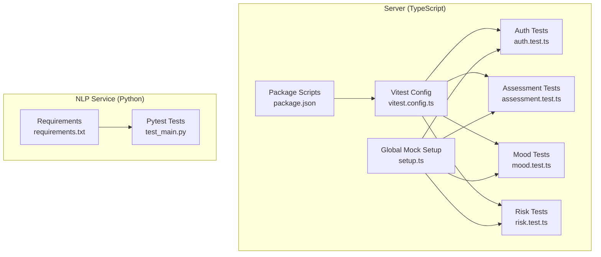
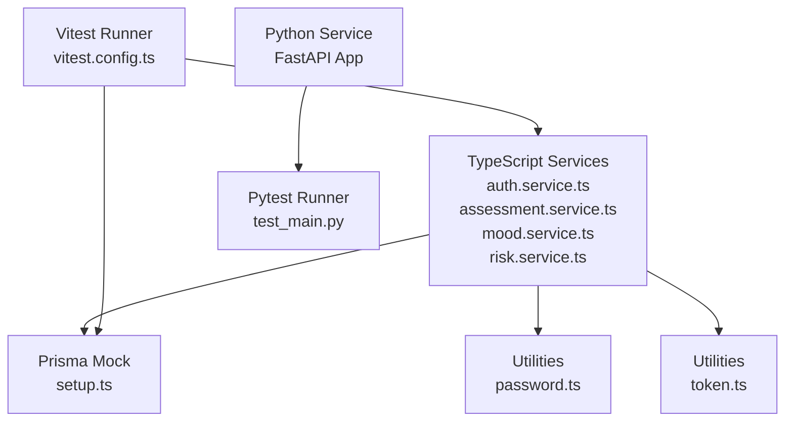
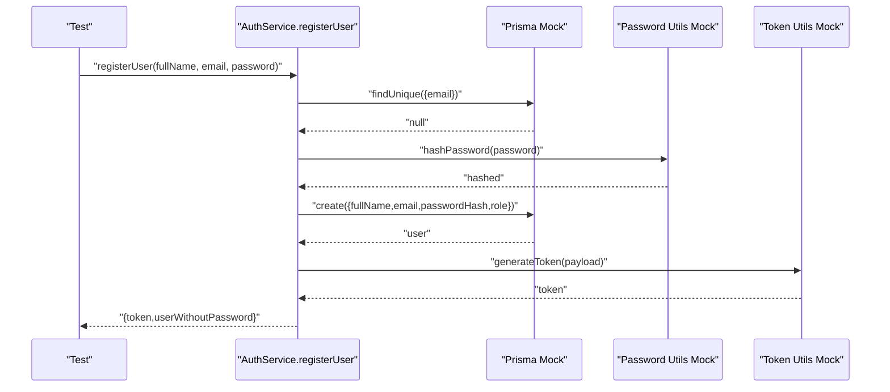
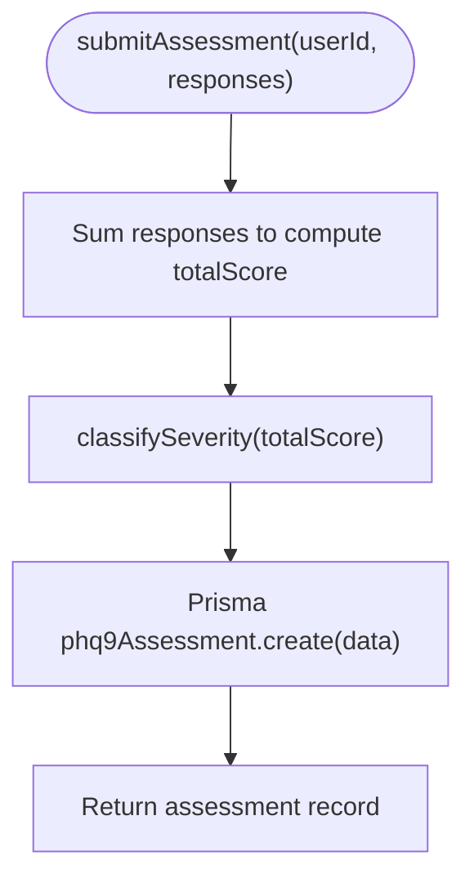
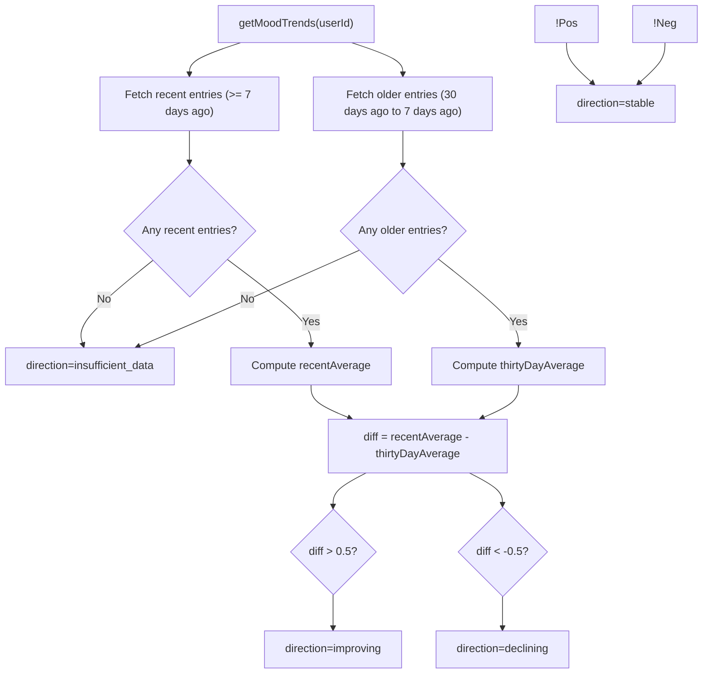
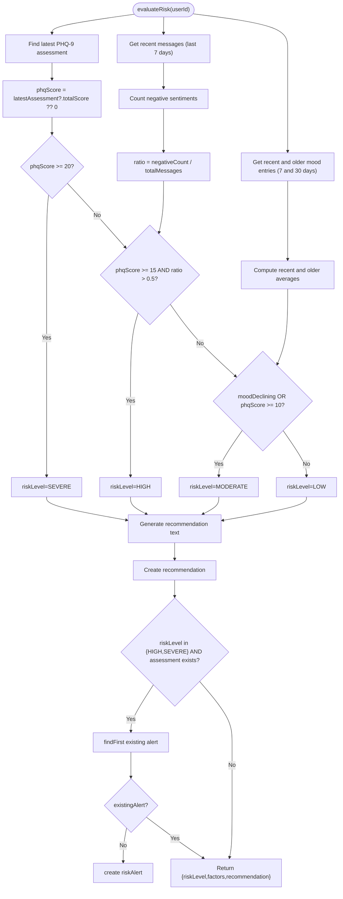
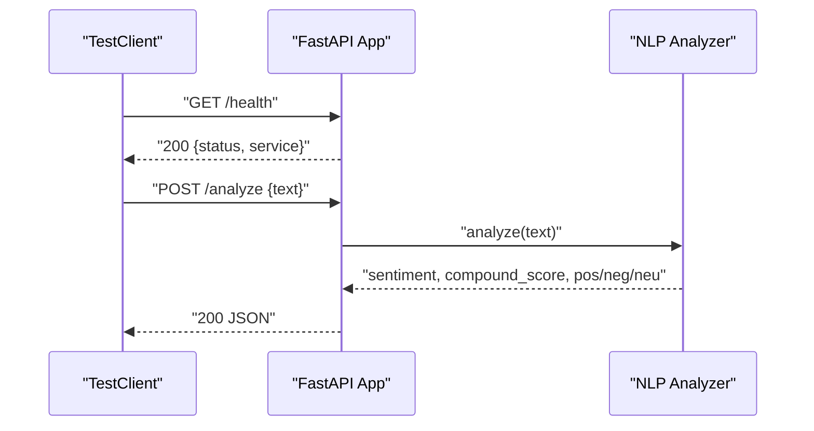
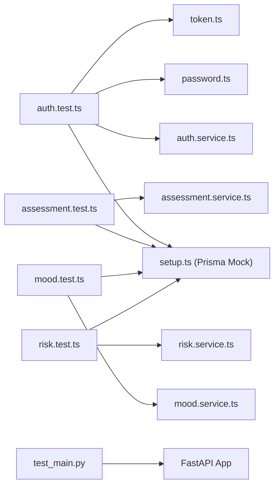

# Unit Testing

<cite>
**Referenced Files in This Document**
- [vitest.config.ts](file://server/vitest.config.ts)
- [package.json](file://server/package.json)
- [setup.ts](file://server/src/__tests__/setup.ts)
- [auth.test.ts](file://server/src/__tests__/auth.test.ts)
- [assessment.test.ts](file://server/src/__tests__/assessment.test.ts)
- [mood.test.ts](file://server/src/__tests__/mood.test.ts)
- [risk.test.ts](file://server/src/__tests__/risk.test.ts)
- [auth.service.ts](file://server/src/services/auth.service.ts)
- [assessment.service.ts](file://server/src/services/assessment.service.ts)
- [mood.service.ts](file://server/src/services/mood.service.ts)
- [risk.service.ts](file://server/src/services/risk.service.ts)
- [password.ts](file://server/src/utils/password.ts)
- [token.ts](file://server/src/utils/token.ts)
- [test_main.py](file://nlp-service/test_main.py)
- [requirements.txt](file://nlp-service/requirements.txt)
</cite>

## Table of Contents
1. [Introduction](#introduction)
2. [Project Structure](#project-structure)
3. [Core Components](#core-components)
4. [Architecture Overview](#architecture-overview)
5. [Detailed Component Analysis](#detailed-component-analysis)
6. [Dependency Analysis](#dependency-analysis)
7. [Performance Considerations](#performance-considerations)
8. [Troubleshooting Guide](#troubleshooting-guide)
9. [Conclusion](#conclusion)
10. [Appendices](#appendices)

## Introduction
This document provides a comprehensive guide to unit testing strategies for the project’s backend services. It covers the testing frameworks, setup, and patterns used for TypeScript services with Vitest and Python modules with pytest. The focus is on service-layer testing for authentication, assessments, mood tracking, and risk assessment, including mocking external dependencies, database stubs, and API integrations. It also documents test isolation, dependency injection patterns, test data management, assertion patterns, edge-case coverage, error conditions, asynchronous operations, and maintainability best practices.

## Project Structure
The repository includes:
- A TypeScript/Node.js backend under server with Vitest-based unit tests.
- An NLP microservice under nlp-service with pytest-based tests.
- Shared Prisma client mocking via a global setup file for TypeScript tests.

Key testing-related files:
- Vitest configuration for TypeScript tests.
- Global test setup to mock Prisma client and related utilities.
- Individual service tests for authentication, assessment, mood, and risk.
- Python tests for the NLP service using FastAPI TestClient.

**Diagram sources**
- [vitest.config.ts:1-10](file://server/vitest.config.ts#L1-L10)
- [package.json:6-12](file://server/package.json#L6-L12)
- [setup.ts:1-47](file://server/src/__tests__/setup.ts#L1-L47)
- [auth.test.ts:1-133](file://server/src/__tests__/auth.test.ts#L1-L133)
- [assessment.test.ts:1-156](file://server/src/__tests__/assessment.test.ts#L1-L156)
- [mood.test.ts:1-134](file://server/src/__tests__/mood.test.ts#L1-L134)
- [risk.test.ts:1-192](file://server/src/__tests__/risk.test.ts#L1-L192)
- [requirements.txt:1-6](file://nlp-service/requirements.txt#L1-L6)
- [test_main.py:1-56](file://nlp-service/test_main.py#L1-L56)

**Section sources**
- [vitest.config.ts:1-10](file://server/vitest.config.ts#L1-L10)
- [package.json:6-12](file://server/package.json#L6-L12)
- [setup.ts:1-47](file://server/src/__tests__/setup.ts#L1-L47)
- [requirements.txt:1-6](file://nlp-service/requirements.txt#L1-L6)

## Core Components
This section outlines the unit testing framework setup and patterns used across the project.

- Vitest configuration
  - Enables global test APIs, Node environment, and sets a 10-second timeout suitable for database and I/O-bound operations.
  - Located at [vitest.config.ts:1-10](file://server/vitest.config.ts#L1-L10).

- Package scripts
  - Provides commands to run tests and watch mode for rapid feedback.
  - Located at [package.json:6-12](file://server/package.json#L6-L12).

- Global test setup
  - Centralized Prisma client mocking for all tests via a setup module.
  - Mocks entities: user, conversation, message, moodEntry, phq9Assessment, recommendation, riskAlert.
  - Located at [setup.ts:1-47](file://server/src/__tests__/setup.ts#L1-L47).

- Utility mocking
  - Authentication tests mock password hashing/verification and JWT generation to isolate service logic from crypto and token concerns.
  - Located at [auth.test.ts:13-22](file://server/src/__tests__/auth.test.ts#L13-L22).

- Assertion patterns
  - Uses expect with objectContaining for partial object matching, arrayContaining for factor lists, and explicit property checks.
  - Examples: [auth.test.ts:53-62](file://server/src/__tests__/auth.test.ts#L53-L62), [risk.test.ts:75-78](file://server/src/__tests__/risk.test.ts#L75-L78).

- Edge case and error handling
  - Tests cover invalid credentials, duplicate emails, missing fields, empty inputs, insufficient data scenarios, and boundary classifications.
  - Examples: [auth.test.ts:78-84](file://server/src/__tests__/auth.test.ts#L78-L84), [assessment.test.ts:106-117](file://server/src/__tests__/assessment.test.ts#L106-L117), [mood.test.ts:111-131](file://server/src/__tests__/mood.test.ts#L111-L131), [risk.test.ts:168-179](file://server/src/__tests__/risk.test.ts#L168-L179).

**Section sources**
- [vitest.config.ts:1-10](file://server/vitest.config.ts#L1-L10)
- [package.json:6-12](file://server/package.json#L6-L12)
- [setup.ts:1-47](file://server/src/__tests__/setup.ts#L1-L47)
- [auth.test.ts:13-22](file://server/src/__tests__/auth.test.ts#L13-L22)
- [auth.test.ts:53-62](file://server/src/__tests__/auth.test.ts#L53-L62)
- [risk.test.ts:75-78](file://server/src/__tests__/risk.test.ts#L75-L78)
- [assessment.test.ts:106-117](file://server/src/__tests__/assessment.test.ts#L106-L117)
- [mood.test.ts:111-131](file://server/src/__tests__/mood.test.ts#L111-L131)
- [risk.test.ts:168-179](file://server/src/__tests__/risk.test.ts#L168-L179)

## Architecture Overview
The unit testing architecture separates concerns across:
- Test harness: Vitest for TypeScript, pytest for Python.
- Mock layer: Global Prisma mocking and utility mocking to replace external dependencies.
- Service layer: Business logic under test is isolated from persistence and third-party integrations.
- Assertion and validation: Explicit assertions on return values, side effects, and database calls.

**Diagram sources**
- [auth.service.ts:1-72](file://server/src/services/auth.service.ts#L1-L72)
- [assessment.service.ts:1-89](file://server/src/services/assessment.service.ts#L1-L89)
- [mood.service.ts:1-58](file://server/src/services/mood.service.ts#L1-L58)
- [risk.service.ts:1-138](file://server/src/services/risk.service.ts#L1-L138)
- [password.ts:1-12](file://server/src/utils/password.ts#L1-L12)
- [token.ts:1-17](file://server/src/utils/token.ts#L1-L17)
- [setup.ts:1-47](file://server/src/__tests__/setup.ts#L1-L47)
- [vitest.config.ts:1-10](file://server/vitest.config.ts#L1-L10)
- [test_main.py:1-56](file://nlp-service/test_main.py#L1-L56)

## Detailed Component Analysis

### Authentication Service Tests
Focuses on user registration and login flows, validating password hashing, credential verification, and JWT generation while ensuring database interactions are mocked.

- Test isolation
  - Prisma user table mocked globally; password utilities and token utility mocked per test file.
  - beforeEach clears mocks to avoid cross-test interference.
  - References: [setup.ts:1-47](file://server/src/__tests__/setup.ts#L1-L47), [auth.test.ts:1-35](file://server/src/__tests__/auth.test.ts#L1-L35).

- Assertion patterns
  - Verifies returned token presence and user shape excluding sensitive fields.
  - Confirms Prisma queries and utility calls were invoked with expected arguments.
  - References: [auth.test.ts:52-76](file://server/src/__tests__/auth.test.ts#L52-L76), [auth.test.ts:102-104](file://server/src/__tests__/auth.test.ts#L102-L104).

- Edge cases and errors
  - Duplicate email registration throws a conflict error.
  - Nonexistent email or incorrect password triggers unauthorized errors.
  - References: [auth.test.ts:78-84](file://server/src/__tests__/auth.test.ts#L78-L84), [auth.test.ts:107-113](file://server/src/__tests__/auth.test.ts#L107-L113), [auth.test.ts:115-129](file://server/src/__tests__/auth.test.ts#L115-L129).

**Diagram sources**
- [auth.test.ts:37-76](file://server/src/__tests__/auth.test.ts#L37-L76)
- [password.ts:5-7](file://server/src/utils/password.ts#L5-L7)
- [token.ts:10-12](file://server/src/utils/token.ts#L10-L12)

**Section sources**
- [auth.test.ts:1-133](file://server/src/__tests__/auth.test.ts#L1-L133)
- [setup.ts:1-47](file://server/src/__tests__/setup.ts#L1-L47)
- [password.ts:1-12](file://server/src/utils/password.ts#L1-L12)
- [token.ts:1-17](file://server/src/utils/token.ts#L1-L17)

### Assessment Service Tests
Validates PHQ-9 scoring and severity classification, ensuring correct totals and severity level assignments across boundary conditions.

- Mocking strategy
  - Prisma phq9Assessment mocked for create/find operations.
  - References: [assessment.test.ts:1-13](file://server/src/__tests__/assessment.test.ts#L1-L13).

- Boundary testing
  - Tests cover MINIMAL (0–4), MILD (5–9), MODERATE (10–14), MODERATELY_SEVERE (15–19), and SEVERE (20–27).
  - References: [assessment.test.ts:25-40](file://server/src/__tests__/assessment.test.ts#L25-L40), [assessment.test.ts:106-117](file://server/src/__tests__/assessment.test.ts#L106-L117), [assessment.test.ts:119-129](file://server/src/__tests__/assessment.test.ts#L119-L129), [assessment.test.ts:131-141](file://server/src/__tests__/assessment.test.ts#L131-L141), [assessment.test.ts:143-153](file://server/src/__tests__/assessment.test.ts#L143-L153).

**Diagram sources**
- [assessment.test.ts:20-33](file://server/src/__tests__/assessment.test.ts#L20-L33)
- [assessment.service.ts:12-18](file://server/src/services/assessment.service.ts#L12-L18)
- [assessment.service.ts:20-33](file://server/src/services/assessment.service.ts#L20-L33)

**Section sources**
- [assessment.test.ts:1-156](file://server/src/__tests__/assessment.test.ts#L1-L156)
- [assessment.service.ts:1-89](file://server/src/services/assessment.service.ts#L1-L89)

### Mood Service Tests
Tests mood entry creation and trend analysis, including average calculations and directional classification.

- Mocking strategy
  - Prisma moodEntry mocked for create and findMany operations.
  - References: [mood.test.ts:1-12](file://server/src/__tests__/mood.test.ts#L1-L12).

- Trend analysis logic
  - Compares recent (7-day) vs older (30-day) averages; classifies as improving (>0.5), declining (<-0.5), stable (≤0.5), or insufficient data if either window is empty.
  - References: [mood.test.ts:55-75](file://server/src/__tests__/mood.test.ts#L55-L75), [mood.test.ts:77-96](file://server/src/__tests__/mood.test.ts#L77-L96), [mood.test.ts:98-109](file://server/src/__tests__/mood.test.ts#L98-L109), [mood.test.ts:111-131](file://server/src/__tests__/mood.test.ts#L111-L131).

**Diagram sources**
- [mood.test.ts:54-132](file://server/src/__tests__/mood.test.ts#L54-L132)
- [mood.service.ts:22-57](file://server/src/services/mood.service.ts#L22-L57)

**Section sources**
- [mood.test.ts:1-134](file://server/src/__tests__/mood.test.ts#L1-L134)
- [mood.service.ts:1-58](file://server/src/services/mood.service.ts#L1-L58)

### Risk Service Tests
Evaluates risk level using PHQ-9 score thresholds, negative sentiment ratio, and mood trends, with recommendation and risk alert creation.

- Test helpers
  - setupMocks centralizes Prisma mocks for assessments, messages, moods, recommendations, and risk alerts.
  - References: [risk.test.ts:30-61](file://server/src/__tests__/risk.test.ts#L30-L61).

- Risk rules and edge cases
  - SEVERE if PHQ-9 ≥ 20; HIGH if PHQ-9 ≥ 15 and negative sentiment ratio > 50%; MODERATE otherwise based on PHQ-9 or declining mood trend.
  - Prevents duplicate risk alerts by checking for existing pending alerts.
  - References: [risk.test.ts:69-81](file://server/src/__tests__/risk.test.ts#L69-L81), [risk.test.ts:91-109](file://server/src/__tests__/risk.test.ts#L91-L109), [risk.test.ts:129-136](file://server/src/__tests__/risk.test.ts#L129-L136), [risk.test.ts:138-150](file://server/src/__tests__/risk.test.ts#L138-L150), [risk.test.ts:181-189](file://server/src/__tests__/risk.test.ts#L181-L189).

**Diagram sources**
- [risk.test.ts:30-61](file://server/src/__tests__/risk.test.ts#L30-L61)
- [risk.service.ts:11-107](file://server/src/services/risk.service.ts#L11-L107)

**Section sources**
- [risk.test.ts:1-192](file://server/src/__tests__/risk.test.ts#L1-L192)
- [risk.service.ts:1-138](file://server/src/services/risk.service.ts#L1-L138)

### NLP Service Tests (Python)
Validates the NLP microservice endpoints using FastAPI TestClient, focusing on health checks and sentiment analysis responses.

- TestClient usage
  - Instantiates a TestClient bound to the FastAPI app and asserts HTTP status codes and JSON payloads.
  - References: [test_main.py:1-5](file://nlp-service/test_main.py#L1-L5).

- Assertion patterns
  - Health endpoint checks service metadata and status.
  - Sentiment analysis validates classification and compound score bounds; handles validation errors for empty or missing fields.
  - References: [test_main.py:8-15](file://nlp-service/test_main.py#L8-L15), [test_main.py:17-37](file://nlp-service/test_main.py#L17-L37), [test_main.py:39-45](file://nlp-service/test_main.py#L39-L45), [test_main.py:47-56](file://nlp-service/test_main.py#L47-L56).

**Diagram sources**
- [test_main.py:8-56](file://nlp-service/test_main.py#L8-L56)

**Section sources**
- [test_main.py:1-56](file://nlp-service/test_main.py#L1-L56)
- [requirements.txt:1-6](file://nlp-service/requirements.txt#L1-L6)

## Dependency Analysis
This section maps how tests depend on services and mocks, and how mocks decouple tests from external systems.

**Diagram sources**
- [auth.test.ts:1-30](file://server/src/__tests__/auth.test.ts#L1-L30)
- [assessment.test.ts:1-17](file://server/src/__tests__/assessment.test.ts#L1-L17)
- [mood.test.ts:1-16](file://server/src/__tests__/mood.test.ts#L1-L16)
- [risk.test.ts:1-28](file://server/src/__tests__/risk.test.ts#L1-L28)
- [auth.service.ts:1-72](file://server/src/services/auth.service.ts#L1-L72)
- [assessment.service.ts:1-89](file://server/src/services/assessment.service.ts#L1-L89)
- [mood.service.ts:1-58](file://server/src/services/mood.service.ts#L1-L58)
- [risk.service.ts:1-138](file://server/src/services/risk.service.ts#L1-L138)
- [setup.ts:1-47](file://server/src/__tests__/setup.ts#L1-L47)
- [password.ts:1-12](file://server/src/utils/password.ts#L1-L12)
- [token.ts:1-17](file://server/src/utils/token.ts#L1-L17)
- [test_main.py:1-5](file://nlp-service/test_main.py#L1-L5)

**Section sources**
- [auth.test.ts:1-30](file://server/src/__tests__/auth.test.ts#L1-L30)
- [assessment.test.ts:1-17](file://server/src/__tests__/assessment.test.ts#L1-L17)
- [mood.test.ts:1-16](file://server/src/__tests__/mood.test.ts#L1-L16)
- [risk.test.ts:1-28](file://server/src/__tests__/risk.test.ts#L1-L28)
- [setup.ts:1-47](file://server/src/__tests__/setup.ts#L1-L47)

## Performance Considerations
- Use Vitest’s built-in mocking and global setup to minimize overhead during tests.
- Prefer deterministic mocks and controlled test data to avoid flaky tests.
- Keep database interactions mocked to prevent slow I/O-bound operations in unit tests.
- Group related tests by describe blocks to improve readability and reduce repeated setup costs.

## Troubleshooting Guide
Common issues and resolutions:
- Mocks not applied
  - Ensure global setup runs before tests and that beforeEach clears mocks.
  - Verify vi.mock calls precede imports in test files.
  - References: [setup.ts:1-47](file://server/src/__tests__/setup.ts#L1-L47), [auth.test.ts:1-35](file://server/src/__tests__/auth.test.ts#L1-L35).

- Assertion failures on return shapes
  - Use expect.objectContaining for partial object matching and avoid asserting on internal fields.
  - References: [auth.test.ts:53-62](file://server/src/__tests__/auth.test.ts#L53-L62), [risk.test.ts:75-78](file://server/src/__tests__/risk.test.ts#L75-L78).

- Asynchronous operation timeouts
  - Increase testTimeout in Vitest config if necessary for slower environments.
  - References: [vitest.config.ts:4-8](file://server/vitest.config.ts#L4-L8).

- Python test client issues
  - Confirm TestClient is initialized with the correct app instance and that endpoints are reachable.
  - References: [test_main.py:1-5](file://nlp-service/test_main.py#L1-L5).

**Section sources**
- [setup.ts:1-47](file://server/src/__tests__/setup.ts#L1-L47)
- [auth.test.ts:1-35](file://server/src/__tests__/auth.test.ts#L1-L35)
- [auth.test.ts:53-62](file://server/src/__tests__/auth.test.ts#L53-L62)
- [risk.test.ts:75-78](file://server/src/__tests__/risk.test.ts#L75-L78)
- [vitest.config.ts:4-8](file://server/vitest.config.ts#L4-L8)
- [test_main.py:1-5](file://nlp-service/test_main.py#L1-L5)

## Conclusion
The project employs robust unit testing strategies:
- TypeScript tests leverage Vitest with centralized Prisma and utility mocking for isolation and reliability.
- Python tests use pytest and FastAPI TestClient for API-level validations.
- Comprehensive coverage includes boundary conditions, error handling, and asynchronous flows.
- Best practices such as test organization, assertion patterns, and maintainability are consistently applied across components.

## Appendices
- Test organization and naming conventions
  - Group tests by feature/service using describe blocks.
  - Name test cases descriptively to reflect behavior and expected outcomes.
  - Keep test files aligned with service modules for easy navigation.

- Dependency injection patterns
  - Use global mocks to inject dependencies and avoid real database or network calls.
  - For utilities, mock pure functions to control inputs and outputs deterministically.

- Test data management
  - Prefer small, deterministic datasets for trend computations and classification boundaries.
  - Use helper functions (as seen in risk tests) to configure mocks consistently across scenarios.