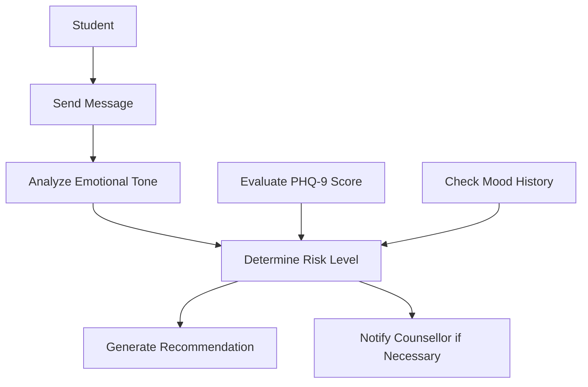
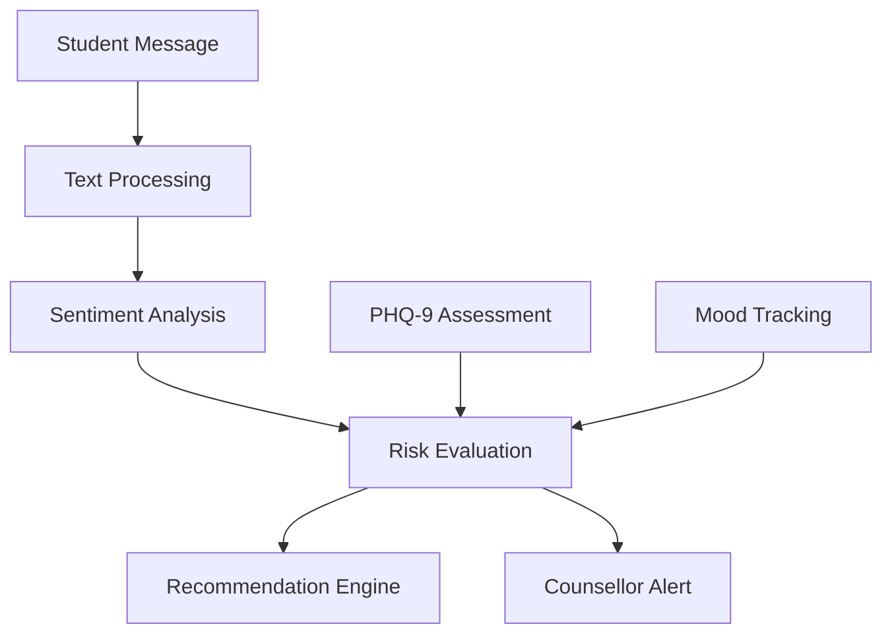
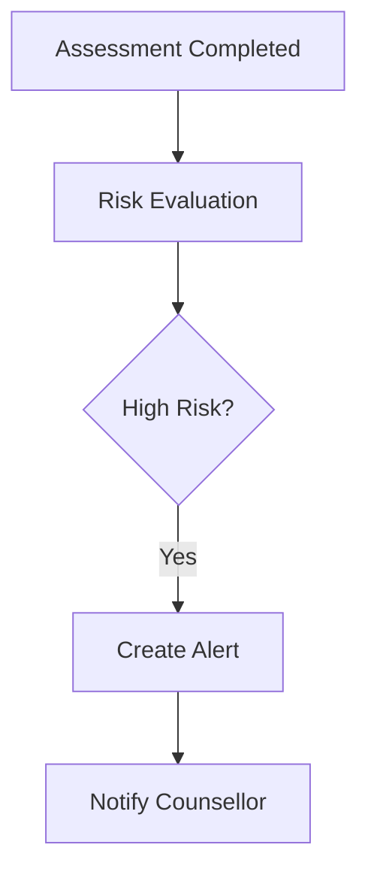

# BuddyAI AI Model Documentation

## 1. Introduction

BuddyAI is an AI-powered mental health support system designed to help students experiencing symptoms of depression. The system analyzes student interactions, evaluates depression severity, monitors emotional well-being, and provides personalized support recommendations.

Rather than replacing professional counsellors, BuddyAI acts as an early support and screening tool. It helps identify students who may require additional attention and, when necessary, alerts a counsellor for further intervention.

---

## 2. How BuddyAI Works (Simple Explanation)

The easiest way to understand BuddyAI is to think of it as a digital support assistant that listens to students, evaluates their emotional state, and decides whether additional support is needed.

The system performs four main tasks:

1. Listen to what the student says.
2. Analyze the emotional tone of the message.
3. Assess depression severity using PHQ-9.
4. Provide recommendations or alert a counsellor if necessary.

### Example Scenario

Suppose a student sends the following message:

```text
I feel exhausted every day and I don't enjoy doing things anymore.
```

BuddyAI processes the message and determines whether the emotional tone is positive, neutral, or negative.

At the same time, the student may complete a PHQ-9 assessment and record their mood.

The system then combines:

- The student's message
- The sentiment analysis result
- The PHQ-9 score
- The mood history

Using this information, BuddyAI decides:

- Whether the student is at low, moderate, high, or severe risk
- Which recommendations should be provided
- Whether a counsellor should be notified

### BuddyAI Decision Flow



### Simple Analogy

Think of BuddyAI as a digital health assistant.

When a student speaks:

- BuddyAI listens.
- BuddyAI checks whether the student sounds emotionally distressed.
- BuddyAI checks assessment results.
- BuddyAI looks at mood patterns.
- BuddyAI decides whether the student appears okay or may need additional support.
- If the situation is serious, a counsellor is informed.

---

## 3. AI Architecture Overview

BuddyAI uses a hybrid intelligence approach that combines:

- Natural Language Processing (NLP)
- Sentiment Analysis
- PHQ-9 Depression Assessment
- Mood Monitoring
- Rule-Based Decision Making

Unlike traditional machine learning systems that require large datasets and extensive model training, BuddyAI uses a pre-trained sentiment analysis model together with clinically validated assessment techniques.

### AI Architecture Diagram



---

## 4. AI and Data Processing Workflow

BuddyAI processes information through a series of stages.

### Stage 1: Student Interaction

The student interacts with the system by:

- Sending messages
- Completing PHQ-9 assessments
- Recording mood entries

These interactions become the primary data used by the system.

### Stage 2: Message Processing

The system prepares the student's message for analysis by cleaning and organizing the text.

Example:

**Input**

```text
I feel exhausted and hopeless lately.
```

**Processed Text**

```text
feel exhausted hopeless lately
```

### Stage 3: Sentiment Analysis

The emotional tone of the message is analyzed.

Possible outcomes:

- Positive
- Neutral
- Negative

Example:

```text
I don't enjoy anything anymore.
```

Result:

```text
Negative Sentiment
```

### Stage 4: PHQ-9 Assessment Processing

The student's PHQ-9 responses are scored and classified into a depression severity category.

### Stage 5: Mood Trend Analysis

The system examines previous mood records to determine whether the student's emotional state is improving, stable, or declining.

### Stage 6: Risk Evaluation

The system combines:

- Sentiment Analysis
- PHQ-9 Results
- Mood Trends

to determine the student's risk level.

### Stage 7: Recommendation Generation

Appropriate support recommendations are generated.

### Stage 8: Counsellor Alert

If the risk level is High or Severe, an alert is created for counsellor review.

---

## 5. Natural Language Processing (NLP)

### Purpose

Natural Language Processing allows BuddyAI to understand written text provided by students.

### Tasks Performed

- Text cleaning
- Tokenization
- Stop-word removal
- Text normalization

### Example

Input:

```text
I feel exhausted and hopeless lately.
```

Output:

```text
["feel", "exhausted", "hopeless", "lately"]
```

---

## 6. Sentiment Analysis Model

BuddyAI uses the VADER Sentiment Analyzer from the NLTK library.

### Purpose

Determine whether a student's message expresses positive, neutral, or negative emotions.

### Example

Input:

```text
I don't enjoy doing anything anymore.
```

Output:

```text
Negative Sentiment
```

### Classification Rules

| Compound Score | Classification |
|---------------|---------------|
| ≥ 0.05 | Positive |
| -0.05 to 0.05 | Neutral |
| ≤ -0.05 | Negative |

---

## 7. PHQ-9 Assessment Engine

The PHQ-9 is the primary depression assessment framework used within BuddyAI.

### Severity Classification

| Score | Severity |
|---------|----------|
| 0 – 4 | Minimal |
| 5 – 9 | Mild |
| 10 – 14 | Moderate |
| 15 – 19 | Moderately Severe |
| 20 – 27 | Severe |

---

## 8. Mood Tracking Engine

Students can regularly record their emotional state.

### Mood Scale

| Rating | Description |
|----------|-------------|
| 1 | Very Poor |
| 2 | Poor |
| 3 | Neutral |
| 4 | Good |
| 5 | Excellent |

---

## 9. Risk Evaluation Engine

The Risk Evaluation Engine combines all available information to determine the student's risk level.

### Inputs

- Sentiment Analysis Results
- PHQ-9 Score
- Mood History

### Outputs

- Low Risk
- Moderate Risk
- High Risk
- Severe Risk

### Example Rules

```text
PHQ-9 >= 20
→ Severe Risk

PHQ-9 >= 15 and Negative Sentiment
→ High Risk

PHQ-9 < 10
→ Low Risk
```

---

## 10. Recommendation Engine

The Recommendation Engine generates support recommendations based on the identified risk level.

### Examples

| Risk Level | Action |
|------------|---------|
| Low | Self-help resources |
| Moderate | Wellness recommendations |
| High | Counselling recommendation |
| Severe | Immediate counsellor alert |

---

## 11. Counsellor Alert Mechanism

When a student is identified as High Risk or Severe Risk, BuddyAI creates a risk alert for counsellor review.

### Workflow



---

## 12. Limitations

- BuddyAI is not a medical diagnostic tool.
- Results depend on honest user input.
- Sentiment analysis may not capture all emotional nuances.
- Human counsellors remain essential for severe cases.

---

## 13. Future Enhancements

- Deep learning-based emotion detection
- Voice sentiment analysis
- Real-time counsellor communication
- Multilingual support
- Advanced predictive risk models
