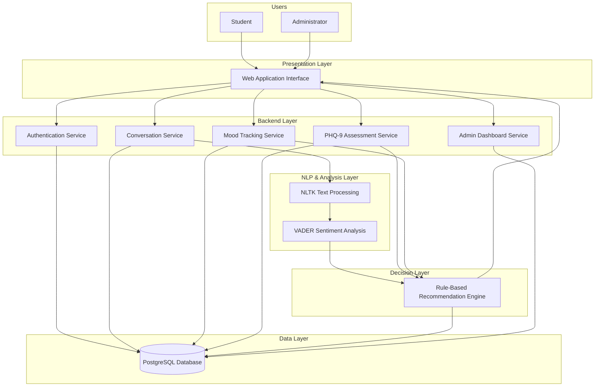
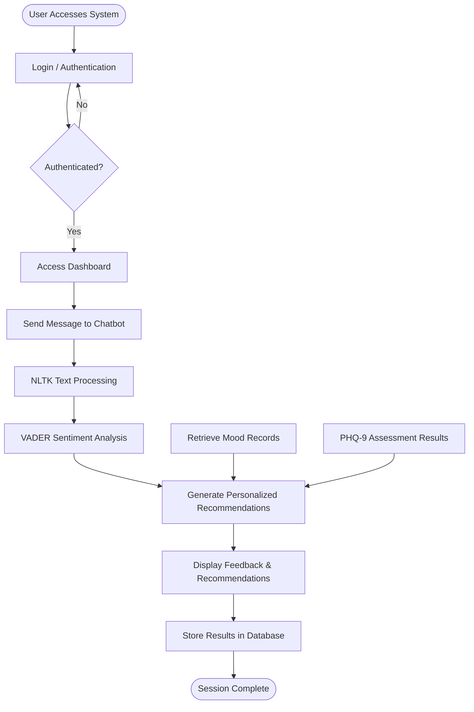
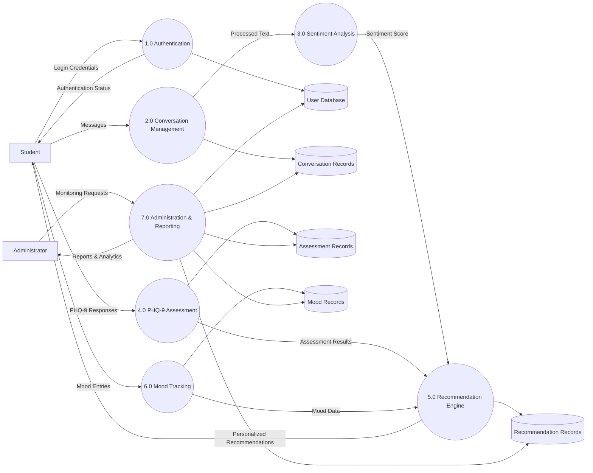
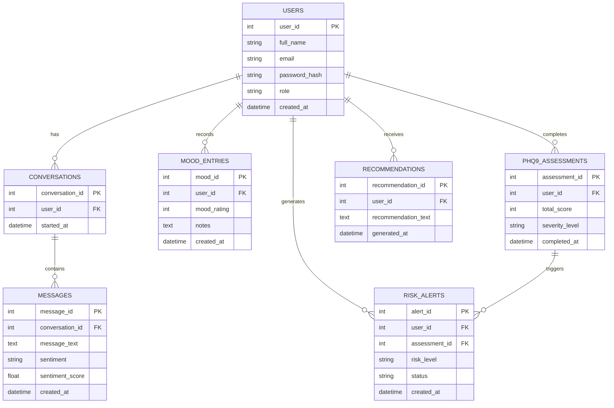
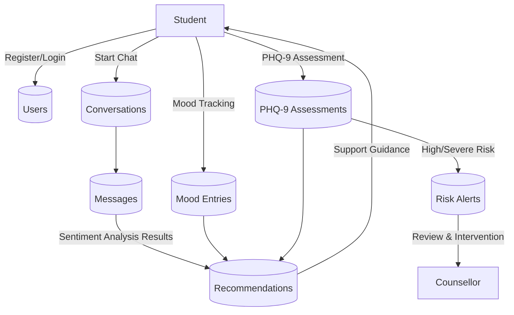

# BuddyAI

### AI-Based System for Supporting Students with Depression in Tertiary Institutions
## Overview
BuddyAI is an AI-powered mental health support system designed to assist students in tertiary institutions who may be experiencing symptoms of depression. The system leverages Natural Language Processing (NLP), sentiment analysis, mood monitoring, and the Patient Health Questionnaire (PHQ-9) framework to identify potential signs of depression and provide timely support resources.

The primary objective of the system is not to replace professional mental health practitioners but to serve as an early intervention and support tool that encourages students to seek appropriate assistance when needed.

## Problem Statement
Depression is one of the most common mental health challenges affecting students in tertiary institutions. Academic pressure, financial difficulties, social isolation, and personal challenges often contribute to emotional distress among students. Unfortunately, many students do not seek professional help due to stigma, lack of awareness, limited access to counseling services, or delayed recognition of their symptoms.

BuddyAI addresses this challenge by providing:

- Early detection of depressive symptoms
- Continuous emotional monitoring
- Personalized support recommendations
- Easy access to mental health resources
- Referral guidance for professional intervention when necessary

### Main Objective
To develop an AI-based system capable of supporting students experiencing symptoms of depression through intelligent conversational interaction and mood assessment.

### Specific Objectives
- Develop a conversational AI capable of interacting with students naturally
- Implement sentiment analysis for emotional state detection
- Integrate PHQ-9-based depression assessment
- Monitor mood trends over time
- Generate depression risk assessments
- Provide personalized coping recommendations
- Facilitate referrals to counseling services when necessary
- Maintain secure storage of student interaction records

---

## 2 Key Features

### User Authentication

- Student Registration
- Secure Login
- Password Management
- Session Management

### Conversational AI Support

- Natural language conversations
- Emotional expression analysis
- Mental wellness check-ins
- Context-aware responses

### Sentiment Analysis Engine

- Detection of positive emotions
- Detection of neutral emotions
- Detection of negative emotions
- Sentiment score generation

### Depression Assessment

- PHQ-9 questionnaire integration
- Automated scoring
- Depression severity classification

### Mood Tracking

- Daily mood logging
- Mood history visualization
- Mood trend analysis

### Recommendation System

- Personalized self-help suggestions
- Mental wellness tips
- Stress management techniques
- Referral recommendations

### Administrative Dashboard

- User management
- System monitoring
- Assessment statistics
- Report generation

---

## 3. Technology Stack

BuddyAI is built using a modern technology stack that supports conversational interaction, sentiment analysis, depression assessment, and mood monitoring.

### Frontend
- **Next.js** – Web application framework
- **React.js** – User interface development
- **TypeScript** – Type-safe application development
- **Tailwind CSS** – Responsive design and styling
- **ShadCN UI** – Reusable UI components

### Backend
- **Node.js** – Server-side runtime environment
- **Express.js** – RESTful API development
- **TypeScript** – Backend application development

### Natural Language Processing (NLP)
- **NLTK** – Text preprocessing and language processing
- **VADER Sentiment Analyzer** – Pre-trained sentiment analysis model

### Depression Assessment
- **PHQ-9 Framework** – Depression severity assessment and scoring

### Database
- **PostgreSQL** – Relational database management system
- **Prisma ORM** – Database access and query management

### Authentication & Security
- **JWT (JSON Web Tokens)** – Secure user authentication
- **bcrypt** – Password hashing and encryption
- **Role-Based Access Control (RBAC)** – Access management and authorization

### Development Tools
- **Git** – Version control
- **GitHub** – Source code management
- **Postman** – API testing
- **Visual Studio Code** – Development environment

---
## 4. System Architecture Overview

BuddyAI adopts a **multi-tier intelligent system architecture** that separates user interaction, application processing, artificial intelligence services, and data management. This architecture promotes **scalability, maintainability, security, and modular development**, while ensuring that the system can effectively support students experiencing symptoms of depression.

At the **Presentation Layer**, students and administrators interact with the system through a web-based application. The interface provides access to core functionalities such as:

- User registration and authentication
- Conversational mental health support
- PHQ-9 depression assessments
- Mood tracking and monitoring
- Personalized recommendations
- Administrative monitoring and reporting

The **Backend Application Layer** serves as the central processing unit of the system. It manages all business logic and coordinates communication between the user interface, artificial intelligence components, and database services.

This layer is responsible for:

- User authentication and authorization
- Conversation management
- Mood tracking operations
- PHQ-9 assessment processing
- Recommendation generation
- Administrative functions
- Database communication

The **Natural Language Processing (NLP) Layer** acts as the system's conversational intelligence component. User messages are processed using NLP techniques to extract meaningful information from textual conversations.

The NLP process includes:

- Text preprocessing
- Tokenization
- Stop-word removal
- Text normalization
- Sentiment extraction

After preprocessing, the text is analyzed using the **VADER Sentiment Analyzer**, a pre-trained sentiment analysis model that determines the emotional tone of user messages.

The sentiment analysis component classifies user input as:

- Positive
- Neutral
- Negative

It also generates sentiment scores that help identify potential emotional distress and support subsequent depression risk assessment.

The **Depression Assessment Layer** combines sentiment analysis results with responses obtained through the **PHQ-9 assessment framework**. The PHQ-9 questionnaire evaluates nine recognized symptoms of depression and generates a severity score based on the student's responses.

Based on the calculated PHQ-9 score, the system categorizes depression severity into:

- Minimal Depression
- Mild Depression
- Moderate Depression
- Moderately Severe Depression
- Severe Depression

The **Recommendation Engine** utilizes assessment outcomes, sentiment scores, and mood history to generate personalized support recommendations. This component applies predefined decision rules to provide relevant guidance and mental wellness resources.

Based on the student's condition, the system may:

- Provide self-help recommendations
- Suggest stress management techniques
- Encourage positive coping strategies
- Recommend counseling services
- Advise professional mental health consultation when necessary

The **Data Layer** is responsible for persistent storage and management of all system information.

This layer stores:

- User accounts and profiles
- Conversation histories
- Mood tracking records
- PHQ-9 assessment results
- Sentiment analysis outcomes
- Generated recommendations
- Administrative logs

This ensures data consistency, historical tracking, and reliable reporting across the platform.

### Data Flow

Student interactions enter the system through the web interface. User messages are forwarded to the NLP Layer, where textual data is preprocessed and analyzed using the VADER Sentiment Analyzer. The resulting sentiment scores are combined with PHQ-9 assessment responses and mood records to evaluate the student's emotional well-being.

The Recommendation Engine then generates personalized support suggestions based on the assessment results. All interactions, assessments, mood logs, and recommendations are stored in the database and made available through the user dashboard and administrative interface.

Overall, this architecture enables BuddyAI to provide **intelligent mental health support, early depression detection, personalized recommendations, and continuous mood monitoring**, while maintaining a clear separation between presentation, application processing, artificial intelligence services, and data storage.

### 🏗️ System Architecture Diagram

## 5. System Flow (Runtime Behavior)

The runtime behavior of BuddyAI describes how user interactions are processed throughout the system, from initial authentication to sentiment analysis, depression assessment, recommendation generation, and data storage.

When a student accesses the platform, they must first authenticate themselves through the login system. Once authenticated, the student can interact with the chatbot, complete PHQ-9 assessments, and track their mood over time.

During conversational interactions, user messages are processed by the NLP component, where the text is cleaned, tokenized, and prepared for sentiment analysis. The VADER Sentiment Analyzer evaluates the emotional tone of the message and generates sentiment scores that indicate whether the user's emotional state is positive, neutral, or negative.

The sentiment analysis results are combined with PHQ-9 assessment responses and mood tracking records to evaluate the student's overall mental well-being. The Recommendation Engine then applies predefined decision rules to generate personalized support suggestions and wellness recommendations.

All interactions, assessments, sentiment scores, mood records, and recommendations are stored in the database for future reference and trend monitoring.

### Runtime Workflow Diagram

### Runtime Process Summary
1. The student logs into the BuddyAI platform.
2. The system validates user credentials.
3. The student initiates a conversation with the chatbot.
4. User messages are processed using NLP techniques.
5. VADER performs sentiment analysis and generates sentiment scores.
6. The system retrieves relevant PHQ-9 assessment results and mood history.
7. The Recommendation Engine evaluates all available information.
8. Personalized mental health support recommendations are generated.
9. Results are displayed to the student.
10. All interaction data is stored in the database for future monitoring and analysis.

This runtime workflow ensures that BuddyAI continuously monitors student well-being, provides timely support, and maintains a history of interactions for long-term mental health tracking.

---

## 6. Data Flow Diagram (DFD) – Level 1

The Level 1 Data Flow Diagram (DFD) illustrates how data moves through the major functional components of BuddyAI. It shows the interaction between external entities, system processes, and the database.

The primary external entity is the **Student**, who interacts with the system through conversations, mood tracking, and PHQ-9 assessments. The **Administrator** oversees user activities and system reports.

The system processes user inputs through authentication, conversation management, sentiment analysis, depression assessment, and recommendation generation. The resulting information is stored within the central database and made available for future monitoring and reporting.

### DFD Level 1 Diagram

### Data Flow Summary

1. The student authenticates through the Authentication Process.
2. User credentials are validated and stored in the User Database.
3. Student conversations are processed through the Conversation Management module.
4. Conversation text is forwarded to the Sentiment Analysis module for emotional evaluation.
5. Students complete PHQ-9 assessments, which are stored and scored.
6. Students submit mood entries through the Mood Tracking module.
7. Sentiment scores, PHQ-9 results, and mood data are combined within the Recommendation Engine.
8. Personalized recommendations and support suggestions are generated and presented to the student.
9. All relevant records are stored in their respective data stores.
10. Administrators access reports and analytics through the Administration & Reporting module.

This DFD Level 1 provides a high-level representation of how information flows through BuddyAI while highlighting the major processes responsible for supporting student mental health monitoring and intervention.

---

## 7. Database Design

The BuddyAI database is designed using a **relational database model** to ensure efficient storage, retrieval, and management of student mental health data. The database supports user management, conversational interactions, sentiment analysis results, mood tracking, PHQ-9 assessments, personalized recommendations, and counsellor intervention workflows.

The database is implemented using **PostgreSQL** and managed through **Prisma ORM**.

---

## Core Database Entities

The major entities within the system include:

- Users
- Conversations
- Messages
- Mood Entries
- PHQ-9 Assessments
- Recommendations
- Risk Alerts

---

## Entity Relationship Diagram (ERD)

---

## Database Tables

### Users Table

Stores information for both students and counsellors.

| Field | Data Type | Description |
|---------|-----------|-------------|
| user_id | INT (PK) | Unique user identifier |
| full_name | VARCHAR | Full name |
| email | VARCHAR | Email address |
| password_hash | VARCHAR | Encrypted password |
| role | VARCHAR | STUDENT or COUNSELLOR |
| created_at | TIMESTAMP | Account creation date |

---

### Conversations Table

Stores chatbot conversation sessions.

| Field | Data Type | Description |
|---------|-----------|-------------|
| conversation_id | INT (PK) | Unique conversation identifier |
| user_id | INT (FK) | Associated student |
| started_at | TIMESTAMP | Conversation start time |

---

### Messages Table

Stores conversation messages and sentiment analysis results.

| Field | Data Type | Description |
|---------|-----------|-------------|
| message_id | INT (PK) | Unique message identifier |
| conversation_id | INT (FK) | Associated conversation |
| message_text | TEXT | Message content |
| sentiment | VARCHAR | Positive, Neutral, Negative |
| sentiment_score | FLOAT | VADER sentiment score |
| created_at | TIMESTAMP | Message timestamp |

---

### Mood Entries Table

Stores student mood tracking records.

| Field | Data Type | Description |
|---------|-----------|-------------|
| mood_id | INT (PK) | Unique mood record |
| user_id | INT (FK) | Associated student |
| mood_rating | INT | Mood rating value |
| notes | TEXT | Optional notes |
| created_at | TIMESTAMP | Entry timestamp |

---

### PHQ-9 Assessments Table

Stores depression assessment results.

| Field | Data Type | Description |
|---------|-----------|-------------|
| assessment_id | INT (PK) | Unique assessment identifier |
| user_id | INT (FK) | Associated student |
| total_score | INT | PHQ-9 total score |
| severity_level | VARCHAR | Depression severity category |
| completed_at | TIMESTAMP | Assessment completion date |

---

### Recommendations Table

Stores personalized recommendations generated by BuddyAI.

| Field | Data Type | Description |
|---------|-----------|-------------|
| recommendation_id | INT (PK) | Unique recommendation identifier |
| user_id | INT (FK) | Associated student |
| recommendation_text | TEXT | Generated recommendation |
| generated_at | TIMESTAMP | Recommendation generation date |

---

### Risk Alerts Table

Stores high-risk and severe-risk cases that require counsellor attention.

| Field | Data Type | Description |
|---------|-----------|-------------|
| alert_id | INT (PK) | Unique alert identifier |
| user_id | INT (FK) | Associated student |
| assessment_id | INT (FK) | Triggering assessment |
| risk_level | VARCHAR | HIGH or SEVERE |
| status | VARCHAR | Pending, Reviewed, Resolved |
| created_at | TIMESTAMP | Alert creation date |

---

## Database Relationships

- One User can have many Conversations.
- One Conversation can contain many Messages.
- One User can have many Mood Entries.
- One User can complete many PHQ-9 Assessments.
- One User can receive many Recommendations.
- One User can generate many Risk Alerts.
- One PHQ-9 Assessment can trigger a Risk Alert.
- Each Message belongs to one Conversation.
- Each Conversation belongs to one User.

---

## Database Workflow

The database workflow begins when a student registers and creates an account within the system. User information is stored in the **Users** table and used for authentication and authorization.

When the student interacts with BuddyAI, a new conversation session is created in the **Conversations** table. Individual messages exchanged during the session are stored in the **Messages** table together with the sentiment classification and sentiment score generated by the VADER Sentiment Analyzer.

Students can record their emotional state through mood tracking. Each mood submission is stored in the **Mood Entries** table, creating a historical record of emotional well-being over time.

When a student completes a PHQ-9 assessment, the responses are evaluated and the final score along with the depression severity classification is stored in the **PHQ-9 Assessments** table.

The Recommendation Engine analyzes the student's sentiment scores, mood history, and PHQ-9 results to generate personalized mental health recommendations. These recommendations are stored in the **Recommendations** table.

If the assessment results indicate a **High Risk** or **Severe Risk** condition, the system automatically creates a record in the **Risk Alerts** table. These alerts are made available to counsellors for review and potential intervention.

This workflow ensures that all student interactions, assessments, recommendations, and intervention records are securely maintained for continuous monitoring and support.

---

## Database Workflow Diagram

---

## Database Design Summary

The BuddyAI database provides a structured foundation for managing student mental health support activities. It supports user authentication, conversational interactions, sentiment analysis, mood monitoring, depression assessments, personalized recommendations, and counsellor intervention. The relational design ensures data consistency, scalability, and efficient retrieval of historical records necessary for monitoring student well-being over time.

---

## 8. Roles & Permissions

BuddyAI supports two primary user roles: **Student** and **Counsellor**. Each role has specific permissions designed to ensure secure access control, user privacy, and effective mental health support.

### Student

Students are the primary users of the system and can access the following features:

- Register and login to the platform
- Interact with the BuddyAI chatbot
- Complete PHQ-9 depression assessments
- Record daily mood entries
- View mood history and trends
- Receive personalized recommendations
- Access mental health resources
- View personal assessment history

### Counsellor

Counsellors serve as the human intervention layer within the system and are responsible for monitoring high-risk cases identified by BuddyAI.

Counsellors can:

- Login to the platform
- View flagged high-risk and severe-risk cases
- Review student assessment summaries
- Monitor mood trends of flagged students
- View risk alert records
- Update alert status (Pending, Reviewed, Resolved)
- Generate monitoring and intervention reports

### Permissions Matrix

| Feature | Student | Counsellor |
|----------|----------|------------|
| Register Account | ✓ | ✗ |
| Login | ✓ | ✓ |
| Chat with BuddyAI | ✓ | ✗ |
| Complete PHQ-9 Assessment | ✓ | ✗ |
| Record Mood Entries | ✓ | ✗ |
| View Personal History | ✓ | ✗ |
| Receive Recommendations | ✓ | ✗ |
| View Risk Alerts | ✗ | ✓ |
| Review Flagged Cases | ✗ | ✓ |
| Update Alert Status | ✗ | ✓ |
| Generate Reports | ✗ | ✓ |

---

## 9. Evaluation Metrics

The effectiveness of BuddyAI is evaluated using a combination of sentiment analysis performance, assessment accuracy, system functionality, and user experience metrics.

### Sentiment Analysis Metrics

The VADER Sentiment Analyzer evaluates user messages and generates sentiment classifications based on emotional tone.

The following metrics may be used to assess sentiment analysis performance:

- Accuracy
- Precision
- Recall
- F1-Score

### PHQ-9 Assessment Evaluation

The PHQ-9 framework is a clinically validated depression screening instrument used to determine depression severity levels.

Assessment outputs are evaluated based on:

- Correct PHQ-9 score calculation
- Accurate severity classification
- Consistent assessment processing

### System Performance Metrics

The overall system performance is evaluated using:

| Metric | Description |
|----------|------------|
| Response Time | Time required to process user requests |
| System Availability | Percentage of uptime during operation |
| Database Query Time | Time required to retrieve stored records |
| Recommendation Generation Time | Time required to generate recommendations |

### User Experience Metrics

The usability of the platform can be evaluated through user testing and feedback.

Key indicators include:

- Ease of use
- Interface responsiveness
- User satisfaction
- Assessment completion rate
- Mood tracking engagement rate

### Risk Detection Metrics

The effectiveness of the risk evaluation mechanism can be measured through:

- Number of high-risk cases detected
- Number of severe-risk cases flagged
- Accuracy of risk classification
- Counsellor intervention rate

### Evaluation Summary

BuddyAI is evaluated across four major dimensions:

1. Sentiment Analysis Performance
2. PHQ-9 Assessment Accuracy
3. System Performance and Reliability
4. User Engagement and Risk Detection

These metrics help determine the effectiveness of the system in providing timely support, identifying students at risk of depression, and facilitating appropriate intervention when necessary.

---
## Machine Learning Component

### Model Purpose

The machine learning model is designed to identify depressive tendencies from user responses and sentiment patterns.

### Input Features

The model utilizes:

- PHQ-9 responses
- Sentiment scores
- Mood ratings
- Interaction frequency
- Emotional indicators

### Output

The model predicts the following depression severity levels:

- Minimal Depression
- Mild Depression
- Moderate Depression
- Moderately Severe Depression
- Severe Depression

### Evaluation Metrics

The model is evaluated using:

- Accuracy
- Precision
- Recall
- F1-Score

---

## PHQ-9 Assessment Framework

The Patient Health Questionnaire-9 (PHQ-9) serves as the primary assessment instrument within the system.

The PHQ-9 evaluates nine symptoms associated with depression over the previous two weeks and provides a standardized method for assessing depression severity.

### Depression Severity Categories

| PHQ-9 Score | Severity |
|------------|----------|
| 0 – 4 | Minimal Depression |
| 5 – 9 | Mild Depression |
| 10 – 14 | Moderate Depression |
| 15 – 19 | Moderately Severe Depression |
| 20 – 27 | Severe Depression |

---

## Security and Privacy

Because the system handles sensitive user information, several security measures are implemented:

- Password hashing
- JWT authentication
- Secure API communication
- Input validation
- Data encryption
- Role-based access control (RBAC)

---

## Ethical Considerations

BuddyAI is designed as a support tool and not a diagnostic medical system.

Important considerations include:

- User consent before assessments
- Protection of user privacy
- Transparency regarding AI-generated recommendations
- Encouragement of professional mental health consultation when required

## Future Improvements
Planned enhancements include:
- Mobile application development
- Voice-based emotional analysis
- Real-time counselor integration
- Multilingual support
- Advanced deep learning models
- Emergency risk detection

---
## Research Contribution
This study contributes to the growing field of Artificial Intelligence in Mental Health by demonstrating how AI technologies can assist in the early detection and support of students experiencing symptoms of depression in tertiary institutions.

---

## Disclaimer
BuddyAI does not provide medical diagnoses and should not be used as a replacement for professional mental health services.
Users experiencing severe emotional distress are strongly encouraged to seek assistance from qualified mental health professionals, counselors, healthcare providers, or emergency services.
